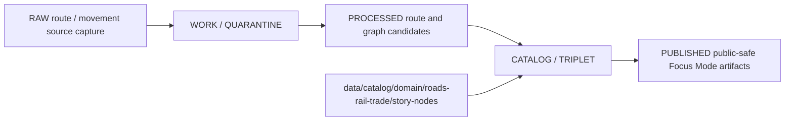

<!-- [KFM_META_BLOCK_V2]
doc_id: kfm://doc/data-catalog-domain-roads-rail-trade-story-nodes-readme
title: data/catalog/domain/roads-rail-trade/story-nodes/README.md — Roads/Rail/Trade Story Nodes Catalog README
version: v0.1
type: readme; data-lifecycle-sublane; domain-catalog-sublane-guide
status: draft; PROPOSED; data-root; catalog-stage; roads-rail-trade; story-nodes; release-gated; evidence-subordinate
owners: OWNER_TBD — Roads/Rail/Trade steward · Trade-routes steward · Focus Mode steward · Data steward · Catalog steward · Evidence steward · Policy steward · Release steward · Docs steward
created: NEEDS VERIFICATION — blank placeholder existed before v0.1 expansion
updated: 2026-06-24
policy_label: public-doc; data; catalog; roads-rail-trade; story-nodes; lifecycle; release-gated; evidence-subordinate
tags: [kfm, data, catalog, roads-rail-trade, story-nodes, movement-story-node, FocusMode, EvidenceDrawer, CATALOG, TRIPLET, EvidenceBundle, SourceDescriptor, ReleaseManifest, RollbackCard]
related:
  - ../../../README.md
  - ../../../../README.md
  - ../../../../../contracts/domains/roads-rail-trade/README.md
  - ../../../../../contracts/domains/roads-rail-trade/movement_story_node.md
  - ../../../../../contracts/domains/roads-rail-trade/historic_route_claim.md
  - ../../../../../contracts/domains/roads-rail-trade/trade_route_corridor.md
  - ../../../../../contracts/domains/roads-rail-trade/network_node.md
  - ../../../../../contracts/domains/roads-rail-trade/network_edge.md
  - ../../../../../docs/domains/roads-rail-trade/README.md
  - ../../../../../docs/domains/roads-rail-trade/DATA_LIFECYCLE.md
  - ../../../../../docs/domains/roads-rail-trade/GRAPH_PROJECTIONS.md
  - ../../../../../docs/domains/roads-rail-trade/MAP_UI_CONTRACTS.md
  - ../../../../../data/proofs/
  - ../../../../../data/receipts/
  - ../../../../../release/
notes:
  - "This file replaces a blank placeholder at `data/catalog/domain/roads-rail-trade/story-nodes/README.md`."
  - "Movement Story Node is documented as a narrative, spatial, temporal, provenance, and Focus Mode unit that remains subordinate to evidence and release gates."
  - "Roads/Rail/Trade contracts report a slug conflict between `roads-rail-trade` and `transport`; this catalog path preserves the observed/requested `roads-rail-trade` segment and does not resolve the ADR question."
  - "This folder is a CATALOG-stage catalog sublane; it is not source data, proof storage, release authority, schema authority, policy authority, graph truth, AI truth, map truth, or implementation code."
  - "Rollback target for this replacement is previous blank blob SHA `8b137891791fe96927ad78e64b0aad7bded08bdc`."
[/KFM_META_BLOCK_V2] -->

# data/catalog/domain/roads-rail-trade/story-nodes

> Roads/Rail/Trade story-node catalog sublane for governed Movement Story Node catalog records inside the `CATALOG / TRIPLET` lifecycle stage.

  
  
  
  
  
  

**Status:** draft / PROPOSED  
**Path:** `data/catalog/domain/roads-rail-trade/story-nodes/README.md`  
**Owning root:** `data/catalog/domain/roads-rail-trade/`  
**Sublane:** `story-nodes`  
**Lifecycle stage:** `CATALOG / TRIPLET`  
**Exposure posture:** release-gated; public use requires evidence, policy, review, citation, and release linkage  
**Truth posture:** CONFIRMED target was blank · CONFIRMED `data/catalog/` is CATALOG-stage and RELEASED ONLY for public exposure · CONFIRMED Roads/Rail/Trade contracts describe Movement Story Node as an evidence-subordinate narrative/provenance unit · CONFIRMED contract lane is not schema, policy, data, proof, release, API, map, or runtime authority · NEEDS VERIFICATION for catalog inventory, schemas, validators, policy gates, receipts, release manifests, route behavior, and Focus Mode behavior.

**Quick jumps:** [Purpose](#purpose) · [Lifecycle boundary](#lifecycle-boundary) · [Repo fit](#repo-fit) · [Accepted contents](#accepted-contents) · [Exclusions](#exclusions) · [Catalog requirements](#catalog-requirements) · [Story-node guardrails](#story-node-guardrails) · [Evidence ledger](#evidence-ledger) · [Validation checklist](#validation-checklist) · [Rollback](#rollback)

---

## Purpose

`data/catalog/domain/roads-rail-trade/story-nodes/` stores or stages catalog records and indexes for Movement Story Nodes: bounded narrative/spatial/temporal/provenance units used by Focus Mode or Evidence Drawer surfaces to explain roads, rail, route, corridor, crossing, freight, and historic-movement evidence.

A story-node catalog record supports discovery, steward review, citation validation, catalog closure, and release preparation. It does **not** make a route claim true, generate approved narrative, replace EvidenceBundle support, certify graph topology, publish a map/API surface, or approve release by itself.

## Lifecycle boundary

`data/catalog/domain/roads-rail-trade/story-nodes/` is a CATALOG-stage sublane. Public exposure applies only to records tied to approved release state, governed route, EvidenceBundle support, source-role support, policy/review posture, citation validation, and rollback target.

## Repo fit

| Responsibility | Correct home | Rule |
|---|---|---|
| Movement Story Node catalog records | `data/catalog/domain/roads-rail-trade/story-nodes/` | This lane. |
| Parent catalog stage | `data/catalog/` | Parent CATALOG-stage lane. |
| Semantic meaning | `contracts/domains/roads-rail-trade/movement_story_node.md` | Defines meaning only, not data. |
| Route/corridor/graph contracts | `contracts/domains/roads-rail-trade/` | Meaning layer for cited objects. |
| Evidence/proof records | `data/proofs/` | EvidenceBundle and proof records. |
| Receipts | `data/receipts/` | CatalogBuildReceipt, CitationValidationReport, AIReceipt, ReviewRecord, PolicyDecision, correction receipts. |
| Release decisions | `release/` | Publication authority. |
| Schemas and policy | `schemas/`, `policy/` | Separate roots; slug/schema status remains NEEDS VERIFICATION. |
| Focus Mode / UI / API code | UI/API/application roots | Downstream delivery surfaces, not this lane. |

## Accepted contents

| Content | Purpose |
|---|---|
| Story-node catalog indexes | Group-level indexes for Movement Story Node records. |
| Movement Story Node catalog entries | Catalog records for public-safe story nodes with evidence, time, place, uncertainty, review, and release pointers. |
| Route/corridor reference pointers | Links to HistoricRouteClaim, TradeRouteCorridor, CorridorRoute, RouteMembership, Road Segment, Rail Segment, or crossing/facility records. |
| Graph-context pointers | Links to NetworkNode or NetworkEdge records while preserving graph-as-derived posture. |
| Focus Mode context pointers | Links to released map context, Evidence Drawer payloads, citation validation, and AI receipts where applicable. |
| Evidence, source, policy, and receipt pointers | References to EvidenceBundle, SourceDescriptor, PolicyDecision, ReviewRecord, ReleaseManifest, RollbackCard, and validation reports. |

## Exclusions

| Do not put here | Correct home |
|---|---|
| RAW route/rail/road/trade source files | `data/raw/roads-rail-trade/` or source-specific governed home |
| WORK/intermediate data | `data/work/roads-rail-trade/` |
| Quarantined data | `data/quarantine/roads-rail-trade/` |
| Processed datasets | `data/processed/roads-rail-trade/` |
| EvidenceBundle/proof records | `data/proofs/` |
| Receipts | `data/receipts/` |
| Release decisions | `release/` |
| Published public products | `data/published/.../roads-rail-trade/` |
| Semantic contracts | `contracts/domains/roads-rail-trade/` |
| Schemas | `schemas/` |
| Policy rules | `policy/` |
| Graph canonical data | graph/triplet roots selected by doctrine/ADR |
| Map/UI/API/AI implementation | application, UI, map, API, or package roots |

## Catalog requirements

PROPOSED until schemas, validators, inventory, and Focus Mode contracts are verified:

| Requirement | Meaning |
|---|---|
| Stable catalog identity | Record has a stable identity linked to source, evidence, derivative, or release object. |
| Evidence reference | Record points to EvidenceBundle/proof context when claims depend on evidence. |
| Source reference | Record points to SourceDescriptor/source catalog where source authority matters. |
| Cited object refs | Record identifies route, corridor, segment, facility, crossing, event, or graph records it explains without absorbing their authority. |
| Temporal and spatial scope | Record preserves time range, place/map context, uncertainty, and public-safe geometry posture. |
| Review and policy state | Record links to review and policy decision where sensitivity, rights, uncertainty, or public display matter. |
| Citation validation | Narrative or AI-assisted explanation must be citation-validated where used. |
| Release reference | Public or Focus Mode-linked records point to ReleaseManifest and rollback target. |

## Story-node guardrails

- Story-node catalog records are catalog carriers, not truth roots.
- Narrative text, AI summaries, and Focus Mode explanations remain downstream of evidence and review.
- Story nodes may cite route, corridor, segment, event, crossing, facility, or graph records; they do not replace them.
- Graph projections remain derived and cited; story nodes do not certify graph truth.
- Map layers, tiles, and UI panels are delivery surfaces, not evidence.
- Story nodes touching cultural, archaeological, living-person, land/title, or sensitive-location material require the owning lane's policy and review posture before public use.
- Unreleased story-node catalog records are not public merely because they exist under this directory.

## Evidence ledger

| Source | Status | Supports | Limits |
|---|---|---|---|
| `data/catalog/domain/roads-rail-trade/story-nodes/README.md` previous file | CONFIRMED | Target existed as a blank placeholder. | Did not define lane boundaries. |
| `data/catalog/README.md` | CONFIRMED | CATALOG-stage and RELEASED ONLY public posture. | Does not prove story-node catalog inventory. |
| `contracts/domains/roads-rail-trade/README.md` | CONFIRMED contract-lane evidence | Roads/Rail/Trade semantic contract boundaries and Movement Story Node as an observed contract family. | Contract lane does not prove catalog data exists. |
| `contracts/domains/roads-rail-trade/movement_story_node.md` | CONFIRMED semantic-contract evidence | Movement Story Node meaning, evidence-subordinate posture, Focus Mode relation, accepted/excluded uses. | Schema, validators, fixtures, release manifests, runtime, and catalog inventory remain NEEDS VERIFICATION. |

## Validation checklist

- [ ] Confirm actual child files and story-node catalog inventory under this lane.
- [ ] Confirm story-node catalog schema/profile location.
- [ ] Confirm access policy, validators, citation checks, and CI checks.
- [ ] Confirm EvidenceBundle, SourceDescriptor, RunReceipt, CitationValidationReport, AIReceipt, PolicyDecision, ReviewRecord, ReleaseManifest, and RollbackCard references.
- [ ] Confirm route/corridor/segment/event/graph reference behavior.
- [ ] Confirm public-safe map context and Focus Mode envelope behavior.
- [ ] Confirm cultural, archaeology, living-person, land/title, sensitive-location, rights, source-role, stale-state, and review handling.
- [ ] Confirm correction, withdrawal, supersession, and rollback behavior for stale or failed records.

## Rollback

Rollback is required if this lane becomes a Roads/Rail/Trade raw-data root, work area, quarantine store, processed-data store, proof store, release-decision root, published-output root, semantic-contract root, schema root, policy root, validator root, implementation root, graph-truth root, AI-truth root, map-truth root, or public exposure shortcut.

Rollback target for this replacement: previous blank blob SHA `8b137891791fe96927ad78e64b0aad7bded08bdc`.

<a href="#top">Back to top</a>

