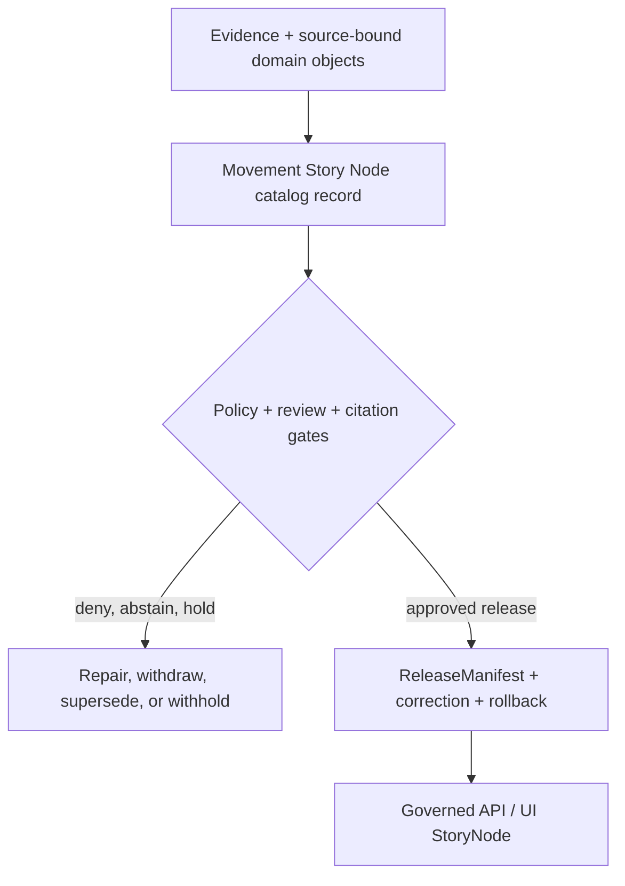

<!-- [KFM_META_BLOCK_V2]
doc_id: kfm://doc/data-catalog-domain-roads-rail-trade-story-nodes-readme
title: data/catalog/domain/roads-rail-trade/story-nodes/README.md — Roads/Rail/Trade Story-Node Catalog Lane
version: v0.2
type: readme; nested-directory-readme; data-lifecycle-sublane; domain-catalog-sublane-guide
status: draft; repository-grounded; PROPOSED-record-contract; catalog-stage; release-gated; evidence-subordinate
owners: NEEDS VERIFICATION — accountable stewardship and independent review requirements are not established
created: NEEDS VERIFICATION — v0.1 records that a blank placeholder preceded the expanded README
updated: 2026-07-25
policy_label: public-doc; data; catalog; roads-rail-trade; story-nodes; release-gated; evidence-subordinate; no-sensitive-payloads
tags: [kfm, data, catalog, roads-rail-trade, story-nodes, movement-story-node, FocusMode, EvidenceDrawer, StoryNode, StoryManifest, CATALOG, TRIPLET, EvidenceBundle, SourceDescriptor, CatalogBuildReceipt, ReleaseManifest, RollbackCard]
current_path: data/catalog/domain/roads-rail-trade/story-nodes/README.md
responsibility: document the bounded catalog-stage home for Roads/Rail/Trade Movement Story Node discovery records while preventing narrative, UI, graph, route, policy, evidence, release, and publication authority from collapsing into this lane
truth_posture: "CONFIRMED current path and README, canonical singular parent lane, compatibility-only plural alias, Movement Story Node semantic contract, distinct UI StoryNode contract and permissive schema stub, permissive domain catalog-matrix schema stub, placeholder catalog validator and emitter, placeholder domain smoke test, proposed fail-closed policy scaffolds, and explicit domain-workflow holds / PROPOSED story-node catalog record contract and acceptance gates / CONFLICTED roads-rail-trade versus transport schema-contract topology and future cross-domain story-node ownership / UNKNOWN record inventory, accepted runtime consumers, release inventory, and public adoption / NEEDS VERIFICATION accountable owners, paired Movement Story Node schema, fixtures, substantive validators and tests, policy evaluation, evidence closure, review, correction propagation, and rollback drills"
evidence_snapshot:
  repository: bartytime4life/Kansas-Frontier-Matrix
  base_ref: main
  base_commit: 159a296e5e7772258e01e8904a25657b7bcdc02a
  baseline_blob: 20d5687739db1d50f561e19df5a3abc5ee56cbd5
  parent_catalog_blob: b878b6156fdeea4f02143b39e6cb617a2b69ebc6
  parent_domain_lane_blob: 4f036cfe8eaf2dfa94fa5d7e51fc0d42ef346a6b
  movement_story_node_contract_blob: 8ca7935580a87179c3996d242e1df87e8d0aed1d
  ui_story_node_contract_blob: ecacd7d0e23926a5ee1c058ed06b9b22a6e46e8e
  catalog_matrix_schema_blob: 551216b5289055a282870d2d07ac14dc0cbffb52
  domain_workflow_blob: 92692e7a10eff86c4e72958c52173dce15b43458
related:
  - ../README.md
  - ../../README.md
  - ../../../README.md
  - ../../../../README.md
  - ../../../domains/roads-rail-trade/README.md
  - ../../../../../docs/doctrine/directory-rules.md
  - ../../../../../docs/doctrine/lifecycle-law.md
  - ../../../../../docs/adr/ADR-0011-receipts-vs-proofs-vs-manifests-vs-catalog-separation.md
  - ../../../../../docs/domains/roads-rail-trade/CANONICAL_PATHS.md
  - ../../../../../docs/domains/roads-rail-trade/CATALOG_INDEX.md
  - ../../../../../docs/domains/roads-rail-trade/README.md
  - ../../../../../docs/domains/roads-rail-trade/DATA_LIFECYCLE.md
  - ../../../../../docs/domains/roads-rail-trade/GRAPH_PROJECTIONS.md
  - ../../../../../docs/domains/roads-rail-trade/MAP_UI_CONTRACTS.md
  - ../../../../../contracts/domains/roads-rail-trade/README.md
  - ../../../../../contracts/domains/roads-rail-trade/movement_story_node.md
  - ../../../../../contracts/domains/roads-rail-trade/historic_route_claim.md
  - ../../../../../contracts/domains/roads-rail-trade/trade_route_corridor.md
  - ../../../../../contracts/domains/roads-rail-trade/network_node.md
  - ../../../../../contracts/domains/roads-rail-trade/network_edge.md
  - ../../../../../contracts/ui/story_node.md
  - ../../../../../schemas/contracts/v1/domains/roads-rail-trade/catalog_matrix.schema.json
  - ../../../../../schemas/contracts/v1/ui/story_node.schema.json
  - ../../../../../policy/domains/roads-rail-trade/README.md
  - ../../../../../tools/validators/domains/roads-rail-trade/validate_catalog_matrix.py
  - ../../../../../pipelines/domains/roads-rail-trade/emit_catalog_records.py
  - ../../../../../fixtures/domains/roads-rail-trade/README.md
  - ../../../../../tests/domains/roads-rail-trade/test_roads_rail_trade_smoke.py
  - ../../../../../release/candidates/roads-rail-trade/README.md
  - ../../../../../.github/workflows/domain-roads-rail-trade.yml
  - ../../../../proofs/README.md
  - ../../../../receipts/README.md
  - ../../../../../release/README.md
notes:
  - "This v0.2 revision upgrades the existing README in place; it does not create or approve a story-node record."
  - "The public repository path is not an access-control boundary. Restricted, precise, living-person, cultural, archaeological, land/title, critical-infrastructure, or otherwise harmful content must not be committed here."
  - "Movement Story Node and UI StoryNode are related but distinct semantic families; neither is release authority or sovereign truth."
  - "The roads-rail-trade versus transport schema/contract split and OPEN-RRT-03 story-node ownership question remain unresolved."
  - "The previous blank blob remains lineage evidence only. The documentation rollback target for this revision is the v0.1 baseline blob."
[/KFM_META_BLOCK_V2] -->

# `data/catalog/domain/roads-rail-trade/story-nodes/`

> **One-line purpose.** Document the bounded `CATALOG / TRIPLET`-stage lane for discoverable Roads/Rail/Trade Movement Story Node records without turning story, graph, map, AI, or catalog metadata into truth or publication authority.

> [!IMPORTANT]
> A Movement Story Node catalog record is a discovery and governance carrier. It may point to evidence-backed, time-bounded, public-safe movement context; it does not make a route claim true, establish legal access, certify a graph, approve narrative text, or authorize release.

**Path:** `data/catalog/domain/roads-rail-trade/story-nodes/README.md`  
**Canonical relationship:** nested under the singular [`data/catalog/domain/roads-rail-trade/`](../README.md) lane  
**Lifecycle posture:** `CATALOG / TRIPLET`; public only when an approved release binds the record  
**Current implementation posture:** README and scaffolds exist; substantive story-node schema, fixtures, validation, policy evaluation, release inventory, and runtime use are not established  
**Documentation rollback target:** baseline blob `20d5687739db1d50f561e19df5a3abc5ee56cbd5`

**Quick navigation:** [Purpose](#purpose) · [Status](#status-and-evidence-boundary) · [Directory Rules](#authority-and-directory-rules-basis) · [Terminology](#story-object-and-authority-split) · [Belongs](#accepted-contents) · [Exclusions](#exclusions) · [Catalog contract](#proposed-catalog-record-contract) · [Lifecycle](#lifecycle-boundary) · [Guardrails](#story-node-guardrails) · [Validation](#validation-checklist) · [Review](#review-burden) · [Open items](#open-verification-register) · [Evidence](#evidence-ledger) · [Rollback](#correction-supersession-and-rollback)

---

## Purpose

This lane is the current repository home for documentation and any future governed catalog records that describe Roads/Rail/Trade **Movement Story Nodes**.

A Movement Story Node is an evidence-subordinate narrative, spatial, temporal, and provenance unit. It can help a governed Focus Mode, Evidence Drawer, story player, or other released surface explain movement through roads, rail, historic routes, trade corridors, crossings, facilities, freight context, or derived network context.

This README owns only the lane boundary and catalog expectations. It does not define machine shape, execute policy, close evidence, generate approved prose, issue review or release decisions, store published story payloads, or implement a public client.

## Status and evidence boundary

| Surface | Current evidence | Safe conclusion |
|---|---|---|
| Exact lane | **CONFIRMED** at the pinned base | The requested README exists at the same canonical path. |
| Direct lane inventory | Bounded indexed search returned this README only | No story-node record instance was established; the exhaustive inventory remains `UNKNOWN`. |
| Domain semantic contract | **CONFIRMED** draft [`movement_story_node.md`](../../../../../contracts/domains/roads-rail-trade/movement_story_node.md) | Meaning and guardrails exist; machine enforcement does not follow from prose. |
| Paired domain schema | Not found at four checked `roads-rail-trade` / `transport` snake- and kebab-case paths | Exact Movement Story Node shape remains `NEEDS VERIFICATION`. |
| Domain catalog schema | **CONFIRMED** permissive `PROPOSED` [`catalog_matrix.schema.json`](../../../../../schemas/contracts/v1/domains/roads-rail-trade/catalog_matrix.schema.json) | It requires only `id` and permits additional properties; it does not validate this record family semantically. |
| UI story family | **CONFIRMED** separate draft [`StoryNode`](../../../../../contracts/ui/story_node.md) contract and permissive schema stub | UI display semantics must not be treated as the domain Movement Story Node schema. |
| Validator and emitter | **CONFIRMED** placeholders | The catalog validator raises `NotImplementedError`; the emitter contains no accepted implementation. |
| Tests and fixtures | **CONFIRMED** assert-true smoke test and greenfield fixture README | No substantive Movement Story Node suite was established. |
| Policy | **CONFIRMED** `PROPOSED` fail-closed scaffolds | File presence and default denial are not an accepted evaluator, decision record, or policy closure. |
| Domain workflow | **CONFIRMED** bounded static-readiness workflow | It intentionally records semantic-validation, proof, and release-dry-run holds. |
| Release and public use | `UNKNOWN` for an accepted story-node inventory or release | A path, commit, PR, merge, badge, or green held job is not publication. |

> [!CAUTION]
> This repository is public. “Unreleased,” “review-only,” or “restricted” wording does not make tracked bytes confidential. Do not commit precise sensitive routes, Indigenous or cultural corridor details, archaeological locations, living-person facts, private access information, land/title details, critical-infrastructure vulnerabilities, credentials, or reconstructive derivatives to this lane.

## Authority and Directory Rules basis

Directory Rules select paths by responsibility, lifecycle phase, and domain segment:

| Path segment | Encoded responsibility |
|---|---|
| `data/` | Lifecycle data and emitted trust-support material |
| `catalog/` | Catalog-stage discovery and interoperability projection |
| `domain/roads-rail-trade/` | Singular governed Roads/Rail/Trade domain catalog lane |
| `story-nodes/` | Nested Movement Story Node specialization |

The requested path therefore preserves the existing `data/` → `catalog/` → `domain/roads-rail-trade/` boundary. It does not create a new root, lifecycle phase, or parallel authority.

Two related placement questions remain visible:

1. [`data/catalog/domains/roads-rail-trade/`](../../../domains/roads-rail-trade/README.md) is a **compatibility alias**, not a second record home.
2. [`OPEN-RRT-03`](../../../../../docs/domains/roads-rail-trade/CANONICAL_PATHS.md#11-open-questions) asks whether Movement Story Nodes should remain domain-owned or be split with other narrative/cultural lanes. This README preserves the current path; it does not resolve, move, or duplicate the lane.

The separate `roads-rail-trade` versus `transport` contract/schema topology is also `CONFLICTED`. Catalog records must cite the contract and schema actually accepted for their version; this README must not select a winner or invent a hybrid path.

## Story object and authority split

Similar names do not make these objects interchangeable:

| Object or surface | Governing role | Must not be treated as |
|---|---|---|
| Domain `Movement Story Node` | Evidence-subordinate Roads/Rail/Trade narrative/provenance meaning | UI schema, evidence, route truth, cultural truth, or release approval |
| UI `StoryNode` | One renderable section, callout, timeline item, evidence note, caveat, or transition | Domain Movement Story Node schema or story truth |
| Story-node catalog record | Discovery, citation, review, and release-preparation carrier in this lane | Published story payload or `ReleaseManifest` |
| UI `StoryManifest` | Governed display ordering and presentation context | Release decision or evidence closure |
| `ReleaseManifest` | Release identity and approved artifact binding under `release/` | UI display manifest or catalog entry |
| Published story bytes | Released delivery artifacts under an accepted `data/published/` lane | Canonical evidence or release authority |
| Network node or edge | Derived graph projection bound to source-supported objects | Canonical route, legal-access, or safe-passage truth |

The historical [`data/manifests/story/`](../../../../manifests/story/README.md) path is a non-canonical compatibility and retirement boundary. It is not an alternate home for this lane, UI story objects, release manifests, or published story bytes.

## Accepted contents

The direct lane currently establishes only this README. The following content is **PROPOSED** for future acceptance after schema, validation, policy, review, and release responsibilities are closed:

| Content | Acceptance boundary |
|---|---|
| Public-safe story-node catalog records | Stable identity, declared version, evidence/source refs, bounded time and place, sensitivity posture, and release/correction/rollback refs |
| Catalog indexes and inventories | Must enumerate records without upgrading their evidence, policy, review, or release state |
| References to route, corridor, segment, event, crossing, facility, operator, or graph objects | Must preserve each object's identity, source role, time, uncertainty, and owning authority |
| Focus Mode or Evidence Drawer pointers | Must reference released, governed payloads; never direct internal stores or model output |
| Citation, AI, review, policy, release, correction, and rollback pointers | References only; the authoritative objects remain in their owning roots |
| Migration, supersession, or correction notes | Public-safe navigation aids with stable lineage; not replacement authority |

Any future tracked instance must be safe for a public repository even when it is not yet exposed through a public API.

## Exclusions

| Do not put here | Governing home or behavior |
|---|---|
| RAW captures, WORK intermediates, quarantined values, or processed canonical records | Corresponding `data/<phase>/roads-rail-trade/` lane |
| Canonical road, rail, route, corridor, crossing, facility, restriction, operator, or event geometry/data | Owning processed/domain object lane |
| EvidenceBundles, proof packs, or integrity material | [`data/proofs/`](../../../../proofs/README.md) |
| Process receipts or AI/citation/transform records | [`data/receipts/`](../../../../receipts/README.md) |
| Release decisions, manifests, correction notices, withdrawal notices, or rollback cards | [`release/`](../../../../../release/README.md) |
| Published story packages, tiles, APIs, reports, or UI payloads | Accepted [`data/published/`](../../../../published/README.md) lane after release |
| Semantic contracts, JSON Schemas, policy rules, validators, tests, pipeline code, or app code | Their responsibility roots |
| Duplicate records under plural `data/catalog/domains/` | Keep the plural lane compatibility-only |
| Uncited generated prose, model confidence, screenshots, maps, or graph paths used as proof | Resolve governed evidence or abstain |
| Live routing, closure, detour, legal-access, right-of-way, bridge-condition, rail-status, emergency, regulatory, or safe-passage guidance | Use the applicable external authority; KFM must not claim this authority |
| Restricted, precise, private, or reconstructive content | Deny, quarantine outside public Git, generalize, redact, or use an approved access-controlled system |

## Proposed catalog record contract

No accepted Movement Story Node schema was established at the pinned base. The following is a **documentation-level acceptance contract**, not machine-enforced fields:

| Concern | Minimum closure before reliance |
|---|---|
| Identity | Stable record ID, version, deterministic content/spec digest, and supersession lineage |
| Semantic family | Explicit distinction among domain Movement Story Node, UI StoryNode, StoryManifest, route/graph object, and released artifact |
| Cited objects | Stable references to the route, corridor, segment, event, crossing, facility, operator, settlement, or graph objects being explained |
| Evidence and source role | Resolvable EvidenceRefs/EvidenceBundles and SourceDescriptors; a narrative must not upgrade source authority |
| Time | Separate historical validity, observation/source, retrieval, build/generation, release, and correction times where material |
| Space and uncertainty | Evidence-supported location scope, uncertainty, geometry lineage, and reviewed public-safe generalization |
| Rights and sensitivity | Rights, attribution, cultural/sovereignty, archaeology, living-person, land/title, infrastructure, and combination-risk posture |
| Policy and review | Applicable PolicyDecision and ReviewRecord references, including required steward review |
| Generated language | AI receipt and citation-validation references when generation materially contributed |
| Release | Immutable approved release reference; catalog placement alone is insufficient |
| Correction and rollback | Correction/withdrawal/supersession path, dependency invalidation, and a tested rollback target |
| Limitations | Plain-language statement of what the node cannot prove or authorize |

Missing, stale, conflicted, unsafe, or unresolved support must keep the record held, withdrawn, superseded, narrowed, or absent from public use according to the governing contract. Do not invent a machine outcome enum in this README.

## Lifecycle boundary

```mermaid
flowchart TD
  E["Evidence + source-bound domain objects"] --> C["Movement Story Node catalog record"]
  C --> G{"Policy + review + citation gates"}
  G -- "deny, abstain, hold" --> H["Repair, withdraw, supersede, or withhold"]
  G -- "approved release" --> R["ReleaseManifest + correction + rollback"]
  R --> U["Governed API / UI StoryNode"]
```

The catalog record remains downstream of evidence and source-bound objects. A public UI may consume only an approved, public-safe release through a governed interface. A failed or unresolved gate does not become an optimistic narrative; it produces the finite disposition defined by the governing contract or remains withheld.

## Story-node guardrails

- **Catalog is not truth.** A record describes and links; it cannot make a route, event, movement, graph, or narrative claim true.
- **Source roles do not collapse.** Observed, regulatory, modeled, administrative, aggregate, candidate, and synthetic material keep their declared roles.
- **Historic claims stay uncertain.** Coarse or interpretive evidence must not become a precise alignment, confirmed membership, ownership, access, or current condition.
- **Cultural meaning stays stewarded.** Indigenous, treaty, oral-history, archaeological, and other cultural material retains the owning lane's authority and required review.
- **Graph stays derived.** A story node may cite network nodes or edges; graph connectivity cannot become canonical route or routing authority.
- **Cross-domain joins preserve ownership.** Hydrology, Settlements/Infrastructure, Archaeology, Hazards, People/Land, and other lanes retain identity, evidence, policy, sensitivity, correction, and rollback authority.
- **AI stays subordinate.** Generated language cannot upgrade evidence, source role, uncertainty, policy, review, release, or sensitivity state.
- **Time stays explicit.** Historical validity and current operational status must not be conflated.
- **Public Git is public.** No sensitive value is safe here merely because a future API does not expose it.
- **Publication remains separate.** A successful build, validation, badge, commit, PR, merge, or catalog write is not a release.

## Validation checklist

### Current bounded implementation evidence

| Check surface | Observed state | What it does not prove |
|---|---|---|
| [`catalog_matrix.schema.json`](../../../../../schemas/contracts/v1/domains/roads-rail-trade/catalog_matrix.schema.json) | `PROPOSED`; requires only `id`; permits additional properties | Movement Story Node semantics, evidence closure, sensitivity, release readiness |
| [`validate_catalog_matrix.py`](../../../../../tools/validators/domains/roads-rail-trade/validate_catalog_matrix.py) | Raises `NotImplementedError` | Any catalog record validation |
| [`emit_catalog_records.py`](../../../../../pipelines/domains/roads-rail-trade/emit_catalog_records.py) | Placeholder module text only | A catalog writer, identity derivation, receipts, or output |
| [`test_roads_rail_trade_smoke.py`](../../../../../tests/domains/roads-rail-trade/test_roads_rail_trade_smoke.py) | One `assert True` placeholder | Domain or story-node behavior |
| [`policy/domains/roads-rail-trade/`](../../../../../policy/domains/roads-rail-trade/README.md) | `PROPOSED` scaffold; selected rules default fail closed | Accepted policy inputs, decisions, tests, evaluator wiring, or release enforcement |
| [`domain-roads-rail-trade.yml`](../../../../../.github/workflows/domain-roads-rail-trade.yml) | Static readiness checks plus explicit holds | Semantic validation, proof production, safe passage, legal access, release, or publication |

### Required before a record family is accepted

- [ ] Resolve the `roads-rail-trade` / `transport` contract and schema topology through the accepted decision path.
- [ ] Decide OPEN-RRT-03 without creating a duplicate narrative authority surface.
- [ ] Establish a paired Movement Story Node schema with closed required fields and `additionalProperties` posture.
- [ ] Add public-safe deterministic valid, invalid, denied, abstained, held, stale, superseded, and error fixtures as applicable.
- [ ] Replace placeholder validators and tests with a bounded, no-network suite.
- [ ] Enforce identity, cited-object separation, source role, time, geometry lineage, uncertainty, evidence, citation, rights, sensitivity, policy, review, release, correction, and rollback rules.
- [ ] Prove sensitive historic/cultural geometry and combination-risk cases fail closed.
- [ ] Prove UI StoryNode projection cannot bypass the domain record, evidence, release, or governed API boundary.
- [ ] Establish catalog/triplet and any STAC/DCAT/PROV projection agreement without treating projections as canonical truth.
- [ ] Exercise correction, withdrawal, supersession, cache/dependency invalidation, and rollback.

Passing Markdown or structural checks does not close any item above.

## Review burden

The repository's default [CODEOWNERS](../../../../../.github/CODEOWNERS) route points changes to `@bartytime4life`. That is GitHub review routing only; it is not a StewardshipAssignment, ReviewRecord, PolicyDecision, sensitivity approval, release approval, or proof of independent review.

Accountable domain, evidence, rights/sensitivity, cultural/sovereignty, policy, catalog, UI, and release reviewers remain `NEEDS VERIFICATION`. Changes involving sensitive movement history, cultural corridors, archaeological relations, living persons, land/title, critical infrastructure, public exposure, or release state require the review demanded by the owning policy and authority surface.

## Open verification register

| ID | Item | Status | Evidence that would close it |
|---|---|---|---|
| RRT-STORY-01 | Exhaustive direct-lane record inventory | `UNKNOWN` | Pinned tree listing plus record classification |
| RRT-STORY-02 | Domain Movement Story Node schema and version | `NEEDS VERIFICATION` | Accepted schema, contract pairing, fixtures, and compatibility tests |
| RRT-STORY-03 | `roads-rail-trade` / `transport` topology | `CONFLICTED` | Accepted ADR plus migration, compatibility, and rollback plan |
| RRT-STORY-04 | Domain-owned versus shared story-node lane | `CONFLICTED` | OPEN-RRT-03 decision plus consumer and migration analysis |
| RRT-STORY-05 | Substantive validator, tests, and CI graduation | `NEEDS VERIFICATION` | Deterministic implementation, negative fixtures, and observed run |
| RRT-STORY-06 | Policy evaluator and required review path | `NEEDS VERIFICATION` | Accepted policy inputs, tests, decision records, and review bindings |
| RRT-STORY-07 | Evidence, citation, AI, and catalog closure | `NEEDS VERIFICATION` | Resolvable examples, proof output, and closure validator |
| RRT-STORY-08 | Accepted release inventory and public consumer | `UNKNOWN` | ReleaseManifest, public-safe artifact, governed route, and integration test |
| RRT-STORY-09 | Correction propagation and rollback rehearsal | `NEEDS VERIFICATION` | Dependency invalidation result, correction notice, and rollback evidence |
| RRT-STORY-10 | Accountable owners and independent approval rules | `NEEDS VERIFICATION` | Verified assignments and repository rules |

## Evidence ledger

| Evidence | Status | Supports | Limit |
|---|---|---|---|
| Current README at baseline blob `20d5687…` | `CONFIRMED` | Existing lane purpose, exclusions, stable identity, and evidence-subordinate posture | Does not prove record inventory or implementation |
| [`data/catalog/README.md`](../../../README.md) | `CONFIRMED` canonical catalog boundary | Catalog responsibility, release-gated exposure, anti-collapse rules | Writers, emitted records, consumers, and rollback remain incompletely verified |
| [Parent domain catalog README](../README.md) | `CONFIRMED` current parent lane | Singular domain parent and story-node child relationship | Parent remains v0.1 and does not prove child records |
| [Plural compatibility README](../../../domains/roads-rail-trade/README.md) | `CONFIRMED` compatibility note | Singular `domain/` lane remains governing | Retention or removal of the alias remains unresolved |
| [Movement Story Node contract](../../../../../contracts/domains/roads-rail-trade/movement_story_node.md) | `CONFIRMED` draft semantic contract | Meaning, source/evidence, time, sensitivity, Focus Mode, AI, release, and rollback guardrails | Paired schema and enforcement not established |
| [UI StoryNode contract](../../../../../contracts/ui/story_node.md) | `CONFIRMED` distinct draft contract | UI display-node semantics and authority separation | UI schema is permissive; runtime maturity unproved |
| [Lifecycle Law](../../../../../docs/doctrine/lifecycle-law.md) | `CONFIRMED` doctrine | `CATALOG / TRIPLET`, `CatalogBuildReceipt`, release, correction, and rollback posture | Doctrine does not prove implementation |
| [Domain workflow](../../../../../.github/workflows/domain-roads-rail-trade.yml) | `CONFIRMED` implementation-bearing readiness check | Placeholder detection, structural parsing, explicit holds, read-only workflow posture | Does not execute semantic story-node validation |
| [Release candidate lane](../../../../../release/candidates/roads-rail-trade/README.md) | `CONFIRMED` review guidance | Candidate-not-release, source-role, rights, sensitivity, evidence, review, correction, and rollback boundaries | Accepted candidate and public release inventory remain unknown |

## Correction, supersession, and rollback

### Catalog records

If a cited object, source role, EvidenceBundle, policy decision, review, release, or sensitivity state changes:

1. stop serving the dependent story-node projection;
2. mark the record held, withdrawn, superseded, or otherwise disposed according to its governing contract;
3. preserve the prior identity and lineage rather than rewriting history;
4. invalidate dependent UI nodes, story packages, graph context, exports, indexes, caches, and generated summaries;
5. issue any required correction or withdrawal notice through the release authority; and
6. restore only an approved, public-safe prior target.

### This README

Before merge, rollback means leaving the review branch unmerged. After merge, use a transparent revert commit or focused revert PR against the actual merged commit; do not rewrite shared history.

The rollback target for this revision is the v0.1 baseline blob `20d5687739db1d50f561e19df5a3abc5ee56cbd5`. The older blank blob `8b137891791fe96927ad78e64b0aad7bded08bdc` is retained as lineage evidence, not the normal rollback target for a mature documentation correction.

## Change history and no-loss ledger

### v0.2 — 2026-07-25

- grounded status against current schemas, placeholders, policy scaffolds, workflow holds, release guidance, and story/UI authority surfaces;
- clarified the public-repository sensitivity boundary;
- separated domain Movement Story Node, UI StoryNode, StoryManifest, ReleaseManifest, published payload, and graph roles;
- surfaced the plural compatibility lane, slug conflict, and OPEN-RRT-03;
- replaced the historical blank-blob rollback instruction with the immediate baseline while retaining lineage;
- added validation, review, correction, supersession, and open-verification guidance.

### v0.1 — 2026-06-24

Expanded the prior blank placeholder into a catalog-stage story-node lane README.

| v0.1 element | v0.2 disposition |
|---|---|
| `doc_id`, path, lifecycle, release-gated status, and evidence-subordinate posture | **KEEP / CLARIFY** |
| Purpose, repo fit, accepted contents, exclusions, catalog requirements, guardrails, evidence, validation, and rollback | **KEEP / ENRICH** |
| Route/corridor/graph/Focus Mode relationships | **CLARIFY** with object-family and UI/domain separation |
| Placeholder owners and broad unverified object lists | **REPAIR** with current evidence and explicit verification states |
| Six unlinked static badges | **REPAIR** to four evidence-linked, non-maturity badges |
| Blank-blob rollback target | **RELOCATE TO LINEAGE**; immediate baseline is the revision rollback target |
| Stable anchors `purpose`, `lifecycle-boundary`, `repo-fit`, `accepted-contents`, `exclusions`, `catalog-requirements`, `story-node-guardrails`, `evidence-ledger`, `validation-checklist`, and `rollback` | **PRESERVE**; explicit aliases maintain fragment compatibility |

<a href="#top">Back to top</a>

