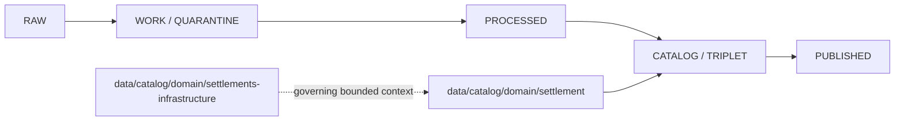

<!-- [KFM_META_BLOCK_V2]
doc_id: kfm://doc/data-catalog-domain-settlement-readme
title: data/catalog/domain/settlement/README.md — Settlement Catalog Compatibility README
version: v0.1
type: readme; data-lifecycle-sublane; domain-catalog-guide; compatibility-segment-note
status: draft; PROPOSED; CONFLICTED-SEGMENT; data-root; catalog-stage; settlement; settlements-infrastructure; release-gated
owners: OWNER_TBD — Settlements/Infrastructure steward · Settlement steward · Data steward · Catalog steward · Evidence steward · Source steward · Policy steward · Release steward · Docs steward
created: NEEDS VERIFICATION — blank placeholder existed before v0.1 expansion
updated: 2026-06-24
policy_label: public-doc; data; catalog; settlement; settlements-infrastructure; lifecycle; release-gated; compatibility-alias
tags: [kfm, data, catalog, settlement, settlements-infrastructure, domain-catalog, CATALOG, TRIPLET, Settlement, Municipality, CensusPlace, Townsite, GhostTown, EvidenceBundle, SourceDescriptor, ReleaseManifest]
related:
  - ../../README.md
  - ../../../README.md
  - ../../../../docs/domains/settlements-infrastructure/README.md
  - ../../../../docs/domains/settlements-infrastructure/DATA_LIFECYCLE.md
  - ../../../../docs/domains/settlements-infrastructure/CANONICAL_PATHS.md
  - ../../../../pipelines/domains/settlement/README.md
  - ../../../../pipelines/domains/settlements-infrastructure/README.md
  - ../../../../contracts/domains/settlements-infrastructure/
  - ../../../../schemas/contracts/v1/domains/settlements-infrastructure/
  - ../../../../policy/domains/settlements-infrastructure/
  - ../../../../data/proofs/
  - ../../../../data/receipts/
  - ../../../../release/
notes:
  - "This file replaces a blank placeholder at `data/catalog/domain/settlement/README.md`."
  - "This short `settlement` segment is PROPOSED/CONFLICTED. The doctrine docs identify `settlements-infrastructure` as the governing bounded-context lane while Atlas/crosswalk material uses singular `settlement` in some projections."
  - "This folder is a CATALOG-stage compatibility lane; it is not RAW, WORK, QUARANTINE, PROCESSED, PUBLISHED, proof storage, source registry, release authority, schema authority, policy authority, implementation code, or a public data surface."
  - "Do not create parallel schemas, contracts, source registries, policies, lifecycle data, catalog truth, or release decisions under both `settlement` and `settlements-infrastructure` without ADR/path-map/migration/rollback notes."
  - "Rollback target for this replacement is previous blank blob SHA `8b137891791fe96927ad78e64b0aad7bded08bdc`."
[/KFM_META_BLOCK_V2] -->

# data/catalog/domain/settlement

> Compatibility catalog index for the short `settlement` segment. Treat this path as **PROPOSED / CONFLICTED** until the Settlements/Infrastructure segment decision is resolved.

  
  
  
  
  
  

**Status:** draft / PROPOSED / CONFLICTED-SEGMENT  
**Path:** `data/catalog/domain/settlement/README.md`  
**Owning root:** `data/catalog/domain/`  
**Compatibility segment:** `settlement`  
**Governing bounded context:** `settlements-infrastructure`  
**Lifecycle stage:** `CATALOG / TRIPLET`  
**Exposure posture:** release-gated; no public use without approved release linkage  
**Truth posture:** CONFIRMED target was blank · CONFIRMED `data/catalog/` is CATALOG-stage and RELEASED ONLY for public exposure · CONFIRMED Settlements/Infrastructure doctrine owns Settlement, Municipality, CensusPlace, Townsite, GhostTown, Fort, Mission, ReservationCommunity, infrastructure and dependency object families · CONFIRMED Settlements/Infrastructure lifecycle docs mark `settlements-infrastructure` versus `settlement` as CONFLICTED · CONFIRMED `pipelines/domains/settlement/README.md` already treats `settlement` as an alias candidate · NEEDS VERIFICATION for whether this short catalog path should remain, redirect, or migrate.

**Quick jumps:** [Purpose](#purpose) · [Lifecycle boundary](#lifecycle-boundary) · [Repo fit](#repo-fit) · [Accepted contents](#accepted-contents) · [Exclusions](#exclusions) · [Catalog requirements](#catalog-requirements) · [Guardrails](#guardrails) · [Evidence ledger](#evidence-ledger) · [Validation checklist](#validation-checklist) · [Rollback](#rollback)

---

## Purpose

`data/catalog/domain/settlement/` may serve as a compatibility index for catalog records that use the short `settlement` segment. It must remain subordinate to the Settlements/Infrastructure bounded context and must not become a parallel authority root.

A catalog record can help users and systems discover governed data. It does not make the underlying claim true, replace EvidenceBundle support, or approve publication.

## Lifecycle boundary

This lane is a CATALOG-stage compatibility/proposed lane. Public exposure applies only to records tied to approved release state, governed route, EvidenceBundle support, source-role support, policy/review posture, and rollback target.

## Repo fit

| Responsibility | Correct home | Rule |
|---|---|---|
| Short-segment settlement catalog index | `data/catalog/domain/settlement/` | This lane, if retained. |
| Governing domain lane | `settlements-infrastructure` responsibility-root segments | Preferred current bounded-context name until ADR/migration says otherwise. |
| Parent catalog stage | `data/catalog/` | Parent CATALOG-stage lane. |
| Domain doctrine | `docs/domains/settlements-infrastructure/` | Human-facing domain doctrine. |
| Evidence/proof records | `data/proofs/` | Not this lane. |
| Receipts | `data/receipts/` | Not this lane. |
| Release decisions | `release/` | Not this lane. |
| Schemas and policy | `schemas/`, `policy/` | Not this lane. |
| Code/tests | implementation roots and test roots | Not this lane. |

## Accepted contents

- Compatibility index records that point to the governing Settlements/Infrastructure catalog lane.
- Settlement, municipality, census-place, townsite, ghost-town, fort, mission, reservation-community, or community-context catalog pointers if the short segment is retained.
- Release-linked pointers to approved public-safe derivatives.
- Evidence, source, policy, receipt, and release references.
- Migration notes or crosswalks for resolving `settlement` versus `settlements-infrastructure`.

## Exclusions

- RAW, WORK, QUARANTINE, PROCESSED, or PUBLISHED data.
- EvidenceBundle/proof records.
- SourceDescriptor/source-registry records.
- Receipts.
- Release decisions.
- Semantic contracts, schemas, policy rules, validators, tests, or implementation code.
- Roads/rail route truth, hydrology truth, hazards truth, ownership/person-land joins, archaeological/sacred-site coordinates, or infrastructure operational authority.
- Any public exposure shortcut around the Settlements/Infrastructure controls.

## Catalog requirements

PROPOSED until schemas, validators, inventory, access controls, and segment placement are verified:

| Requirement | Meaning |
|---|---|
| Stable catalog identity | Record has a stable identity linked to source, evidence, derivative, or release object. |
| Segment decision | Record path must not obscure whether the canonical segment is `settlement`, `settlements-infrastructure`, or a compatibility bridge. |
| Evidence reference | Record points to EvidenceBundle/proof context when claims depend on evidence. |
| Source reference | Record points to SourceDescriptor/source catalog where source authority matters. |
| Sensitivity posture | Record links to sensitivity classification, rights, geometry posture, access posture, and obligations where material. |
| Release reference | Public or release-linked records point to ReleaseManifest and rollback target. |

## Guardrails

- Do not treat this path as canonical while the segment conflict remains open.
- Do not duplicate or weaken the governing Settlements/Infrastructure lane.
- Do not publish from this lane directly.
- Keep evidence, receipts, policy, release, schemas, source registries, and implementation code in their owning roots.
- Keep transport-route, hydrology, hazards, people/land, archaeology, and infrastructure-operations truth in their owning lanes.
- Mark concrete catalog inventory, schema status, validators, route behavior, and migration status as NEEDS VERIFICATION until checked.

## Evidence ledger

| Source | Status | Supports | Limits |
|---|---|---|---|
| Previous file | CONFIRMED | Target was blank. | No lane boundaries existed. |
| `data/catalog/README.md` | CONFIRMED | CATALOG stage and RELEASED ONLY public posture. | Does not prove Settlement catalog inventory. |
| `docs/domains/settlements-infrastructure/README.md` | CONFIRMED doctrine / PROPOSED implementation | Domain scope, object families, source families, cross-lane boundaries, and data catalog path expectation. | Does not prove this short path is canonical. |
| `docs/domains/settlements-infrastructure/DATA_LIFECYCLE.md` | CONFIRMED doctrine / PROPOSED implementation | Lifecycle invariant and explicit `settlements-infrastructure` versus `settlement` conflict. | Repo implementation remains NEEDS VERIFICATION. |
| `docs/domains/settlements-infrastructure/CANONICAL_PATHS.md` | CONFIRMED doctrine / PROPOSED implementation | Working canonical form and OPEN-CP-01 segment conflict. | ADR/migration remains unresolved. |
| `pipelines/domains/settlement/README.md` | CONFIRMED alias evidence | Existing short `settlement` path is treated as compatibility/alias. | Pipeline alias does not prove catalog alias authority. |

## Validation checklist

- [ ] Confirm whether `data/catalog/domain/settlement/` is compatibility, ADR-approved, or a migration candidate.
- [ ] Confirm whether `data/catalog/domain/settlements-infrastructure/` exists or should be created as the governing catalog lane.
- [ ] Confirm actual child files and catalog inventory.
- [ ] Confirm schema/profile location and segment naming.
- [ ] Confirm validators, access policy, receipts, release linkage, and route behavior.
- [ ] Confirm migration or redirect plan to avoid parallel catalog authority.

## Rollback

Rollback is required if this lane becomes a source-data root, proof store, source-registry root, release-decision root, published-output root, schema root, policy root, validator root, implementation root, or public exposure shortcut.

Rollback target for this replacement: previous blank blob SHA `8b137891791fe96927ad78e64b0aad7bded08bdc`.

<a href="#top">Back to top</a>

