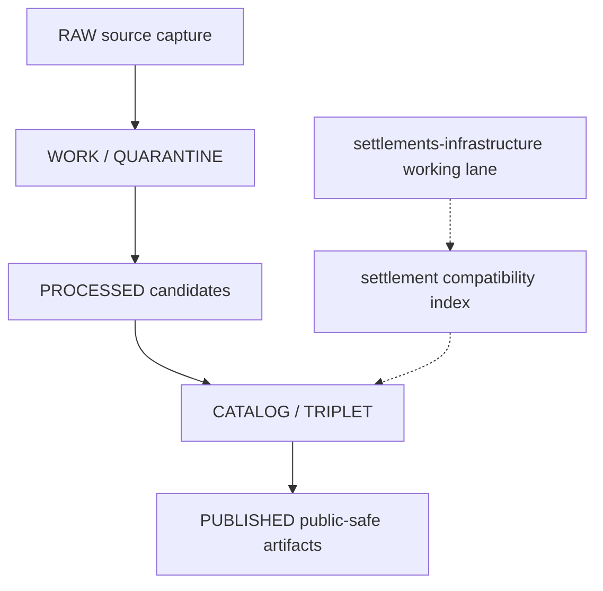

<!-- [KFM_META_BLOCK_V2]
doc_id: kfm://doc/data-catalog-domain-settlement-readme
title: data/catalog/domain/settlement/README.md — Settlement Catalog Compatibility Lane
version: v0.2.0
type: readme; data-lifecycle-sublane; domain-catalog-guide; compatibility-segment-note
status: repository-grounded draft; PROPOSED; CONFLICTED; compatibility-alias; release-blocked
owners: NEEDS VERIFICATION — Settlements/Infrastructure steward · Settlement steward · Data steward · Catalog steward · Evidence steward · Source steward · Policy steward · Release steward · Docs steward
created: NEEDS VERIFICATION — blank placeholder existed before v0.1 expansion
updated: 2026-07-25
prepared_under_prompt: KFM Markdown Modernization & GitHub Documentation Implementation Agent v4.0.0
policy_label: public-doc; data; catalog; settlement; settlements-infrastructure; compatibility-alias; release-gated; sensitivity-aware
tags: [kfm, data, catalog, settlement, settlements-infrastructure, compatibility, CATALOG, TRIPLET, Settlement, Municipality, CensusPlace, Townsite, GhostTown, EvidenceBundle, SourceDescriptor, ReleaseManifest]
current_path: data/catalog/domain/settlement/README.md
working_counterpart: data/catalog/domain/settlements-infrastructure/README.md
truth_posture: >-
  CONFIRMED current path, complete prior README, working compound-domain
  counterpart, repository scaffolds, placeholder test, inert pipeline
  specifications, and explicit workflow holds / CONFLICTED settlement versus
  settlements-infrastructure segment authority / UNKNOWN recursive catalog
  inventory, active producers or consumers, runtime reads, release inventory,
  and public effects / NEEDS VERIFICATION accepted catalog contract and schema,
  source-registry topology, policy enforcement, deterministic validation,
  receipts, proofs, review, correction propagation, and rollback execution
evidence_snapshot:
  repository: bartytime4life/Kansas-Frontier-Matrix
  base_commit: 4a79737c92ee0576fcf8af4fc727bacba6d8a5ce
  prior_blob: a0900a5fedb39096c9a6894192adb2536ff1cfb8
  historical_blank_blob: 8b137891791fe96927ad78e64b0aad7bded08bdc
  inspection: complete target plus bounded adjacent contracts, schemas, policy, fixtures, tests, validators, pipeline specs, registries, receipts, proofs, candidates, published lanes, workflows, and review routing
notes:
  - "This is an in-place modernization of `data/catalog/domain/settlement/README.md`; it creates no parallel document or authority."
  - "The short `settlement` path remains a compatibility and navigation lane. It is not promoted to an independent domain catalog."
  - "The working compound-domain counterpart remains draft and does not itself resolve the segment conflict."
  - "No source payload, catalog record, lifecycle object, contract, schema, policy, fixture, test, validator, pipeline, receipt, proof, release decision, or published artifact changes in this documentation-only revision."
[/KFM_META_BLOCK_V2] -->

<a id="top"></a>
<a id="data-catalog-domain-settlement"></a>

# `data/catalog/domain/settlement/` — Settlement Catalog Compatibility Lane

> **One-line purpose.** Preserve short-name Settlement catalog references as a
> reviewable compatibility index while routing catalog authority to the working
> [`settlements-infrastructure`](../settlements-infrastructure/README.md) lane.

[](#status)
[](#authority-and-segment-posture)
[](#lifecycle-boundary)
[](#release-and-publication-boundary)

> [!IMPORTANT]
> This path is a compatibility and navigation surface, not a second Settlement
> catalog authority. Do not create independent records, schemas, policies,
> source bindings, receipts, release decisions, or public routes here while the
> segment decision remains unresolved.

> [!WARNING]
> Exact facility detail, dependency topology, operator-sensitive or condition
> information, private-property or living-person joins, and culturally or
> archaeologically sensitive locations fail closed. Documentation placement
> cannot make such material public-safe.

**Quick navigation:** [Purpose](#purpose) ·
[Authority](#authority-and-segment-posture) · [Status](#status) ·
[Lifecycle](#lifecycle-boundary) · [Repository fit](#repo-fit) ·
[Contents](#accepted-contents) · [Exclusions](#exclusions) ·
[Inputs and outputs](#inputs-and-outputs) ·
[Compatibility](#compatibility-contract) ·
[Requirements](#catalog-requirements) ·
[Evidence](#current-repository-evidence) ·
[Sensitivity](#source-evidence-rights-and-sensitivity) ·
[Validation](#validation-and-fail-closed-state) ·
[Guardrails](#guardrails) · [Release](#release-and-publication-boundary) ·
[Ledger](#evidence-ledger) · [Open items](#open-verification-register) ·
[Checklist](#validation-checklist) · [Rollback](#rollback)

## Purpose

`data/catalog/domain/settlement/` preserves discoverability for catalog
references that use the short `settlement` segment. Its bounded role is to
redirect, crosswalk, or explain those references without evolving separately
from the broader Settlements/Infrastructure context.

A compatibility index can help a steward find the working record family. It
does not:

- make a place, municipality, census place, townsite, historic community, or
  infrastructure assertion true;
- replace an EvidenceBundle, SourceDescriptor, contract, schema, policy
  decision, review record, receipt, proof, or release manifest;
- establish current legal status, occupancy, facility operation, service
  availability, safety, ownership, jurisdiction, or public readiness; or
- authorize lifecycle promotion, release, publication, or direct client access.

## Authority and segment posture

| Question | Bounded answer | Truth state |
| --- | --- | --- |
| Does this exact path exist? | Yes; this README is the confirmed target. | `CONFIRMED` |
| Is this path an independent catalog authority? | No; it is a compatibility/index lane. | `CONFIRMED document posture` |
| What is the working compound-domain counterpart? | [`data/catalog/domain/settlements-infrastructure/`](../settlements-infrastructure/README.md) | `CONFIRMED path / draft posture` |
| Is the naming decision final? | No; `settlement` versus `settlements-infrastructure` remains unresolved. | `CONFLICTED` |
| May this README resolve the conflict? | No; resolution needs accepted governance plus migration and rollback support. | `CONFIRMED boundary` |
| Are current catalog records or consumers established here? | Not by the bounded evidence reviewed for this revision. | `UNKNOWN` |

The [canonical-path register](../../../../docs/domains/settlements-infrastructure/CANONICAL_PATHS.md)
uses `settlements-infrastructure` as the working compound-domain form while
recording the short form as ADR-class variance. That document is draft path
doctrine, not a completed migration or proof that every proposed lane is
implemented.

## Status

| Surface | Current repository evidence | Safe conclusion |
| --- | --- | --- |
| Target document | Complete v0.1 README at prior blob `a0900a5f…` | Existing identity and legacy boundaries must be preserved. |
| Catalog role | Parent index lists `settlement/` as `PROPOSED / CONFLICTED` compatibility | Do not create parallel catalog truth. |
| Compound-domain catalog lane | README exists at `settlements-infrastructure/` | Working counterpart exists; implementation and inventory remain unproven. |
| Semantic contracts | Contract-lane README exists; object-level files are described as proposed | No accepted object contract is established by the inspected README. |
| Machine schemas | Domain schema README is a greenfield scaffold | No field-level catalog or domain shape is established by that scaffold. |
| Policy | Domain policy README is a greenfield scaffold | No executable policy enforcement is established. |
| Fixtures and tests | Fixture README is a stub; smoke test is `test_placeholder: assert True` | No accepted deterministic domain suite is established. |
| Pipeline specifications | Five YAML files have `stages: []` | Presence is inert scaffold evidence, not runnable behavior. |
| Proof and release | Domain workflow records explicit proof and release-dry-run holds | No accepted producer or release command is established. |
| Public use | No release inventory or governed consumer was established in this review | `DENY BY DEFAULT`; do not infer publication. |

## Lifecycle boundary


```mermaid
flowchart TB
  RAW["RAW source capture"] --> WQ["WORK / QUARANTINE"]
  WQ --> PROC["PROCESSED candidates"]
  PROC --> CAT["CATALOG / TRIPLET"]
  CAT --> PUB["PUBLISHED public-safe artifacts"]
  LONG["settlements-infrastructure working lane"] -.-> SHORT["settlement compatibility index"]
  SHORT -.-> CAT
```

This directory sits in the CATALOG portion of the lifecycle. Its name does not
skip or satisfy any transition:

```text
RAW -> WORK / QUARANTINE -> PROCESSED -> CATALOG / TRIPLET -> PUBLISHED
```

Promotion remains a governed state transition. A catalog file, compatibility
pointer, passing static check, commit, pull request, merge, map, export, or
generated summary is not evidence closure, release approval, or publication.

## Repo fit

| Responsibility | Repository home | Relationship to this lane |
| --- | --- | --- |
| Domain catalog index | [`data/catalog/domain/`](../README.md) | Parent index and child-lane orientation |
| Catalog lifecycle root | [`data/catalog/`](../../README.md) | Owns governed catalog projections |
| Data lifecycle root | [`data/`](../../../README.md) | Owns lifecycle material, receipts, proofs, registries, and published artifacts |
| Working compound-domain catalog | [`data/catalog/domain/settlements-infrastructure/`](../settlements-infrastructure/README.md) | Current counterpart; still draft and release-gated |
| Domain doctrine | [`docs/domains/settlements-infrastructure/`](../../../../docs/domains/settlements-infrastructure/README.md) | Explains bounded context and non-ownership |
| Semantic meaning | [`contracts/domains/settlements-infrastructure/`](../../../../contracts/domains/settlements-infrastructure/README.md) | Contract responsibility; object files not established by this README |
| Machine shape | [`schemas/contracts/v1/domains/settlements-infrastructure/`](../../../../schemas/contracts/v1/domains/settlements-infrastructure/README.md) | Greenfield scaffold at the inspected base |
| Admissibility and sensitivity | [`policy/domains/settlements-infrastructure/`](../../../../policy/domains/settlements-infrastructure/README.md) | Greenfield scaffold at the inspected base |
| Executable behavior | [`pipelines/domains/settlements-infrastructure/`](../../../../pipelines/domains/settlements-infrastructure/README.md) | Separate implementation responsibility |
| Declarative intent | [`pipeline_specs/settlements-infrastructure/`](../../../../pipeline_specs/settlements-infrastructure/README.md) | Five inert stage scaffolds |
| Tests and fixtures | [`tests/domains/settlements-infrastructure/`](../../../../tests/domains/settlements-infrastructure/README.md) and [`fixtures/domains/settlements-infrastructure/`](../../../../fixtures/domains/settlements-infrastructure/README.md) | Documentation, stub fixture surface, and placeholder smoke test |
| Source admission | [`data/registry/sources/settlements-infrastructure/`](../../../registry/sources/settlements-infrastructure/README.md) | Source registry; topology remains unresolved |
| Receipts and proofs | [`data/receipts/settlements-infrastructure/`](../../../receipts/settlements-infrastructure/README.md) and [`data/proofs/settlements-infrastructure/`](../../../proofs/settlements-infrastructure/README.md) | Process memory and evidence/proof support; not catalog records |
| Release review | [`release/candidates/settlements-infrastructure/`](../../../../release/candidates/settlements-infrastructure/README.md) | Candidate guidance; a candidate is not a release |
| Published artifacts | [`data/published/settlements-infrastructure/`](../../../published/settlements-infrastructure/README.md) | Released public-safe carriers only; artifact maturity unverified |

The placement is supported by
[Directory Rules](../../../../docs/architecture/directory-rules.md) sections 4,
9, and 12: `data/` owns lifecycle material, `catalog` names the phase, and the
domain is a lane inside the responsibility root. Section 15 directly mandates
an ordered contract for canonical and compatibility **roots**; this nested
README uses the useful parts of that contract without claiming the section
directly governs every nested lane.

## Accepted contents

Until accepted governance resolves the segment, this directory should remain
small and compatibility-focused:

- this README;
- short-name navigation or alias indexes that point to the working
  `settlements-infrastructure` catalog lane;
- explicit crosswalk or migration notes that preserve identity, source,
  evidence, time, rights, sensitivity, review, release, correction, and rollback
  references; and
- compatibility pointers for Settlement-related families such as `Settlement`,
  `Municipality`, `CensusPlace`, `Townsite`, `GhostTown`, `Fort`, `Mission`, and
  `ReservationCommunity`, provided the pointer does not become an independent
  catalog record or truth carrier.

Any future machine-readable alias requires an accepted contract, shape,
validator, migration decision, and non-duplication proof. This README alone
does not authorize one.

## Exclusions

| Do not place or decide here | Correct responsibility or action |
| --- | --- |
| RAW, WORK, QUARANTINE, PROCESSED, TRIPLET, or PUBLISHED payloads | Use the corresponding `data/` lifecycle lane |
| Independent domain catalog records or a second object index | Use the governed compound-domain lane after segment resolution |
| EvidenceBundles, proof packs, or source payloads | `data/proofs/` or the appropriate lifecycle/source lane |
| SourceDescriptors or admission decisions | `data/registry/` and governed admission |
| Receipts or validation reports | `data/receipts/` or the accepted QA/report lane |
| Contracts, schemas, policies, fixtures, tests, validators, or pipeline code | Their separate responsibility roots |
| Promotion decisions, manifests, correction notices, withdrawal notices, or rollback cards | `release/` |
| Direct API, UI, map, tile, graph, search, export, or AI-serving material | Governed interfaces over released public-safe artifacts |
| Municipal legal-status conclusions, property/title claims, or operational assurances | Appropriate authorities plus admitted evidence and policy review |
| Exact restricted infrastructure, dependency, private, cultural, or archaeological detail | Restrict, generalize, quarantine, abstain, or deny |

## Inputs and outputs

### Permitted inputs

This lane may consume only enough metadata to resolve a compatibility pointer:

- prior short-name identifiers and paths;
- a verified target identifier in the working compound-domain catalog lane;
- source, evidence, time, rights, sensitivity, policy, review, receipt, release,
  correction, and rollback references required to keep the pointer honest; and
- an accepted path decision, migration record, or supersession record when the
  alias state changes.

It must not copy the referenced payload into this directory.

### Permitted outputs

The normal output is navigation: a deterministic pointer, crosswalk entry, or
migration note that leads a reviewer to the working catalog record.

This lane emits no source admission, domain truth, proof, policy decision,
release decision, public artifact, or runtime response.

## Compatibility contract

The short lane and working compound-domain lane must remain one-way and
non-competing:

1. A short-name entry resolves to one declared target in the working lane.
2. It does not mint a second domain identity, version history, source binding,
   evidence chain, policy posture, or release state.
3. It does not shadow or override a compound-domain record.
4. It preserves unresolved status instead of guessing when the target is
   missing, ambiguous, stale, restricted, corrected, withdrawn, or superseded.
5. It preserves stricter rights, sensitivity, temporal, review, and access
   posture from the target.
6. It fails closed when resolution would expose restricted or
   reverse-engineerable information.
7. Any consolidation, redirect, migration, or retirement requires accepted
   authority, an explicit path map, reference closure, validation, correction
   handling, and a reversible rollback plan.

The singular form is legitimate in some explicitly bounded settlement
sublanes, including documented proof and receipt surfaces. That does not make
this catalog path an independent domain authority.

## Catalog requirements

The following are requirements for a **future compatibility pointer**, not a
claim that such records currently exist:

| Requirement | Fail-closed question |
| --- | --- |
| Stable alias identity | Can the alias and target be identified deterministically without minting parallel truth? |
| Target closure | Does exactly one working-lane target exist, and is its version or digest explicit? |
| Segment posture | Is the `settlement` versus `settlements-infrastructure` relationship declared rather than inferred? |
| Object-family boundary | Are legal, census, historic, cultural, settlement, and infrastructure roles kept distinct? |
| Source and evidence | Do source role, EvidenceRef, and EvidenceBundle dependencies resolve where claims require them? |
| Time | Are source, observed, valid, retrieval, release, correction, and stale states distinguished as applicable? |
| Rights and sensitivity | Are permitted use, attribution, exact-location, privacy, cultural, sovereignty, and infrastructure controls closed? |
| Validation and receipts | Do deterministic positive and negative cases prove resolution, non-shadowing, denial, correction, and supersession behavior? |
| Release and rollback | Does any public pointer resolve only to an approved release with correction and rollback targets? |

If a required dependency is unresolved, the safe outcome is hold, abstain,
quarantine, deny, or an explicit unresolved result—not a best-effort alias.

## Current repository evidence

| Inspected surface | Confirmed observation | Important limit |
| --- | --- | --- |
| [`data/catalog/domain/README.md`](../README.md) | Lists `settlements-infrastructure/` as the governing lane and `settlement/` as a conflicted compatibility lane | Index prose does not complete the segment decision |
| [Working catalog README](../settlements-infrastructure/README.md) | Compound-domain counterpart exists and points back to this alias | It remains draft and does not prove records or consumers |
| [Contract lane](../../../../contracts/domains/settlements-infrastructure/README.md) | README confirms semantic responsibility and marks object files as proposed | No object-level contract maturity is established |
| [Schema lane](../../../../schemas/contracts/v1/domains/settlements-infrastructure/README.md) | README says `PROPOSED (greenfield scaffold)` | No accepted field-level catalog shape is established |
| [Policy lane](../../../../policy/domains/settlements-infrastructure/README.md) | README says `PROPOSED (greenfield scaffold)` | No executable sensitivity or release policy is established |
| [Fixtures](../../../../fixtures/domains/settlements-infrastructure/README.md) | Four-line greenfield stub | No accepted valid, invalid, denied, held, or public-safe fixture suite |
| [Smoke test](../../../../tests/domains/settlements-infrastructure/test_settlements_infrastructure_smoke.py) | Only test is `test_placeholder()` with `assert True` | It proves no Settlement behavior |
| [Validator index](../../../../tools/validators/domains/settlements-infrastructure/README.md) | README documents proposed outcomes and commands | It explicitly does not establish executable names or wiring |
| [Pipeline specs](../../../../pipeline_specs/settlements-infrastructure/README.md) | `ingest`, `normalize`, `validate`, `catalog`, and `publish` YAML files have `stages: []` | Empty stages are inactive scaffolds, not governed no-ops |
| [Source registries](../../../registry/sources/settlements-infrastructure/README.md) | Subtype-first and domain-first registry surfaces are documented | Final topology and accepted source-role vocabulary need verification |
| [Receipts](../../../receipts/settlements-infrastructure/README.md) | Domain receipt parent exists | Exact emitted inventory and referential closure need verification |
| [Proofs](../../../proofs/settlements-infrastructure/README.md) | Proof responsibility README exists | Emitted proof objects and deterministic producer are not established |
| [Candidate lane](../../../../release/candidates/settlements-infrastructure/README.md) | Candidate-review guidance exists | A candidate is not a decision, manifest, release, or publication |
| [Published lane](../../../published/settlements-infrastructure/README.md) | Published-artifact guidance exists | Actual payload and release-manifest approval remain unverified |
| [Domain workflow](../../../../.github/workflows/domain-settlements-infrastructure.yml) | Runs broad readiness checks and explicit proof/release holds | It is not semantic proof or publication authority |

The review did not establish a complete recursive catalog inventory, active
writers or consumers, runtime reads, caches, deployments, release manifests, or
public effects. Those remain `UNKNOWN`, not absent by assumption.

## Source, evidence, rights, and sensitivity

Catalog metadata is not domain truth. A future alias must preserve the source
role and authority scope of its target rather than flattening a gazetteer,
census, legal, historic, operational, modeled, administrative, or derived
source into a generic “settlement source.”

Examples of boundaries that must remain visible:

- a `Settlement` is not automatically an incorporated `Municipality`;
- a `CensusPlace` is not municipal legal status;
- a `Townsite` or `GhostTown` assertion is time-scoped and may overlap
  archaeology or cultural sensitivity;
- a place-name match is not deterministic identity;
- a facility point is not proof of current operation, condition, service,
  safety, ownership, or public disclosure permission; and
- a service area or dependency relation may be modeled, sensitive, stale, or
  unsafe to expose.

EvidenceRef should resolve to an EvidenceBundle before a consequential claim is
presented as supported. Unknown rights, attribution, source role, time,
sensitivity, sovereignty, private-property or living-person joins, and exact
critical-infrastructure detail fail closed.

## Validation and fail-closed state

The current
[`domain-settlements-infrastructure`](../../../../.github/workflows/domain-settlements-infrastructure.yml)
workflow is a readiness detector, not an accepted catalog validator.

Its validation job:

1. checks named doctrine, contract, schema, fixture, policy, test, validator,
   source-registry, and candidate boundaries;
2. treats every collected `test_*` function as surfaced executable work that
   requires deliberate graduation;
3. encounters the current `test_placeholder()` function and stops before the
   later schema, fixture, validator, policy, and Makefile readiness checks; and
4. must not be weakened merely to make this documentation change green.

Separate jobs preserve explicit holds:

| Job boundary | Current hold | What a green held job does not prove |
| --- | --- | --- |
| Validation readiness | Semantic validation is not established | identity, legal status, infrastructure, evidence, policy, or catalog correctness |
| Proof readiness | No accepted proof producer or deterministic proof command | EvidenceBundle or proof closure |
| Release dry run | No accepted release-dry-run command or candidate-manifest contract | promotion, manifest approval, release, deployment, or publication |

For this README itself, validate complete Markdown structure, metadata,
headings, local fragments, relative links, badge syntax and destinations,
tables, alerts, Mermaid syntax, final newline, sensitive-content posture,
stable identity, legacy fragments, and exact remote read-back. A documentation
check does not close any domain or release gate.

## Guardrails

- Keep this path subordinate to the working compound-domain catalog lane.
- Do not use the alias to create duplicate catalog records, source bindings,
  schema versions, policy decisions, evidence chains, receipts, releases, or
  public routes.
- Keep `Settlement`, `Municipality`, `CensusPlace`, `Townsite`, `GhostTown`,
  `Fort`, `Mission`, and `ReservationCommunity` distinct.
- Keep transport truth in Roads/Rail/Trade, water truth in Hydrology, hazard
  truth in Hazards, ownership and living-person joins in People/DNA/Land, and
  archaeological or sacred-location truth in Archaeology.
- Preserve source authority, temporal scope, rights, sensitivity, evidence,
  review, correction, withdrawal, supersession, and rollback state.
- Do not treat a catalog record, badge, diagram, test collection, workflow
  conclusion, commit, pull request, merge, map, tile, export, or AI answer as
  release or truth authority.
- Do not expose precise restricted detail through alias resolution, backlinks,
  logs, examples, screenshots, maps, graphs, search, Focus Mode, or generated
  summaries.
- Prefer an explicit unresolved, held, abstained, quarantined, denied, stale,
  corrected, withdrawn, or superseded result over a plausible but unsupported
  resolution.

## Release and publication boundary

Public clients must use governed interfaces over released public-safe
artifacts. They must not read this internal compatibility directory as a data
service.

Before any public alias or catalog pointer can be relied on, require support
appropriate to consequence:

- stable identity and target closure;
- admitted source and source-role support;
- rights, attribution, time, sensitivity, and public-safe transformation;
- contract and schema conformance;
- deterministic validation with negative cases;
- evidence and receipt closure;
- policy and independent review;
- an approved promotion decision and release manifest;
- correction, withdrawal, supersession, cache invalidation, and rollback
  targets.

No branch, commit, pull request, merge, workflow result, GitHub release, or file
under `data/catalog/` makes KFM material `PUBLISHED`.

## Evidence ledger

| Evidence | Observation used | Truth label |
| --- | --- | --- |
| Complete prior target at blob `a0900a5fedb39096c9a6894192adb2536ff1cfb8` | Stable `doc_id`, compatibility role, legacy sections, object families, guardrails, and blank-blob lineage | `CONFIRMED` |
| Attached Directory Rules PDF, sections 4, 9, 12, and 15 | `data/` responsibility, catalog phase, domain-lane placement, and root-README distinction | `CONFIRMED task authority` |
| [`data/catalog/README.md`](../../README.md) | Catalog responsibility, release separation, and deny-by-default posture | `CONFIRMED document posture` |
| [`data/catalog/domain/README.md`](../README.md) | Working long-form lane and conflicted short-form relationship | `CONFIRMED document posture` |
| [Domain landing README](../../../../docs/domains/settlements-infrastructure/README.md) | Bounded context, object families, cross-domain boundaries, and sensitivity posture | `CONFIRMED document / PROPOSED implementation` |
| [Data lifecycle guide](../../../../docs/domains/settlements-infrastructure/DATA_LIFECYCLE.md) | Lifecycle gates, quarantine, public-safe transforms, correction, and rollback intent | `CONFIRMED document / PROPOSED implementation` |
| [Canonical paths](../../../../docs/domains/settlements-infrastructure/CANONICAL_PATHS.md) | Working hyphenated slug and open segment variance | `CONFIRMED document / CONFLICTED` |
| [Contracts](../../../../contracts/domains/settlements-infrastructure/README.md) | Semantic responsibility and proposed object-file inventory | `CONFIRMED README / maturity unproven` |
| [Schema](../../../../schemas/contracts/v1/domains/settlements-infrastructure/README.md) and [policy](../../../../policy/domains/settlements-infrastructure/README.md) scaffolds | Greenfield status and responsibility separation | `CONFIRMED paths / PROPOSED implementation` |
| [Pipeline-spec README](../../../../pipeline_specs/settlements-infrastructure/README.md) | Five inert `stages: []` companions and unresolved consumers | `CONFIRMED bounded inventory / UNKNOWN runtime` |
| [Domain smoke test](../../../../tests/domains/settlements-infrastructure/test_settlements_infrastructure_smoke.py) | Placeholder test with only `assert True` | `CONFIRMED` |
| [Domain workflow](../../../../.github/workflows/domain-settlements-infrastructure.yml) | Read-only readiness checks plus explicit proof and release holds | `CONFIRMED workflow source / run outcome requires observation` |
| [CODEOWNERS](../../../../.github/CODEOWNERS) | Default GitHub review routing to `@bartytime4life` | `CONFIRMED routing only` |

## Open verification register

| ID | Question | Status | Evidence needed |
| --- | --- | --- | --- |
| `SET-CAT-001` | Which segment is accepted for domain catalog authority? | `CONFLICTED / ADR-class` | Accepted decision, path map, compatibility plan, migration, and rollback |
| `SET-CAT-002` | What files, producers, consumers, and runtime reads exist under this alias? | `UNKNOWN` | Recursive tree, code search, imports, logs, deployed configuration, and caches |
| `SET-CAT-003` | What catalog contract, profile, and schema govern an alias? | `UNKNOWN` | Accepted semantic contract, machine schema, examples, and version policy |
| `SET-CAT-004` | Which source-registry topology and source-role vocabulary are accepted? | `NEEDS VERIFICATION` | Registry decision, descriptors, role enum, rights records, and validators |
| `SET-CAT-005` | Which deterministic positive and negative suite validates alias behavior? | `UNKNOWN` | Public-safe fixtures, validator implementation, tests, and accepted CI command |
| `SET-CAT-006` | How do catalog, triplet, receipt, proof, policy, review, and release identities close? | `UNKNOWN` | Emitted records with referential-integrity validation |
| `SET-CAT-007` | Which released artifacts and governed routes consume the result? | `UNKNOWN` | Approved manifests, artifact inventory, API/UI tests, access controls, and telemetry |
| `SET-CAT-008` | How do corrections, withdrawal, supersession, invalidation, and rollback propagate? | `UNKNOWN` | Dependency index, notices, receipts, drills, and consumer evidence |
| `SET-CAT-009` | Who holds semantic, source, sensitivity, validation, and release duties? | `NEEDS VERIFICATION` | Stewardship assignments, review policy, and separation-of-duties evidence |

## Validation checklist

Before changing this lane beyond documentation:

- [ ] Resolve or formally preserve the segment conflict through accepted
  governance.
- [ ] Inventory the complete alias subtree and every producer, consumer, cache,
  route, and release reference.
- [ ] Establish an accepted compatibility contract and machine schema.
- [ ] Bind admitted source roles, rights, time, sensitivity, and evidence
  requirements.
- [ ] Add synthetic or irreversibly public-safe valid, invalid, held, denied,
  corrected, withdrawn, and superseded fixtures.
- [ ] Replace the placeholder smoke test with an accepted deterministic
  no-network suite.
- [ ] Wire validators without weakening the existing fail-closed readiness
  boundary.
- [ ] Prove non-shadowing, target closure, receipt/proof/catalog/triplet
  integrity, and policy enforcement.
- [ ] Establish independently reviewed release, correction, invalidation, and
  rollback behavior before any public use.

## Rollback

This revision changes documentation only. It does not require data
reprocessing, schema migration, cache invalidation, source deactivation, release
rollback, or public correction.

If the revised README misstates the lane, use a normal reviewable revert of the
implementation commit. Do not rewrite shared history. The prior v0.1 target blob
is `a0900a5fedb39096c9a6894192adb2536ff1cfb8`.

The historical blank blob
`8b137891791fe96927ad78e64b0aad7bded08bdc` remains lineage evidence, not the
recommended operational rollback target. Reverting to a blank file would erase
the compatibility warning and should not be treated as a governance repair.

Rollback or correction is required if this lane becomes an independent source,
contract, schema, policy, registry, receipt, proof, release, publication,
validator, implementation, or public-serving authority.

## No-loss ledger

| v0.1 element | Disposition in v0.2 |
| --- | --- |
| Stable `doc_id`, same path, created-state uncertainty | Preserved |
| Historical blank-blob lineage | Preserved and distinguished from operational rollback |
| `PROPOSED / CONFLICTED` short-segment posture | Preserved and grounded in current repository evidence |
| Working `settlements-infrastructure` relationship | Preserved without declaring the decision final |
| Purpose, lifecycle, repository fit, accepted contents, exclusions | Preserved and clarified |
| Settlement-related object families | Preserved with stronger identity and legal-status anti-collapse |
| Catalog requirements and guardrails | Preserved and expanded with deterministic alias closure |
| Evidence, source, rights, sensitivity, policy, release, correction, and rollback boundaries | Preserved and strengthened |
| Legacy heading fragments | Preserved: `purpose`, `lifecycle-boundary`, `repo-fit`, `accepted-contents`, `exclusions`, `catalog-requirements`, `guardrails`, `evidence-ledger`, `validation-checklist`, `rollback` |
| Data, schema, policy, workflow, source, release, or runtime behavior | Unchanged |

## Last reviewed

| Field | Value |
| --- | --- |
| Date | 2026-07-25 |
| Repository evidence | `bartytime4life/Kansas-Frontier-Matrix@4a79737c92ee0576fcf8af4fc727bacba6d8a5ce` |
| Prior target blob | `a0900a5fedb39096c9a6894192adb2536ff1cfb8` |
| Review scope | Complete target plus bounded adjacent authority, lifecycle, test, workflow, and release surfaces |
| Recursive alias inventory | Not established |
| Runtime, deployment, release, and public behavior | Not tested |
| Review routing | [`.github/CODEOWNERS`](../../../../.github/CODEOWNERS); routing is not approval |
| Accountable stewardship | `NEEDS VERIFICATION` |

Re-review when the segment decision, catalog inventory, contract/schema,
source-registry topology, validator suite, pipeline activation, policy posture,
proof/candidate state, release route, correction propagation, or rollback
behavior changes—or within six months.

### Change history

#### v0.2.0 — 2026-07-25

- grounded the compatibility posture in the current working counterpart and
  repository scaffolds;
- made the placeholder-test and workflow-hold boundary explicit;
- added input/output, alias, sensitivity, validation, release, correction, and
  open-verification contracts;
- preserved stable identity, legacy fragments, object-family boundaries, and
  historical lineage; and
- changed Markdown only.

#### v0.1 — 2026-06-24

- expanded the historical blank placeholder into a compatibility catalog guide;
- recorded the segment conflict and catalog/release boundaries.

[Back to top](#top)
