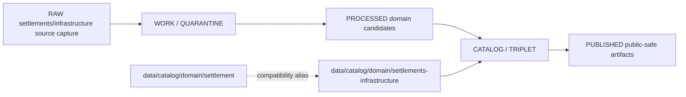

<!-- [KFM_META_BLOCK_V2]
doc_id: kfm://doc/data-catalog-domain-settlements-infrastructure-readme
title: data/catalog/domain/settlements-infrastructure/README.md — Settlements/Infrastructure Domain Catalog README
version: v0.1
type: readme; data-lifecycle-sublane; domain-catalog-guide
status: draft; PROPOSED; data-root; catalog-stage; settlements-infrastructure; release-gated; sensitivity-aware
owners: OWNER_TBD — Settlements/Infrastructure steward · Settlement steward · Infrastructure steward · Data steward · Catalog steward · Evidence steward · Source steward · Policy steward · Release steward · Docs steward
created: NEEDS VERIFICATION — blank placeholder existed before v0.1 expansion
updated: 2026-06-24
policy_label: public-doc; data; catalog; settlements-infrastructure; lifecycle; release-gated; sensitivity-aware
tags: [kfm, data, catalog, settlements-infrastructure, settlement, infrastructure, domain-catalog, CATALOG, TRIPLET, Settlement, Municipality, CensusPlace, InfrastructureAsset, Facility, Dependency, EvidenceBundle, SourceDescriptor, ReleaseManifest]
related:
  - ../../README.md
  - ../../../README.md
  - ../settlement/README.md
  - ../../../../docs/domains/settlements-infrastructure/README.md
  - ../../../../docs/domains/settlements-infrastructure/DATA_LIFECYCLE.md
  - ../../../../docs/domains/settlements-infrastructure/CANONICAL_PATHS.md
  - ../../../../docs/domains/settlements-infrastructure/SOURCE_REGISTRY.md
  - ../../../../docs/domains/settlements-infrastructure/IDENTITY_MODEL.md
  - ../../../../contracts/domains/settlements-infrastructure/
  - ../../../../schemas/contracts/v1/domains/settlements-infrastructure/
  - ../../../../policy/domains/settlements-infrastructure/
  - ../../../../data/proofs/
  - ../../../../data/receipts/
  - ../../../../release/
notes:
  - "This file replaces a blank placeholder at `data/catalog/domain/settlements-infrastructure/README.md`."
  - "This is the governing bounded-context catalog lane for Settlements/Infrastructure unless a future ADR resolves the segment differently."
  - "The singular `data/catalog/domain/settlement/` path is a PROPOSED/CONFLICTED compatibility alias and must not become a parallel catalog authority."
  - "This folder is a CATALOG-stage domain catalog lane; it is not RAW, WORK, QUARANTINE, PROCESSED, PUBLISHED, proof storage, source registry, release authority, schema authority, policy authority, implementation code, or a public data surface."
  - "Rollback target for this replacement is previous blank blob SHA `8b137891791fe96927ad78e64b0aad7bded08bdc`."
[/KFM_META_BLOCK_V2] -->

# data/catalog/domain/settlements-infrastructure

> Settlements/Infrastructure domain catalog lane for governed catalog records and indexes inside the `CATALOG / TRIPLET` lifecycle stage.

  
  
  
  
  
  

**Status:** draft / PROPOSED  
**Path:** `data/catalog/domain/settlements-infrastructure/README.md`  
**Owning root:** `data/catalog/domain/`  
**Domain segment:** `settlements-infrastructure`  
**Compatibility alias:** `data/catalog/domain/settlement/`  
**Lifecycle stage:** `CATALOG / TRIPLET`  
**Exposure posture:** release-gated; public records require evidence, policy, sensitivity, receipts, and release linkage  
**Truth posture:** CONFIRMED target was blank · CONFIRMED `data/catalog/` is CATALOG-stage and RELEASED ONLY for public exposure · CONFIRMED Settlements/Infrastructure doctrine owns settlement, municipality, census place, townsite, ghost town, fort, mission, reservation community, infrastructure asset, facility, operator, condition observation, and dependency families · CONFIRMED canonical-path docs treat `settlements-infrastructure` as the working domain slug while tracking `settlement` as a CONFLICTED alias · NEEDS VERIFICATION for catalog inventory, schemas, validators, source registry records, policy gates, receipts, release manifests, public APIs, map behavior, and runtime behavior.

**Quick jumps:** [Purpose](#purpose) · [Lifecycle boundary](#lifecycle-boundary) · [Repo fit](#repo-fit) · [Accepted contents](#accepted-contents) · [Exclusions](#exclusions) · [Compatibility alias](#compatibility-alias) · [Catalog requirements](#catalog-requirements) · [Guardrails](#guardrails) · [Evidence ledger](#evidence-ledger) · [Validation checklist](#validation-checklist) · [Rollback](#rollback)

---

## Purpose

`data/catalog/domain/settlements-infrastructure/` stores or stages Settlements/Infrastructure catalog records and indexes that connect settlements, municipalities, census places, townsites, ghost towns, forts, missions, reservation communities, infrastructure assets, network nodes/segments, facilities, service areas, operators, condition observations, dependencies, evidence references, source roles, sensitivity posture, receipts, and release state.

A domain catalog record supports discovery, steward review, catalog closure, and release preparation. It does **not** make a settlement, place, infrastructure, operator, dependency, legal-status, map, or public-release claim true by itself.

## Lifecycle boundary

This lane is a CATALOG-stage domain lane. Public exposure applies only to records tied to approved release state, governed route, EvidenceBundle support, source-role support, validation, policy/review posture, and rollback target.

## Repo fit

| Responsibility | Correct home | Rule |
|---|---|---|
| Settlements/Infrastructure domain catalog records | `data/catalog/domain/settlements-infrastructure/` | This lane. |
| Settlement short-segment compatibility index | `data/catalog/domain/settlement/` | Alias only unless ADR/migration says otherwise. |
| Parent catalog stage | `data/catalog/` | Parent CATALOG-stage lane. |
| Domain doctrine | `docs/domains/settlements-infrastructure/` | Human-facing doctrine. |
| Semantic contracts | `contracts/domains/settlements-infrastructure/` | Meaning only, not lifecycle data. |
| Evidence/proof records | `data/proofs/` | EvidenceBundle and proof records. |
| Source registry | `data/registry/sources/settlements-infrastructure/` or accepted registry root | Source role, cadence, rights, and caveats. |
| Receipts | `data/receipts/` | CatalogBuildReceipt, validation, policy, review, correction, and release-related receipts. |
| Release decisions | `release/` | Publication authority. |
| Schemas and policy | `schemas/`, `policy/` | Separate roots; segment status remains NEEDS VERIFICATION where conflicted. |
| Code/tests | implementation roots and test roots | Downstream behavior, not this lane. |

## Accepted contents

- Domain catalog indexes for Settlements/Infrastructure catalog records.
- Settlement, Municipality, CensusPlace, Townsite, GhostTown, Fort, Mission, and ReservationCommunity catalog entries.
- InfrastructureAsset, NetworkNode, NetworkSegment, Facility, ServiceArea, Operator, ConditionObservation, and Dependency catalog entries.
- Public-safe derivative pointers and release-candidate indexes.
- Evidence, source, policy, sensitivity, receipt, correction, and release references.
- Migration notes or crosswalks between `settlements-infrastructure` and `settlement` paths.

## Exclusions

- RAW, WORK, QUARANTINE, PROCESSED, or PUBLISHED data.
- EvidenceBundle/proof records.
- SourceDescriptor/source-registry records.
- Receipts.
- Release decisions.
- Semantic contracts, schemas, policy rules, validators, tests, or implementation code.
- Roads/rail route truth, hydrology truth, hazards truth, ownership/person-land joins, archaeological/sacred-site coordinates, or infrastructure operational authority.
- Any public exposure shortcut around release and sensitivity controls.

## Compatibility alias

`data/catalog/domain/settlement/` is documented as a short-segment compatibility alias. It must not become a parallel authority beside this lane unless an ADR, path map, migration note, and rollback note explicitly change the boundary.

## Catalog requirements

PROPOSED until schemas, validators, inventory, access controls, and segment placement are verified:

| Requirement | Meaning |
|---|---|
| Stable catalog identity | Record has a stable identity linked to source, evidence, derivative, or release object. |
| Object-family class | Record declares the settlement, place, infrastructure, facility, operator, condition, or dependency family it represents. |
| Evidence reference | Record points to EvidenceBundle/proof context when claims depend on evidence. |
| Source reference | Record points to SourceDescriptor/source catalog where source authority matters. |
| Sensitivity posture | Record links to sensitivity classification, rights, geometry posture, access posture, and obligations where material. |
| Cross-lane boundary | Record preserves ownership of transport, hydrology, hazards, people/land, and archaeology truth. |
| Release reference | Public or release-linked records point to ReleaseManifest and rollback target. |

## Guardrails

- Catalog records are catalog carriers, not settlement, infrastructure, operator, condition, dependency, legal-status, or map truth roots.
- Critical infrastructure, operator-sensitive, condition, dependency, private-property, culturally sensitive, and exact-location details require review and release gating.
- Transport routes belong to Roads/Rail/Trade; water evidence belongs to Hydrology; hazard events belong to Hazards; person/land joins belong to People/DNA/Land; archaeological/sacred-site truth belongs to Archaeology.
- The singular `settlement` alias must not duplicate or weaken the governing `settlements-infrastructure` lane.
- Unreleased catalog records are not public merely because they exist under this directory.

## Evidence ledger

| Source | Status | Supports | Limits |
|---|---|---|---|
| Previous file | CONFIRMED | Target was blank. | No lane boundaries existed. |
| `data/catalog/README.md` | CONFIRMED | CATALOG stage and RELEASED ONLY public posture. | Does not prove catalog inventory. |
| `docs/domains/settlements-infrastructure/README.md` | CONFIRMED doctrine / PROPOSED implementation | Domain scope, object families, source families, cross-lane boundaries, and data catalog path expectation. | Does not prove implementation. |
| `docs/domains/settlements-infrastructure/DATA_LIFECYCLE.md` | CONFIRMED doctrine / PROPOSED implementation | Lifecycle invariant and explicit `settlements-infrastructure` versus `settlement` conflict. | Repo implementation remains NEEDS VERIFICATION. |
| `docs/domains/settlements-infrastructure/CANONICAL_PATHS.md` | CONFIRMED doctrine / PROPOSED implementation | Working canonical form and OPEN-CP-01 segment conflict. | ADR/migration remains unresolved. |
| `data/catalog/domain/settlement/README.md` | CONFIRMED alias evidence | Existing short `settlement` catalog compatibility alias. | Alias does not replace this lane. |

## Validation checklist

- [ ] Confirm actual child files and catalog inventory under this lane.
- [ ] Confirm whether `data/catalog/domain/settlement/` remains compatibility, migrates, or redirects.
- [ ] Confirm schema/profile location and segment naming.
- [ ] Confirm validators, access policy, receipts, release linkage, and route behavior.
- [ ] Confirm object-family separation and cross-lane ownership boundaries.
- [ ] Confirm public-safe derivative and rollback behavior.

## Rollback

Rollback is required if this lane becomes a source-data root, proof store, source-registry root, release-decision root, published-output root, schema root, policy root, validator root, implementation root, or public exposure shortcut.

Rollback target for this replacement: previous blank blob SHA `8b137891791fe96927ad78e64b0aad7bded08bdc`.

<a href="#top">Back to top</a>

