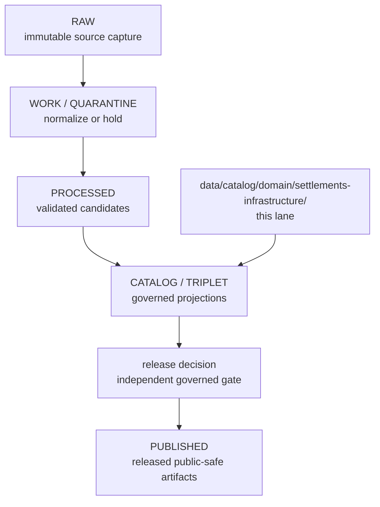

<!-- [KFM_META_BLOCK_V2]
doc_id: kfm://doc/data-catalog-domain-settlements-infrastructure-readme
title: data/catalog/domain/settlements-infrastructure/ - Governed Settlements / Infrastructure Catalog Lane
version: v0.2.0
type: readme; data-lifecycle-sublane; domain-catalog-guide
status: repository-grounded draft; catalog-stage; settlements-infrastructure; release-gated; legal-status-aware; source-role-aware; sensitivity-aware; implementation-incomplete; slug-CONFLICTED-with-singular-settlement
owners: NEEDS VERIFICATION - Settlements/Infrastructure domain steward · Settlements steward · Infrastructure steward · Data steward · Catalog steward · Evidence steward · Source steward · Rights/sensitivity steward · Policy steward · Validation steward · Release steward · Correction/rollback steward · Docs steward
created: NEEDS VERIFICATION - blank placeholder existed before v0.1 expansion
updated: 2026-07-25
supersedes: v0.1 at the same canonical path; no catalog record, lifecycle state, source admission, policy decision, release, route, or publication state
policy_label: restricted-review; no-direct-public-path; release-gated; legal-status-anti-inference; critical-infrastructure-fail-closed; cultural-sovereignty-aware; source-role-anti-collapse
tags: [kfm, data, catalog, settlements-infrastructure, settlement, infrastructure, CATALOG, TRIPLET, Settlement, Municipality, CensusPlace, Townsite, GhostTown, Fort, Mission, ReservationCommunity, InfrastructureAsset, NetworkNode, NetworkSegment, Facility, ServiceArea, Operator, ConditionObservation, Dependency, EvidenceBundle, SourceDescriptor, CatalogMatrix, ReleaseManifest, correction, rollback]
baseline:
  ref: main@73214c6a6aa6ac14f729e8c15c00014a1ffdd04f
  target_blob: 0f7554b1fb11c0d39aae7fa32175e2fe460c4880
  historical_blank_blob: 8b137891791fe96927ad78e64b0aad7bded08bdc
related:
  - ../README.md
  - ../../README.md
  - ../../../README.md
  - ../../../../docs/doctrine/directory-rules.md
  - ../../../../docs/domains/settlements-infrastructure/README.md
  - ../../../../docs/domains/settlements-infrastructure/DATA_LIFECYCLE.md
  - ../../../../docs/domains/settlements-infrastructure/CANONICAL_PATHS.md
  - ../../../../docs/domains/settlements-infrastructure/SOURCE_REGISTRY.md
  - ../../../../docs/domains/settlements-infrastructure/IDENTITY_MODEL.md
  - ../../../../docs/domains/settlements-infrastructure/SENSITIVITY.md
  - ../settlement/README.md
  - ../../../../catalog/domain/settlements-infrastructure/README.md
  - ../../../../contracts/domains/settlements-infrastructure/README.md
  - ../../../../schemas/contracts/v1/domains/settlements-infrastructure/README.md
  - ../../../../policy/domains/settlements-infrastructure/README.md
  - ../../../registry/sources/settlements-infrastructure/README.md
  - ../../../../tests/domains/settlements-infrastructure/README.md
  - ../../../../fixtures/domains/settlements-infrastructure/README.md
  - ../../../../tools/validators/domains/settlements-infrastructure/README.md
  - ../../../../pipelines/domains/settlements-infrastructure/README.md
  - ../../../../pipeline_specs/settlements-infrastructure/README.md
  - ../../../../release/candidates/settlements-infrastructure/README.md
  - ../../../proofs/settlements-infrastructure/README.md
  - ../../../published/settlements-infrastructure/README.md
  - ../../../published/layers/settlements-infrastructure/README.md
  - ../../../rollback/settlements-infrastructure/README.md
notes:
  - "This revision upgrades the existing README in place and preserves the stable doc_id, canonical path, historical blank-blob lineage, legacy fragments, and material governance boundaries."
  - "Directory Rules sections 4, 9, 12, and 15 support this responsibility-root, lifecycle-phase, domain-segment, and README-contract posture."
  - "The pinned target subtree contains only this README and .gitkeep; no Settlements/Infrastructure catalog payload is established."
  - "The singular data/catalog/domain/settlement/ lane remains a PROPOSED / CONFLICTED compatibility alias and must not become parallel catalog authority."
  - "Settlements/Infrastructure-specific STAC, DCAT, and PROV child lanes are absent at the pinned baseline; the triplets lane is marker-only."
  - "Fifteen domain schemas are permissive PROPOSED stubs; the declared CatalogMatrix contract and fixture root are absent, and its validator raises NotImplementedError."
  - "The tracked source and published-layer YAML files are explicitly PROPOSED placeholders, not admitted sources, released artifacts, or publication authority."
[/KFM_META_BLOCK_V2] -->

# `data/catalog/domain/settlements-infrastructure/` - Governed Settlements / Infrastructure Catalog Lane

> Organize release-gated Settlements / Infrastructure catalog records at the `CATALOG / TRIPLET` stage without turning catalog placement, a gazetteer entry, census geography, a map feature, a facility record, a condition observation, a dependency edge, or generated language into sovereign truth.

> [!IMPORTANT]
> A catalog record is a governed discovery carrier. It does not admit a source, prove municipal or operational status, resolve an `EvidenceRef`, clear rights, apply policy, approve a public-safe transform, authorize release, or publish an artifact.

> [!CAUTION]
> Do not place source payloads, secrets, exact critical-asset geometry, infrastructure interiors, operator-sensitive details, condition or vulnerability detail, dependency topology, private-property or living-person joins, culturally controlled information, exact archaeology-adjacent locations, or unpublished canonical records in this lane. Unknown rights, source role, evidence, sensitivity, review, or release state blocks public-bound use.

> [!NOTE]
> `CONFIRMED` means verified at the pinned repository baseline. `PROPOSED` means designed but not accepted and verified. `NEEDS VERIFICATION` is checkable but unresolved. `UNKNOWN` was not established. `CONFLICTED` identifies incompatible evidence or authority that requires a governed decision.

**Quick navigation:** [Purpose](#purpose) · [Authority](#authority-level) · [Status](#status) · [Belongs](#what-belongs-here) · [Exclusions](#what-does-not-belong-here) · [Inputs](#inputs) · [Outputs](#outputs) · [Validation](#validation) · [Review](#review-burden) · [Related folders](#related-folders) · [ADRs](#adrs) · [Last reviewed](#last-reviewed) · [Lifecycle](#lifecycle-and-catalog-boundary) · [Requirements](#settlements--infrastructure-catalog-requirements) · [Guardrails](#identity-legal-status-source-role-and-cross-domain-guardrails) · [Sensitivity](#critical-infrastructure-cultural-context-and-public-safe-representation) · [Aliases and projections](#compatibility-alias-and-catalog-projections) · [Evidence](#evidence-basis) · [Closure](#projection-and-release-closure) · [Rollback](#migration-correction-and-rollback) · [Open verification](#open-verification-register) · [Done](#definition-of-done) · [No-loss ledger](#no-loss-ledger)

---

## Purpose

`data/catalog/domain/settlements-infrastructure/` is the domain-scoped catalog lane for governed Settlements / Infrastructure records after upstream source admission, normalization, quarantine handling, validation, evidence binding, source-role classification, rights review, legal- and operational-status review, and sensitivity review have produced a catalog-eligible candidate.

The lane may organize catalog descriptions of `Settlement`, `Municipality`, `CensusPlace`, `Townsite`, `GhostTown`, `Fort`, `Mission`, `ReservationCommunity`, `InfrastructureAsset`, `NetworkNode`, `NetworkSegment`, `Facility`, `ServiceArea`, `Operator`, `ConditionObservation`, `Dependency`, public-safe derivatives, and their evidence and release relationships.

Its purpose is discovery, inspection, catalog closure, and release preparation. Directory placement alone confers no truth, authority, admissibility, legal status, operational status, release, or public status.

## Authority level

**Implementation-bearing lifecycle lane under the canonical `data/` responsibility root; this README is orientation and governance documentation only.**

| Authority question | Answer |
|---|---|
| What this lane may own | Settlements / Infrastructure domain catalog records and indexes at the `CATALOG / TRIPLET` stage |
| What outranks this README | Accepted doctrine and ADRs; semantic contracts; schemas for shape; policy decisions; source registry records; evidence and proof; validation results; review records; release decisions; correction and withdrawal records; rollback targets |
| What this lane cannot decide | Source admission, object meaning, machine shape, municipal or legal status, facility operation or condition, allow/deny policy, evidence sufficiency, public-safe geometry, release, publication, correction, or rollback authorization |
| Public-client posture | No direct public read; only approved released public-safe projections may cross a governed delivery boundary |
| AI posture | Interpretive only; `EvidenceBundle` outranks generated language and catalog presentation |

Directory Rules sections 4, 9, and 12 support `data/catalog/domain/settlements-infrastructure/`: `data/` owns lifecycle material, `catalog` names the phase, and `settlements-infrastructure` is the domain segment. Section 15 directly requires the root-level README contract; this nested README adopts the same order for consistency and reviewability without claiming that the section directly mandates every nested lane.

## Status

| Surface | Observed state at `main@73214c6a6...` | Consequence |
|---|---|---|
| Canonical path and document identity | `CONFIRMED` | Update in place; preserve `kfm://doc/data-catalog-domain-settlements-infrastructure-readme` and stable fragments |
| README maturity | Repository-grounded `draft`, version `v0.2.0` | Human review remains required |
| Direct subtree inventory | `CONFIRMED`: this README and `.gitkeep` | No tracked Settlements / Infrastructure catalog payload is established in this subtree |
| Singular catalog segment | [`data/catalog/domain/settlement/`](../settlement/README.md) contains a README and marker | Compatibility alias remains `CONFLICTED`; it is not parallel authority |
| Root-level catalog mirror | [`catalog/domain/settlements-infrastructure/`](../../../../catalog/domain/settlements-infrastructure/README.md) contains a compatibility README | Drift-control fence only; no canonical data authority |
| Semantic contracts | Fifteen tracked Markdown files including the lane README; four of fifteen schema-declared contract paths resolve exactly | Meaning coverage is partial and naming alignment remains incomplete |
| Domain schemas | Fifteen JSON Schemas, all `PROPOSED`, requiring only `id` and allowing additional properties | File presence and parseability do not establish meaningful domain validation |
| Domain `CatalogMatrix` | Declared semantic contract and fixture root are absent; schema is permissive; declared validator raises `NotImplementedError` | Executable catalog closure is not established |
| Domain policy | README, four `PROPOSED` Rego scaffolds, and a marker; sampled defaults are mixed and rules are absent or placeholder-only | Accepted fail-closed policy evaluation is not established |
| Source registry | Parent README, Census TIGER child README/marker, and `historical_gazetteer.yaml` marked `PROPOSED` placeholder | No admitted source, current rights closure, activation decision, or source payload is established |
| Fixtures and tests | Fixture tree contains Markdown placeholders/markers and no JSON; seven test modules are docstring-only; smoke test is `test_placeholder` | No accepted deterministic catalog or safety suite |
| Validators | Four Python files; all exact `main(): raise NotImplementedError` scaffolds | No executable domain validator is established |
| Pipelines and specs | Eight Python placeholders; five YAML specs have `stages: []` | No catalog producer, activation, schedule, or release producer is established |
| `domain-settlements-infrastructure` workflow | `CONFIRMED` bounded readiness inspection plus explicit validation, proof, and release-dry-run holds | A held or green static result cannot prove semantic validation, evidence, policy, release, or publication |
| STAC/DCAT/PROV projections | Family roots exist; no Settlements / Infrastructure child lane exists | Do not claim projection closure or invent child paths |
| Triplet projection | `data/triplets/settlements-infrastructure/` contains only `.gitkeep` | No tracked triplet record, README, or projection closure |
| Proof lane | README and marker only | No emitted domain proof object or accepted producer |
| Release-candidate lane | README only | No tracked candidate dossier, promotion decision, or release manifest |
| Published non-layer lane | README and marker only | No tracked non-layer public artifact |
| Published layer lane | README plus `mission_sites.layer.yaml`, explicitly a `PROPOSED` placeholder | Placeholder descriptor is not released bytes, approval, or public availability |
| Rollback lane | README and marker only | Guidance exists; no release-specific rollback instance or exercised drill |
| Public routes, hosting, aliases, caches, search, graph, or deployed isolation | `UNKNOWN` | No public-availability or isolation claim |

The safe current conclusion is narrow: the repository contains a documented catalog responsibility lane and extensive implementation-shaped scaffolding, but no evidence reviewed for this revision establishes a Settlements / Infrastructure catalog payload, strict accepted profile, executable closure suite, admitted source set, proof object, release candidate, approved release, public route, or operational rollback.

## What belongs here

| Accepted material | Required boundary |
|---|---|
| Settlements / Infrastructure domain catalog records and indexes | Stable identity, object family, version, lifecycle state, and source role are explicit |
| Settlement, townsite, ghost-town, fort, mission, and reservation-community entries | Historical, cultural, legal, occupancy, continuity, and sensitivity meanings remain distinct |
| Municipality and CensusPlace entries | Legal-incorporation and statistical-geography identities cannot be inferred from one another |
| InfrastructureAsset, NetworkNode, and NetworkSegment entries | Asset and topology roles remain distinct from Roads / Rail / Trade route truth and operational authority |
| Facility, ServiceArea, and Operator entries | Current operation, service availability, access, and legal responsibility require their own time-scoped authority |
| ConditionObservation and Dependency entries | Observation time, evidence, uncertainty, sensitivity, and non-operational-warning posture remain visible |
| Source and evidence pointers | Resolve to governed `SourceDescriptor`, `EvidenceRef` / `EvidenceBundle`, proof, or accepted equivalent; do not duplicate those authorities here |
| Validation and quality summaries | Point to immutable validation/proof artifacts and state their scope and limits |
| Policy, review, sensitivity, and public-representation references | Identify applicable decisions, reason codes, review state, geometry class, and unresolved blockers |
| Release, correction, withdrawal, supersession, and rollback references | Bind public-bound records to immutable release identity and a reversible correction path |

Records may be documentation examples only when clearly labeled synthetic and non-authoritative. Real fixtures belong under `fixtures/`; real lifecycle payloads remain in their owning lifecycle lanes.

## What does NOT belong here

| Excluded material | Correct responsibility |
|---|---|
| RAW captures, source exports, or retrieval payloads | `data/raw/settlements-infrastructure/` |
| WORK intermediates | `data/work/settlements-infrastructure/` |
| Quarantined records and exit decisions | `data/quarantine/settlements-infrastructure/` plus governed quarantine records |
| Processed canonical candidates | `data/processed/settlements-infrastructure/` |
| Source identities, rights, cadence, and activation records | [`data/registry/sources/settlements-infrastructure/`](../../../registry/sources/settlements-infrastructure/README.md), subject to registry-topology resolution |
| Semantic object meaning | [`contracts/domains/settlements-infrastructure/`](../../../../contracts/domains/settlements-infrastructure/README.md) |
| Machine-checkable object shape | [`schemas/contracts/v1/domains/settlements-infrastructure/`](../../../../schemas/contracts/v1/domains/settlements-infrastructure/README.md) |
| Allow, deny, restrict, generalize, or abstain rules | [`policy/domains/settlements-infrastructure/`](../../../../policy/domains/settlements-infrastructure/README.md) and accepted cross-cutting policy lanes |
| Executable validators and regression proof | [`tools/validators/domains/settlements-infrastructure/`](../../../../tools/validators/domains/settlements-infrastructure/README.md), [`tests/domains/settlements-infrastructure/`](../../../../tests/domains/settlements-infrastructure/README.md), and [`fixtures/domains/settlements-infrastructure/`](../../../../fixtures/domains/settlements-infrastructure/README.md) |
| Pipeline implementation or declarative execution specs | [`pipelines/domains/settlements-infrastructure/`](../../../../pipelines/domains/settlements-infrastructure/README.md) and [`pipeline_specs/settlements-infrastructure/`](../../../../pipeline_specs/settlements-infrastructure/README.md) |
| STAC, DCAT, or PROV-specific domain records | Accepted child lanes under `data/catalog/stac/`, `data/catalog/dcat/`, or `data/catalog/prov/`; domain children do not exist at the pinned baseline |
| Triplet or graph projections | `data/triplets/` after a real projection contract, records, validation, and README boundary exist |
| Evidence bundles and proof artifacts | [`data/proofs/settlements-infrastructure/`](../../../proofs/settlements-infrastructure/README.md) or the accepted proof family |
| Process-memory receipts | [`data/receipts/`](../../../receipts/README.md) or an accepted domain receipt family |
| Release decisions or candidate approval | [`release/`](../../../../release/README.md) and [`release/candidates/settlements-infrastructure/`](../../../../release/candidates/settlements-infrastructure/README.md) |
| Released public-safe artifact bytes | [`data/published/settlements-infrastructure/`](../../../published/settlements-infrastructure/README.md) and [`data/published/layers/settlements-infrastructure/`](../../../published/layers/settlements-infrastructure/README.md) |
| Correction, withdrawal, and rollback authority | `release/` records plus [`data/rollback/settlements-infrastructure/`](../../../rollback/settlements-infrastructure/README.md) support |
| Roads/rail route truth, water evidence, hazard events/warnings, ownership/living-person truth, or archaeology/cultural-site truth | The owning Roads / Rail / Trade, Hydrology, Hazards, People / DNA / Land, or Archaeology lane |
| Direct public API, map, search, graph, AI, or filesystem surfaces | Governed application and delivery interfaces over approved release-resolved carriers |
| Exact critical-asset details, harmful joins, or operational suppression parameters | Restricted stores and policy-governed review paths; never ordinary public catalog content |

## Inputs

Catalog eligibility is a gate, not an assumption.

| Candidate input | Minimum required support before catalog admission |
|---|---|
| Processed domain object or derivative | Stable identity, type, version, digest, lineage, temporal scope, geometry role, and validation state |
| Source-backed claim | Resolvable source descriptor, canonical source role, evidence reference, citation context, current rights posture, authority scope, and applicable caveats |
| Municipality or legal-status assertion | Appropriate current legal or regulatory source role, effective time, jurisdiction, evidence, and explicit non-inference from census or map context |
| CensusPlace or administrative geography | Dataset and vintage identity, statistical role, boundary semantics, and warning that statistical geography is not municipal or cadastral truth |
| Historic place or gazetteer record | Source-vintage, name scope, confidence, continuity/current-status limits, and cultural or archaeology-adjacent review where material |
| Infrastructure, facility, operator, service, condition, or dependency assertion | Object role, authority basis, observed/valid/retrieval times, uncertainty, sensitivity class, and non-operational/non-emergency warning |
| Observed, regulatory, administrative, modeled, aggregate, candidate, or synthetic material | Role remains explicit and compatible with the claim; no silent upgrade or collapse |
| Cross-domain relation | Owning-lane identity, source role, evidence, time, sensitivity, join policy, and public-safe transform/review support |
| Public-bound derivative | Public-safe digest, field allowlist, transform receipt or accepted equivalent, release reference, correction path, withdrawal state, and rollback target |

Missing, contradictory, stale, or unresolved support yields a structured hold, quarantine, abstain, restrict, or deny outcome according to the governing contract and policy. It does not yield optimistic catalog admission.

## Outputs

| Output | Authority limit |
|---|---|
| Internal domain catalog record | Improves discovery and inspection; not public by directory placement |
| Domain catalog index | Groups governed records without replacing source, evidence, policy, legal status, or release state |
| Catalog-quality summary | Summarizes validated results and links to proof; does not become proof itself |
| Compatibility crosswalk | Relates long-form and short-form domain identities without making either a second authority |
| Projection crosswalk | Relates domain, STAC, DCAT, PROV, and triplet identities where realized; does not establish agreement without validation |
| Release-linked catalog projection | Describes a release-resolved public-safe artifact; does not authorize the release |
| Correction, withdrawal, or supersession pointer | Preserves historical state and current disposition without rewriting prior records |

Outputs must remain distinguishable as candidate, held, denied, restricted, released, corrected, withdrawn, superseded, or historical. A green check, catalog rendering, pull request, merge, generated receipt, or placeholder descriptor cannot coerce one state into another.

## Validation

### README validation

This revision is expected to preserve and verify:

- the exact canonical path, stable `doc_id`, historical blank-blob lineage, v0.1 purpose, and every legacy fragment;
- Directory Rules placement and README-order conformance;
- GitHub Markdown headings, tables, supported alerts, explicit anchors, badge URLs, and Mermaid syntax;
- repository-relative links only to verified files or folders with a README;
- explicit status for the empty direct catalog inventory, singular compatibility alias, absent STAC/DCAT/PROV children, marker-only triplet lane, permissive schemas, incomplete CatalogMatrix chain, placeholder source/layer descriptors, placeholder tests/validators/pipelines, hold-oriented workflow, and unknown runtime state;
- no source payload, exact sensitive location, critical-asset detail, operational suppression parameter, secret, credential, release decision, or fabricated owner;
- a one-file base-to-head diff and byte-for-byte remote readback.

### Catalog-record acceptance

| Gate | Pass evidence | Fail-closed result |
|---|---|---|
| Identity and version | Deterministic ID, object family, version, digest, temporal scopes, and supersession state | Hold; no catalog promotion |
| Legal/statistical/historic meaning | Settlement, municipality, CensusPlace, townsite, ghost-town, fort, mission, and reservation-community meanings remain distinct | Quarantine or fail |
| Infrastructure meaning | Asset, network, facility, service area, operator, condition, and dependency roles remain distinct and time-scoped | Hold or deny |
| Source role and anti-collapse | Canonical role resolves; regulatory, administrative, observed, modeled, aggregate, candidate, and synthetic meanings remain distinct | Quarantine or fail |
| Evidence and citation | `EvidenceRef` resolves to the intended `EvidenceBundle` or proof scope | Hold or abstain |
| Rights and sensitivity | Current terms, redistribution class, geometry class, joins, and reviewer obligations resolve | Restrict, deny, or quarantine |
| Public-safe representation | Exact/internal and generalized/redacted/aggregated outputs are distinct; transform lineage is immutable | No public-bound record |
| Spatial and temporal support | CRS, extent, resolution/scale, source time, observed time, valid/effective time, retrieval, build, release, and correction scopes remain inspectable | Hold |
| Catalog projection agreement | Domain, STAC, DCAT, PROV, triplet, digest, and release references agree where required | Closure failure |
| Policy and review | Applicable policy decision and required human review resolve | Hold |
| Release, correction, and rollback | Immutable release reference, correction/withdrawal state, and rollback target resolve | No publication |

> [!WARNING]
> The domain `CatalogMatrix` schema requires only `id`, allows additional properties, references an absent semantic contract and fixture root, and points to a validator that raises `NotImplementedError`. All five pipeline specifications contain `stages: []`; the pipeline files are placeholders; the only collected smoke test is `test_placeholder`; and the domain workflow records explicit readiness holds. None of those surfaces currently establishes executable catalog closure.

## Review burden

Changes to this lane are high-burden documentation changes because they describe legal/statistical place identities, critical infrastructure, cultural and sovereignty context, operationally sensitive observations, lifecycle state, and release boundaries even when the diff is Markdown-only.

| Change concern | Required review role | Why |
|---|---|---|
| Object-family, identity, or source-role language | Domain, contract, source, and identity stewards | Prevent settlement, legal, statistical, historic, infrastructure, and source-role collapse |
| Municipality or CensusPlace language | Legal/administrative-source and temporal reviewers | Prevent census or map context from becoming municipal-status authority |
| Historic, mission, fort, or reservation-community language | Domain, cultural/sovereignty, archaeology, rights, and sensitivity reviewers | Prevent overprecision, appropriation, or unauthorized disclosure |
| Facility, operator, condition, service-area, or dependency language | Infrastructure, policy, security, evidence, and sensitivity reviewers | Prevent operational, safety, emergency, or vulnerability overclaiming |
| Catalog schema, profile, or projection claims | Catalog, schema, contract, and validation stewards | Keep semantic, machine-shape, and executable claims aligned |
| Release, correction, withdrawal, or rollback claims | Independent release and correction/rollback stewards | Preserve separation of duties and reversibility |
| Public API, UI, map, search, graph, export, or AI claims | Delivery, policy, evidence, and security stewards | Prevent internal catalog records from becoming a public shortcut |

`.github/CODEOWNERS` routes the default repository review to `@bartytime4life`. Routing is not a stewardship assignment, `ReviewRecord`, independent approval, sensitivity decision, release decision, or proof that review occurred.

## Related folders

| Responsibility | Verified related lane | Relationship |
|---|---|---|
| Domain catalog parent | [`data/catalog/domain/`](../README.md) | Groups domain-scoped catalog lanes |
| Catalog parent | [`data/catalog/`](../../README.md) | Owns catalog projection responsibility |
| Data root | [`data/`](../../../README.md) | Owns lifecycle material |
| Root-level compatibility fence | [`catalog/domain/settlements-infrastructure/`](../../../../catalog/domain/settlements-infrastructure/README.md) | Redirect and drift boundary; not canonical catalog authority |
| Singular catalog alias | [`data/catalog/domain/settlement/`](../settlement/README.md) | Compatibility and slug-conflict surface; not parallel authority |
| STAC family root | [`data/catalog/stac/`](../../stac/README.md) | Domain child absent at the pinned baseline |
| DCAT family root | [`data/catalog/dcat/`](../../dcat/README.md) | Domain child absent at the pinned baseline |
| PROV family root | [`data/catalog/prov/`](../../prov/README.md) | Domain child absent at the pinned baseline |
| Triplet family root | [`data/triplets/`](../../../triplets/README.md) | Domain child is marker-only; no projection closure |
| Domain doctrine | [`docs/domains/settlements-infrastructure/`](../../../../docs/domains/settlements-infrastructure/README.md) | Domain scope, objects, lifecycle, sources, identity, sensitivity, and backlog |
| Semantic contracts | [`contracts/domains/settlements-infrastructure/`](../../../../contracts/domains/settlements-infrastructure/README.md) | Own object meaning |
| Machine schemas | [`schemas/contracts/v1/domains/settlements-infrastructure/`](../../../../schemas/contracts/v1/domains/settlements-infrastructure/README.md) | Own machine-checkable shape |
| Domain policy | [`policy/domains/settlements-infrastructure/`](../../../../policy/domains/settlements-infrastructure/README.md) | Own domain allow/deny/restrict/abstain rules |
| Source registry | [`data/registry/sources/settlements-infrastructure/`](../../../registry/sources/settlements-infrastructure/README.md) | Source-admission boundary with placeholder-only tracked descriptor |
| Alternate registry surface | [`data/registry/settlements-infrastructure/`](../../../registry/settlements-infrastructure/README.md) | Existing topology conflict; canonical disposition unresolved |
| Fixtures and tests | [`fixtures/domains/settlements-infrastructure/`](../../../../fixtures/domains/settlements-infrastructure/README.md) · [`tests/domains/settlements-infrastructure/`](../../../../tests/domains/settlements-infrastructure/README.md) | Intended deterministic public-safe proof surfaces |
| Validators and pipelines | [`tools/validators/domains/settlements-infrastructure/`](../../../../tools/validators/domains/settlements-infrastructure/README.md) · [`pipelines/domains/settlements-infrastructure/`](../../../../pipelines/domains/settlements-infrastructure/README.md) · [`pipeline_specs/settlements-infrastructure/`](../../../../pipeline_specs/settlements-infrastructure/README.md) | Executable and declarative producer/validation surfaces |
| Proofs and receipts | [`data/proofs/settlements-infrastructure/`](../../../proofs/settlements-infrastructure/README.md) · [`data/receipts/`](../../../receipts/README.md) | Evidence/proof support and process memory |
| Release candidates | [`release/candidates/settlements-infrastructure/`](../../../../release/candidates/settlements-infrastructure/README.md) | Candidate review lane; no tracked dossier |
| Published non-layer artifacts | [`data/published/settlements-infrastructure/`](../../../published/settlements-infrastructure/README.md) | Released public-safe carriers only; no tracked payload |
| Published map layers | [`data/published/layers/settlements-infrastructure/`](../../../published/layers/settlements-infrastructure/README.md) | Contains a `PROPOSED` placeholder descriptor, not a release |
| Rollback support | [`data/rollback/settlements-infrastructure/`](../../../rollback/settlements-infrastructure/README.md) | Data-plane rollback support; not release authority |

## ADRs

| Decision record | Status at the pinned baseline | Bearing on this lane |
|---|---|---|
| [`ADR-0001`](../../../../docs/adr/ADR-0001-schema-home--schemas-contracts-v1-is-canonical.md) | `proposed` | Identifies the intended machine-schema home without accepting domain schema maturity |
| [`ADR-0002`](../../../../docs/adr/ADR-0002-contracts-vs-schemas-split.md) | `draft` | Separates semantic meaning from machine shape |
| [`ADR-0010`](../../../../docs/adr/ADR-0010-deny-by-default-for-dna-rare-species-archaeology-infrastructure.md) | `draft` | Defines a deny-by-default proposal for critical-infrastructure and other sensitive classes |
| [`ADR-0011`](../../../../docs/adr/ADR-0011-receipts-vs-proofs-vs-manifests-vs-catalog-separation.md) | `proposed` | Separates catalog, receipt, proof, manifest, and release authority |
| [`ADR-0015`](../../../../docs/adr/ADR-0015-data-published-_domain_-current-alias-is-governed-by-rollback_card.md) | `draft` | Proposes governed public-alias rollback semantics |
| [`ADR-0022`](../../../../docs/adr/ADR-0022-catalog-matrix--stac-+-dcat-+-prov-must-agree.md) | `proposed` | Requires domain, STAC, DCAT, and PROV agreement before catalog closure |
| [`ADR-0025`](../../../../docs/adr/ADR-0025-public-client-never-reads-canonical-internal-stores.md) | `draft` | Keeps public clients behind governed interfaces |

This README treats those records as proposed or draft guidance. It does not accept them, resolve the `settlement` versus `settlements-infrastructure` segment conflict, activate sources, or create migration authority.

## Last reviewed

- **Date:** 2026-07-25
- **Evidence boundary:** `main@73214c6a6aa6ac14f729e8c15c00014a1ffdd04f`
- **Target blob:** `0f7554b1fb11c0d39aae7fa32175e2fe460c4880`
- **Method:** complete target read; recursive target and related-lane `git ls-tree` inventory; Directory Rules PDF extraction and visual review; Settlements / Infrastructure Atlas extraction and visual review; cross-check of domain doctrine, contracts, schemas, policy, source registries, fixtures, tests, validators, pipelines/specs, workflow, proof, release-candidate, published, and rollback lanes
- **Not exercised:** live source access, source admission, policy evaluation, domain validator execution, catalog generation, catalog closure, sensitive join, public-safe transform, proof production, candidate assembly, release, deployment, publication, governed API route, cache invalidation, or rollback drill

Re-review on authority or topology changes, source-role vocabulary changes, source admission, catalog schema/profile acceptance, writer/consumer implementation, sensitivity policy, release, public-consumer, correction, or rollback changes - or within six months.

## Lifecycle and catalog boundary

```mermaid
flowchart TD
    RAW["RAW<br/>immutable source capture"] --> WQ["WORK / QUARANTINE<br/>normalize or hold"]
    WQ --> PROC["PROCESSED<br/>validated candidates"]
    PROC --> CAT["CATALOG / TRIPLET<br/>governed projections"]
    CAT --> REL["release decision<br/>independent governed gate"]
    REL --> PUB["PUBLISHED<br/>released public-safe artifacts"]
    LANE["data/catalog/domain/settlements-infrastructure/<br/>this lane"] --> CAT
```

The lifecycle invariant is:

> **RAW -> WORK / QUARANTINE -> PROCESSED -> CATALOG / TRIPLET -> PUBLISHED**

Promotion is a governed state transition, not a file move. A catalog record can exist while held, unreleased, corrected, withdrawn, or superseded. It becomes public only when an accepted release resolves the correct artifact, evidence/proof, policy/review state, correction path, and rollback target through a governed interface.

Connectors and watchers do not publish or write durable catalog or public artifacts. They may capture source state or emit candidate decisions and receipts into their accepted lanes; catalog construction and release remain separate governed steps.

## Settlements / Infrastructure catalog requirements

The requirements below are semantic acceptance criteria, not claims that the current placeholder schemas enforce every field.

| Requirement | Minimum meaning |
|---|---|
| Stable identity | Deterministic catalog identity binds domain, object family, source/object identity, version, temporal scope, and content digest where applicable |
| Object family | Settlement, legal municipality, CensusPlace, historic place, community, asset, network, facility, service area, operator, condition, or dependency role is explicit |
| Legal and operational authority | Legal status, operation, condition, service, and dependency claims identify the owning authority, scope, time, and caveats; none is inferred from map presence |
| Source role | Canonical role is preserved from admission; a downstream product carries its own role and never silently upgrades its inputs |
| Spatial support | CRS, extent, geometry role, scale/resolution, generalization class, and public/internal geometry relationship are inspectable |
| Temporal support | Source, observed, valid/effective, retrieval, processing/build, census vintage, release, correction, and supersession times remain distinct where material |
| Evidence support | Consequential claims resolve through `EvidenceRef` to the applicable `EvidenceBundle` or proof scope |
| Rights and sensitivity | Current rights, attribution, redistribution, access, sensitivity, join risk, field allowlist, transform, obligations, and review state resolve |
| Cross-domain boundary | Roads/rail, hydrology, hazards, people/land, archaeology/cultural, and other owning-lane truth remains separate and traceable |
| Catalog closure | Domain, STAC, DCAT, PROV, and triplet identities/digests agree where those projections are accepted and emitted |
| Release linkage | Public-bound records resolve immutable artifacts, release decision/manifest, review state, correction/withdrawal state, and rollback target |
| Finite state | Candidate, held, denied, restricted, released, corrected, withdrawn, superseded, and historical states cannot be collapsed |

## Identity, legal-status, source-role, and cross-domain guardrails

Settlements / Infrastructure is a bounded context. It owns the domain meanings listed here, not every fact that can be joined to a place or facility geometry.

| Distinction | Required rule |
|---|---|
| Settlement vs Municipality | A settlement or mapped community is not proof of incorporation, charter, current legal existence, annexation, or jurisdiction |
| Municipality vs CensusPlace | Legal and statistical identities remain separate; matching names or geometry do not establish equivalence |
| Townsite or GhostTown vs current settlement | Historic, platted, abandoned, occupied, and current-status claims require separate time-scoped evidence |
| Gazetteer name vs authority | A name record is evidence about naming or location context, not municipal, ownership, access, or current-status authority |
| ReservationCommunity, Mission, or Fort vs open public site | Community, sovereignty, cultural, religious, historic, and archaeology-adjacent meanings remain review-bound and do not imply access |
| InfrastructureAsset or Facility vs operation | A mapped asset or facility does not prove current operation, capacity, safety, availability, condition, ownership, or access |
| ServiceArea vs service guarantee | An administrative, modeled, or observed service area does not guarantee service to a person, parcel, address, or time |
| ConditionObservation vs current condition | A time-scoped observation cannot be presented as evergreen engineering, safety, emergency, or operational status |
| Dependency vs public topology | A dependency relation is sensitive, time-scoped evidence; it is not automatically safe to expose or use as operational guidance |
| Settlements / Infrastructure vs Roads / Rail / Trade | Transport-route, crossing, bridge, corridor, and restriction truth stays with Roads / Rail / Trade |
| Settlements / Infrastructure vs Hydrology and Hazards | Water evidence, flood context, hazard events, warnings, and declarations stay with their owning lanes |
| Settlements / Infrastructure vs People / DNA / Land | Ownership, title, parcel, residence, living-person, and DNA truth stays with People / DNA / Land |
| Settlements / Infrastructure vs Archaeology | Archaeological, burial, sacred, and culturally controlled site truth stays with Archaeology and applicable rights holders |
| Catalog summary vs proof | A summary may point to evidence and validation; it does not become an `EvidenceBundle`, proof, policy decision, or release |
| Map or AI presentation vs truth | Rendering and generated language remain evidence-subordinate, policy-aware, release-resolved interpretations |

The domain source doctrine uses source-role ideas including authority, observation, context, model, administrative, aggregate, candidate, and synthetic. Repository documents also use partially different role vocabularies. The final enum and mapping are `CONFLICTED / NEEDS VERIFICATION`; catalog records must not silently translate or upgrade roles.

## Critical infrastructure, cultural context, and public-safe representation

Settlements / Infrastructure data can become sensitive through detail or combination even when each input looks ordinary alone. Exact joins among facilities, interiors, utilities, operators, conditions, dependencies, private land, living persons, reservation communities, missions, forts, archaeology, cultural material, or repeated observations can create security, privacy, sovereignty, access, and misuse risk.

| Condition | Fail-closed result |
|---|---|
| Rights, redistribution, attribution, or access terms unresolved | Hold or deny public-bound use |
| Source role, evidence, legal status, or operational meaning unresolved | Quarantine, abstain, or deny |
| Exact critical-asset, interior, condition, vulnerability, dependency, or operator-sensitive detail present | Keep restricted; aggregate, generalize, redact, delay, or deny through approved policy |
| Private-property, address, residence, or living-person join present | Apply the more restrictive posture and require join-specific review |
| Reservation-community, mission, fort, burial-adjacent, sacred, or culturally controlled context present | Require rights-holder, cultural/sovereignty, archaeology, and sensitivity review as applicable |
| Join raises sensitivity above either input | Apply the most restrictive applicable posture and require join-specific review |
| Public field allowlist or geometry class unresolved | Deny the public derivative |
| Transform lacks immutable input/output digests, reason, policy, reviewer, and residual-risk record | No public-bound record |
| Style or client-side filter is the only concealment | Deny; make the bytes public-safe before tiling or export |
| Review, release, correction, withdrawal, or rollback support absent | Keep unreleased and unavailable to ordinary public clients |

Public-safe representation may include generalized footprints, coarse aggregates, suppressed attributes, categorical condition summaries, severed dependency detail, delayed publication, county or regional summaries, or a fully denied geometry. The chosen result must remain tied to evidence, policy, review, transform lineage, residual risk, release state, correction, and rollback.

## Compatibility alias and catalog projections

| Lane or projection | Bounded state at `main@73214c6a6...` | Interpretation |
|---|---|---|
| `data/catalog/domain/settlements-infrastructure/` | This README plus `.gitkeep`; no tracked payload | Working canonical placement, not implemented catalog proof |
| `data/catalog/domain/settlement/` | README plus `.gitkeep` | `PROPOSED / CONFLICTED` compatibility alias; not parallel authority |
| `catalog/domain/settlements-infrastructure/` | Compatibility README only | Root-level redirect and drift fence |
| `data/catalog/stac/settlements-infrastructure/` | Not present | No domain STAC closure claim |
| `data/catalog/dcat/settlements-infrastructure/` | Not present | No domain DCAT closure claim |
| `data/catalog/prov/settlements-infrastructure/` | Not present | No domain PROV closure claim |
| `data/triplets/settlements-infrastructure/` | `.gitkeep` only; no README or record | No triplet closure claim |
| `data/registry/sources/settlements-infrastructure/` | README, Census TIGER child README/marker, and `PROPOSED` placeholder gazetteer YAML | Source boundary exists; admission and activation do not |
| `release/candidates/settlements-infrastructure/` | README only | Review structure exists; no tracked candidate or release |
| `data/proofs/settlements-infrastructure/` | README plus `.gitkeep` | Proof boundary exists; no emitted proof object |
| `data/published/settlements-infrastructure/` | README plus `.gitkeep` | Non-layer publication boundary exists; no tracked payload |
| `data/published/layers/settlements-infrastructure/` | README plus `mission_sites.layer.yaml`, marked `PROPOSED` placeholder | Placeholder descriptor is not released bytes or approval |
| `data/rollback/settlements-infrastructure/` | README plus `.gitkeep` | Rollback guidance exists; no release-specific instance |

Do not create additional catalog children merely to make a diagram or completeness claim true. New lanes require responsibility-root confirmation, a real artifact family, accepted contract/schema/policy posture, validation, migration/rollback handling, and any ADR required by Directory Rules.

## Evidence basis

| Evidence | Status | Supports | Limits |
|---|---|---|---|
| [Directory Rules](../../../../docs/doctrine/directory-rules.md) plus supplied PDF visual review | `CONFIRMED` governing placement doctrine | `data/` lifecycle ownership, catalog phase, domain segment, responsibility-root separation, README contract | Does not prove payloads, runtime, release, or public behavior |
| Pinned Git tree for this subtree | `CONFIRMED` | Exactly two tracked paths: README and marker | Does not inspect external object stores, ignored files, or runtime state |
| [Settlements / Infrastructure domain README](../../../../docs/domains/settlements-infrastructure/README.md) and supplied consolidated domain Atlas | Doctrine `CONFIRMED`; implementation largely `PROPOSED` | Object spine, lifecycle, non-ownership, sensitivity, publication gates | Planning and doctrine are not executable proof |
| [Canonical paths](../../../../docs/domains/settlements-infrastructure/CANONICAL_PATHS.md), [lifecycle](../../../../docs/domains/settlements-infrastructure/DATA_LIFECYCLE.md), and [identity model](../../../../docs/domains/settlements-infrastructure/IDENTITY_MODEL.md) | `CONFIRMED` repository documents | Working long-form segment, slug conflict, identity and time requirements | Do not resolve the conflict or prove implementation |
| [Domain contracts](../../../../contracts/domains/settlements-infrastructure/README.md) | `CONFIRMED` draft semantic lane | Object meanings, identity, crosswalks, and non-ownership boundaries | Only four schema-declared contract paths resolve exactly |
| [Domain schema index](../../../../schemas/contracts/v1/domains/settlements-infrastructure/README.md) and schema files | `CONFIRMED` files; `PROPOSED` maturity | Machine-shape surfaces exist | All fifteen schemas require only `id`, allow extra fields, and lack complete contract/fixture/validator closure |
| [Domain source registry](../../../registry/sources/settlements-infrastructure/README.md) and alternate registry | `CONFIRMED` repository surfaces; contents incomplete | Candidate source-family boundaries and topology conflict | No admitted source, verified rights, activation, or source payload |
| [Domain policy](../../../../policy/domains/settlements-infrastructure/README.md) | `CONFIRMED` scaffolds | Proposed policy locations and conservative intent | No accepted evaluation, consistent fail-closed rules, decision receipt, or coverage proof |
| [Tests](../../../../tests/domains/settlements-infrastructure/README.md), [fixtures](../../../../fixtures/domains/settlements-infrastructure/README.md), and [validators](../../../../tools/validators/domains/settlements-infrastructure/README.md) | `CONFIRMED` placeholders and scaffolds | Planned proof families and current readiness inputs | Placeholder smoke test and `NotImplementedError` validators are not accepted validation |
| [Pipeline](../../../../pipelines/domains/settlements-infrastructure/README.md), [spec](../../../../pipeline_specs/settlements-infrastructure/README.md), and [workflow](../../../../.github/workflows/domain-settlements-infrastructure.yml) | `CONFIRMED` files | Placeholder code, empty stages, and explicit holds | No catalog production, proof production, or release execution |
| [Release-candidate README](../../../../release/candidates/settlements-infrastructure/README.md) | `CONFIRMED` review boundary | Candidate requirements and explicit workflow holds | No tracked dossier, decision, manifest, or release |
| [Published lanes](../../../published/settlements-infrastructure/README.md), [published layers](../../../published/layers/settlements-infrastructure/README.md), and [rollback support](../../../rollback/settlements-infrastructure/README.md) | `CONFIRMED` guidance plus one placeholder layer YAML | Public bytes and rollback support remain downstream and separate from catalog | No approved release, public route, alias switch, or drill was exercised |

## Projection and release closure

Catalog closure is not a single schema pass. It is agreement among every projection and trust-bearing reference required for the record.

| Closure surface | Current result | Blocking evidence |
|---|---|---|
| Domain catalog payload | `NOT ESTABLISHED` | Subtree contains README and marker only |
| Domain `CatalogMatrix` semantics and shape | `FAIL-CLOSED / INCOMPLETE` | Missing semantic contract and fixtures; permissive `PROPOSED` schema |
| Domain catalog validator | `NOT IMPLEMENTED` | `validate_catalog_matrix.py` raises `NotImplementedError` |
| Domain catalog producer | `NOT IMPLEMENTED` | Empty spec stages and placeholder pipeline files |
| Source admission | `NOT ESTABLISHED` | Tracked descriptor is an explicit placeholder; rights and activation unresolved |
| STAC projection | `NOT PRESENT` | No domain child lane or emitted records |
| DCAT projection | `NOT PRESENT` | No domain child lane or emitted records |
| PROV projection | `NOT PRESENT` | No domain child lane or emitted records |
| Triplet projection | `NOT ESTABLISHED` | Marker-only lane with no README or records |
| Policy and review closure | `NOT ESTABLISHED` | Proposed scaffolds and no accepted decision/review record |
| Evidence and proof closure | `NOT ESTABLISHED` | Proof lane contains documentation and marker only; no accepted producer |
| Release candidate | `NOT PRESENT IN TRACKED LANE` | Candidate lane contains only its README |
| Release closure | `NOT ESTABLISHED` | No promotion decision or release manifest resolved for this catalog lane |
| Published artifact | `NOT ESTABLISHED` | Non-layer lane is marker-only; layer YAML is explicitly a placeholder |
| Public delivery | `NOT ESTABLISHED` | No released artifact or governed route was exercised |

Therefore this README must not advertise a completed catalog, successful projection closure, source admission, release readiness, public API availability, current municipal or infrastructure status, or published layer.

## Migration, correction, and rollback

This v0.2 change is documentation-only. It does not move a payload, create a catalog record, activate a source, change policy, graduate a validator, add a pipeline stage, assemble a candidate, approve a release, update an alias, or publish an artifact.

### README rollback

- Before merge, close or abandon the review branch.
- After merge, revert the documentation commit or restore the pinned v0.1 blob `0f7554b1fb11c0d39aae7fa32175e2fe460c4880`.
- Preserve historical blank blob `8b137891791fe96927ad78e64b0aad7bded08bdc` as lineage, not as the default rollback target for this substantive v0.1-to-v0.2 modernization.

### Alias migration

Any future disposition of `data/catalog/domain/settlement/` must:

1. identify the accepted canonical segment and affected writers, consumers, IDs, links, caches, and release records;
2. preserve redirects or crosswalks during a documented compatibility window;
3. prevent dual writes and parallel authority;
4. validate source, evidence, policy, catalog, triplet, release, correction, and rollback references;
5. record the migration and rollback target through the required ADR or migration mechanism.

This README performs no alias migration.

### Future catalog correction

Do not silently edit a previously released meaning or artifact. Record correction, withdrawal, supersession, stale state, affected records and derivatives, public-surface invalidation, and rollback support in their owning governance lanes. Catalog records point to that state; they do not become correction or rollback authority.

## Open verification register

| Item | Current state | Evidence needed to close |
|---|---|---|
| `settlements-infrastructure` versus `settlement` segment | `CONFLICTED` | Accepted ADR, path map, migration plan, compatibility window, consumer inventory, and rollback target |
| Steward assignments and independent review | `NEEDS VERIFICATION` | Verified stewardship assignments, review rules, and separation-of-duties controls |
| Complete catalog inventory | `NOT ESTABLISHED` | Deterministic inventory plus immutable record identities and digests |
| `CatalogMatrix` semantics and strict shape | `INCOMPLETE` | Accepted contract, strict schema, public-safe fixtures, validator, tests, and report semantics |
| Domain schema suite | `PROPOSED` | Complete contract/fixture/validator pairings, strict fields, negative fixtures, and accepted tests |
| Source-registry topology | `CONFLICTED` | Accepted canonical registry path and migration note for alternate surfaces |
| Source admission, rights, and authority | `NOT ESTABLISHED` | Complete descriptors, rights review, source-role mapping, activation decisions, freshness rules, and correction path |
| Municipality and legal-status authority | `NEEDS VERIFICATION` | Accepted authority sources, effective-time rules, anti-inference tests, and review |
| Critical-infrastructure and cultural policy | `NOT ESTABLISHED` | Accepted policy, sensitivity classes, synthetic fixtures, negative tests, review rules, and decision receipts |
| Deterministic tests and validators | `NOT IMPLEMENTED` | Fixture-backed positive/negative suite and finite fail-closed validator outcomes |
| Catalog producer and receipts | `NOT IMPLEMENTED` | Non-empty accepted spec, executable producer, deterministic output, validation, receipts, and no-network proof |
| STAC/DCAT/PROV/triplet projections | `NOT PRESENT / NOT ESTABLISHED` | Accepted profiles, emitted records, identity/digest agreement, and closure validation |
| Evidence and proof production | `NOT ESTABLISHED` | Emitted EvidenceBundle/proof objects, accepted producer, validation, and review |
| Candidate, release, and public artifact | `NOT ESTABLISHED` | Candidate dossier, policy/review closure, immutable manifest, approved public-safe bytes, correction path, and rollback target |
| Governed public consumers | `UNKNOWN` | Release-resolved API/map/search/export/AI inventory, policy enforcement, cache invalidation, and route tests |
| Rollback execution | `NOT EXERCISED` | Release-specific rollback record, alias and derivative invalidation proof, consumer checks, and drill evidence |

## Definition of done

- [ ] Canonical segment and compatibility path are accepted without parallel authority.
- [ ] Catalog inventory and deterministic identities are reproducible.
- [ ] Contracts, strict schemas, fixtures, validators, tests, and finite outcomes align.
- [ ] Source roles, rights, authority, time, and activation are accepted and traceable.
- [ ] Municipality, census, historic-place, facility, condition, service, and dependency anti-inference rules are enforced.
- [ ] Critical-infrastructure, private-property, living-person, cultural, sovereignty, and archaeology-adjacent joins fail closed.
- [ ] Public-safe transforms are reproducible and receipt-bound.
- [ ] Domain, STAC, DCAT, PROV, and triplet projections close where required.
- [ ] Evidence and proof objects resolve and validate.
- [ ] Independent policy, sensitivity, and release review is recorded.
- [ ] Public artifacts are immutable, release-resolved, and served only through governed interfaces.
- [ ] Correction, withdrawal, supersession, cache invalidation, and rollback are exercised.
- [ ] This README is re-reviewed against emitted evidence and updated without overstating maturity.

## No-loss ledger

| v0.1 identity or fragment | v0.2 disposition |
|---|---|
| Stable `doc_id` and same canonical path | Preserved |
| Blank-placeholder lineage and historical blob | Preserved; historical blank distinguished from the immediate v0.1 rollback target |
| `Purpose` | Preserved and expanded with current object-family and authority evidence |
| `Lifecycle boundary` / `#lifecycle-boundary` | Preserved through explicit anchor and governed-state explanation |
| `Repo fit` / `#repo-fit` | Preserved through explicit anchor and verified responsibility matrix |
| `Accepted contents` / `#accepted-contents` | Preserved through explicit anchor and bounded acceptance table |
| `Exclusions` / `#exclusions` | Preserved through explicit anchor and responsibility-root matrix |
| `Compatibility alias` / `#compatibility-alias` | Preserved and grounded in current long/short path inventories |
| `Catalog requirements` / `#catalog-requirements` | Preserved and expanded with legal-status, source-role, spatial, temporal, closure, and release requirements |
| `Guardrails` / `#guardrails` | Preserved and expanded with anti-inference, cross-domain, sensitivity, cultural, and operational boundaries |
| `Evidence ledger` / `#evidence-ledger` | Preserved through explicit anchor and pinned evidence table |
| `Validation checklist` / `#validation-checklist` | Preserved through explicit anchor plus README and catalog-record validation |
| `Rollback` / `#rollback` | Preserved through explicit anchor, immediate prior blob, alias migration, and future correction guidance |
| Settlement and infrastructure object-family scope | Preserved; no object family removed or promoted to implemented status |
| Evidence, source, rights, sensitivity, policy, review, release, correction, and rollback gates | Preserved and made more explicit |
| Roads/rail, hydrology, hazards, people/land, and archaeology non-ownership | Preserved and expanded |
| No direct public exposure | Preserved and linked to governed-interface posture |

### Change history

#### v0.2.0 - 2026-07-25

- Modernized the existing README in place against a pinned repository baseline.
- Adopted the Directory Rules README-contract order while preserving legacy anchors.
- Replaced broad uncertainty with verified tree inventory and explicit implementation holds.
- Added legal-status, source-role, critical-infrastructure, cultural/sovereignty, cross-domain, projection-closure, correction, and rollback guardrails.
- Changed documentation only; no source, schema, contract, policy, fixture, test, validator, pipeline, workflow, proof, release, published artifact, route, deployment, or publication state.

#### v0.1 - 2026-06-24

- Replaced a blank placeholder with the first bounded catalog-lane README.
- Established the long-form working lane, singular compatibility alias, lifecycle boundary, catalog requirements, guardrails, evidence ledger, validation checklist, and historical blank-blob rollback lineage.

<a href="#top">Back to top</a>

