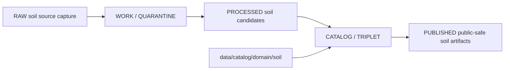

<!-- [KFM_META_BLOCK_V2]
doc_id: kfm://doc/data-catalog-domain-soil-readme
title: data/catalog/domain/soil/README.md — Soil Domain Catalog README
version: v0.1
type: readme; data-lifecycle-sublane; domain-catalog-guide
status: draft; PROPOSED; data-root; catalog-stage; soil; release-gated; source-role-aware; support-type-aware
owners: OWNER_TBD — Soil steward · Data steward · Catalog steward · Evidence steward · Source steward · Policy steward · Release steward · Schema steward · Docs steward
created: NEEDS VERIFICATION — blank placeholder existed before v0.1 expansion
updated: 2026-06-25
policy_label: public-doc; data; catalog; soil; lifecycle; release-gated; source-role-aware; support-type-aware
tags: [kfm, data, catalog, soil, domain-catalog, CATALOG, TRIPLET, SoilMapUnit, SoilComponent, Horizon, SoilProperty, HydrologicSoilGroup, Pedon, SoilProfileView, EvidenceBundle, SourceDescriptor, ReleaseManifest]
related:
  - ../../README.md
  - ../../../README.md
  - ../../../../contracts/domains/soil/README.md
  - ../../../../contracts/domains/soil/soil_map_unit.md
  - ../../../../contracts/domains/soil/soil_component.md
  - ../../../../contracts/domains/soil/component_horizon_join.md
  - ../../../../contracts/domains/soil/soil_property.md
  - ../../../../pipelines/domains/soil/ssurgo_ingest/README.md
  - ../../../../docs/sources/catalog/nrcs/ssurgo.md
  - ../../../../docs/sources/catalog/nrcs/gssurgo.md
  - ../../../../schemas/contracts/v1/domains/soil/
  - ../../../../policy/domains/soil/
  - ../../../../data/proofs/
  - ../../../../data/receipts/
  - ../../../../release/
notes:
  - "This file replaces a blank placeholder at `data/catalog/domain/soil/README.md`."
  - "Soil catalog records are CATALOG-stage carriers; they are not source data, proof storage, release decisions, schemas, policy, implementation code, or public artifacts."
  - "Soil support types must remain separate: static survey, gridded derivative, station observation, satellite grid, pedon/profile, and interpretation are not interchangeable."
  - "SSURGO/gSSURGO-derived records must preserve source vintage, support type, geometry scope, MUKEY/COKEY/CHKEY lineage, attribute provenance, evidence, policy, receipts, release, correction, and rollback linkage."
  - "Rollback target for this replacement is previous blank blob SHA `8b137891791fe96927ad78e64b0aad7bded08bdc`."
[/KFM_META_BLOCK_V2] -->

# data/catalog/domain/soil

> Soil-domain catalog lane for governed catalog records and indexes inside the `CATALOG / TRIPLET` lifecycle stage.

  
  
  
  
  
  

**Status:** draft / PROPOSED  
**Path:** `data/catalog/domain/soil/README.md`  
**Owning root:** `data/catalog/domain/`  
**Domain segment:** `soil`  
**Lifecycle stage:** `CATALOG / TRIPLET`  
**Exposure posture:** release-gated; public records require evidence, source role, support type, policy, receipts, and release linkage  
**Truth posture:** CONFIRMED target was blank · CONFIRMED `data/catalog/` is CATALOG-stage and RELEASED ONLY for public exposure · CONFIRMED Soil contracts define semantic meaning only and keep schemas, policy, source registries, lifecycle data, release manifests, and public artifacts in separate roots · CONFIRMED SSURGO ingest docs require MUKEY/COKEY/CHKEY lineage and support-type separation · NEEDS VERIFICATION for catalog inventory, schemas, validators, policy gates, receipts, release manifests, access controls, graph projections, map/API behavior, and runtime behavior.

**Quick jumps:** [Purpose](#purpose) · [Lifecycle boundary](#lifecycle-boundary) · [Repo fit](#repo-fit) · [Accepted contents](#accepted-contents) · [Exclusions](#exclusions) · [Catalog requirements](#catalog-requirements) · [Soil guardrails](#soil-guardrails) · [Evidence ledger](#evidence-ledger) · [Validation checklist](#validation-checklist) · [Rollback](#rollback)

---

## Purpose

`data/catalog/domain/soil/` stores or stages Soil-domain catalog records and indexes that connect SoilMapUnit, SoilComponent, Horizon, component-horizon joins, SoilProperty, HydrologicSoilGroup, SoilMoistureObservation, Pedon, SoilProfileView, ErosionRisk, SuitabilityRating, SoilTimeCaveat, evidence references, source roles, support types, receipts, and release state.

A Soil catalog record supports discovery, steward review, catalog closure, and release preparation. It does **not** make a soil claim true, public, policy-admitted, evidence-supported, source-authoritative, management-advisory, hydrology-authoritative, geology-authoritative, crop/yield-authoritative, or released by itself.

## Lifecycle boundary

`data/catalog/domain/soil/` is a CATALOG-stage domain lane. Public exposure applies only to records tied to approved release state, governed route, EvidenceBundle support, source-role support, support-type posture, policy/review posture, and rollback target.

## Repo fit

| Responsibility | Correct home | Rule |
|---|---|---|
| Soil domain catalog records | `data/catalog/domain/soil/` | This lane. |
| Parent catalog stage | `data/catalog/` | Parent CATALOG-stage lane. |
| Soil semantic contracts | `contracts/domains/soil/` | Meaning only, not lifecycle data. |
| SSURGO ingest logic | `pipelines/domains/soil/ssurgo_ingest/` | Executable implementation support only. |
| Soil schemas | `schemas/contracts/v1/domains/soil/` or ADR-selected equivalent | Machine shape; not this lane. |
| Soil policy | `policy/domains/soil/` or accepted policy root | Allow/deny/restrict/abstain and release rules; not this lane. |
| Source registry | `data/registry/sources/soil/` or accepted registry root | SourceDescriptor entries and source-role state. |
| Evidence/proof records | `data/proofs/` | EvidenceBundle and proof records. |
| Receipts | `data/receipts/` | CatalogBuildReceipt, validation, policy, review, transform, correction, and release receipts. |
| Release decisions | `release/` | Publication authority. |

## Accepted contents

| Content | Purpose |
|---|---|
| Soil domain catalog indexes | Group-level indexes for Soil catalog records. |
| SoilMapUnit catalog entries | Survey map-unit records with source, geometry, MUKEY, vintage, and evidence pointers. |
| SoilComponent catalog entries | Component records with COKEY, percentage/weighting posture, and map-unit relationship. |
| Horizon and component-horizon entries | Horizon records and MUKEY/COKEY/CHKEY lineage references. |
| SoilProperty catalog entries | Measured or derived property records with units, method, depth, support type, and source. |
| HydrologicSoilGroup entries | Runoff-potential classification records with not-flood-determination posture. |
| Pedon/profile entries | Pedon evidence and public-safe profile-view records. |
| Interpretation entries | ErosionRisk, SuitabilityRating, and other interpretations with derivation and limitation receipts. |
| Evidence/source/policy/release pointers | References to EvidenceBundle, SourceDescriptor, PolicyDecision, ReviewRecord, ReleaseManifest, RollbackCard, and validation reports. |

## Exclusions

| Do not put here | Correct home |
|---|---|
| RAW soil source files | `data/raw/soil/` |
| WORK/intermediate data | `data/work/soil/` |
| Quarantined data | `data/quarantine/soil/` |
| Processed soil datasets | `data/processed/soil/` |
| EvidenceBundle/proof records | `data/proofs/` |
| SourceDescriptor records | `data/registry/sources/soil/` or accepted source registry root |
| Receipts | `data/receipts/` |
| Release decisions | `release/` |
| Published public products | `data/published/.../soil/` |
| Semantic contracts | `contracts/domains/soil/` |
| Schemas | `schemas/` |
| Policy rules | `policy/` |
| Pipeline logic | `pipelines/domains/soil/` |
| Tests, validators, packages, adapters | `tests/`, `tools/validators/`, `packages/`, connector roots |

## Catalog requirements

PROPOSED until schemas, validators, inventory, and release behavior are verified:

| Requirement | Meaning |
|---|---|
| Stable catalog identity | Record has a stable identity linked to source, evidence, derivative, or release object. |
| Source role | Record preserves whether material is static survey, gridded derivative, station observation, satellite grid, pedon/profile, or interpretation. |
| Lineage keys | SSURGO/gSSURGO records preserve MUKEY, COKEY, CHKEY, survey area, product vintage, and derivation path where material. |
| Evidence reference | Record points to EvidenceBundle/proof context when claims depend on evidence. |
| Source reference | Record points to SourceDescriptor/source catalog where source authority matters. |
| Units and depth | Property records preserve units, method, depth interval, aggregation, and weighting posture. |
| Policy/review state | Record links to policy/review state where sensitivity, rights, uncertainty, or public display matter. |
| Release reference | Public or release-linked records point to ReleaseManifest and rollback target. |

## Soil guardrails

- Catalog records are catalog carriers, not Soil truth roots.
- SSURGO survey polygons are not real-time field conditions.
- A map unit is not a component; a component is not a horizon; a horizon property is not a map-unit property without derivation support.
- SSURGO vector survey material, gSSURGO gridded derivatives, SDA query outputs, station observations, satellite grids, pedons/profiles, and interpretations must remain distinct.
- Hydrologic Soil Group is not flood truth; crop suitability is not crop/yield truth; erosion risk is not a hazard declaration; soil property is not geology/lithology truth.
- Cross-lane joins to Agriculture, Hydrology, Hazards, Geology, Habitat, Flora, Fauna, or People/Land must preserve owning-lane truth and sensitivity posture.
- Unreleased Soil catalog records are not public merely because they exist under this directory.

## Evidence ledger

| Source | Status | Supports | Limits |
|---|---|---|---|
| `data/catalog/domain/soil/README.md` previous file | CONFIRMED | Target existed as a blank placeholder. | Did not define lane boundaries. |
| `data/catalog/README.md` | CONFIRMED | CATALOG-stage and RELEASED ONLY public posture. | Does not prove Soil catalog inventory. |
| `contracts/domains/soil/README.md` | CONFIRMED contract-lane evidence | Soil object-family meaning, support-type separation, responsibility-root separation. | Contract lane does not prove catalog data exists. |
| `pipelines/domains/soil/ssurgo_ingest/README.md` | CONFIRMED pipeline-lane evidence | SSURGO ingest scope, MUKEY/COKEY/CHKEY lineage, support-type separation, release-gated posture. | Pipeline lane does not prove catalog inventory or runtime behavior. |

## Validation checklist

- [ ] Confirm actual child files and Soil catalog inventory under this lane.
- [ ] Confirm Soil catalog schema/profile location.
- [ ] Confirm access policy, validators, source-role checks, support-type checks, and CI checks.
- [ ] Confirm SourceDescriptor, EvidenceBundle, RunReceipt, ValidationReport, PolicyDecision, ReviewRecord, ReleaseManifest, and RollbackCard references.
- [ ] Confirm MUKEY/COKEY/CHKEY lineage and map-unit/component/horizon separation.
- [ ] Confirm SSURGO/gSSURGO/SDA/station/satellite/pedon/interpretation separation.
- [ ] Confirm domain/STAC/DCAT/PROV catalog closure where those projections exist.
- [ ] Confirm correction, withdrawal, supersession, and rollback behavior for stale or failed records.

## Rollback

Rollback is required if this lane becomes a Soil raw-data root, work area, quarantine store, processed-data store, proof store, source-registry root, release-decision root, published-output root, semantic-contract root, schema root, policy root, validator root, implementation root, or public exposure shortcut.

Rollback target for this replacement: previous blank blob SHA `8b137891791fe96927ad78e64b0aad7bded08bdc`.

<a href="#top">Back to top</a>

