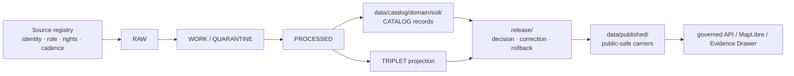

<!-- [KFM_META_BLOCK_V2]
doc_id: kfm://doc/data-catalog-domain-soil-readme
title: data/catalog/domain/soil/ — Governed Soil Catalog Lane
version: v0.2.0
type: readme; nested-directory-readme; data-lifecycle-sublane; domain-catalog-guide
status: repository-grounded draft; catalog-stage; release-gated; source-role-aware; support-type-aware; validation-held
owners: NEEDS VERIFICATION — Soil domain, data, catalog, evidence, source, rights/sensitivity, policy, validation, release, correction/rollback, and docs stewards
created: NEEDS VERIFICATION — v0.1 records that a blank placeholder preceded the expanded README
updated: 2026-07-25
supersedes: v0.1 at the same path; no catalog record, lifecycle state, policy decision, release, route, or publication state
policy_label: restricted-review; no-direct-public-path; release-gated; support-type-anti-collapse; soil-lineage-required
current_path: data/catalog/domain/soil/README.md
responsibility: document the bounded CATALOG / TRIPLET-stage home for Soil domain discovery records while preserving source role, support type, survey lineage, depth, units, time, evidence, policy, release, correction, and rollback boundaries
truth_posture: >
  CONFIRMED current path and baseline README, parent catalog boundaries, draft Soil contract
  and schema lanes, SSURGO ingest doctrine, source-registry topology variance, deterministic
  no-network test posture, explicit Soil workflow holds, and draft release-candidate posture /
  PROPOSED Soil catalog record contract and closure requirements / CONFLICTED source-registry
  and historical contract/schema topology where current repository surfaces diverge /
  UNKNOWN recursive catalog payload inventory, accepted runtime consumers, public routes,
  hosting, and operational rollback / NEEDS VERIFICATION accountable owners, field-complete
  schemas, substantive validators and tests, rights and sensitivity decisions, evidence closure,
  review, release, correction propagation, and rollback drills
evidence_snapshot:
  repository: bartytime4life/Kansas-Frontier-Matrix
  base_ref: main
  base_commit: 01af6d30466898fb029f2f6e337f11e54d086f1a
  baseline_blob: 11fed30ee3164808c56bf3a92c80ba059f8174a0
  historical_blank_blob: 8b137891791fe96927ad78e64b0aad7bded08bdc
  parent_domain_catalog_blob: 9ee3b634387ebfc5768893eb02ca6e9bc3b57dbe
  soil_contract_readme_blob: 06c5b9a435f7a9c00d5a0b9968b31a9061720d22
  soil_schema_readme_blob: da161213279c9154c6db538b044889aaab706d03
  ssurgo_pipeline_readme_blob: eb457f55d6546219e0bc898dab85c4b76739a825
  soil_workflow_blob: 1251fec171b032580e61dd6e5623273d89ffab22
related:
  - ../README.md
  - ../../README.md
  - ../../../README.md
  - ../../../../docs/doctrine/directory-rules.md
  - ../../../../docs/doctrine/lifecycle-law.md
  - ../../../../docs/domains/soil/README.md
  - ../../../../contracts/domains/soil/README.md
  - ../../../../schemas/contracts/v1/domains/soil/README.md
  - ../../../../policy/domains/soil/README.md
  - ../../../registry/sources/soil/README.md
  - ../../../../pipelines/domains/soil/ssurgo_ingest/README.md
  - ../../../../tests/domains/soil/README.md
  - ../../../../fixtures/domains/soil/README.md
  - ../../../../tools/validators/domains/soil/README.md
  - ../../../../release/candidates/soil/README.md
  - ../../../proofs/soil/README.md
  - ../../../receipts/soil/README.md
  - ../../../rollback/soil/README.md
  - ../../../published/layers/soil/README.md
  - ../../../../.github/workflows/domain-soil.yml
notes:
  - "This revision upgrades the existing README in place and preserves the stable doc_id, canonical path, historical blank-blob lineage, object-family scope, support-type separation, catalog requirements, guardrails, validation backlog, and rollback boundary."
  - "The public repository is not an access-control boundary. Do not commit secrets, restricted source payloads, private farm/owner/parcel joins, operational sensor detail, or unpublished canonical records here."
  - "A catalog record is a discovery and closure carrier; it is not Soil truth, evidence proof, policy approval, release authority, public availability, agronomic advice, conservation-compliance evidence, engineering certification, or regulatory determination."
  - "The badge strip projects inspected documentation and workflow posture only; it does not assert validation success, source admission, rights clearance, release, publication, or operational readiness."
[/KFM_META_BLOCK_V2] -->

<a id="top"></a>
<a id="datacatalogdomainsoil"></a>
<a id="data-catalog-domain-soil"></a>

# `data/catalog/domain/soil/` — Governed Soil Catalog Lane

> **One-line purpose.** Organize release-gated Soil catalog records at the `CATALOG / TRIPLET` stage without collapsing static surveys, gridded derivatives, station observations, satellite grids, pedons/profiles, interpretations, map presentation, or generated language into one truth surface.

[](#status)
[](#lifecycle-and-catalog-boundary)
[](#source-role-and-support-type-separation)
[](../../../../.github/workflows/domain-soil.yml)
[](../../../../release/candidates/soil/README.md)

> [!IMPORTANT]
> A Soil catalog record is a governed discovery and closure carrier. It does not admit a source, prove a soil claim, validate a MUKEY/COKEY/CHKEY join, resolve an `EvidenceRef`, clear rights, apply policy, approve an interpretation, authorize release, or publish an artifact.

> [!CAUTION]
> Do not place live source payloads, secrets, private farm/owner/parcel joins, restricted operational station detail, unpublished canonical records, or management recommendations in this lane. Unknown source role, support type, lineage, units, depth, time, rights, sensitivity, evidence, review, or release state blocks public-bound use.

> [!NOTE]
> `CONFIRMED` means verified at the pinned repository baseline. `PROPOSED` means designed but not accepted and verified. `NEEDS VERIFICATION` is checkable but unresolved. `UNKNOWN` was not established. `CONFLICTED` identifies incompatible evidence or authority requiring a governed decision.

**Quick navigation:** [Purpose](#purpose) · [Authority](#authority-level) · [Status](#status) · [Belongs](#what-belongs-here) · [Exclusions](#what-does-not-belong-here) · [Inputs](#inputs) · [Outputs](#outputs) · [Validation](#validation) · [Review](#review-burden) · [Related folders](#related-folders) · [ADRs](#adrs) · [Last reviewed](#last-reviewed) · [Lifecycle](#lifecycle-and-catalog-boundary) · [Requirements](#soil-catalog-record-requirements) · [Support types](#source-role-and-support-type-separation) · [Identity and measurements](#identity-depth-units-scale-and-time) · [Guardrails](#cross-domain-public-safety-and-anti-collapse-guardrails) · [Evidence](#evidence-basis) · [Closure](#projection-and-release-closure) · [Rollback](#migration-correction-and-rollback) · [Open verification](#open-verification-register) · [Done](#definition-of-done) · [No-loss](#no-loss-ledger)

---

## Purpose

`data/catalog/domain/soil/` is the domain-scoped catalog lane for governed Soil records after upstream source admission, normalization, quarantine handling, validation, evidence binding, source-role classification, support-type classification, rights review, and sensitivity review have produced a catalog-eligible candidate.

The lane may organize catalog descriptions of:

- `SoilMapUnit`, `SoilComponent`, `Horizon`, and component-horizon lineage;
- `SoilProperty` and `HydrologicSoilGroup`;
- `SoilMoistureObservation`, station/depth series, and freshness/QC context;
- `Pedon`, `SoilProfileView`, `ErosionRisk`, `SuitabilityRating`, and `SoilTimeCaveat`;
- public-safe derivatives and their source, evidence, policy, validation, release, correction, and rollback relationships.

Its purpose is discovery, inspection, catalog closure, and release preparation. Directory placement alone confers no truth, source authority, admissibility, release, or public status.

## Authority level

**Implementation-bearing lifecycle lane under the canonical `data/` responsibility root; this README is orientation and governance documentation only.**

| Authority question | Bounded answer |
|---|---|
| What this lane may own | Soil-domain catalog records and indexes at the `CATALOG / TRIPLET` stage |
| What outranks this README | Accepted doctrine and ADRs; semantic contracts; machine schemas; source-registry records; policy decisions; evidence and proof; validation results; review records; release decisions; correction/withdrawal records; rollback targets |
| What this lane cannot decide | Source admission, object meaning, machine shape, support-type assignment, evidence sufficiency, allow/deny policy, stewardship, release, publication, correction, or rollback authorization |
| Public-client posture | No direct public read; only approved released public-safe projections may cross a governed delivery boundary |
| AI and map posture | Interpretive carriers only; `EvidenceBundle`, policy, review, and release state outrank generated language and rendered layers |

Directory Rules support this path because `data/` owns lifecycle material, `catalog` names the phase, `domain` groups domain-scoped catalog projections, and `soil` is the domain segment. The folder-README contract directly governs canonical roots; this nested lane adopts its section order for consistency and reviewability without claiming independent root authority.

## Status

| Surface | Observed state at `main@01af6d30…` | Consequence |
|---|---|---|
| Canonical path and document identity | `CONFIRMED` | Update in place; preserve `kfm://doc/data-catalog-domain-soil-readme` and stable fragments |
| README baseline | Substantive v0.1 catalog guide at blob `11fed30ee316…` | Preserve material boundaries; improve grounding, structure, and maintenance posture |
| Parent domain-catalog index | `CONFIRMED` draft; Soil child listed as `PROPOSED` with SSURGO/gSSURGO support-type separation | This lane remains catalog-stage and release-gated |
| Soil domain landing page | `CONFIRMED` two-line greenfield placeholder | Do not infer mature domain documentation or ownership from that page |
| Soil semantic contracts | `CONFIRMED` draft/experimental lane with object-family definitions and path variance noted | Meaning is documented; accepted object-contract completeness is not established |
| Soil schema lane | Concrete schema files are inventoried, but sampled shapes are described as permissive `PROPOSED` scaffolds | Field-complete machine validation is `NEEDS VERIFICATION` |
| Soil policy lane | `CONFIRMED` greenfield scaffold | Fail-closed intent exists elsewhere; accepted Soil policy evaluation is not established |
| Soil source registry | Subtype-first and domain-first registry surfaces coexist | Canonical source-registry topology is `CONFLICTED / NEEDS VERIFICATION`; descriptors must not diverge |
| SSURGO ingest lane | Substantive pipeline README defines boundaries, lineage, and holds; concrete executable behavior remains unproved | Do not claim ingest, catalog production, or release operation |
| Soil tests and validators | Deterministic no-network test posture is documented; workflow expects one smoke placeholder and four `NotImplementedError` validator placeholders | No accepted executable Soil validation suite is established |
| `domain-soil` workflow | `CONFIRMED` bounded readiness checks plus explicit validation, proof, and release holds | Workflow presence or a held result is not Soil validation, evidence closure, or release approval |
| Soil release candidate lane | `CONFIRMED` draft; “candidate is not a release” | No approved Soil release or publication is established |
| Recursive catalog payload inventory | `UNKNOWN` | Do not claim this subtree is empty, complete, safe, or published |
| Public routes, hosting, caches, search, maps, graph consumers, or deployed isolation | `UNKNOWN` | No public-availability or runtime-isolation claim |

The safe conclusion is narrow: KFM contains a documented Soil catalog responsibility lane and extensive related scaffolding, but the reviewed evidence does not establish a field-complete catalog profile, admitted source set, substantive deterministic validator suite, evidence closure, approved release, public route, or operational rollback.

## What belongs here

| Accepted material | Required boundary |
|---|---|
| Soil domain catalog records and indexes | Stable identity, object family, version, lifecycle state, source role, support type, and release relationship are explicit |
| `SoilMapUnit` entries | Preserve source product, survey area, MUKEY, source vintage, geometry scope, scale, and evidence pointers |
| `SoilComponent` entries | Preserve COKEY, MUKEY relationship, component percentage/weighting posture, and provenance |
| `Horizon` and component-horizon entries | Preserve CHKEY, depth interval, COKEY/MUKEY lineage, units, method, and derivation |
| `SoilProperty` entries | Distinguish measured, source-derived, aggregated, interpolated, modeled, and interpreted values |
| `HydrologicSoilGroup` entries | Carry classification source, scope, limitations, and an explicit “not flood determination” boundary |
| Soil-moisture station or series catalog entries | Preserve station/network, depth, units, observed/source/retrieval time, freshness, QC, and support type |
| Gridded or satellite catalog entries | Preserve product/version, grid support, resolution, derivation, QA, and non-station/non-survey limitations |
| `Pedon` and `SoilProfileView` entries | Preserve profile evidence, location/sensitivity posture, horizon context, and projection/view limitations |
| Interpretation entries | `ErosionRisk`, `SuitabilityRating`, and related products must carry method, inputs, uncertainty, limitations, and derivation receipts |
| Source and evidence pointers | Resolve to governed `SourceDescriptor`, `EvidenceRef`/`EvidenceBundle`, proof, or accepted equivalent; do not duplicate those authorities here |
| Validation and quality summaries | Point to immutable validation/proof artifacts and state their scope and limits |
| Policy, review, correction, and release references | Identify applicable decisions, reason codes, review state, immutable release identity, correction lineage, and rollback target |

Documentation examples may appear only when clearly labeled synthetic and non-authoritative. Real fixtures belong under `fixtures/`; real lifecycle payloads remain in their owning lifecycle lanes.

<a id="exclusions"></a>

## What does NOT belong here

| Excluded material | Correct responsibility |
|---|---|
| RAW source captures or source exports | `data/raw/soil/` |
| WORK/intermediate records | `data/work/soil/` |
| Quarantined records and exit decisions | `data/quarantine/soil/` plus governed quarantine records |
| Processed canonical candidates | `data/processed/soil/` |
| Source identities, rights, cadence, and activation records | [`data/registry/sources/soil/`](../../../registry/sources/soil/README.md), subject to registry-topology resolution |
| Semantic object meaning | [`contracts/domains/soil/`](../../../../contracts/domains/soil/README.md) |
| Machine-checkable object shape | [`schemas/contracts/v1/domains/soil/`](../../../../schemas/contracts/v1/domains/soil/README.md) |
| Allow/deny/restrict/abstain logic | [`policy/domains/soil/`](../../../../policy/domains/soil/README.md) and accepted cross-cutting policy roots |
| Source acquisition and executable transforms | `connectors/`, `pipelines/`, and `packages/` under their governed boundaries |
| Tests, fixtures, and validator implementation | [`tests/domains/soil/`](../../../../tests/domains/soil/README.md), `fixtures/domains/soil/`, and `tools/validators/domains/soil/` |
| Receipts and process memory | `data/receipts/` or accepted Soil receipt lanes |
| EvidenceBundles, ProofPacks, integrity evidence, or signatures | `data/proofs/` or accepted proof/signature roots |
| Release decisions, manifests, corrections, withdrawals, and rollback decisions | `release/` |
| Data-plane rollback support and alias-revert receipts | [`data/rollback/soil/`](../../../rollback/soil/README.md) within its bounded role |
| Published Soil layers, reports, tiles, or API snapshots | `data/published/` after governed release |
| Secrets, credentials, private farm/owner/parcel detail, operational security detail, or rights-restricted payloads | Approved secret/restricted systems; never a public repository catalog lane |
| Agronomic prescriptions, conservation-compliance determinations, engineering certifications, land-value conclusions, or regulatory decisions | Out of scope unless a separately governed authority and evidence contract explicitly admits them |

## Inputs

Only catalog-eligible, reviewable references or records may enter this lane. Expected inputs include:

- stable processed-object identifiers and immutable artifact digests;
- source-registry references with source role, rights, cadence, scale, product version/vintage, and activation state;
- support-type assignments and source-role validation results;
- MUKEY/COKEY/CHKEY and survey-area lineage where material;
- units, depth intervals, methods, aggregation/weighting rules, CRS/datum, scale, resolution, and temporal fields;
- `EvidenceRef`/`EvidenceBundle`, validation reports, policy decisions, review records, receipts, and proof references;
- release-candidate, correction, withdrawal, supersession, and rollback references.

Inputs remain references unless the catalog schema explicitly owns a bounded catalog field. Do not copy source payloads, proof bodies, policy rules, receipts, or release decisions into catalog records merely for convenience.

## Outputs

Permitted outputs are Soil catalog records, indexes, release-linked catalog subsets, projection-closure summaries, and catalog-build receipts emitted to their governed receipt lane.

This path does not emit:

- canonical Soil truth;
- source-admission state;
- EvidenceBundles or ProofPacks;
- policy decisions or review approvals;
- release or publication state;
- public API responses, map layers, tiles, exports, or AI answers.

Downstream public-safe carriers must be derived from approved release state and retain resolvable catalog, evidence, policy, correction, and rollback references.

## Validation

Current verified posture:

- `.github/workflows/domain-soil.yml` performs bounded static readiness checks and maintains explicit validation, proof, and release holds;
- the Soil schema index inventories concrete schema files but marks their field completeness and production readiness `NEEDS VERIFICATION`;
- the Soil test README defines deterministic, synthetic, no-network expectations;
- the workflow expects the exact greenfield smoke placeholder and four exact `NotImplementedError` validator placeholders, so it deliberately does **not** claim an accepted executable Soil validation suite.

A catalog record is not eligible for release-bound use until applicable checks cover:

1. stable identity and immutable artifact/digest references;
2. source identity, source role, support type, rights, terms, cadence, scale, resolution, and source vintage;
3. MUKEY/COKEY/CHKEY, survey area, component weighting, horizon depth, and derivation lineage;
4. units, method, datum/CRS, spatial support, temporal support, freshness, QC, uncertainty, and limitation fields;
5. object-family and support-type anti-collapse;
6. EvidenceRef-to-EvidenceBundle closure and citation validity;
7. policy, rights, sensitivity, public-safe transform, and review decisions;
8. catalog-matrix agreement across domain, STAC, DCAT, PROV, and triplet projections when those projections exist;
9. immutable release reference, correction path, derivative invalidation plan, and rollback target;
10. deterministic no-network positive and negative fixtures, plus repository-native required checks.

A missing or unrun applicable gate is not a pass. It remains a hold, denial, abstention, or error according to the governing contract.

## Review burden

README-only clarification requires documentation, Soil domain, and catalog/data review.

Catalog record, schema/profile, validator, source-role, support-type, rights, sensitivity, evidence, public-safe transformation, projection, release, correction, or rollback changes require the corresponding accountable stewards and independent review appropriate to consequence.

Changes involving private farm/owner/parcel joins, operational station context, exact profile locations, proprietary observations, conservation-practice detail, cross-domain sensitive joins, or public decision-support claims require policy/security and subject-matter review before any public-bound use.

CODEOWNERS routing is not stewardship, evidence sufficiency, policy approval, release authorization, or separation-of-duties proof.

## Related folders

| Responsibility | Governed or explanatory home |
|---|---|
| Parent domain catalog index | [`data/catalog/domain/`](../README.md) |
| Parent catalog stage | [`data/catalog/`](../../README.md) |
| Data lifecycle root | [`data/`](../../../README.md) |
| Soil domain landing page | [`docs/domains/soil/`](../../../../docs/domains/soil/README.md) — current greenfield placeholder |
| Placement doctrine | [`docs/doctrine/directory-rules.md`](../../../../docs/doctrine/directory-rules.md) |
| Soil semantic contracts | [`contracts/domains/soil/`](../../../../contracts/domains/soil/README.md) |
| Soil machine schemas | [`schemas/contracts/v1/domains/soil/`](../../../../schemas/contracts/v1/domains/soil/README.md) |
| Soil policy | [`policy/domains/soil/`](../../../../policy/domains/soil/README.md) — current greenfield scaffold |
| Soil source registry | [`data/registry/sources/soil/`](../../../registry/sources/soil/README.md) — topology unresolved |
| SSURGO ingest boundary | [`pipelines/domains/soil/ssurgo_ingest/`](../../../../pipelines/domains/soil/ssurgo_ingest/README.md) |
| Soil tests | [`tests/domains/soil/`](../../../../tests/domains/soil/README.md) |
| Soil validators | [`tools/validators/domains/soil/`](../../../../tools/validators/domains/soil/README.md) |
| Soil proof support | [`data/proofs/soil/`](../../../proofs/soil/README.md) |
| Soil receipts | [`data/receipts/soil/`](../../../receipts/soil/README.md) |
| Soil rollback support | [`data/rollback/soil/`](../../../rollback/soil/README.md) |
| Soil release candidates | [`release/candidates/soil/`](../../../../release/candidates/soil/README.md) |
| Soil domain workflow | [`.github/workflows/domain-soil.yml`](../../../../.github/workflows/domain-soil.yml) |
| SSURGO product page | [`docs/sources/catalog/nrcs/ssurgo.md`](../../../../docs/sources/catalog/nrcs/ssurgo.md) |
| gSSURGO product page | [`docs/sources/catalog/nrcs/gssurgo.md`](../../../../docs/sources/catalog/nrcs/gssurgo.md) |
| Soil Data Access product page | [`docs/sources/catalog/nrcs/soil-data-access.md`](../../../../docs/sources/catalog/nrcs/soil-data-access.md) |

## ADRs

ADR-0001 governs the default schema home when accepted and current. ADR-0011 and catalog-matrix decisions describe or propose family separation and catalog closure. Soil registry topology and historical contract/schema path variance remain unresolved where the repository presents competing surfaces.

This README accepts no ADR, resolves no topology conflict, performs no migration, and makes no proposed decision authoritative. A structural move, parallel-home retirement, or authority change requires the applicable accepted ADR, migration map, consumer cutover, correction path, and rollback plan.

## Last reviewed

- **Date:** 2026-07-25
- **Evidence boundary:** `main@01af6d30466898fb029f2f6e337f11e54d086f1a`
- **Target baseline:** `11fed30ee3164808c56bf3a92c80ba059f8174a0`
- **Inspection:** complete target plus parent catalog, Soil contract/schema/policy, source registry, SSURGO pipeline, tests, workflow, release-candidate, and rollback documentation
- **Recursive catalog payload/runtime/hosting inspection:** not performed
- **Human review:** pending

Re-review when a catalog record is added, a source or support type changes, a validator graduates, rights or sensitivity posture changes, a public consumer appears, a release/correction/rollback decision lands, an ADR resolves topology, or six months pass.

## Lifecycle and catalog boundary


```mermaid
flowchart LR
    SRC["Source registry<br/>identity · role · rights · cadence"]
    RAW["RAW"]
    WORK["WORK / QUARANTINE"]
    PROC["PROCESSED"]
    CAT["data/catalog/domain/soil/<br/>CATALOG records"]
    TRI["TRIPLET projection"]
    REL["release/<br/>decision · correction · rollback"]
    PUB["data/published/<br/>public-safe carriers"]
    API["governed API / MapLibre / Evidence Drawer"]

    SRC --> RAW
    RAW --> WORK
    WORK --> PROC
    PROC --> CAT
    PROC --> TRI
    CAT --> REL
    TRI --> REL
    REL --> PUB
    PUB --> API
```

The diagram shows responsibility and lifecycle direction, not proof that a particular Soil source, record, projection, release, route, or public artifact exists. Promotion remains a governed state transition, not a file move or catalog insertion.

## Soil catalog record requirements

The following is a **PROPOSED** record contract until paired schemas, validators, fixtures, policy, evidence, and release behavior are accepted and verified.

| Requirement | Minimum bounded expectation |
|---|---|
| Stable identity | Catalog record ID, object/product ID, version, immutable artifact pointer, and digest |
| Object family | Explicit `SoilMapUnit`, `SoilComponent`, `Horizon`, `SoilProperty`, observation, profile, interpretation, or other accepted family |
| Source identity and role | SourceDescriptor reference, source family, source role, authority scope, product/version/vintage, and query/snapshot basis |
| Support type | One accepted support class; no implicit or mixed-type promotion |
| Spatial support | Geometry/bounds reference, CRS/datum, scale/resolution, survey area or station/grid/profile support, and public-safe geometry class |
| Temporal support | Source, observed, valid, retrieval, release, correction, and freshness/stale fields where material |
| Measurement support | Units, method, depth interval, aggregation/weighting, QC, uncertainty, detection/precision limits where material |
| Survey lineage | MUKEY/COKEY/CHKEY and component-horizon derivation where material |
| Evidence and quality | EvidenceRef/EvidenceBundle references, validation report, limitations, and proof/receipt pointers |
| Rights and policy | Rights/terms state, sensitivity class, PolicyDecision, transforms/obligations, review state |
| Catalog closure | Domain record plus STAC/DCAT/PROV/triplet agreement where applicable |
| Release and correction | Candidate/release reference, immutable ReleaseManifest, correction/withdrawal/supersession lineage, rollback target |
| Public representation | Explicit released public-safe projection; catalog existence alone never grants public use |

## Source-role and support-type separation

The Soil lane is a governed family, not one universal table or map. These categories must remain distinguishable in records, validation, UI, and release. The labels below preserve current repository and planning vocabulary; exact machine-enum spelling remains `NEEDS VERIFICATION` until the schema and policy profiles are accepted.

| Support type | Typical evidence | Must not become |
|---|---|---|
| `authoritative_static_soil` | SSURGO survey polygons and relational attributes; SDA snapshot/query products with explicit query basis | Real-time field condition, station reading, or gridded derivative |
| Gridded derivative soil | gSSURGO, gNATSGO, SoilGrids, or other raster/model derivatives with product/version/resolution | Original survey polygon truth or station observation |
| Station soil moisture | Kansas Mesonet, SCAN/AWDB, or other admitted station/depth observations | Area-wide soil state, satellite pixel, or survey interpretation |
| Reference-station soil climate | Reference-network soil moisture/temperature/climate observations | Kansas Mesonet identity or universal local condition |
| Satellite soil-moisture grid | SMAP or other admitted grid/pixel estimate with QA and retrieval latency | In-situ station measurement or static survey |
| Pedon/profile support | Pedon, profile, lab, or horizon evidence at bounded location/depth | Map-unit-wide or parcel-wide truth without supported aggregation |
| Soil interpretation | Suitability, erosion, hydrologic, or other derived interpretation with method and limitations | Observation, regulation, management prescription, or cross-domain truth |

Source role is fixed at admission and cannot be upgraded by normalization, interpolation, cataloging, map display, AI wording, review status, or release. A derived record may cite authoritative evidence; it does not inherit the evidence's source role.

## Identity, depth, units, scale, and time

Catalog records must preserve the distinctions that make soil evidence usable and auditable:

- **Identity:** MUKEY identifies map units, COKEY identifies components, and CHKEY identifies horizons where those source keys apply. They are not interchangeable.
- **Composition:** component percentages and weighting methods must remain visible; a dominant component is not the entire map unit.
- **Vertical support:** horizon top/bottom depth, units, reference surface, and aggregation interval must be explicit.
- **Measurements:** value, unit, method, precision, QC, uncertainty, and whether a value is observed, source-derived, aggregated, interpolated, modeled, or interpreted must remain visible.
- **Geometry and scale:** source geometry, survey area, station/grid/profile support, CRS/datum, product resolution, map scale, and any public-safe transform must remain traceable.
- **Time:** source vintage, observed time, valid time, retrieval time, catalog-build time, release time, correction time, and stale state remain distinct where material.
- **Hashing and replay:** content/spec identity and run/execution identity should remain separate where the governing contract distinguishes them.

No catalog summary may silently erase depth, units, weighting, scale, time, support type, source role, or known limitations.

## Cross-domain, public-safety, and anti-collapse guardrails

| Claim or surface | Required boundary |
|---|---|
| SSURGO polygon or map unit | Static survey support; not current field condition, parcel boundary, or farm-management truth |
| gSSURGO/gNATSGO/SoilGrids | Gridded/model derivative; not the original detailed survey and not an in-situ reading |
| SDA result | Query/snapshot output with query text/hash and retrieval basis; not a timeless product |
| Soil-moisture station reading | Station, depth, time, QC, and network specific; not area truth |
| Satellite soil-moisture pixel | Grid/pixel estimate with QA and latency; not station truth |
| Pedon/profile | Bounded profile evidence; not field, parcel, map-unit, or statewide truth without supported inference |
| Hydrologic Soil Group | Runoff-potential classification; not flood observation, forecast, inundation, or engineering determination |
| Suitability rating | Interpretation with method and limitations; not crop/yield truth, legal compliance, or operational recommendation |
| Erosion risk | Interpretive indicator; not hazard declaration, conservation-compliance proof, or engineering certification |
| Soil property | Soil-domain evidence; not geology/lithology, water-state, habitat, species, ownership, or title truth |
| Cross-lane join | Preserve the owning lane for Agriculture, Hydrology, Hazards, Geology, Habitat, Flora, Fauna, Archaeology, Infrastructure, and People/Land claims |
| Map, tile, dashboard, story, export, or AI summary | Downstream carrier only; must resolve to released evidence and visible limitations |
| Private farm/owner/parcel, proprietary yield, conservation-practice, operational sensor, infrastructure-adjacent, rare-species, archaeology, or living-person join | Fail closed; quarantine, restrict, aggregate, generalize, redact, delay, or deny according to policy and review |

KFM is not an agronomic prescription service, conservation-compliance authority, engineering certifier, land-valuation authority, or emergency alert system. Catalog wording must not imply those roles.

## Evidence basis

| Evidence | Status | Supports | Does not prove |
|---|---|---|---|
| Baseline `data/catalog/domain/soil/README.md` | `CONFIRMED` | Existing same-path document, object-family scope, support-type separation, catalog requirements, guardrails, and rollback boundary | Recursive catalog inventory, runtime behavior, enforcement, release, or publication |
| `data/catalog/domain/README.md` | `CONFIRMED` parent posture | Domain records are CATALOG/TRIPLET carriers, release-gated, evidence/source/policy/receipt aware | Child completeness or Soil catalog closure |
| `contracts/domains/soil/README.md` | `CONFIRMED` draft semantic lane | Object meanings, responsibility-root split, support-type separation, path variance | Accepted contract completeness or executable behavior |
| `schemas/contracts/v1/domains/soil/README.md` | `CONFIRMED` inventory; `NEEDS VERIFICATION` maturity | Concrete schema filenames and machine-shape responsibility | Field completeness, substantive validation, or production readiness |
| `policy/domains/soil/README.md` | `CONFIRMED` greenfield scaffold | Policy has a separate responsibility root | Accepted Soil policy behavior or tests |
| `data/registry/sources/soil/README.md` | `CONFIRMED` registry surfaces; `CONFLICTED` topology | Source role, support type, rights, scale, cadence, and no-public-path expectations | Canonical topology, admitted descriptors, current terms, or activation |
| `pipelines/domains/soil/ssurgo_ingest/README.md` | `CONFIRMED` pipeline boundary | MUKEY/COKEY/CHKEY lineage, authoritative-static-soil role, anti-collapse, release gating | Concrete executable ingest, schedules, outputs, or catalog records |
| `tests/domains/soil/README.md` | `CONFIRMED` no-network doctrine | Deterministic synthetic tests and fail-closed domain guardrails | Executable test coverage or passing suite |
| `.github/workflows/domain-soil.yml` | `CONFIRMED` workflow definition | Bounded readiness checks and explicit validation/proof/release holds | Soil truth, evidence closure, accepted validators, or release approval |
| `release/candidates/soil/README.md` | `CONFIRMED` draft candidate lane | Candidate is not release; review and rollback fields required | Active candidate, approval, manifest, or publication |
| `data/rollback/soil/README.md` | `CONFIRMED` draft rollback-support lane | Support-type-aware correction/rollback and derivative invalidation boundaries | Accepted rollback authority, executed drill, or restored public state |

## Projection and release closure

A Soil catalog record becomes eligible for a public-bound release only when the applicable closure set agrees:

```text
processed artifact + digest
  -> domain catalog record
  -> STAC / DCAT / PROV projection, when applicable
  -> triplet or graph projection, when applicable
  -> SourceDescriptor + EvidenceBundle + validation + policy + review
  -> receipts and proof support
  -> PromotionDecision / ReleaseManifest
  -> released public-safe artifact
  -> correction and rollback target
```

Required anti-collapse rules:

- a domain catalog record is not a STAC item, DCAT distribution, PROV assertion, graph edge, receipt, proof, release manifest, or published artifact;
- a receipt records process and does not prove truth;
- a proof supports a release and does not itself grant public access;
- catalog agreement cannot repair missing source rights, evidence, policy, review, release, correction, or rollback;
- public aliases, maps, APIs, caches, indexes, exports, screenshots, and AI surfaces must be invalidated or corrected when the governing release is withdrawn or superseded.

No projection-closure or public-route implementation was established by this README revision.

## Migration, correction, and rollback

1. Freeze record identities, source descriptors, support-type vocabulary, schemas/contracts, catalog profiles, release references, consumers, and current digests.
2. Inventory tracked, ignored, generated, hosted, cached, indexed, and externally referenced Soil catalog material.
3. Classify each object by responsibility, lifecycle, source role, support type, rights, sensitivity, evidence, review, and release state.
4. Resolve registry or contract/schema topology conflicts through an accepted decision and migration map before retiring a path.
5. Stop invalid writes and add negative-path validation.
6. Move or regenerate records through governed producers while preserving stable identity, digest, lineage, depth, units, scale, and time.
7. Validate catalog-matrix agreement, EvidenceBundle closure, policy/review, release linkage, and consumer parity.
8. Correct or invalidate downstream indexes, caches, graph projections, maps, exports, API responses, and AI surfaces.
9. Rehearse rollback without recreating parallel authority or re-serving withdrawn/collapsed support types.
10. Retire an obsolete path only after zero-producer, zero-consumer, link, host, correction, derivative-invalidation, and rollback checks pass.

Documentation rollback for this v0.2.0 revision is a transparent revert to baseline blob `11fed30ee3164808c56bf3a92c80ba059f8174a0`. The historical blank blob remains lineage evidence, not the normal rollback target. Data or release rollback requires the governed decision and data-plane support records in their owning roots.

## Open verification register

| Item | Status | Required evidence |
|---|---:|---|
| Recursive tracked, ignored, generated, and externally hosted catalog inventory | `UNKNOWN` | Trusted checkout plus LFS/generated/external classification |
| Producers, consumers, workflows, runtime, host, cache, map, export, graph, and AI use | `UNKNOWN` | Code, config, workflow, runtime, host, and observability search |
| Accountable owners and independent reviewers | `NEEDS VERIFICATION` | CODEOWNERS plus accepted stewardship and separation-of-duties records |
| Canonical Soil source-registry topology | `CONFLICTED / NEEDS VERIFICATION` | Accepted ADR/migration map and one non-divergent descriptor set |
| Contract/schema path variance | `NEEDS VERIFICATION` | Accepted canonical-path decision and compatibility map |
| Field-complete catalog profile and schema | `NEEDS VERIFICATION` | Accepted schema/contract, required fields, fixtures, compatibility, migration |
| Substantive deterministic validators and tests | `WORKFLOW HOLD` | Fixture-backed no-network suite, negative cases, accepted command, required workflow |
| Source rights, cadence, versions, and activation decisions | `NEEDS VERIFICATION` | Current SourceDescriptors, rights review, source heads, policy and steward decisions |
| MUKEY/COKEY/CHKEY, depth, units, time, scale, and support-type validation | `NEEDS VERIFICATION` | Validation reports, receipts, fixtures, tests, and failure outcomes |
| Evidence, policy, review, and catalog-matrix closure | `NEEDS VERIFICATION` | EvidenceBundles, PolicyDecisions, review records, validation reports, projection agreement |
| Release, correction, withdrawal, and rollback closure | `NOT PERFORMED` | Reviewed release/correction/rollback records and drill evidence |
| Public route, hosting, cache, and derivative invalidation | `UNKNOWN` | Governed API/runtime/host evidence and correction tests |

## Definition of done

This README upgrade is complete when:

- the existing path, `doc_id`, created-state lineage, object-family coverage, support-type separation, guardrails, and rollback boundary remain preserved;
- introduced links and anchors resolve;
- the README clearly separates catalog, registry, contract, schema, policy, test, receipt, proof, release, published, and rollback responsibilities;
- current repository maturity and workflow holds remain visible rather than polished into implementation claims;
- Soil survey lineage, source roles, support types, units, depth, scale, time, public safety, evidence, correction, and rollback remain explicit;
- no unrelated file changes or trust-state changes occur.

The Soil catalog lane itself reaches operational completion only after the open verification register closes through governed implementation evidence. A polished README, badge, workflow file, green check, pull request, or merge cannot establish Soil truth, catalog closure, release, or publication.

## No-loss ledger

| Prior v0.1 material | v0.2.0 disposition |
|---|---|
| Stable path, `doc_id`, title role, and historical blank-blob lineage | Preserved |
| Soil object-family inventory | Preserved and organized |
| CATALOG/TRIPLET lifecycle boundary and release-gated public posture | Preserved and strengthened |
| Repo-fit and responsibility-root separation | Preserved and expanded using inspected counterparts |
| Accepted contents and exclusions | Preserved and made more precise |
| Stable identity, source role, MUKEY/COKEY/CHKEY, units/depth, policy, and release requirements | Preserved and expanded |
| Static survey, gridded, station, satellite, pedon/profile, and interpretation separation | Preserved and normalized |
| SSURGO, HSG, suitability, erosion, and cross-domain guardrails | Preserved and strengthened |
| Evidence ledger | Preserved and expanded with current repository evidence |
| Validation checklist | Preserved and converted into current posture plus closure requirements |
| Rollback boundary | Preserved; normal documentation rollback now targets v0.1 baseline, not the historical blank stub |
| Payload, source, schema, policy, test, workflow, release, route, or publication state | Unchanged |

### Change history

#### v0.2.0 — 2026-07-25

- upgraded the existing README in place from a general catalog guide to a repository-grounded Soil catalog boundary;
- aligned the first twelve H2 sections with the Directory Rules folder-README contract for consistency;
- added evidence-backed badges, alerts, quick navigation, responsibility tables, and lifecycle/closure diagrams;
- preserved and sharpened source-role, support-type, MUKEY/COKEY/CHKEY, depth, units, scale, time, evidence, public-safety, correction, and rollback controls;
- recorded current schema, policy, registry, test, workflow, release, and runtime limitations without claiming implementation;
- changed one Markdown file only and did not admit a source, validate Soil truth, release, deploy, or publish.

<p align="right"><a href="#top">Back to top</a></p>
