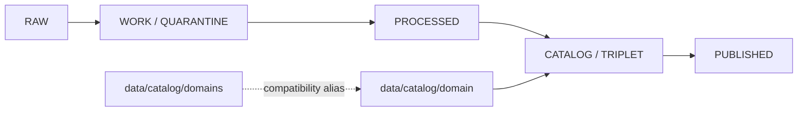

<!-- [KFM_META_BLOCK_V2]
doc_id: kfm://doc/data-catalog-domains-readme
title: data/catalog/domains/README.md — Plural Domains Catalog Compatibility README
version: v0.1
type: readme; data-lifecycle-index; compatibility-alias-index
status: draft; PROPOSED; COMPATIBILITY-ALIAS; data-root; catalog-stage; domains; release-gated
owners: OWNER_TBD — Data steward · Catalog steward · Domain stewards · Evidence steward · Policy steward · Release steward · Docs steward
created: NEEDS VERIFICATION — blank placeholder existed before v0.1 expansion
updated: 2026-06-25
policy_label: public-doc; data; catalog; domains; compatibility-alias; lifecycle; release-gated
tags: [kfm, data, catalog, domains, domain, compatibility-alias, CATALOG, TRIPLET, EvidenceBundle, SourceDescriptor, ReleaseManifest]
related:
  - ../README.md
  - ../../README.md
  - ../domain/README.md
  - ./roads-rail-trade/README.md
  - ../domain/roads-rail-trade/README.md
  - ../../proofs/
  - ../../receipts/
  - ../../published/
  - ../../registry/
  - ../../../release/
notes:
  - "This file replaces a blank placeholder at `data/catalog/domains/README.md`."
  - "The governed domain catalog index is `data/catalog/domain/`; this plural `domains` path is a compatibility alias only."
  - "This folder must not become a parallel domain catalog authority, proof store, source registry, release root, schema root, policy root, published-output root, or implementation root."
  - "Rollback target for this replacement is previous blank blob SHA `8b137891791fe96927ad78e64b0aad7bded08bdc`."
[/KFM_META_BLOCK_V2] -->

<a id="top"></a>

# data/catalog/domains

> Compatibility README for the plural `data/catalog/domains/` path. The governed domain catalog index remains `data/catalog/domain/`.

<p>
  
  
  
  
  
</p>

**Status:** draft / PROPOSED / COMPATIBILITY-ALIAS  
**Path:** `data/catalog/domains/README.md`  
**Compatibility form:** plural `domains`  
**Governing catalog index:** `data/catalog/domain/`  
**Lifecycle stage:** `CATALOG / TRIPLET`  
**Exposure posture:** release-gated; no public use without approved release linkage  
**Truth posture:** CONFIRMED target was blank · CONFIRMED `data/catalog/domain/` is the governed domain catalog index · CONFIRMED `data/catalog/domains/roads-rail-trade/` already exists as a plural-path compatibility alias · NEEDS VERIFICATION for whether this plural path should remain, redirect, or be removed by migration.

## Purpose

`data/catalog/domains/` is a compatibility alias for users or scripts that reach for a plural `domains` path.

It must point back to the singular governed lane:

```text
data/catalog/domain/
```

This file does not establish a new catalog authority. It does not replace the singular lane and does not approve publication.

## Lifecycle boundary



## Repo fit

| Responsibility | Correct home | Rule |
|---|---|---|
| Governed domain catalog index | `data/catalog/domain/` | Governing lane. |
| Plural compatibility index | `data/catalog/domains/` | This README and approved alias notes only. |
| Domain catalog records | `data/catalog/domain/<domain>/` | Not in this plural alias unless ADR/migration approves. |
| Evidence/proof records | `data/proofs/` | Not this lane. |
| Source registry | `data/registry/` | Not this lane. |
| Receipts | `data/receipts/` | Not this lane. |
| Release decisions | `release/` | Not this lane. |
| Published products | `data/published/` | Not this lane. |
| Schemas and policy | `schemas/`, `policy/` | Not this lane. |
| Code/tests | implementation roots and test roots | Not this lane. |

## Accepted contents

- This README.
- Migration notes or crosswalks explaining plural `domains` to singular `domain` compatibility.
- Pointers to the governing `data/catalog/domain/` index and its child lanes.
- Nothing else unless a future ADR/path-map/migration note explicitly allows it.

## Exclusions

- Domain catalog records that should live under `data/catalog/domain/<domain>/`.
- RAW, WORK, QUARANTINE, PROCESSED, or PUBLISHED data.
- EvidenceBundle/proof records.
- SourceDescriptor/source-registry records.
- Receipts.
- Release decisions.
- Semantic contracts, schemas, policy rules, validators, tests, packages, pipelines, app/UI/API code.
- Any public exposure shortcut around the singular governed lane.

## Known alias child lanes

| Child alias | Status | Governing lane |
|---|---|---|
| `roads-rail-trade/` | draft / PROPOSED / COMPATIBILITY-ALIAS | `data/catalog/domain/roads-rail-trade/` |

Additional plural child lanes should not be added unless an ADR/path-map/migration note explains why the alias is retained and how rollback works.

## Guardrails

- Do not treat this plural path as canonical.
- Do not duplicate catalog records in both `domain/` and `domains/`.
- Do not weaken source-role, evidence, sensitivity, review, policy, release, correction, or rollback controls.
- Do not add child lanes here as a convenience bucket.
- Mark any future retention of this path as PROPOSED until there is an ADR, path map, migration note, and rollback note.

## Evidence ledger

| Source | Status | Supports | Limits |
|---|---|---|---|
| Previous file | CONFIRMED | Target existed as a blank placeholder. | Did not define lane boundaries. |
| `data/catalog/domain/README.md` | CONFIRMED | Singular domain catalog index and compatibility-alias rules. | Does not prove this plural alias should remain. |
| `data/catalog/domains/roads-rail-trade/README.md` | CONFIRMED | Existing plural child compatibility alias. | Does not authorize plural aliases generally. |

## Validation checklist

- [ ] Confirm whether `data/catalog/domains/` should exist at all.
- [ ] Confirm whether this path should remain as compatibility, redirect, or be removed.
- [ ] Confirm no catalog records are duplicated here.
- [ ] Confirm migration tooling, docs links, and rollback notes if this alias is retained.
- [ ] Confirm future child aliases are blocked unless ADR/path-map/migration notes exist.

## Rollback

Rollback is required if this lane becomes a parallel catalog authority, source-data root, proof store, source-registry root, release-decision root, published-output root, schema root, policy root, validator root, implementation root, public API shortcut, or public exposure shortcut.

Rollback target for this replacement: previous blank blob SHA `8b137891791fe96927ad78e64b0aad7bded08bdc`.

<p align="right"><a href="#top">Back to top</a></p>
