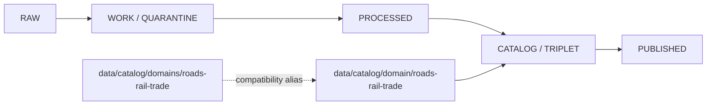

<!-- [KFM_META_BLOCK_V2]
doc_id: kfm://doc/data-catalog-domains-roads-rail-trade-readme
title: data/catalog/domains/roads-rail-trade/README.md — Roads/Rail/Trade Domain Catalog Compatibility README
version: v0.1
type: readme; data-lifecycle-sublane; compatibility-segment-note
status: draft; PROPOSED; COMPATIBILITY-ALIAS; data-root; catalog-stage; roads-rail-trade; release-gated
owners: OWNER_TBD — Roads/Rail/Trade steward · Data steward · Catalog steward · Evidence steward · Policy steward · Release steward · Docs steward
created: NEEDS VERIFICATION — blank placeholder existed before v0.1 expansion
updated: 2026-06-25
policy_label: public-doc; data; catalog; compatibility-alias; roads-rail-trade; lifecycle; release-gated
tags: [kfm, data, catalog, domains, domain, roads-rail-trade, compatibility-alias, CATALOG, TRIPLET, EvidenceBundle, SourceDescriptor, ReleaseManifest]
related:
  - ../../README.md
  - ../../../README.md
  - ../../domain/README.md
  - ../../domain/roads-rail-trade/README.md
  - ../../domain/roads-rail-trade/story-nodes/README.md
  - ../../../../contracts/domains/roads-rail-trade/README.md
  - ../../../../data/proofs/
  - ../../../../data/receipts/
  - ../../../../release/
notes:
  - "This file replaces a blank placeholder at `data/catalog/domains/roads-rail-trade/README.md`."
  - "The governing domain catalog lane is `data/catalog/domain/roads-rail-trade/`; this plural `domains` path is a compatibility alias only."
  - "This folder must not become a parallel domain catalog authority, proof store, source registry, release root, schema root, policy root, published-output root, or implementation root."
  - "Rollback target for this replacement is previous blank blob SHA `8b137891791fe96927ad78e64b0aad7bded08bdc`."
[/KFM_META_BLOCK_V2] -->

<a id="top"></a>

# data/catalog/domains/roads-rail-trade

> Compatibility README for the plural `data/catalog/domains/roads-rail-trade/` path. The governed catalog lane remains `data/catalog/domain/roads-rail-trade/`.

<p>
  
  
  
  
  
</p>

**Status:** draft / PROPOSED / COMPATIBILITY-ALIAS  
**Path:** `data/catalog/domains/roads-rail-trade/README.md`  
**Compatibility form:** plural `domains`  
**Governing catalog lane:** `data/catalog/domain/roads-rail-trade/`  
**Lifecycle stage:** `CATALOG / TRIPLET`  
**Exposure posture:** release-gated; no public use without approved release linkage  
**Truth posture:** CONFIRMED target was blank · CONFIRMED `data/catalog/domain/` is the domain catalog index · CONFIRMED `data/catalog/domain/roads-rail-trade/` defines the Roads/Rail/Trade domain catalog lane · NEEDS VERIFICATION for whether this plural path should remain, redirect, or be removed by migration.

## Purpose

`data/catalog/domains/roads-rail-trade/` is a compatibility alias for users or scripts that reach for a plural `domains` path.

It must point back to the singular governed lane:

```text
data/catalog/domain/roads-rail-trade/
```

This file does not establish a new catalog authority. It does not replace the singular lane and does not approve publication.

## Lifecycle boundary



## Repo fit

| Responsibility | Correct home | Rule |
|---|---|---|
| Roads/Rail/Trade domain catalog records | `data/catalog/domain/roads-rail-trade/` | Governing lane. |
| Plural compatibility alias | `data/catalog/domains/roads-rail-trade/` | This README only, unless ADR/migration approves more. |
| Story-node catalog records | `data/catalog/domain/roads-rail-trade/story-nodes/` | Child catalog sublane under the governing lane. |
| Parent domain catalog index | `data/catalog/domain/` | Domain catalog index. |
| Evidence/proof records | `data/proofs/` | Not this lane. |
| Receipts | `data/receipts/` | Not this lane. |
| Release decisions | `release/` | Not this lane. |
| Schemas and policy | `schemas/`, `policy/` | Not this lane. |
| Code/tests | implementation roots and test roots | Not this lane. |

## Accepted contents

- This README.
- Migration notes or crosswalks explaining plural `domains` to singular `domain` compatibility.
- Pointers to the governing `data/catalog/domain/roads-rail-trade/` lane.
- Nothing else unless a future ADR/path-map/migration note explicitly allows it.

## Exclusions

- Domain catalog records that should live under `data/catalog/domain/roads-rail-trade/`.
- RAW, WORK, QUARANTINE, PROCESSED, or PUBLISHED data.
- EvidenceBundle/proof records.
- SourceDescriptor/source-registry records.
- Receipts.
- Release decisions.
- Semantic contracts, schemas, policy rules, validators, tests, packages, pipelines, app/UI/API code.
- Any public exposure shortcut around the singular governed lane.

## Guardrails

- Do not treat this plural path as canonical.
- Do not duplicate catalog records in both `domain/roads-rail-trade/` and `domains/roads-rail-trade/`.
- Do not weaken source-role, evidence, review, graph-projection, story-node, map, API, policy, release, or rollback controls.
- Mark any future retention of this path as PROPOSED until there is an ADR, path map, migration note, and rollback note.

## Evidence ledger

| Source | Status | Supports | Limits |
|---|---|---|---|
| Previous file | CONFIRMED | Target existed as a blank placeholder. | Did not define lane boundaries. |
| `data/catalog/domain/README.md` | CONFIRMED | Singular domain catalog index and compatibility-alias rules. | Does not prove this plural alias should remain. |
| `data/catalog/domain/roads-rail-trade/README.md` | CONFIRMED | Governing Roads/Rail/Trade catalog lane. | Does not authorize a parallel plural lane. |

## Validation checklist

- [ ] Confirm whether `data/catalog/domains/` should exist at all.
- [ ] Confirm whether this path should remain as compatibility, redirect, or be removed.
- [ ] Confirm no catalog records are duplicated here.
- [ ] Confirm migration tooling, docs links, and rollback notes if this alias is retained.

## Rollback

Rollback is required if this lane becomes a parallel catalog authority, source-data root, proof store, source-registry root, release-decision root, published-output root, schema root, policy root, validator root, implementation root, public API shortcut, or public exposure shortcut.

Rollback target for this replacement: previous blank blob SHA `8b137891791fe96927ad78e64b0aad7bded08bdc`.

<p align="right"><a href="#top">Back to top</a></p>
