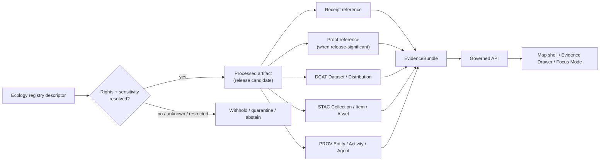

<!-- [KFM_META_BLOCK_V2]
doc_id: kfm://doc/<NEEDS_VERIFICATION_UUID>
title: Ecology Catalog Closure Mapping
type: standard
version: v1
status: draft
owners: @bartytime4life
created: <NEEDS_VERIFICATION_CREATED_DATE>
updated: 2026-04-24
policy_label: <NEEDS_VERIFICATION_POLICY_LABEL>
related: [
  data/registry/ecology/README.md,
  data/catalog/README.md,
  data/catalog/ecology/README.md,
  data/catalog/dcat/README.md,
  data/catalog/stac/README.md,
  data/catalog/prov/README.md,
  data/receipts/README.md,
  data/proofs/README.md,
  contracts/README.md,
  schemas/README.md
]
tags: [kfm, ecology, dcat, stac, prov, catalog, provenance, evidence, evidence-bundle]
notes: [
  "This file is a proposed mapping guide for ecological catalog closure.",
  "It does not claim that ecology DCAT, STAC, or PROV outputs are currently checked in.",
  "Target path is proposed and needs active-branch verification.",
  "README-like requirements are included because the suggested file name is README.md."
]
[/KFM_META_BLOCK_V2] -->

<a id="top"></a>

# Ecology Catalog Closure Mapping

Resolve KFM ecological registry descriptors into reviewable DCAT discovery records, STAC geospatial asset records, and PROV lineage records before public or runtime use.

> [!NOTE]
> **Status:** `experimental` / `draft`  
> **Owners:** `@bartytime4life`  
> **Truth posture:** `PROPOSED`  
> **Suggested path:** `data/catalog/ecology/README.md`  
> **Repo fit:** catalog-facing bridge from ecological source/layer descriptors to discovery, geospatial asset, provenance, receipt, proof, and EvidenceBundle surfaces  
> **Quick jumps:** [Purpose](#purpose) · [Scope](#scope) · [Repo fit](#repo-fit) · [Inputs](#accepted-inputs) · [Exclusions](#exclusions) · [Closure model](#closure-model) · [DCAT](#dcat-mapping) · [STAC](#stac-mapping) · [PROV](#prov-mapping) · [Composite claims](#composite-claims) · [Validation checklist](#validation-checklist)


---

## Purpose

Ecological registry descriptors describe **what a source, dataset, layer, or derived ecological artifact is**.

Catalog closure records describe whether that object is ready to be found, traced, reviewed, rendered, cited, withheld, quarantined, or released.

| Catalog family | KFM role | Primary question answered |
|---|---|---|
| DCAT | discovery, publisher, rights, access, distribution | “What is this dataset, who stewards it, and what access or rights apply?” |
| STAC | spatial/temporal asset identity, geospatial asset structure | “Where, when, and what geospatial assets represent this object?” |
| PROV | lineage, activities, agents, derivations, receipts, proofs | “How did this object come to exist, from what, by whom or what, and through which checks?” |

A registry descriptor is not complete for outward use until it can be traced into catalog closure or is explicitly marked as **withheld**, **quarantined**, or **not publishable**.

> [!IMPORTANT]
> KFM clients should not infer trust from a map layer, file path, tile URL, model answer, source name, or visual polish alone. Trust must resolve through a governed evidence envelope.

---

## Scope

This document covers ecology-facing catalog closure for ecological source descriptors, layer descriptors, processed artifacts, derived ecological products, and ecological claims.

It is intended for maintainers working on:

- ecological source/layer registries;
- STAC/DCAT/PROV catalog records;
- receipts, proofs, validation outputs, and release evidence;
- MapLibre layer evidence payloads;
- EvidenceBundle and Focus Mode support for ecology-facing claims.

This document does **not** claim current implementation of any ecology catalog records, validators, CI workflows, API routes, release manifests, or runtime envelopes.

---

## Repo fit

> [!WARNING]
> Path and link targets below are **PROPOSED** until verified against the active branch.

| Surface | Proposed link from `data/catalog/ecology/README.md` | Role |
|---|---:|---|
| Ecology registry | [`../../registry/ecology/README.md`](../../registry/ecology/README.md) | Upstream ecological descriptor source |
| Catalog overview | [`../README.md`](../README.md) | Parent catalog landing page |
| DCAT catalog | [`../dcat/README.md`](../dcat/README.md) | Discovery and distribution records |
| STAC catalog | [`../stac/README.md`](../stac/README.md) | Spatial/temporal geospatial assets |
| PROV catalog | [`../prov/README.md`](../prov/README.md) | Provenance and lineage graph records |
| Receipts | [`../../receipts/README.md`](../../receipts/README.md) | Execution memory and run evidence |
| Proofs | [`../../proofs/README.md`](../../proofs/README.md) | Release-significant validation evidence |
| Contracts | [`../../../contracts/README.md`](../../../contracts/README.md) | Object meaning and invariants |
| Schemas | [`../../../schemas/README.md`](../../../schemas/README.md) | Machine-checkable shapes and constraints |

### Proposed neighborhood

```text
data/
├── registry/
│   └── ecology/
│       └── README.md
├── catalog/
│   ├── README.md
│   ├── ecology/
│   │   └── README.md
│   ├── dcat/
│   │   └── README.md
│   ├── stac/
│   │   └── README.md
│   └── prov/
│       └── README.md
├── receipts/
│   └── README.md
└── proofs/
    └── README.md
```

[Back to top](#top)

---

## Accepted inputs

Catalog closure may be prepared from these inputs when they are present and reviewable:

| Input | Required posture |
|---|---|
| Ecological registry descriptor | Must identify source, steward, source role, rights, cadence, sensitivity, spatial grain, and temporal grain where known |
| Layer descriptor or layer manifest | Must not substitute for evidence; must point to governed artifacts and evidence references |
| Processed artifact reference | Must identify the released or release-candidate artifact, not RAW or WORK material |
| Receipt reference | Required for ingestion, transformation, validation, or promotion-relevant execution |
| Proof reference | Required when release-significant validation or publication decision depends on it |
| Rights/sensitivity metadata | Must fail closed when absent, ambiguous, restricted, or sensitive |
| Review or release state | Must remain distinct from catalog metadata and runtime display state |
| EvidenceBundle reference | Required before map display, Focus Mode synthesis, exports, or public-facing claims |

---

## Exclusions

Do not use this catalog closure document to admit or publish:

| Excluded item | Where it belongs instead |
|---|---|
| RAW source downloads, raw API dumps, raw rasters, raw observations | `data/raw/` or source-specific RAW intake surface |
| WORK-stage transforms, scratch joins, temporary clipped rasters | `data/work/` or workflow-local work area |
| Failed, ambiguous, restricted, or under-reviewed material | `data/quarantine/` plus receipt and reason |
| Unreviewed ecological model output | PROCESSED candidate only, not public catalog closure |
| Direct source API links exposed to public clients | Governed API or governed access reference |
| Map styling decisions without evidence closure | Layer/style registry, not catalog truth |
| AI summaries or Focus Mode output | Runtime envelope and AI receipt surfaces, never root truth |
| Sensitive exact locations or restricted-license records | Withheld, generalized, delayed, or access-controlled release path |

> [!CAUTION]
> A source may be useful and still not be publishable. A geospatial asset may be valid and still not be public. A map layer may render and still lack catalog closure.

---

## Closure model



### Closure chain

```text
registry descriptor
  → processed artifact
  → receipt reference
  → proof reference when release-significant
  → DCAT Dataset / Distribution
  → STAC Collection / Item / Asset
  → PROV Entity / Activity / Agent
  → governed API EvidenceBundle
```

### Proposed closure dispositions

These terms are **PROPOSED** until a repo schema or policy file confirms the final enum.

| Disposition | Meaning | Runtime consequence |
|---|---|---|
| `CLOSED_PUBLIC` | Required catalog, provenance, evidence, rights, and policy conditions are satisfied for public use | Public display may proceed through governed API |
| `CLOSED_RESTRICTED` | Closure exists, but access is constrained by role, rights, sensitivity, or steward review | Public display must generalize, redact, or deny |
| `WITHHELD_RIGHTS` | Rights or license conditions do not permit publication | Do not publish; show reason if allowed |
| `WITHHELD_SENSITIVITY` | Location, ecological, cultural, or stewardship sensitivity blocks exact publication | Generalize, delay, suppress, or restrict |
| `QUARANTINED` | Validation, provenance, integrity, or policy checks failed | Do not use as evidence except in review workflows |
| `ABSTAIN_UNRESOLVED` | Evidence cannot be resolved strongly enough | Map, Focus Mode, and export surfaces abstain |

[Back to top](#top)

---

## DCAT mapping

DCAT closure answers the discovery and access question: **what is this ecological dataset, who is responsible for it, and under what rights or access posture can it be used?**

| Registry field | DCAT target | Notes |
|---|---|---|
| `descriptor_id` | `dcat:Dataset/@id` | Stable dataset identity |
| `source_name` | `dct:title` | Human-readable title |
| `source_steward` | `dct:publisher` | Organization, steward, or responsible party |
| `rights` | `dct:rights` / `dct:license` | Required before promotion |
| `cadence` | `dct:accrualPeriodicity` | Refresh expectation, not proof of freshness |
| `spatial_grain` | `dct:spatial` | Boundary, point, raster footprint, station, tile matrix, or region ref |
| `temporal_grain` | `dct:temporal` | Observation time, coverage window, model epoch, or release interval |
| `domain` | `dcat:theme` | Ecology domain family |
| `processed_artifact_refs` | `dcat:distribution` | Published or release-candidate artifact references only |
| `sensitivity` | KFM policy extension | Must not be treated as decorative metadata |
| `evidence_bundle_ref` | KFM extension or related link | Runtime trust anchor |

<details>
<summary>Illustrative DCAT-shaped ecology record</summary>

```json
{
  "@id": "kfm:dataset:ecology:vegetation:ndvi-change",
  "@type": "dcat:Dataset",
  "dct:title": "NDVI change layer",
  "dct:publisher": {
    "@id": "kfm:agent:<source_steward>"
  },
  "dct:license": "<license-or-rights-note>",
  "dct:rights": "<rights-statement>",
  "dct:spatial": "<geometry-or-region-ref>",
  "dct:temporal": "<coverage-window>",
  "dcat:theme": ["ecology", "vegetation", "land-cover-change"],
  "dcat:distribution": [
    {
      "@id": "kfm:distribution:<processed-artifact-id>",
      "@type": "dcat:Distribution",
      "dct:format": "<format>",
      "dcat:accessURL": "<governed-access-ref>"
    }
  ],
  "kfm:evidence_bundle_ref": "<EvidenceBundle-ref>",
  "kfm:sensitivity": "<public|restricted|withheld|needs_verification>"
}
```

</details>

---

## STAC mapping

STAC closure answers the geospatial asset question: **what spatial/temporal asset exists, where and when does it apply, and how does it link back to evidence?**

| Registry field | STAC target | Notes |
|---|---|---|
| `layer_id` | Collection or Item `id` | Layer or artifact identity |
| `domain` | Collection keywords | Domain grouping |
| `spatial_grain` | `bbox` / `geometry` | Spatial extent or footprint |
| `temporal_grain` | `datetime` or interval | Time-aware surface |
| `render_type` | Asset media/type hint | Raster, vector, time series, 3D tiles, or other asset class |
| `spec_hash` | Asset checksum or extension field | Deterministic version identity |
| `source_descriptor_refs` | `links` | Source lineage links |
| `processed_artifact_refs` | `assets` | Geospatial artifact references |
| `evidence_bundle_ref` | `links` or KFM extension | KFM evidence link |
| `sensitivity` | KFM extension field | Do not expose sensitive geometry without policy review |

<details>
<summary>Illustrative STAC Collection pattern</summary>

```json
{
  "type": "Collection",
  "stac_version": "<NEEDS_VERIFICATION_STAC_VERSION>",
  "id": "kfm.ecology.vegetation",
  "title": "KFM Ecology — Vegetation",
  "description": "Governed vegetation and land-cover-change layers.",
  "license": "<license-or-rights-note>",
  "extent": {
    "spatial": {
      "bbox": [["<west>", "<south>", "<east>", "<north>"]]
    },
    "temporal": {
      "interval": [["<start>", "<end>"]]
    }
  },
  "keywords": ["kfm", "ecology", "vegetation", "land-cover"],
  "links": [
    {
      "rel": "via",
      "href": "<registry-descriptor-ref>",
      "title": "KFM registry descriptor"
    },
    {
      "rel": "evidence",
      "href": "<evidence-bundle-ref>",
      "title": "KFM EvidenceBundle"
    }
  ]
}
```

</details>

<details>
<summary>Illustrative STAC Item pattern</summary>

```json
{
  "type": "Feature",
  "stac_version": "<NEEDS_VERIFICATION_STAC_VERSION>",
  "id": "kfm.ecology.vegetation.ndvi_change.2024",
  "collection": "kfm.ecology.vegetation",
  "geometry": "<geometry>",
  "bbox": ["<bbox>"],
  "properties": {
    "datetime": "2024-12-31T00:00:00Z",
    "kfm:spec_hash": "<sha256>",
    "kfm:evidence_bundle_ref": "<EvidenceBundle-ref>",
    "kfm:sensitivity": "public"
  },
  "assets": {
    "ndvi_change": {
      "href": "<governed-asset-ref>",
      "type": "image/tiff; application=geotiff",
      "roles": ["data"]
    }
  },
  "links": [
    {
      "rel": "derived_from",
      "href": "<processed-artifact-ref>"
    },
    {
      "rel": "evidence",
      "href": "<evidence-bundle-ref>"
    }
  ]
}
```

</details>

> [!NOTE]
> STAC examples are illustrative mapping shapes. Exact STAC version, required extensions, asset media types, projection metadata, and KFM extension keys need schema/profile verification before commit.

[Back to top](#top)

---

## PROV mapping

PROV closure answers the lineage question: **what entities, activities, and agents produced the ecological artifact, receipt, proof, or release candidate?**

| Registry / pipeline field | PROV target | Notes |
|---|---|---|
| `source_descriptor` | `prov:Entity` | Source description |
| `processed_artifact` | `prov:Entity` | Derived artifact |
| `receipt` | `prov:Entity` | Execution memory |
| `proof` | `prov:Entity` | Release-significant validation |
| ingest job | `prov:Activity` | Capture/acquisition activity |
| transform job | `prov:Activity` | Normalization, joins, raster processing |
| validator | `prov:Activity` | Gate execution |
| source steward | `prov:Agent` | External publisher/steward |
| KFM operator/tool | `prov:Agent` | Internal actor/tool identity |
| derivation link | `prov:wasDerivedFrom` | Artifact lineage |
| generated link | `prov:wasGeneratedBy` | Activity output |
| attribution link | `prov:wasAttributedTo` | Steward or tool attribution |

<details>
<summary>Illustrative PROV-shaped ecological lineage</summary>

```json
{
  "@context": {
    "prov": "http://www.w3.org/ns/prov#",
    "kfm": "https://example.invalid/kfm/"
  },
  "@graph": [
    {
      "@id": "kfm:entity:source:ecology:vegetation",
      "@type": "prov:Entity",
      "kfm:descriptor_ref": "<registry-descriptor-ref>"
    },
    {
      "@id": "kfm:activity:transform:ndvi-change",
      "@type": "prov:Activity",
      "prov:used": "kfm:entity:source:ecology:vegetation",
      "kfm:receipt_ref": "<run-receipt-ref>"
    },
    {
      "@id": "kfm:entity:processed:ndvi-change",
      "@type": "prov:Entity",
      "prov:wasGeneratedBy": "kfm:activity:transform:ndvi-change",
      "prov:wasDerivedFrom": "kfm:entity:source:ecology:vegetation",
      "kfm:spec_hash": "<sha256>"
    },
    {
      "@id": "kfm:activity:validation:ndvi-change",
      "@type": "prov:Activity",
      "prov:used": "kfm:entity:processed:ndvi-change"
    },
    {
      "@id": "kfm:entity:receipt:ndvi-change-validation",
      "@type": "prov:Entity",
      "prov:wasGeneratedBy": "kfm:activity:validation:ndvi-change"
    }
  ]
}
```

</details>

---

## Composite claims

Composite ecological claims must reference more than one evidence family unless clearly labeled as single-domain.

> [!CAUTION]
> Association language does not prove causation. Any ecological claim that implies cause, trend, degradation, risk, suitability, or management consequence must carry method, uncertainty, time window, source role, and review state.

### Example claim

```text
Grassland degradation in watershed HUC12:<id> is associated with declining vegetation health and lower soil moisture during the selected seasonal window.
```

### Required catalog closure

| Evidence family | Required closure |
|---|---|
| Vegetation raster | STAC Item + PROV derivation + receipt |
| Soil moisture baseline | DCAT Dataset + PROV derivation + receipt |
| Watershed boundary | STAC Collection/Item + PROV source lineage |
| Composite claim | EvidenceBundle + proof when release-significant |

<details>
<summary>Illustrative composite EvidenceBundle sketch</summary>

```json
{
  "claim_id": "kfm.claim.ecology.grassland_degradation.<id>",
  "claim_type": "composite_ecological_claim",
  "domains": ["vegetation", "soil", "hydrology"],
  "time_window": "<season-or-date-range>",
  "geometry_ref": "HUC12:<id>",
  "evidence": [
    {
      "domain": "vegetation",
      "stac_item_ref": "<stac-item-ref>",
      "prov_entity_ref": "<prov-entity-ref>",
      "receipt_ref": "<receipt-ref>"
    },
    {
      "domain": "soil",
      "dcat_dataset_ref": "<dcat-dataset-ref>",
      "prov_entity_ref": "<prov-entity-ref>",
      "receipt_ref": "<receipt-ref>"
    },
    {
      "domain": "hydrology",
      "stac_item_ref": "<stac-item-ref>",
      "prov_entity_ref": "<prov-entity-ref>"
    }
  ],
  "uncertainty": {
    "status": "REQUIRED",
    "method": "<NEEDS_VERIFICATION>"
  },
  "decision": "cite|abstain"
}
```

</details>

---

## Runtime and UI closure rule

Map popups, Evidence Drawer panels, Focus Mode answers, exports, and public API responses should consume catalog closure through governed evidence, not through direct source files or model output.

| Runtime surface | Minimum closure requirement |
|---|---|
| Map layer display | Layer manifest + STAC/DCAT/PROV closure where applicable + EvidenceBundle ref |
| Map popup | EvidenceBundle resolution or abstain |
| Evidence Drawer | Source role, rights, sensitivity, receipt/proof references, provenance links |
| Focus Mode | EvidenceBundle-backed context only; cite or abstain |
| Export | Release state, rights, sensitivity, catalog closure, and proof state |
| Review console | May show withheld/quarantined records if access policy allows |

---

## Validation checklist

Before a catalog closure record is treated as release-ready, verify:

- [ ] Registry descriptor exists.
- [ ] Source role is declared.
- [ ] Rights and sensitivity are declared.
- [ ] Spatial and temporal coverage are declared.
- [ ] Spatial precision and public exposure posture are declared where location sensitivity matters.
- [ ] Join keys are declared where cross-domain evidence is used.
- [ ] Processed artifact reference exists.
- [ ] `spec_hash` or equivalent deterministic identity is present where applicable.
- [ ] Receipt reference exists for ingestion or transform.
- [ ] Proof reference exists when release-significant.
- [ ] DCAT record exists or a justified non-publication reason is recorded.
- [ ] STAC record exists for geospatial assets.
- [ ] PROV graph links source, activity, agent, artifact, receipt, and proof.
- [ ] EvidenceBundle resolves before runtime display.
- [ ] Map layer abstains if evidence cannot resolve.
- [ ] Sensitive or restricted records fail closed.
- [ ] Review state and correction lineage are visible where needed.
- [ ] The closure decision can be rolled back without destroying receipts, proofs, or provenance.

---

## Definition of done

This document is ready to move from draft to review when the following repo evidence exists:

| Gate | Required evidence |
|---|---|
| Path verified | Active branch confirms the target path or an ADR records the chosen home |
| Adjacent docs verified | Related registry/catalog/receipt/proof docs exist or placeholders are tracked |
| Schema authority resolved | `contracts/` versus `schemas/` responsibility is confirmed or documented |
| Minimal ecology fixture exists | One public-safe ecological artifact can be traced through descriptor → catalog closure → EvidenceBundle |
| Validator path known | Validator executable, command, or CI job is identified |
| Policy gate known | Rights/sensitivity/release policy is executable or explicitly deferred |
| Runtime shape known | EvidenceBundle and runtime response shapes are confirmed |
| UI path known | Evidence Drawer / map layer payload contract is confirmed or deferred |
| Failure modes tested | Missing rights, missing provenance, sensitive geometry, and unresolved evidence produce non-public outcomes |

---

## Open verification items

| Item | Status | Why it matters |
|---|---|---|
| Exact target path | NEEDS VERIFICATION | Current path is proposed from the draft, not verified in a mounted repo |
| `doc_id` UUID | NEEDS VERIFICATION | Must not be fabricated |
| Created date | NEEDS VERIFICATION | Not confirmed from repo metadata |
| Policy label | NEEDS VERIFICATION | Controls publication/access handling |
| Schema authority for ecology descriptors | NEEDS VERIFICATION | Avoids parallel `contracts/` and `schemas/` truth |
| Runtime EvidenceBundle shape for ecological claims | NEEDS VERIFICATION | Prevents UI/API drift |
| Validator executable path | NEEDS VERIFICATION | Needed for CI and reviewer repeatability |
| CI enforcement | NEEDS VERIFICATION | No workflow claim without repo evidence |
| Existing MapLibre/Cesium layer contract | NEEDS VERIFICATION | Renderer payloads must not bypass evidence |
| STAC version/profile | NEEDS VERIFICATION | Examples should match the repo’s selected standard profile |
| DCAT profile and KFM extensions | NEEDS VERIFICATION | Rights/sensitivity/access fields need consistent shape |
| PROV JSON-LD profile | NEEDS VERIFICATION | Prevents incompatible provenance graph shapes |

---

## Appendix: closure vocabulary

<details>
<summary>Key terms used in this guide</summary>

| Term | Working meaning |
|---|---|
| Registry descriptor | KFM source/layer descriptor that says what the object is and how it should be interpreted |
| Processed artifact | Artifact produced after RAW and WORK/QUARANTINE stages; not automatically public |
| Receipt | Execution memory for ingest, transform, validation, or promotion steps |
| Proof | Release-significant validation evidence |
| Catalog closure | DCAT/STAC/PROV-backed ability to discover, locate, trace, and review an artifact |
| EvidenceBundle | Governed evidence envelope used by API/UI/runtime surfaces |
| Withheld | Known object that is not released due to rights, sensitivity, review, or policy |
| Quarantined | Object held because validation, provenance, integrity, or policy checks failed |
| Abstain | Runtime or publication posture when evidence cannot support the requested claim |
| `spec_hash` | Deterministic identity/digest concept used to distinguish exact artifact versions |

</details>

[Back to top](#top)
