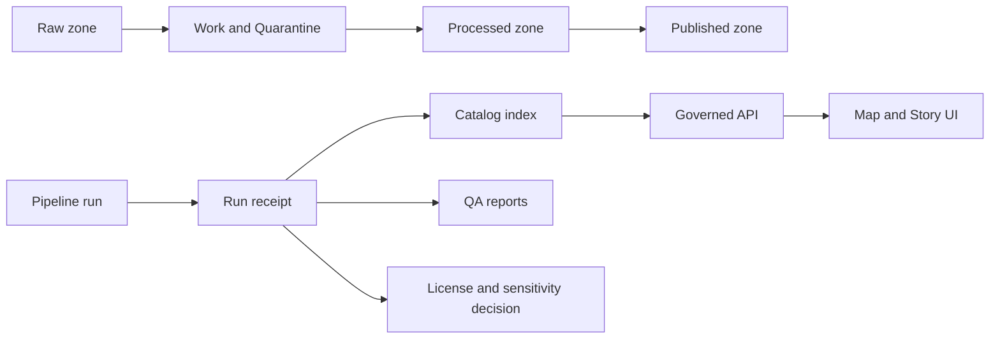

<!-- [KFM_META_BLOCK_V2]
doc_id: kfm://doc/5e5f3c3c-5f8f-4f22-9f1d-9a31f1a1bdf4
title: data/catalog/prov — Provenance Registry
type: standard
version: v1
status: draft
owners: TODO: assign owners
created: 2026-02-24
updated: 2026-02-24
policy_label: public
related:
  - kfm://doc/00000000-0000-0000-0000-000000000000  # TODO: link the root data/catalog README
  - ../../README.md                                  # TODO: verify this path exists
  - ../README.md                                     # TODO: verify this path exists
  - ./schemas/README.md                              # TODO: if you add schemas
  - ./templates/README.md                            # TODO: if you add templates
tags: [kfm, data, catalog, provenance]
notes:
  - This directory defines the provenance artifacts and minimum receipt contract required to promote datasets across lifecycle zones.
  - Replace TODOs once repo structure, governance roles, and schema locations are confirmed.
[/KFM_META_BLOCK_V2] -->
<a id="top"></a>


# data/catalog/prov

**Purpose:** Store *provenance artifacts* (run receipts, lineage manifests, and policy/audit decisions) that make every published dataset claim traceable to evidence.


**Owners:** TODO  
**Status:** Draft (needs repo wiring + CI gates)  
**Policy label:** `public` (TODO: confirm)

---

## Navigation

- [Why this exists](#why-this-exists)
- [What belongs here](#what-belongs-here)
- [What must not go here](#what-must-not-go-here)
- [Directory structure](#directory-structure)
- [Provenance contract](#provenance-contract)
- [Promotion gates](#promotion-gates)
- [How to add a new receipt](#how-to-add-a-new-receipt)
- [Governance and safety](#governance-and-safety)
- [CI checks](#ci-checks)
- [FAQ](#faq)

---

## Why this exists

The system’s core promise is **traceability**:

> Every user-facing claim should be traceable to evidence *and* to the policy decisions that permitted exposure.

This folder is the **provenance registry** for that promise. It is where we record:

- **What** data was used (inputs)
- **How** it was transformed (code, parameters, environment)
- **Who/what** ran it (actor + identity)
- **When** it ran (timestamps)
- **Whether** it passed gates (QA results + thresholds)
- **Why** it was allowed to ship (license + sensitivity + policy decisions)

### System fit



**Key rule:** clients and UIs should never assert facts without a corresponding provenance artifact referenced from the catalog.

[Back to top](#top)

---

## What belongs here

✅ **Allowed inputs (governed artifacts):**

- **Run receipts** (JSON/JSONL/YAML): immutable, content-addressed when possible
- **Lineage manifests**: inputs → transforms → outputs
- **Validation results**: schema checks, QA checks, thresholds, summaries
- **Policy decision records**: license checks, sensitivity classification, redaction decisions
- **Checksums/signatures**: hashes and (optionally) signatures for integrity verification
- **Promotion records**: “promoted from zone X to zone Y” including gate evidence

These artifacts should be **append-only**. If something changes, write a new version and link it.

### Recommended naming

> **Proposed convention** (update if repo already has one):

- `dataset_id=<slug>/`
  - `run_date=YYYY-MM-DD/`
    - `run_id=<ulid-or-uuid>/`
      - `receipt.json`
      - `lineage.json`
      - `qa.json`
      - `policy.json`
      - `checksums.txt`

[Back to top](#top)

---

## What must not go here

🚫 **Do not store:**

- Raw datasets, processed datasets, or large binaries (those belong in storage zones)
- Secrets (API keys, tokens, credentials), even temporarily
- Personal data or sensitive coordinates that are not explicitly approved for this zone
- Unreviewed “draft” receipts that would allow promotion gates to be bypassed

> **Rule of thumb:** if it would be harmful if the repo were public, it does not belong here.

[Back to top](#top)

---

## Directory structure

> **Unknown:** The actual on-disk subtree is not confirmed here. Replace this once you run `tree data/catalog/prov -L 4`.

### Proposed layout

```text
data/catalog/prov/
  README.md
  schemas/               # JSON Schema / YAML schema for receipts and manifests
  templates/             # minimal templates for new receipts
  receipts/              # optional: centralized receipts instead of dataset_id folders
  examples/              # small, synthetic examples (no sensitive data)
  tools/                 # helpers (validators, normalizers) used by CI
  ADRs/                  # provenance-related ADRs (format, hashing, signing)
```

### Directory documentation standard

If you add a new subfolder under `prov/`, include a `README.md` inside it that states:

- **Title + one-line purpose**
- **Where it fits**
- **Acceptable inputs**
- **Exclusions**

[Back to top](#top)

---

## Provenance contract

This section defines the **minimum required fields** for a *run receipt*.

> **Important:** This is a **proposed v1 contract** until you connect it to an actual schema file.

### Required fields

| Field | Type | Required | Notes |
|---|---:|:---:|---|
| `receipt_version` | string | ✅ | Semver or fixed tag (e.g., `v1`) |
| `run_id` | string | ✅ | UUID/ULID; must be unique |
| `dataset_id` | string | ✅ | Stable dataset identifier (catalog key) |
| `zone_in` | string | ✅ | One of `raw`, `work`, `processed`, `published` |
| `zone_out` | string | ✅ | Same enum; may equal `zone_in` if no promotion |
| `started_at` | string | ✅ | ISO 8601 timestamp |
| `ended_at` | string | ✅ | ISO 8601 timestamp |
| `actor` | object | ✅ | `type`, `id`, `display_name` (human or automation) |
| `code` | object | ✅ | repo URL/path + commit SHA + dirty flag |
| `environment` | object | ✅ | container image digest, tool versions |
| `inputs` | array | ✅ | Each input includes `uri`, `checksum`, `license`, `sensitivity` |
| `transforms` | array | ✅ | Declarative steps + parameters; reference scripts/notebooks |
| `outputs` | array | ✅ | Each output includes `uri`, `checksum`, `schema_ref` |
| `qa` | object | ✅ | checks, thresholds, pass/fail, summary metrics |
| `policy` | object | ✅ | license decision + sensitivity decision + redactions |

### Receipt example (minimal)

```json
{
  "receipt_version": "v1",
  "run_id": "01HZY0KXQGQ9J9Q3X6X7E7ZB4G",
  "dataset_id": "example/sidewalks",
  "zone_in": "work",
  "zone_out": "processed",
  "started_at": "2026-02-24T18:22:11Z",
  "ended_at": "2026-02-24T18:27:02Z",
  "actor": {
    "type": "automation",
    "id": "ci/github-actions",
    "display_name": "CI"
  },
  "code": {
    "repo": "TODO",
    "path": "pipelines/sidewalks",
    "commit": "TODO",
    "dirty": false
  },
  "environment": {
    "container_image": "TODO",
    "tools": {
      "python": "3.12.x",
      "gdal": "TODO",
      "duckdb": "TODO"
    }
  },
  "inputs": [
    {
      "name": "source_geojson",
      "uri": "TODO",
      "checksum": "sha256:TODO",
      "license": "TODO",
      "sensitivity": "public"
    }
  ],
  "transforms": [
    {
      "name": "normalize_schema",
      "params": {
        "target_schema": "kfm://schema/sidewalks/v1"
      }
    }
  ],
  "outputs": [
    {
      "name": "processed_parquet",
      "uri": "TODO",
      "checksum": "sha256:TODO",
      "schema_ref": "kfm://schema/sidewalks/v1"
    }
  ],
  "qa": {
    "passed": false,
    "checks": [
      {"name": "schema_validation", "passed": true},
      {"name": "geometry_validity", "passed": false, "details": "TODO"}
    ]
  },
  "policy": {
    "license_ok": false,
    "sensitivity": "public",
    "redactions": []
  }
}
```

### Normalization rules

To keep receipts diff-friendly and machine-verifiable:

- Sort object keys consistently (canonical JSON) **or** store as YAML with stable ordering rules.
- Prefer **content hashes** (`sha256:`) for `inputs[*].checksum` and `outputs[*].checksum`.
- Never overwrite a receipt. If a run is re-done, write a new `run_id`.

[Back to top](#top)

---

## Promotion gates

A dataset **must not** move to a higher-trust zone without a receipt that includes the following evidence.

### Gate checklist (minimum)

- [ ] **Metadata present**: identity, schema, extents, license, sensitivity
- [ ] **Validation results**: QA checks executed and recorded with thresholds
- [ ] **License checks**: inputs licensed for intended use and redistribution
- [ ] **Provenance links**: inputs + transforms + outputs are linked
- [ ] **Integrity**: checksums recorded (and optionally signatures)
- [ ] **Audit**: who/what/when/why captured + policy decisions captured

### Failure behavior

- If any gate is missing → **fail closed** (no promotion).
- If sensitivity is unclear → **default-deny** or **redact**.

[Back to top](#top)

---

## How to add a new receipt

> These steps are intentionally tool-agnostic. Replace with real commands once your pipeline tooling is confirmed.

1) **Create a new run folder**

- Choose `dataset_id` and generate a `run_id`.
- Create a receipt file at the appropriate path (see [Recommended naming](#recommended-naming)).

2) **Record inputs**

- For each input, record `uri`, `checksum`, `license`, and `sensitivity`.

3) **Record transforms**

- Record the entrypoint (script/notebook/pipeline) and parameters.
- Record the code commit SHA.

4) **Record outputs**

- Record output URIs + schema refs + checksums.

5) **Record QA + policy decisions**

- Attach QA results.
- Attach license/sensitivity decisions.

6) **Validate locally**

- Run the provenance validator (TODO: add `prov/tools/validate`)

7) **Submit via PR**

- Receipts should be reviewed like code changes.

[Back to top](#top)

---

## Governance and safety

### Policy labels

All provenance artifacts should carry a policy label consistent with the dataset they describe.

- `public`: safe to expose
- `restricted`: may contain operational details but no sensitive content
- `sensitive`: should not be exposed in UI; store minimal/coarsened artifacts only

> TODO: Align labels to the repo’s authoritative policy document.

### Sensitive locations / culturally restricted knowledge

If an artifact references vulnerable sites or culturally restricted locations:

- Do not store exact coordinates unless explicitly permitted.
- Prefer coarse geography and include a redaction decision record.

[Back to top](#top)

---

## CI checks

> Proposed checks (add in CI once tooling exists):

- [ ] JSON/YAML schema validation for all receipts
- [ ] Ensure required fields exist
- [ ] Verify checksums are present for all inputs/outputs
- [ ] Verify `ended_at >= started_at`
- [ ] Verify `zone_out` promotion is blocked unless `qa.passed == true` and `policy.license_ok == true`
- [ ] Ensure no secrets are committed (secret scanning)

[Back to top](#top)

---

## FAQ

### Do we need both “catalog metadata” and “provenance”?

Yes. Metadata answers *what a dataset is*; provenance answers *how it was produced* and *why it is allowed to ship*.

### Can a receipt live outside git?

Sometimes. If receipts are too large or sensitive, store them in governed storage and keep a **stub receipt** here that points to the controlled location.

### What about updates?

Never overwrite. New run, new receipt. Link receipts together using `previous_run_id` (TODO: add this field if needed).

---

<details>
<summary>Appendix: Suggested receipt extensions (optional)</summary>

Add these fields only if you need them — keep the core contract minimal and stable.

- `previous_run_id`: link to the receipt that this run supersedes
- `run_tags`: free-form tags for filtering (e.g., `reprocess`, `hotfix`)
- `spatial_extent`: coarse bbox/polygon (respect redaction rules)
- `temporal_extent`: start/end instants describing the data’s coverage
- `cost`: optional cost / compute metadata
- `artifacts`: pointers to logs, notebooks, dashboards (store outside git if large)

</details>

## TODOs to finalize this README

- [ ] Replace placeholders for owners, policy labels, and related docs
- [ ] Confirm the actual directory tree and remove the “Proposed layout” section if it conflicts
- [ ] Add a real schema under `prov/schemas/` and link it from [Provenance contract](#provenance-contract)
- [ ] Wire CI checks so promotions fail closed without a valid receipt
