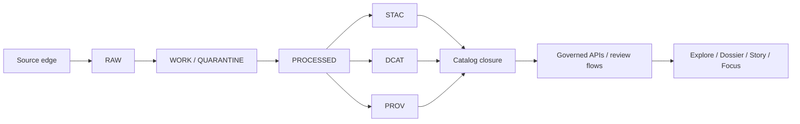

<!-- [KFM_META_BLOCK_V2]
doc_id: kfm://doc/<NEEDS-VERIFICATION-UUID>
title: `data/catalog/prov/`
type: standard
version: v1
status: draft
owners: NEEDS VERIFICATION
created: <NEEDS-VERIFICATION>
updated: <NEEDS-VERIFICATION>
policy_label: <NEEDS-VERIFICATION>
related: ["../README.md", "../dcat/README.md", "../stac/README.md", "../../README.md", "../../../contracts/README.md", "../../../policy/README.md"]
tags: [kfm, data, catalog, prov, provenance]
notes: ["Replaces a live scaffold placeholder with a verification-first directory README.", "doc_id, owners, dates, and policy_label require branch-grounded confirmation."]
[/KFM_META_BLOCK_V2] -->

# `data/catalog/prov/`

Governed provenance-bundle surface for KFM catalog closure, lineage inspection, and release-backed traceability.

> **Status:** `experimental`  
> **Doc state:** `draft`  
> **Owners:** `NEEDS VERIFICATION`  
> **Repo fit:** `data/catalog/prov/README.md`  
>      
> **Quick jump:** [Scope](#scope) · [Repo fit](#repo-fit) · [Accepted inputs](#accepted-inputs) · [Exclusions](#exclusions) · [Directory tree](#directory-tree) · [Quickstart](#quickstart) · [Usage](#usage) · [Diagram](#diagram) · [Reference tables](#reference-tables) · [Task list](#task-list) · [FAQ](#faq) · [Appendix](#appendix)

> [!IMPORTANT]
> This directory is a **catalog surface**, not a canonical data zone. It should hold outward-facing provenance bundles for released or release-candidate catalog artifacts, not raw inputs, work products, policy bundles, or UI narrative text.

## Scope

`data/catalog/prov/` is the KFM directory for provenance artifacts that make dataset lineage inspectable at the catalog layer.

In practice, this directory should answer questions like:

- What inputs fed this published or publishable artifact?
- Which activity produced it?
- Which agent, toolchain, or steward role was associated with the run?
- Which derived outputs came from which upstream materials?
- Where should reviewers look when they need correction, rollback, or release-trace context?

This README is intentionally **verification-first**:

- it documents what this directory is for,
- it distinguishes current visible repo reality from doctrine-aligned working shape,
- and it avoids implying mounted implementation depth that still needs confirmation.

[Back to top](#datacatalogprov)

## Repo fit

### Path and neighboring surfaces

| Surface | Path | Relationship |
|---|---|---|
| Parent data guide | [`../../README.md`](../../README.md) | Defines `data/` as the governed storage and lifecycle area |
| Catalog parent | [`../README.md`](../README.md) | Parent catalog surface for linked metadata outputs |
| STAC sibling | [`../stac/README.md`](../stac/README.md) | Spatial/temporal asset metadata surface |
| DCAT sibling | [`../dcat/README.md`](../dcat/README.md) | Dataset-level metadata and distribution surface |
| Contracts | [`../../../contracts/README.md`](../../../contracts/README.md) | Contract and fixture guidance that should eventually constrain provenance artifacts |
| Policy | [`../../../policy/README.md`](../../../policy/README.md) | Runtime/publishing posture that provenance must remain compatible with |

### Upstream / downstream role

| Direction | Surface | Why it matters here |
|---|---|---|
| Upstream | `data/raw/`, `data/work/`, `data/quarantine/`, `data/processed/` | PROV bundles should point back to the actual lifecycle artifacts and activities that produced released outputs |
| Lateral | `data/catalog/stac/`, `data/catalog/dcat/` | KFM’s catalog closure is strongest when STAC, DCAT, and PROV cross-link cleanly |
| Downstream | governed APIs, review workflows, Focus Mode, evidence inspection | These consumers need provenance that is inspectable, stable, and not dependent on guesswork |

[Back to top](#datacatalogprov)

## Accepted inputs

The following belong here when they are part of the catalog-facing provenance surface:

| Accepted | Why it belongs |
|---|---|
| Dataset-version provenance bundles | Core lineage object for a released or release-candidate artifact |
| Entity / activity / agent records | Minimum provenance vocabulary for traceability |
| Cross-links to processed artifacts, manifests, and catalog siblings | Keeps catalog closure inspectable instead of rhetorical |
| Redaction / masking / generalization notes inside provenance-compatible fields | Makes policy-significant transforms visible in lineage |
| Release-aligned provenance snapshots | Supports correction, rollback, and later review |

### Typical shape

A typical artifact here is expected to be a **dataset-version lineage bundle**, for example:

- `<dataset>__<version>.prov.json`

That filename pattern is a **doctrine-aligned starter pattern**, not a claim that all live emitted bundles already follow it.

## Exclusions

The following do **not** belong in `data/catalog/prov/`:

| Excluded | Put it here instead |
|---|---|
| Raw acquisitions | `data/raw/` |
| Intermediate transforms / QA scratch outputs | `data/work/` or `data/quarantine/` |
| Canonical processed assets | `data/processed/` |
| STAC records | `data/catalog/stac/` |
| DCAT records | `data/catalog/dcat/` |
| Policy bundles / rule engines | `policy/` |
| Contract schemas / fixtures | `contracts/` |
| Story text, Focus narrative, or UI state | governed API / app surfaces, not catalog provenance |
| Research attachments and source-summary assets | `docs/research/...` |

> [!NOTE]
> Provenance may *reference* raw, work, processed, policy, or contract artifacts. It should not silently replace them.

[Back to top](#datacatalogprov)

## Directory tree

### Current visible shape

```text
data/
└── catalog/
    └── prov/
        └── README.md
```

### Doctrine-aligned working shape

```text
data/
└── catalog/
    └── prov/
        ├── README.md
        ├── <dataset>__<version>.prov.json
        ├── <dataset>__<version>.prov.json.sig          # optional / NEEDS VERIFICATION
        └── <dataset>__<version>.prov.json.sha256       # optional / NEEDS VERIFICATION
```

### Interpretation rule

- **Current visible shape** = what this README can safely speak about as mounted repo reality.
- **Doctrine-aligned working shape** = what fits adjacent KFM data/catalog guidance and should be treated as a starter target, not as already-proven inventory.

[Back to top](#datacatalogprov)

## Quickstart

### 1) Inspect the directory and its siblings

```bash
find data/catalog -maxdepth 2 -type f | sort
sed -n '1,220p' data/README.md
sed -n '1,220p' data/catalog/README.md
sed -n '1,220p' data/catalog/stac/README.md
sed -n '1,220p' data/catalog/dcat/README.md
sed -n '1,220p' data/catalog/prov/README.md
```

### 2) Check whether real provenance bundles exist yet

```bash
find data/catalog/prov -type f | grep -E '\.prov\.json$' || true
find data -type f | grep -E '/prov/|\.prov\.json$' || true
```

### 3) Inspect cross-surface references

```bash
grep -RIn "prov" data/catalog/stac data/catalog/dcat data/catalog/prov || true
grep -RIn "derived_from\|wasDerivedFrom\|wasGeneratedBy\|wasAssociatedWith" data/catalog || true
```

### 4) Confirm whether validation wiring is live or still documentary

```bash
find scripts tools contracts .github/workflows -maxdepth 3 -type f | sort
grep -RIn "validate_prov\|prov.json\|crosslink" scripts tools contracts .github/workflows || true
```

> [!TIP]
> Run the inspection steps before treating this README as proof of emitted lineage bundles, validators, or CI gates.

[Back to top](#datacatalogprov)

## Usage

### What this directory should do well

A strong `data/catalog/prov/` surface should make all of the following straightforward:

1. Locate the provenance bundle for a dataset version quickly.
2. Follow lineage from released artifact back to raw/work/processed references without guessing.
3. Inspect the producing activity and its time bounds.
4. Inspect the responsible software and role-bearing agents.
5. Understand whether masking, generalization, or correction changed the released result.
6. Cross-check STAC and DCAT against the same release-bearing artifact set.

### Minimum lineage expectations

A catalog-facing provenance bundle should usually make room for:

| Component | Minimum expectation | Why it matters |
|---|---|---|
| `Entity` | Raw, work, and processed references where applicable | Keeps lineage grounded in actual artifacts |
| `Activity` | One or more pipeline / ETL / QA / derivation steps | Makes transformation history inspectable |
| `Agent` | Pipeline/tool identity and review/steward role where appropriate | Supports accountability without collapsing responsibility into free text |
| Relations | `used`, `wasGeneratedBy`, `wasDerivedFrom`, `wasAssociatedWith` | Core lineage joins |
| Time | Start/end or equivalent run timing | Supports audit, replay, and comparison |
| Policy-aware transforms | Redaction / masking / generalization visibility where material | Prevents silent sensitivity drift |

### Cross-link discipline

`data/catalog/prov/` works best when it is treated as one part of a linked closure rather than as an isolated folder.

| Cross-link | Expectation |
|---|---|
| PROV → processed artifact | Entity URI or equivalent should point at the released artifact or its manifest |
| STAC/DCAT → PROV | Catalog siblings should expose discoverable lineage references |
| PROV → upstream lifecycle | Raw/work/processed references should preserve truth-path continuity |
| PROV → correction lineage | If a release is corrected, provenance should help explain supersession rather than obscuring it |

### Truth posture for this directory

| Label | What it means here |
|---|---|
| **CONFIRMED** | The path exists, the file exists, and the directory is part of the documented catalog triplet |
| **INFERRED** | A working convention that is strongly suggested by adjacent repo docs and KFM doctrine |
| **PROPOSED** | A starter pattern that should not be treated as live enforcement until repo evidence confirms it |
| **UNKNOWN / NEEDS VERIFICATION** | Any emitted file inventory, validator path, CI gate, ownership value, or branch-specific implementation depth not yet confirmed |

[Back to top](#datacatalogprov)

## Diagram


```mermaid
flowchart LR
    A["Source edge"] --> B["RAW"]
    B --> C["WORK / QUARANTINE"]
    C --> D["PROCESSED"]

    D --> E["STAC"]
    D --> F["DCAT"]
    D --> G["PROV"]

    E --> H["Catalog closure"]
    F --> H
    G --> H

    H --> I["Governed APIs / review flows"]
    I --> J["Explore / Dossier / Story / Focus"]
```

Above: provenance sits beside STAC and DCAT in the catalog closure layer, carrying lineage from source-edge and processing zones into governed consumption surfaces.

[Back to top](#datacatalogprov)

## Reference tables

### What lives where

| Concern | Primary home | Why not `data/catalog/prov/`? |
|---|---|---|
| Lifecycle storage | `data/raw/`, `data/work/`, `data/quarantine/`, `data/processed/` | Provenance should describe these zones, not replace them |
| Dataset metadata and distributions | `data/catalog/dcat/` | DCAT is the dataset/distribution vocabulary surface |
| Spatial/temporal asset metadata | `data/catalog/stac/` | STAC is the asset description surface |
| Lineage and transformation history | `data/catalog/prov/` | This is the provenance lane |
| Contract law | `contracts/` | Schemas and fixtures belong with shared contract review |
| Runtime policy | `policy/` | Rule bundles and decision grammar belong there |

### Review checklist for additions to this directory

| Check | Pass condition |
|---|---|
| Path correctness | File lands under `data/catalog/prov/` |
| Naming clarity | Dataset/version naming is consistent and non-ambiguous |
| Cross-links | STAC/DCAT/processed references are present and coherent |
| Artifact grounding | Entities resolve to real artifacts or release manifests |
| Transform visibility | Material redaction/generalization is not hidden |
| Release posture | Bundle supports review, correction, and replay questions |
| No scope drift | File is provenance, not policy, raw data, or narrative prose |

[Back to top](#datacatalogprov)

## Task list

### Immediate

- [ ] Replace placeholder metadata values in the KFM meta block.
- [ ] Confirm live ownership for this directory.
- [ ] Confirm whether emitted provenance bundles already exist in the current branch.
- [ ] Confirm whether a real provenance validator command exists and is reviewable.

### Next useful hardening steps

- [ ] Add one real emitted bundle example once the first release-bearing dataset lands.
- [ ] Add cross-links from this README to concrete STAC/DCAT sibling examples.
- [ ] Record exact naming guidance once the repo settles on a single emitted pattern.
- [ ] Add validator / fixture references only after they are mounted and reviewable.
- [ ] Reconcile any legacy path references if older docs still say `data/prov/` or `data/provenance/`.

### Definition of done for this README

- [ ] Purpose and boundaries are explicit.
- [ ] Current reality and doctrine-aligned shape are clearly separated.
- [ ] Relative links resolve.
- [ ] Diagram renders and has a plain-language description.
- [ ] No section implies a mounted validator, gate, or file inventory without evidence.

[Back to top](#datacatalogprov)

## FAQ

### Why is this directory separate from STAC and DCAT?

Because KFM’s catalog closure is stronger when **metadata**, **distribution**, and **lineage** remain linked but distinct. STAC and DCAT describe assets and datasets; PROV carries the transformation and responsibility chain.

### Why not store processed outputs here?

Because this directory is part of the **catalog** layer. Processed assets belong in `data/processed/`; provenance here should reference them.

### Is a `.prov.json` filename mandatory?

Not yet as a confirmed repo-enforced rule. It is a strong working convention and a useful starter pattern, but this README does not present it as already machine-enforced.

### Does this README prove that validation is already wired in CI?

No. It deliberately avoids that claim. Validation and CI references should be added here only when the repo exposes real commands, fixtures, and workflow evidence.

### Some older material says `data/prov/` or `data/provenance/`. Which path should contributors follow?

Follow the live repo path first. In the current repo structure, this README is for `data/catalog/prov/`. Any older alternate path references should be treated as continuity material until reconciled.

[Back to top](#datacatalogprov)

## Appendix

<details>
<summary><strong>Illustrative minimal provenance bundle shape</strong> (example only — not a confirmed repo schema)</summary>

```json
{
  "bundle_id": "kfm:<dataset>__<version>",
  "entities": [
    {
      "id": "raw:source-asset",
      "role": "input"
    },
    {
      "id": "processed:dataset-version",
      "role": "output"
    }
  ],
  "activities": [
    {
      "id": "activity:etl-run",
      "started_at": "NEEDS-VERIFICATION",
      "ended_at": "NEEDS-VERIFICATION"
    }
  ],
  "agents": [
    {
      "id": "agent:pipeline-or-tool",
      "type": "software"
    }
  ],
  "relations": [
    {
      "type": "used",
      "from": "activity:etl-run",
      "to": "raw:source-asset"
    },
    {
      "type": "wasGeneratedBy",
      "from": "processed:dataset-version",
      "to": "activity:etl-run"
    },
    {
      "type": "wasAssociatedWith",
      "from": "activity:etl-run",
      "to": "agent:pipeline-or-tool"
    }
  ]
}
```

This example is here to make the directory’s purpose concrete. It is **illustrative**, not normative.

</details>

<details>
<summary><strong>Glossary</strong></summary>

| Term | Working meaning in this README |
|---|---|
| Catalog closure | The linked STAC + DCAT + PROV surface used for release-facing discoverability and traceability |
| Provenance bundle | A lineage object that records entities, activities, agents, and their relations |
| Trust membrane | The rule that governed surfaces should consume released, inspectable artifacts rather than bypassing them |
| Release-bearing artifact | A data or metadata object that is part of the auditable path toward publication or correction |
| Correction lineage | The visible relationship between an earlier release state and a later corrected or withdrawn one |

</details>

[Back to top](#datacatalogprov)
