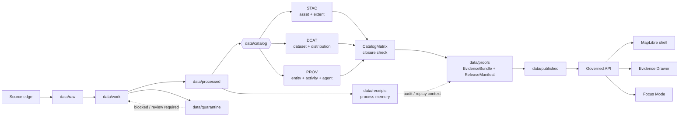

<!-- [KFM_META_BLOCK_V2]
doc_id: kfm://doc/NEEDS_VERIFICATION
title: data/catalog/prov/
type: standard
version: v1
status: draft
owners: @bartytime4life
created: NEEDS_VERIFICATION
updated: NEEDS_VERIFICATION
policy_label: NEEDS_VERIFICATION
related: [../../README.md, ../README.md, ../dcat/README.md, ../stac/README.md, ../../../docs/standards/KFM_PROV_PROFILE.md, ../../receipts/README.md, ../../proofs/README.md, ../../published/README.md, ../../registry/README.md, ../../../schemas/contracts/README.md, ../../../policy/README.md, ../../../tests/README.md, ../../../tools/catalog/README.md, ../../../.github/CODEOWNERS]
tags: [kfm, data, catalog, prov, provenance, catalog-closure]
notes: [Owner is the current broad CODEOWNERS fallback and should be rechecked before publication; doc_id, created, updated, policy_label, emitted PROV inventory, validator wiring, and signing/checksum policy remain NEEDS_VERIFICATION.]
[/KFM_META_BLOCK_V2] -->

<a id="top"></a>

# `data/catalog/prov/`

Governed provenance-bundle surface for KFM catalog closure, lineage inspection, and release-backed traceability.

> [!NOTE]
> **Status:** `experimental`  
> **Document state:** `draft`  
> **Owners:** `@bartytime4life` — broad fallback owner; narrower catalog ownership is **NEEDS VERIFICATION**  
> **Path:** `data/catalog/prov/README.md`  
> **Repo fit:** parent [`data/`](../../README.md) → [`catalog/`](../README.md) → sibling [`dcat/`](../dcat/README.md) · [`stac/`](../stac/README.md) · standard [`KFM_PROV_PROFILE`](../../../docs/standards/KFM_PROV_PROFILE.md)  
> 
> 
> 
> 
>   
> **Quick jumps:** [Scope](#scope) · [Evidence posture](#evidence-posture) · [Repo fit](#repo-fit) · [Accepted inputs](#accepted-inputs) · [Exclusions](#exclusions) · [Directory tree](#directory-tree) · [Quickstart](#quickstart) · [Usage](#usage) · [Diagram](#diagram) · [Reference tables](#reference-tables) · [Task list](#task-list) · [FAQ](#faq) · [Appendix](#appendix)

> [!IMPORTANT]
> `data/catalog/prov/` is a **catalog surface**, not a canonical data zone. It should hold outward-facing provenance bundles for released or release-candidate catalog artifacts, not raw inputs, work products, policy bundles, runtime receipts, proof packs, or UI narrative text.

> [!CAUTION]
> PROV may point toward lineage. It must not leak restricted raw paths, exact sensitive locations, source credentials, protected review notes, or unpublished candidate material into public-facing catalog records.

---

## Scope

`data/catalog/prov/` is the PROV member of KFM’s catalog-closure triplet.

It exists so maintainers, reviewers, governed APIs, Evidence Drawer payloads, and Focus Mode payloads can answer lineage questions without treating the catalog as sovereign truth:

- What entity, dataset version, derivative, or published artifact is being described?
- Which activity generated or transformed it?
- Which source, software, steward role, or review actor was associated with the activity?
- Which upstream material was used?
- Which release, correction, rollback, or supersession context should reviewers inspect?
- Do sibling `STAC` and `DCAT` records describe the same release-bearing subject?

This README is intentionally **verification-first**. It defines the directory contract and review posture, but it does **not** claim emitted `.prov.json` bundles, validators, CI gates, signatures, or release approvals exist until the active branch proves them.

[Back to top](#top)

---

## Evidence posture

Use the narrowest truthful label when changing this directory.

| Label | Meaning in this README |
|---|---|
| **CONFIRMED** | Directly supported by current branch files, checked-in docs, command output, or KFM doctrine. |
| **INFERRED** | Strongly suggested by adjacent repo docs and KFM doctrine, but not directly proven as live enforcement. |
| **PROPOSED** | A starter convention, path shape, command, or workflow that fits KFM doctrine but needs review before hardening. |
| **UNKNOWN** | Not verified strongly enough to claim. |
| **NEEDS VERIFICATION** | A concrete branch, owner, policy, path, schema, validator, fixture, or workflow check must be performed before strengthening the claim. |

### Current lane posture

| Observation | Status | Why it matters |
|---|---|---|
| `data/catalog/prov/README.md` is the target orientation file for this lane. | **CONFIRMED** | This file should be useful even before payloads exist. |
| `data/catalog/` is the parent catalog seam for `DCAT + STAC + PROV`. | **CONFIRMED** | PROV is one member of a coordinated closure set. |
| `docs/standards/KFM_PROV_PROFILE.md` is the field-level profile authority for PROV semantics. | **CONFIRMED** | Directory guidance should route profile rules there instead of duplicating them. |
| Broad fallback ownership currently resolves to `@bartytime4life`. | **CONFIRMED / NEEDS VERIFICATION** | Narrower path ownership may be added later. |
| Checked-in production `.prov.json` bundles under this directory. | **UNKNOWN / NEEDS VERIFICATION** | Do not claim emitted provenance inventory until inspected. |
| Branch-approved PROV validators, fixtures, and CI enforcement. | **UNKNOWN / NEEDS VERIFICATION** | README commands below are starter checks unless the branch provides exact tooling. |
| `<dataset>__<version>.prov.json` naming. | **PROPOSED** | Useful starter pattern, not declared as hard policy here. |

[Back to top](#top)

---

## Repo fit

`data/catalog/prov/` sits after governed processing and beside catalog discovery surfaces. It is downstream of source admission and processing, adjacent to proof and release objects, and upstream of governed read surfaces.

```text
Source edge
  -> data/raw/
  -> data/work/ or data/quarantine/
  -> data/processed/
  -> data/catalog/
       -> data/catalog/stac/
       -> data/catalog/dcat/
       -> data/catalog/prov/     # this lane
  -> data/proofs/
  -> data/published/
  -> governed API / MapLibre / Evidence Drawer / Focus Mode
```

### Path and neighboring surfaces

| Relationship | Surface | Role | Verification posture |
|---|---|---|---|
| Parent data lifecycle | [`../../README.md`](../../README.md) | Explains the broader `data/` truth path. | **NEEDS VERIFICATION** from active branch. |
| Parent catalog seam | [`../README.md`](../README.md) | Defines `DCAT + STAC + PROV` catalog closure. | **CONFIRMED pattern / verify current content**. |
| PROV standard | [`../../../docs/standards/KFM_PROV_PROFILE.md`](../../../docs/standards/KFM_PROV_PROFILE.md) | Field-level KFM PROV profile and relation rules. | **CONFIRMED** standards authority; implementation still branch-specific. |
| Sibling catalog lane | [`../dcat/README.md`](../dcat/README.md) | Dataset/distribution discovery and access metadata. | **NEEDS VERIFICATION** for payload inventory. |
| Sibling catalog lane | [`../stac/README.md`](../stac/README.md) | Spatial/temporal asset and item/collection metadata. | **NEEDS VERIFICATION** for payload inventory. |
| Process memory | [`../../receipts/README.md`](../../receipts/README.md) | Run, validation, probe, ingest, and review memory. | PROV may reference receipts; it does not replace them. |
| Release evidence | [`../../proofs/README.md`](../../proofs/README.md) | EvidenceBundle, ReleaseManifest, proof pack, CatalogMatrix, rollback refs. | Proofs decide trust; PROV explains lineage. |
| Published materialization | [`../../published/README.md`](../../published/README.md) | Release-backed public-safe outputs and aliases. | Publication follows promotion, not catalog file creation. |
| Registry/source identity | [`../../registry/README.md`](../../registry/README.md) | Source descriptors, identifiers, activation state. | PROV links to registry concepts; registry remains upstream. |
| Profile contracts | [`../../../schemas/contracts/README.md`](../../../schemas/contracts/README.md) | Machine-readable schema authority where branch supports it. | Schema home remains **NEEDS VERIFICATION**. |
| Policy | [`../../../policy/README.md`](../../../policy/README.md) | Rights, sensitivity, obligations, denial/default posture. | PROV may echo policy labels; it does not define policy. |
| Catalog tooling | [`../../../tools/catalog/README.md`](../../../tools/catalog/README.md) | Catalog closure checks and helper logic. | Tooling inspects this lane; it must not own catalog truth. |
| Tests | [`../../../tests/README.md`](../../../tests/README.md) | Fixtures and executable verification. | Tests prove behavior; they do not become provenance. |
| Ownership routing | [`../../../.github/CODEOWNERS`](../../../.github/CODEOWNERS) | Broad fallback ownership and future split notes. | Verify before changing owners in metadata. |

### Boundary summary

| Question | Answer |
|---|---|
| What belongs here? | Catalog-facing PROV records and README guidance for release or release-candidate provenance closure. |
| What reads this lane? | Catalog validators, review tools, promotion gates, governed APIs, Evidence Drawer payload builders, and documentation readers. |
| What must not happen here? | Do not turn PROV into a raw-data dump, a proof pack, a release decision, a policy engine, or a shortcut around EvidenceBundle resolution. |

[Back to top](#top)

---

## Accepted inputs

Only explicit, reviewable, release-aware provenance artifacts belong here.

| Accepted input | Typical shape | Belongs here when… | Status |
|---|---|---|---|
| `README.md` | Markdown orientation | It explains this lane’s scope, boundaries, links, and verification posture. | **CONFIRMED** |
| Production PROV bundle | `<dataset>__<version>.prov.json` | It describes a released or release-candidate artifact with entity/activity/agent relations. | **PROPOSED naming / NEEDS VERIFICATION inventory** |
| Example PROV bundle | `<dataset>__<version>.prov.example.json` | It is clearly marked as example-only and cannot become a release alias. | **PROPOSED** |
| Integrity sidecar | `<dataset>__<version>.prov.json.sha256` | Branch policy requires or allows catalog-record checksums. | **NEEDS VERIFICATION** |
| Signature sidecar | `<dataset>__<version>.prov.json.sig` | Branch signing convention is active and documented. | **NEEDS VERIFICATION** |
| Catalog closure reference | Link to `CatalogMatrix`, release manifest, or proof pack | The PROV record is part of release-bearing closure. | **INFERRED / branch-specific** |
| Correction/supersession reference | Link to correction, withdrawal, or rollback context | The described artifact has been corrected, replaced, narrowed, or withdrawn. | **INFERRED / branch-specific** |

### Input rules

1. Prefer **artifact-scoped** provenance over vague dataset prose.
2. Keep stable identity aligned across `STAC`, `DCAT`, `PROV`, release manifests, and proof references.
3. Include enough activity and agent information to support audit and replay.
4. Echo or link rights, sensitivity, and policy posture only in a public-safe way.
5. Treat example files as examples. Do not use `*.example.*` files as release aliases.
6. Never use a PROV file as evidence that promotion passed unless the release/proof objects also resolve.

[Back to top](#top)

---

## Exclusions

The following do **not** belong in `data/catalog/prov/` as their primary home:

| Excluded | Put it here instead | Why |
|---|---|---|
| Source-native acquisitions | `../../raw/` | RAW preserves source payloads and acquisition context. |
| Transform scratch space, QA staging, or repair outputs | `../../work/` | WORK is reproducible processing space, not outward provenance. |
| Rights-unclear, malformed, sensitive, or blocked material | `../../quarantine/` | Catalog should not normalize unresolved material into discoverability. |
| Canonical processed artifacts | `../../processed/` | PROV describes processed artifacts; it does not store them. |
| Run receipts, validation reports, ingest receipts, probe receipts | `../../receipts/` | Receipts are process memory, not outward lineage vocabulary. |
| EvidenceBundles, ReleaseManifests, proof packs, attestations, CatalogMatrix objects | `../../proofs/` or branch-approved release/proof home | These are release-grade trust objects, not PROV payloads. |
| Public materialized release packages | `../../published/` | Publication is a governed state transition, not a provenance write. |
| Source descriptors and activation records | `../../registry/` | Source identity and admission stay upstream. |
| Policy bundles, rules, obligations, and deny logic | `../../../policy/` | PROV may expose policy labels; it does not define policy. |
| JSON Schemas or profile authority | `../../../schemas/`, `../../../contracts/`, or branch-approved schema home | Schema authority must not be duplicated in catalog folders. |
| MapLibre styles, UI state, Focus narratives, Story text, AI summaries | governed API / app surfaces | UI and AI consume governed outputs; they are not catalog truth. |
| Secrets, credentials, source API tokens, private service URLs | never commit; use approved secret management | Catalog files must be safe to review in GitHub. |

> [!WARNING]
> A PROV record can make unsafe material easier to discover. For sensitive lanes, use redacted identifiers, generalized references, restricted-access catalog records, or policy-approved transforms before anything becomes public-facing.

[Back to top](#top)

---

## Directory tree

### README-level baseline to verify

This is the minimum shape expected for the catalog family. Re-check it against the active branch before strengthening claims.

```text
data/
└── catalog/
    ├── README.md
    ├── dcat/
    │   └── README.md
    ├── prov/
    │   └── README.md
    └── stac/
        └── README.md
```

### Doctrine-aligned growth shape

The shape below is a **PROPOSED** starter pattern, not proof that payloads already exist.

```text
data/
└── catalog/
    └── prov/
        ├── README.md
        ├── <dataset>__<version>.prov.json
        ├── <dataset>__<version>.prov.example.json     # example only
        ├── <dataset>__<version>.prov.json.sha256      # optional / NEEDS VERIFICATION
        └── <dataset>__<version>.prov.json.sig         # optional / NEEDS VERIFICATION
```

### Related closure surface

Catalog provenance is most useful when paired with proof, release, and evidence objects rather than isolated as a standalone file.

```text
data/
├── processed/<theme>/<dataset>/<version>/
├── catalog/
│   ├── stac/
│   ├── dcat/
│   └── prov/
├── receipts/
├── proofs/
│   └── <theme>/<release_id>/
│       ├── evidence_bundle.json
│       ├── release_manifest.json
│       ├── catalog_matrix.json
│       └── proof_pack.json
└── published/<theme>/<release_id>/
```

[Back to top](#top)

---

## Quickstart

Run these checks from the repository root before editing or strengthening this lane.

### 1) Inspect the catalog surface

```bash
find data/catalog -maxdepth 4 -type f | sort

sed -n '1,220p' data/README.md
sed -n '1,220p' data/catalog/README.md
sed -n '1,220p' data/catalog/dcat/README.md
sed -n '1,220p' data/catalog/stac/README.md
sed -n '1,220p' data/catalog/prov/README.md
sed -n '1,260p' docs/standards/KFM_PROV_PROFILE.md
```

### 2) Inspect adjacent trust surfaces

```bash
sed -n '1,220p' data/processed/README.md 2>/dev/null || true
sed -n '1,220p' data/receipts/README.md 2>/dev/null || true
sed -n '1,220p' data/proofs/README.md 2>/dev/null || true
sed -n '1,220p' data/published/README.md 2>/dev/null || true
sed -n '1,220p' data/registry/README.md 2>/dev/null || true
sed -n '1,220p' tools/catalog/README.md 2>/dev/null || true
sed -n '1,220p' tests/catalog/README.md 2>/dev/null || true
```

### 3) Look for emitted PROV payloads

```bash
find data/catalog/prov -type f | sort
find data/catalog/prov -type f | grep -E '\.prov\.(json|jsonld)$|\.prov\.json$' || true
grep -RInE 'wasDerivedFrom|wasGeneratedBy|wasAssociatedWith|prov:used|prov:Entity|prov:Activity|prov:Agent' data/catalog/prov 2>/dev/null || true
```

### 4) Run branch-provided validators when available

```bash
# NEEDS VERIFICATION: run only when the active branch provides these helpers.
test -f tools/catalog/catalog_crosslink.py && \
  python tools/catalog/catalog_crosslink.py --root data/catalog

test -f tools/validators/catalog_matrix/evaluate.py && \
  python tools/validators/catalog_matrix/evaluate.py --candidate data/catalog

test -f tools/provenance/validate_prov.py && \
  python tools/provenance/validate_prov.py data/catalog/prov
```

> [!TIP]
> Missing validators are not success. Record missing validation as **NEEDS VERIFICATION** in the PR and keep the candidate in draft or review until the branch’s validation path is confirmed.

[Back to top](#top)

---

## Usage

### Adding or updating a PROV record

1. Confirm the processed artifact or release candidate exists outside `data/catalog/`.
2. Confirm source descriptors, rights, sensitivity, review posture, and policy state are known enough for the intended audience.
3. Confirm the matching `STAC` and `DCAT` records exist or are being added in the same closure set.
4. Add or update the PROV record under `data/catalog/prov/`.
5. Confirm `Entity`, `Activity`, `Agent`, and relation fields align with the KFM PROV profile.
6. Confirm subject ID, version, release family, digest, and artifact refs agree across `STAC`, `DCAT`, `PROV`, and release/proof objects.
7. Link to release or proof objects such as `EvidenceBundle`, `ReleaseManifest`, and `CatalogMatrix` when branch conventions support them.
8. Let the promotion gate decide release readiness.

### Minimum lineage expectations

A catalog-facing PROV record should make room for these concepts without flattening KFM governance into generic triples.

| Component | Minimum expectation | Why it matters |
|---|---|---|
| `Entity` | Released artifact, dataset version, source capture, intermediate derivative, or catalog resource. | Keeps lineage grounded in actual artifacts. |
| `Activity` | Fetch, ingest, normalize, validate, build, catalog, publish, correct, or other named process. | Makes transformation history inspectable. |
| `Agent` | Source organization, maintainer, reviewer role, software runner, or governed service. | Supports accountability without burying it in prose. |
| Relations | `used`, `wasGeneratedBy`, `wasDerivedFrom`, `wasAssociatedWith`, or profile-approved equivalents. | Forms the core lineage joins. |
| Time | Start/end or equivalent generation timing where applicable. | Supports replay, audit, and comparison. |
| Integrity | Checksum, digest, `spec_hash`, or branch-approved integrity echo where available. | Prevents lineage from drifting away from released bytes. |
| Policy-aware transforms | Redaction, masking, generalization, or public-safe transform references where material. | Prevents silent sensitivity drift. |
| Release linkage | Reference to release, manifest, proof, or closure context. | Keeps PROV tied to outward state. |
| Correction visibility | Supersession, withdrawal, narrowing, replacement, or rollback reference where relevant. | Preserves correctability instead of overwriting history. |

### Illustrative minimal shape

The sketch below is **PROPOSED pseudocode**. Use the branch’s profile schema and examples when they exist.

```jsonc
{
  "profile_version": "kfm-prov-profile/v1",
  "subject_id": "TODO(stable-dataset-or-artifact-id)",
  "subject_type": "dataset_version",
  "release_ref": "TODO(release-manifest-or-release-window)",
  "closure_refs": {
    "stac_ref": "TODO(stac-item-or-collection-ref)",
    "dcat_ref": "TODO(dcat-dataset-or-distribution-ref)"
  },
  "entities": {
    "TODO(input-entity-id)": {
      "type": "prov:Entity",
      "role": "source_capture"
    },
    "TODO(output-entity-id)": {
      "type": "prov:Entity",
      "role": "released_or_candidate_artifact",
      "sha256": "TODO(digest-if-available)"
    }
  },
  "activities": {
    "TODO(activity-id)": {
      "type": "prov:Activity",
      "started_at": "TODO(ISO-8601)",
      "ended_at": "TODO(ISO-8601)"
    }
  },
  "agents": {
    "TODO(agent-id)": {
      "type": "prov:Agent",
      "role": "software_runner_or_steward_role"
    }
  },
  "relations": [
    {
      "type": "prov:used",
      "activity": "TODO(activity-id)",
      "entity": "TODO(input-entity-id)"
    },
    {
      "type": "prov:wasGeneratedBy",
      "entity": "TODO(output-entity-id)",
      "activity": "TODO(activity-id)"
    },
    {
      "type": "prov:wasAssociatedWith",
      "activity": "TODO(activity-id)",
      "agent": "TODO(agent-id)"
    }
  ],
  "policy_echo": {
    "policy_label": "TODO",
    "public_safe": "TODO(true|false|restricted)"
  },
  "correction_refs": []
}
```

[Back to top](#top)

---

## Diagram


```mermaid
flowchart LR
    A["Source edge"] --> B["data/raw"]
    B --> C["data/work"]
    C --> D["data/processed"]
    C --> E["data/quarantine"]

    D --> F{{"data/catalog"}}
    F --> G["STAC<br/>asset + extent"]
    F --> H["DCAT<br/>dataset + distribution"]
    F --> I["PROV<br/>entity + activity + agent"]

    G --> J["CatalogMatrix<br/>closure check"]
    H --> J
    I --> J

    D --> R["data/receipts<br/>process memory"]
    J --> P["data/proofs<br/>EvidenceBundle + ReleaseManifest"]
    R -. "audit / replay context" .-> P

    P --> K["data/published"]
    K --> L["Governed API"]
    L --> M["MapLibre shell"]
    L --> N["Evidence Drawer"]
    L --> O["Focus Mode"]

    E -. "blocked / review required" .-> C
```

Catalog provenance is meaningful only when it stays connected to upstream evidence, sibling catalog records, proof/release objects, and downstream governed access.

[Back to top](#top)

---

## Reference tables

### Catalog triplet responsibilities

| Surface | Primary question | Minimum closure expectation | What it must not become |
|---|---|---|---|
| `stac/` | What spatial/temporal asset is discoverable? | Collection/item identity, extent, datetime, assets, checksums, links. | A replacement for processed artifacts or proof bundles. |
| `dcat/` | What dataset or distribution can be discovered and accessed? | Dataset/distribution IDs, rights/access cues, format, checksum, publisher/contact where applicable. | A legal review substitute or policy engine. |
| `prov/` | How was this artifact generated? | Entity/activity/agent relations with source, run, output, release, and correction references. | A proof pack, receipt store, unrestricted raw lineage dump, or generated narrative. |
| `CatalogMatrix` | Do catalog records close over the same release candidate? | STAC/DCAT/PROV/checksum/EvidenceBundle agreement. | A title-matching exercise or decorative checklist. |
| `EvidenceBundle` | What admissible evidence supports claims about this release? | Resolved evidence refs, artifact digests, review/policy context. | Generated prose or a loose citation string. |
| `ReleaseManifest` | What is being released? | Release ID, artifacts, digests, prior/rollback refs, promotion state. | A catalog record or raw publication action. |

### PROV relation crosswalk

| PROV concept | KFM interpretation | Minimum check |
|---|---|---|
| `prov:Entity` | Governed artifact, source capture, dataset version, derivative, catalog record, or published subject. | Stable identifier; public-safe label; digest or manifest ref where applicable. |
| `prov:Activity` | Fetch, ingest, normalize, validate, build, catalog, release, correction, or rollback step. | Named activity with time bounds and input/output links. |
| `prov:Agent` | Source organization, steward, reviewer role, software runner, or governed service. | Role-bearing identity; no hidden credential or private account leakage. |
| `prov:used` | Activity consumed an input entity. | Input belongs to an allowed lifecycle state and is safe to reference. |
| `prov:wasGeneratedBy` | Entity was produced by an activity. | Output is the same subject described in sibling catalog/release records. |
| `prov:wasDerivedFrom` | Output or derivative has lineage from another entity. | Derivation is clear enough for audit and correction. |
| `prov:wasAssociatedWith` | Activity is associated with an agent. | Agent role is accountable but not overclaimed as legal authority unless evidence supports it. |
| `prov:wasAttributedTo` | Entity is attributed to an agent. | Attribution is source-backed and policy-safe. |

### Closure checks

| Check | Pass condition | Fail-closed condition |
|---|---|---|
| Identity | Subject and version agree across STAC, DCAT, PROV, release manifest, and proof refs. | Same title but different IDs, versions, or digests. |
| Artifact integrity | Asset checksums match manifest and proof references. | Missing digest, drifted digest, or checksum only in prose. |
| Rights | License/access/sensitivity cues align with source descriptors and policy. | Unknown rights, incompatible redistribution, or hidden restrictions. |
| Lineage | PROV relations identify source, run/activity, output entity, and accountable agent. | Detached provenance or unclear generation activity. |
| Evidence | EvidenceRef resolves to EvidenceBundle or release proof surface. | Claim relies on README prose, UI text, or model response only. |
| Publication | Promotion decision approves release before public alias changes. | Catalog exists but promotion state is absent, failed, or unclear. |
| Correction | Supersession/withdrawal/rollback remains visible after change. | Old lineage is overwritten, deleted, or made unreachable. |

[Back to top](#top)

---

## Task list

### Definition of done for this directory

- [ ] Active checkout confirms the catalog child lanes: `dcat/`, `stac/`, and `prov/`.
- [ ] Every production PROV record points to a governed processed artifact or promotion candidate.
- [ ] STAC, DCAT, and PROV agree on subject identity, release/version ID, and checksums.
- [ ] PROV records include at least one entity, one activity, one agent, and required relations.
- [ ] Rights, access, policy, and sensitivity posture are visible or safely linked.
- [ ] Catalog closure is validated by branch-approved helper(s) or a documented manual review.
- [ ] EvidenceBundle and ReleaseManifest references resolve when the record is release-bearing.
- [ ] No PROV object silently publishes raw, work, quarantine, restricted internal material, exact sensitive location detail, or source credentials.
- [ ] Rollback, correction, or supersession path is visible for release-bearing PROV updates.
- [ ] Relative links in this README resolve from `data/catalog/prov/README.md`.
- [ ] Any placeholder in the KFM meta block is resolved or explicitly carried as `NEEDS VERIFICATION`.

### PR review checklist

- [ ] Does the PR add provenance metadata only, or does it accidentally add payload data?
- [ ] Are example files named as examples and excluded from release aliases?
- [ ] Are generated timestamps separated from semantic identity and `spec_hash` inputs?
- [ ] Are branch-specific validators invoked in CI or noted as unavailable?
- [ ] Are PROV additions paired with STAC/DCAT and proof/receipt references where release significance requires them?
- [ ] Are sensitive domains reviewed for exact-location, cultural, rights, living-person, critical-infrastructure, or steward restrictions?
- [ ] Does the PR avoid claiming publication or conformance without emitted artifacts and gate evidence?

[Back to top](#top)

---

## FAQ

### Why does KFM use PROV here instead of one custom metadata file?

Because lineage has a different job from discovery, distribution, policy, proof, and runtime explanation. PROV gives KFM a standards-aligned way to express entities, activities, agents, and derivation while keeping KFM-specific governance objects first-class.

### Does `data/catalog/prov/` prove that a release was approved?

No. A PROV record may support release traceability, but approval belongs to promotion/release objects, policy decisions, review records, proof packs, and release manifests.

### Can a PROV record reference receipts or proofs?

Yes. It may reference them. It must not replace them. Receipts preserve process memory; proofs carry release-grade trust evidence; PROV explains lineage.

### Can PROV expose raw-source lineage?

Sometimes, but only safely. Public-facing provenance must not leak restricted raw paths, exact sensitive locations, private source details, source credentials, or protected review material. Use source descriptors, redacted identifiers, generalized references, or restricted-access catalog records where needed.

### What is the most dangerous failure mode here?

Metadata drift. A PROV file that still resolves but no longer truthfully describes the artifact, rights posture, lineage, or release state can look trustworthy while weakening auditability.

### What should happen when PROV closure is incomplete?

Fail closed. Keep the candidate in draft, review, or quarantine-adjacent handling until closure is explicit enough for the intended audience and release posture.

[Back to top](#top)

---

## Appendix

<details>
<summary>PROPOSED starter naming patterns</summary>

These patterns fit the current KFM catalog doctrine, but they should be verified against the active branch before becoming hard policy.

```text
data/catalog/prov/<dataset>__<version>.prov.json
data/catalog/prov/<dataset>__<version>.prov.example.json
data/catalog/prov/<dataset>__<version>.prov.json.sha256
data/catalog/prov/<dataset>__<version>.prov.json.sig
```

Pair with sibling catalog and proof surfaces:

```text
data/catalog/dcat/<dataset>__<version>.dataset.jsonld
data/catalog/dcat/<dataset>__<version>.distribution.jsonld
data/catalog/stac/<dataset>/collection.json
data/catalog/stac/<dataset>/<version>.json
data/proofs/<theme>/<release_id>/catalog_matrix.json
data/proofs/<theme>/<release_id>/release_manifest.json
data/proofs/<theme>/<release_id>/evidence_bundle.json
```

</details>

<details>
<summary>Catalog anti-patterns to reject</summary>

- Treating PROV lineage as an EvidenceBundle.
- Treating a PROV record as proof that a release was approved.
- Using PROV as a generic event log for every pipeline detail.
- Letting a catalog helper overwrite provenance truth without review.
- Linking public UI directly to raw, work, or quarantine paths.
- Creating PROV records for artifacts whose source roles or rights are unresolved.
- Reusing a prior release ID after semantic content changes.
- Hiding digest drift inside regenerated timestamps.
- Allowing generated AI summaries to become provenance evidence.
- Publishing exact sensitive geometry because a catalog record “only contains metadata.”

</details>

<details>
<summary>Maintainer verification notes before promoting this README</summary>

1. Replace `doc_id: kfm://doc/NEEDS_VERIFICATION` with a registered KFM document ID.
2. Verify `owners` against the active branch’s `CODEOWNERS` and any narrower catalog-release ownership.
3. Fill `created`, `updated`, and `policy_label` from repo history and policy docs.
4. Confirm every relative link from `data/catalog/prov/README.md`.
5. Confirm the branch’s actual PROV validators and update the quickstart commands.
6. Confirm whether examples are checked in, generated, fixture-only, or intentionally absent.
7. Confirm whether signatures/checksums for PROV records are required, optional, or not implemented.
8. Confirm where `CatalogMatrix`, `ReleaseManifest`, `EvidenceBundle`, and proof-pack objects live on the active branch.

</details>

[Back to top](#top)
