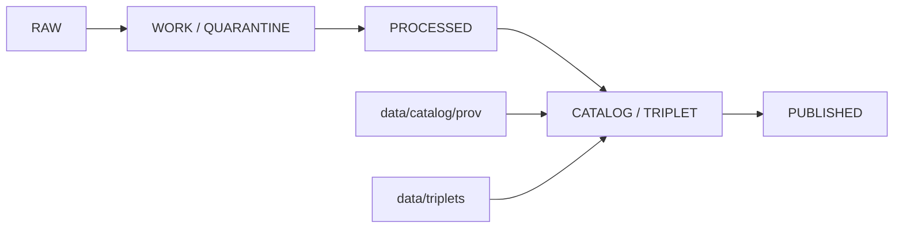

<!-- [KFM_META_BLOCK_V2]
doc_id: kfm://doc/data-catalog-prov-readme
title: data/catalog/prov/README.md — PROV Catalog Sublane README
version: v0.1
type: readme; data-lifecycle-sublane; prov-catalog-guide
status: draft; PROPOSED; data-root; catalog-stage; prov; prov-o; pav; release-gated
owners: OWNER_TBD — Data steward · Catalog steward · PROV steward · Evidence steward · Source steward · Policy steward · Release steward · Schema steward · Docs steward
created: NEEDS VERIFICATION — greenfield stub existed before v0.1 expansion
updated: 2026-06-25
policy_label: public-doc; data; catalog; prov; provenance; lifecycle; release-gated
tags: [kfm, data, catalog, prov, PROV-O, PAV, CATALOG, STAC, DCAT, EvidenceBundle, SourceDescriptor, RunReceipt, ReleaseManifest, CatalogBuildReceipt]
related:
  - ../README.md
  - ../../README.md
  - ../stac/
  - ../dcat/README.md
  - ../domain/README.md
  - ../../triplets/
  - ../../proofs/
  - ../../receipts/
  - ../../published/
  - ../../registry/
  - ../../../docs/standards/PROV.md
  - ../../../docs/standards/PROVENANCE.md
  - ../../../docs/adr/ADR-0022-catalog-matrix--stac-+-dcat-+-prov-must-agree.md
  - ../../../schemas/
  - ../../../policy/
  - ../../../release/
notes:
  - "This file replaces a greenfield stub at `data/catalog/prov/README.md`."
  - "PROV catalog records are catalog carriers and do not replace SourceDescriptor, EvidenceBundle, RunReceipt, PolicyDecision, ReleaseManifest, proof storage, receipt storage, or release decisions."
  - "ADR-0022 requires STAC, DCAT, and PROV-O catalog records to agree by identifier, digest, and release reference for promoted releases."
  - "W3C PROV-O/PAV semantic claim provenance must not be conflated with supply-chain/build provenance; the latter is governed by the separate PROVENANCE standard and receipt/attestation roots."
  - "Rollback target for this expansion is previous stub blob SHA `54c39b4c67ff97432d745df26d7c08cb87edf78d`."
[/KFM_META_BLOCK_V2] -->

# data/catalog/prov

> PROV catalog sublane for governed `prov:Entity`, `prov:Activity`, `prov:Agent`, and PAV versioning/authoring records inside the `CATALOG / TRIPLET` lifecycle stage.

  
  
  
  
  

**Status:** draft / PROPOSED  
**Owners:** OWNER_TBD — Data steward · Catalog steward · PROV steward · Evidence steward · Source steward · Policy steward · Release steward · Schema steward · Docs steward  
**Path:** `data/catalog/prov/README.md`  
**Owning root:** `data/catalog/`  
**Lifecycle stage:** `CATALOG / TRIPLET`  
**External vocabulary:** W3C PROV-O + PAV  
**Exposure posture:** RELEASED ONLY  
**Truth posture:** CONFIRMED target was a greenfield stub · CONFIRMED parent catalog lane is CATALOG-stage and RELEASED ONLY for public exposure · CONFIRMED PROV-O/PAV doctrine maps claim/artifact/release provenance to Entity, Activity, Agent, and related predicates · CONFIRMED ADR-0022 says STAC, DCAT, and PROV must agree for promoted releases · NEEDS VERIFICATION for concrete inventory, schemas, validators, policy gates, receipts, release manifests, CatalogMatrix artifacts, and routed access behavior.

**Quick jumps:** [Purpose](#purpose) · [Lifecycle boundary](#lifecycle-boundary) · [Repo fit](#repo-fit) · [Accepted contents](#accepted-contents) · [Exclusions](#exclusions) · [Record requirements](#record-requirements) · [PROV guardrails](#prov-guardrails) · [Evidence ledger](#evidence-ledger) · [Validation checklist](#validation-checklist) · [Rollback](#rollback)

---

## Purpose

`data/catalog/prov/` stores or stages governed PROV catalog records for KFM claims, datasets, artifacts, manifests, release decisions, and related lineage surfaces.

A PROV catalog record supports catalog discovery, lineage inspection, graph closure, and interoperability. It does **not** make a claim true, public, policy-admitted, evidence-supported, source-admitted, build-attested, or released by itself.

## Lifecycle boundary

```mermaid
flowchart LR
  RAW[RAW] --> WORK[WORK / QUARANTINE]
  WORK --> PROCESSED[PROCESSED]
  PROCESSED --> CATALOG[CATALOG / TRIPLET]
  CATALOG --> PUBLISHED[PUBLISHED]
  PROV[data/catalog/prov] --> CATALOG
  TRIP[data/triplets] --> CATALOG
```

`data/catalog/prov/` is a CATALOG-stage sublane. Public exposure applies only to records tied to approved release state, governed access path, EvidenceBundle support, source-role support, policy posture, and release/rollback linkage.

## Repo fit

| Responsibility | Correct home | Rule |
|---|---|---|
| PROV catalog records | `data/catalog/prov/` | This lane. |
| Parent catalog stage | `data/catalog/` | Parent CATALOG-stage lane. |
| STAC catalog records | `data/catalog/stac/` | Spatiotemporal catalog records. |
| DCAT catalog records | `data/catalog/dcat/` | Dataset/distribution catalog records. |
| Domain catalog records | `data/catalog/domain/` | Domain-scoped catalog records. |
| Graph/triplet projection | `data/triplets/` | Paired graph stage. |
| Evidence/proof records | `data/proofs/` | EvidenceBundle and proof records. |
| Source registry | `data/registry/` | SourceDescriptor and source-admission records. |
| Receipts | `data/receipts/` | RunReceipt, CatalogBuildReceipt, validation, policy, review, transform, correction, and release receipts. |
| Release decisions | `release/` | Publication authority. |
| Published outputs | `data/published/` | Public-safe materialization after release. |
| Schemas and policy | `schemas/`, `policy/` | Separate roots. |
| Validators and tests | `tools/validators/`, `tests/` | Separate roots. |

## Accepted contents

| Content | Purpose |
|---|---|
| `prov:Entity` records | Catalog-level entity references for datasets, artifacts, claims, manifests, and released records. |
| `prov:Activity` records | Catalog-level activity references for intake, transform, validation, redaction, review, publication, correction, and withdrawal actions. |
| `prov:Agent` records | Catalog-level agent references for stewards, reviewers, systems, and software agents where release/public posture permits. |
| PAV fields | Authoring, versioning, update, and curation metadata where KFM profiles require it. |
| KFM extension fields | Source, evidence, release, policy, digest, rights, sensitivity, and rollback pointers. |
| CatalogMatrix references | Links to STAC/DCAT/PROV closure artifacts where they exist. |
| Validation summaries | Pointers to validation reports and receipts. |

## Exclusions

| Do not put here | Correct home |
|---|---|
| RAW source files | `data/raw/` |
| WORK/intermediate data | `data/work/` |
| Quarantined data | `data/quarantine/` |
| Processed datasets | `data/processed/` |
| STAC records | `data/catalog/stac/` |
| DCAT records | `data/catalog/dcat/` |
| Domain catalog records | `data/catalog/domain/` |
| Triplets/graph edges | `data/triplets/` |
| EvidenceBundle/proof records | `data/proofs/` |
| SourceDescriptor/source registry records | `data/registry/` |
| Receipts and supply-chain attestations | `data/receipts/`, attestation/proof roots, or accepted receipt/proof home |
| Release decisions | `release/` |
| Published public products | `data/published/` |
| JSON Schema | `schemas/` |
| Policy rules | `policy/` |
| Validators/tests/code | `tools/validators/`, `tests/`, implementation roots |

## Record requirements

PROPOSED until schema and validator are verified:

| Requirement | Meaning |
|---|---|
| Stable identifier | Identifier resolves to the same artifact, claim, dataset, activity, or agent identity used by catalog closure. |
| PROV class | Record declares whether it is an Entity, Activity, Agent, or qualified relation. |
| Fixed predicates | PROV-O and PAV predicates are not renamed; KFM-specific extensions stay in the governed `kfm:` namespace. |
| Evidence reference | EvidenceBundle/proof context is referenced when claims depend on evidence. |
| Run/receipt reference | Activity records resolve to RunReceipt or equivalent receipt where material. |
| Source reference | SourceDescriptor/source catalog is referenced when source authority matters. |
| Release reference | Public or release-linked records point to the immutable ReleaseManifest. |
| Digest compatibility | Artifact/entity digests match release and closure records where material. |
| Closure compatibility | STAC ↔ DCAT ↔ PROV agreement holds for promoted releases. |

## PROV guardrails

- PROV is a catalog/provenance vocabulary, not source truth.
- PROV records, STAC records, and DCAT records for the same released artifact must agree on identifier, digest, and release reference.
- PROV catalog records do not replace EvidenceBundle, SourceDescriptor, RunReceipt, PolicyDecision, ReleaseManifest, or CatalogMatrix closure artifacts.
- Semantic claim provenance and supply-chain/build provenance answer different questions and must not be collapsed.
- Missing, mismatched, or unverifiable provenance should fail closed at validation/promotion surfaces.
- Unreleased PROV records are not public merely because they exist under `data/catalog/prov/`.

## Evidence ledger

| Source | Status | Supports | Limits |
|---|---|---|---|
| `data/catalog/prov/README.md` prior file | CONFIRMED | Target existed as a greenfield stub. | Did not define PROV sublane boundaries. |
| `data/catalog/README.md` | CONFIRMED | Parent catalog lane and RELEASED ONLY posture. | Does not prove PROV record inventory. |
| `data/catalog/dcat/README.md` | CONFIRMED sibling pattern | DCAT sublane boundary, record requirements, and STAC/DCAT/PROV closure posture. | DCAT pattern does not prove PROV inventory. |
| `docs/standards/PROV.md` | CONFIRMED doctrine / PROPOSED implementation | W3C PROV-O + PAV use, class mapping, predicate/no-rename posture, and EvidenceBundle linkage. | Concrete JSON-LD contexts and validators remain NEEDS VERIFICATION. |
| `docs/standards/PROVENANCE.md` | CONFIRMED doctrine / PROPOSED implementation | Separates supply-chain/build provenance from semantic claim provenance. | Does not define `data/catalog/prov/` inventory. |
| `ADR-0022` | CONFIRMED doctrine / PROPOSED implementation | STAC/DCAT/PROV agreement invariant and CatalogMatrix requirement. | Does not prove emitted CatalogMatrix or CI enforcement. |

## Validation checklist

- [ ] Confirm actual child directories and PROV record files.
- [ ] Confirm PROV schema/profile and JSON-LD context location.
- [ ] Confirm PROV validator and CI checks.
- [ ] Confirm STAC/DCAT/PROV CatalogMatrix closure.
- [ ] Confirm ReleaseManifest linkage for public PROV records.
- [ ] Confirm EvidenceBundle, SourceDescriptor, RunReceipt, PolicyDecision, and CatalogBuildReceipt references.
- [ ] Confirm rights, sensitivity, source-role, predicate namespace, and publication handling.
- [ ] Confirm withdrawal/supersession behavior for stale or failed PROV records.

## Rollback

Rollback is required if this lane becomes a source-data root, proof store, source-registry root, receipt/attestation store, release-decision root, published-output root, schema root, policy root, validator root, implementation root, or public exposure shortcut.

Rollback target for this expansion: previous stub blob SHA `54c39b4c67ff97432d745df26d7c08cb87edf78d`.

<a href="#top">Back to top</a>

