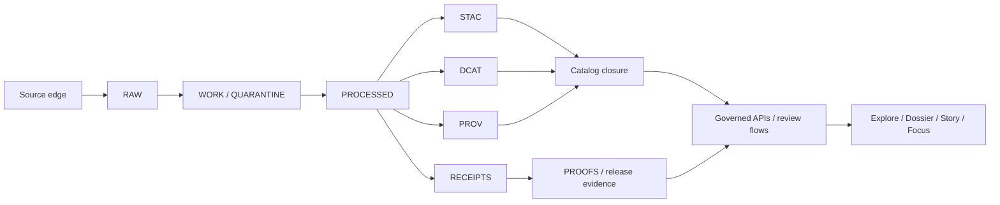

<!-- [KFM_META_BLOCK_V2]
doc_id: kfm://doc/<NEEDS-VERIFICATION-UUID>
title: `data/catalog/prov/`
type: standard
version: v1
status: draft
owners: @bartytime4life
created: <NEEDS-VERIFICATION>
updated: <NEEDS-VERIFICATION>
policy_label: <NEEDS-VERIFICATION>
related: ["../README.md", "../dcat/README.md", "../stac/README.md", "../../README.md", "../../receipts/README.md", "../../proofs/README.md", "../../published/README.md", "../../registry/README.md", "../../../contracts/README.md", "../../../schemas/contracts/README.md", "../../../policy/README.md", "../../../tests/README.md", "../../../.github/CODEOWNERS"]
tags: [kfm, data, catalog, prov, provenance]
notes: ["Current public-main evidence confirms the path, sibling catalog lanes, and a broad `/data/` CODEOWNERS fallback to `@bartytime4life`.", "Current public-main checked-in inventory for this directory is `README.md` only.", "doc_id, created, updated, and policy_label still require branch-grounded confirmation."]
[/KFM_META_BLOCK_V2] -->

<a id="top"></a>

# `data/catalog/prov/`

Governed provenance-bundle surface for KFM catalog closure, lineage inspection, and release-backed traceability.

> **Status:** `experimental`  
> **Doc state:** `draft`  
> **Owners:** `@bartytime4life` *(current strongest public owner signal is the broad `/data/` CODEOWNERS fallback; narrower path ownership is still unverified)*  
> **Path:** `data/catalog/prov/README.md`  
>      
> **Quick jump:** [Scope](#scope) · [Evidence posture](#evidence-posture) · [Repo fit](#repo-fit) · [Accepted inputs](#accepted-inputs) · [Exclusions](#exclusions) · [Directory tree](#directory-tree) · [Quickstart](#quickstart) · [Usage](#usage) · [Diagram](#diagram) · [Reference tables](#reference-tables) · [Task list](#task-list) · [FAQ](#faq) · [Appendix](#appendix)

> [!IMPORTANT]
> This directory is a **catalog surface**, not a canonical data zone. It should hold outward-facing provenance bundles for released or release-candidate catalog artifacts, not raw inputs, work products, policy bundles, runtime receipts, or UI narrative text.

## Scope

`data/catalog/prov/` is the KFM directory for provenance artifacts that make lineage inspectable at the catalog layer.

In practice, this lane should answer questions like:

- What inputs fed this published or publishable artifact?
- Which activity produced it?
- Which agent, toolchain, or steward role was associated with the run?
- Which derived outputs came from which upstream materials?
- Where should reviewers look when they need correction, rollback, or release-trace context?

This README is intentionally **verification-first**:

- it documents what this directory is for,
- it distinguishes current visible repo reality from doctrine-aligned working shape,
- and it avoids implying mounted implementation depth that still needs confirmation.

[Back to top](#top)

## Evidence posture

### Reading rule used here

| Label | Meaning in this README |
|---|---|
| **CONFIRMED** | Verified from current visible repo/public-main evidence or attached KFM doctrine |
| **INFERRED** | Strongly suggested by adjacent repo docs and KFM doctrine, but not directly enforced in visible implementation evidence |
| **PROPOSED** | A starter pattern that fits KFM doctrine and current directory role, but is not yet claimed as live enforcement |
| **UNKNOWN / NEEDS VERIFICATION** | Not verified in the current visible evidence boundary |

### Current public snapshot

| Observation | Status | Why it matters |
|---|---|---|
| `data/catalog/prov/` exists | **CONFIRMED** | This lane is part of the visible repo structure |
| `data/catalog/` also contains `dcat/` and `stac/` | **CONFIRMED** | PROV is one member of the catalog triplet, not an isolated concept |
| Current checked-in visible inventory for this lane is `README.md` | **CONFIRMED** | This README should not pretend that emitted bundles are already visible here |
| `data/` includes lifecycle and release-adjacent lanes such as `raw/`, `work/`, `quarantine/`, `processed/`, `catalog/`, `receipts/`, `proofs/`, `published/`, and `registry/` | **CONFIRMED** | Provenance has to sit cleanly inside a broader governed lifecycle |
| Broad `/data/` CODEOWNERS ownership points to `@bartytime4life` | **CONFIRMED** | Strongest currently visible owner signal for this path |
| Checked-in emitted `.prov.json` files under this directory | **UNKNOWN / NEEDS VERIFICATION** | Public snapshot does not prove they exist |
| Mounted provenance validator / fixture / merge gate | **UNKNOWN / NEEDS VERIFICATION** | Public snapshot does not yet prove concrete enforcement wiring |
| `<dataset>__<version>.prov.json` as a starter naming pattern | **PROPOSED** | Useful convention, but not presented here as machine-enforced fact |

[Back to top](#top)

## Repo fit

### Path and neighboring surfaces

| Surface | Path | Relationship |
|---|---|---|
| Parent data guide | [`../../README.md`](../../README.md) | Defines `data/` as the governed storage and lifecycle area |
| Catalog parent | [`../README.md`](../README.md) | Defines the catalog closure as linked `DCAT + STAC + PROV` |
| STAC sibling | [`../stac/README.md`](../stac/README.md) | Spatial/temporal asset metadata surface |
| DCAT sibling | [`../dcat/README.md`](../dcat/README.md) | Dataset/distribution metadata surface |
| Receipts sibling | [`../../receipts/README.md`](../../receipts/README.md) | Run and event receipts should remain distinguishable from provenance bundles |
| Proofs sibling | [`../../proofs/README.md`](../../proofs/README.md) | Proof packs and attestations should not be collapsed into the PROV lane |
| Published sibling | [`../../published/README.md`](../../published/README.md) | Outward publication state remains a separate lifecycle concern |
| Registry sibling | [`../../registry/README.md`](../../registry/README.md) | Identifier/registry concerns should remain explicit and linkable |
| Contracts | [`../../../contracts/README.md`](../../../contracts/README.md) | Shared contract guidance for review and placement |
| Schemas/contracts | [`../../../schemas/contracts/README.md`](../../../schemas/contracts/README.md) | Current visible machine-file scaffold surface adjacent to contract work |
| Policy | [`../../../policy/README.md`](../../../policy/README.md) | Runtime and promotion posture that provenance must remain compatible with |
| Tests | [`../../../tests/README.md`](../../../tests/README.md) | Future validator and fixture references belong here only when reviewable |
| CODEOWNERS | [`../../../.github/CODEOWNERS`](../../../.github/CODEOWNERS) | Current public ownership signal for this lane |

### Upstream / lateral / downstream role

| Direction | Surface | Why it matters here |
|---|---|---|
| Upstream | `data/raw/`, `data/work/`, `data/quarantine/`, `data/processed/` | PROV bundles should point back to the lifecycle artifacts and activities that produced released outputs |
| Lateral | `data/catalog/stac/`, `data/catalog/dcat/` | KFM catalog closure is strongest when STAC, DCAT, and PROV cross-link cleanly |
| Adjacent proof seam | `data/receipts/`, `data/proofs/`, `data/published/` | Provenance should link to these lanes where relevant rather than trying to absorb their responsibilities |
| Downstream | governed APIs, review workflows, Focus Mode, evidence inspection | These consumers need provenance that is inspectable, stable, and not dependent on guesswork |

### Why this lane exists separately

| Surface | Primary question it answers |
|---|---|
| `data/catalog/stac/` | What asset/package is being described, where is it, and when does it apply? |
| `data/catalog/dcat/` | What dataset/distribution is being published and how is it described outwardly? |
| `data/catalog/prov/` | What entity/activity/agent chain explains how the release-bearing artifact came to exist? |
| `data/receipts/` | What run, ingest, validation, or watcher event occurred? |
| `data/proofs/` | What proof pack, attestation, or release-significant evidence bundle exists? |

[Back to top](#top)

## Accepted inputs

The following belong here when they are part of the **catalog-facing provenance surface**:

| Accepted | Why it belongs |
|---|---|
| Dataset-version provenance bundles | Core lineage object for a released or release-candidate artifact |
| Entity / activity / agent records | Minimum provenance vocabulary for traceability |
| Cross-links to processed artifacts, manifests, receipts, and catalog siblings | Keeps lineage grounded in real release-bearing objects |
| Redaction / masking / generalization notes inside provenance-compatible fields | Makes policy-significant transforms visible instead of silent |
| Release-aligned provenance snapshots | Supports correction, rollback, replay, and later review |
| Correction-aware lineage records | Preserves supersession/withdrawal context instead of flattening history |

### Typical starter shape

A typical artifact here is expected to be a **dataset-version lineage bundle**, for example:

- `<dataset>__<version>.prov.json`

That filename pattern is a **doctrine-aligned starter pattern**, not a claim that all live emitted bundles already follow it.

## Exclusions

The following do **not** belong in `data/catalog/prov/` as their primary home:

| Excluded | Put it here instead |
|---|---|
| Raw acquisitions | `data/raw/` |
| Intermediate transforms / QA scratch outputs | `data/work/` or `data/quarantine/` |
| Canonical processed assets | `data/processed/` |
| STAC records | `data/catalog/stac/` |
| DCAT records | `data/catalog/dcat/` |
| Run receipts / ingest receipts / validation receipts as primary records | `data/receipts/` |
| Release proof packs / attestations / cryptographic proof bundles as primary records | `data/proofs/` |
| Public publication packages | `data/published/` |
| Policy bundles / rule engines | `policy/` |
| Contract schemas / fixtures | `contracts/` or `schemas/contracts/` |
| Story text, Focus narrative, or UI state | governed API / app surfaces, not catalog provenance |
| Research attachments and source-summary assets | `docs/research/...` |

> [!NOTE]
> Provenance may *reference* raw, work, processed, receipts, proofs, policy, or contract artifacts. It should not silently replace them.

[Back to top](#top)

## Directory tree

### Current confirmed public snapshot

```text
data/
└── catalog/
    ├── README.md
    ├── dcat/
    │   └── README.md
    ├── prov/
    │   └── README.md
    └── stac/
        └── README.md
```

### Current confirmed visible shape of this lane

```text
data/
└── catalog/
    └── prov/
        └── README.md
```

### Doctrine-aligned starter shape

```text
data/
└── catalog/
    └── prov/
        ├── README.md
        ├── <dataset>__<version>.prov.json
        ├── <dataset>__<version>.prov.json.sig      # optional / NEEDS VERIFICATION
        └── <dataset>__<version>.prov.json.sha256   # optional / NEEDS VERIFICATION
```

### Interpretation rule

- **Current confirmed public snapshot** = what this README can safely speak about as visible repo reality.
- **Doctrine-aligned starter shape** = a useful target that fits adjacent KFM doctrine and catalog structure, not an already-proven file inventory.

[Back to top](#top)

## Quickstart

### 1) Inspect the lane and its neighbors

```bash
find data/catalog -maxdepth 2 -type f | sort

sed -n '1,220p' data/README.md
sed -n '1,220p' data/catalog/README.md
sed -n '1,220p' data/catalog/stac/README.md
sed -n '1,220p' data/catalog/dcat/README.md
sed -n '1,220p' data/catalog/prov/README.md

sed -n '1,220p' data/receipts/README.md
sed -n '1,220p' data/proofs/README.md
sed -n '1,220p' schemas/contracts/README.md
sed -n '1,220p' .github/CODEOWNERS
```

### 2) Check whether emitted provenance bundles exist yet

```bash
find data/catalog/prov -type f | grep -E '\.prov\.json$' || true
find data -type f | grep -E '(/prov/|\.prov\.json$)' || true
```

### 3) Inspect cross-surface references

```bash
grep -RIn "prov" data/catalog/stac data/catalog/dcat data/catalog/prov || true
grep -RIn "wasDerivedFrom\|wasGeneratedBy\|wasAssociatedWith\|derived_from" data/catalog || true
grep -RIn "run_receipt\|release_manifest\|proof" data/catalog data/receipts data/proofs || true
```

### 4) Confirm whether validation wiring is live or still documentary

```bash
find contracts schemas tests tools scripts .github -maxdepth 3 -type f | sort
grep -RIn "validate_prov\|prov.json\|catalog closure\|crosslink" contracts schemas tests tools scripts .github || true
```

> [!TIP]
> Run the inspection steps before treating this README as proof of emitted lineage bundles, validators, or CI gates.

[Back to top](#top)

## Usage

### What this directory should do well

A strong `data/catalog/prov/` surface should make all of the following straightforward:

1. Locate the provenance bundle for a dataset version quickly.
2. Follow lineage from released artifact back to raw/work/processed references without guessing.
3. Inspect the producing activity and its time bounds.
4. Inspect the responsible software and role-bearing agents.
5. Understand whether masking, generalization, or correction changed the released result.
6. Cross-check STAC and DCAT against the same release-bearing artifact set.
7. Preserve correction and supersession context instead of silently overwriting history.

### Minimum lineage expectations

A catalog-facing provenance bundle should usually make room for:

| Component | Minimum expectation | Why it matters |
|---|---|---|
| `Entity` | Raw, work, and processed references where applicable | Keeps lineage grounded in actual artifacts |
| `Activity` | One or more pipeline / ETL / QA / derivation steps | Makes transformation history inspectable |
| `Agent` | Pipeline/tool identity and review/steward role where appropriate | Supports accountability without collapsing responsibility into free text |
| Relations | `used`, `wasGeneratedBy`, `wasDerivedFrom`, `wasAssociatedWith` | Core lineage joins |
| Time | Start/end or equivalent run timing | Supports audit, replay, and comparison |
| Policy-aware transforms | Redaction / masking / generalization visibility where material | Prevents silent sensitivity drift |
| Release linkage | Reference to the released artifact, manifest, or closure context | Keeps catalog provenance tied to real outward state |
| Correction visibility | A visible way to explain supersession / withdrawal / replacement where relevant | Preserves correctability instead of flattening lineage |

### Working seam with receipts and proofs

The paths below are **confirmed repo surfaces**; their exact deeper enforcement is still a review task.

| Lane | Best primary role | Why it should stay distinct |
|---|---|---|
| `data/catalog/prov/` | Lineage for release-facing artifacts | Prevents provenance from turning into a generic event log |
| `data/receipts/` | Run/event/process receipts | Keeps procedural execution records explicit |
| `data/proofs/` | Proof packs, attestations, verification bundles | Keeps release proof and trust evidence inspectable on their own terms |
| `data/published/` | Publication-facing packaged outputs | Keeps outward release state separate from explanatory lineage |

### Claim discipline for this lane

| Safe claim | Unsafe claim |
|---|---|
| “This path is the provenance member of the catalog triplet.” | “This path already contains emitted provenance bundles.” |
| “A `.prov.json` naming pattern is a useful starter convention.” | “`.prov.json` is already machine-enforced in the repo.” |
| “Validators should be linked here only when reviewable.” | “CI already validates PROV here” without surfaced commands/fixtures/workflows |
| “PROV should cross-link STAC/DCAT and release-bearing artifacts.” | “Every sibling lane already resolves those links” without direct evidence |

[Back to top](#top)

## Diagram


```mermaid
flowchart LR
    A["Source edge"] --> B["RAW"]
    B --> C["WORK / QUARANTINE"]
    C --> D["PROCESSED"]

    D --> R["RECEIPTS"]
    D --> E["STAC"]
    D --> F["DCAT"]
    D --> G["PROV"]

    R --> P["PROOFS / release evidence"]
    E --> H["Catalog closure"]
    F --> H
    G --> H

    H --> I["Governed APIs / review flows"]
    P --> I
    I --> J["Explore / Dossier / Story / Focus"]
```

Above: provenance sits beside STAC and DCAT inside the catalog closure layer, while receipts and proofs remain adjacent release-evidence lanes rather than being collapsed into the same folder.

[Back to top](#top)

## Reference tables

### What lives where

| Concern | Primary home | Why not `data/catalog/prov/`? |
|---|---|---|
| Lifecycle storage | `data/raw/`, `data/work/`, `data/quarantine/`, `data/processed/` | Provenance should describe these zones, not replace them |
| Dataset metadata and distributions | `data/catalog/dcat/` | DCAT is the dataset/distribution vocabulary surface |
| Spatial/temporal asset metadata | `data/catalog/stac/` | STAC is the asset description surface |
| Lineage and transformation history | `data/catalog/prov/` | This is the provenance lane |
| Run/event receipts | `data/receipts/` | Receipt chronology is not the same thing as outward lineage |
| Proof packs / attestations | `data/proofs/` | Trust proof should remain inspectable as its own artifact family |
| Shared contract law | `contracts/` and `schemas/contracts/` | Contract authority and machine scaffolds belong with shared contract review |
| Runtime policy | `policy/` | Rule bundles and decision grammar belong there |

### What this README can safely claim today

| Claim | Status |
|---|---|
| The path exists on current visible repo/public-main evidence | **CONFIRMED** |
| It is part of a visible `DCAT + STAC + PROV` catalog structure | **CONFIRMED** |
| The visible public snapshot for this lane is README-only | **CONFIRMED** |
| The broad `/data/` CODEOWNERS fallback points to `@bartytime4life` | **CONFIRMED** |
| A `<dataset>__<version>.prov.json` naming pattern is a useful starter convention | **PROPOSED** |
| `.prov.json` files are already emitted here | **UNKNOWN / NEEDS VERIFICATION** |
| A real provenance validator command is already reviewable | **UNKNOWN / NEEDS VERIFICATION** |
| Public-main merge gates already enforce cross-link integrity for this lane | **UNKNOWN / NEEDS VERIFICATION** |

### Review checklist for additions to this directory

| Check | Pass condition |
|---|---|
| Path correctness | File lands under `data/catalog/prov/` |
| Naming clarity | Dataset/version naming is consistent and non-ambiguous |
| Cross-links | STAC/DCAT/processed/receipt/proof references are present and coherent where relevant |
| Artifact grounding | Entities resolve to real artifacts, manifests, or release-bearing references |
| Transform visibility | Material redaction/generalization is not hidden |
| Release posture | Bundle supports review, correction, and replay questions |
| No scope drift | File is provenance, not policy, raw data, receipt chronology, or narrative prose |

[Back to top](#top)

## Task list

### Immediate

- [ ] Replace remaining placeholder metadata values in the KFM meta block.
- [ ] Confirm whether `@bartytime4life` should remain the owner for this path or be narrowed.
- [ ] Confirm whether emitted provenance bundles already exist in the current checked-out branch.
- [ ] Confirm whether a real provenance validator command exists and is reviewable.
- [ ] Confirm whether sibling STAC/DCAT examples already expose outward lineage links.

### Next useful hardening steps

- [ ] Add one real emitted bundle example once the first release-bearing dataset lands.
- [ ] Add one real cross-link example from STAC and one from DCAT once visible.
- [ ] Record exact naming guidance once the repo settles on a single emitted pattern.
- [ ] Add validator / fixture references only after they are mounted and reviewable.
- [ ] Reconcile any legacy path references if older docs still say `data/prov/` or `data/provenance/`.
- [ ] Add a short seam note if receipt/proof responsibilities become formally codified elsewhere.

### Definition of done for this README

- [ ] Purpose and boundaries are explicit.
- [ ] Current reality and doctrine-aligned starter shape are clearly separated.
- [ ] Relative links resolve.
- [ ] Diagram renders and has a plain-language description.
- [ ] No section implies a mounted validator, gate, or emitted file inventory without evidence.
- [ ] Adjacent receipt/proof lanes are linked without collapsing their roles into this folder.

[Back to top](#top)

## FAQ

### Why is this directory separate from STAC and DCAT?

Because KFM catalog closure is stronger when **metadata**, **distribution**, and **lineage** remain linked but distinct. STAC and DCAT describe assets and datasets; PROV explains the transformation and responsibility chain.

### Why not store processed outputs here?

Because this directory is part of the **catalog** layer. Processed assets belong in `data/processed/`; provenance here should reference them.

### Why not store receipts or proofs here either?

Because provenance, receipts, and proof packs answer different questions. A provenance bundle explains lineage. A receipt proves a run or event happened. A proof pack or attestation helps prove release trust or verification state. Keeping those seams visible is clearer than silently merging them.

### Is a `.prov.json` filename mandatory?

Not yet as a confirmed repo-enforced rule. It is a strong working convention and a useful starter pattern, but this README does not present it as already machine-enforced.

### Does this README prove that validation is already wired in CI?

No. It deliberately avoids that claim. Validation and CI references should be added here only when the repo exposes real commands, fixtures, and workflow evidence.

### Some older material says `data/prov/` or `data/provenance/`. Which path should contributors follow?

Follow the live repo path first. In the current visible repo structure, this README is for `data/catalog/prov/`. Any older alternate path references should be treated as continuity material until reconciled.

[Back to top](#top)

## Appendix

<details>
<summary><strong>Illustrative minimal provenance bundle shape</strong> (example only — not a confirmed repo schema)</summary>

```json
{
  "bundle_id": "kfm:<dataset>__<version>",
  "entities": [
    {
      "id": "raw:source-asset",
      "role": "input"
    },
    {
      "id": "processed:dataset-version",
      "role": "output"
    }
  ],
  "activities": [
    {
      "id": "activity:etl-run",
      "started_at": "NEEDS-VERIFICATION",
      "ended_at": "NEEDS-VERIFICATION"
    }
  ],
  "agents": [
    {
      "id": "agent:pipeline-or-tool",
      "type": "software"
    }
  ],
  "relations": [
    {
      "type": "used",
      "from": "activity:etl-run",
      "to": "raw:source-asset"
    },
    {
      "type": "wasGeneratedBy",
      "from": "processed:dataset-version",
      "to": "activity:etl-run"
    },
    {
      "type": "wasAssociatedWith",
      "from": "activity:etl-run",
      "to": "agent:pipeline-or-tool"
    }
  ]
}
```

This example is here to make the directory’s purpose concrete. It is **illustrative**, not normative.

</details>

<details>
<summary><strong>Suggested starter review questions for a new bundle</strong></summary>

1. Can a reviewer trace the released artifact back to raw/work/processed references without guessing?
2. Does the activity record show enough timing and tool identity to support replay or correction?
3. Are material masking, generalization, or correction transforms visible?
4. Do STAC and DCAT point cleanly back into the same release-bearing lineage context?
5. Is anything in the bundle really a receipt, proof pack, or policy object that belongs elsewhere?

</details>

<details>
<summary><strong>Glossary</strong></summary>

| Term | Working meaning in this README |
|---|---|
| Catalog closure | The linked STAC + DCAT + PROV surface used for release-facing discoverability and traceability |
| Provenance bundle | A lineage object that records entities, activities, agents, and their relations |
| Trust membrane | The rule that governed surfaces should consume released, inspectable artifacts rather than bypassing them |
| Release-bearing artifact | A data or metadata object that is part of the auditable path toward publication or correction |
| Correction lineage | The visible relationship between an earlier release state and a later corrected or withdrawn one |

</details>

[Back to top](#top)
