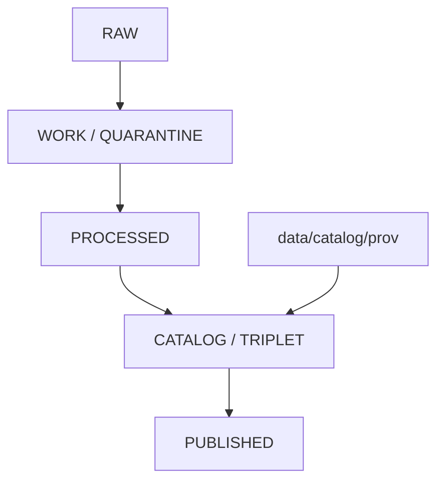

<!-- [KFM_META_BLOCK_V2]
doc_id: kfm://doc/data-catalog-prov-readme
title: data/catalog/prov/ — Governed PROV Catalog Lane
version: v0.2.0
type: readme; data-lifecycle-sublane; catalog-projection-boundary; semantic-provenance-guide; release-gated
status: repository-grounded draft; canonical placement; proposed realization; documentation-bearing; release-gated
owners: NEEDS VERIFICATION — data, catalog, PROV/PAV, evidence, source, rights, sensitivity, policy, validation, release, correction, rollback, schema, standards, and docs stewards
created: NEEDS VERIFICATION — greenfield stub existed before v0.1 expansion
updated: 2026-07-25
policy_label: restricted-review; data-catalog; semantic-provenance; no-direct-public-path; release-gated; metadata-sensitive
current_path: data/catalog/prov/README.md
historical_stub_blob: 54c39b4c67ff97432d745df26d7c08cb87edf78d
prepared_under_prompt: KFM Markdown Engineering, Modernization & GitHub Documentation Implementation Agent
review_packet_id: kfm-data-catalog-prov-readme-20260725
truth_posture: >
  CONFIRMED exact path, current and historical blobs, Directory Rules placement,
  parent catalog boundary, bounded current subtree, Flora child guide, transitional
  data/prov compatibility conflict, draft PROV and supply-chain provenance standards,
  draft CatalogMatrix contract, permissive PROPOSED CatalogMatrix schema, top-level
  NotImplementedError validator, absent schema-declared validator and fixture paths,
  README-only catalog-closure lane, proposed ADR-0022, explicit Hydrology closure
  hold, CODEOWNERS route, and repository-relative link targets / PROPOSED accepted
  PROV-O/PAV application profile, KFM namespace, JSON-LD context, deterministic
  emitters, record realization, Activity-to-RunReceipt resolution, CatalogMatrix
  closure, correction cascade, and enforcement / UNKNOWN active producers,
  consumers, external stores, runtime reads, hosting, caches, released PROV records,
  public effects, and operational rollback / NEEDS VERIFICATION accountable
  stewardship, accepted ADRs, standards-profile convergence, contract/schema/profile
  graduation, rights and sensitivity enforcement, review separation, release
  closure, and public-client exclusion
evidence_snapshot:
  repository: bartytime4life/Kansas-Frontier-Matrix
  base_ref: main
  base_commit: 9f1c88ea73f6ff0341fcfc44d6935bc173dbd6ef
  inventory_baseline_commit: 73214c6a6aa6ac14f729e8c15c00014a1ffdd04f
  prior_blob: 160561e558e13a888b9616d5da4aa22e2968375f
  prior_sha256: 87adb47295299d128034e55c64a6e647a58e032a268bc1d3f8a5dfac80f03d50
  historical_stub_blob: 54c39b4c67ff97432d745df26d7c08cb87edf78d
  method: complete target read; bounded current-tree, standards, contract, schema, validator, fixture, test, workflow, ADR, CODEOWNERS, and doctrine inspection; no PROV payload sampling, source access, runtime, deployment, host-render, external-store, release, or public-client inspection
related:
  - ../README.md
  - ../../README.md
  - ../stac/README.md
  - ../dcat/README.md
  - ../domain/README.md
  - ./flora/README.md
  - ../../prov/README.md
  - ../../triplets/README.md
  - ../../registry/README.md
  - ../../receipts/README.md
  - ../../proofs/README.md
  - ../../rollback/README.md
  - ../../published/README.md
  - ../../../docs/standards/PROV.md
  - ../../../docs/standards/PROV-O.md
  - ../../../docs/standards/PROVENANCE.md
  - ../../../contracts/data/catalog_matrix.md
  - ../../../schemas/contracts/v1/data/catalog_matrix.schema.json
  - ../../../tools/validators/catalog_closure/README.md
  - ../../../tools/validators/validate_catalog_matrix.py
  - ../../../release/README.md
  - ../../../docs/adr/ADR-0011-receipts-vs-proofs-vs-manifests-vs-catalog-separation.md
  - ../../../docs/adr/ADR-0022-catalog-matrix--stac-+-dcat-+-prov-must-agree.md
  - ../../../docs/doctrine/directory-rules.md
  - ../../../.github/workflows/hydrology-proof-slice.yml
  - ../../../.github/CODEOWNERS
tags: [kfm, data, catalog, prov, PROV-O, PAV, semantic-provenance, catalog-stage, STAC, DCAT, CatalogMatrix, EvidenceBundle, SourceDescriptor, RunReceipt, ReleaseManifest, correction, rollback, cite-or-abstain]
notes:
  - "Directory Rules sections 4, 9, and 15 support this catalog-stage placement and README structure."
  - "All v0.1 heading fragments remain available through headings or explicit legacy anchors."
  - "ADR-0022 remains proposed; this README does not accept it or claim STAC/DCAT/PROV closure."
  - "PROV-O is a W3C Recommendation; PAV is a complementary community vocabulary and is not represented as a W3C standard."
  - "Semantic claim provenance and supply-chain/build provenance remain distinct, complementary lanes."
  - "The existing data/prov/ path is transitional compatibility, not parallel catalog authority."
  - "This Markdown-only revision creates no PROV record, namespace, context, contract acceptance, schema graduation, validator behavior, EvidenceBundle, receipt, policy decision, release, publication, public route, correction, or rollback execution."
  - "Static badges project verified documentation posture only; they do not assert validator, CI, security, release, or publication maturity."
[/KFM_META_BLOCK_V2] -->

<a id="top"></a>
<a id="datacatalogprov"></a>
<a id="data-catalog-prov"></a>

# `data/catalog/prov/` — Governed PROV Catalog Lane

> **One-line purpose.** Define the canonical catalog-stage home for KFM semantic-provenance projections while keeping source authority, evidence, process receipts, policy, review, release, correction, rollback, and public delivery independently governed.

[](#status)
[](#record-requirements)
[](#current-bounded-inventory)
[](#status)

> [!IMPORTANT]
> A PROV record can make lineage inspectable. Path placement, vocabulary conformance, a valid shape, a green check, or catalog closure cannot make a claim true, admit a source, resolve evidence, clear rights or sensitivity, approve policy, satisfy review, authorize release, or publish an artifact.

<!-- governance-alert-separator -->

> [!WARNING]
> Provenance metadata can disclose people, private systems, restricted sources, exact or reconstructable locations, embargo state, internal paths, timestamps, signed URLs, and dependency relationships. Public-bound records require minimum-necessary, policy-safe, release-approved representation.

<!-- maturity-alert-separator -->

> [!NOTE]
> The checked lane is documentation-bearing. No direct machine PROV record, accepted application profile, working shared CatalogMatrix validator, dedicated closure fixture family, or released public PROV catalog was established by the reviewed repository evidence.

**Quick navigation:** [Purpose](#purpose) · [Authority](#authority-level) · [Status](#status) · [Belongs](#what-belongs-here) · [Exclusions](#what-does-not-belong-here) · [Inputs](#inputs) · [Outputs](#outputs) · [Validation](#validation) · [Review](#review-burden) · [Related](#related-folders) · [ADRs](#adrs) · [Last reviewed](#last-reviewed) · [Lifecycle](#lifecycle-boundary) · [Repo fit](#repo-fit) · [Requirements](#record-requirements) · [Provenance split](#semantic-and-supply-chain-provenance) · [Closure](#catalogmatrix-and-closure-maturity) · [Guardrails](#prov-guardrails) · [Inventory](#current-bounded-inventory) · [Evidence](#evidence-ledger) · [Rollback](#rollback) · [Open items](#open-verification-register) · [Done](#definition-of-done) · [No-loss](#no-loss-ledger)

## Purpose

`data/catalog/prov/` is the canonical responsibility placement for KFM semantic-provenance catalog projections at the `CATALOG / TRIPLET` lifecycle stage.

Candidate records describe which entities, activities, and agents participate in the lineage of claims, datasets, transforms, catalog artifacts, corrections, withdrawals, and release-linked public-safe products. They may support discovery, lineage inspection, graph closure, interoperability, audit, and correction impact analysis.

This lane is a **catalog carrier**, not a source of truth. It cannot manufacture evidence, admit a source role, validate its own assertions, decide rights or sensitivity, grant policy permission, approve review, authorize release, or publish an artifact.

## Authority level

**Canonical responsibility placement for semantic-provenance catalog projections / repository-grounded draft / concrete profile and realization PROPOSED / not source, evidence, process-receipt, policy, review, release, or publication authority.**

This lane may carry PROV-O/PAV-shaped catalog descriptors and governed references. It cannot replace:

- semantic meaning under [`contracts/`](../../../contracts/README.md);
- machine shape under [`schemas/`](../../../schemas/README.md);
- admissibility under [`policy/`](../../../policy/README.md);
- source identity, role, rights, and sensitivity under [`data/registry/`](../../registry/README.md);
- process memory under [`data/receipts/`](../../receipts/README.md);
- EvidenceBundles and proof support under [`data/proofs/`](../../proofs/README.md);
- release decisions, corrections, withdrawals, and rollback authority under [`release/`](../../../release/README.md); or
- released public-safe carriers under [`data/published/`](../../published/README.md).

The existing [`data/prov/`](../../prov/README.md) lane is transitional compatibility and routing support. It must not evolve into a second PROV catalog authority.

## Status

| Field | Bounded result |
|---|---|
| Path | `data/catalog/prov/README.md` |
| Version | `v0.2.0` |
| Base evidence | `main@9f1c88ea73f6ff0341fcfc44d6935bc173dbd6ef` |
| Prior blob | `160561e558e13a888b9616d5da4aa22e2968375f` (`v0.1`) |
| Historical stub predecessor | `54c39b4c67ff97432d745df26d7c08cb87edf78d` |
| Placement | `CONFIRMED` existing catalog-stage sublane under `data/catalog/` |
| Bounded direct inventory | `README.md`, `flora/README.md`, and `flora/.gitkeep`; no direct machine PROV record was established |
| Concrete PROV application profile | `PROPOSED / NEEDS VERIFICATION` |
| JSON-LD context, profile version, canonical packaging, or accepted KFM namespace | `NOT ESTABLISHED` by the inspected lane |
| Standards routing | `CONFLICTED / NEEDS CONVERGENCE`; overlapping draft profile documents and a misfiled child path exist |
| Shared CatalogMatrix contract | `CONFIRMED draft`; inspectability aid, not proof or release authority |
| Shared CatalogMatrix schema | `CONFIRMED PROPOSED placeholder`; requires only `id` and allows arbitrary additional properties |
| Shared CatalogMatrix validator | `CONFIRMED stub`; top-level entrypoint raises `NotImplementedError` |
| Schema-declared validator and fixture paths | `CONFIRMED absent` at the exact checked paths |
| Dedicated catalog-closure executable, fixture family, tests, or CI gate | `NOT ESTABLISHED`; closure lane is README-only and Hydrology workflow records an explicit hold |
| ADR-0022 agreement rule | `PROPOSED`; not accepted or enforced by this README |
| Active producer, consumer, external store, runtime read, host, cache, or public effect | `UNKNOWN` |
| Released public PROV record or approved PROV release manifest | `NOT ESTABLISHED` by the reviewed evidence |
| Public exposure | `RELEASE-GATED / DENY BY DEFAULT` |
| Accountable stewardship and independent review | `NEEDS VERIFICATION / PENDING` |

Path presence proves placement, not payload maturity. The safe current conclusion is that this is a documentation-bearing catalog sublane with a proposed semantic-provenance role and unverified realization.

<a id="accepted-contents"></a>

## What belongs here

Subject to an accepted profile, contracts, schemas, validators, evidence, policy, review, and release controls, this lane may contain:

| Accepted family | Required posture |
|---|---|
| `prov:Entity` catalog projections | Stable identity, object role, version, digest, source/evidence references, lifecycle, sensitivity, and correction state |
| `prov:Activity` catalog projections | Named producing or transforming operation, immutable inputs/outputs, time bounds, responsible-agent references, and resolvable process-receipt linkage |
| `prov:Agent` and `prov:SoftwareAgent` projections | Minimum-necessary, release-approved identity and role; no unreviewed personal, private, or security-significant detail |
| Qualified PROV relations | Version-pinned semantics and deterministic references without redefining external predicates |
| PAV authoring and versioning terms | Curatorial authorship, creation, curation, version, and update metadata under an accepted subset |
| KFM extension references | Namespaced pointers for evidence, source role, policy, rights, sensitivity, release, correction, and rollback only after namespace/profile acceptance |
| CatalogMatrix and validation references | Immutable pointers to separate matrix descriptors, validation reports, receipts, and release records where they exist |
| Correction, withdrawal, and supersession lineage | Additive history that preserves prior identity, digest, release, and dependency relationships |
| Lane documentation and bounded inventories | README, marker, disposition, migration, and verification material that does not become payload authority |

Records should be deterministic where practical, bounded in scope, correctable, explicit about audience and lifecycle state, and distinguishable as internal candidates, reviewable records, release-linked projections, withdrawn records, or historical records.

<a id="exclusions"></a>

## What does NOT belong here

| Prohibited family | Governed home or action |
|---|---|
| RAW source files | [`data/raw/`](../../raw/README.md) |
| WORK or intermediate data | [`data/work/`](../../work/README.md) |
| Quarantined material | [`data/quarantine/`](../../quarantine/README.md) |
| Processed datasets or candidate payloads | [`data/processed/`](../../processed/README.md) |
| STAC, DCAT, or domain catalog records | Their sibling lanes under [`data/catalog/`](../README.md) |
| Triplets, graph edges, or graph-database snapshots | [`data/triplets/`](../../triplets/README.md); projections are not canonical replacement truth |
| New PROV catalog records in the compatibility lane | Route to this lane; [`data/prov/`](../../prov/README.md) remains transitional |
| SourceDescriptor, source admission, rights, or source-role authority | [`data/registry/`](../../registry/README.md) and governing contracts/policy |
| EvidenceBundle, EvidenceRef resolution index, ProofPack, or validation proof | [`data/proofs/`](../../proofs/README.md) or an accepted evidence/proof lane |
| RunReceipt, CatalogBuildReceipt, review receipt, transform receipt, or supply-chain attestation | [`data/receipts/`](../../receipts/README.md) or an accepted receipt/attestation lane |
| Contract, schema, policy, validator, fixture, test, package, pipeline, or workflow | Its owning responsibility root |
| PolicyDecision, ReviewRecord, ReleaseManifest, PromotionDecision, CorrectionNotice, WithdrawalNotice, or RollbackCard | Governing policy/review/release homes, especially [`release/`](../../../release/README.md) |
| Published layers, reports, stories, downloads, APIs, indexes, tiles, or other public-safe carriers | [`data/published/`](../../published/README.md) after governed release |
| Direct public reads, UI caches, search indexes, AI retrieval corpora, or hosted outputs | Governed interfaces and approved runtime or output stores |
| Supply-chain/build provenance presented as semantic claim provenance | Separate receipt, attestation, signing, and supply-chain provenance lanes |
| Exact sensitive locations or reconstructive metadata | Deny, quarantine, restrict, generalize, aggregate, redact, or embargo under policy and review |
| Credentials, private endpoints, tokens, private keys, signed URLs, or unsafe logs | Approved secret and restricted operational systems |

## Inputs

Future PROV producers should consume governed references, not infer authority from a path, filename, identifier shape, or fluent description:

- stable processed identities, versions, digests, spatial and temporal scope, and domain-object references;
- admitted SourceDescriptor and source-registry references with role, rights, sensitivity, retrieval, and version context;
- EvidenceRef-to-EvidenceBundle resolution for consequential claims;
- RunReceipt, CatalogBuildReceipt, transform, validation, review, correction, and release-support references;
- accepted PROV-O/PAV profiles, JSON-LD contexts, KFM namespace terms, contracts, schemas, policies, and reason-code vocabularies;
- policy-approved public-safe transforms and their receipts;
- sibling STAC, DCAT, domain-catalog, and triplet references where those projections exist; and
- immutable release, correction, withdrawal, supersession, and rollback references.

Unknown identity, source role, evidence, rights, sensitivity, profile, predicate, receipt, review, release, correction, or rollback state must hold the record from public-bound use.

## Outputs

Subject to graduated implementation, this lane may emit or support:

- internal or reviewable semantic-provenance catalog records;
- deterministic provenance indexes and bounded lineage subsets;
- release-linked PROV projections describing approved public-safe artifacts;
- inspectable inputs to proposed STAC/DCAT/PROV agreement checks;
- correction-, withdrawal-, supersession-, and rollback-aware discovery metadata; and
- governed-API or review-tool lookups that resolve released records without direct access to canonical internal stores.

Catalog placement is not publication. Public clients receive only policy-safe, release-approved representations through governed interfaces and released carriers.

<a id="validation-checklist"></a>

## Validation

Validation has three distinct scopes. A pass in one scope does not imply a pass in another.

| Scope | Current posture | What a pass could establish | What it cannot establish |
|---|---|---|---|
| README/documentation QA | Executable for this change | Markdown structure, metadata shape, links, anchors, tables, fences, Mermaid syntax, and no-loss preservation | PROV record validity, catalog closure, rights, policy, review, release, or publication |
| Individual PROV record validation | `NOT ESTABLISHED` | Shape and profile conformance for an exact record under an accepted version | Cross-record agreement, evidence truth, policy permission, or release |
| Catalog closure and promotion readiness | `HELD / NOT ESTABLISHED` | Agreement and dependency readiness for an exact declared packet | Truth, independent review, release approval, deployment, or publication |

### Current executable evidence

| Surface | Verified state | Consequence |
|---|---|---|
| `schemas/contracts/v1/data/catalog_matrix.schema.json` | PROPOSED placeholder; `id` only; `additionalProperties: true` | Cannot prove the semantic contract or STAC/DCAT/PROV closure |
| `tools/validators/validate_catalog_matrix.py` | Raises `NotImplementedError` | Not accepted validation |
| Schema-declared `tools/validators/data/validate_catalog_matrix.py` | Absent at exact path | Metadata/path drift remains unresolved |
| Schema-declared `fixtures/data/catalog_matrix/` | Absent at exact path | No shared positive/negative fixture family is established |
| `tools/validators/catalog_closure/` | README-only in bounded inventory | No direct closure executable is claimed |
| Shared validator aggregate | Excludes the CatalogMatrix stub | A green validator-suite run does not cover this lane |
| `hydrology-proof-slice` CatalogMatrix step | Explicit workflow hold | The workflow detects unimplemented readiness; it does not validate closure |

### Proposed record acceptance sequence

1. **Parse and canonicalize** under a pinned profile and context without network retrieval.
2. **Validate identity, class, predicates, time, digest, and version** against accepted contracts and schemas.
3. **Resolve source and evidence references** to admitted, immutable objects.
4. **Resolve process-receipt and responsible-agent links** without treating a receipt as proof of truth.
5. **Apply rights, sensitivity, privacy, source-role, and metadata-exposure policy** with finite outcomes.
6. **Cross-check STAC, DCAT, PROV, domain catalog, and artifact identity** only under an accepted closure profile.
7. **Verify review, release, correction, withdrawal, and rollback references** for public-bound records.
8. **Emit a separate validation result**; the candidate record must not certify itself.

### Finite outcome posture

| Outcome | Meaning |
|---|---|
| `PASS` | The exact declared checks passed for the exact inputs; not release approval |
| `HOLD` | Required maturity, review, dependency, or authority is incomplete |
| `DENY` | Policy or an explicit prohibition blocks the requested use |
| `ABSTAIN` | Evidence is insufficient to make the requested determination |
| `ERROR` | Validation could not complete reliably; never convert to pass |

Missing or conflicting identity, digest, release, source, evidence, rights, sensitivity, receipt, review, correction, withdrawal, rollback, profile, namespace, or predicate support must not produce an implicit pass.

## Review burden

The repository [`CODEOWNERS`](../../../.github/CODEOWNERS) default route names `@bartytime4life`; that route is `CONFIRMED` for review request delivery only. It is not a StewardshipAssignment, ReviewRecord, PolicyDecision, separation-of-duties proof, release approval, or evidence that review occurred.

Accountable role assignments remain **NEEDS VERIFICATION**. Review should include the responsibilities affected by the change:

| Change class | Minimum review concerns |
|---|---|
| README, inventory, or link correction | Data/catalog/provenance documentation and no-loss review |
| Predicate, profile, namespace, or context change | Standards, contract, schema, interoperability, migration, and ADR review |
| Record producer, validator, or fixture graduation | Implementation, security, deterministic/no-network validation, negative fixtures, and CI review |
| Agent, source, rights, sensitivity, or public metadata change | Privacy, source, rights, sensitivity, and policy review |
| Closure, release, correction, withdrawal, or rollback change | Evidence/proof, independent review, release, correction, and rollback review |

The author must not treat a self-generated record, receipt, check, pull request, or badge as independent approval.

## Related folders

| Responsibility | Link | Boundary |
|---|---|---|
| Parent catalog stage | [`data/catalog/`](../README.md) | Owns governed catalog projections; placement is not publication |
| Parent data lifecycle | [`data/`](../../README.md) | Owns lifecycle lanes and trust-support siblings |
| STAC catalog | [`data/catalog/stac/`](../stac/README.md) | Spatiotemporal asset discovery projection |
| DCAT catalog | [`data/catalog/dcat/`](../dcat/README.md) | Dataset and distribution interoperability projection |
| Domain catalog | [`data/catalog/domain/`](../domain/README.md) | Domain-scoped catalog projection |
| Flora PROV child | [`data/catalog/prov/flora/`](flora/README.md) | Current documentation-bearing domain child |
| Compatibility conflict | [`data/prov/`](../../prov/README.md) | Transitional routing surface; no new catalog authority |
| Triplet projection | [`data/triplets/`](../../triplets/README.md) | Graph-compatible relationships; not canonical replacement truth |
| Source registry | [`data/registry/`](../../registry/README.md) | Source identity, role, rights, sensitivity, and registry authority |
| Process receipts | [`data/receipts/`](../../receipts/README.md) | Process memory; not truth or release proof by itself |
| Evidence and proofs | [`data/proofs/`](../../proofs/README.md) | EvidenceBundle, ProofPack, validation, and citation support |
| Rollback data support | [`data/rollback/`](../../rollback/README.md) | Data-plane rollback support; release authority remains separate |
| Published artifacts | [`data/published/`](../../published/README.md) | Released public-safe outputs |
| Semantic contracts | [`contracts/`](../../../contracts/README.md) | Object meaning |
| Machine schemas | [`schemas/`](../../../schemas/README.md) | Machine-checkable shape |
| Policy | [`policy/`](../../../policy/README.md) | Admissibility and finite decisions |
| Validators | [`tools/validators/`](../../../tools/validators/README.md) | Deterministic checks; no truth or release authority |
| Release governance | [`release/`](../../../release/README.md) | Promotion, manifests, review, correction, withdrawal, rollback |
| Semantic provenance standard | [`docs/standards/PROV.md`](../../../docs/standards/PROV.md) | Draft KFM PROV-O/PAV guidance; realization remains proposed |
| Overlapping PROV profile | [`docs/standards/PROV-O.md`](../../../docs/standards/PROV-O.md) | Overlap requires standards-profile convergence |
| Supply-chain provenance standard | [`docs/standards/PROVENANCE.md`](../../../docs/standards/PROVENANCE.md) | Build/material/signature provenance; distinct from semantic provenance |
| CatalogMatrix contract | [`contracts/data/catalog_matrix.md`](../../../contracts/data/catalog_matrix.md) | Draft semantic meaning; not evidence or release authority |
| CatalogMatrix schema | [`schemas/contracts/v1/data/catalog_matrix.schema.json`](../../../schemas/contracts/v1/data/catalog_matrix.schema.json) | Current permissive PROPOSED placeholder |
| Closure validator boundary | [`tools/validators/catalog_closure/`](../../../tools/validators/catalog_closure/README.md) | README-only readiness boundary in checked inventory |
| Directory Rules | [`docs/doctrine/directory-rules.md`](../../../docs/doctrine/directory-rules.md) | Placement and README contract |

## ADRs

| Decision record | Current checked status | Effect on this README |
|---|---|---|
| [`ADR-0011`](../../../docs/adr/ADR-0011-receipts-vs-proofs-vs-manifests-vs-catalog-separation.md) | `PROPOSED` | Supports separation concerns but does not settle every CatalogMatrix instance/home conflict |
| [`ADR-0022`](../../../docs/adr/ADR-0022-catalog-matrix--stac-+-dcat-+-prov-must-agree.md) | `PROPOSED` | Proposes identity, digest, and release-reference agreement; not accepted enforcement |

This README accepts neither ADR, changes no ADR status, and creates no architecture decision. An accepted ADR plus migration, fixtures, validation, correction, and rollback evidence is required before:

- pinning a canonical KFM namespace or application-profile version;
- resolving overlapping PROV standards/profile documents;
- graduating CatalogMatrix placement, meaning, or enforcement;
- retiring or redirecting `data/prov/`;
- introducing a new canonical schema, contract, policy, receipt, proof, source, release, or publication home; or
- changing the meaning of an existing provenance identity or relation.

## Last reviewed

- **Date:** 2026-07-25
- **Repository base:** `main@9f1c88ea73f6ff0341fcfc44d6935bc173dbd6ef`
- **Target baseline:** blob `160561e558e13a888b9616d5da4aa22e2968375f`
- **Inventory method:** complete target read; bounded tree at `73214c6a6...`; comparison through current base; exact governing-neighbor and remote-path reads
- **Doctrine method:** Directory Rules PDF text extraction plus visual verification; bounded KFM pipeline, greenfield, implementation-reference, and architecture evidence review
- **Not inspected:** PROV payload samples, source systems, external stores, runtime, deployment, host rendering, public routes, caches, production metrics, release operations, or rollback execution
- **Owners, independent review, profile acceptance, release state, and operational behavior:** needs verification

Re-review on authority, topology, standards-profile, namespace, context, schema, contract, producer, consumer, policy, workflow, release, public-client, correction, withdrawal, or rollback change—or within six months.

<a id="lifecycle-boundary"></a>

## Lifecycle boundary


```mermaid
flowchart TB
  RAW["RAW"] --> WQ["WORK / QUARANTINE"]
  WQ --> PROCESSED["PROCESSED"]
  PROCESSED --> CATALOG["CATALOG / TRIPLET"]
  CATALOG --> PUBLISHED["PUBLISHED"]
  PROV["data/catalog/prov"] --> CATALOG
```

`data/catalog/prov/` occupies the CATALOG side of the lifecycle. Promotion remains a governed state transition, not a file move and not a side effect of serializing RDF or JSON-LD.

| Stage | Relationship to this lane |
|---|---|
| RAW | Source-edge capture; never a PROV catalog record merely because it carries retrieval metadata |
| WORK / QUARANTINE | Candidate lineage, unresolved mappings, failures, rights/sensitivity holds, and remediation |
| PROCESSED | Validated canonical records that may supply identities and digests to catalog builders |
| CATALOG / TRIPLET | This lane's intended phase; semantic-provenance projection remains subordinate to canonical records and evidence |
| PUBLISHED | Separate released public-safe artifacts after validation, policy, review, proof, manifest, correction, and rollback closure |

Workers, watchers, models, and source connectors may produce candidates or receipts. They must not use this path to authorize their own promotion, publication, or correction.

<a id="repo-fit"></a>

## Repo fit

Directory Rules classify responsibility before topic. The same word "provenance" appears in several roots because each owns a different object family.

| Responsibility | Canonical or bounded home | Anti-collapse rule |
|---|---|---|
| Semantic PROV catalog records | `data/catalog/prov/` | This lane; catalog carrier only |
| Transitional provenance routing | `data/prov/` | Compatibility only; freeze new trust-bearing payloads pending migration decision |
| STAC, DCAT, and domain catalog records | Their sibling `data/catalog/` lanes | Do not copy record families here |
| Graph/triplet projection | `data/triplets/` | Derived relationship view; not canonical truth |
| Source identity and admission | `data/registry/` plus contracts/policy | PROV reference does not admit a source |
| Evidence and proof | `data/proofs/` | Provenance is not EvidenceBundle or ProofPack closure |
| Process and build receipts | `data/receipts/` | Receipt is process memory, not truth or release approval |
| Supply-chain attestations | Accepted signing/attestation and receipt lanes | Do not collapse into semantic PROV claims |
| Policy and review decisions | `policy/` and accepted review/release homes | PROV may reference decisions; it cannot make them |
| Release, correction, withdrawal, rollback | `release/` plus supporting data lanes | Catalog lineage describes state; release authority changes state |
| Public-safe artifacts | `data/published/` and governed APIs | No direct public use of internal candidate catalog records |

### Compatibility conflict

[`data/prov/`](../../prov/README.md) explicitly identifies itself as a transitional routing surface and records a conflict with `data/catalog/prov/`. The safe posture is:

1. do not add new trust-bearing catalog payloads to the compatibility lane;
2. inventory any payloads, writers, consumers, external references, and retention obligations;
3. classify each object by responsibility;
4. accept an ADR and migration/rollback plan before moving or redirecting anything;
5. preserve stable identities, digests, references, correction lineage, and historical resolution; and
6. test cutover and stale-reference detection before tombstoning or retiring compatibility paths.

This README performs none of those migration steps.

<a id="record-requirements"></a>

## Record requirements

The following are **proposed acceptance requirements**, not claims that a schema or validator currently enforces them.

| Requirement | Proposed meaning | Current maturity |
|---|---|---|
| Stable identifier | Resolves to the same claim, dataset, artifact, activity, or agent identity used by sibling catalog and release records | Profile not accepted |
| PROV class | Declares `prov:Entity`, `prov:Activity`, `prov:Agent`, `prov:SoftwareAgent`, or accepted qualified relation | Profile not accepted |
| External predicate stability | Keeps PROV-O and PAV IRIs and meanings intact; no KFM alias redefines them | Doctrine documented; executable enforcement not established |
| KFM extension namespace | Uses a version-pinned, accepted KFM namespace for KFM-only references | Namespace IRI/version unresolved |
| Source reference | Resolves to admitted source identity and role when source authority matters | End-to-end resolution not established |
| Evidence reference | Resolves consequential claims to EvidenceBundle/proof context | End-to-end resolution not established |
| Activity receipt reference | Resolves producing/transformation activity to RunReceipt or accepted process memory | Round-trip enforcement not established |
| Agent minimization | Exposes only release-approved identity/role needed for accountability and interoperability | Policy enforcement not established |
| Temporal context | Distinguishes activity time, record/update time, source time, valid time, and release time where applicable | Profile not accepted |
| Artifact digest | Uses an algorithm-qualified digest for the exact represented bytes | Cross-record enforcement not established |
| Rights and sensitivity | Carries governed references/outcomes without leaking restricted content | Policy enforcement not established |
| Release reference | Public-bound record points to immutable release governance and rollback/correction context | No released PROV record established |
| Closure compatibility | Agrees with applicable STAC, DCAT, domain, artifact, and release identity under an accepted profile | ADR and validator held |
| Correction lineage | Preserves superseded, corrected, withdrawn, and rollback relationships without silent deletion | Operational behavior unknown |

### Core PROV-O relations

External PROV-O predicates retain their standard meaning. Candidate KFM use includes:

| Relation | Direction | Candidate KFM use |
|---|---|---|
| `prov:used` | Activity → Entity | Records immutable input entities consumed by an activity |
| `prov:wasGeneratedBy` | Entity → Activity | Links a claim or artifact entity to its producing activity |
| `prov:wasDerivedFrom` | Entity → Entity | Records derivation between source and transformed entities |
| `prov:wasAssociatedWith` | Activity → Agent | Links an activity to a responsible human, organization, system, or software agent |
| `prov:wasAttributedTo` | Entity → Agent | Records attribution without replacing review or release authority |
| `prov:qualifiedGeneration` | Entity → Generation | Carries role/time/plan detail when a simple relation is insufficient |

The table documents intended semantics; it does not prove a required minimum set, a shipped context, or executable enforcement.

## Semantic and supply-chain provenance

KFM uses two complementary provenance lanes that answer different questions.

| Lane | Primary question | Typical vocabulary/object | Must not become |
|---|---|---|---|
| Semantic claim/artifact provenance | Which entities, activities, and agents explain this claim or catalog artifact? | PROV-O, PAV, KFM extension references | Build attestation, source admission, evidence truth, policy, or release authority |
| Supply-chain/build provenance | Which materials, builder identity, tools, environment, signatures, and steps produced these exact bytes? | RunReceipt, SLSA/in-toto, DSSE, signing/attestation records | Semantic proof that the underlying claim is true |

Both may resolve to shared identities, digests, receipts, EvidenceBundles, and release references. Neither substitutes for the other, and neither can self-authorize publication.

### Standards-profile conflict register

The checked repository contains overlapping or inconsistent standards-routing surfaces:

- [`docs/standards/PROV.md`](../../../docs/standards/PROV.md) describes semantic PROV-O/PAV use;
- [`docs/standards/PROV-O.md`](../../../docs/standards/PROV-O.md) overlaps that application-profile role;
- [`docs/standards/PROVENANCE.md`](../../../docs/standards/PROVENANCE.md) describes supply-chain/build provenance;
- the standards index contains older profile-routing assumptions; and
- `docs/standards/PROV/README.md` contains an unrelated DUO profile despite its path.

This README does not appoint a winner, move a document, redefine a standard, or create an alias. Standards stewards should reconcile authority, stable links, supersession, migration, and rollback through a scoped decision.

### Vocabulary precision

- **PROV-O** is the W3C Provenance Ontology.
- **PAV** is a complementary community vocabulary for provenance, authoring, and versioning; it is not described here as a W3C standard.
- `prov:` and `pav:` predicates retain external namespace identity and semantics.
- A `kfm:` or other KFM extension namespace must not be treated as pinned until its IRI, version, governance, compatibility, and migration posture are accepted.

## CatalogMatrix and closure maturity

The proposed closure model separates four states:

```text
record validity != cross-record agreement != policy permission != release approval
```

| Surface | Responsibility | Checked maturity |
|---|---|---|
| PROV/STAC/DCAT record | Standards-facing description of an exact catalog entity | Concrete shared PROV profile not established |
| CatalogMatrix descriptor | Declared cross-record agreement scope and expected identity/digest/release references | Draft semantic contract; permissive PROPOSED schema |
| Validation report or proof | Separate result describing checks, inputs, outcomes, and tool identity | Dedicated shared closure result not established |
| Policy/review/release decision | Governs admissibility, approval, correction, rollback, and exposure | Separate authority; no public PROV release established |

[`ADR-0022`](../../../docs/adr/ADR-0022-catalog-matrix--stac-+-dcat-+-prov-must-agree.md) proposes that applicable STAC, DCAT, PROV, canonical artifact, digest, and release references agree before promotion. It is still proposed. The current repository evidence does not establish:

- an accepted shared CatalogMatrix profile;
- a restrictive production schema;
- the schema-declared shared validator;
- meaningful shared positive and negative fixtures;
- a working catalog-closure resolver;
- dedicated shared closure tests;
- required CI admission;
- mutually consistent emitted records; or
- release-gate adoption.

The Hydrology proof-slice workflow detects the known unimplemented state and records a hold. That hold is readiness evidence, not working closure.

<a id="prov-guardrails"></a>

## PROV guardrails

1. **Provenance is not source truth.** A lineage edge does not prove the source, claim, or artifact is authoritative.
2. **Catalog is not publication.** A record remains internal or held until separate release evidence authorizes exposure.
3. **Profiles do not self-enforce.** A standards document or JSON-LD context is not a validator.
4. **Validators do not self-authorize.** A pass is scoped technical evidence, not policy, review, release, or publication approval.
5. **External predicates stay external.** Do not rename, redefine, or mint KFM equivalents for PROV-O/PAV terms.
6. **KFM extensions require governance.** Do not invent stable-looking extension fields or IRIs before namespace/profile acceptance.
7. **Receipts and proofs stay separate.** Process memory does not become evidence truth; proof does not become release authority.
8. **STAC/DCAT/PROV agreement is conditional and proposed.** Do not claim closure without exact records, digests, release references, a graduated validator, and separate results.
9. **Workers do not publish.** Connectors, watchers, pipelines, and AI may propose candidates or emit receipts; they cannot authorize catalog promotion or publication.
10. **Missing support fails closed.** Unresolved identity, evidence, source, rights, sensitivity, review, release, correction, or rollback state produces hold, deny, abstain, or error.
11. **Corrections remain additive.** Do not silently overwrite or delete prior lineage; preserve supersession, withdrawal, and rollback references.
12. **Public clients use governed interfaces.** No normal UI, AI, search, or API path should read unreviewed internal catalog candidates directly.

### Metadata leakage controls

Public-safe review must consider more than coordinate fields.

| Leakage surface | Risk | Required posture |
|---|---|---|
| Entity IDs and source links | May encode exact sites, people, accession numbers, or restricted systems | Use release-approved opaque or generalized identifiers where needed |
| Agent names and accounts | May expose living persons, internal identities, or security roles | Minimum necessary; policy/review required |
| Activity timestamps and cadence | May reveal embargo windows, private operations, or sensitive collection events | Generalize, delay, restrict, or omit when required |
| File paths, hosts, endpoints, and signed URLs | May disclose infrastructure or grant access | Never expose secrets/private endpoints; signed URLs require governed delivery |
| Derivation and association edges | May reconstruct protected relationships or exact locality through joins | Evaluate join sensitivity and downstream inference |
| Labels, descriptions, and error text | May carry source payloads or restricted detail | Redact and test public-safe summaries |
| Correction and withdrawal reasons | May reveal the sensitive fact being protected | Use bounded reason codes and restricted detail channels |

## Current bounded inventory

The checked direct subtree at the inventory baseline contained:

```text
data/catalog/prov/
├── README.md
└── flora/
    ├── .gitkeep
    └── README.md
```

The comparison from `73214c6a6...` through the current base changed only the Flora child README within this subtree. No emitted `*.prov.json` record was established in the checked catalog inventory.

| Item | Status | Consequence |
|---|---|---|
| Parent README | `CONFIRMED` | Defines this responsibility boundary only |
| Flora marker | `CONFIRMED` | Preserves an empty lane; marker is not data |
| Flora README | `CONFIRMED v0.2.0` | Domain guidance; not a Flora PROV payload or release |
| Other domain children | `NOT ESTABLISHED` in the bounded direct inventory | Do not invent paths or imply retirement |
| Direct machine PROV records | `NOT ESTABLISHED` | No record-level validity, closure, or release claim |
| External or generated PROV stores | `UNKNOWN` | No absence claim beyond checked repository evidence |
| Active writers and consumers | `UNKNOWN` | No operational route or migration claim |

Bounded absence does not prove that historical, ignored, generated, branch-local, package-local, external, or dynamically produced records never existed. It narrows the current repository claim.

<a id="evidence-ledger"></a>

## Evidence ledger

| Evidence | Status | Supports | Limits |
|---|---|---|---|
| Current and prior target blobs | `CONFIRMED` | Stable identity, lineage, v0.1 content, and no-loss baseline | Documentation only |
| Directory Rules PDF and repo Markdown | `CONFIRMED doctrine` | `data/catalog/prov/` placement, lifecycle, authority split, and README contract | Does not prove implementation |
| Parent [`data/catalog/README.md`](../README.md) | `CONFIRMED` | Catalog-stage and no-direct-public-path boundary | Does not prove PROV records |
| Bounded tree plus base comparison | `CONFIRMED` | Direct documentation/marker inventory and no intervening payload change in this subtree | Does not inspect external stores or runtime generation |
| Flora child README | `CONFIRMED guidance` | Existing domain child, release/sensitivity boundaries | Does not prove Flora payloads or closure |
| [`data/prov/README.md`](../../prov/README.md) | `CONFIRMED compatibility conflict` | Transitional routing and no-parallel-authority posture | Recursive payloads and consumers remain unknown |
| PROV standards documents | `CONFIRMED draft documents / conflicted routing` | PROV-O/PAV concepts, predicate stability, semantic/build split | Accepted profile, context, namespace, and enforcement not established |
| CatalogMatrix contract | `CONFIRMED draft` | Matrix as inspectability aid and separation from proof/release | Final semantics and acceptance not established |
| CatalogMatrix schema | `CONFIRMED PROPOSED placeholder` | Current machine metadata and permissive shape | Cannot prove contract meaning or closure |
| CatalogMatrix validator and closure README | `CONFIRMED stub / README-only` | Explicit implementation hold | No working shared closure |
| ADR-0011 and ADR-0022 | `CONFIRMED proposed records` | Proposed separation and agreement direction | Neither is accepted by this README |
| Hydrology proof-slice workflow | `CONFIRMED explicit hold` | CI detects unimplemented CatalogMatrix readiness | Domain hold is not shared implementation |
| CODEOWNERS | `CONFIRMED route` | Default GitHub review-request routing | Not stewardship assignment or approval |
| Supplied KFM pipeline, greenfield, and implementation references | `CONFIRMED supplied doctrine/design evidence` | Derived-emission, proof-before-catalog, catalog/proof/release separation | Named implementations remain proposed until repository-verified |

## Rollback

Rollback has three different meanings and must not be collapsed.

### Documentation rollback

If this Markdown modernization is wrong, revert only this file to prior blob:

```text
160561e558e13a888b9616d5da4aa22e2968375f
```

The historical pre-expansion stub remains:

```text
54c39b4c67ff97432d745df26d7c08cb87edf78d
```

The historical blob is lineage evidence, not the preferred rollback target for this revision.

### Catalog correction or withdrawal

A released PROV record should be corrected, superseded, or withdrawn through governed additive records that preserve:

- affected record identity and digest;
- prior and replacement release references;
- reason code and review authority;
- affected STAC, DCAT, domain, triplet, evidence, receipt, and published dependencies;
- cache/index invalidation requirements; and
- rollback target.

The governing CorrectionNotice, WithdrawalNotice, or RollbackCard remains under release authority, not in this lane.

### Operational rollback

Operational rollback is **UNKNOWN / NEEDS VERIFICATION**. No observed drill established producer disablement, alias reversion, graph/index repair, cache invalidation, public correction propagation, or restoration time.

Rollback is required if this lane becomes a source-data root, proof store, source-registry root, receipt/attestation store, policy/review-decision root, release root, published-output root, schema root, validator root, implementation root, direct public path, or parallel authority.

## Open verification register

| Item | Status | Required evidence |
|---|---|---|
| Accountable owners and independent reviewers | `NEEDS VERIFICATION` | Stewardship assignments, risk-class review rules, and separation-of-duties evidence |
| Direct and external payload inventory | `NEEDS VERIFICATION` | Pinned recursive tree, generated/LFS/object-store inventory, retention, rights, sensitivity |
| Writers and consumers | `UNKNOWN` | Pipeline, package, tool, runtime, API/UI, workflow, and deployment inventory |
| Canonical PROV application profile | `PROPOSED` | Accepted profile/version, minimum/optional relations, packaging, migration, deprecation |
| JSON-LD context and offline resolution | `NEEDS VERIFICATION` | Pinned context, digest, vendoring, no-network behavior, compatibility tests |
| KFM namespace | `OPEN / NEEDS ADR` | Canonical IRI, versioning, prefix, extension governance, old-to-new mapping |
| Standards-document convergence | `CONFLICTED` | Authority/supersession decision, corrected indexes and paths, stable redirects/links |
| Contracts and schemas | `NEEDS VERIFICATION` | Accepted semantic contract, restrictive schemas, version rules, fixtures |
| Individual PROV validator | `NOT ESTABLISHED` | Deterministic executable, finite outcomes/reason codes, resource limits, no-network tests |
| Activity-to-RunReceipt round trip | `NOT ESTABLISHED` | Resolver, positive/negative fixtures, stale/missing/conflict behavior |
| CatalogMatrix and closure validator | `HELD` | Accepted home/contract/schema, resolver, fixtures, tests, report, CI adoption |
| Source/evidence/rights/sensitivity policy | `NOT ESTABLISHED end to end` | Resolvers, policy bundle, obligations, public-safe transforms, negative cases |
| Correction, withdrawal, and dependency cascade | `UNKNOWN` | Schemas, impact resolver, notices, cache/index propagation, drills |
| Release and public-client behavior | `UNKNOWN` | Approved manifest, governed route, access policy, hosting, cache, observability |
| Operational rollback | `UNKNOWN` | Tested rollback card, alias/index/cache restoration, recovery evidence |

Unknowns narrow claims and block higher-risk transitions; they do not invite plausible defaults.

## Definition of done

This README is documentation-complete for the checked snapshot when:

- the first twelve H2 sections retain the Directory Rules order;
- the stable `doc_id`, canonical path, original stub lineage, legacy fragments, and substantive v0.1 concepts remain;
- all repository-relative links and internal anchors resolve;
- current inventory, ADR status, standards conflict, schema permissiveness, validator stub, missing paths, and workflow hold are reported accurately;
- no prose implies accepted profiles, working closure, released PROV records, public access, or operational rollback;
- Markdown, tables, fences, Mermaid, metadata, whitespace, and no-loss checks pass; and
- the diff changes only this README on a review branch.

The lane is **implementation-complete** only after separate, reviewable work establishes:

1. accepted standards/profile and namespace decisions;
2. semantic contracts and restrictive versioned schemas;
3. deterministic no-network emitters and validators;
4. meaningful positive, negative, conflict, leakage, correction, and rollback fixtures;
5. source/evidence/receipt/policy/review/release resolvers;
6. accepted CatalogMatrix and separate validation-result semantics;
7. CI admission with finite outcomes and explicit holds;
8. generated records derived from governed inputs rather than hand-authored promotion shortcuts;
9. reviewed release, correction, withdrawal, and rollback closure; and
10. governed public-client behavior with observed tests and operations.

README completion must not be represented as implementation completion.

## No-loss ledger

| Prior element | Disposition |
|---|---|
| Stable `doc_id` and canonical path | Preserved |
| Historical H1 identity and `top` fragment | Preserved with explicit aliases |
| `purpose` fragment | Preserved |
| `lifecycle-boundary` fragment and lifecycle invariant | Preserved and expanded |
| `repo-fit` fragment and responsibility split | Preserved and grounded |
| `accepted-contents` fragment and Entity/Activity/Agent/PAV families | Preserved through explicit legacy anchor |
| `exclusions` fragment and full anti-collapse list | Preserved and expanded |
| `record-requirements` fragment | Preserved; maturity labels corrected |
| `prov-guardrails` fragment | Preserved and strengthened |
| `evidence-ledger` fragment | Preserved; stale claims replaced with current evidence |
| `validation-checklist` fragment | Preserved through explicit legacy anchor; converted to scoped validation contract |
| `rollback` fragment and historical stub SHA | Preserved; documentation and operational rollback separated |
| Catalog discovery, lineage inspection, graph closure, and interoperability purpose | Preserved without implying emitted records |
| EvidenceBundle, SourceDescriptor, RunReceipt, PolicyDecision, ReleaseManifest, CatalogBuildReceipt, correction, withdrawal, and rollback boundaries | Preserved |
| Semantic versus supply-chain provenance distinction | Preserved and clarified |
| Fail-closed and unreleased-is-not-public posture | Preserved and strengthened |
| ADR-0022 agreement concept | Preserved as proposed; false requirement/acceptance implication removed |
| Payload, schema, contract, policy, validator, workflow, release, migration, or public-state change | None |

### Change history

#### v0.2.0 — 2026-07-25

- normalized the README to the Directory Rules ordered contract;
- pinned current repository evidence and direct inventory;
- preserved stable identity, legacy anchors, prior concepts, and historical rollback lineage;
- corrected ADR-0022, CatalogMatrix, validator, namespace, PAV, and implementation maturity claims;
- added the `data/prov/` compatibility conflict, standards-routing conflict, metadata-leakage controls, validation scope, correction/withdrawal model, open verification register, and definition of done; and
- changed Markdown only.

#### v0.1 — 2026-06-25

- expanded the original greenfield stub into a proposed PROV catalog-sublane guide;
- established the initial Entity/Activity/Agent, lifecycle, evidence, closure, and rollback concepts.

[Back to top](#top)
