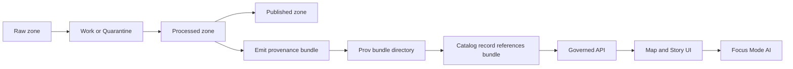

<!-- [KFM_META_BLOCK_V2]
doc_id: kfm://doc/99e92d7a-a669-40f6-ba69-2e65269ea5d1
title: Provenance Bundles
type: standard
version: v1
status: draft
owners: TBD
created: 2026-02-24
updated: 2026-02-24
policy_label: restricted
related:
  - kfm://doc/README-root (TODO)
  - kfm://doc/catalog-provenance (TODO)
tags: [kfm, catalog, provenance, bundles]
notes:
  - Default-deny: treat bundle contents as restricted unless a specific policy label says otherwise.
  - Bundles are immutable evidence packages: update by creating a new bundle, never by editing in place.
[/KFM_META_BLOCK_V2] -->

# Provenance Bundles

Immutable, reviewable **evidence packages** that back every promoted dataset/API/UI claim with traceable provenance.


**Quick links:**
[Purpose](#purpose) ·
[Where this fits](#where-this-fits-in-the-kfm-system) ·
[Directory contract](#directory-contract) ·
[Bundle anatomy](#bundle-anatomy) ·
[Naming and immutability](#naming-and-immutability) ·
[Creating a new bundle](#creating-a-new-bundle) ·
[Promotion gate checklist](#promotion-gate-checklist) ·
[Security and redaction](#security-and-redaction) ·
[FAQ](#faq)

---

## Purpose

A **provenance bundle** is the smallest self-contained package that lets a reviewer (or CI gate) answer:

- **What** data changed (inputs/outputs, schema, extents)
- **How** it changed (pipelines/transforms/tool versions)
- **Why** it changed (ticket/decision/policy rationale)
- **Whether** it is eligible for promotion (validation results + thresholds)
- **Who** approved it (humans and/or automated gates)

These bundles are designed to be referenced by:

- dataset catalog entries
- governed APIs (for auditability)
- Map/Story UI claims
- Focus Mode reasoning (evidence-bound retrieval)

> **WARNING**
> Bundles are part of the trust membrane. If something can’t be traced to a bundle (or an equivalent evidence record), it should not be promoted.

[Back to top](#provenance-bundles)

---

## Where this fits in the KFM system



Key idea: **promotion requires evidence**. Bundles are that evidence, stored alongside the catalog so that “what we claim” stays close to “what we can prove.”

[Back to top](#provenance-bundles)

---

## Directory contract

### Where it fits in the repo

This directory lives under:

- `data/catalog/` — catalog and registry layer (human and machine readable)
- `data/catalog/prov/` — provenance and audit layer
- `data/catalog/prov/bundles/` — **bundle instances** (immutable, versioned)

> **NOTE**
> If your repo uses different roots (e.g., `catalog/` or `registry/`), keep this README but adjust the paths.

### Acceptable inputs

Only commit **evidence artifacts** that support traceability and promotion gates:

- `manifest.yaml` (bundle identity + required metadata)
- checksums / content integrity outputs
- pipeline run receipts (inputs, parameters, tool versions)
- validation/QA summaries (with thresholds + pass/fail)
- policy decisions and redaction notes
- small, reviewable “explainers” (plots, CSV summaries, HTML reports) *when policy allows*

### Exclusions

Do **not** commit:

- raw sensitive data extracts (PII, precise vulnerable-site coordinates, restricted cultural knowledge)
- secrets (tokens, keys, connection strings)
- large binary blobs unless explicitly approved (store externally and reference via immutable URI)
- “mystery meat” outputs with no manifest/checksums

If you’re unsure, default to **redact/generalize** and mark **needs governance review**.

[Back to top](#provenance-bundles)

---

## Bundle anatomy

A bundle is typically a **directory named by `bundle_id`**.

### Recommended directory tree

> This is a *recommended* structure. Your pipeline may generate a subset, but the **manifest + checksums + receipt + validation** are the usual minimum.

```text
data/catalog/prov/bundles/
  README.md
  _index.json                       # optional: machine-friendly list of bundles
  <bundle_id>/
    manifest.yaml                   # REQUIRED
    checksums/
      sha256.txt                    # REQUIRED (or equivalent)
    receipts/
      pipeline-run.json             # REQUIRED (or equivalent)
    lineage/
      lineage.json                  # recommended
    qa/
      qa-summary.json               # REQUIRED for promotion
      qa-details/                   # optional
    policy/
      decision.yaml                 # REQUIRED when policy decisions were made
      redaction-notes.md            # recommended when redaction is applied
    artifacts/
      README.md                     # optional: explain artifacts
      preview.png                   # optional
```

### Minimal manifest schema

Store this as `manifest.yaml`.

```yaml
bundle_id: "<bundle_id>"
created: "YYYY-MM-DDTHH:MM:SSZ"
created_by: "<service-account-or-human>"

# What this bundle is about
subject:
  kind: dataset
  dataset_id: "<catalog-dataset-id>"           # preferred stable identifier
  dataset_slug: "<short-name>"                # optional
  zone_from: "raw|work|processed"
  zone_to: "work|processed|published"

# Inputs/outputs for reproducibility
inputs:
  - uri: "<immutable-input-uri>"
    checksum_sha256: "<sha256>"
outputs:
  - uri: "<immutable-output-uri>"
    checksum_sha256: "<sha256>"

# How it was produced
pipeline:
  name: "<pipeline-name>"
  version: "<git-sha-or-semver>"
  run_id: "<run-id>"
  parameters_ref: "receipts/pipeline-run.json"
  tool_versions:
    - name: "python"
      version: "3.x"

# Evidence
evidence:
  checksums_ref: "checksums/sha256.txt"
  qa_summary_ref: "qa/qa-summary.json"
  lineage_ref: "lineage/lineage.json"

# Governance
policy:
  sensitivity_label: "public|restricted|secret|tbd"
  license: "<license-id-or-text>"
  decisions_ref: "policy/decision.yaml"
  redaction_applied: false

# Integrity / attestation (optional but recommended)
attestation:
  signature_ref: "signatures/bundle.sig"      # optional
  signing_method: "cosign|gpg|none"           # optional
```

> **TIP**
> Keep the manifest small and stable. Put large payloads into referenced files (receipts, QA details), and keep references relative.

[Back to top](#provenance-bundles)

---

## Naming and immutability

### Bundle IDs

**Goal:** bundle IDs should be unique, stable, and safe to reference from other records.

Recommended options:

- **ULID** (sortable, human-friendly)
- **Content hash** (strong integrity semantics; can be derived from checksums)

> **Rule:** treat bundle directories as **append-only**. If you need to change anything, create a new bundle and update the *pointer* elsewhere (e.g., in a catalog record).

### Immutability rules

- ✅ Add new bundles
- ✅ Add an `_index.json` (or similar) that lists bundles (append entries only)
- ❌ Edit historical bundle contents
- ❌ Delete bundles without an explicit retention policy decision and audit trail

[Back to top](#provenance-bundles)

---

## Creating a new bundle

This repo may provide generator/validator tooling (not defined in this README). If not, the **manual minimum** is still straightforward.

### Manual workflow (minimum viable)

1. **Pick a bundle id** (`<bundle_id>`)
2. Create the directory: `data/catalog/prov/bundles/<bundle_id>/`
3. Write `manifest.yaml`
4. Generate checksums for all files in the bundle
5. Save a pipeline receipt (inputs, outputs, parameters, tool versions)
6. Save QA results (with pass/fail and thresholds)
7. Add policy decision + redaction notes when applicable

Example (POSIX shell):

```bash
# 1) create bundle directory
BUNDLE_ID="<bundle_id>"
BUNDLE_DIR="data/catalog/prov/bundles/${BUNDLE_ID}"
mkdir -p "${BUNDLE_DIR}"/{checksums,receipts,qa,policy,lineage,artifacts}

# 2) (populate files...)
#   - ${BUNDLE_DIR}/manifest.yaml
#   - ${BUNDLE_DIR}/receipts/pipeline-run.json
#   - ${BUNDLE_DIR}/qa/qa-summary.json

# 3) checksums (include manifest + receipts + qa)
(
  cd "${BUNDLE_DIR}" || exit 1
  find . -type f -maxdepth 3 \
    ! -path './checksums/*' \
    -print0 \
    | sort -z \
    | xargs -0 sha256sum \
    > checksums/sha256.txt
)
```

> **NOTE**
> If you are on macOS, replace `sha256sum` with `shasum -a 256`.

### Definition of Done for a bundle

- [ ] `manifest.yaml` exists and includes: subject, inputs, outputs, pipeline, evidence, policy
- [ ] `checksums/sha256.txt` exists and covers all bundle files (except itself)
- [ ] `receipts/pipeline-run.json` exists and includes tool versions + parameters
- [ ] `qa/qa-summary.json` exists, includes thresholds, and is machine-readable
- [ ] Policy label is set, and redaction notes exist when needed
- [ ] Bundle reviewed/approved per your governance model

[Back to top](#provenance-bundles)

---

## Promotion gate checklist

A bundle supports promotion when it proves the minimum artifacts below.

### Minimum artifacts

- **Identity**: stable dataset id + bundle id
- **Schema**: what fields/columns exist (or a hash of schema)
- **Spatial/temporal extents**: coarse as needed for sensitive content
- **License**: license text/id + compatibility notes
- **Sensitivity**: policy label and redaction decisions
- **Validation**: checks run + thresholds + results
- **Provenance**: inputs + transforms + tool versions + run id
- **Integrity**: checksums (and signatures if required)

### Gate behavior (recommended)

- Fail closed if:
  - required files are missing
  - checksums don’t match
  - QA fails thresholds
  - policy label is missing/unknown
  - restricted content is present without approval

[Back to top](#provenance-bundles)

---

## Security and redaction

### Default-deny handling

If the bundle concerns vulnerable sites, private individuals, or culturally restricted knowledge:

- store only **generalized** spatial extents (e.g., county-level)
- remove direct identifiers
- include a `policy/decision.yaml` describing the restriction and the redaction approach
- prefer references to restricted storage locations over embedding restricted artifacts

### What to do if you find sensitive data here

1. Stop distribution (do not copy elsewhere)
2. Open a governance/security issue
3. Replace with a redacted bundle (new bundle id)
4. Record the decision and remediation steps in `policy/decision.yaml`

[Back to top](#provenance-bundles)

---

## FAQ

### Do we store the *data* in a provenance bundle?

Usually **no**. Bundles store **evidence about the data**, not the full dataset. If you must include data, include only policy-approved, minimized samples.

### Can I update a bundle if I made a mistake?

Create a **new bundle** and update the reference in the catalog record. Bundles are treated as immutable audit artifacts.

### How do other parts of the system reference a bundle?

Recommended: reference by `bundle_id` (and optionally a URI form like `kfm://prov/bundle/<bundle_id>`), then resolve via the catalog/provenance layer.

---

<details>
<summary><strong>Appendix: policy/decision.yaml template</strong></summary>

```yaml
decision_id: "<id>"
date: "YYYY-MM-DD"
deciders:
  - "<name-or-role>"
context: "Why this policy decision was needed"
decision: "What was decided"
constraints:
  - "No precise coordinates"
  - "No raw PII"
redaction:
  applied: true
  method: "generalize-to-county"
  notes: "<short notes>"
review:
  required: true
  reviewers:
    - "<role>"
```

</details>
