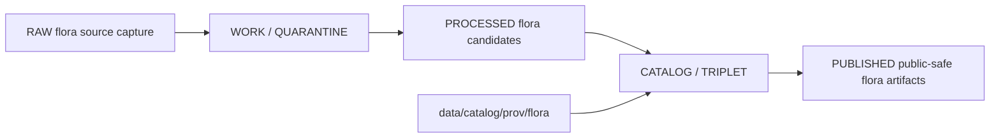

<!-- [KFM_META_BLOCK_V2]
doc_id: kfm://doc/data-catalog-prov-flora-readme
title: data/catalog/prov/flora/README.md — Flora PROV Catalog Sublane README
version: v0.1
type: readme; data-lifecycle-sublane; prov-catalog-guide; flora-catalog-projection
status: draft; PROPOSED; data-root; catalog-stage; prov; flora; prov-o; pav; release-gated; sensitivity-aware
owners: OWNER_TBD — Flora steward · Data steward · Catalog steward · PROV steward · Evidence steward · Source steward · Policy steward · Release steward · Schema steward · Docs steward
created: NEEDS VERIFICATION — placeholder existed before v0.1 expansion
updated: 2026-06-25
policy_label: public-doc; data; catalog; prov; flora; provenance; lifecycle; release-gated; sensitivity-aware
tags: [kfm, data, catalog, prov, flora, PROV-O, PAV, CATALOG, STAC, DCAT, EvidenceBundle, SourceDescriptor, RunReceipt, ReleaseManifest, CatalogBuildReceipt, RedactionReceipt]
related:
  - ../README.md
  - ../../README.md
  - ../../../README.md
  - ../../dcat/flora/README.md
  - ../../domain/flora/README.md
  - ../../../triplets/graph_deltas/flora/
  - ../../../triplets/exports/flora/
  - ../../../proofs/
  - ../../../receipts/
  - ../../../published/
  - ../../../registry/
  - ../../../../docs/standards/PROV.md
  - ../../../../docs/standards/PROVENANCE.md
  - ../../../../docs/adr/ADR-0022-catalog-matrix--stac-+-dcat-+-prov-must-agree.md
  - ../../../../schemas/contracts/v1/domains/flora/
  - ../../../../policy/domains/flora/
  - ../../../../release/
notes:
  - "This file replaces a placeholder at `data/catalog/prov/flora/README.md`."
  - "Flora PROV records are provenance catalog carriers and do not replace Flora domain records, STAC records, DCAT records, SourceDescriptor, EvidenceBundle, RunReceipt, PolicyDecision, RedactionReceipt, ReleaseManifest, proof storage, receipt storage, or release decisions."
  - "Rare-plant, culturally sensitive, join-sensitive, and rights-restricted Flora details must use policy-approved public-safe representation before release-linked PROV records can be public."
  - "ADR-0022 requires STAC, DCAT, and PROV-O catalog records to agree by identifier, digest, and release reference for promoted releases."
  - "Rollback target for this expansion is previous placeholder blob SHA `e25f1814e51579d5f55c0f1fe0135ddb28a47f4a`."
[/KFM_META_BLOCK_V2] -->

# data/catalog/prov/flora

> Flora-specific PROV catalog sublane for governed `prov:Entity`, `prov:Activity`, `prov:Agent`, and PAV authoring/versioning records inside the `CATALOG / TRIPLET` lifecycle stage.

  
  
  
  
  
  
  

**Status:** draft / PROPOSED  
**Owners:** OWNER_TBD — Flora steward · Data steward · Catalog steward · PROV steward · Evidence steward · Source steward · Policy steward · Release steward · Schema steward · Docs steward  
**Path:** `data/catalog/prov/flora/README.md`  
**Owning root:** `data/catalog/prov/`  
**Domain segment:** `flora`  
**Lifecycle stage:** `CATALOG / TRIPLET`  
**External vocabulary:** W3C PROV-O + PAV  
**Exposure posture:** RELEASED ONLY  
**Truth posture:** CONFIRMED target was a placeholder · CONFIRMED parent PROV lane is CATALOG-stage and RELEASED ONLY for public exposure · CONFIRMED Flora domain catalog lane lists `data/catalog/prov/flora/` as the Flora provenance catalog projection · CONFIRMED Flora DCAT lane expects Flora STAC/DCAT/PROV closure for promoted releases · NEEDS VERIFICATION for concrete PROV record inventory, schemas, JSON-LD contexts, validators, policy gates, receipts, release manifests, CatalogMatrix artifacts, and routed access behavior.

**Quick jumps:** [Purpose](#purpose) · [Lifecycle boundary](#lifecycle-boundary) · [Repo fit](#repo-fit) · [Accepted contents](#accepted-contents) · [Exclusions](#exclusions) · [Record requirements](#record-requirements) · [Flora PROV guardrails](#flora-prov-guardrails) · [Evidence ledger](#evidence-ledger) · [Validation checklist](#validation-checklist) · [Rollback](#rollback)

---

## Purpose

`data/catalog/prov/flora/` stores or stages Flora-specific PROV catalog records for plant-related claims, datasets, artifacts, validation activities, redaction/generalization activities, release decisions, and related lineage surfaces.

Likely Flora PROV records include provenance for taxa, specimens, occurrences, vegetation communities, invasive-plant records, phenology products, restoration-context products, public-safe derivative artifacts, validation activities, policy/review activities, and release-linked Flora catalog artifacts.

A Flora PROV record supports lineage inspection and catalog closure. It does **not** make a Flora claim true, public, policy-admitted, evidence-supported, sensitivity-approved, or released by itself.

## Lifecycle boundary

`data/catalog/prov/flora/` is a CATALOG-stage sublane. Public exposure applies only to records tied to approved release state, governed access path, EvidenceBundle support, source-role support, policy/sensitivity posture, and release/rollback linkage.

## Repo fit

| Responsibility | Correct home | Rule |
|---|---|---|
| Flora PROV catalog records | `data/catalog/prov/flora/` | This lane. |
| Parent PROV catalog lane | `data/catalog/prov/` | PROV-O/PAV catalog projection. |
| Flora STAC catalog records | `data/catalog/stac/flora/` | Spatiotemporal Flora catalog records. |
| Flora DCAT catalog records | `data/catalog/dcat/flora/` | Dataset/distribution catalog records. |
| Flora domain catalog records | `data/catalog/domain/flora/` | Domain-scoped Flora catalog records. |
| Flora graph/triplet projections | `data/triplets/graph_deltas/flora/`, `data/triplets/exports/flora/` | Paired graph stage. |
| Flora proof/evidence | `data/proofs/` or accepted proof roots | EvidenceBundle and proof records. |
| Flora receipts | `data/receipts/` or accepted receipt roots | RunReceipt, CatalogBuildReceipt, validation, policy, review, transform, correction, and release receipts. |
| Flora release decisions | `release/` | Publication authority. |
| Flora schemas and policy | `schemas/contracts/v1/domains/flora/`, `policy/domains/flora/` | Separate roots; paths remain PROPOSED until verified. |

## Accepted contents

| Content | Purpose |
|---|---|
| Flora `prov:Entity` records | Entity references for Flora datasets, artifacts, claims, manifests, and released records. |
| Flora `prov:Activity` records | Activity references for intake, transform, validation, redaction/generalization, review, publication, correction, and withdrawal actions. |
| Flora `prov:Agent` records | Steward, reviewer, system, and software-agent references where release/public posture permits. |
| PAV authoring/versioning fields | Curatorial authorship, versioning, and update metadata where KFM profiles require it. |
| KFM extension fields | Flora source, evidence, release, policy, digest, rights, sensitivity, and rollback pointers. |
| CatalogMatrix references | Links to Flora STAC/DCAT/PROV closure artifacts where they exist. |
| Validation and quality summaries | Pointers to validation reports and receipts. |

## Exclusions

| Do not put here | Correct home |
|---|---|
| Flora RAW source files | `data/raw/flora/` |
| Flora WORK/intermediate data | `data/work/flora/` |
| Flora quarantined data | `data/quarantine/flora/` |
| Flora processed datasets | `data/processed/flora/` |
| Flora STAC records | `data/catalog/stac/flora/` |
| Flora DCAT records | `data/catalog/dcat/flora/` |
| Flora domain catalog records | `data/catalog/domain/flora/` |
| Flora graph/triplet edges | `data/triplets/.../flora/` |
| Flora EvidenceBundle/proof records | `data/proofs/` or accepted proof roots |
| Flora source registry records | `data/registry/` or accepted source registry root |
| Flora receipts and attestations | `data/receipts/` or accepted receipt/proof roots |
| Release decisions | `release/` |
| Published Flora products | `data/published/.../flora/` |
| Flora schemas | `schemas/contracts/v1/domains/flora/` |
| Flora policy rules | `policy/domains/flora/` |
| Validators/tests/code | `tools/validators/`, `tests/`, implementation roots |

## Record requirements

PROPOSED until schema and validator are verified:

| Requirement | Meaning |
|---|---|
| Stable Flora identifier | Identifier resolves to the same Flora artifact, claim, dataset, activity, or agent identity used by catalog closure. |
| PROV class | Record declares whether it is an Entity, Activity, Agent, or qualified relation. |
| Fixed predicates | PROV-O and PAV predicates are not renamed; KFM-specific extensions stay in the governed `kfm:` namespace. |
| Evidence reference | EvidenceBundle/proof context is referenced when Flora claims depend on evidence. |
| Run/receipt reference | Activity records resolve to RunReceipt or equivalent receipt where material. |
| Source reference | SourceDescriptor/source catalog is referenced when source authority matters. |
| Policy/sensitivity reference | Rare-plant, culturally sensitive, rights-restricted, join-sensitive, and embargoed material references policy/review posture. |
| Release reference | Public or release-linked records point to immutable ReleaseManifest and rollback target. |
| Closure compatibility | Flora STAC ↔ DCAT ↔ PROV agreement holds for promoted releases. |

## Flora PROV guardrails

- Flora PROV records are catalog/provenance carriers, not Flora source truth.
- Rare-plant exact geometry must not be exposed through PROV records unless policy and release evidence explicitly allow the representation.
- PROV should point to redacted/generalized public-safe outputs when exact source data is restricted.
- Flora PROV records, Flora STAC records, and Flora DCAT records for the same released artifact must agree on identifier, digest, and release reference.
- PROV catalog records do not replace EvidenceBundle, SourceDescriptor, RunReceipt, PolicyDecision, RedactionReceipt, ReleaseManifest, or CatalogMatrix closure artifacts.
- Watchers and source-head checks may propose candidates; they do not publish PROV records.
- Unreleased Flora PROV records are not public merely because they exist under this directory.

## Evidence ledger

| Source | Status | Supports | Limits |
|---|---|---|---|
| `data/catalog/prov/flora/README.md` prior file | CONFIRMED | Target existed as a placeholder. | Did not define Flora PROV sublane boundaries. |
| `data/catalog/prov/README.md` | CONFIRMED | Parent PROV CATALOG-stage lane and RELEASED ONLY posture. | Does not prove Flora PROV record inventory. |
| `data/catalog/domain/flora/README.md` | CONFIRMED | Flora domain lane, rare-plant deny-default posture, and related PROV path expectation. | Does not prove concrete PROV records exist. |
| `data/catalog/dcat/flora/README.md` | CONFIRMED sibling pattern | Flora DCAT sublane and Flora STAC/DCAT/PROV closure posture. | DCAT pattern does not prove PROV inventory. |
| `docs/standards/PROV.md` | CONFIRMED doctrine / PROPOSED implementation | W3C PROV-O + PAV use, class mapping, predicate/no-rename posture, and EvidenceBundle linkage. | Concrete JSON-LD contexts and validators remain NEEDS VERIFICATION. |
| `ADR-0022` | CONFIRMED doctrine / PROPOSED implementation | STAC/DCAT/PROV agreement invariant and CatalogMatrix requirement. | Does not prove emitted Flora CatalogMatrix or CI enforcement. |

## Validation checklist

- [ ] Confirm actual child directories and Flora PROV record files.
- [ ] Confirm Flora PROV schema/profile and JSON-LD context location.
- [ ] Confirm Flora PROV validator and CI checks.
- [ ] Confirm Flora STAC/DCAT/PROV CatalogMatrix closure.
- [ ] Confirm ReleaseManifest linkage for public Flora PROV records.
- [ ] Confirm EvidenceBundle, SourceDescriptor, RunReceipt, PolicyDecision, RedactionReceipt, and CatalogBuildReceipt references.
- [ ] Confirm rights, sensitivity, source-role, predicate namespace, and publication handling.
- [ ] Confirm withdrawal/supersession behavior for stale or failed Flora PROV records.

## Rollback

Rollback is required if this lane becomes a Flora source-data root, proof store, source-registry root, receipt/attestation store, release-decision root, published-output root, domain catalog root, STAC root, DCAT root, schema root, policy root, validator root, implementation root, or public exposure shortcut.

Rollback target for this expansion: previous placeholder blob SHA `e25f1814e51579d5f55c0f1fe0135ddb28a47f4a`.

<a href="#top">Back to top</a>

