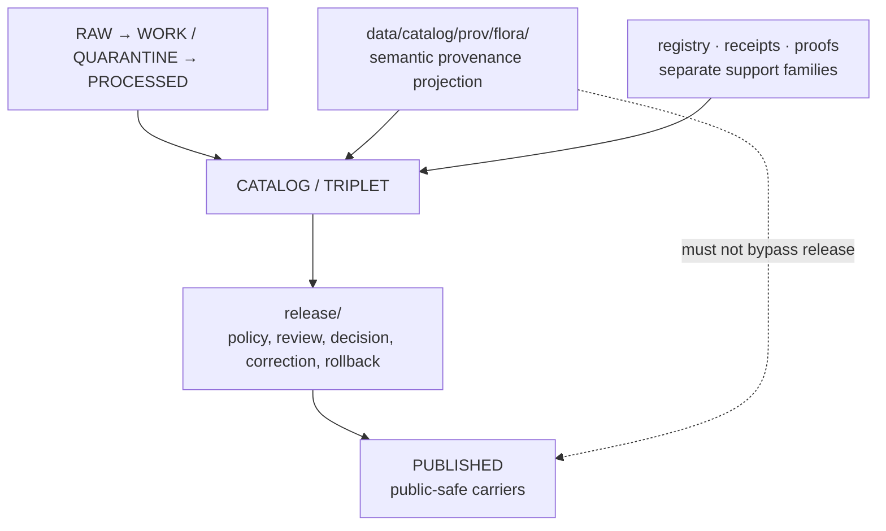

<!-- [KFM_META_BLOCK_V2]
doc_id: kfm://doc/data-catalog-prov-flora-readme
title: data/catalog/prov/flora/README.md — Governed Flora PROV Catalog Lane
version: v0.2.0
type: readme; data-lifecycle-sublane; prov-catalog-guide; flora-catalog-projection; release-gated; sensitivity-aware
status: repository-grounded draft; canonical placement; proposed realization; catalog-stage; release-gated
owners: NEEDS VERIFICATION — Flora, data, catalog, PROV/PAV, evidence, source, rights, sensitivity, policy, validation, release, correction, rollback, schema, and docs stewards
created: NEEDS VERIFICATION — placeholder existed before v0.1 expansion
updated: 2026-07-25
policy_label: restricted-review; data-catalog; prov; flora; release-gated; deny-sensitive-location-by-default
current_path: data/catalog/prov/flora/README.md
historical_placeholder_blob: e25f1814e51579d5f55c0f1fe0135ddb28a47f4a
prepared_under_prompt: KFM Markdown Modernization & GitHub Documentation Implementation Agent v4.0.0
review_packet_id: kfm-flora-prov-catalog-readme-20260725
truth_posture: >
  CONFIRMED exact path, parent catalog and PROV posture, Directory Rules
  placement, Flora domain catalog, STAC and DCAT sibling guides, PROV and
  supply-chain provenance standards, CatalogMatrix contract and schema,
  catalog-closure validator boundary and stub, Flora schema index, fixture
  index, placeholder smoke test, readiness workflow, release-candidate lane,
  CODEOWNERS route, and repository-relative link targets / PROPOSED concrete
  Flora PROV profile, JSON-LD context, record realization, deterministic
  validators, Activity-to-RunReceipt round trip, CatalogMatrix closure, and
  enforcement / UNKNOWN recursive record inventory, active producers and
  consumers, runtime reads, hosts, caches, public effects, correction
  execution, and rollback execution / NEEDS VERIFICATION accountable
  stewardship, accepted ADR decisions, rights and sensitivity authority
  convergence, profile and namespace maturity, release closure, and
  public-client exclusion
evidence_snapshot:
  repository: bartytime4life/Kansas-Frontier-Matrix
  base_ref: main
  base_commit: 73214c6a6aa6ac14f729e8c15c00014a1ffdd04f
  prior_blob: dd6598aab8b004252f1752d52d3c609273671091
  historical_placeholder_blob: e25f1814e51579d5f55c0f1fe0135ddb28a47f4a
  method: complete target read plus bounded governing-neighbor, standard, contract, schema, validator, fixture, test, workflow, candidate, review-routing, branch, and pull-request inspection; no recursive clone, PROV-record sampling, source-payload access, runtime, deployment, host-render, or external-store inspection
related:
  - ../README.md
  - ../../README.md
  - ../../domain/flora/README.md
  - ../../stac/flora/README.md
  - ../../dcat/flora/README.md
  - ../../../registry/sources/flora/README.md
  - ../../../receipts/flora/README.md
  - ../../../proofs/flora/README.md
  - ../../../rollback/flora/README.md
  - ../../../published/flora/README.md
  - ../../../../docs/standards/PROV.md
  - ../../../../docs/standards/PROVENANCE.md
  - ../../../../contracts/domains/flora/README.md
  - ../../../../contracts/data/catalog_matrix.md
  - ../../../../schemas/contracts/v1/domains/flora/README.md
  - ../../../../schemas/contracts/v1/data/catalog_matrix.schema.json
  - ../../../../policy/domains/flora/README.md
  - ../../../../policy/sensitivity/flora/README.md
  - ../../../../tests/domains/flora/README.md
  - ../../../../fixtures/domains/flora/README.md
  - ../../../../tools/validators/domains/flora/README.md
  - ../../../../tools/validators/catalog_closure/README.md
  - ../../../../pipelines/domains/flora/catalog/README.md
  - ../../../../release/candidates/flora/README.md
  - ../../../../docs/adr/ADR-0001-schema-home--schemas-contracts-v1-is-canonical.md
  - ../../../../docs/adr/ADR-0010-deny-by-default-for-dna-rare-species-archaeology-infrastructure.md
  - ../../../../docs/adr/ADR-0011-receipts-vs-proofs-vs-manifests-vs-catalog-separation.md
  - ../../../../docs/adr/ADR-0022-catalog-matrix--stac-+-dcat-+-prov-must-agree.md
  - ../../../../docs/doctrine/directory-rules.md
  - ../../../../.github/workflows/domain-flora.yml
  - ../../../../.github/workflows/link-check.yml
  - ../../../../.github/CODEOWNERS
tags: [kfm, data, catalog, prov, flora, PROV-O, PAV, catalog-stage, EvidenceBundle, SourceDescriptor, RunReceipt, RedactionReceipt, ReleaseManifest, CatalogMatrix, geoprivacy, cite-or-abstain]
notes:
  - "Directory Rules sections 4, 9, and 12 support this nested catalog, standards, and domain placement."
  - "Directory Rules section 15 directly governs canonical and compatibility roots, not this nested lane; its ordered README sections are adopted here as a consistency contract."
  - "All v0.1 heading fragments remain available through headings or explicit legacy anchors."
  - "ADR-0022 remains proposed; this README does not accept it or claim STAC/DCAT/PROV closure."
  - "W3C PROV-O/PAV semantic provenance and supply-chain/build provenance remain distinct, complementary lanes."
  - "This Markdown-only revision creates no PROV record, profile, context, schema acceptance, EvidenceBundle, receipt, policy decision, release, publication, public route, correction, or rollback execution."
  - "Static badges project verified documentation posture only; they do not assert validator, CI, security, release, or publication maturity."
[/KFM_META_BLOCK_V2] -->

<a id="top"></a>
<a id="datacatalogprovflora"></a>

# `data/catalog/prov/flora/` — Governed Flora PROV Catalog Lane

> **One-line purpose.** Define the governed home for Flora-specific semantic provenance catalog projections at the `CATALOG / TRIPLET` stage while keeping botanical truth, source role, evidence, process receipts, rights, sensitivity, policy, release, correction, rollback, and public delivery independently governed.

[](#status)
[](#flora-prov-profile)
[](#current-implementation-evidence)
[](#status)

> [!IMPORTANT]
> A Flora PROV record can support lineage inspection and catalog interoperability. Placement here does **not** make a botanical claim true, evidence-supported, rights-cleared, policy-admitted, reviewed, released, or public. EvidenceBundle, SourceDescriptor, receipts, PolicyDecision, ReviewRecord, ReleaseManifest, correction state, and rollback remain separate governed objects.

<!-- governance-alert-separator -->

> [!CAUTION]
> Exact rare-plant, protected-species, culturally sensitive, rights-restricted, private-land, and join-sensitive detail fails closed. PROV identifiers, labels, links, activity metadata, agent metadata, source relations, and timestamps can leak or reconstruct sensitive locality even when no coordinate field is present.

**Quick navigation:** [Purpose](#purpose) · [Authority](#authority-level) · [Status](#status) · [Belongs](#what-belongs-here) · [Exclusions](#what-does-not-belong-here) · [Inputs](#inputs) · [Outputs](#outputs) · [Validation](#validation) · [Review](#review-burden) · [Related](#related-folders) · [ADRs](#adrs) · [Last reviewed](#last-reviewed) · [Lifecycle](#lifecycle-and-authority-boundary) · [Profile](#flora-prov-profile) · [Lane split](#semantic-and-supply-chain-provenance) · [Predicates](#identity-predicates-and-time) · [Closure](#evidence-receipt-and-catalog-closure) · [Guardrails](#flora-prov-guardrails) · [Evidence](#evidence-basis) · [Correction](#promotion-correction-and-rollback) · [Open items](#open-verification-register) · [Done](#definition-of-done) · [No-loss](#no-loss-ledger)

## Purpose

`data/catalog/prov/flora/` is the canonical responsibility placement for Flora-specific semantic provenance catalog projections. Candidate records describe which entities, activities, and agents participate in the lineage of Flora claims, datasets, transforms, catalog artifacts, corrections, withdrawals, and release-linked public-safe products.

This lane is a **catalog carrier**. It can make lineage inspectable; it cannot manufacture botanical evidence, promote a source role, approve a geoprivacy transform, make a stewardship decision, validate its own assertions, authorize release, or publish an artifact.

Candidate subject families include plant taxa and taxonomic concepts, specimens, occurrences, vegetation communities, invasive plants, phenology observations, range or distribution products, restoration context, public-safe derivatives, and the activities that produced or changed them. Listing a family does not prove that its PROV records, profile, context, schema, validator, evidence, or release state exist.

## Authority level

**Canonical responsibility placement for Flora PROV catalog projections / repository-grounded draft / concrete profile and realization PROPOSED / not botanical truth, evidence, process-receipt, policy, release, or publication authority.**

This lane may carry PROV-O/PAV-shaped catalog descriptors and governed references. It cannot replace:

- Flora semantics under `contracts/`;
- machine shape under `schemas/`;
- admissibility under `policy/`;
- source identity, role, rights, and sensitivity under `data/registry/`;
- process memory under `data/receipts/`;
- EvidenceBundles and proof support under `data/proofs/`;
- release decisions, corrections, withdrawals, and rollback authority under `release/`; or
- released public-safe carriers under `data/published/`.

## Status

| Field | Bounded result |
|---|---|
| Path | `data/catalog/prov/flora/README.md` |
| Version | `v0.2.0` |
| Base evidence | `main@73214c6a6aa6ac14f729e8c15c00014a1ffdd04f` |
| Prior blob | `dd6598aab8b004252f1752d52d3c609273671091` (`v0.1`) |
| Historical placeholder predecessor | `e25f1814e51579d5f55c0f1fe0135ddb28a47f4a` |
| Placement | `CONFIRMED` existing Flora child under the governed `data/catalog/prov/` catalog sublane |
| Concrete Flora PROV profile and record realization | `PROPOSED / NEEDS VERIFICATION` |
| Recursive PROV-record inventory | `UNKNOWN` |
| JSON-LD context, profile version, KFM namespace, or canonical record packaging | `NEEDS VERIFICATION`; no accepted Flora PROV profile was established |
| Flora PROV machine schema | `NOT ESTABLISHED` by the inspected Flora schema index; it lists only a permissive redaction-receipt scaffold as present |
| Dedicated PROV fixtures and tests | `NOT ESTABLISHED` by the inspected fixture index; the only direct Flora smoke test is a placeholder |
| Deterministic PROV or catalog-closure validator | `NOT ESTABLISHED`; the shared closure lane is README-only and the top-level CatalogMatrix validator is a stub |
| STAC/DCAT/PROV agreement | `PROPOSED`; ADR-0022 is proposed, the shared contract is draft, and its schema is permissive |
| Active producer, consumer, runtime read, host, cache, or public effect | `UNKNOWN` |
| Active Flora release candidate or approved manifest | None established by the inspected candidate lane |
| Rights and sensitivity authority | `CONFLICTED / NEEDS ADR`; overlapping draft Flora documents remain unresolved |
| Public exposure | `RELEASE-GATED / FAIL CLOSED` |
| Human review | `PENDING` |

Path presence proves placement, not payload maturity. The safe current conclusion is that this is a documentation-bearing catalog sublane with a proposed profile and unverified realization.

<a id="accepted-contents"></a>

## What belongs here

Subject to an accepted profile, schemas, validators, evidence, policy, and release controls, this lane may contain:

| Accepted family | Required posture |
|---|---|
| Flora `prov:Entity` catalog projections | Stable identity, version, digest, object role, source/evidence references, sensitivity posture, and correction state |
| Flora `prov:Activity` catalog projections | Named producing or transforming operation, immutable inputs/outputs, time, software or responsible-agent references, and resolvable process-receipt linkage |
| Flora `prov:Agent` or `prov:SoftwareAgent` projections | Minimum-necessary, release-approved identity and role; no unreviewed personal, private, or security-significant detail |
| Qualified PROV relations | Version-pinned semantics and deterministic references without redefining PROV predicates |
| PAV authoring and versioning terms | Curatorial authorship, creation, curation, version, and update metadata under an accepted subset |
| KFM extension references | Namespaced pointers for evidence, source role, policy, rights, sensitivity, release, correction, and rollback under an accepted `kfm:` vocabulary |
| Validation and closure references | Immutable pointers to separate validation reports, CatalogMatrix descriptors, receipts, and release records where they exist |
| Correction, withdrawal, and supersession lineage | Additive record history that preserves prior identity, digest, and release relationships |

Records should be deterministic where practical, bounded in scope, correctable, explicit about audience and lifecycle state, and distinguishable as internal candidates, reviewable records, release-linked projections, withdrawn records, or historical records.

<a id="exclusions"></a>

## What does NOT belong here

| Prohibited family | Governed home or action |
|---|---|
| Flora RAW source files | `data/raw/flora/` |
| Flora WORK or intermediate data | `data/work/flora/` |
| Quarantined Flora material | `data/quarantine/flora/` |
| Processed Flora datasets or candidate payloads | `data/processed/flora/` |
| Flora STAC, DCAT, or domain catalog records | Their sibling lanes under `data/catalog/` |
| Triplets, graph edges, or graph-database snapshots | Governed Flora lanes under `data/triplets/`; derived graph storage is not source truth |
| SourceDescriptor, source admission, rights, or source-role authority | `data/registry/` and governing contracts/policy |
| EvidenceBundle, EvidenceRef resolution indexes, ProofPack, or validation proof | `data/proofs/` or an accepted evidence/proof lane |
| RunReceipt, CatalogBuildReceipt, RedactionReceipt, review receipt, or supply-chain attestation | `data/receipts/` or an accepted receipt/attestation lane |
| PolicyDecision, ReviewRecord, contract, schema, validator, fixture, test, package, pipeline, or workflow | Its owning responsibility root |
| ReleaseManifest, PromotionDecision, CorrectionNotice, WithdrawalNotice, or RollbackCard | `release/` |
| Published layers, reports, stories, downloads, APIs, indexes, tiles, or other public-safe carriers | `data/published/` after governed release |
| Direct public reads, UI caches, search indexes, AI retrieval corpora, or hosted output | Governed interfaces and approved runtime or output stores |
| Supply-chain/build provenance presented as semantic claim provenance | The separate supply-chain provenance and receipt/attestation lanes |
| Exact sensitive locations or reconstructive metadata | Deny, quarantine, restrict, generalize, aggregate, redact, or embargo under policy and review |

## Inputs

Future PROV producers should consume governed references, not infer authority from path or prose:

- stable processed Flora identities, versions, digests, spatial and temporal scope, and taxonomic-concept references;
- admitted SourceDescriptor and source-registry references with role, rights, sensitivity, retrieval, and version context;
- EvidenceRef-to-EvidenceBundle resolution for consequential claims;
- RunReceipt, CatalogBuildReceipt, transform, validation, redaction, review, correction, and release-support references;
- accepted PROV-O/PAV profiles, JSON-LD contexts, KFM namespace terms, contracts, schemas, policy, and reason-code vocabularies;
- policy-approved public-safe transforms and their RedactionReceipt or accepted equivalent;
- sibling domain, STAC, DCAT, and triplet references where those projections exist; and
- immutable release, correction, withdrawal, supersession, and rollback references.

Unknown identity, source role, evidence, rights, sensitivity, profile, predicate, receipt, review, release, correction, or rollback state must hold the record from public-bound use.

## Outputs

This lane may emit or support:

- internal or reviewable Flora semantic-provenance catalog records;
- deterministic Flora provenance indexes and bounded lineage subsets;
- release-linked PROV projections that describe approved public-safe artifacts;
- inspectable inputs to proposed STAC/DCAT/PROV agreement checks;
- correction-, withdrawal-, supersession-, and rollback-aware discovery metadata; and
- governed-API or review-tool lookups that resolve released records without direct access to internal stores.

Catalog placement is not publication. Public clients receive only policy-safe, release-approved representations through governed interfaces and released carriers.

<a id="validation-checklist"></a>

## Validation

### This README

For this documentation-only revision:

- parse one H1, valid GFM tables, complete fences, supported alerts, stable legacy anchors, and the final newline;
- resolve every repository-relative link at the resulting commit;
- parse the Mermaid lifecycle diagram;
- verify badge images, destinations, alt text, and the represented documentation facts;
- compare the complete baseline and result so every v0.1 boundary remains available;
- inspect the exact base-to-head diff for one-path scope, conflict markers, credentials, private endpoints, precise coordinates, or Flora payload data; and
- treat passing documentation checks as source-structure evidence only.

The inspected [Flora workflow](../../../../.github/workflows/domain-flora.yml) has read-only repository permission. Its `validate-flora` job intentionally stops when any executable Flora test function appears; the current [`test_flora_smoke.py`](../../../../tests/domains/flora/test_flora_smoke.py) contains only `test_placeholder(): assert True`. The workflow therefore acts as a readiness detector and hold, not as PROV validation. Its proof and release jobs are also explicit holds.

### Future Flora PROV records

An accepted executable suite should fail closed on:

- missing, unstable, duplicate, or cross-projection-conflicted identity;
- an unrecognized PROV class or noncanonical alias for a required PROV predicate;
- a KFM extension placed in the `prov:` or `pav:` namespace;
- a dangling Entity, Activity, Agent, source, evidence, receipt, release, correction, or rollback reference;
- a derived entity without a concrete producing step;
- Activity start/end or entity validity-time contradictions;
- an artifact, entity, or release digest mismatch;
- unresolved SourceDescriptor, EvidenceBundle, RunReceipt, RedactionReceipt, PolicyDecision, ReviewRecord, ReleaseManifest, correction, or rollback support where required;
- exact or reconstructive rare-plant, protected-species, culturally sensitive, rights-restricted, private-land, or join-sensitive metadata in a public projection;
- private agent identities, internal hostnames, signed URLs, credentials, or restricted storage references in public metadata;
- contradictory identity, digest, release, rights, sensitivity, or access state across domain, STAC, DCAT, PROV, triplet, evidence, and release surfaces;
- candidate, withdrawn, superseded, stale, restricted, or unreleased records reaching public clients; and
- parser, resolver, profile, dependency, or tool errors being converted into a pass.

Schema validity, individual PROV-record validity, catalog agreement, policy permission, review, and release approval are separate checks.

## Review burden

At minimum, route changes to:

- the verified GitHub CODEOWNERS route;
- Flora, data, catalog, and semantic-provenance review for object meaning and lane placement;
- botanical taxonomy, specimen, occurrence, vegetation, invasive-plant, phenology, range, and restoration specialists as applicable;
- PROV-O/PAV profile and interoperability review for classes, predicates, contexts, qualified relations, and versioning;
- source and rights review for provider role, license, terms, redistribution, attribution, and downstream use;
- sensitivity, cultural-rights, and geoprivacy review for rare or protected taxa, exact localities, culturally sensitive knowledge, agent identity, source links, and re-identifying joins;
- evidence, policy, release, correction, and rollback review when records touch those boundaries; and
- schema, validator, security, and privacy review for machine or enforcement changes.

[`.github/CODEOWNERS`](../../../../.github/CODEOWNERS) routes unmatched paths to `@bartytime4life`. That is **CONFIRMED review routing**, not a StewardshipAssignment, specialist approval, independent review, PolicyDecision, release authorization, branch-protection proof, or evidence that review occurred.

<a id="repo-fit"></a>

## Related folders

| Responsibility | Verified repository path |
|---|---|
| Parent catalog and PROV lanes | [`data/catalog/`](../../README.md) · [`data/catalog/prov/`](../README.md) |
| Flora domain catalog | [`data/catalog/domain/flora/`](../../domain/flora/README.md) |
| Sibling catalog projections | [`STAC`](../../stac/flora/README.md) · [`DCAT`](../../dcat/flora/README.md) |
| Semantic and supply-chain provenance standards | [`PROV-O/PAV`](../../../../docs/standards/PROV.md) · [`build provenance`](../../../../docs/standards/PROVENANCE.md) |
| Source, rights, and sensitivity registry | [`data/registry/sources/flora/`](../../../registry/sources/flora/README.md) |
| Process memory and proof support | [`data/receipts/flora/`](../../../receipts/flora/README.md) · [`data/proofs/flora/`](../../../proofs/flora/README.md) |
| Correction, rollback, and public-safe carriers | [`data/rollback/flora/`](../../../rollback/flora/README.md) · [`data/published/flora/`](../../../published/flora/README.md) |
| Flora meaning, shape, and admissibility | [`contracts/domains/flora/`](../../../../contracts/domains/flora/README.md) · [`schemas/contracts/v1/domains/flora/`](../../../../schemas/contracts/v1/domains/flora/README.md) · [`policy/domains/flora/`](../../../../policy/domains/flora/README.md) |
| Flora sensitivity policy | [`policy/sensitivity/flora/`](../../../../policy/sensitivity/flora/README.md) |
| Tests, fixtures, and documented validator lane | [`tests/domains/flora/`](../../../../tests/domains/flora/README.md) · [`fixtures/domains/flora/`](../../../../fixtures/domains/flora/README.md) · [`tools/validators/domains/flora/`](../../../../tools/validators/domains/flora/README.md) |
| Shared catalog agreement surfaces | [`CatalogMatrix contract`](../../../../contracts/data/catalog_matrix.md) · [`placeholder schema`](../../../../schemas/contracts/v1/data/catalog_matrix.schema.json) · [`closure validator boundary`](../../../../tools/validators/catalog_closure/README.md) |
| Documented catalog producer | [`pipelines/domains/flora/catalog/`](../../../../pipelines/domains/flora/catalog/README.md) |
| Release candidates | [`release/candidates/flora/`](../../../../release/candidates/flora/README.md) |
| Placement doctrine and review automation | [`Directory Rules`](../../../../docs/doctrine/directory-rules.md) · [`domain-flora.yml`](../../../../.github/workflows/domain-flora.yml) · [`link-check.yml`](../../../../.github/workflows/link-check.yml) |

These links prove that the named paths and documents existed at the evidence snapshot. They do not prove recursive inventory, valid records, accepted profiles, current source rights, deterministic validators, catalog closure, release approval, public routes, correction handling, or rollback execution.

## ADRs

| Decision record | Observed state | Relevance |
|---|---:|---|
| [`ADR-0001 — Schema Home`](../../../../docs/adr/ADR-0001-schema-home--schemas-contracts-v1-is-canonical.md) | `PROPOSED` | Identifies the intended machine-schema responsibility surface; it does not prove a Flora PROV profile schema. |
| [`ADR-0010 — Deny-by-Default for Rare Species and Other Sensitive Domains`](../../../../docs/adr/ADR-0010-deny-by-default-for-dna-rare-species-archaeology-infrastructure.md) | `DRAFT` | Supports fail-closed treatment for rare-species precision; it does not prove an accepted evaluator or public transform. |
| [`ADR-0011 — Receipts vs Proofs vs Manifests vs Catalog Separation`](../../../../docs/adr/ADR-0011-receipts-vs-proofs-vs-manifests-vs-catalog-separation.md) | `PROPOSED` | Supports `receipt ≠ proof ≠ catalog ≠ publication`; it does not prove acceptance or enforcement. |
| [`ADR-0022 — Catalog Matrix · STAC + DCAT + PROV Must Agree`](../../../../docs/adr/ADR-0022-catalog-matrix--stac-+-dcat-+-prov-must-agree.md) | `PROPOSED` | Proposes release-level identity, digest, and release-reference agreement; the current contract, schema, and validator do not enforce it. |

[`Directory Rules`](../../../../docs/doctrine/directory-rules.md) §4 places lifecycle material under `data/`, §9 names `stac/`, `dcat/`, `prov/`, and `domain/` as catalog sublanes, and §12 applies responsibility-root domain placement to Flora. Section 15 directly defines README contracts for canonical and compatibility **roots**. This nested lane is neither, so the ordered sections above are adopted for consistency, not presented as direct §15 compliance.

No accepted ADR governing the concrete realization of this Flora PROV sublane was established in the bounded review.

## Last reviewed

**2026-07-25** against `main@73214c6a6aa6ac14f729e8c15c00014a1ffdd04f`.

Review again after six months, or sooner if the parent catalog or PROV lanes, Flora doctrine, PROV/PAV profile, KFM namespace, source rights, sensitivity authority, relevant ADR status, workflows, producers, consumers, public routes, release process, correction process, or rollback path changes.

<a id="lifecycle-boundary"></a>

## Lifecycle and authority boundary


```mermaid
flowchart TD
    PRE["RAW → WORK / QUARANTINE → PROCESSED"] --> CAT["CATALOG / TRIPLET"]
    PROV["data/catalog/prov/flora/<br/>semantic provenance projection"] --> CAT
    SUPPORT["registry · receipts · proofs<br/>separate support families"] --> CAT
    CAT --> RELEASE["release/<br/>policy, review, decision, correction, rollback"]
    RELEASE --> PUBLIC["PUBLISHED<br/>public-safe carriers"]
    PROV -. "must not bypass release" .-> PUBLIC
```

The diagram is a lifecycle and authority map, not proof that Flora PROV records, profiles, validators, catalog agreement, release assembly, public routes, corrections, or rollback drills exist. Promotion is a governed state transition; a file move, schema pass, workflow result, pull request, or merge is not promotion.

<a id="record-requirements"></a>

## Flora PROV profile

The following is a **PROPOSED review profile** derived from the repository's draft PROV standard and existing catalog boundaries. It is not a machine schema.

| Record family | Intended role | Current implementation posture |
|---|---|---|
| `prov:Entity` | Flora claim, dataset, artifact, public-safe derivative, catalog record, or immutable release-linked entity | Profile, context, schema, inventory, and validator not established |
| `prov:Activity` | Intake, normalization, validation, catalog build, redaction/generalization, review, release, correction, withdrawal, or rollback activity | Activity-to-RunReceipt round trip remains unresolved |
| `prov:Agent` | Human, organizational, system, or software responsibility reference | Public identity minimization and profile rules not established |
| `prov:SoftwareAgent` | Versioned tool or pipeline identity where material | Executable producer and software-identity profile not established |
| Qualified relation | Reified generation, derivation, association, attribution, or usage details | Required subset and validation not established |
| PAV terms | Authoring, curation, creation, version, and last-update metadata | Required KFM subset and context pin not established |

Minimum proposed concerns for any record are:

| Concern | Minimum meaning |
|---|---|
| Stable identity | Deterministic or otherwise immutable identifier for the represented Entity, Activity, Agent, or relation |
| Class and profile | Explicit PROV class, profile version, JSON-LD context version, and KFM extension vocabulary version |
| Botanical object role | Taxon, concept, specimen, occurrence, community, invasive record, phenology observation, range product, restoration context, or derived-product role remains distinct |
| Source and evidence | Admitted source role plus resolvable EvidenceRef/EvidenceBundle support for consequential claims |
| Activity and receipt | Producing or transforming Activity plus immutable RunReceipt or accepted process-memory reference |
| Spatial and temporal scope | Policy-safe geography, precision, observation/collection/valid/retrieval/activity/release/correction time, and coverage limits remain distinct |
| Rights and sensitivity | Rights, consent or stewardship obligations, sensitivity, access, public-safe transform, PolicyDecision, ReviewRecord, and RedactionReceipt resolve where material |
| Integrity | Entity/artifact, catalog, validation, and release digests agree on the exact represented bytes where material |
| Release and correction | Public-bound records point to immutable release, correction, withdrawal, supersession, and rollback state |

The profile must preserve native PROV-O and PAV semantics. KFM-specific terms belong in an accepted `kfm:` namespace and must not be injected into `prov:` or `pav:`.

## Semantic and supply-chain provenance

KFM has two complementary provenance lanes:

| Lane | Primary question | Vocabulary and objects | This directory's relationship |
|---|---|---|---|
| Semantic claim and artifact lineage | Which Entity was generated or derived by which Activity and associated Agent? | PROV-O, PAV, EvidenceBundle relationships | Primary catalog-projection concern |
| Supply-chain and build attestation | Who built which bytes from which materials, on which builder, with which signature and attestation? | RunReceipt, SLSA, in-toto, DSSE, cosign/Sigstore, build attestations | Referenced when material; not stored or redefined here |

They may refer to the same run or artifact, but neither replaces the other. A semantic `prov:Activity` is not a build attestation. A signed build receipt does not prove the botanical claim. Both remain subordinate to evidence, rights, sensitivity, policy, review, release, correction, and rollback.

## Identity, predicates, and time

The repository's draft PROV standard identifies these PROV-O predicates as load-bearing. Their adoption in a concrete Flora profile remains `PROPOSED / NEEDS VERIFICATION`.

| Predicate | Direction | Required review question |
|---|---|---|
| `prov:used` | Activity → Entity | Are every material input and source role explicit without leaking restricted references? |
| `prov:wasGeneratedBy` | Entity → Activity | Does each consequential derived Entity resolve to a concrete producing Activity? |
| `prov:wasDerivedFrom` | Entity → Entity | Is derivation complete, noncircular, and traceable to a producing step? |
| `prov:wasAssociatedWith` | Activity → Agent | Is responsible-agent linkage minimum-necessary, accurate, and safe for the intended audience? |
| `prov:wasAttributedTo` | Entity → Agent | Is attribution supported, rights-compatible, and release-approved? |
| `prov:qualifiedGeneration` | Entity → Generation | Are generation time, Activity, Agent, and attestation details represented without collapsing separate objects? |
| `prov:startedAtTime` / `prov:endedAtTime` | Activity → time | Are activity bounds ordered and distinct from source, observed, valid, retrieval, release, and correction time? |

Do not rename a PROV predicate under a KFM-specific URI. Do not treat a convenient label, local key, graph edge name, or UI wording as the canonical predicate.

Identity and time remain versioned and non-lossy:

- entity identity, record identity, catalog identity, artifact identity, release identity, and source identity must not silently collapse;
- source time, observed time, collection time, valid time, retrieval time, Activity time, release time, and correction time remain distinct where material;
- taxonomic concept changes, synonym resolution, split/lump events, and crosswalk ambiguity must remain visible;
- a correction creates additive lineage rather than rewriting the prior released meaning; and
- proposed `kfm://` forms must not become durable consumer contracts until an accepted registry or ADR pins them.

## Evidence, receipt, and catalog closure

```text
PROV record validity
  != EvidenceBundle closure
  != receipt validity
  != STAC/DCAT/PROV agreement
  != policy permission
  != review approval
  != release approval
  != publication
```

The draft PROV standard describes a claim-to-Activity-to-RunReceipt round trip, but the exact link and identifier contract remain unresolved. A Flora PROV projection must not invent `kfm:run_receipt_ref`, a receipt IRI, or a fetch route as accepted fact.

ADR-0022 proposes one explicit release-level agreement descriptor across STAC, DCAT, and PROV. Current repository evidence shows:

- the ADR is `PROPOSED`;
- `contracts/data/catalog_matrix.md` is a draft semantic contract;
- `schemas/contracts/v1/data/catalog_matrix.schema.json` requires only `id` and allows arbitrary additional properties;
- `tools/validators/catalog_closure/` is README-only;
- `tools/validators/validate_catalog_matrix.py` raises `NotImplementedError`; and
- no accepted Flora closure resolver, dedicated suite, required CI gate, or emitted closure packet was established.

Therefore no Flora PROV record may claim catalog agreement merely because sibling README paths exist or an individual record parses.

<a id="flora-prov-guardrails"></a>

## Flora PROV guardrails

| Guardrail | Required posture |
|---|---|
| PROV is not botanical truth | Resolve consequential claims to evidence and admitted sources; lineage describes support and production, not truth by itself |
| Exact rare or protected plant locality fails closed | Deny, restrict, embargo, generalize, aggregate, redact, or withhold precise and reconstructive metadata |
| Identifiers and links can leak | Review entity IDs, source URIs, activity labels, collection codes, filenames, access URLs, and cross-links as one disclosure surface |
| Agent metadata is sensitive | Use minimum-necessary release-approved identity; do not expose private persons, accounts, emails, hostnames, or internal operational detail |
| Time can re-identify | Exact collection, retrieval, transform, or release time may combine with other data to reveal a locality or steward action |
| Public derivatives require transform evidence | Reference an approved public-safe derivative and resolvable RedactionReceipt or accepted equivalent without exposing restricted inputs or transform secrets |
| Source quality does not override sensitivity | An authoritative or rights-clean source may still be denied at exact precision |
| Join-induced sensitivity is first-class | Evaluate risk created by taxon, specimen, collector, parcel, landowner, habitat, hydrology, infrastructure, time, and source joins |
| Catalog siblings remain separate | Domain, STAC, DCAT, PROV, and triplet projections must not silently overwrite one another |
| Watchers do not publish | Source-head checks, watchers, alerts, and candidate builders may propose work; they do not admit, release, or publish PROV records |
| Unreleased is not public | Directory presence, a green check, a catalog index, a graph render, or a merge does not create public authority |
| AI remains interpretive | AI-authored lineage or summaries are candidates or carriers, never root truth; evidence and policy still govern |

[`SENSITIVITY.md`](../../../../docs/domains/flora/SENSITIVITY.md) and [`RIGHTS_AND_SENSITIVITY.md`](../../../../docs/domains/flora/RIGHTS_AND_SENSITIVITY.md) are overlapping draft surfaces, as documented by the current Flora catalog README. Until an accepted decision converges them, apply the stricter compatible fail-closed posture and escalate conflicts for rights, sensitivity, policy, and domain review.

## Current implementation evidence

| Surface | Observed state | Bounded consequence |
|---|---|---|
| Exact target | `CONFIRMED v0.1` | The README exists; payload inventory and realization remain unknown |
| Parent PROV lane | `CONFIRMED draft / PROPOSED` | Defines catalog-carrier boundaries but does not prove child records |
| Flora domain catalog README | `CONFIRMED repository-grounded draft` | Establishes Flora catalog, sensitivity, release, and correction boundaries |
| STAC and DCAT Flora siblings | `CONFIRMED documentation paths` | Separate projection lanes exist; agreement is not proven |
| `docs/standards/PROV.md` | `CONFIRMED draft standard` | Describes PROV-O/PAV doctrine and proposed implementation details |
| `docs/standards/PROVENANCE.md` | `CONFIRMED draft sibling standard` | Separates supply-chain/build provenance from semantic claim provenance |
| Flora schema index | `CONFIRMED draft index` | Lists only `redaction_receipt.schema.json` as an existing permissive scaffold; no Flora PROV schema is established |
| Flora fixture index | `CONFIRMED populated README lanes` | Lists no dedicated PROV child; payload and consumer coverage remain unverified |
| Flora smoke test | `CONFIRMED placeholder` | `test_placeholder` contains only `assert True`; it proves no PROV behavior |
| Flora validator index | `CONFIRMED draft documentation` | Executables, profiles, schemas, fixture wiring, and CI remain verification-bound |
| Flora catalog pipeline README | `CONFIRMED draft documentation` | Describes proposed STAC/DCAT/PROV candidate production; executable behavior remains unverified |
| CatalogMatrix contract and schema | `CONFIRMED draft / placeholder` | Semantic intent exists; machine enforcement does not |
| Catalog-closure validator | `CONFIRMED README-only plus stub` | No usable shared closure gate is established |
| Flora workflow | `CONFIRMED read-only readiness surface` | Validation, proof, and release jobs are explicit holds, not assurance or publication |
| Flora release-candidate lane | `CONFIRMED no established active candidate` | No approved manifest, release, publication, or public route is inferred |
| CODEOWNERS | `CONFIRMED route to @bartytime4life` | Review routing only; not accepted stewardship or approval |

<a id="evidence-ledger"></a>

## Evidence basis

| Evidence | Status | Supports | Does not prove |
|---|---:|---|---|
| Exact target and prior blob | `CONFIRMED` | In-place README upgrade with stable identity and historical lineage | Recursive record inventory or runtime behavior |
| Parent `data/catalog/prov/README.md` and `data/catalog/README.md` | `CONFIRMED document posture` | Catalog-stage, PROV-carrier, release-gated parent responsibility | Complete child inventory or enforcement |
| Directory Rules §§4, 9, 12, and 15 | `CONFIRMED draft doctrine document` | Responsibility-first placement, catalog topology, domain lanes, and README-contract scope | Accepted doctrine status, full repository compliance, or direct §15 applicability to this nested lane |
| Flora domain, STAC, and DCAT catalog READMEs | `CONFIRMED paths; mixed draft posture` | Separate Flora catalog-projection roles and fail-closed boundaries | Emitted records or mutual agreement |
| PROV and PROVENANCE standards | `CONFIRMED draft documents` | Semantic-versus-build provenance split, candidate classes, predicates, and open questions | Accepted profile, context, schema, validator, or runtime behavior |
| CatalogMatrix contract, schema, and validator surfaces | `CONFIRMED draft/placeholder/stub` | Current closure meaning and enforcement hold | Catalog agreement or release proof |
| Flora schema, fixture, test, validator, and pipeline surfaces | `CONFIRMED documentation/scaffold/placeholder posture` | Current maturity boundary | Deterministic PROV generation or validation |
| Flora source registry, receipts, proofs, rollback, and published READMEs | `CONFIRMED paths; draft posture` | Separate support, recovery, and delivery responsibilities | Complete records, release, publication, or rollback execution |
| Flora release-candidate README | `CONFIRMED no active candidate established` | Explicit pre-publication hold posture | Approved ReleaseManifest or public-safe output |
| `domain-flora` workflow | `CONFIRMED readiness detector` | Explicit validation, proof, and publish-dry-run holds | Flora truth, proof production, promotion, release, or public safety |
| CODEOWNERS | `CONFIRMED review route` | Default GitHub review routing | Accepted stewardship, specialist approval, or release authorization |
| Open-pull-request search | `CONFIRMED bounded search` | No open pull request overlapping this exact target was found before drafting | Historical, renamed, or externally hosted work outside the search |

EvidenceBundle outranks generated language and catalog presentation. PROV organizes lineage; it does not manufacture evidence or authority.

<a id="rollback"></a>

## Promotion, correction, and rollback

Where Flora PROV projections exist, use reversible, receipt-backed change:

1. identify the affected Entity, Activity, Agent, relation, profile/context version, digest, sibling projections, release reference, and public carriers;
2. hold or quarantine contradictory, stale, sensitive, rights-unclear, invalid, or unresolvable candidates;
3. preserve prior record bytes and identity as immutable lineage;
4. issue correction, withdrawal, or supersession state without rewriting the earlier release;
5. regenerate and validate affected domain, STAC, DCAT, PROV, triplet, evidence, receipt, and release references;
6. obtain required botanical, PROV/PAV, source, rights, sensitivity, policy, review, release, correction, and rollback approval; and
7. expose only an approved public-safe projection through a governed release.

Rollback is required if this lane becomes a Flora source-data root, process-receipt store, proof store, source-registry root, release-decision root, published-output root, domain catalog root, STAC root, DCAT root, schema root, policy root, validator root, implementation root, direct public read, or public-exposure shortcut.

Documentation rollback for this revision is a normal revert of its review commit. Historical rollback target for the v0.1 expansion remains placeholder blob `e25f1814e51579d5f55c0f1fe0135ddb28a47f4a`; restoring that placeholder would remove useful governance and should occur only through explicit reviewed history.

## Open verification register

| ID | Open item | Current state | Closure evidence required |
|---|---|---:|---|
| FLORA-PROV-001 | Recursive record inventory and stable identities | `UNKNOWN` | Reviewed inventory with digests, lifecycle state, sensitivity, and audience |
| FLORA-PROV-002 | Accepted PROV-O/PAV profile and JSON-LD context | `PROPOSED / NEEDS VERIFICATION` | Version-pinned profile, context, compatibility policy, and accepted decision |
| FLORA-PROV-003 | Flora PROV contracts and machine schemas | `NOT ESTABLISHED` | Paired semantic contract, constrained schema, examples, and migration plan |
| FLORA-PROV-004 | Deterministic generator, validator, fixtures, tests, and required CI | `NOT ESTABLISHED` | Executable no-network suite with positive and negative cases |
| FLORA-PROV-005 | Entity/Activity/Agent identity and Activity-to-RunReceipt round trip | `NEEDS VERIFICATION` | Accepted identifiers, resolver, receipt link, and referential-integrity tests |
| FLORA-PROV-006 | KFM namespace, extension terms, and `kfm://` forms | `NEEDS ADR / VERIFICATION` | Accepted namespace registry, term ownership, URI forms, and compatibility rules |
| FLORA-PROV-007 | Source, EvidenceBundle, receipt, policy, and review resolution | `NEEDS VERIFICATION` | Sampled public-safe records plus deterministic resolution results |
| FLORA-PROV-008 | Rights, agent privacy, metadata leakage, and sensitivity convergence | `CONFLICTED / NEEDS VERIFICATION` | Accepted authority, reason codes, policy mapping, transforms, and reviewers |
| FLORA-PROV-009 | Domain/STAC/DCAT/PROV/triplet agreement | `PROPOSED / NOT ESTABLISHED` | Accepted ADR/successor, hardened schema, resolver, report, and negative tests |
| FLORA-PROV-010 | Release, correction, withdrawal, supersession, and rollback behavior | `NEEDS VERIFICATION` | Exercised immutable records and affected-public-carrier review |
| FLORA-PROV-011 | Public-client exclusion and governed delivery | `UNKNOWN` | Approved release, route/config evidence, access tests, and no-direct-read proof |
| FLORA-PROV-012 | Accountable stewardship and separation of duties | `NEEDS VERIFICATION` | Accepted assignments, specialist review rules, quorum, and release authority |

## Definition of done

This lane becomes implementation-ready only when all applicable items below are true:

- [ ] A reviewed recursive inventory distinguishes documentation, candidates, released records, withdrawn records, superseded records, and history.
- [ ] An accepted Flora PROV-O/PAV contract and context define classes, predicates, qualified relations, KFM extensions, identity, time, source, evidence, rights, sensitivity, receipt, release, correction, and rollback semantics.
- [ ] Constrained schemas and registry entries pair with the semantic contract without creating parallel authority.
- [ ] A deterministic producer and validator run through accepted repository-native commands.
- [ ] Synthetic public-safe fixtures cover valid, invalid, missing-generator, dangling-entity, renamed-predicate, time-inversion, digest-mismatch, unresolved-evidence, denied-metadata, stale, correction, and rollback cases.
- [ ] Tests are nontrivial, no-network by default, and required by CI.
- [ ] SourceDescriptor, EvidenceBundle, RunReceipt, RedactionReceipt, PolicyDecision, ReviewRecord, ReleaseManifest, correction, and rollback references resolve and fail closed when missing.
- [ ] Exact and reconstructive rare-plant, culturally sensitive, private-land, agent, source-link, and join-induced metadata is denied or transformed under reviewed policy.
- [ ] Domain, STAC, DCAT, PROV, triplet, evidence, and release agreement is tested where projections exist.
- [ ] Public clients cannot read internal catalog stores directly; released public-safe carriers are tested separately.
- [ ] Correction, withdrawal, supersession, cache invalidation, and rollback have been exercised against immutable references.
- [ ] Accountable stewards, required specialist reviewers, separation of duties, and release authority are accepted.
- [ ] Human review closes every material `UNKNOWN`, `CONFLICTED`, and `NEEDS VERIFICATION` item.

<a id="no-loss-ledger"></a>

## No-loss ledger

<details>
<summary>v0.1 preservation and modernization map</summary>

| v0.1 element | v0.2.0 disposition |
|---|---|
| Stable `doc_id` | Preserved unchanged |
| Created-state uncertainty | Preserved unchanged |
| Historical placeholder blob | Preserved in metadata, status, evidence, and rollback |
| `# data/catalog/prov/flora` fragment | Preserved as explicit `datacatalogprovflora` anchor |
| `Purpose` | Preserved and expanded without claiming record realization |
| `Lifecycle boundary` | Preserved through explicit legacy anchor and expanded authority map |
| `Repo fit` | Preserved through explicit `repo-fit` anchor and verified related-folder matrix |
| `Accepted contents` | Preserved through explicit `accepted-contents` anchor and expanded belongs table |
| `Exclusions` | Preserved through explicit `exclusions` anchor and expanded responsibility routing |
| `Record requirements` | Preserved through explicit anchor and expanded into a bounded proposed Flora PROV profile |
| `Flora PROV guardrails` | Preserved through explicit anchor and expanded for identifier, agent, time, URI, and join leakage |
| `Evidence ledger` | Preserved through explicit anchor and expanded with current repository maturity and limits |
| `Validation checklist` | Preserved through explicit anchor; README checks and future record gates separated |
| `Rollback` | Preserved through explicit anchor and expanded with correction, withdrawal, supersession, and reversible migration |
| Entity, Activity, Agent, PAV, KFM extension, CatalogMatrix, validation-summary, and closure families | Preserved with current evidence qualification |
| Rare-plant, cultural, rights, join, source-role, evidence, receipt, release, and watcher safeguards | Preserved and strengthened |
| Semantic-versus-build provenance split | Preserved and expanded into a responsibility table |
| Static status badges | Replaced with four linked, flat-square, source-backed posture badges; no workflow-success, coverage, security, release, or publication badge added |
| ADR-0022 treated as a confirmed requirement | Repaired to the current `PROPOSED` decision and nonfunctional enforcement posture |
| `data/catalog/prov/` described as the owning root | Repaired: `data/` is the responsibility root; `catalog/prov/flora` is the nested phase/standards/domain lane |

No baseline Flora PROV record family, exclusion, predicate boundary, catalog-closure concern, sensitivity warning, validation concern, provenance-lane distinction, or rollback boundary was intentionally removed. Presentation was consolidated where the new authority, status, input/output, review, profile, implementation-evidence, verification, and definition-of-done sections made the boundary more explicit.

</details>

<p align="right"><a href="#top">Back to top</a></p>
