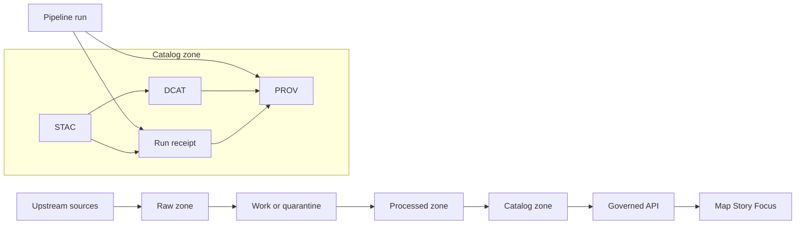

<!-- [KFM_META_BLOCK_V2]
doc_id: kfm://doc/a3f2dbb9-3bce-41a0-9975-62c1f2fe293a
title: Provenance runs
type: standard
version: v1
status: draft
owners: TBD
created: 2026-02-24
updated: 2026-02-24
policy_label: restricted
related:
  - ../../dcat/
  - ../../../stac/
  - ../../../prov/
  - ../
tags: [kfm, provenance, prov, run_receipts, audit]
notes:
  - This directory is append-only. Corrections should be made via superseding receipts, not edits in place.
[/KFM_META_BLOCK_V2] -->

# Provenance runs

**Purpose:** Append-only, machine-validated run receipts and PROV bundles for every governed pipeline run (and other governed operations) so KFM can *reproduce*, *audit*, and *cite* what happened.


---

## Navigate

- [What lives here](#what-lives-here)
- [Where this fits in KFM](#where-this-fits-in-kfm)
- [Directory layout](#directory-layout)
- [Run receipt contract](#run-receipt-contract)
- [Cross linking rules](#cross-linking-rules)
- [Validation and CI gates](#validation-and-ci-gates)
- [Operational rules](#operational-rules)
- [Troubleshooting](#troubleshooting)
- [Appendix](#appendix)

---

## What lives here

This folder is **for provenance artifacts only**:

| Artifact | Typical extension | Why it exists |
|---|---|---|
| Run receipt | `.run_receipt.json` (or `.json`) | Smallest “evidence object” describing a run: inputs/outputs/digests, environment, validation, and policy decision references. |
| PROV bundle for a run | `.prov.jsonld` (or `.jsonld`) | Standards-based lineage graph (Entities, Activities, Agents) for one run. |
| Optional supply-chain attachments | `.sig`, `.att.json`, `.intoto.jsonl` | Signatures/attestations that bind run receipts to toolchain outputs. |

### What does not live here

**Do not** put the following in this directory:

- Raw source data, processed datasets, tiles, indexes, or any large artifacts  
- Secrets, tokens, credentials, or unredacted logs  
- Ad-hoc “notes” that are not machine-validated records  
- Mutable “latest.json” pointers (use deterministic IDs and immutable files)

> [!WARNING]
> Treat everything in `data/catalog/prov/runs/` as governed evidence. Prefer **additive** changes (new receipts) over edits.

[Back to top](#provenance-runs)

---

## Where this fits in KFM

KFM uses a catalog triplet (DCAT + STAC + PROV). **This directory is the PROV run layer** that makes catalog entries auditable and reproducible.



[Back to top](#provenance-runs)

---

## Directory layout

Exact structure can vary by pipeline, but keep it **predictable** and **partitionable**.

```text
data/catalog/prov/runs/
  README.md
  YYYY/
    MM/
      <run_id>.run_receipt.json
      <run_id>.prov.jsonld
      <run_id>.validation.json        # optional, if stored here (otherwise referenced by digest)
      <run_id>.attestation.json       # optional
```

> [!NOTE]
> Default KFM layouts often store canonical PROV artifacts under `data/prov/` (for example, `data/prov/run_receipts/...`).
> If that is your canonical store, treat `data/catalog/prov/runs/` as a **catalog-facing projection** (generated or mirrored) and keep IDs and digests stable.

### File naming

Recommended filename pattern:

- `YYYY/MM/<run_id>.run_receipt.json`
- `YYYY/MM/<run_id>.prov.jsonld`

Where `run_id` is stable and globally unique, e.g. `kfm--2026-02-20T12-00-00Z--abcd1234`.

> [!NOTE]
> If you need to “fix” a receipt, **do not edit it in place**. Emit a *new* receipt and add a pointer like `supersedes_run_id`.

[Back to top](#provenance-runs)

---

## Run receipt contract

A run receipt is a **single JSON record** that answers:

- Who ran it  
- What operation it performed  
- Which inputs it used (by URI + digest)  
- Which outputs it produced (by URI + digest)  
- Which environment produced it (container digest, git commit, params digest)  
- Which validation result gated it  
- Which policy decision applied

### Minimal example

```json
{
  "run_id": "kfm://run/2026-02-20T12:00:00Z.abcd",
  "actor": { "principal": "svc:pipeline", "role": "pipeline" },
  "operation": "ingest+publish",
  "dataset_version_id": "2026-02.abcd1234",
  "inputs": [
    { "uri": "raw/source.csv", "digest": "sha256:1111" }
  ],
  "outputs": [
    { "uri": "processed/events.parquet", "digest": "sha256:2222" }
  ],
  "environment": {
    "container_digest": "sha256:img...",
    "git_commit": "deadbeef",
    "params_digest": "sha256:3333"
  },
  "validation": { "status": "pass", "report_digest": "sha256:7777" },
  "policy": { "decision_id": "kfm://policy_decision/xyz" },
  "created_at": "2026-02-20T12:05:00Z"
}
```

### Required fields

| Field | Required | Notes |
|---|---:|---|
| `run_id` | ✅ | Unique ID, ideally resolvable (for evidence resolution). |
| `actor.principal` | ✅ | Service identity, CI identity, or user principal. |
| `actor.role` | ✅ | Helps policy and audit. |
| `operation` | ✅ | Example: `fetch`, `ingest`, `normalize`, `publish`, `ingest+publish`. |
| `dataset_version_id` | ✅ | The dataset version this run produced or updated. |
| `inputs[].uri` | ✅ | Prefer repo-relative URIs or immutable object URIs. |
| `inputs[].digest` | ✅ | Must be a cryptographic digest (e.g., sha256). |
| `outputs[].uri` | ✅ | Same URI conventions as inputs. |
| `outputs[].digest` | ✅ | Must be a cryptographic digest (e.g., sha256). |
| `environment.container_digest` | ✅ | Container image digest used to run. |
| `environment.git_commit` | ✅ | Commit for pipeline code. |
| `environment.params_digest` | ✅ | Digest of run parameters (canonical JSON). |
| `validation.status` | ✅ | `pass` or `fail` (or an enum defined by your schema). |
| `validation.report_digest` | ✅ | Digest for a validation report artifact. |
| `policy.decision_id` | ✅ | Reference to the evaluated policy decision record. |
| `created_at` | ✅ | ISO-8601 UTC timestamp. |

### Optional fields

Use these when relevant, especially for HTTP-sourced ingest runs:

- `spec_hash`: digest of canonical pipeline spec or manifest
- `fetched_at`: time of fetch
- `accessURL`: source URL
- `etag`, `last_modified`: conditional request hints
- `fallback_used`: used cached artifact instead of fetching
- `cosign.signature_ref`, `cosign.attestation_ref`: supply-chain links

[Back to top](#provenance-runs)

---

## Cross linking rules

Cross-links make evidence navigation deterministic. **A promoted dataset version should allow a user (or agent) to traverse:**

- DCAT dataset → PROV bundle  
- STAC item → run receipt  
- Run receipt → the specific inputs and outputs by digest  
- Evidence references → these objects without guessing

### Link matrix

| From | To | How |
|---|---|---|
| DCAT dataset record | PROV bundle | `prov:wasGeneratedBy` or equivalent link to a PROV Activity bundle. |
| STAC collection | DCAT dataset | `links[]` with `rel="describedby"` (recommended). |
| STAC item | Run receipt | `links[]` pointing to a run receipt and/or PROV Activity. |
| STAC assets | Output artifact | `href` + `checksum` + `media_type` and a backlink to run receipt (preferred). |

> [!IMPORTANT]
> Rule of thumb: **every raw/processed artifact must point to exactly one run receipt**, and that receipt must be discoverable from DCAT and/or STAC.

[Back to top](#provenance-runs)

---

## Validation and CI gates

Receipts are only useful if they are **strictly validated** and **fail closed**.

### Minimum gates for this directory

- [ ] JSON Schema validation for receipts and PROV bundles  
- [ ] Policy checks (OPA/Rego + Conftest or equivalent) for required fields and safe URLs  
- [ ] Link checking across DCAT, STAC, and PROV objects  
- [ ] Digest verification for referenced artifacts (where artifacts are available in-repo or via resolvable URLs)  
- [ ] Secret scanning for accidental credential leakage

### Suggested local checks

If your repo includes validators, run them in CI and locally, e.g.:

```bash
# TODO: replace with the repo's actual validator entrypoints
make validate-prov
make validate-catalog
```

[Back to top](#provenance-runs)

---

## Operational rules

### Append only

This directory is an **audit ledger**. Treat it as append-only:

- Add new receipts for new runs  
- Supersede old receipts instead of editing  
- Never delete receipts for published datasets (unless a governance policy explicitly requires removal)

### Policy safe by default

- Receipts should reference policy decisions, not repeat sensitive content.  
- Avoid storing raw sensitive coordinates or unredacted PII in receipts.

### Deterministic IDs

Prefer stable IDs and stable digests:

- Canonicalize JSON → hash → use as `spec_hash` or `params_digest`  
- Keep “same inputs = same outputs” explainable, or record why not

[Back to top](#provenance-runs)

---

## Troubleshooting

### A dataset shows up in STAC or DCAT but has no provenance

- The promotion gate should fail: add a run receipt and PROV bundle for the dataset version.
- Ensure STAC items link to the receipt and DCAT links to PROV.

### A receipt exists but digests do not match

- Treat as a pipeline integrity failure.
- Re-run the pipeline, emit a new receipt, and supersede the old one.

### CI passes but evidence cannot be resolved in the UI

- Add or fix cross-links (STAC ↔ DCAT ↔ PROV).
- Ensure evidence resolver can locate receipts by stable ID and path.

[Back to top](#provenance-runs)

---

## Appendix

<details>
<summary>Receipt quality checklist</summary>

- All required fields present
- No secrets, tokens, or raw PII
- Every input/output has a digest
- Environment capture complete (container + commit + params digest)
- Validation report exists and is referenced by digest
- Policy decision reference exists
- Cross-links resolve from STAC/DCAT to this receipt

</details>
