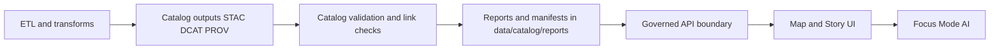

<!-- [KFM_META_BLOCK_V2]
doc_id: kfm://doc/30f2b4c3-ad6a-4c82-921f-e995e72edd40
title: data/catalog/reports
type: standard
version: v1
status: draft
owners: TODO: assign owners (data platform / catalog maintainers)
created: 2026-02-24
updated: 2026-02-24
policy_label: public
related:
  - TODO: ../../README.md
  - TODO: ../README.md
  - TODO: ../../prov/README.md
  - TODO: ../../stac/README.md
  - TODO: ../../catalog/dcat/README.md
  - TODO: ../../../docs/governance/REVIEW_GATES.md
tags: [kfm, data, catalog, reports, governance, provenance]
notes:
  - "Directory runbook for evidence-bound catalog + promotion reports."
[/KFM_META_BLOCK_V2] -->

<a id="top"></a>

# `data/catalog/reports/`
**Purpose:** versioned, evidence-bound reports that explain and justify catalog outputs and promotion decisions (schema checks, link checks, diffs, manifests), without mixing in narrative content.

<!-- TODO: wire badges to real workflows/paths once CI + repo URLs are known -->


## Quick navigation
- [What lives here](#what-lives-here)
- [Where this fits in KFM](#where-this-fits-in-kfm)
- [Recommended directory layout](#recommended-directory-layout)
- [Report types registry](#report-types-registry)
- [Report contract](#report-contract)
- [Governance, sensitivity, and redaction](#governance-sensitivity-and-redaction)
- [How to add or update a report](#how-to-add-or-update-a-report)
- [FAQ](#faq)

---

## What lives here
This folder is for **reports about catalogs and promotion**, typically produced by CI/pipelines and reviewed in PRs.

✅ **Acceptable inputs**
- Catalog validation outputs (schema validation summaries for STAC/DCAT/PROV; link-resolution checks; cross-link audits).
- Dataset version **diff reports** (“what changed?”) comparing two DatasetVersions.
- **Promotion manifests** and checklists used to propose/approve promotion of a dataset version.
- Evidence bundle summaries that help the **Evidence Resolver / governed API layer** explain *why* an artifact is publishable.
- Human-readable Markdown summaries *paired with* machine-readable JSON/YAML artifacts.

🚫 **Exclusions**
- No raw datasets, extracts, or sample dumps (those belong in `data/<domain>/raw|work|processed`).
- No authoritative catalog artifacts:
  - STAC content belongs under `data/stac/...`
  - DCAT outputs belong under `data/catalog/dcat/...`
  - PROV bundles / run receipts belong under `data/prov/...`
- No narrative “Story Nodes” (those belong under `docs/reports/story_nodes/...`).
- No secrets, tokens, credentials, or private keys (ever).

> **NOTE:** Think of this directory as the “paper trail” that makes catalog + promotion decisions auditable and reviewable.

[Back to top](#top)

---

## Where this fits in KFM
KFM’s non-negotiable ordering is: **ETL → catalogs (STAC/DCAT/PROV) → graph → APIs → UI → Story Nodes → Focus Mode**.  
This directory supports the **catalog** and **promotion** portions of that pipeline by storing *reviewable* evidence that catalogs are valid and promotion gates passed.



[Back to top](#top)

---

## Recommended directory layout
> **Proposed layout** (adjust to match actual lane/job IDs and naming conventions used in your pipelines).

```text
data/
└─ catalog/
   └─ reports/                                     # Catalog/reporting outputs (validation + diffs + promotion evidence)
      ├─ README.md                                  # How reports are generated, stored, and referenced by CI/runbooks
      │
      ├─ validation/                                # Validator run outputs (per standard)
      │  ├─ stac/
      │  │  └─ <job_or_run_id>/                     # One validator execution (stable run/job id)
      │  │     ├─ summary.md                        # Human summary (pass/fail + key errors + links)
      │  │     └─ results.json                      # Machine results (full findings; diff-friendly)
      │  ├─ dcat/
      │  │  └─ <job_or_run_id>/
      │  │     ├─ summary.md
      │  │     └─ results.json
      │  └─ prov/
      │     └─ <job_or_run_id>/
      │        ├─ summary.md
      │        └─ results.json
      │
      ├─ dataset_versions/                          # Per dataset+version reports (diffs, promotion packets, evidence bundles)
      │  └─ <dataset_slug>/
      │     └─ <dataset_version_id>/                # Version identifier (content-addressed preferred)
      │        ├─ diff/                              # Version-to-version diffs (what changed + why it matters)
      │        │  ├─ diff.md                         # Human diff summary (high-signal changes + risk notes)
      │        │  └─ diff.json                       # Machine diff (structured; used by materiality rules)
      │        │
      │        ├─ promotion/                         # Promotion packet (what was checked + what was approved)
      │        │  ├─ manifest.json                   # Promotion manifest (inputs, outputs, receipts, checksums)
      │        │  └─ checklist.md                    # Human checklist (review gates, approvals, sign-off)
      │        │
      │        └─ evidence/                          # Evidence bundle references for this dataset version
      │           ├─ bundle.json                     # Machine bundle descriptor (digests/refs/contents)
      │           └─ bundle.md                       # Human-readable bundle notes (what to review, where to click)
      │
      └─ _templates/                                # Report templates/examples (copy/paste starters)
         ├─ report_index.example.yml                # Example report index entry (naming + metadata)
         ├─ promotion_manifest.example.json         # Example promotion manifest (structure + required fields)
         └─ diff_report.example.json                # Example diff report (structure + materiality fields)
```

### Naming guidance
- Prefer **stable identifiers**:
  - `dataset_slug` (human stable)
  - `dataset_version_id` (immutable)
  - `run_id` / `job_id` (immutable)
- Prefer **append-only** directories (do not overwrite history). If you need to supersede a report, write a new version and link to it.

[Back to top](#top)

---

## Report types registry
| Report type | Primary audience | Format | Typical gate it supports | Example filename(s) |
|---|---|---|---|---|
| Catalog validation | CI + reviewers | `json` + `md` | Schema-valid STAC/DCAT/PROV | `validation/stac/<run>/results.json` |
| Link resolution | CI + API maintainers | `json` + `md` | “All links resolve” / EvidenceRefs resolve | `validation/<kind>/<run>/links.json` |
| DatasetVersion diff | Reviewers + release mgrs | `json` + `md` | “What changed?” | `dataset_versions/<slug>/<ver>/diff/diff.json` |
| Promotion manifest | Release mgrs + CI | `json` + `md` | Promotion contract checklist | `dataset_versions/<slug>/<ver>/promotion/manifest.json` |
| Evidence bundle summary | API + UI | `json` + `md` | Evidence drawer completeness | `dataset_versions/<slug>/<ver>/evidence/bundle.json` |

[Back to top](#top)

---

## Report contract
All reports in this directory **SHOULD** include enough information to be:
- **Auditable:** a reviewer can tell *what happened* and *why it passed/failed*
- **Reproducible:** a maintainer can rerun the same checks deterministically
- **Traceable:** a consumer can navigate from a surfaced claim back to evidence

### Minimum fields (for machine-readable reports)
Use this as a baseline for JSON/YAML reports:

```json
{
  "report_id": "kfm://report/<opaque-or-digest>",
  "report_kind": "catalog_validation|link_check|dataset_diff|promotion_manifest|evidence_bundle",
  "created_at": "2026-02-24T00:00:00Z",
  "producer": {
    "principal": "svc:pipeline",
    "tool": "TODO",
    "tool_version": "TODO",
    "git_commit": "TODO"
  },
  "scope": {
    "dataset_slug": "TODO",
    "dataset_version_id": "TODO",
    "run_id": "TODO"
  },
  "inputs": [
    { "uri": "TODO", "digest": "sha256:..." }
  ],
  "outputs": [
    { "uri": "TODO", "digest": "sha256:..." }
  ],
  "policy": {
    "policy_label": "public|restricted|...",
    "decision_id": "kfm://policy_decision/TODO"
  },
  "result": {
    "status": "pass|fail",
    "summary": "Short human summary",
    "checks": [
      { "check_id": "TODO", "status": "pass|fail", "detail": "TODO" }
    ]
  }
}
```

### Markdown reports
If you create human-readable summaries, prefer:
- A 1–3 sentence **executive summary**
- A short **check matrix**
- A section called **Evidence pointers** with the *paths and digests* of the referenced artifacts

[Back to top](#top)

---

## Governance, sensitivity, and redaction
This folder can easily leak sensitive information if used carelessly.

### Hard rules
- **Default-deny when uncertain:** if sensitivity is unclear, do not publish detailed outputs here; write a redacted summary and reference restricted evidence elsewhere.
- **No precise locations for vulnerable/culturally restricted sites** in report payloads. Use generalized geography and document the redaction decision.
- Always include a `policy_label` and (when applicable) a `decision_id` for redactions/obligations.

> **WARNING:** Reports are often “derived data.” Treat them as governed artifacts, not as casual logs.

[Back to top](#top)

---

## How to add or update a report
### Definition of Done (DoD)
- [ ] Report is written to an **append-only** location (no history destruction)
- [ ] Machine-readable artifact includes the **minimum fields** in [Report contract](#report-contract)
- [ ] Referenced inputs/outputs include **digests**
- [ ] Report clearly states **pass/fail** and includes a short reason
- [ ] If sensitive: report is redacted + `policy_label` and `decision_id` are recorded
- [ ] Paths match the agreed directory layout (or a documented deviation exists)

### Suggested review checklist (PR-friendly)
- [ ] Does the report link to the exact STAC/DCAT/PROV assets it validated?
- [ ] Are “what changed?” diffs understandable to a human reviewer?
- [ ] Are promotion gates explicitly satisfied (or explicitly failed) with evidence pointers?

[Back to top](#top)

---

## FAQ
### Is this the same as `docs/reports/story_nodes/`?
No. Story Nodes are governed narrative artifacts. This directory is for **catalog/promotion evidence reports**.

### Where do run receipts live?
Run receipts and authoritative lineage bundles belong under `data/prov/` (this directory can include *summaries* or *pointers* if useful).

### Can we delete old reports?
Prefer **no**. Reports are part of the audit trail. If retention policies require cleanup, document:
- retention rule,
- what was removed,
- how to reproduce.

[Back to top](#top)

---

<details>
<summary><strong>Appendix: Example report index</strong></summary>

```yaml
# report_index.example.yml
dataset_slug: soils
dataset_version_id: 2026-02.abcd1234
reports:
  - kind: dataset_diff
    path: diff/diff.json
    digest: sha256:...
  - kind: promotion_manifest
    path: promotion/manifest.json
    digest: sha256:...
  - kind: catalog_validation
    path: ../../validation/stac/2026-02-20T12_00_00Z.abcd/results.json
    digest: sha256:...
```

</details>
