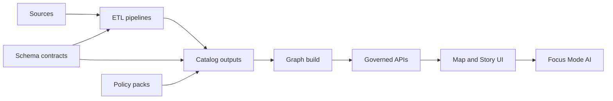

<!-- [KFM_META_BLOCK_V2]
doc_id: kfm://doc/a57b56fa-1e2b-485b-b5d9-d0b7d862dd16
title: data/catalog/schemas — Catalog schema contracts
type: standard
version: v1
status: draft
owners: TBD
created: 2026-02-24
updated: 2026-02-24
policy_label: TBD
related:
  - ../README.md
  - ../../../schemas/README.md  # TODO: confirm canonical schema location
tags: [kfm, data, catalog, schemas, contracts]
notes:
  - This directory documents schema contracts used to validate catalog artifacts and dataset interfaces.
  - If the repo follows the v13 layout, canonical schemas likely live under /schemas and this folder may hold pinned snapshots for releases/validation.
[/KFM_META_BLOCK_V2] -->

# data/catalog/schemas
**One-line purpose:** Versioned schema contracts used to validate catalog artifacts (STAC/DCAT/PROV) and dataset interfaces before promotion.


> ✅ Goal: make every machine-checked claim *traceable* — schemas are the contract that lets CI and Focus Mode “fail closed” when an artifact drifts.

---

## Quick navigation
- [What belongs here](#what-belongs-here)
- [Where this fits in KFM](#where-this-fits-in-kfm)
- [Schema namespace matrix](#schema-namespace-matrix)
- [Folder conventions](#folder-conventions)
- [Schema requirements](#schema-requirements)
- [Add or update a schema](#add-or-update-a-schema)
- [CI and promotion gates](#ci-and-promotion-gates)
- [Suggested directory tree](#suggested-directory-tree)
- [FAQ](#faq)
- [Appendix: schema template](#appendix-schema-template)

---

## What belongs here

### ✅ Acceptable inputs
This folder may contain **schema contracts** that are used to validate:

- **Catalog artifacts** (examples: STAC Items/Collections, DCAT JSON-LD, PROV bundles)
- **Run receipts / audit records** emitted by pipelines
- **Governance registries** (example: signed allow-lists for automation/watchers)
- **Dataset interface schemas** (published “shape” of released CSV/JSON/GeoJSON/Parquet tables, etc.)
- **Controlled vocab / profile constraints** that must be enforced in CI

### ❌ Exclusions
Do **not** put these here:

- Raw/working/processed data
- Narrative content (Story Nodes)
- Runtime secrets, credentials, API keys
- Any example payloads that contain sensitive info (PII, precise vulnerable site coordinates, culturally restricted knowledge)
- Tooling code (validators, generators) — those belong in `tools/` or `src/`

> WARNING: If sensitivity is unclear, default to **redacted examples** and mark for governance review.

[Back to top](#datacatalogschemas)

---

## Where this fits in KFM

Schemas are “contract glue” across the end-to-end trust path: pipelines emit artifacts, validators check them against schemas + policies, and only then do artifacts get promoted and consumed downstream.



### Canonical location note
If your repository follows the v13 layout, canonical JSON Schemas may live under a top-level `schemas/` directory and `data/catalog/` may contain **catalog outputs**. If so, treat this folder as:

- a **pinned snapshot** of schemas used for validation of `data/catalog/**` artifacts, and/or
- a **release-bundle companion** (so a release can ship “artifacts + schemas” together)

[Back to top](#datacatalogschemas)

---

## Schema namespace matrix

> This table is a **recommended** starting point — edit it to match your repo’s actual schema set.

| Namespace | What it validates | Example filename | Typical consumers |
|---|---|---|---|
| `stac/` | STAC Items / Collections + KFM STAC profile constraints | `stac/item.v1.schema.json` | STAC validator, CI, API ingest |
| `dcat/` | DCAT datasets/catalogs + KFM DCAT profile constraints | `dcat/dataset.v1.schema.json` | DCAT validator, CI, publishing |
| `prov/` | PROV bundles and run lineage objects | `prov/bundle.v1.schema.json` | PROV validator, CI, audits |
| `receipts/` | Run receipts / audit records | `receipts/run_receipt.v1.schema.json` | CI gates, provenance tooling |
| `watchers/` | Signed allow-lists for automated fetchers | `watchers/watcher.v1.schema.json` | CI gates, automation registry |
| `datasets/<dataset_slug>/` | Per-data-product “released interface” schemas | `<dataset_slug>.v1.schema.json` | Consumers, QA, docs, APIs |

[Back to top](#datacatalogschemas)

---

## Folder conventions

### Naming
Use **stable, versioned filenames**:

- `snake_case` for names and directories
- `v<major>` or `v<major>.<minor>` when versions are intended to be referenced externally

Examples (illustrative):
- `dcat/dataset.v1.schema.json`
- `stac/item.v1.schema.json`
- `prov/bundle.v1.schema.json`
- `watchers/watcher.v1.schema.json`

### `$id` and portability
When possible, ensure every schema has a stable `$id` so it can be referenced consistently in:

- release manifests
- run receipts (as `schema_url`)
- validators
- generated documentation

### Compatibility expectations
Document (in the schema `description` or in an adjacent `*.md` note):

- **Backward-compatible** changes: adding optional properties, widening enums (carefully), etc.
- **Breaking** changes: removing/renaming fields, tightening types, changing required fields

> TIP: Prefer additive changes + new major versions over “silent tightening” of existing schemas.

[Back to top](#datacatalogschemas)

---

## Schema requirements

Minimum baseline for JSON Schemas stored here:

- Must declare `$schema` (prefer `https://json-schema.org/draft/2020-12/schema`)
- Must declare a stable `$id`
- Should set `additionalProperties: false` for governed records (unless intentionally extensible)
- Must clearly specify `required` properties for promoted artifacts
- Must avoid embedding sensitive examples inline

Recommended extras:

- `title`, `description`
- `examples` that are synthetic / redacted
- `pattern` constraints for IDs (to keep IDs parseable and auditable)
- explicit `format` usage where meaningful (e.g., `uri`, `date-time`)

[Back to top](#datacatalogschemas)

---

## Add or update a schema

### Definition of Done
- [ ] Schema lives in the correct namespace folder (or a new namespace is documented)
- [ ] Schema filename and `$id` are stable and versioned
- [ ] Schema is deterministic (no dependence on key ordering, no environment-specific behavior)
- [ ] A minimal set of fixtures exists (synthetic/redacted) to prove validation works
- [ ] CI validators run on changed schema + affected artifacts
- [ ] If the schema is used for promotion gating, policy checks are updated accordingly
- [ ] Release notes mention breaking changes (if any)

### Suggested workflow
1. **Draft** the schema (start from the template in the Appendix).
2. Add/refresh **fixtures** (valid + invalid cases).
3. Update any **schema registry index** used by tooling (if present in this repo).
4. Run local validation (example tools: `ajv`, `jsonschema`, `spectral`, etc.).
5. Submit PR — CI should validate both schema *and* any touched artifacts.

[Back to top](#datacatalogschemas)

---

## CI and promotion gates

This directory exists to support **fail-closed** governance:

- CI should validate catalog artifacts (STAC/DCAT/PROV) against the relevant schemas.
- CI should also check **cross-links** (e.g., DCAT ↔ STAC ↔ PROV references) where required.
- Policy packs should default to **deny** and only allow promotion when required evidence exists.

> NOTE: Exact validator locations/commands are repo-specific; document them here once implemented.

[Back to top](#datacatalogschemas)

---

## Suggested directory tree

> This is a **recommended** structure. Adjust to your repo’s actual layout and delete what you don’t use.

```
data/catalog/schemas/                              # Catalog + governance schema registry (validators + CI gates)
├─ README.md                                       # How schemas are organized, versioned, and referenced by validators
│
├─ stac/                                           # STAC Item/Collection schemas + KFM profile constraints
├─ dcat/                                           # DCAT dataset/catalog schemas + KFM profile constraints
├─ prov/                                           # PROV bundle schemas (lineage prerequisites)
│
├─ receipts/                                       # Operational governance schemas (run_receipt, audit record, etc.)
├─ watchers/                                       # Watcher registry allow-list schemas (signed/validated objects)
│
└─ datasets/                                       # Dataset “data product” schemas (domain-specific contracts)
   └─ <dataset_slug>/                              # One folder per dataset product family
      ├─ <dataset_slug>.v1.schema.json             # Dataset product schema (v1; versioned, backward-compat notes)
      └─ notes.md                                  # Optional: rationale + compatibility notes + migration guidance
```

[Back to top](#datacatalogschemas)

---

## FAQ

### Why schemas in `data/catalog/schemas/` instead of `/schemas/`?
**Proposed convention:** keep canonical schemas in `/schemas/`, and keep **pinned snapshots** here if you need a self-contained `data/catalog/` bundle (artifacts + schemas) for releases or offline validation.

**Unknown:** your repo’s actual convention. Verify by checking where validators reference schema paths.

### Can we store Avro/Parquet/SQL DDL schemas here?
Yes, if they are treated as **governed contracts** and validators exist. If you add non-JSON-Schema formats, extend this README with:
- naming conventions
- validator commands
- compatibility expectations

[Back to top](#datacatalogschemas)

---

## Appendix: schema template

<details>
<summary>Click to expand</summary>

> Use this as a starting point. Keep examples synthetic/redacted.

```json
{
  "$id": "https://kfm.example.org/schemas/<name>.v1.schema.json",
  "$schema": "https://json-schema.org/draft/2020-12/schema",
  "title": "<Human friendly title>",
  "type": "object",
  "additionalProperties": false,
  "required": ["id", "version"],
  "properties": {
    "id": { "type": "string", "pattern": "^[a-z0-9:_-]+$" },
    "version": { "type": "string", "pattern": "^v[0-9]+(\\.[0-9]+)?$" }
  }
}
```

</details>
