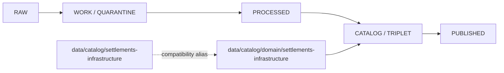

<!-- [KFM_META_BLOCK_V2]
doc_id: kfm://doc/data-catalog-settlements-infrastructure-readme
title: data/catalog/settlements-infrastructure/README.md — Settlements/Infrastructure Catalog Compatibility README
version: v0.1
type: readme; data-lifecycle-sublane; compatibility-segment-note
status: draft; PROPOSED; COMPATIBILITY-ALIAS; data-root; catalog-stage; settlements-infrastructure; release-gated
owners: OWNER_TBD — Settlements/Infrastructure steward · Data steward · Catalog steward · Evidence steward · Policy steward · Release steward · Docs steward
created: NEEDS VERIFICATION — placeholder existed before v0.1 expansion
updated: 2026-06-25
policy_label: public-doc; data; catalog; compatibility-alias; settlements-infrastructure; lifecycle; release-gated
tags: [kfm, data, catalog, settlements-infrastructure, compatibility-alias, CATALOG, TRIPLET, EvidenceBundle, SourceDescriptor, ReleaseManifest]
related:
  - ../README.md
  - ../../README.md
  - ./domain/settlements-infrastructure/README.md
  - ./domain/settlement/README.md
  - ../../docs/domains/settlements-infrastructure/README.md
  - ../../docs/domains/settlements-infrastructure/CANONICAL_PATHS.md
  - ../proofs/
  - ../receipts/
  - ../published/
  - ../registry/
  - ../../release/
notes:
  - "This file replaces a placeholder at `data/catalog/settlements-infrastructure/README.md`."
  - "The governed domain catalog lane is `data/catalog/domain/settlements-infrastructure/`; this top-level catalog path is a compatibility alias only."
  - "This folder must not become a parallel domain catalog authority, proof store, source registry, release root, schema root, policy root, published-output root, or implementation root."
  - "Rollback target for this replacement is previous placeholder blob SHA `e25f1814e51579d5f55c0f1fe0135ddb28a47f4a`."
[/KFM_META_BLOCK_V2] -->

<a id="top"></a>

# data/catalog/settlements-infrastructure

> Compatibility README for the top-level `data/catalog/settlements-infrastructure/` path. The governed Settlements/Infrastructure catalog lane remains `data/catalog/domain/settlements-infrastructure/`.

<p>
  
  
  
  
  
</p>

**Status:** draft / PROPOSED / COMPATIBILITY-ALIAS  
**Path:** `data/catalog/settlements-infrastructure/README.md`  
**Compatibility form:** top-level catalog domain alias  
**Governing catalog lane:** `data/catalog/domain/settlements-infrastructure/`  
**Lifecycle stage:** `CATALOG / TRIPLET`  
**Exposure posture:** release-gated; no public use without approved release linkage  
**Truth posture:** CONFIRMED target was a placeholder · CONFIRMED `data/catalog/` is the CATALOG-stage parent lane · CONFIRMED `data/catalog/domain/settlements-infrastructure/` is the governed Settlements/Infrastructure catalog lane · NEEDS VERIFICATION for whether this top-level alias should remain, redirect, or be removed by migration.

## Purpose

`data/catalog/settlements-infrastructure/` is a compatibility alias for users or scripts that reach for a direct domain folder under `data/catalog/`.

It must point back to the governed lane:

```text
data/catalog/domain/settlements-infrastructure/
```

This file does not establish a new catalog authority. It does not replace the governed domain lane and does not approve publication.

## Lifecycle boundary



## Repo fit

| Responsibility | Correct home | Rule |
|---|---|---|
| Settlements/Infrastructure domain catalog records | `data/catalog/domain/settlements-infrastructure/` | Governing lane. |
| Top-level compatibility alias | `data/catalog/settlements-infrastructure/` | This README and approved alias notes only. |
| Settlement short-segment alias | `data/catalog/domain/settlement/` | Conflict-tracked alias only. |
| Parent catalog stage | `data/catalog/` | Parent CATALOG-stage lane. |
| Evidence/proof records | `data/proofs/` | Not this lane. |
| Source registry | `data/registry/` | Not this lane. |
| Receipts | `data/receipts/` | Not this lane. |
| Release decisions | `release/` | Not this lane. |
| Published products | `data/published/` | Not this lane. |
| Schemas and policy | `schemas/`, `policy/` | Not this lane. |
| Code/tests | implementation roots and test roots | Not this lane. |

## Accepted contents

- This README.
- Migration notes or crosswalks explaining this top-level alias to `data/catalog/domain/settlements-infrastructure/`.
- Pointers to the governed Settlements/Infrastructure catalog lane.
- Nothing else unless a future ADR/path-map/migration note explicitly allows it.

## Exclusions

- Domain catalog records that should live under `data/catalog/domain/settlements-infrastructure/`.
- RAW, WORK, QUARANTINE, PROCESSED, or PUBLISHED data.
- EvidenceBundle/proof records.
- SourceDescriptor/source-registry records.
- Receipts.
- Release decisions.
- Semantic contracts, schemas, policy rules, validators, tests, packages, pipelines, app/UI/API code.
- Any public exposure shortcut around the governed domain lane.

## Guardrails

- Do not treat this top-level alias as canonical.
- Do not duplicate catalog records in both this folder and `data/catalog/domain/settlements-infrastructure/`.
- Do not weaken source-role, evidence, sensitivity, review, policy, release, correction, or rollback controls.
- Do not add child lanes here as a convenience bucket.
- Mark any future retention of this path as PROPOSED until there is an ADR, path map, migration note, and rollback note.

## Evidence ledger

| Source | Status | Supports | Limits |
|---|---|---|---|
| Previous file | CONFIRMED | Target existed as a placeholder. | Did not define lane boundaries. |
| `data/catalog/README.md` | CONFIRMED | CATALOG-stage parent lane and RELEASED ONLY posture. | Does not prove this alias should remain. |
| `data/catalog/domain/settlements-infrastructure/README.md` | CONFIRMED | Governed Settlements/Infrastructure catalog lane and alias boundaries. | Does not authorize a parallel top-level lane. |

## Validation checklist

- [ ] Confirm whether `data/catalog/settlements-infrastructure/` should exist at all.
- [ ] Confirm whether this path should remain as compatibility, redirect, or be removed.
- [ ] Confirm no catalog records are duplicated here.
- [ ] Confirm migration tooling, docs links, and rollback notes if this alias is retained.
- [ ] Confirm future child aliases are blocked unless ADR/path-map/migration notes exist.

## Rollback

Rollback is required if this lane becomes a parallel catalog authority, source-data root, proof store, source-registry root, release-decision root, published-output root, schema root, policy root, validator root, implementation root, public API shortcut, or public exposure shortcut.

Rollback target for this replacement: previous placeholder blob SHA `e25f1814e51579d5f55c0f1fe0135ddb28a47f4a`.

<p align="right"><a href="#top">Back to top</a></p>
