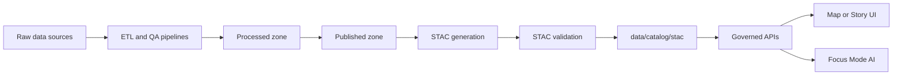

<!-- [KFM_META_BLOCK_V2]
doc_id: kfm://doc/54c73a4c-dab6-466b-baaa-bf73393c260c
title: STAC Catalogs
type: standard
version: v1
status: draft
owners: kfm-data-team
created: 2026-02-24
updated: 2026-02-24
policy_label: public
related:
  - kfm://doc/TODO-data-governance
  - kfm://doc/TODO-publishing-runbook
tags: [kfm, stac, catalog, metadata, geospatial]
notes:
  - This README is repository-facing documentation for file-based STAC objects stored under data/catalog/stac/.
  - Replace TODO placeholders once repo wiring (pipelines, CI gates, owners) is confirmed.
[/KFM_META_BLOCK_V2] -->

# STAC Catalogs (data/catalog/stac/)
**Purpose:** Governed, file-based [SpatioTemporal Asset Catalog (STAC)](https://stacspec.org/) objects used to *discover* published geospatial assets without directly exposing storage backends.


---

## Quick links
- [What belongs here](#what-belongs-here)
- [Directory layout](#directory-layout)
- [STAC object model](#stac-object-model)
- [Validation and quality gates](#validation-and-quality-gates)
- [Publishing workflow](#publishing-workflow)
- [Governance and safety](#governance-and-safety)
- [Examples](#examples)
- [Appendix](#appendix)

---

## What belongs here
This folder contains **STAC JSON** describing *published* datasets and assets:

- **Catalogs**: navigational structure (root + subcatalogs)
- **Collections**: dataset-level metadata (spatial/temporal extent, license, providers, etc.)
- **Items**: per-asset/per-scene metadata (geometry/bbox/time + links to assets)

✅ **Store metadata + links**  
❌ **Do not store raw data assets** (rasters, vectors, point clouds) here.

> [!NOTE]
> This directory is intended for **file-based STAC** (static JSON). A STAC API service may ingest these files, but the API implementation is out of scope for this folder.

### Exclusions (must not go here)
- Raw/processed datasets (anything “big” or non-JSON)
- Secrets (signed URLs, tokens, embedded credentials)
- Private/vulnerable site coordinates without redaction approval
- One-off “scratch” catalogs without provenance and validation

---

## Where this fits in the repo
This directory is part of the governed discovery layer:



**Invariant:** Clients/UI/AI should reach datasets **through governed APIs**, not by reading storage directly.

---

## Directory layout
Because the repo tree is not yet confirmed in this chat, the layout below is a **recommended** structure.

```text
data/catalog/stac/                                 # STAC discovery catalog (Collections + Items + optional sub-catalogs)
├─ README.md                                       # STAC profile notes, required links, and validation expectations
├─ catalog.json                                    # Recommended root STAC Catalog (entrypoint for discovery)
│
├─ collections/                                   # STAC Collections (groupings by dataset/topic/region)
│  └─ <collection-id>/                             # Stable collection identifier (kebab/snake-case)
│     ├─ collection.json                           # STAC Collection (extent, license, providers, links)
│     ├─ items/                                    # STAC Items for this collection
│     │  └─ <item-id>.json                         # One item per file (assets, geometry, datetime)
│     └─ assets/                                   # Optional: tiny derived artifacts only (e.g., thumbnails)
│
└─ catalogs/                                       # Optional sub-catalogs (partition large holdings)
   └─ <topic-or-area>/                             # Partition key (topic/area/time bucket)
      └─ catalog.json                              # Sub-catalog entrypoint (links to collections/items beneath)
```

### Naming conventions
- `id` values: lowercase, hyphen-separated (`landsat-c2-l2`, `city-parcels-2025`)
- Filenames:
  - `catalog.json` for Catalogs
  - `collection.json` for Collections
  - `<item-id>.json` for Items
- Keep **IDs stable**. If you must change semantics, create a new collection ID rather than mutating meaning in-place.

---

## STAC object model
| Object | What it represents | Minimum expectations in this repo |
|---|---|---|
| **Catalog** | A navigable node organizing Collections/Items | `stac_version`, `id`, `description`, `links` |
| **Collection** | Dataset-level description of a set of Items | Everything from Catalog **plus** dataset metadata (extent, license, etc.) |
| **Item** | Atomic unit describing one or more assets | GeoJSON Feature + `properties.datetime` (or start/end) + `assets` |

> [!TIP]
> Prefer **relative links** inside the repo (for file catalogs) so catalogs remain portable across environments.

---

## Validation and quality gates
### Required checks (should be CI-enforced)
- **STAC schema validation** for every JSON file (Catalog/Collection/Item)
- **Link integrity**: internal relative links resolve; external links are allowed but must be stable
- **Policy compliance**: required `license`, `providers`, and sensitivity handling (see [Governance and safety](#governance-and-safety))
- **Promotion-gate receipt**: a machine-readable record proving the dataset passed QA before it appears in STAC

### Example local validation commands
> These are examples; use the repo’s actual tooling once confirmed.

**Python (stac-validator):**
```bash
python -m pip install stac-validator
stac-validator --recursive data/catalog/stac/catalog.json
```

**Python (PySTAC):**
```bash
python -m pip install pystac
python -c "import pystac; pystac.Catalog.from_file('data/catalog/stac/catalog.json').validate_all()"
```

---

## Publishing workflow
### 1) Create or update a Collection
1. Create `collections/<collection-id>/collection.json`
2. Ensure it includes:
   - `id`, `title`, `description`
   - `license`
   - `extent` (spatial bbox + temporal interval)
   - `links` (parent/root + item links or child catalog links)
3. Add a link from the root `catalog.json` to the Collection.

### 2) Add Items
1. Create `collections/<collection-id>/items/<item-id>.json`
2. Ensure each Item includes:
   - Valid GeoJSON `geometry` + `bbox`
   - `properties.datetime` (or start/end)
   - `assets` entries that point to **Published zone** artifacts (not Raw/Work)
3. Link items from the Collection (either `item` links, or via a child catalog).

### 3) Prove promotion eligibility (trust membrane)
An Item/Collection should not be published here unless you can trace:

- **Source identity** (dataset name, provider, version)
- **License** and usage constraints
- **Spatial/temporal extents**
- **Validation results** (QA thresholds met)
- **Provenance** (inputs → transforms → outputs, including tool versions)
- **Checksums** for published assets
- **Audit record** (who/what/when/why)

> [!WARNING]
> If sensitivity/permissions are unclear, **default-deny**: redact or generalize and flag for governance review. Do not publish precise coordinates for vulnerable or culturally restricted sites.

---

## Governance and safety
### Policy labels
Every Collection must be assignable to a policy label (e.g., `public`, `restricted`, `internal`).  
If your governance model requires it, represent policy via one of:
- `collection.properties["kfm:policy_label"]` (custom field), or
- a dedicated extension (preferred if standardized), or
- a sidecar registry (TODO: confirm repo pattern)

### Sensitive or vulnerable locations
When representing vulnerable/private/culturally restricted sites:
- Use **coarse geometry** (e.g., bounding region) instead of exact coordinates
- Avoid linking to assets that reveal precise locations
- Record the redaction decision in the audit trail (who approved, what changed)

---

## Examples
### Minimal root Catalog (catalog.json)
```json
{
  "type": "Catalog",
  "stac_version": "1.0.0",
  "id": "kfm-root",
  "description": "Root catalog for Kansas-Matrix-System published holdings.",
  "links": [
    { "rel": "self", "href": "./catalog.json", "type": "application/json" },
    { "rel": "child", "href": "./collections/example/collection.json", "type": "application/json" }
  ]
}
```

### Minimal Collection (collection.json)
```json
{
  "type": "Collection",
  "stac_version": "1.0.0",
  "id": "example",
  "title": "Example dataset",
  "description": "Example collection for documentation.",
  "license": "other",
  "extent": {
    "spatial": { "bbox": [[-180, -90, 180, 90]] },
    "temporal": { "interval": [["2020-01-01T00:00:00Z", null]] }
  },
  "links": [
    { "rel": "self", "href": "./collection.json", "type": "application/json" },
    { "rel": "root", "href": "../../catalog.json", "type": "application/json" }
  ]
}
```

### Minimal Item (items/<item-id>.json)
```json
{
  "type": "Feature",
  "stac_version": "1.0.0",
  "id": "example-item-0001",
  "geometry": {
    "type": "Polygon",
    "coordinates": [[[0,0],[1,0],[1,1],[0,1],[0,0]]]
  },
  "bbox": [0, 0, 1, 1],
  "properties": {
    "datetime": "2024-01-01T00:00:00Z"
  },
  "links": [
    { "rel": "self", "href": "./example-item-0001.json", "type": "application/json" },
    { "rel": "collection", "href": "../collection.json", "type": "application/json" }
  ],
  "assets": {
    "data": {
      "href": "TODO:published://path/to/asset",
      "type": "application/octet-stream",
      "roles": ["data"]
    }
  }
}
```

---

## Appendix
### Suggested CI checklist
- [ ] Validate all STAC JSON (schema)
- [ ] Validate internal relative links resolve
- [ ] Enforce required metadata for Collections (license, extent, providers)
- [ ] Ensure assets point only to Published zone
- [ ] Generate/update a machine-readable audit receipt for each publish

### Common pitfalls
- Broken relative links after moving folders
- Unstable IDs that change when a pipeline re-runs
- Publishing Items without a corresponding Collection
- Leaking signed URLs or private bucket locations into `assets.href`

---

**Back to top:** [↑](#stac-catalogs-datacatalogstac)
