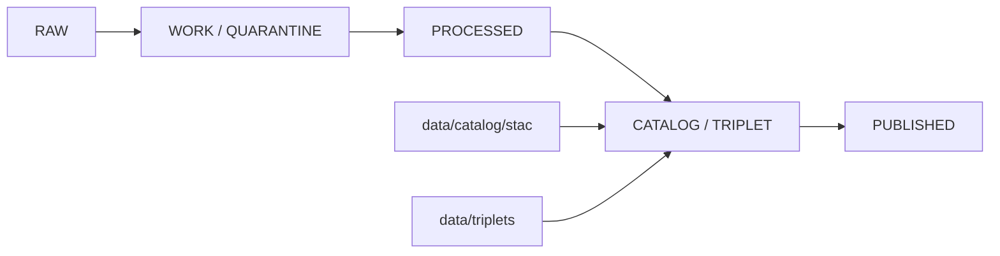

<!-- [KFM_META_BLOCK_V2]
doc_id: kfm://doc/data-catalog-stac-readme
title: data/catalog/stac/README.md — STAC Catalog Sublane README
version: v0.1
type: readme; data-lifecycle-sublane; stac-catalog-guide
status: draft; PROPOSED; data-root; catalog-stage; stac; release-gated; spatiotemporal-catalog
owners: OWNER_TBD — Data steward · Catalog steward · STAC steward · Evidence steward · Source steward · Policy steward · Release steward · Schema steward · Docs steward
created: NEEDS VERIFICATION — greenfield stub existed before v0.1 expansion
updated: 2026-06-25
policy_label: public-doc; data; catalog; stac; lifecycle; release-gated; spatiotemporal
compatibility: STAC 1.0.0; KFM STAC profile PROPOSED
tags: [kfm, data, catalog, stac, STAC, CATALOG, DCAT, PROV, EvidenceBundle, SourceDescriptor, RunReceipt, ReleaseManifest, CatalogBuildReceipt]
related:
  - ../README.md
  - ../../README.md
  - ../dcat/README.md
  - ../prov/README.md
  - ../domain/README.md
  - ../../triplets/
  - ../../proofs/
  - ../../receipts/
  - ../../published/
  - ../../registry/
  - ../../../docs/standards/STAC.md
  - ../../../docs/standards/STAC_KFM_PROFILE.md
  - ../../../docs/standards/DCAT.md
  - ../../../docs/standards/PROV.md
  - ../../../docs/adr/ADR-0022-catalog-matrix--stac-+-dcat-+-prov-must-agree.md
  - ../../../schemas/
  - ../../../policy/
  - ../../../release/
notes:
  - "This file replaces a greenfield stub at `data/catalog/stac/README.md`."
  - "STAC records are catalog carriers and do not replace SourceDescriptor, EvidenceBundle, RunReceipt, PolicyDecision, ReleaseManifest, proof storage, receipt storage, release decisions, schemas, policy, or implementation code."
  - "ADR-0022 requires STAC, DCAT, and PROV-O catalog records to agree by identifier, digest, and release reference for promoted releases."
  - "KFM-specific STAC fields must stay namespaced and profile-governed; the `kfm:` versus `ks-kfm:` namespace decision remains OPEN in the STAC standard doc."
  - "Rollback target for this expansion is previous stub blob SHA `8967f33cd22bb70d1085cae347988b22a048f3bb`."
[/KFM_META_BLOCK_V2] -->

# data/catalog/stac

> STAC catalog sublane for governed STAC Catalog, Collection, Item, Asset, and Link records inside the `CATALOG / TRIPLET` lifecycle stage.

  
  
  
  
  
  

**Status:** draft / PROPOSED  
**Owners:** OWNER_TBD — Data steward · Catalog steward · STAC steward · Evidence steward · Source steward · Policy steward · Release steward · Schema steward · Docs steward  
**Path:** `data/catalog/stac/README.md`  
**Owning root:** `data/catalog/`  
**Lifecycle stage:** `CATALOG / TRIPLET`  
**External vocabulary:** STAC 1.0.0 with KFM profile extensions  
**Exposure posture:** RELEASED ONLY  
**Truth posture:** CONFIRMED target was a greenfield stub · CONFIRMED parent catalog lane is CATALOG-stage and RELEASED ONLY for public exposure · CONFIRMED STAC doctrine places STAC at CATALOG/TRIPLET and threads EvidenceBundle, RunReceipt, SourceDescriptor, spec hash, and policy digests through STAC objects · CONFIRMED ADR-0022 says STAC, DCAT, and PROV must agree for promoted releases · NEEDS VERIFICATION for concrete inventory, schemas, validators, policy gates, receipts, release manifests, CatalogMatrix artifacts, and routed access behavior.

**Quick jumps:** [Purpose](#purpose) · [Lifecycle boundary](#lifecycle-boundary) · [Repo fit](#repo-fit) · [Accepted contents](#accepted-contents) · [Exclusions](#exclusions) · [Record requirements](#record-requirements) · [STAC guardrails](#stac-guardrails) · [Evidence ledger](#evidence-ledger) · [Validation checklist](#validation-checklist) · [Rollback](#rollback)

---

## Purpose

`data/catalog/stac/` stores or stages governed STAC catalog records for KFM spatiotemporal assets.

Likely records include STAC root catalogs, collections, items, asset descriptors, links, KFM extension metadata, validation summaries, and release-linked catalog records.

A STAC record supports spatiotemporal discovery and map/client interoperability. It does **not** make a dataset true, public, policy-admitted, evidence-supported, source-admitted, or released by itself.

## Lifecycle boundary

```mermaid
flowchart LR
  RAW[RAW] --> WORK[WORK / QUARANTINE]
  WORK --> PROCESSED[PROCESSED]
  PROCESSED --> CATALOG[CATALOG / TRIPLET]
  CATALOG --> PUBLISHED[PUBLISHED]
  STAC[data/catalog/stac] --> CATALOG
  TRIP[data/triplets] --> CATALOG
```

`data/catalog/stac/` is a CATALOG-stage sublane. Public exposure applies only to records tied to approved release state, governed access path, EvidenceBundle support, source-role support, policy posture, and release/rollback linkage.

## Repo fit

| Responsibility | Correct home | Rule |
|---|---|---|
| STAC catalog records | `data/catalog/stac/` | This lane. |
| Parent catalog stage | `data/catalog/` | Parent CATALOG-stage lane. |
| DCAT catalog records | `data/catalog/dcat/` | Dataset/distribution catalog records. |
| PROV catalog records | `data/catalog/prov/` | Provenance catalog projection. |
| Domain catalog records | `data/catalog/domain/` | Domain-scoped catalog records. |
| Graph/triplet projection | `data/triplets/` | Paired CATALOG/TRIPLET stage. |
| Evidence/proof records | `data/proofs/` | EvidenceBundle and proof records. |
| Source registry | `data/registry/` | SourceDescriptor and source-admission records. |
| Receipts | `data/receipts/` | RunReceipt, CatalogBuildReceipt, validation, policy, review, transform, correction, and release receipts. |
| Release decisions | `release/` | Publication authority. |
| Published outputs | `data/published/` | Public-safe materialization after release. |
| Schemas and policy | `schemas/`, `policy/` | Separate roots. |
| Validators and tests | `tools/validators/`, `tests/` | Separate roots. |

## Accepted contents

| Content | Purpose |
|---|---|
| STAC Catalog records | Navigational roots and deployment/domain groupings. |
| STAC Collection records | Stable dataset-family handles with shared license, extent, profile, policy, and release context. |
| STAC Item records | Atomic GeoJSON feature records with geometry, bbox, datetime, collection back-reference, assets, links, and KFM extension fields. |
| STAC Asset descriptors | Asset metadata for COG, GeoParquet, PMTiles, thumbnails, sidecars, metadata, and validation outputs. |
| STAC Links | Typed links such as collection, derived_from, source, evidence, release, and related catalog projections. |
| KFM extension fields | Source, evidence, release, policy, digest, rights, sensitivity, namespace, and rollback pointers. |
| CatalogMatrix references | Links to STAC/DCAT/PROV closure artifacts where they exist. |
| Validation summaries | Pointers to validation reports and receipts. |

## Exclusions

| Do not put here | Correct home |
|---|---|
| RAW source files | `data/raw/` |
| WORK/intermediate data | `data/work/` |
| Quarantined data | `data/quarantine/` |
| Processed datasets | `data/processed/` |
| DCAT records | `data/catalog/dcat/` |
| PROV records | `data/catalog/prov/` |
| Domain catalog records | `data/catalog/domain/` |
| Triplets/graph edges | `data/triplets/` |
| EvidenceBundle/proof records | `data/proofs/` |
| SourceDescriptor/source registry records | `data/registry/` |
| Receipts and attestations | `data/receipts/`, attestation/proof roots, or accepted receipt/proof home |
| Release decisions | `release/` |
| Published public products | `data/published/` |
| JSON Schema | `schemas/` |
| Policy rules | `policy/` |
| Validators/tests/code | `tools/validators/`, `tests/`, implementation roots |

## Record requirements

PROPOSED until schema and validator are verified:

| Requirement | Meaning |
|---|---|
| Stable identifier | Identifier matches the artifact identity used by catalog closure. |
| STAC core shape | Catalog, Collection, Item, Asset, and Link records preserve STAC 1.0.0 shape and extension declarations. |
| Spatial fields | Items preserve geometry and bbox with policy-safe representation. |
| Temporal fields | Items preserve datetime or start/end time according to the STAC profile. |
| Asset metadata | Assets preserve href, media type, roles, checksum/digest, and release posture. |
| Evidence reference | EvidenceBundle/proof context is referenced when claims depend on evidence. |
| Run/receipt reference | RunReceipt or equivalent receipt is referenced where material. |
| Source reference | SourceDescriptor/source catalog is referenced when source authority matters. |
| Release reference | Public or release-linked records point to immutable ReleaseManifest and rollback target. |
| Closure compatibility | STAC ↔ DCAT ↔ PROV agreement holds for promoted releases. |

## STAC guardrails

- STAC is a catalog vocabulary, not source truth.
- STAC records, DCAT records, and PROV records for the same released artifact must agree on identifier, digest, and release reference.
- STAC records do not replace EvidenceBundle, SourceDescriptor, RunReceipt, PolicyDecision, ReleaseManifest, or CatalogMatrix closure artifacts.
- KFM-specific fields must be namespaced and declared through the profile; do not add ad hoc top-level fields.
- Sensitive or rights-restricted geometry must use policy-approved public-safe representation before release.
- Unreleased STAC records are not public merely because they exist under `data/catalog/stac/`.

## Evidence ledger

| Source | Status | Supports | Limits |
|---|---|---|---|
| `data/catalog/stac/README.md` prior file | CONFIRMED | Target existed as a greenfield stub. | Did not define STAC sublane boundaries. |
| `data/catalog/README.md` | CONFIRMED | Parent catalog lane and RELEASED ONLY posture. | Does not prove STAC record inventory. |
| `docs/standards/STAC.md` | CONFIRMED doctrine / PROPOSED implementation | STAC 1.0.0 adoption, lifecycle placement, KFM extension posture, and core fields. | Concrete profile schemas and validators remain NEEDS VERIFICATION. |
| `data/catalog/dcat/README.md` | CONFIRMED sibling pattern | DCAT sublane boundary and STAC/DCAT/PROV closure posture. | DCAT pattern does not prove STAC inventory. |
| `data/catalog/prov/README.md` | CONFIRMED sibling pattern | PROV sublane boundary and STAC/DCAT/PROV closure posture. | PROV pattern does not prove STAC inventory. |
| `ADR-0022` | CONFIRMED doctrine / PROPOSED implementation | STAC/DCAT/PROV agreement invariant and CatalogMatrix requirement. | Does not prove emitted CatalogMatrix or CI enforcement. |

## Validation checklist

- [ ] Confirm actual child directories and STAC record files.
- [ ] Confirm STAC schema/profile and extension context location.
- [ ] Confirm STAC validator and CI checks.
- [ ] Confirm STAC/DCAT/PROV CatalogMatrix closure.
- [ ] Confirm ReleaseManifest linkage for public STAC records.
- [ ] Confirm EvidenceBundle, SourceDescriptor, RunReceipt, PolicyDecision, and CatalogBuildReceipt references.
- [ ] Confirm rights, sensitivity, source-role, namespace, geometry, and publication handling.
- [ ] Confirm withdrawal/supersession behavior for stale or failed STAC records.

## Rollback

Rollback is required if this lane becomes a source-data root, proof store, source-registry root, receipt/attestation store, release-decision root, published-output root, schema root, policy root, validator root, implementation root, or public exposure shortcut.

Rollback target for this expansion: previous stub blob SHA `8967f33cd22bb70d1085cae347988b22a048f3bb`.

<a href="#top">Back to top</a>

