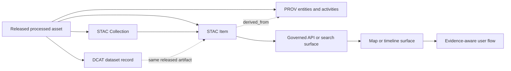

<!-- [KFM_META_BLOCK_V2]
doc_id: kfm://doc/NEEDS-VERIFICATION-UUID
title: STAC Catalog Surface
type: standard
version: v1
status: draft
owners: NEEDS VERIFICATION
created: NEEDS VERIFICATION
updated: NEEDS VERIFICATION
policy_label: NEEDS VERIFICATION
related: [../../../README.md, ../../README.md, ../README.md, ../dcat/README.md, ../prov/README.md, ../../../docs/standards/README.md, ../../../docs/standards/KFM_STAC_PROFILE.md, ../../../contracts/README.md, ../../../policy/README.md, ../../../scripts/README.md, ../../../tests/README.md, ../../../tools/README.md]
tags: [kfm, stac, catalog, geospatial, metadata]
notes: [Target path is confirmed on public main; owners, dates, policy label, and doc UUID require repo-side verification before publish.]
[/KFM_META_BLOCK_V2] -->

# STAC Catalog Surface

_Governed STAC-facing catalog surface for KFM spatial and temporal assets, release-linked metadata, and map/timeline discovery._

> **Status:** experimental  
> **Doc state:** draft  
> **Owners:** `NEEDS VERIFICATION`  
> **Path:** `data/catalog/stac/README.md`  
> **Repo fit:** STAC member of the KFM catalog triplet (`DCAT + STAC + PROV`), sitting under [`data/`](../../README.md) and [`data/catalog/`](../README.md), and feeding governed discovery, timeline, and map-facing surfaces.  
> **Quick jumps:** [Scope](#scope) · [Repo fit](#repo-fit) · [Accepted inputs](#accepted-inputs) · [Exclusions](#exclusions) · [Directory tree](#directory-tree) · [Quickstart](#quickstart) · [Usage](#usage) · [Diagram](#diagram) · [Tables](#tables) · [Task list](#task-list) · [FAQ](#faq) · [Appendix](#appendix)  
>     

> [!IMPORTANT]
> `data/catalog/stac/` is a **catalog** surface, not the canonical truth store.
> 
> In KFM, STAC records describe **released** spatial or temporal assets after `PROCESSED` and as part of the `CATALOG` state. They must not become a shortcut around `RAW`, `WORK`, `QUARANTINE`, review, policy, or correction handling.

> [!NOTE]
> Public `main` currently confirms that `data/catalog/stac/` exists but still contains only a scaffold `README.md`. This document therefore upgrades a confirmed path with a doctrine-grounded README, while keeping subtree layout, validator entrypoints, and publication mode explicitly separated into **CONFIRMED**, **PROPOSED**, and **NEEDS VERIFICATION** statements.

---

## Scope

This directory is the repo-facing home for **STAC-shaped catalog records** that describe KFM’s release-linked spatial and temporal assets.

It exists to make released geospatial assets discoverable, map-friendly, timeline-friendly, and cross-linkable without collapsing KFM’s stronger architectural boundaries. In plain terms:

- **STAC belongs to the catalog triplet**, alongside DCAT and PROV.
- **STAC is for spatial/temporal asset description and discovery**, not for replacing canonical processed artifacts.
- **STAC should remain downstream of governed release**, not upstream of validation or policy.
- **STAC should stay link-rich**, so a user or service can move from asset discovery to lineage and outward dataset description without guessing.

### Evidence boundary used in this README

| Layer | Status | What this README treats as true |
|---|---|---|
| Public `main` repo tree | **CONFIRMED** | `data/catalog/stac/` exists today; current checked-in content is scaffold-light. |
| March 2026 KFM doctrine | **CONFIRMED** | Truth path, catalog triplet, authoritative-vs-derived split, trust membrane, map-first delivery logic, and fail-closed posture. |
| Current STAC / OGC standards model | **CONFIRMED** | STAC still centers on Catalog, Collection, and Item objects, with STAC API as a separate service-layer concern. |
| Local subtree beyond current scaffold | **PROPOSED** | `collections/` and `items/` as the starter checked-in file shape. |
| Exact validators, merge gates, and branch-side enforcement | **NEEDS VERIFICATION** | Use only after direct branch inspection confirms the scripts and workflows actually exist. |

### What this README is for

This README is for maintainers who need to answer four practical questions quickly:

1. What belongs in `data/catalog/stac/`?
2. What does **not** belong here?
3. How should STAC relate to sibling DCAT and PROV records?
4. How should this lane stay useful to map/timeline surfaces without becoming sovereign truth?

[Back to top](#stac-catalog-surface)

---

## Repo fit

### Path and adjacency

`data/catalog/stac/` is one lane inside the broader `data/catalog/` surface.

| Direction | Surface | Role here |
|---|---|---|
| Upstream | [`../../README.md`](../../README.md) | Governs the wider data lifecycle and explains how `CATALOG` fits between `PROCESSED` and `PUBLISHED`. |
| Upstream | [`../README.md`](../README.md) | Parent catalog lane; should explain shared triplet logic and sibling responsibilities. |
| Lateral | [`../dcat/README.md`](../dcat/README.md) | Dataset-level outward metadata sibling. |
| Lateral | [`../prov/README.md`](../prov/README.md) | Lineage and provenance sibling. |
| Upstream | [`../../../docs/standards/KFM_STAC_PROFILE.md`](../../../docs/standards/KFM_STAC_PROFILE.md) | Intended standards/profile surface for KFM-specific STAC rules. |
| Upstream | [`../../../contracts/README.md`](../../../contracts/README.md) | Machine-contract surface; this README should not quietly become the schema authority. |
| Upstream | [`../../../policy/README.md`](../../../policy/README.md) | Rights, sensitivity, publication, and deny-by-default constraints that catalog records must obey. |
| Downstream | [`../../../scripts/README.md`](../../../scripts/README.md) | Expected wrapper/validator entrypoints when branch-side tooling is present. |
| Downstream | [`../../../tools/README.md`](../../../tools/README.md) | Reusable validation and inspection tools. |
| Downstream | [`../../../tests/README.md`](../../../tests/README.md) | Fixtures and negative-path expectations for catalog validation. |

### Why this directory matters

KFM doctrine is unusually strict about the difference between:

- **authoritative assets**
- **derived delivery artifacts**
- **metadata surfaces**
- **runtime presentation surfaces**

`data/catalog/stac/` sits in the metadata layer. It should help discovery and rendering without blurring those boundaries.

### Current verified snapshot

The public branch currently shows:

- `data/catalog/README.md`
- `data/catalog/dcat/README.md`
- `data/catalog/prov/README.md`
- `data/catalog/stac/README.md`

The STAC lane is therefore **present and intentional**, but still **under-built** as a checked-in surface.

[Back to top](#stac-catalog-surface)

---

## Accepted inputs

The following belong here when they are **release-linked**, **policy-safe**, and **cross-linkable**.

| Accepted input | Belongs here when… | Notes |
|---|---|---|
| STAC Collection JSON | it describes a releasable dataset or product family with spatial/temporal extent | Typical shape for one recurring dataset family or product line |
| STAC Item JSON | it describes a released spatial/temporal asset, version, scene, granule, year, quad, or similar unit | Granularity should follow source reality, not convenience alone |
| Asset metadata | it points to released processed assets and includes stable roles / media typing / link targets | Metadata belongs here; the heavy asset does not |
| Spatial and temporal coverage | it captures bbox / geometry / datetime or interval as applicable | Keep discovery useful without inventing false precision |
| Provider / keyword / instrument / projection details | they materially improve interpretation or filtering | Add only when applicable; do not pad records with empty noise |
| Cross-links to PROV and sibling catalog surfaces | they resolve outward description and lineage cleanly | STAC should not be a dead end |
| KFM-specific profile declarations | they are part of emitted STAC records and align with the standards/profile lane | The profile should be documented in standards, not improvised ad hoc per item |

### Minimum practical rule

If a record cannot answer **what this asset is**, **where it applies**, **when it applies**, **what released artifact it points to**, and **how a reviewer gets from discovery to lineage**, it is not ready for this lane.

[Back to top](#stac-catalog-surface)

---

## Exclusions

These do **not** belong here.

| Exclusion | Why it stays out | Where it goes instead |
|---|---|---|
| Raw source files | STAC in KFM is not the raw intake surface | `data/raw/` |
| Work-in-progress or quarantined derivatives | Unreleased candidates must not be cataloged as if publishable | `data/work/` or `data/quarantine/` |
| Authoritative processed payloads themselves | This lane stores metadata, not the primary artifact body | `data/processed/` |
| Policy bundles, allow/deny rules, reason vocabularies | Catalog metadata must obey policy, not replace it | `policy/` |
| Contract schemas as the source of truth | README prose is not machine authority | `contracts/` and any schema-authority ADR/profile lane |
| PROV lineage documents | STAC should link to lineage, not absorb it | `data/catalog/prov/` |
| DCAT dataset records | STAC is the spatial/temporal member of the triplet, not the whole triplet | `data/catalog/dcat/` |
| Map style JSON, renderer config, popup logic, UI state | Rendering and interaction belong to delivery/runtime layers | standards, app, or renderer-specific surfaces |
| Unvalidated or rights-unclear records | Discovery metadata must not outrun governance | hold back until validated and policy-cleared |
| API behavior documentation | Static file layout and live service behavior are related but not identical | governed API/runtime docs |

> [!WARNING]
> Do not use this directory to smuggle unpublished material into a discoverable surface by way of “temporary” Item JSON. In KFM, temporary publication shortcuts become permanent trust debt.

[Back to top](#stac-catalog-surface)

---

## Directory tree

### Current confirmed public-main snapshot

```text
data/catalog/
├── README.md
├── dcat/
│   └── README.md
├── prov/
│   └── README.md
└── stac/
    └── README.md
```

### Doctrine-aligned starter shape for this lane

The following is a **PROPOSED** checked-in layout for a file-first STAC lane:

```text
data/catalog/stac/
├── README.md
├── collections/
│   └── <dataset>.json
└── items/
    └── <dataset>__<version>.json
```

### Optional surfaces that still need an intentional decision

The following are **NEEDS VERIFICATION** before they should be treated as standard:

- a checked-in root `catalog.json`
- API landing-page material generated elsewhere and copied here
- extension-specific subfolders or example fixtures colocated in this directory
- branch-side generation-only outputs that are not meant to be committed

If those choices matter, write them down explicitly in standards or ADR surfaces rather than letting the directory drift into accidental convention.

[Back to top](#stac-catalog-surface)

---

## Quickstart

### Safe inspection first

```bash
# inspect the current catalog lane
find data/catalog -maxdepth 3 -type f | sort

# inspect adjacent guidance surfaces
sed -n '1,220p' data/README.md
sed -n '1,220p' data/catalog/README.md
sed -n '1,220p' data/catalog/stac/README.md
sed -n '1,220p' docs/standards/KFM_STAC_PROFILE.md
sed -n '1,220p' contracts/README.md
sed -n '1,220p' policy/README.md
sed -n '1,220p' scripts/README.md
sed -n '1,220p' tests/README.md
```

### First authoring pass

1. Start with one **released** spatial/temporal asset or dataset version.
2. Decide whether you need:
   - one **Collection** plus one or more **Items**, or
   - a single **Item-only** publication shape with the omission explicitly justified.
3. Draft the STAC record so it points to **released processed artifacts**, not raw or work-state material.
4. Cross-link it to sibling **DCAT** and **PROV** records.
5. Only then wire it into validators, fixtures, and any governed API exposure.

### Illustrative validation lane

The command names below are **PROPOSED** until your checked-out branch proves they exist:

```bash
python scripts/catalog/validate_stac.py data/catalog/stac/items/<dataset>__<version>.json

test -f data/catalog/stac/collections/<dataset>.json \
  || echo "no collection file present; verify that omission is intentional"
```

> [!TIP]
> Treat validation as more than JSON shape checking. In KFM, useful STAC validation also includes link resolution, release alignment, policy compatibility, and clean cross-links into DCAT and PROV.

[Back to top](#stac-catalog-surface)

---

## Usage

### STAC’s job inside KFM

STAC is the **spatial/temporal discovery view** of the catalog triplet.

That makes it especially useful for:

- map-facing discovery
- timeline-aware browsing
- asset preview and filtering
- spatial extent inspection
- machine-readable handoff into search, API, and map layers

That does **not** make it the strongest truth surface in the system. KFM still expects stronger authority to remain with released artifacts, receipts, policy, review state, and lineage.

### Static file lane versus STAC API

This README governs the **checked-in STAC file lane** under `data/catalog/stac/`.

If KFM also exposes a STAC API, that API is a **downstream governed service surface**. It should mirror or derive from approved release metadata, but it should not be treated as the same thing as the checked-in directory.

A useful mental split:

| Concern | File lane here | API lane elsewhere |
|---|---|---|
| Checked-in Collection / Item JSON | yes | maybe derived from here |
| Root landing behavior | optional / undecided | yes, if STAC API is exposed |
| `conformsTo` and endpoint behavior | no | yes |
| `/collections` / search endpoints | no | yes |
| Release-linked metadata ownership | yes | should stay downstream of this |

### Collection versus Item granularity

A good starter rule:

- use a **Collection** for a stable dataset or product family
- use an **Item** for the releasable spatial/temporal unit that users and systems actually need to discover

That unit may be:

- one dataset version
- one year
- one quad
- one scene
- one granule
- one tile-aligned release package

The right granularity is the one that preserves reviewable meaning without turning every record into a giant, fuzzy bucket.

### Cross-link discipline

STAC records should not stand alone.

At minimum, maintain a clean relationship between:

- **STAC** for spatial/temporal asset discovery
- **DCAT** for outward dataset description
- **PROV** for lineage and derivation
- **processed artifacts** for the release-linked thing the records actually describe

### Release-safe asset linking

When STAC points to an asset:

- the asset should already be in a publishable class
- the link should not bypass policy or review
- the record should not imply a stronger access right than policy allows
- the artifact should be stable enough for citation, retrieval, and correction handling

### 2D-first, renderer-safe consequence

KFM’s map doctrine matters here: STAC helps discovery and delivery, but it does not own renderer state.

Keep these boundaries clean:

- **STAC** says what the asset is
- **style / renderer / layer config** says how it looks
- **UI state** says how a user is currently interacting with it
- **lineage / evidence / policy** says whether and how it should be trusted

[Back to top](#stac-catalog-surface)

---

## Diagram


```mermaid
flowchart LR
    A[Released processed asset] --> B[STAC Collection]
    A --> C[STAC Item]
    A --> D[DCAT dataset record]
    A --> E[PROV entities and activities]

    B --> C
    C -. derived_from .-> E
    D -. same released artifact .-> C

    C --> F[Governed API or search surface]
    F --> G[Map or timeline surface]
    G --> H[Evidence-aware user flow]
```

[Back to top](#stac-catalog-surface)

---

## Tables

### Catalog triplet role map

| Surface | Primary job | Typical scope | KFM warning |
|---|---|---|---|
| DCAT | outward dataset description | dataset / distribution level | do not force spatial asset details here if STAC is the better home |
| STAC | spatial/temporal asset discovery | collection / item / asset level | do not mistake discoverability for authoritative truth |
| PROV | lineage and derivation | entity / activity / agent relationships | do not sever lineage links just because the asset is easy to render |

### Minimum KFM-facing STAC expectations

These are **starter expectations**, not a substitute for a formal profile.

| Object | Minimum expectation | Why it matters |
|---|---|---|
| Collection | stable `id`, human-readable title/description, license, spatial extent, temporal extent, providers/keywords where relevant | lets the dataset family be found and understood before drilling into items |
| Item | stable `id`, geometry, `bbox`, `datetime` (or equivalent temporal handling), relevant properties, assets with roles and resolvable targets | makes the release unit inspectable and machine-usable |
| Links | `self`, `collection` when used, and lineage-facing links such as `derived_from` where KFM uses them | prevents metadata dead ends |
| Assets | point to released processed artifacts and related metadata/previews only | keeps the catalog release-safe |
| KFM alignment | cross-link cleanly to sibling DCAT and PROV records | preserves triplet integrity |

### GeoJSON versus tiles versus hybrid — implication for STAC authoring

| Delivery choice | What STAC should emphasize | Authoring caution |
|---|---|---|
| GeoJSON-first | direct feature asset description and modest interaction scope | avoid pretending large client-heavy payloads are free |
| Tiles-first | delivery artifact identity, rebuildability, and release linkage | keep source semantics separate from renderer convenience |
| Hybrid | authoritative release artifact plus interaction-friendly derivative references | be explicit about which asset is canonical and which is derived |

[Back to top](#stac-catalog-surface)

---

## Task list

### Immediate

- [ ] Replace the scaffold with this README and verify local formatting/rendering
- [ ] Confirm `owners`, `doc_id`, `created`, `updated`, and `policy_label` in the meta block
- [ ] Confirm whether this lane is intended to be file-first, API-derived, or hybrid

### Structural

- [ ] Decide and document the standard checked-in subtree for STAC records
- [ ] Expand [`../../../docs/standards/KFM_STAC_PROFILE.md`](../../../docs/standards/KFM_STAC_PROFILE.md) beyond scaffold status
- [ ] Confirm whether a root catalog file belongs here or only Collection / Item records

### Validation and governance

- [ ] Verify the authoritative machine-contract home for STAC validation rules
- [ ] Add or confirm Collection / Item validation entrypoints
- [ ] Add or confirm cross-link checks against sibling DCAT and PROV records
- [ ] Add negative-path tests so invalid links, raw-path leakage, and release-state mistakes fail closed

### Definition of done

This lane is in good standing when:

- the README is no longer scaffold-only
- at least one representative STAC record exists or the empty-state intent is documented
- profile and validation surfaces are discoverable
- STAC ↔ DCAT ↔ PROV cross-links are clean
- no record quietly points to raw, work, or quarantined material
- branch-side validation behavior is documented or directly runnable

[Back to top](#stac-catalog-surface)

---

## FAQ

### Is STAC the authoritative truth layer in KFM?

No. STAC is a catalog/discovery layer over release-linked spatial and temporal assets.

### Does every KFM dataset need STAC?

No. STAC is strongest where a dataset has meaningful spatial and/or temporal asset structure. DCAT still matters more generally at the dataset level.

### Should this directory store the actual data files?

No. Store metadata records here; keep released artifacts in the appropriate processed/published lanes.

### Should a STAC Item ever point directly to raw or work-state material?

Not by default. In KFM, publishable discovery should normally resolve to released, policy-safe artifacts.

### Is a static file tree enough, or do we also need a STAC API?

Either can be valid. This README governs the checked-in file lane. Live API behavior should be documented separately and kept downstream of governed release metadata.

### Where should KFM-specific STAC rules really live?

In standards/contracts/policy surfaces, with this README acting as the directory guide rather than the hidden authority.

[Back to top](#stac-catalog-surface)

---

## Appendix

<details>
<summary>Appendix A — evidence labels used here</summary>

| Label | Meaning in this README |
|---|---|
| **CONFIRMED** | directly supported by current public repo inspection or attached KFM doctrine |
| **PROPOSED** | doctrine-aligned starter pattern not yet proven as checked-in branch reality |
| **NEEDS VERIFICATION** | should not be treated as settled until direct branch/workspace inspection confirms it |

</details>

<details>
<summary>Appendix B — merge-time authoring checklist</summary>

Before treating a STAC record as ready, verify:

- the record points to a **released** artifact
- extent and time fields are present and meaningful
- asset links resolve cleanly
- sibling DCAT and PROV records exist where required
- lineage links are not broken
- no rights or sensitivity rule is violated by link targets or precision
- profile/validator checks pass
- omission of Collection or root catalog files is intentional and documented

</details>

<details>
<summary>Appendix C — neighboring files worth updating next</summary>

Good follow-on cleanup candidates:

- [`../README.md`](../README.md)
- [`../dcat/README.md`](../dcat/README.md)
- [`../prov/README.md`](../prov/README.md)
- [`../../../docs/standards/KFM_STAC_PROFILE.md`](../../../docs/standards/KFM_STAC_PROFILE.md)

</details>

[Back to top](#stac-catalog-surface)
