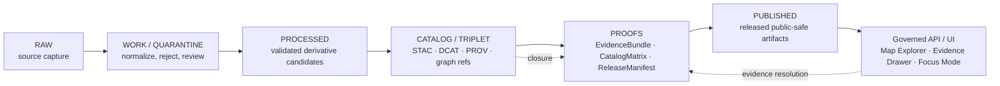

<!-- [KFM_META_BLOCK_V2]
doc_id: kfm://doc/NEEDS_VERIFICATION__stac_catalog_surface_readme
title: STAC Catalog Surface
type: standard
version: v1
status: draft
owners: @bartytime4life NEEDS_VERIFICATION
created: NEEDS_VERIFICATION__YYYY-MM-DD
updated: 2026-04-30
policy_label: public
related: [../../README.md, ../README.md, ../dcat/README.md, ../prov/README.md, ../../../docs/standards/KFM_STAC_PROFILE.md, ../../../contracts/README.md, ../../../schemas/README.md, ../../../policy/README.md]
tags: [kfm, stac, catalog, evidence, governance, publication]
notes: [Prepared as a repo-ready README from surfaced KFM doctrine and STAC catalog guidance; exact repo implementation, owner, adjacent links, validator paths, and profile schema require checkout verification.]
[/KFM_META_BLOCK_V2] -->

<a id="top"></a>

# STAC Catalog Surface

<p align="center">
  <strong>Governed discovery for KFM spatial and temporal assets — evidence-bound, release-aware, and fail-closed by default.</strong>
</p>

<p align="center">
  
  
  
  
  
</p>

<p align="center">
  <a href="#scope">Scope</a> ·
  <a href="#repo-fit">Repo fit</a> ·
  <a href="#inputs">Inputs</a> ·
  <a href="#exclusions">Exclusions</a> ·
  <a href="#lifecycle-position">Lifecycle</a> ·
  <a href="#required-closure">Closure</a> ·
  <a href="#validation">Validation</a> ·
  <a href="#definition-of-done">Definition of done</a>
</p>

> [!IMPORTANT]
> STAC is a **discovery surface**, not KFM truth. A STAC Item may describe and point to released or release-candidate assets, but consequential use must resolve through EvidenceBundle, provenance, rights, sensitivity, review, release, and correction state.

| Field | Value |
|---|---|
| Status | `experimental` / meta status `draft` |
| Owners | `@bartytime4life` `NEEDS_VERIFICATION` |
| Evidence mode | `CORPUS_ONLY` until verified from current checkout |
| Policy label | `public` |
| Path | `data/catalog/stac/README.md` |
| Upstream | `PROCESSED` artifacts, release candidates, source descriptors, validation reports, EvidenceBundle refs |
| Downstream | governed catalog search, Map Explorer, Evidence Drawer, Focus Mode, public-safe API/UI surfaces |
| Public posture | cite-or-abstain; fail closed on unresolved evidence, rights, sensitivity, or release state |

| What this document does | What it does not do |
|---|---|
| Defines the governed role of STAC inside KFM. | Does not make STAC canonical truth. |
| Names accepted STAC catalog objects and required KFM closure links. | Does not authorize public release by itself. |
| Provides profile expectations, validation gates, and review checklists. | Does not prove validators, routes, schemas, workflows, or catalog files currently exist. |
| Shows an illustrative Item shape for reviewers. | Does not replace `KFM_STAC_PROFILE.md` or checked-in JSON Schema. |

---

## Scope

`data/catalog/stac/` is the KFM home for **STAC Catalog**, **STAC Collection**, and **STAC Item** metadata that make spatial and temporal assets discoverable after they have passed enough review to enter the catalog seam.

STAC records in this directory must stay downstream of KFM evidence and publication controls. They are allowed to describe assets, expose discoverable metadata, and link users toward evidence. They are not allowed to make unsupported truth claims, bypass release gates, or expose sensitive/internal paths.

**Core posture:**

- **Discovery only:** STAC describes assets; it does not establish truth.
- **Evidence-bound:** consequential Items must resolve to an EvidenceBundle.
- **Release-aware:** Items must reference a ReleaseManifest or explicitly remain a release candidate.
- **Policy-aware:** unresolved rights or sensitivity blocks public exposure.
- **Drift-resistant:** IDs, checksums, lineage, and release state must agree across catalog/proof surfaces.

[Back to top](#top)

---

## Repo fit

```text
data/catalog/stac/
```

This directory belongs inside the broader KFM catalog layer.

| Neighbor | Relationship | Expected role |
|---|---|---|
| `../dcat/` | sibling catalog surface | DCAT dataset/distribution records for dataset-level discoverability |
| `../prov/` | sibling provenance surface | PROV entities, activities, and agents for lineage |
| `../../../data/proofs/` | proof object lane | EvidenceBundle, CatalogMatrix, validation summaries, release proof packs |
| `../../../data/published/` | published artifact lane | public-safe released assets referenced by STAC `assets` |
| `../../../docs/standards/KFM_STAC_PROFILE.md` | profile doc | expected normative KFM STAC profile; `NEEDS_VERIFICATION` until present |
| `../../../schemas/` / `../../../contracts/` | machine contract homes | schema authority `NEEDS_VERIFICATION` until actual repo convention is confirmed |
| `../../../policy/` | policy-as-code home | rights, sensitivity, release, and leakage checks; path `NEEDS_VERIFICATION` |

> [!NOTE]
> Relative links above are repo-fit targets, not proof that those files already exist. Confirm them in the current checkout before relying on them in CI or release automation.

[Back to top](#top)

---

## Inputs

Accepted content in this directory:

| Input | Allowed form | Required posture |
|---|---|---|
| STAC Catalog | `catalog.json` | discovery root only; no RAW/WORK paths |
| STAC Collection | `<collection_id>/collection.json` | dataset family metadata with rights, temporal extent, spatial extent, and links |
| STAC Item | `<collection_id>/<release_id>/<item_id>.json` | asset-level metadata with KFM extension fields and closure links |
| STAC Asset references | `assets` object | public-safe artifact `href`, media type, roles, checksum or digest where available |
| KFM links | `links[]` entries | EvidenceBundle, ReleaseManifest, DCAT, PROV, CatalogMatrix, successor/correction links |

Inputs must be generated from reviewed or release-candidate metadata. They must not be handwritten in a way that bypasses source descriptors, provenance, validation reports, policy decisions, or release manifests.

[Back to top](#top)

---

## Exclusions

Do **not** put these here:

| Excluded material | Correct disposition |
|---|---|
| RAW source downloads | `data/raw/` or source-specific raw lane |
| WORK / QUARANTINE artifacts | `data/work/` or `data/quarantine/` |
| Processed data payloads | `data/processed/` or domain-specific processed lane |
| Published binaries, rasters, tiles, GeoParquet, PMTiles, COGs | `data/published/` or release artifact storage |
| EvidenceBundle, proof packs, validation reports | `data/proofs/` |
| Run receipts, ingest receipts, transform receipts | `data/receipts/` |
| Policy definitions | `policy/` |
| Schemas/contracts | `schemas/` or `contracts/` after schema-home verification |
| UI state, story state, map camera state | UI/app state or released story manifest lane |
| AI-generated summaries | governed AI output envelope/proof lane; never as STAC truth |
| Sensitive exact geometry | quarantine, generalized public-safe derivative, or controlled-access release after review |

> [!WARNING]
> A STAC Item that points to RAW, WORK, QUARANTINE, unpublished candidate assets, direct source APIs, or sensitive exact geometry is a trust-boundary violation and should be rejected before publication.

[Back to top](#top)

---

## Directory tree

Minimum directory shape:

```text
data/catalog/stac/
└── README.md
```

Recommended production shape:

```text
data/catalog/stac/
├── catalog.json
└── <collection_id>/
    ├── collection.json
    └── <release_id>/
        └── <item_id>.json
```

Optional generated support files may be added only after the profile and validator convention are verified:

```text
data/catalog/stac/
├── catalog.json
├── _reports/
│   └── stac_validation_report.<release_id>.json
└── _index/
    └── catalog_matrix_refs.json
```

`_reports/` and `_index/` are **PROPOSED** helper locations, not established repo convention.

[Back to top](#top)

---

## Lifecycle position

STAC lives at the **catalog seam**. It is downstream of source capture and processing, and upstream of governed public discovery.


```mermaid
flowchart LR
  RAW[RAW\nsource capture] --> WORK[WORK / QUARANTINE\nnormalize, reject, review]
  WORK --> PROCESSED[PROCESSED\nvalidated derivative candidates]
  PROCESSED --> CATALOG[CATALOG / TRIPLET\nSTAC · DCAT · PROV · graph refs]
  CATALOG --> PROOFS[PROOFS\nEvidenceBundle · CatalogMatrix · ReleaseManifest]
  PROOFS --> PUBLISHED[PUBLISHED\nreleased public-safe artifacts]
  PUBLISHED --> API[Governed API / UI\nMap Explorer · Evidence Drawer · Focus Mode]

  CATALOG -. closure .-> PROOFS
  API -. evidence resolution .-> PROOFS
```

STAC does **not**:

- promote data,
- validate source truth,
- publish artifacts,
- replace EvidenceBundle resolution,
- replace policy review,
- replace release approval.

[Back to top](#top)

---

## Required closure

A valid KFM STAC Item must close across the adjacent catalog, evidence, provenance, release, and matrix surfaces.

```text
STAC Item
  ↔ DCAT dataset/distribution
  ↔ PROV lineage
  ↔ EvidenceBundle
  ↔ ReleaseManifest
  ↔ CatalogMatrix
```

If any required closure target is missing, unresolved, drifted, or policy-blocked, the Item state is **`NEEDS_VERIFICATION`** or **`BLOCKED`**, not publishable.

| Closure target | Required evidence | Failure posture |
|---|---|---|
| DCAT | dataset/distribution identifier matches STAC collection/item lineage | `ABSTAIN` for public claims; block release if discoverability is consequential |
| PROV | source capture, transform, validation, review, and promotion lineage | `BLOCKED` until provenance resolves |
| EvidenceBundle | EvidenceRef resolves to bundle with rights, sensitivity, review, and artifact digest support | `ABSTAIN` or `DENY` depending on policy |
| ReleaseManifest | release ID, artifact digest, release state, rollback target | `BLOCKED` for public release |
| CatalogMatrix | STAC/DCAT/PROV/manifest/artifact digests agree | `FAIL` on mismatch |

[Back to top](#top)

---

## KFM STAC extension

The checked-in `KFM_STAC_PROFILE.md` and JSON Schema should be treated as the normative source once verified. Until then, use this README as the review-facing minimum profile intent.

### Required KFM fields

These fields belong under `properties` unless the future profile states otherwise.

| Field | Required | Purpose |
|---|---:|---|
| `kfm:release_id` | yes | Connects the Item to a release or release candidate. |
| `kfm:dataset_version_id` | yes | Identifies the dataset version represented by this Item. |
| `kfm:evidence_ref` | yes | Resolves to the EvidenceBundle for consequential use. |
| `kfm:catalog_matrix_ref` | yes | Connects STAC/DCAT/PROV/release/artifact closure. |
| `kfm:rights_class` | yes | Controls publication eligibility and access posture. |
| `kfm:sensitivity_class` | yes | Controls exact geometry, redaction, generalization, and visibility. |
| `kfm:release_state` | yes | Makes candidate, published, withdrawn, or superseded release posture explicit. |
| `kfm:review_state` | yes | Records review posture required before public use. |
| `kfm:correction_state` | yes | Identifies current, superseded, corrected, or withdrawn state. |
| `kfm:spec_hash` | yes | Stable hash of the governed spec/profile used to emit or validate the Item. |

### Controlled values

| Property | Allowed values |
|---|---|
| `kfm:rights_class` | `public` · `open` · `controlled` · `restricted` · `unknown` |
| `kfm:sensitivity_class` | `public` · `generalize` · `restricted` · `review_required` |
| `kfm:release_state` | `candidate` · `published` · `superseded` · `withdrawn` |
| `kfm:review_state` | `unreviewed` · `in_review` · `approved` · `rejected` · `needs_verification` |
| `kfm:correction_state` | `current` · `corrected` · `superseded` · `withdrawn` |

> [!IMPORTANT]
> `kfm:evidence_ref` must resolve before Focus Mode, Evidence Drawer, map popups, exports, or public API responses make consequential claims from the Item.

[Back to top](#top)

---

## Linking requirements

Every KFM STAC Item should include these links unless the future STAC profile defines a stricter or renamed relation set.

| Link `rel` | Target | Purpose |
|---|---|---|
| `collection` | parent collection | Standard STAC collection relationship. |
| `root` | catalog root | Standard STAC root relationship where applicable. |
| `self` | current item | Stable self-reference where applicable. |
| `via` | PROV record | Source and transform lineage. |
| `describedby` | DCAT JSON-LD record | Dataset/distribution catalog description. |
| `kfm:evidence` | EvidenceBundle | Evidence support for consequential use. |
| `kfm:release` | ReleaseManifest | Publication/release authority and rollback target. |
| `kfm:catalog-matrix` | CatalogMatrix | Cross-surface closure and digest agreement. |
| `successor` | successor Item | Correction, supersession, or withdrawal lineage when applicable. |

KFM-specific relation names are **profile-bound** and must be documented in `KFM_STAC_PROFILE.md` before strict CI enforcement.

[Back to top](#top)

---

## Validation

STAC validity is necessary but insufficient. KFM publication requires STAC validity **plus** evidence, policy, provenance, release, and closure checks.

| Gate | Required check | Fail outcome |
|---|---|---|
| STAC schema | Item, Collection, and Catalog validate against pinned STAC version. | `FAIL` |
| KFM profile | Required `kfm:*` fields and controlled values validate. | `FAIL` |
| Evidence resolution | `kfm:evidence_ref` resolves to an EvidenceBundle. | `ABSTAIN` or `BLOCKED` |
| Rights policy | rights class allows the requested access mode. | `DENY` |
| Sensitivity policy | geometry and asset exposure match sensitivity class. | `DENY` |
| Release linkage | ReleaseManifest exists and matches release state. | `BLOCKED` |
| Catalog closure | STAC/DCAT/PROV/EvidenceBundle/ReleaseManifest/CatalogMatrix agree. | `FAIL` |
| Digest integrity | asset digest, manifest digest, and catalog digest align. | `FAIL` |
| Correction state | successor/supersession/withdrawal references are coherent. | `NEEDS_VERIFICATION` |

Suggested validator home, pending repo verification:

```text
tools/validators/stac/validate_stac_kfm.py
```

Suggested CI gate name, pending workflow verification:

```text
stac-catalog-closure
```

> [!NOTE]
> Validator and workflow paths are proposed because current repo conventions were not verified in this revision context.

[Back to top](#top)

---

## Map Explorer, Evidence Drawer, and Focus Mode contract

STAC can help the UI discover layers and assets, but it must not become the UI trust source.

| Surface | STAC may provide | STAC must not provide |
|---|---|---|
| Map Explorer | layer discovery, extent, time range, asset metadata, preview hints | RAW paths, sensitive exact geometry, unpublished assets |
| Evidence Drawer | EvidenceBundle link target, release ID, correction state | generated explanation without evidence resolution |
| Focus Mode | scoped evidence refs and catalog context | direct model context from raw STAC text without policy checks |
| Public API | public-safe catalog metadata | internal store access or direct source-system reads |

Runtime outcomes remain finite:

| Condition | Runtime result |
|---|---|
| Evidence resolves and policy allows use | `ANSWER` |
| Evidence is missing, unresolved, stale, or insufficient | `ABSTAIN` |
| Rights, sensitivity, access, or review policy blocks use | `DENY` |
| System, validator, resolver, or catalog failure prevents reliable result | `ERROR` |

[Back to top](#top)

---

## Correction and lineage

Do not silently delete or overwrite Items that have been part of a release, review packet, EvidenceBundle, public API response, or map-visible surface.

Use correction state and links:

```json
{
  "kfm:correction_state": "superseded"
}
```

```json
{
  "rel": "successor",
  "href": "../rel_2024_09/habitat_2024_001.json"
}
```

Correction handling must preserve:

- prior Item identity,
- successor Item identity,
- reason for correction or withdrawal,
- affected release ID,
- invalidated assets or aliases,
- rollback target,
- EvidenceBundle and CatalogMatrix updates,
- public-safe correction notice where publication already occurred.

[Back to top](#top)

---

## Minimal illustrative Item

This example is intentionally small. It demonstrates KFM closure posture; it is not a complete production Item and should be validated against the checked-in STAC profile before use.

```json
{
  "type": "Feature",
  "stac_version": "1.1.0",
  "id": "habitat_2024_001",
  "collection": "habitat",
  "bbox": [-102.1, 36.9, -94.6, 40.1],
  "geometry": {
    "type": "Polygon",
    "coordinates": [[
      [-102.1, 36.9],
      [-94.6, 36.9],
      [-94.6, 40.1],
      [-102.1, 40.1],
      [-102.1, 36.9]
    ]]
  },
  "properties": {
    "datetime": "2024-06-01T00:00:00Z",
    "kfm:release_id": "rel_2024_06",
    "kfm:dataset_version_id": "habitat_2024_06_v1",
    "kfm:evidence_ref": "kfm://evidence/abc123",
    "kfm:catalog_matrix_ref": "kfm://catalog-matrix/habitat/rel_2024_06",
    "kfm:rights_class": "public",
    "kfm:sensitivity_class": "generalize",
    "kfm:release_state": "candidate",
    "kfm:review_state": "needs_verification",
    "kfm:correction_state": "current",
    "kfm:spec_hash": "sha256:NEEDS_VERIFICATION"
  },
  "links": [
    {
      "rel": "collection",
      "href": "../collection.json",
      "type": "application/json"
    },
    {
      "rel": "via",
      "href": "../../../prov/habitat/rel_2024_06.prov.json",
      "type": "application/ld+json"
    },
    {
      "rel": "describedby",
      "href": "../../../dcat/habitat/rel_2024_06.jsonld",
      "type": "application/ld+json"
    },
    {
      "rel": "kfm:evidence",
      "href": "../../../../proofs/habitat/rel_2024_06/evidence_bundle.json",
      "type": "application/json"
    },
    {
      "rel": "kfm:release",
      "href": "../../../../proofs/habitat/rel_2024_06/release_manifest.json",
      "type": "application/json"
    },
    {
      "rel": "kfm:catalog-matrix",
      "href": "../../../../proofs/habitat/rel_2024_06/catalog_matrix.json",
      "type": "application/json"
    }
  ],
  "assets": {
    "data": {
      "href": "../../../../published/habitat/rel_2024_06/data.tif",
      "type": "image/tiff; application=geotiff",
      "roles": ["data"],
      "title": "Public-safe habitat release candidate",
      "checksum:multihash": "NEEDS_VERIFICATION"
    }
  }
}
```

[Back to top](#top)

---

## Definition of done

A STAC addition is ready for review when:

- [ ] STAC Catalog, Collection, and Item schema validation passes against the pinned STAC version.
- [ ] KFM STAC profile validation passes.
- [ ] `kfm:evidence_ref` resolves to an EvidenceBundle.
- [ ] ReleaseManifest exists or release-candidate state is explicit.
- [ ] CatalogMatrix links STAC, DCAT, PROV, EvidenceBundle, ReleaseManifest, and artifact digests.
- [ ] Rights and sensitivity policy checks pass for the intended audience.
- [ ] No RAW, WORK, QUARANTINE, internal canonical store, or direct source-system path is exposed.
- [ ] No restricted geometry or sensitive exact location is exposed through public STAC metadata or assets.
- [ ] Asset checksums/digests align with release/proof records.
- [ ] Correction, successor, supersession, withdrawal, and rollback paths are defined where applicable.
- [ ] Map Explorer, Evidence Drawer, and Focus Mode can reach only governed API/released artifact paths.
- [ ] Validation output is recorded as a reviewable report or receipt.

[Back to top](#top)

---

## Open verification backlog

| Item | Why it matters | Status |
|---|---|---|
| Confirm `KFM_STAC_PROFILE.md` exists and names exact required fields. | Avoids README/profile drift. | `NEEDS_VERIFICATION` |
| Confirm schema home: `schemas/` vs `contracts/` vs `schemas/contracts/v1/`. | Prevents parallel machine-contract authority. | `NEEDS_VERIFICATION` |
| Confirm validator path and language. | Avoids invented CI/tooling claims. | `NEEDS_VERIFICATION` |
| Confirm actual catalog generation pipeline. | Distinguishes generated catalog records from hand-edited metadata. | `NEEDS_VERIFICATION` |
| Confirm owner and CODEOWNERS coverage. | Ensures accountable review. | `NEEDS_VERIFICATION` |
| Confirm public API route for STAC search, if any. | Avoids claiming `/stac/search` exists before evidence. | `NEEDS_VERIFICATION` |
| Confirm release/proof object storage paths. | Keeps links valid from Item location. | `NEEDS_VERIFICATION` |
| Confirm current STAC version pin. | Avoids silent standard/version drift. | `NEEDS_VERIFICATION` |

[Back to top](#top)

---

<details>
<summary>Appendix A — common failure modes</summary>

| Anti-pattern | Why it fails | Required disposition |
|---|---|---|
| STAC Item without EvidenceBundle | Discovery cannot support claims. | `ABSTAIN` or `BLOCKED` |
| STAC Item pointing to RAW/WORK/QUARANTINE | Public path bypasses trust membrane. | `DENY` |
| Unknown rights class | Public release cannot be justified. | `BLOCKED` |
| Sensitive exact geometry in public Item | Can expose protected/cultural/private/critical locations. | `DENY`; generalize or redact |
| Asset digest drift | Catalog no longer matches release artifact. | `FAIL`; regenerate closure |
| Missing PROV link | Transform/review lineage cannot be reconstructed. | `BLOCKED` |
| Missing DCAT link | Dataset discoverability is incomplete. | `NEEDS_VERIFICATION` |
| STAC treated as source truth | Collapses discovery and evidence. | architectural correction required |
| AI summary embedded as STAC truth | Generated language bypasses evidence/review state. | remove; route through governed AI envelope |
| Deleting a published Item | Breaks correction lineage and rollback. | supersede or withdraw with successor/correction notice |

</details>

<details>
<summary>Appendix B — reviewer checklist</summary>

Use this checklist during PR review:

- [ ] The Item has no unverified public claim beyond discoverability metadata.
- [ ] Every `href` is public-safe for the target audience.
- [ ] Every `kfm:*` field uses the current profile vocabulary.
- [ ] Every custom `rel` is documented in the profile.
- [ ] EvidenceBundle resolves and supports the asset identity.
- [ ] ReleaseManifest and CatalogMatrix agree on artifact digests.
- [ ] DCAT/PROV links resolve from the Item location.
- [ ] Rights/sensitivity decisions are visible to downstream UI.
- [ ] Correction state is not silently reset to `current` after supersession.
- [ ] Validator output is attached to the review or release packet.

</details>
