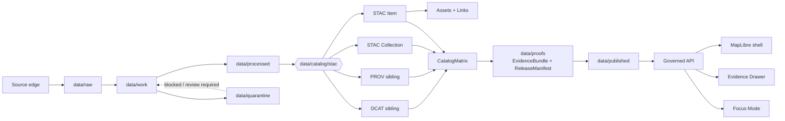

<!-- [KFM_META_BLOCK_V2]
doc_id: kfm://doc/NEEDS_VERIFICATION
title: STAC Catalog Surface
type: standard
version: v1
status: draft
owners: @bartytime4life
created: NEEDS_VERIFICATION
updated: 2026-04-22
policy_label: NEEDS_VERIFICATION
related: [../../README.md, ../README.md, ../dcat/README.md, ../prov/README.md, ../../../docs/standards/KFM_STAC_PROFILE.md, ../../../contracts/README.md, ../../../schemas/README.md, ../../../policy/README.md, ../../../tools/catalog/README.md, ../../../tools/validators/README.md, ../../../tests/catalog/README.md, ../../../.github/CODEOWNERS]
tags: [kfm, stac, catalog, metadata, geospatial, evidence]
notes: [doc_id, created date, and policy_label need active-branch verification; owner is grounded in broad CODEOWNERS coverage for /data/ and /data/catalog/; this README is a directory guide and does not replace the field-level KFM STAC profile]
[/KFM_META_BLOCK_V2] -->

<a id="top"></a>

# STAC Catalog Surface

Release-linked STAC metadata for KFM spatial and temporal asset discovery, catalog closure, and map/timeline handoff.

> [!IMPORTANT]
> **Status:** experimental  
> **Doc state:** draft  
> **Owners:** `@bartytime4life`  
> **Path:** `data/catalog/stac/README.md`  
> **Repo fit:** child of [`data/catalog/`](../README.md), downstream of [`data/processed/`](../../processed/README.md), sibling to [`dcat/`](../dcat/README.md) and [`prov/`](../prov/README.md), and upstream of release-aware discovery, governed APIs, MapLibre surfaces, Evidence Drawer payloads, and Focus Mode responses.  
> **Quick jumps:** [Scope](#scope) · [Repo fit](#repo-fit) · [Accepted inputs](#accepted-inputs) · [Exclusions](#exclusions) · [Directory tree](#directory-tree) · [Quickstart](#quickstart) · [Usage](#usage) · [Diagram](#diagram) · [Reference tables](#reference-tables) · [Task list](#task-list--definition-of-done) · [FAQ](#faq) · [Appendix](#appendix)


> [!NOTE]
> Keep field-level STAC rules in [`docs/standards/KFM_STAC_PROFILE.md`](../../../docs/standards/KFM_STAC_PROFILE.md). This README is the **directory guide and boundary document**, not the schema authority, policy authority, or release proof.

---

## Scope

`data/catalog/stac/` is KFM’s checked-in lane for **STAC-shaped discovery metadata** around release-linked spatial and temporal assets.

Use this directory to describe what a governed artifact is, where its spatial and temporal footprint sits, which assets can be discovered, and how the record links back to release-aware evidence, provenance, rights, and correction state.

In KFM terms:

- **STAC is discovery metadata**, not canonical truth.
- **STAC is one member of the catalog triplet**, alongside DCAT and PROV.
- **STAC stays downstream of validation, rights, policy, review, and release state.**
- **STAC must remain link-rich**, so reviewers and runtime surfaces can trace from asset discovery to EvidenceBundle, ReleaseManifest, CatalogMatrix, PROV lineage, and rollback/correction context.

### Evidence boundary used by this README

| Layer | Status | README consequence |
| --- | --- | --- |
| Current target file | **CONFIRMED path / prior placeholder** | This README expands the existing lane instead of creating a parallel STAC guide. |
| Parent data lifecycle | **CONFIRMED doctrine and repo-facing docs** | `STAC` belongs after processed artifacts and before public discovery/release consumption. |
| KFM STAC profile | **CONFIRMED standard surface / NEEDS VERIFICATION for enforcement depth** | Profile rules route to `docs/standards/KFM_STAC_PROFILE.md`; exact validators remain branch-sensitive. |
| STAC payload inventory | **NEEDS VERIFICATION** | Do not claim checked-in Collections, Items, or catalogs until the active branch proves them. |
| Validator/workflow enforcement | **UNKNOWN / NEEDS VERIFICATION** | Missing validator output is not success; record it as a gap in PR notes. |

[Back to top](#top)

---

## Repo fit

### Lifecycle position

```text
SOURCE EDGE
  -> data/raw/
  -> data/work/ or data/quarantine/
  -> data/processed/
  -> data/catalog/stac/       # this directory
  -> data/proofs/
  -> data/published/
  -> governed API / MapLibre / Evidence Drawer / Focus Mode
```

`data/catalog/stac/` sits in the catalog seam. It describes released or release-candidate spatial assets, but it does not move a candidate into publication by itself.

### Neighboring surfaces

| Direction | Surface | Role |
| --- | --- | --- |
| Upstream | [`../../README.md`](../../README.md) | Governs the wider `data/` lifecycle and trust-path posture. |
| Upstream | [`../../processed/README.md`](../../processed/README.md) | Holds stable processed dataset versions and release-adjacent artifacts. |
| Parent | [`../README.md`](../README.md) | Defines shared catalog closure across STAC, DCAT, and PROV. |
| Sibling | [`../dcat/README.md`](../dcat/README.md) | Dataset and distribution metadata. |
| Sibling | [`../prov/README.md`](../prov/README.md) | Lineage, activities, agents, and generated-entity vocabulary. |
| Release proof | [`../../proofs/README.md`](../../proofs/README.md) | EvidenceBundle, ReleaseManifest, CatalogMatrix, proof pack, rollback refs. |
| Process memory | [`../../receipts/README.md`](../../receipts/README.md) | Run, validation, review, transform, and audit receipts. |
| Publication | [`../../published/README.md`](../../published/README.md) | Release-backed public-safe materialization and aliases. |
| Standards | [`../../../docs/standards/KFM_STAC_PROFILE.md`](../../../docs/standards/KFM_STAC_PROFILE.md) | Field-level KFM STAC profile and object expectations. |
| Authority | [`../../../contracts/README.md`](../../../contracts/README.md), [`../../../schemas/README.md`](../../../schemas/README.md), [`../../../policy/README.md`](../../../policy/README.md) | Contract, machine-schema, and policy surfaces; this directory must not duplicate them. |
| Verification | [`../../../tools/catalog/README.md`](../../../tools/catalog/README.md), [`../../../tools/validators/README.md`](../../../tools/validators/README.md), [`../../../tests/catalog/README.md`](../../../tests/catalog/README.md) | Catalog QA, validator, and fixture-driven proof lanes. |

### Boundary summary

| Question | Answer |
| --- | --- |
| What belongs here? | STAC Catalog, Collection, Item, Link, and Asset metadata for governed spatial/temporal discovery. |
| What does not belong here? | RAW payloads, transform scratch, canonical processed assets, receipts, proof packs, policy rules, schemas, UI state, or generated AI prose. |
| What reads this lane? | Catalog helpers, validators, promotion gates, reviewer tooling, governed APIs, Evidence Drawer payload builders, and map/timeline discovery surfaces. |
| What is the hardest rule? | A syntactically valid STAC object is not automatically acceptable KFM output. It still needs release linkage, rights posture, evidence traceability, correction visibility, and catalog closure. |

[Back to top](#top)

---

## Accepted inputs

Only explicit, reviewable, release-aware STAC artifacts belong here.

| Accepted input | Typical path | Minimum burden |
| --- | --- | --- |
| STAC Catalog records | `data/catalog/stac/catalog.json` or branch-approved equivalent | Must not navigate users into unpublished or unreleasable scope. |
| STAC Collections | `data/catalog/stac/<collection_id>/collection.json` | Must declare release-safe extent, license/rights posture, links, and collection-level caveats. |
| STAC Items | `data/catalog/stac/<collection_id>/<release_id>/<item_id>.json` | Must describe one release-bearing spatial/temporal artifact or asset group. |
| STAC Assets and Links | inside Item or Collection JSON | Must use resolvable `href`, useful media type, roles, and proof or checksum refs where branch convention supports them. |
| README-local examples | `*.example.json` or fixture links | Must be visibly non-production and excluded from release aliases. |
| Catalog closure refs | links to `data/catalog/dcat/`, `data/catalog/prov/`, and `data/proofs/` | Must keep subject identity, release/version ID, checksums, and correction state aligned. |
| Digest/signature sidecars | `*.sha256`, `*.sig` — **NEEDS VERIFICATION** | Allowed only after checksum/signature conventions are confirmed for the active branch. |

### Input rules

1. Prefer **artifact-scoped** records over broad prose-only catalog entries.
2. Preserve stable identity across `STAC`, `DCAT`, `PROV`, release manifests, proof packs, and published aliases.
3. Make rights, sensitivity, freshness, and correction cues visible where they affect discovery.
4. Treat example files as examples; never use `*.example.*` as a production release alias.
5. Do not expose restricted raw paths, exact sensitive locations, private source details, or review-protected material.

[Back to top](#top)

---

## Exclusions

| Excluded material | Put it here instead | Why |
| --- | --- | --- |
| Source-native downloads, requests, scrape output, or provider payloads | `../../raw/` | RAW preserves source-native evidence and acquisition context. |
| Transform scratch, QA staging, repair output, or notebook byproducts | `../../work/` | WORK is non-public processing space. |
| Invalid, rights-unclear, sensitive, or blocked material | `../../quarantine/` | Catalog should not normalize unresolved material into discovery. |
| Stable canonical processed artifacts | `../../processed/` | STAC describes assets; it does not store canonical artifacts. |
| Run receipts, validation receipts, review receipts, or transform receipts | `../../receipts/` | Receipts are process memory, not catalog metadata. |
| EvidenceBundle, ReleaseManifest, CatalogMatrix, proof pack, rollback card | `../../proofs/` | Release-grade trust objects stay separate from discovery metadata. |
| Release-backed materialized outputs | `../../published/` | Publication is a governed state, not a catalog write. |
| Source descriptors and source activation records | `../../registry/` plus contract/schema surfaces | Source identity and admission stay upstream. |
| Policy rules, reason codes, obligations, or sensitivity law | `../../../policy/` | Catalog records may expose policy labels; they must not define policy. |
| JSON Schemas, OpenAPI contracts, or KFM STAC profile law | `../../../schemas/`, `../../../contracts/`, `../../../docs/standards/` | Avoid duplicate authority. |
| MapLibre style JSON, UI state, popup logic, Focus prompts, or AI summaries | governed API, app, package, or standards surfaces | UI and AI consume governed outputs; they do not become catalog truth. |
| Secrets, credentials, provider tokens, private service URLs | approved secret management outside public catalog records | GitHub-visible catalog files must stay review-safe. |

> [!WARNING]
> Do not use this directory to smuggle unpublished material into a discoverable surface by way of “temporary” STAC Item JSON. In KFM, temporary publication shortcuts become permanent trust debt.

[Back to top](#top)

---

## Directory tree

### README-level baseline

This is the minimum directory contract this README governs. Re-check the active branch before strengthening payload claims.

```text
data/catalog/
├── README.md
├── dcat/
│   └── README.md
├── prov/
│   └── README.md
└── stac/
    └── README.md
```

### Doctrine-aligned starter shape

The following is **PROPOSED** until real payloads, fixtures, validators, and release gates confirm the branch convention.

```text
data/catalog/stac/
├── README.md
└── <collection_id>/
    ├── collection.json
    └── <release_id>/
        └── <item_id>.json
```

### Closure-adjacent shape

A production-grade catalog change normally needs neighboring proof and provenance records.

```text
data/
├── processed/
│   └── <domain>/<dataset>/<version>/
├── catalog/
│   ├── stac/<collection_id>/<release_id>/<item_id>.json
│   ├── dcat/<dataset_id>/<release_id>.jsonld
│   └── prov/<dataset_id>/<release_id>.prov.json
├── receipts/
│   └── <domain>/<run_id>/
├── proofs/
│   └── <domain>/<release_id>/
│       ├── evidence_bundle.json
│       ├── release_manifest.json
│       ├── catalog_matrix.json
│       └── proof_pack.json
└── published/
    └── <domain>/<release_id>/
```

### Optional surfaces that need an ADR or standards note

- checked-in root `catalog.json`
- colocated examples under this directory rather than `tests/fixtures/`
- generated-only STAC payloads that are not intended to be committed
- separate `collections/` and `items/` folders
- signed sidecars for catalog JSON
- branch-generated API landing pages copied into `data/catalog/stac/`

[Back to top](#top)

---

## Quickstart

Run these from the repository root.

### 1. Inspect the current lane

```bash
git status --short
git branch --show-current || true

find data/catalog -maxdepth 4 -type f | sort

sed -n '1,240p' data/README.md
sed -n '1,240p' data/catalog/README.md
sed -n '1,240p' data/catalog/stac/README.md
sed -n '1,260p' docs/standards/KFM_STAC_PROFILE.md
```

### 2. Inspect neighboring trust surfaces

```bash
sed -n '1,220p' data/processed/README.md 2>/dev/null || true
sed -n '1,220p' data/receipts/README.md 2>/dev/null || true
sed -n '1,220p' data/proofs/README.md 2>/dev/null || true
sed -n '1,220p' data/published/README.md 2>/dev/null || true

sed -n '1,220p' contracts/README.md 2>/dev/null || true
sed -n '1,220p' schemas/README.md 2>/dev/null || true
sed -n '1,220p' policy/README.md 2>/dev/null || true
```

### 3. Look for STAC payloads

```bash
find data/catalog/stac -type f \
  ! -name 'README.md' \
  | sort
```

### 4. Run branch-provided validators when available

```bash
# Catalog helper inventory.
find tools/catalog tools/validators tests/catalog -maxdepth 4 -type f 2>/dev/null | sort

# Guarded examples only. Replace with the active branch's real entrypoints.
test -f tools/catalog/catalog_crosslink.py && \
  python tools/catalog/catalog_crosslink.py --root data/catalog

test -f tools/validators/catalog_matrix/evaluate.py && \
  python tools/validators/catalog_matrix/evaluate.py --candidate data/catalog
```

> [!CAUTION]
> Missing validators should not be treated as a pass. Keep the change in draft or review, and record the gap as **NEEDS VERIFICATION**.

[Back to top](#top)

---

## Usage

### Adding a STAC record

1. Confirm the processed artifact or release candidate exists outside `data/catalog/stac/`.
2. Confirm source descriptors, rights posture, sensitivity posture, review state, and intended audience.
3. Draft or update the STAC Collection and Item record.
4. Link the STAC record to sibling DCAT and PROV records.
5. Link release-bearing records to EvidenceBundle, ReleaseManifest, and CatalogMatrix when those proof objects exist.
6. Confirm IDs, versions, digests, and correction state agree across the closure set.
7. Let the promotion gate decide release readiness.

### Suggested minimum closure set

```text
data/catalog/stac/<collection_id>/collection.json
data/catalog/stac/<collection_id>/<release_id>/<item_id>.json
data/catalog/dcat/<dataset_id>/<release_id>.jsonld
data/catalog/prov/<dataset_id>/<release_id>.prov.json
data/proofs/<domain>/<release_id>/catalog_matrix.json
data/proofs/<domain>/<release_id>/release_manifest.json
data/proofs/<domain>/<release_id>/evidence_bundle.json
```

### Static STAC files versus STAC API behavior

This README governs the **checked-in STAC file lane** under `data/catalog/stac/`.

It does not define a live STAC API, route handler, authentication model, pagination behavior, query language, runtime cache, or external service contract. If the project later exposes STAC through an API, that behavior belongs in governed API contracts and runtime docs while this directory remains the file-backed catalog lane.

### Review posture

Catalog review should ask:

- Can every STAC object resolve to a processed or published artifact?
- Do STAC asset checksums match release or proof references where required?
- Do sibling DCAT and PROV records describe the same subject and release scope?
- Are rights, access, sensitivity, and policy labels visible enough for the intended audience?
- Does any consequential public claim resolve to EvidenceBundle support?
- Can rollback, supersession, withdrawal, or narrowing remain visible without deleting prior history?

[Back to top](#top)

---

## Diagram


```mermaid
flowchart LR
  A[Source edge] --> B[data/raw]
  B --> C[data/work]
  C --> D[data/processed]
  C --> E[data/quarantine]
  D --> F{{data/catalog/stac}}
  F --> G[STAC Collection]
  F --> H[STAC Item]
  H --> I[Assets + Links]
  F --> J[DCAT sibling]
  F --> K[PROV sibling]
  J --> L[CatalogMatrix]
  K --> L
  G --> L
  H --> L
  L --> M[data/proofs<br/>EvidenceBundle + ReleaseManifest]
  M --> N[data/published]
  N --> O[Governed API]
  O --> P[MapLibre shell]
  O --> Q[Evidence Drawer]
  O --> R[Focus Mode]
  E -. blocked / review required .-> C
```

Catalog closure is meaningful only when it stays connected to upstream evidence, release proof, and downstream governed access.

[Back to top](#top)

---

## Reference tables

### Catalog triplet responsibilities

| Surface | Primary question | Minimum expectation | Must not become |
| --- | --- | --- | --- |
| `stac/` | What spatial/temporal asset is discoverable? | Collection or Item identity, extent, datetime, asset links, checksums or integrity refs where required | Processed artifact, proof bundle, or release approval |
| `dcat/` | What dataset or distribution can be discovered or accessed? | Dataset/distribution IDs, rights/access cues, formats, checksums, publisher/contact where applicable | Legal review or policy engine |
| `prov/` | How was the artifact generated? | Entity/activity/agent relations with source, run, and output refs | Full KFM proof pack or unrestricted raw lineage dump |
| `CatalogMatrix` | Do the catalog records close over the same release candidate? | STAC/DCAT/PROV/checksum/EvidenceBundle agreement | A title-matching checklist |
| `EvidenceBundle` | What admissible evidence supports claims about this release? | Resolved evidence refs, artifact digests, review and policy context | Generated prose or loose citation string |
| `ReleaseManifest` | What is being released? | Release ID, artifacts, digests, promotion state, prior/rollback refs | Catalog metadata or raw publication action |

### Minimum STAC review checks

| Check | Pass condition | Fail-closed condition |
| --- | --- | --- |
| Identity | Subject, collection, item, version, and release refs agree across STAC/DCAT/PROV/proofs | Same title but different IDs, versions, or digests |
| Artifact integrity | Assets carry or resolve to expected digest and media type where required | Missing digest, stale digest, or checksum present only in prose |
| Rights | License/access/sensitivity cues align with source descriptors and policy | Unknown rights, hidden restriction, or over-broad reuse cue |
| Spatial/temporal scope | Geometry, bbox, datetime, interval, support, and CRS/projection notes are honest for the artifact | False precision, hidden generalization, stale temporal scope |
| Lineage | PROV or proof refs identify source, activity/run, and output entity | Detached lineage or unclear generation activity |
| Evidence | EvidenceRef resolves to EvidenceBundle or release proof surface | Claim relies on README prose, UI text, or model response only |
| Publication | Promotion decision and release proof exist before public alias changes | Catalog exists but promotion state is absent, failed, or unclear |
| Correction | Supersession, withdrawal, or narrowed republication remains visible | Silent replacement, deleted history, or reused release ID |

### Truth labels used in this README

| Label | Meaning |
| --- | --- |
| `CONFIRMED` | Verified from current branch evidence, directly inspected files, or stable KFM doctrine. |
| `INFERRED` | Strongly suggested by adjacent KFM docs or repository structure, but not proven as active implementation. |
| `PROPOSED` | Recommended structure, convention, or workflow that needs review before adoption. |
| `UNKNOWN` | Not verified strongly enough to claim. |
| `NEEDS VERIFICATION` | A concrete branch, owner, date, policy, payload, validator, workflow, or runtime check must be performed before strengthening the claim. |

[Back to top](#top)

---

## Task list / definition of done

A STAC change is not done because a JSON file validates syntactically. It is done when discovery, evidence, release, rights, and correction consequences are inspectable.

- [ ] `data/catalog/stac/README.md` still matches active branch structure.
- [ ] New production STAC records point to governed processed artifacts or explicit release candidates.
- [ ] STAC, DCAT, PROV, ReleaseManifest, and CatalogMatrix agree on subject identity, release/version ID, and checksums.
- [ ] Rights, access, sensitivity, source mode, freshness, and correction posture are visible where they change meaning.
- [ ] No STAC record links normal public users into RAW, WORK, QUARANTINE, or restricted internal stores.
- [ ] EvidenceBundle and ReleaseManifest references resolve for release-bearing records.
- [ ] Branch-approved catalog or catalog-matrix validators pass, or the gap is explicitly recorded as **NEEDS VERIFICATION**.
- [ ] Examples are clearly named as examples and are not reachable as production release aliases.
- [ ] Rollback, supersession, withdrawal, or narrowing can be represented without deleting previous records.
- [ ] KFM Meta Block placeholders are resolved or explicitly carried as review items.
- [ ] Adjacent docs or standards are updated when a change alters field expectations, naming conventions, validation paths, or release interpretation.

### PR review prompts

- [ ] Does this PR add metadata only, or does it accidentally add payload data?
- [ ] Are generated timestamps separated from semantic identity and digest inputs?
- [ ] Are branch-specific validators invoked in CI or noted as unavailable?
- [ ] Are sensitive domains reviewed for exact-location, cultural, rights, critical-infrastructure, or stewardship exposure?
- [ ] Is any AI-generated language clearly excluded from catalog evidence?

[Back to top](#top)

---

## FAQ

### Does STAC publish data in KFM?

No. STAC supports discovery and catalog closure. Publication remains a governed state transition that depends on validation, policy, proof, review, release manifests, rollback visibility, and approved public access.

### Why use STAC, DCAT, and PROV together?

They answer different questions. STAC is strongest for spatial/temporal asset discovery. DCAT is strongest for dataset and distribution discovery. PROV is strongest for lineage. KFM keeps them cross-linked so no one metadata file has to pretend to be the whole trust system.

### Can a STAC Item point to raw source evidence?

Not for normal public discovery. Public-facing STAC should point to release-safe artifacts and proof surfaces. Raw source evidence belongs upstream and should be exposed only through governed evidence resolution where policy permits.

### What is the most dangerous failure mode here?

Metadata drift. A STAC record can look trustworthy while no longer describing the actual asset, rights posture, lineage, release state, or correction status. Drift should fail closed or stay review-visible.

### Where do KFM-specific STAC fields belong?

Field-level rules belong in [`docs/standards/KFM_STAC_PROFILE.md`](../../../docs/standards/KFM_STAC_PROFILE.md). This README may mention expected burden, but it must not mint a second field standard.

[Back to top](#top)

---

## Appendix

<details>
<summary>Illustrative STAC Item skeleton — not a production schema</summary>

```json
{
  "stac_version": "1.1.0",
  "type": "Feature",
  "id": "NEEDS_VERIFICATION_item_id",
  "collection": "NEEDS_VERIFICATION_collection_id",
  "bbox": [-102.051744, 36.993016, -94.588413, 40.003162],
  "geometry": {
    "type": "Polygon",
    "coordinates": [
      [
        [-102.051744, 36.993016],
        [-94.588413, 36.993016],
        [-94.588413, 40.003162],
        [-102.051744, 40.003162],
        [-102.051744, 36.993016]
      ]
    ]
  },
  "properties": {
    "datetime": null,
    "start_datetime": "NEEDS_VERIFICATION",
    "end_datetime": "NEEDS_VERIFICATION",
    "kfm:release_id": "NEEDS_VERIFICATION",
    "kfm:dataset_version_id": "NEEDS_VERIFICATION",
    "kfm:evidence_state": "NEEDS_VERIFICATION",
    "kfm:rights_class": "NEEDS_VERIFICATION",
    "kfm:sensitivity_class": "NEEDS_VERIFICATION",
    "kfm:correction_state": "NEEDS_VERIFICATION"
  },
  "links": [
    {
      "rel": "collection",
      "href": "../collection.json",
      "type": "application/json"
    },
    {
      "rel": "via",
      "href": "../../../prov/NEEDS_VERIFICATION/NEEDS_VERIFICATION.prov.json",
      "type": "application/ld+json",
      "title": "PROV lineage"
    },
    {
      "rel": "describedby",
      "href": "../../../dcat/NEEDS_VERIFICATION/NEEDS_VERIFICATION.jsonld",
      "type": "application/ld+json",
      "title": "DCAT dataset/distribution record"
    }
  ],
  "assets": {
    "artifact": {
      "href": "../../../published/NEEDS_VERIFICATION",
      "type": "NEEDS_VERIFICATION",
      "roles": ["data"]
    }
  }
}
```

> [!NOTE]
> The `kfm:*` fields above are illustrative placeholders. Use the active [`KFM_STAC_PROFILE.md`](../../../docs/standards/KFM_STAC_PROFILE.md), schema files, and validators before treating any field as normative.

</details>

<details>
<summary>Catalog anti-patterns to reject</summary>

- Treating a STAC Item as proof that a release was approved.
- Treating a STAC Collection as the canonical dataset version.
- Letting STAC, DCAT, and PROV disagree on subject identity, release scope, or checksum.
- Linking public discovery to RAW, WORK, QUARANTINE, or restricted internal paths.
- Creating catalog records for assets with unresolved source roles or rights.
- Reusing a prior `release_id` after semantic content changes.
- Hiding digest drift behind regenerated timestamps.
- Publishing exact sensitive geometry because a catalog record “only contains metadata.”
- Allowing generated AI summaries to become catalog evidence.

</details>

<details>
<summary>Maintainer verification notes</summary>

Before promoting this README from `draft` to `review` or `published`:

1. Replace `doc_id: kfm://doc/NEEDS_VERIFICATION` with a registered KFM document ID.
2. Verify `created`, `updated`, and `policy_label` from repo history and policy docs.
3. Re-check `owners` against the active branch’s `CODEOWNERS`.
4. Confirm whether production STAC payloads are checked in, generated, fixture-only, or release-only.
5. Confirm exact catalog validators and update the Quickstart entrypoints.
6. Confirm whether STAC record checksums/signatures are required, optional, or not implemented.
7. Confirm the approved home for `CatalogMatrix` and release proof refs.
8. Re-run relative link checks from `data/catalog/stac/README.md`.

</details>

[Back to top](#top)
