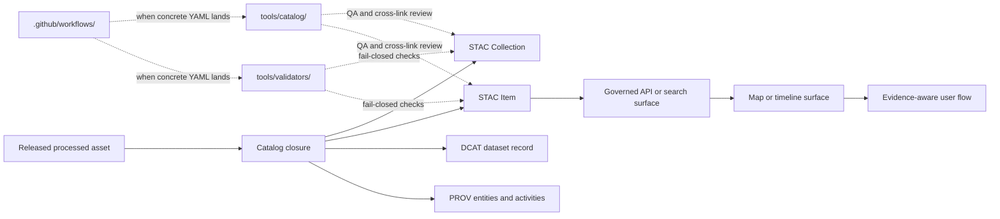

<!-- [KFM_META_BLOCK_V2]
doc_id: kfm://doc/NEEDS-VERIFICATION-UUID
title: STAC Catalog Surface
type: standard
version: v1
status: draft
owners: @bartytime4life
created: NEEDS VERIFICATION
updated: NEEDS VERIFICATION
policy_label: NEEDS VERIFICATION
related: [../../../README.md, ../../README.md, ../README.md, ../dcat/README.md, ../prov/README.md, ../../../docs/standards/README.md, ../../../docs/standards/KFM_STAC_PROFILE.md, ../../../contracts/README.md, ../../../schemas/README.md, ../../../policy/README.md, ../../../tools/catalog/README.md, ../../../tools/validators/README.md, ../../../tests/README.md, ../../../.github/workflows/README.md]
tags: [kfm, stac, catalog, geospatial, metadata]
notes: [Target path is confirmed on current public main; owners are grounded in the current broad /data/ CODEOWNERS fallback; doc UUID, created/updated dates, and policy label still require repo-side verification before publish.]
[/KFM_META_BLOCK_V2] -->

# STAC Catalog Surface

_Governed STAC-facing catalog surface for KFM spatial and temporal assets, release-linked metadata, and map/timeline discovery._

> **Status:** experimental  
> **Doc state:** draft  
> **Owners:** `@bartytime4life` *(current broad `/data/` CODEOWNERS fallback on public `main`)*  
> **Path:** `data/catalog/stac/README.md`  
> **Repo fit:** STAC member of the KFM catalog triplet (`DCAT + STAC + PROV`), sitting under [`data/`](../../README.md) and [`data/catalog/`](../README.md), and feeding governed discovery, timeline, and map-facing surfaces.  
> **Current public evidence:** this file already exists as a substantive draft README on public `main`; what remains thin in public view is deeper checked-in STAC payload inventory plus concrete validator and workflow entrypoints.  
> **Quick jumps:** [Scope](#scope) · [Repo fit](#repo-fit) · [Accepted inputs](#accepted-inputs) · [Exclusions](#exclusions) · [Current public evidence snapshot](#current-public-evidence-snapshot) · [Directory tree](#directory-tree) · [Quickstart](#quickstart) · [Usage](#usage) · [Diagram](#diagram) · [Tables](#tables) · [Task list](#task-list) · [FAQ](#faq) · [Appendix](#appendix)  
>      

> [!IMPORTANT]
> `data/catalog/stac/` is a **catalog** surface, not the canonical truth store.
>
> In KFM, STAC records describe **released** spatial or temporal assets after `PROCESSED` and within `CATALOG` closure. They must not become a shortcut around `RAW`, `WORK`, `QUARANTINE`, review, policy, release evidence, or correction handling.

> [!NOTE]
> Current public `main` no longer supports a “scaffold-only” reading of this lane.  
> What is still **not** confirmed from public-tree inspection alone is the deeper checked-in payload shape under `data/catalog/stac/`, the canonical machine-contract home for STAC validation, and any live workflow YAML or runtime-backed STAC API behavior.

> [!TIP]
> Keep **field-level STAC law** in [`../../../docs/standards/KFM_STAC_PROFILE.md`](../../../docs/standards/KFM_STAC_PROFILE.md).  
> This README is the **directory guide and boundary document**, not the hidden schema authority.

---

## Scope

This directory is the repo-facing home for **STAC-shaped catalog records** that describe KFM’s release-linked spatial and temporal assets.

It exists to make released geospatial assets discoverable, map-friendly, timeline-friendly, and cross-linkable without collapsing KFM’s stronger architectural boundaries. In plain terms:

- **STAC belongs to the catalog triplet**, alongside DCAT and PROV.
- **STAC is for spatial/temporal asset description and discovery**, not for replacing canonical processed artifacts.
- **STAC stays downstream of governed release**, not upstream of validation or policy.
- **STAC should stay link-rich**, so a user or service can move from asset discovery to lineage and outward dataset description without guesswork.

### Evidence boundary used in this README

| Layer | Status | What this README treats as true |
|---|---|---|
| Current public `main` repo tree | **CONFIRMED** | `data/catalog/stac/` exists, and `data/catalog/stac/README.md` is already a substantive draft directory guide. |
| Current public catalog tree depth | **CONFIRMED / NEEDS VERIFICATION** | Parent catalog surfaces and sibling README lanes are visible; deeper checked-in STAC Collection / Item payloads are not yet visible from the inspected public tree. |
| March–April 2026 KFM doctrine | **CONFIRMED** | Truth path, catalog triplet closure, authoritative-vs-derived separation, trust membrane, map-first delivery logic, 2D-by-default reasoning, and fail-closed posture. |
| Current public standards / helper surfaces | **CONFIRMED path / NEEDS VERIFICATION executable depth** | `docs/standards/KFM_STAC_PROFILE.md`, `tools/catalog/README.md`, `tools/validators/README.md`, `tests/README.md`, and `.github/workflows/README.md` exist; their machine-enforcement depth is not yet proven from public `main` alone. |
| Starter subtree beyond the README | **PROPOSED** | `collections/` and `items/` as the first checked-in file-first STAC shape. |
| Exact validators, branch protections, and workflow YAMLs | **UNKNOWN / NEEDS VERIFICATION** | Public `main` does not presently prove concrete STAC validator files, required checks, or checked-in workflow YAML for this lane. |

### What this README is for

This README is for maintainers who need to answer four practical questions quickly:

1. What belongs in `data/catalog/stac/`?
2. What does **not** belong here?
3. How should STAC relate to sibling DCAT and PROV records?
4. How should this lane stay useful to map and timeline surfaces without becoming sovereign truth?

[Back to top](#stac-catalog-surface)

---

## Repo fit

### Path and adjacency

`data/catalog/stac/` is one lane inside the broader `data/catalog/` metadata seam.

| Direction | Surface | Role here |
|---|---|---|
| Upstream | [`../../README.md`](../../README.md) | Governs the wider `data/` lifecycle and explains how `CATALOG` sits between `PROCESSED` and `PUBLISHED`. |
| Upstream | [`../README.md`](../README.md) | Parent catalog lane; explains the shared triplet closure and metadata-seam role. |
| Lateral | [`../dcat/README.md`](../dcat/README.md) | Dataset-level outward metadata sibling. |
| Lateral | [`../prov/README.md`](../prov/README.md) | Lineage and provenance sibling. |
| Upstream | [`../../../docs/standards/README.md`](../../../docs/standards/README.md) | Routing surface for standards ownership and profile placement. |
| Upstream | [`../../../docs/standards/KFM_STAC_PROFILE.md`](../../../docs/standards/KFM_STAC_PROFILE.md) | Dedicated standards home for KFM-specific STAC rules. |
| Authority neighbor | [`../../../contracts/README.md`](../../../contracts/README.md) | Contract lane for machine-readable trust objects; this README must not quietly replace it. |
| Authority neighbor | [`../../../schemas/README.md`](../../../schemas/README.md) | Live schema scaffold with unresolved schema-home authority; relevant when deciding where STAC machine validation really lives. |
| Authority neighbor | [`../../../policy/README.md`](../../../policy/README.md) | Rights, sensitivity, publication, reason, obligation, and fail-closed control layer. |
| Helper lane | [`../../../tools/catalog/README.md`](../../../tools/catalog/README.md) | Catalog QA, cross-link, and reviewer-facing helper surface. |
| Helper lane | [`../../../tools/validators/README.md`](../../../tools/validators/README.md) | Fail-closed validator-family surface for long-lived trust-bearing checks. |
| Verification lane | [`../../../tests/README.md`](../../../tests/README.md) | Fixtures, proof drills, and negative-path expectations. |
| Automation lane | [`../../../.github/workflows/README.md`](../../../.github/workflows/README.md) | Workflow-control surface; currently README-only on public `main`, so automation intent is visible but checked-in YAML depth is still bounded. |

### Why this directory matters

KFM doctrine is unusually strict about the difference between:

- **authoritative assets**
- **derived delivery artifacts**
- **metadata surfaces**
- **runtime presentation surfaces**

`data/catalog/stac/` sits in the metadata layer. It should help discovery and handoff without blurring those boundaries.

### Repo-fit summary

Use this directory when you need a **release-linked spatial/temporal discovery carrier**.

Do **not** use it as:

- a surrogate data lake,
- a place to hide policy decisions,
- a replacement for `contracts/` or `schemas/`,
- a miscellaneous validator bin,
- or a backdoor publication surface for unreleased material.

[Back to top](#stac-catalog-surface)

---

## Accepted inputs

The following belong here when they are **release-linked**, **policy-safe**, and **cross-linkable**.

| Accepted input | Belongs here when… | Notes |
|---|---|---|
| STAC Collection JSON | it describes a releasable dataset or product family with spatial/temporal extent | Typical shape for one recurring dataset family or product line |
| STAC Item JSON | it describes a released spatial/temporal asset, version, scene, granule, year, quad, tile, or similar unit | Granularity should follow source reality, not convenience alone |
| Asset metadata | it points to released processed artifacts and includes stable roles, media typing, and link targets | Metadata belongs here; the heavy asset does not |
| Spatial and temporal coverage | it captures `bbox`, geometry, and time semantics that make the release unit actually discoverable | Keep discovery useful without inventing false precision |
| Provider / keyword / instrument / projection detail | it materially improves interpretation or filtering | Add only when applicable; do not pad records with empty noise |
| Cross-links to PROV and sibling catalog surfaces | they resolve outward description and lineage cleanly | STAC should not be a dead end |
| Profile declarations / extension references | they align with the standards lane and are appropriate for emitted STAC records | Extension and profile law should still route back to the standards surface |

### Minimum practical rule

If a record cannot answer **what this asset is**, **where it applies**, **when it applies**, **what released artifact it points to**, and **how a reviewer gets from discovery to lineage**, it is not ready for this lane.

[Back to top](#stac-catalog-surface)

---

## Exclusions

These do **not** belong here.

| Exclusion | Why it stays out | Where it goes instead |
|---|---|---|
| Raw source files | STAC in KFM is not the raw intake surface | `data/raw/` |
| Work-in-progress or quarantined derivatives | Unreleased candidates must not be cataloged as if publishable | `data/work/` or `data/quarantine/` |
| Authoritative processed payloads themselves | This lane stores metadata, not the primary artifact body | `data/processed/` |
| Policy bundles, allow/deny rules, reason vocabularies | Catalog metadata must obey policy, not replace it | `policy/` |
| Contract schemas as the source of truth | README prose is not machine authority | `contracts/` and the eventual settled schema-authority lane |
| PROV lineage documents | STAC should link to lineage, not absorb it | `data/catalog/prov/` |
| DCAT dataset records | STAC is the spatial/temporal member of the triplet, not the whole triplet | `data/catalog/dcat/` |
| Catalog QA helpers or validator code | Release metadata and helper logic should stay separate | `tools/catalog/` or `tools/validators/` |
| Workflow YAML or automation-control prose | This README should not quietly become the CI surface | `.github/workflows/` |
| Map style JSON, renderer config, popup logic, UI state | Rendering and interaction belong to delivery/runtime layers | app, portrayal, standards, or renderer-specific surfaces |
| Unvalidated or rights-unclear records | Discovery metadata must not outrun governance | hold back until validated and policy-cleared |
| API behavior documentation | Static file layout and live service behavior are related but not identical | governed API / runtime docs |

> [!WARNING]
> Do not use this directory to smuggle unpublished material into a discoverable surface by way of “temporary” Item JSON. In KFM, temporary publication shortcuts become permanent trust debt.

[Back to top](#stac-catalog-surface)

---

## Current public evidence snapshot

| Surface | Current public `main` state | Why it matters here |
|---|---|---|
| [`README.md`](./README.md) | Present, substantive draft directory guide | This file should be revised in place, not replaced by a parallel STAC guide. |
| [`../../../docs/standards/KFM_STAC_PROFILE.md`](../../../docs/standards/KFM_STAC_PROFILE.md) | Present, substantive draft standard | STAC rule ownership already has a dedicated home. |
| [`../../../tools/catalog/README.md`](../../../tools/catalog/README.md) | Present, README-first helper lane | Catalog QA belongs there, not beside release metadata. |
| [`../../../tools/validators/README.md`](../../../tools/validators/README.md) | Present, README-first validator lane | Fail-closed trust checks should route there when entrypoints land. |
| [`../../../tests/README.md`](../../../tests/README.md) | Present, substantive directory index | Verification is treated as governed proof, not generic QA. |
| [`../../../.github/workflows/README.md`](../../../.github/workflows/README.md) | Present, README-only workflow lane | Automation intent is visible, but concrete checked-in YAML depth is still not a current public-main fact. |

### Why this snapshot matters

The main documentation job here is no longer “replace a placeholder.”  
It is to keep the STAC lane **accurate to the current public tree**, route contributors to the right adjacent authority surfaces, and leave unresolved machine-enforcement depth visible instead of smoothing it away.

[Back to top](#stac-catalog-surface)

---

## Directory tree

### Current confirmed public-main snapshot

```text
data/catalog/
├── README.md
├── dcat/
│   └── README.md
├── prov/
│   └── README.md
└── stac/
    └── README.md
```

### Doctrine-aligned starter shape for this lane

The following is a **PROPOSED** checked-in layout for a file-first STAC lane:

```text
data/catalog/stac/
├── README.md
├── collections/
│   └── <dataset>.json
└── items/
    └── <dataset>__<version>.json
```

### Optional surfaces that still need an intentional decision

The following are **NEEDS VERIFICATION** before they should be treated as standard:

- a checked-in root `catalog.json`
- example fixtures colocated in this directory rather than under `tests/`
- API landing-page material generated elsewhere and copied here
- branch-side generation-only outputs that are not meant to be committed

If those choices matter, write them down explicitly in standards or ADR surfaces rather than letting the directory drift into accidental convention.

[Back to top](#stac-catalog-surface)

---

## Quickstart

### Safe inspection first

```bash
# inspect the current catalog lane
find data/catalog -maxdepth 3 -type f | sort

# inspect the data lifecycle boundary around it
sed -n '1,220p' data/README.md
sed -n '1,220p' data/catalog/README.md
sed -n '1,220p' data/catalog/stac/README.md

# inspect the adjacent authority and helper lanes
sed -n '1,220p' docs/standards/README.md
sed -n '1,220p' docs/standards/KFM_STAC_PROFILE.md
sed -n '1,220p' contracts/README.md
sed -n '1,220p' schemas/README.md
sed -n '1,220p' policy/README.md
sed -n '1,220p' tools/catalog/README.md
sed -n '1,220p' tools/validators/README.md
sed -n '1,220p' tests/README.md
sed -n '1,220p' .github/workflows/README.md
```

### First authoring pass

1. Start with one **released** spatial/temporal asset or dataset version.
2. Decide whether you need:
   - one **Collection** plus one or more **Items**, or
   - a single **Item-only** publication shape with the omission explicitly justified.
3. Draft the STAC record so it points to **released processed artifacts**, not raw or work-state material.
4. Cross-link it to sibling **DCAT** and **PROV** records.
5. Only then wire it into the standards, helper, validator, and test lanes.

### Illustrative validation lane

```bash
# inspect currently documented helper and validator surfaces first
find tools/catalog tools/validators tests -maxdepth 3 -type f | sort

# once a concrete validator lands, run it against the candidate STAC record
# illustrative placeholder only — verify the exact entrypoint before use:
python <validator-entrypoint> data/catalog/stac/items/<dataset>__<version>.json
```

> [!TIP]
> Treat validation as more than JSON shape checking. In KFM, useful STAC validation also includes link resolution, release alignment, policy compatibility, and clean cross-links into DCAT and PROV.

[Back to top](#stac-catalog-surface)

---

## Usage

### STAC’s job inside KFM

STAC is the **spatial/temporal discovery view** of the catalog triplet.

That makes it especially useful for:

- map-facing discovery
- timeline-aware browsing
- asset preview and filtering
- spatial extent inspection
- machine-readable handoff into search, API, and map layers

That does **not** make it the strongest truth surface in the system. KFM still expects stronger authority to remain with released artifacts, receipts, policy, review state, and lineage.

### Static file lane versus STAC API

This README governs the **checked-in STAC file lane** under `data/catalog/stac/`.

If KFM also exposes a STAC API, that API is a **downstream governed service surface**. It may derive from approved release metadata, but it should not be treated as the same thing as the checked-in directory.

| Concern | File lane here | API lane elsewhere |
|---|---|---|
| Checked-in Collection / Item JSON | yes | maybe derived from here |
| Root landing behavior | optional / undecided | yes, if a STAC API is exposed |
| `conformsTo` and endpoint behavior | no | yes |
| `/collections` / search endpoints | no | yes |
| Release-linked metadata ownership | yes | should stay downstream of this lane |

### Where the field-level rules live

This README should stay **directory-focused**.

Field-by-field requirements, extension policy, and profile rules belong in:

- [`../../../docs/standards/KFM_STAC_PROFILE.md`](../../../docs/standards/KFM_STAC_PROFILE.md)
- relevant machine contracts once the canonical contract/schema home is settled
- policy and validator surfaces that can fail closed

### Collection versus Item granularity

A good starter rule:

- use a **Collection** for a stable dataset or product family
- use an **Item** for the releasable spatial/temporal unit that users and systems actually need to discover

That unit may be:

- one dataset version
- one year
- one quad
- one scene
- one granule
- one tile-aligned release package

The right granularity is the one that preserves reviewable meaning without turning every record into a giant, fuzzy bucket.

### Cross-link discipline

STAC records should not stand alone.

At minimum, maintain a clean relationship between:

- **STAC** for spatial/temporal asset discovery
- **DCAT** for outward dataset description
- **PROV** for lineage and derivation
- **processed artifacts** for the release-linked thing the records actually describe

### Release-safe asset linking

When STAC points to an asset:

- the asset should already be in a publishable class
- the link should not bypass policy or review
- the record should not imply a stronger access right than policy allows
- the artifact should be stable enough for citation, retrieval, and correction handling

### 2D-first, renderer-safe consequence

KFM’s map doctrine matters here: STAC helps discovery and delivery, but it does not own renderer state.

Keep these boundaries clean:

- **STAC** says what the asset is
- **style / renderer / layer config** says how it looks
- **UI state** says how a user is currently interacting with it
- **lineage / evidence / policy** says whether and how it should be trusted

[Back to top](#stac-catalog-surface)

---

## Diagram


```mermaid
flowchart LR
    A[Released processed asset] --> B[Catalog closure]
    B --> C[STAC Collection]
    B --> D[STAC Item]
    B --> E[DCAT dataset record]
    B --> F[PROV entities and activities]

    G[tools/catalog/] -. QA and cross-link review .-> C
    G -. QA and cross-link review .-> D
    H[tools/validators/] -. fail-closed checks .-> C
    H -. fail-closed checks .-> D
    I[.github/workflows/] -. when concrete YAML lands .-> G
    I -. when concrete YAML lands .-> H

    D --> J[Governed API or search surface]
    J --> K[Map or timeline surface]
    K --> L[Evidence-aware user flow]
```

[Back to top](#stac-catalog-surface)

---

## Tables

### Catalog triplet role map

| Surface | Primary job | Typical scope | KFM warning |
|---|---|---|---|
| DCAT | outward dataset description | dataset / distribution level | do not force spatial asset details here if STAC is the better home |
| STAC | spatial/temporal asset discovery | collection / item / asset level | do not mistake discoverability for authoritative truth |
| PROV | lineage and derivation | entity / activity / agent relationships | do not sever lineage links just because the asset is easy to render |

### Minimum KFM-facing STAC expectations

These are **starter expectations**, not a substitute for a formal profile.

| Object | Minimum expectation | Why it matters |
|---|---|---|
| Collection | stable `id`, human-readable title/description, license, spatial extent, temporal extent, providers/keywords where relevant | lets the dataset family be found and understood before drilling into items |
| Item | stable `id`, geometry, `bbox`, `datetime` (or equivalent temporal handling), relevant properties, assets with roles and resolvable targets | makes the release unit inspectable and machine-usable |
| Links | `self`, `collection` when used, plus any approved lineage-facing links | prevents metadata dead ends |
| Assets | point to released processed artifacts and related metadata or previews only | keeps the catalog release-safe |
| KFM alignment | cross-link cleanly to sibling DCAT and PROV records | preserves triplet integrity |

### Delivery choice versus STAC emphasis

| Delivery choice | What STAC should emphasize | Authoring caution |
|---|---|---|
| GeoJSON-first | direct feature asset description and modest interaction scope | avoid pretending large client-heavy payloads are free |
| Tiles-first | delivery artifact identity, rebuildability, and release linkage | keep source semantics separate from renderer convenience |
| Hybrid | authoritative release artifact plus interaction-friendly derivative references | be explicit about which asset is canonical and which is derived |

### Adjacent-lane routing rule

| Need | Primary lane | Why |
|---|---|---|
| Field-level STAC rules | `docs/standards/KFM_STAC_PROFILE.md` | standards belong in standards |
| Machine-readable trust objects | `contracts/` / settled schema home | prose is not schema authority |
| Policy decisions and fail-closed reasons | `policy/` | catalog metadata should obey policy, not redefine it |
| Catalog QA helpers | `tools/catalog/` | helper logic should stay separate from release metadata |
| Validator entrypoints | `tools/validators/` | trust-bearing checks need a dedicated fail-closed family |
| Negative-path fixtures and proof drills | `tests/` | verification belongs in governed proof surfaces |
| Workflow control | `.github/workflows/` | automation should remain explicit and reviewable |

[Back to top](#stac-catalog-surface)

---

## Task list

### Immediate

- [ ] Reconcile this README’s current-public snapshot with the checked-out branch before merge
- [ ] Confirm `doc_id`, `created`, `updated`, and `policy_label` in the meta block
- [ ] Confirm whether `@bartytime4life` remains the intended broad `/data/` owner or whether a narrower path owner should be added

### Structural

- [ ] Decide and document the standard checked-in subtree for STAC records (`collections/`, `items/`, and optional root `catalog.json`)
- [ ] Reconcile [`../../../docs/standards/KFM_STAC_PROFILE.md`](../../../docs/standards/KFM_STAC_PROFILE.md) with current public-main inspection and remove any stale “PDF-only” framing that no longer fits the visible tree
- [ ] Add at least one representative STAC Collection / Item pair, or document explicitly why the lane remains guide-only for now

### Validation and governance

- [ ] Confirm canonical machine authority across `contracts/` versus `schemas/`
- [ ] Land a concrete catalog QA helper under [`../../../tools/catalog/README.md`](../../../tools/catalog/README.md) and/or a fail-closed validator under [`../../../tools/validators/README.md`](../../../tools/validators/README.md)
- [ ] Add or confirm cross-link checks against sibling DCAT and PROV records
- [ ] Add negative-path tests so invalid links, raw/work leakage, rights gaps, and release-state mistakes fail closed
- [ ] Reconcile any future workflow automation with [`../../../.github/workflows/README.md`](../../../.github/workflows/README.md) and keep public-main versus platform-only behavior visibly separate

### Definition of done

This lane is in good standing when:

- this README matches current public-tree reality
- standards, helper, validation, and workflow routes are discoverable
- at least one representative STAC payload exists or the empty-state intent is explicit
- STAC ↔ DCAT ↔ PROV cross-links are clean
- no record quietly points to raw, work, or quarantined material
- concrete validator or workflow entrypoints are documented or checked in without overclaiming what public `main` actually shows

[Back to top](#stac-catalog-surface)

---

## FAQ

### Is STAC the authoritative truth layer in KFM?

No. STAC is a catalog/discovery layer over release-linked spatial and temporal assets.

### Does every KFM dataset need STAC?

No. STAC is strongest where a dataset has meaningful spatial and/or temporal asset structure. DCAT still matters more generally at the dataset / distribution level.

### Should this directory store the actual data files?

No. Store metadata records here; keep released artifacts in the appropriate processed or published lanes.

### Should a STAC Item ever point directly to raw or work-state material?

Not by default. In KFM, publishable discovery should normally resolve to released, policy-safe artifacts.

### Is a static file tree enough, or do we also need a STAC API?

Either can be valid. This README governs the checked-in file lane. Live API behavior should be documented separately and kept downstream of governed release metadata.

### Where should KFM-specific STAC rules really live?

In standards, contracts, policy, and validator surfaces, with this README acting as the directory guide rather than the hidden authority.

### Does public `main` currently prove executable STAC validation?

No. Public `main` proves the adjacent helper, validator, test, and workflow README lanes. It does not yet prove the exact checked-in STAC validator files or workflow YAMLs this directory might eventually use.

[Back to top](#stac-catalog-surface)

---

## Appendix

<details>
<summary>Appendix A — evidence labels used here</summary>

| Label | Meaning in this README |
|---|---|
| **CONFIRMED** | directly supported by current public repo inspection or attached KFM doctrine |
| **INFERRED** | conservative interpretation from adjacent confirmed repo or doctrinal evidence |
| **PROPOSED** | doctrine-aligned starter pattern not yet proven as checked-in branch reality |
| **UNKNOWN** | not verified strongly enough to present as settled current reality |
| **NEEDS VERIFICATION** | placeholder or repo/platform detail that should be checked before merge |

</details>

<details>
<summary>Appendix B — merge-time authoring checklist</summary>

Before treating a STAC record as ready, verify:

- the record points to a **released** artifact
- extent and time fields are present and meaningful
- asset links resolve cleanly
- sibling DCAT and PROV records exist where required
- lineage links are not broken
- no rights or sensitivity rule is violated by link targets or precision
- profile and validator checks pass
- omission of Collection or root catalog files is intentional and documented
- the README does not claim a helper, validator, or workflow file that the checked-out branch does not actually contain

</details>

<details>
<summary>Appendix C — neighboring files worth updating next</summary>

Good follow-on cleanup candidates:

- [`../README.md`](../README.md)
- [`../dcat/README.md`](../dcat/README.md)
- [`../prov/README.md`](../prov/README.md)
- [`../../../docs/standards/README.md`](../../../docs/standards/README.md)
- [`../../../docs/standards/KFM_STAC_PROFILE.md`](../../../docs/standards/KFM_STAC_PROFILE.md)
- [`../../../tools/catalog/README.md`](../../../tools/catalog/README.md)
- [`../../../tools/validators/README.md`](../../../tools/validators/README.md)
- [`../../../.github/workflows/README.md`](../../../.github/workflows/README.md)

</details>

[Back to top](#stac-catalog-surface)
