# 🛰️ STAC Catalog (SpatioTemporal Asset Catalog)


> **What this is:** The **spatial + temporal discovery layer** for KFM datasets & evidence artifacts 🧭  
> **What this is not:** a “nice-to-have” — STAC is part of the publish contract ✅

---

## ✨ Why this folder exists

KFM treats every dataset (and every derived/evidence artifact) as a **publishable, traceable object**.  
This directory stores the **STAC Collections and Items** that describe those objects and link them to the *actual* assets in `data/processed/**`.

Think of STAC here as the “map of the maps” 🗺️ — **machine-readable metadata** that powers:

- discovery (search/filter by area/time)
- API/UI linking (click a layer → resolve metadata + assets)
- governance (license + attribution surfaced consistently)
- reproducibility (ties into PROV lineage)

---

## 🔗 Quick links (nearby essentials)

- 📁 **Processed assets (the real data):** `../../processed/`
- 📁 **DCAT catalog (high-level discovery):** `../dcat/`
- 📁 **PROV lineage (how it was made):** `../../prov/` *(or `../../provenance/` depending on branch)*
- 📁 **Schemas:** `../../../schemas/stac/`
- 📄 **KFM STAC profile:** `../../../docs/standards/KFM_STAC_PROFILE.md`
- 📄 **Master guide:** `../../../docs/MASTER_GUIDE_v13.md`

> [!NOTE]
> Some KFM documentation references `data/stac/` as the STAC output location.  
> In this repo layout, **`data/catalog/stac/` is the canonical STAC surface** (and should remain structurally compatible).

---

## 🗂️ Directory layout

```text
📁 data/
└── 📁 catalog/
    ├── 📁 stac/
    │   ├── 📄 README.md
    │   ├── 📄 catalog.json                 # (optional) root STAC catalog entrypoint
    │   ├── 📁 collections/
    │   │   └── 📁 <collection-id>/
    │   │       └── 📄 collection.json
    │   └── 📁 items/
    │       └── 📁 <collection-id>/
    │           ├── 📄 <item-id>.json
    │           └── 📄 <item-id>.json
    └── 📁 dcat/
        └── 📄 ... (JSON-LD)
```

---

## 🧬 Where STAC fits in the KFM pipeline

```mermaid
flowchart LR
  A["Raw Sources"] --> B["ETL + Normalization"]
  B --> C["STAC Items + Collections"]
  C --> D["DCAT Dataset Views"]
  C --> E["PROV Lineage Bundles"]
  C --> G["Neo4j Graph (references back to catalogs)"]
  G --> H["API Layer (contracts + redaction)"]
  H --> I["Map UI — React · MapLibre · (optional) Cesium"]
  I --> J["Story Nodes (governed narratives)"]
  J --> K["Focus Mode (provenance-linked context bundle)"]
```



---

## ✅ Definition of Done (publish contract)

Whenever something changes in `data/processed/**`, the PR must include the metadata boundary artifacts:

- [ ] **STAC Collection** exists (new or updated)
- [ ] **STAC Item(s)** exist for the published asset(s)
- [ ] **DCAT dataset record** exists and points to STAC/distributions
- [ ] **PROV bundle** exists describing *inputs → processing → outputs* (agents, timestamps, parameters)
- [ ] Validation passes (schema + profile + link integrity)

> [!IMPORTANT]
> KFM is “fail closed” 🛑: missing **license**, **attribution**, or **provenance** is treated as a publish blocker.

---

## 🧱 STAC rules of thumb (KFM-friendly)

### 1) Collections vs Items
- **Collection** = dataset identity (“what is this dataset?”)  
- **Item** = dataset unit (“what files/tiles/scenes exist?”)

Use:
- **single file output** → one Collection + one Item (or Item-only if your profile allows, but prefer consistency)
- **many files / time series / tiled output** → Collection + many Items

### 2) IDs should be stable 🔒
- Prefer **human-readable slugs** over random UUIDs
- Never change an ID once published (graph + API + UI will reference it)

**Suggested convention** (adjust to `KFM_STAC_PROFILE`):
- Collection ID: `<domain>--<dataset>`
- Item ID: `<domain>--<dataset>--<time-or-tile>`

### 3) Items must point to real assets 🎯
- Asset `href` should resolve to:
  - `data/processed/**` (preferred in-repo), or
  - an equivalent stable storage endpoint (object store, API URL, etc.)

> [!TIP]
> Prefer **relative `href`s** where possible so catalogs remain portable across environments.

### 4) Attribution + license are not optional 📜
- Put dataset-level license in the Collection
- Repeat / override at the asset level if needed (assets can differ)

### 5) Evidence & AI outputs are first-class 📎🤖
Any analysis output / AI-generated layer is treated like “regular data”:
- stored in `data/processed/**`
- cataloged in **STAC + DCAT**
- traced in **PROV**
- linked carefully into the graph (references, not payload duplication)

---

## 🧾 Templates (copy/paste)

<details>
<summary><strong>📄 Minimal <code>collection.json</code></strong></summary>

```json
{
  "type": "Collection",
  "stac_version": "1.0.0",
  "id": "<collection-id>",
  "title": "<Human title>",
  "description": "<What is this dataset?>",
  "license": "<SPDX identifier or 'proprietary'>",
  "extent": {
    "spatial": { "bbox": [[-180.0, -90.0, 180.0, 90.0]] },
    "temporal": { "interval": [["<start-datetime>", "<end-datetime>"]] }
  },
  "links": [
    { "rel": "root", "href": "../../catalog.json", "type": "application/json" },
    { "rel": "items", "href": "../../items/<collection-id>/", "type": "application/json" }
  ],
  "providers": [
    { "name": "<Provider>", "roles": ["producer", "processor"], "url": "<optional>" }
  ],
  "summaries": {}
}
```

</details>

<details>
<summary><strong>🧾 Minimal <code>item.json</code></strong></summary>

```json
{
  "type": "Feature",
  "stac_version": "1.0.0",
  "id": "<item-id>",
  "collection": "<collection-id>",
  "geometry": null,
  "bbox": null,
  "properties": {
    "datetime": "<datetime-or-null>",
    "start_datetime": "<optional>",
    "end_datetime": "<optional>"
  },
  "links": [
    {
      "rel": "collection",
      "href": "../../collections/<collection-id>/collection.json",
      "type": "application/json"
    }
  ],
  "assets": {
    "data": {
      "href": "../../../../processed/<domain>/<path-to-asset>",
      "type": "<mime-type>",
      "roles": ["data"],
      "title": "<asset title>"
    }
  }
}
```

</details>

> [!NOTE]
> KFM adds project-specific fields (provenance refs, uncertainty indicators, etc.).  
> **Do not invent ad-hoc keys** — follow `docs/standards/KFM_STAC_PROFILE.md`.

---

## 🧪 Validation (local sanity checks)

Before opening a PR, do at least:

1) **Schema validation** against `schemas/stac/`  
2) **Profile validation** against `docs/standards/KFM_STAC_PROFILE.md`  
3) **Link integrity**
- items reference existing collections
- asset `href`s resolve
4) **Cross-catalog alignment**
- DCAT exists and links to STAC/distributions
- PROV exists and links inputs → outputs

<details>
<summary><strong>🐍 Tiny sanity-check script (optional)</strong></summary>

```bash
python - <<'PY'
from pathlib import Path

root = Path("data/catalog/stac")
collections = list(root.glob("collections/**/collection.json"))
items = [p for p in root.glob("items/**/*.json") if p.name != "collection.json"]

print("Collections:", len(collections))
print("Items:", len(items))
if collections:
    print("Example collection:", collections[0])
if items:
    print("Example item:", items[0])
PY
```

</details>

---

## 🚫 Common pitfalls (and how to avoid them)

- ❌ **Assets point to** `data/work/` → ✅ should point to **published** `data/processed/`
- ❌ **No license / unclear attribution** → ✅ include license + source/processing attribution
- ❌ **No provenance for derived layers** → ✅ add PROV for every pipeline output (especially AI outputs)
- ❌ **Changing IDs** → ✅ treat IDs as stable API contracts
- ❌ **Stuffing large binaries into the graph** → ✅ graph stores references to STAC/DCAT, not payloads

---

## 🤝 Contributing a new dataset (STAC checklist)

1. 📥 Ingest raw → `data/raw/<domain>/...`
2. 🧼 Transform → `data/work/<domain>/...`
3. 📦 Publish outputs → `data/processed/<domain>/...`
4. 🛰️ Add STAC → `data/catalog/stac/...`
5. 🧾 Add DCAT → `data/catalog/dcat/...`
6. 🧬 Add PROV → `data/prov/...` *(or `data/provenance/...`)*
7. ✅ Validate + open PR

---

## 📚 Related docs

- `../../../docs/MASTER_GUIDE_v13.md` — canonical repo structure & lifecycle
- `../../../docs/standards/KFM_STAC_PROFILE.md` — required STAC fields + extensions
- `../../../docs/standards/KFM_DCAT_PROFILE.md` — discovery layer requirements
- `../../../docs/standards/KFM_PROV_PROFILE.md` — lineage requirements
- `../../../schemas/stac/` — JSON Schemas used for validation

