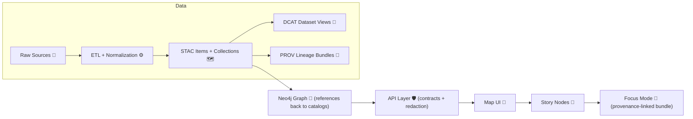

# 🗺️ STAC Collections — KFM Data Catalog


This folder contains **STAC Collection JSON** records for Kansas Frontier Matrix (KFM) datasets.  
Collections are **catalog boundary artifacts** 🧾—they are required for publication, discoverability, and traceability.

---

## 🧭 Quick links

- 📦 **Sibling folders**
  - ➡️ **STAC Items:** `../items/`
  - ➡️ **DCAT catalog:** `../../dcat/` *(if present in this repo layout)*
  - ➡️ **PROV lineage:** `../../../prov/` or `../../../provenance/` *(varies by repo version)*
  - ➡️ **Processed data:** `../../../processed/`
- 🧱 **Key sections**
  - [What belongs here](#-what-belongs-here)
  - [How Collections fit the pipeline](#-how-collections-fit-the-kfm-pipeline)
  - [Collection vs Item](#-collection-vs-item)
  - [Required linkage rules](#-required-linkage-rules)
  - [Naming, versioning, and stability](#-naming-versioning-and-stability)
  - [Definition of done](#-definition-of-done)
  - [Templates](#-templates)

---

## 📂 What belongs here

✅ Put **Collection-level** STAC JSON here, typically one file per dataset-family / domain dataset grouping.

Examples of when you want a Collection:
- A dataset with **multiple dates** (time series)
- A dataset with **multiple parts** (tiles, yearly splits, county splits)
- A “family” of assets (e.g., multiple derived layers all under a shared umbrella)

🚫 Do **not** put:
- STAC **Items** (they live in `../items/`)
- The actual data assets (those belong in `data/processed/**`)
- DCAT records (those belong in the DCAT catalog folder)
- PROV lineage bundles (those belong in the PROV folder)

---

## 🔁 How Collections fit the KFM pipeline

KFM treats STAC/DCAT/PROV as **required boundary artifacts** between data engineering and the graph/API/UI layers.



**Rule of thumb:** if it’s in `data/processed/**`, it should be **discoverable** via STAC/DCAT and **traceable** via PROV.

---

## 🧩 Collection vs Item

**When to create only an Item**
- Single dataset output (one file / one asset)  
- One-time snapshot

**When to create a Collection + Items**
- Multi-date time series (monthly, yearly, daily)
- Multi-part outputs (tiles, regions, formats)
- A “topic umbrella” with multiple derivative products

> 🧠 KFM commonly expects a Collection even for some non-spatial datasets (for consistency and discoverability), but geospatial outputs should always be represented with STAC.

---

## 🔗 Required linkage rules

KFM enforces **cross-layer links** so the catalog, provenance, and graph don’t drift apart.

### 1) STAC → Data (assets)
- STAC Items (and often the Collection) must point to **stable data asset locations**
- Asset links should resolve to `data/processed/**` or equivalent stable storage

### 2) DCAT → STAC / Distributions
- DCAT is the **high-level discovery layer**
- DCAT should link to the STAC entry (or directly to distributions/downloads)

### 3) PROV end-to-end
- PROV must link: **raw inputs → work intermediates → processed outputs**
- PROV should identify pipeline run/config (e.g., run ID, commit hash)

### 4) Graph references catalogs
- Neo4j should store **references** (STAC Item ID, DOI, etc.) rather than duplicating bulky data.

---

## 🏷️ Naming, versioning, and stability

### ✅ Stable IDs
- `id` is a **contract**. Treat it like an API name:
  - keep it stable
  - don’t recycle IDs
  - prefer lowercase + hyphenated slugs

**Recommended pattern**
- `kfm-<domain>-<dataset>`  
  Examples:
  - `kfm-historical-land-treaties`
  - `kfm-environment-air-quality`

### 📌 File naming
A simple, grep-friendly convention:
- `<collection-id>.collection.json`

Example:
- `kfm-historical-land-treaties.collection.json`

### ♻️ Dataset versioning
When a dataset is reprocessed or updated:
- Treat it as a **new version**
- Link it to its predecessor in **DCAT** and **PROV** (e.g., `prov:wasRevisionOf`)
- If your workflow supports it, assign a persistent identifier (DOI/ARK) for citation

> 🧱 KFM is contract-first: schema/profile changes should trigger explicit versioning & compatibility checks.

---

## ✅ Definition of done

Before merging a new Collection (or updating an existing one), verify:

- [ ] **Collection JSON exists** in this folder
- [ ] `type` is `"Collection"` and `id` matches the filename convention
- [ ] `title` + `description` are clear and human-readable ✍️
- [ ] **License is present** (fail-closed governance) 🛡️
- [ ] `extent.spatial` and `extent.temporal` are accurate 🗺️🕰️
- [ ] Links resolve:
  - [ ] Collection ↔ Items (`../items/`)
  - [ ] Items → assets in `data/processed/**`
  - [ ] STAC ↔ DCAT record (if used)
  - [ ] STAC ↔ PROV lineage bundle
- [ ] If this is an update: version/revision links exist in DCAT/PROV ♻️
- [ ] CI/validators pass ✅

---

## 🧪 Validation & CI expectations

KFM CI is expected to validate:
- STAC against the **KFM STAC profile**
- DCAT against the **KFM DCAT profile**
- PROV against the **KFM PROV profile**

🧯 Important behavior:
- If a pipeline adds data but does **not** add the required catalog + provenance artifacts, CI should reject the contribution.

---

## 🧰 Templates

> Tip: Keep templates minimal, valid JSON, and let CI/schema validation do the heavy lifting.

<details>
<summary><strong>🗂️ Minimal STAC Collection skeleton</strong> (expand)</summary>

```json
{
  "type": "Collection",
  "stac_version": "1.0.0",
  "id": "kfm-<domain>-<dataset>",
  "title": "<Human title>",
  "description": "<What this dataset family is, where it came from, and why it exists>",
  "license": "<SPDX-id-or-license-string>",
  "extent": {
    "spatial": {
      "bbox": [[-180.0, -90.0, 180.0, 90.0]]
    },
    "temporal": {
      "interval": [["<start-iso8601>", "<end-iso8601>"]]
    }
  },
  "links": [
    { "rel": "self", "href": "./kfm-<domain>-<dataset>.collection.json", "type": "application/json" },
    { "rel": "root", "href": "../catalog.json", "type": "application/json" },
    { "rel": "items", "href": "../items/", "type": "application/json" }
  ],
  "keywords": ["kansas", "kfm", "<domain>", "<topic>"],
  "providers": [
    { "name": "Kansas Frontier Matrix", "roles": ["producer", "processor"] }
  ]
}
```

</details>

<details>
<summary><strong>🔗 Recommended link targets</strong> (expand)</summary>

- **STAC Items folder:** `../items/`
- **Processed assets:** `../../../processed/<domain>/...`
- **PROV lineage bundle:** `../../../prov/<dataset>.prov.json` *(or `../../../provenance/` depending on layout)*
- **DCAT dataset record:** `../../dcat/<dataset>.dcat.jsonld` *(if used in this repo layout)*

</details>

---

## 🧯 Common pitfalls (and how to avoid them)

- **Missing license** 🛑  
  → Add it to STAC and ensure DCAT + PROV also reflect licensing.

- **Extent mismatch** (bbox or temporal interval too broad / too narrow)  
  → Compute from Items/asset metadata where possible; keep it truthful.

- **Broken relative links** 🔗  
  → Prefer repo-relative, stable paths and run link checks locally/CI.

- **Updating a dataset without version links** ♻️  
  → Add `prov:wasRevisionOf` (DCAT/PROV) and keep lineage explicit.

---

## 🤝 Contributing notes

- Collections are **contracts**: keep them stable, validated, and well-linked.
- If you generate artifacts via AI/automation, treat outputs as **drafts** and review them like code.

---

### 📌 You are here

```
📁 data/
└─ 📁 catalog/
   └─ 📁 stac/                             🛰️ STAC catalog (geospatial discovery)
      ├─ 📁 collections/                    👈 you are here (this README)
      └─ 📁 items/                          📦 STAC Items (per asset/scene/tile)
```

