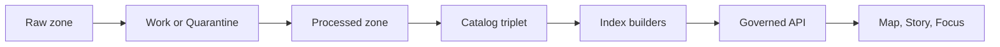

<!-- [KFM_META_BLOCK_V2]
doc_id: kfm://doc/490e6759-90fd-404c-bbab-9323643d2462
title: STAC Collections Catalog
type: standard
version: v1
status: draft
owners: kfm-platform (TODO: confirm)
created: 2026-02-24
updated: 2026-02-24
policy_label: public
related:
  - docs/MASTER_GUIDE_v13.md
  - docs/standards/KFM_STAC_PROFILE.md
  - docs/standards/KFM_DCAT_PROFILE.md
  - docs/standards/KFM_PROV_PROFILE.md
tags: [kfm, stac, catalog, provenance, governance]
notes:
  - Directory README for STAC Collection JSON outputs (catalog triplet).
[/KFM_META_BLOCK_V2] -->

# STAC Collections Catalog

Canonical **STAC Collection** JSON documents for KFM datasets (the catalog layer). Collections are **promotion-gated** artifacts: they must validate and cross-link with DCAT + PROV before anything is considered “published” in runtime surfaces.


> **Owners:** `kfm-platform` *(TODO: confirm)*  
> **Policy surface:** Yes — catalogs are contract artifacts (review carefully).  
> **Primary consumers:** Index builders → Governed API → Map/Story/Focus UI surfaces.

---

## Navigation

- [What lives here](#what-lives-here)
- [Where this fits](#where-this-fits)
- [Directory layout](#directory-layout)
- [Collection contract](#collection-contract)
- [Cross-links and evidence](#cross-links-and-evidence)
- [IDs and versioning](#ids-and-versioning)
- [Validation gates](#validation-gates)
- [How to add or update a collection](#how-to-add-or-update-a-collection)
- [Examples](#examples)
- [Troubleshooting](#troubleshooting)
- [Appendix](#appendix)

---

## What lives here

✅ **Acceptable inputs**

- STAC **Collection** JSON documents (one per dataset family / logical collection).
- Optional “collection-level assets” and “item_assets” definitions *when used by the project* (see STAC core spec).
- Machine-generated files are allowed **only if** generation is deterministic and reviewable (stable IDs, canonical JSON).

🚫 **Exclusions**

- STAC Items (go in the Items directory; do not mix Items into this folder).
- Any raw/work/processed data artifacts (COGs, GeoParquet, PMTiles, CSVs, etc).
- Secrets, credentials, or signed URLs.
- Human narrative content (belongs in governed docs / story nodes).

> **Note on repo structure**
> - Some KFM layouts place STAC under `data/stac/collections/` (and Items under `data/stac/items/`).  
> - This directory (`data/catalog/stac/collections/`) is valid if your repo consolidates catalogs under `data/catalog/…`, but ensure *one canonical location* and avoid drift.

[Back to top](#stac-collections-catalog)

---

## Where this fits

STAC Collections are part of KFM’s “catalog triplet” and act as a contract surface between pipeline outputs and runtime.



Practical meaning:

- A dataset is **not** considered publishable until it has:
  - processed artifacts
  - validated catalogs (STAC + DCAT)
  - PROV lineage or run receipts
  - assigned policy label

[Back to top](#stac-collections-catalog)

---

## Directory layout

> This is a *documentation example* (not a guarantee of current repo contents). Keep it aligned with the repo’s actual tree.

```text
data/
  catalog/
    stac/
      collections/
        README.md
        <collection_id>.json
      items/                     # if present (recommended)
        <item_id>.geojson
    dcat/
      ...                        # DCAT outputs (JSON-LD)
  prov/
    ...                          # PROV bundles / run receipts
schemas/
  stac/
    ...                          # STAC + KFM profile schemas
tools/
  validation/
    ...                          # link checks, schema checks, policy-as-code
```

[Back to top](#stac-collections-catalog)

---

## Collection contract

Collections in this folder must satisfy **both**:

1) **Upstream STAC Collection** requirements (core spec)  
2) **KFM STAC profile** requirements (project policy)

### Minimum upstream fields

At minimum, a Collection includes:

- `type`: `"Collection"`
- `stac_version`: (pinned version; see below)
- `id`
- `description`
- `license`
- `extent` (spatial + temporal)
- `links`

Strongly recommended upstream:

- `title`
- `providers`
- `keywords`
- `summaries`

### KFM profile additions

KFM expects additional, project-governed fields and links such as:

- `kfm:dataset_version_id`
- `kfm:policy_label` (or equivalent policy tag)
- A link to the DCAT dataset record (see Cross-links)

> **Sensitivity rule:** Spatial/temporal extent must be consistent with policy.  
> If precision could expose sensitive locations, the extent must be generalized.

[Back to top](#stac-collections-catalog)

---

## Cross-links and evidence

KFM treats catalogs as a contract surface. Collections here must cross-link so the system can resolve evidence deterministically.

### Required cross-links

Each STAC Collection **must** link to:

- **DCAT dataset record** via a `links[]` entry (recommended: `rel: "describedby"`)

Each STAC Item (elsewhere) should link to:

- **PROV activity or run receipt** (so a user-facing claim can trace to a producing run)
- **DCAT distribution** entry for the specific artifact class (if applicable)

### Link hygiene

- Prefer stable, resolvable `href`s.
- Use correct media types in `links[].type` (`application/json` for Collections; `application/geo+json` preferred for Items).
- Be careful with URI consistency; trailing slashes can be significant.

[Back to top](#stac-collections-catalog)

---

## IDs and versioning

### Deterministic IDs

KFM prefers deterministic, reviewable identifiers so diffs are meaningful.

Recommended patterns:

- **Collection ID:** `<domain>-<theme>-<version>`  
  Example: `hydrology-streamflow-v1`

- **Item ID:** `<domain>-<source>-<yyyymmdd>-<geohash5>-<sha8(fingerprint)>`

> Keep IDs stable across reruns. If inputs change, mint a new dataset version and link it as a revision.

### Dataset version lineage

When a dataset is updated or reprocessed:

- publish a new dataset version
- link the new version to the prior version in **DCAT** and **PROV** (e.g., `prov:wasRevisionOf` in DCAT, and PROV activities that derive v2 from v1)

[Back to top](#stac-collections-catalog)

---

## Validation gates

This directory is a **merge-blocking** policy surface. Expect CI to fail closed if requirements aren’t met.

### Definition of Done checklist

- [ ] Collection JSON validates against the pinned STAC schema and KFM profile
- [ ] `extent` provided (spatial bbox + temporal interval)
- [ ] `license` provided (SPDX identifier/expression when possible)
- [ ] `links[]` includes a resolvable DCAT dataset link (`rel: "describedby"` recommended)
- [ ] KFM fields present (`kfm:dataset_version_id`, policy label)
- [ ] No secrets; no signed URLs; no private tokens in `href`
- [ ] Link-check passes (no broken internal relative links)
- [ ] If sensitive: extents are generalized and policy label reflects restrictions
- [ ] PROV + DCAT counterparts exist for the same dataset version

### Local validation commands

Pick *one* method that matches your repo tooling (examples):

```bash
# 1) JSON syntax check (fast)
python -m json.tool data/catalog/stac/collections/<collection_id>.json > /dev/null

# 2) JSON Schema validation (requires jsonschema)
python -m jsonschema -i data/catalog/stac/collections/<collection_id>.json schemas/stac/collection.json
```

> If your repo validates against a remote/pinned upstream schema URL instead of `schemas/stac/…`, update the command above and keep the pin explicit.

[Back to top](#stac-collections-catalog)

---

## How to add or update a collection

1. **Choose the collection id**
   - Follow the deterministic naming convention.
   - If this is a new dataset version, bump the version suffix.

2. **Create or edit the JSON**
   - Ensure minimum upstream fields exist.
   - Add KFM-required fields.
   - Set `extent` carefully (generalize if needed).

3. **Add the DCAT + PROV siblings**
   - DCAT dataset record (and distributions)
   - PROV bundle / run receipt for the producing pipeline run

4. **Run validation locally**
   - schema validation
   - link checks (if available)

5. **Open PR**
   - Keep diffs small and reviewable.
   - If any policy exception is required, reference the governance ticket in the PR.

[Back to top](#stac-collections-catalog)

---

## Examples

### Minimal KFM-aligned Collection skeleton

```json
{
  "type": "Collection",
  "stac_version": "1.0.0",
  "id": "hydrology-streamflow-v1",
  "title": "Hydrology — Streamflow",
  "description": "Streamflow measurements normalized and published by KFM.",
  "license": "CC-BY-4.0",
  "extent": {
    "spatial": { "bbox": [[-102.0, 36.9, -94.6, 40.0]] },
    "temporal": { "interval": [["2020-01-01T00:00:00Z", null]] }
  },
  "links": [
    {
      "rel": "describedby",
      "href": "../../dcat/<dataset_id>.jsonld",
      "type": "application/ld+json",
      "title": "DCAT dataset record"
    }
  ],
  "stac_extensions": [],
  "summaries": {},
  "kfm:dataset_version_id": "kfm://dataset-version/<uuid>",
  "kfm:policy_label": "public"
}
```

> This is a starter template. Your repo may pin `stac_version` differently (and may require additional KFM fields).

### Link relations quick reference

Common `rel` values you’ll likely use:

- `self`, `root`, `parent`, `child` (hierarchy)
- `describedby` (link to DCAT dataset record)
- `license` (link to license text when `license: "other"`)

[Back to top](#stac-collections-catalog)

---

## Troubleshooting

**CI says “missing required field”**

- Confirm you’re validating against the same schema version CI uses.
- Ensure `extent.spatial.bbox` and `extent.temporal.interval` are present.

**Link-check fails**

- Check relative paths (`href`) from this file’s location.
- Ensure no accidental signed URLs or private endpoints were pasted in.

**Policy review flags sensitive geometry**

- Generalize bbox/temporal interval (coarser extents).
- Confirm policy label and obligations match governance decisions.

[Back to top](#stac-collections-catalog)

---

## Appendix

### Suggested file naming

- `<collection_id>.json` (recommended)
- Avoid spaces; use lowercase + hyphen separators.

### Optional: collection registry table

If this folder grows large, add a lightweight index table here:

| collection_id | domain | version | policy_label | dcat_record |
|---|---|---:|---|---|
| *(add rows)* |  |  |  |  |

