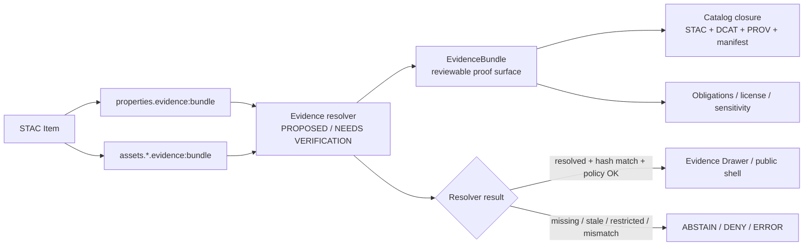

<!-- [KFM_META_BLOCK_V2]
doc_id: TODO-VERIFY-DOC-ID
title: STAC Evidence Bundle Extension
type: standard
version: v1
status: draft
owners: TODO-VERIFY-OWNER
created: TODO-VERIFY-CREATED-DATE
updated: TODO-VERIFY-UPDATED-DATE
policy_label: TODO-VERIFY-POLICY-LABEL
related: [PROPOSED:data/catalog/stac/extensions/evidence-bundle/schema.json, PROPOSED:contracts/objects/evidence-bundle/]
tags: [kfm, stac, evidence-bundle, provenance, catalog]
notes: [Repository path and ownership NEEDS VERIFICATION; extension identifier remains PROPOSED until accepted/published; companion schema and validator blocks are included for review]
[/KFM_META_BLOCK_V2] -->

# STAC Evidence Bundle Extension

Attach a compact, verifiable pointer from a STAC Item or Asset to a reviewable KFM EvidenceBundle.

> [!IMPORTANT]
> **Status:** experimental / **PROPOSED**  
> **Owners:** `TODO-VERIFY-OWNER`  
> **Target path:** `data/catalog/stac/extensions/evidence-bundle/README.md` — **PROPOSED / NEEDS VERIFICATION**  
> **Extension identifier:** `https://stac-extensions.github.io/evidence-bundle/v1.0.0/schema.json` — **PROPOSED until published**


**Quick jumps:** [Scope](#scope) · [Repo fit](#repo-fit) · [Inputs](#inputs) · [Exclusions](#exclusions) · [Field contract](#field-contract) · [Examples](#examples) · [Validation](#validation) · [Companion files](#companion-files) · [Review gates](#review-gates)

---

## Scope

The `evidence-bundle` extension is a small STAC Item extension for carrying trust metadata at the catalog edge.

It does **not** make STAC the source of truth. It lets a STAC Item or Asset say:

> “The evidence for this public artifact resolves over here, and the referenced bundle should match this digest.”

That keeps catalog discovery, proof resolution, policy review, and UI inspection connected without forcing the full EvidenceBundle into every STAC record.

### Truth posture

| Claim | Status | Meaning |
| --- | --- | --- |
| `EvidenceBundle` is a KFM proof object term | **CONFIRMED term / NEEDS VERIFICATION shape** | The term is established in the project corpus, but the final canonical schema home still needs repo verification. |
| This STAC extension | **PROPOSED** | Draft extension for review; not yet confirmed as accepted or published. |
| Target path | **PROPOSED / NEEDS VERIFICATION** | Suggested path follows the prior STAC-extension placement idea, but the mounted repo was not visible in this session. |
| Runtime resolver, route, CI enforcement | **UNKNOWN** | This README does not claim those exist. |

---

## Repo fit

> [!NOTE]
> The repository tree was not mounted in this workspace. Paths below are proposed integration points and should be checked against the actual repo before commit.

### Proposed location

```text
data/catalog/stac/extensions/evidence-bundle/
├── README.md
├── schema.json
├── examples/
│   ├── item-level.example.json
│   └── asset-level.example.json
└── fixtures/
    ├── valid/
    │   └── asset-level.valid.json
    └── invalid/
        ├── bad-spec-hash.invalid.json
        └── missing-kfm-required-fields.invalid.json
```

### Upstream / downstream relationships

| Direction | Proposed neighbor | Relationship |
| --- | --- | --- |
| Upstream | `contracts/objects/evidence-bundle/` | Canonical KFM EvidenceBundle schema, once verified. |
| Upstream | `contracts/objects/evidence-ref/` | EvidenceRef resolver input, once verified. |
| Upstream | STAC Item / Asset records | Catalog-facing place where `evidence:bundle` appears. |
| Downstream | `tools/validators/stac/` | Structural validation and KFM publication-profile checks. |
| Downstream | `tools/validators/catalog_matrix/` | Cross-checks STAC asset digests against manifests, DCAT, and PROV. |
| Downstream | Evidence resolver | Resolves the pointer to a reviewable EvidenceBundle before answer or publication. |
| Downstream | Evidence Drawer / shell | Displays evidence, freshness, sensitivity, review state, and correction context. |

---

## Inputs

Accepted inputs are intentionally narrow.

| Input | Accepted here | Notes |
| --- | --- | --- |
| STAC Item `properties.evidence:bundle` | Yes | Describes evidence for the Item as a whole. |
| STAC Asset `assets.<asset-key>.evidence:bundle` | Yes | Preferred when different assets have different proof bundles. |
| Stable evidence bundle URI | Yes | May be HTTPS, object-store URI, content-addressed URI, DOI resolver URI, or another governed resolver URI. |
| Integrity digest | Yes | `sha256:<64 hex>` or `sha512:<128 hex>`. |
| Evidence bundle license | Yes | SPDX expression preferred; custom URI/string allowed until canonical validation is decided. |
| Obligations URI | Yes | Points to attribution, sensitivity, access, or usage obligations. |

---

## Exclusions

These do **not** belong in the STAC extension field.

| Excluded material | Where it should go instead |
| --- | --- |
| Full EvidenceBundle contents | Canonical EvidenceBundle object store or contract-defined bundle path. |
| Raw source records | Governed source storage, RAW/WORK lanes, or published source descriptors. |
| Policy decision output | DecisionEnvelope / PolicyDecision proof objects. |
| Runtime answer text | RuntimeResponseEnvelope or Focus response contracts. |
| UI rendering hints | EvidenceDrawerPayload, not the STAC catalog field. |
| Secret, steward-only, or exact sensitive details | Restricted proof stores with resolver-mediated access. |
| Publication approval | PromotionDecision / release workflow, not a STAC Item field. |

> [!WARNING]
> A valid `evidence:bundle` field is **not** publication approval. It is a pointer plus metadata. KFM publication still requires the appropriate resolver, policy, review, and release gates.

---

## Field contract

### Field name

```text
evidence:bundle
```

### Placement

| Placement | Object path | Use when |
| --- | --- | --- |
| Item-level | `properties.evidence:bundle` | The whole STAC Item shares one evidence bundle. |
| Asset-level | `assets.<asset-key>.evidence:bundle` | Each asset may have distinct evidence, rights, obligations, or digest state. |

### Object shape

| Field | Type | STAC extension validation | KFM publication profile |
| --- | --- | --- | --- |
| `uri` | URI string | Optional, but required if the object has no other fields | **Required** |
| `spec_hash` | string | Optional; must match `sha256:<64 hex>` or `sha512:<128 hex>` when present | **Required** |
| `license` | string | Optional | Recommended; SPDX expression preferred |
| `obligations` | URI string | Optional | Recommended when rights, attribution, sensitivity, or use constraints exist |

### Why two validation levels?

The extension stays small and backwards-compatible for general STAC use. KFM can then apply a stricter publication profile without making the public STAC extension overfit one governance system.

| Layer | Purpose | Failure behavior |
| --- | --- | --- |
| STAC extension schema | Validate field shape and hash syntax. | Invalid STAC extension field fails structural validation. |
| KFM publication profile | Require `uri` + `spec_hash` and resolver readiness. | Missing proof metadata should block publication or trigger ABSTAIN / ERROR in runtime contexts. |
| Evidence resolver | Fetch and verify the EvidenceBundle. | Missing, stale, restricted, checksum-mismatched, or policy-incompatible bundles do not resolve as usable evidence. |

---

## Examples

### Item-level evidence bundle

```json
{
  "type": "Feature",
  "stac_version": "1.0.0",
  "stac_extensions": [
    "https://stac-extensions.github.io/evidence-bundle/v1.0.0/schema.json"
  ],
  "id": "kfm-example-item-2026-05",
  "geometry": null,
  "bbox": null,
  "properties": {
    "datetime": "2026-05-06T00:00:00Z",
    "evidence:bundle": {
      "uri": "https://example.org/evidence/kfm-example-item-2026-05.bundle.json",
      "spec_hash": "sha256:8a1f6f4a68c8d7d8e0f5f6c4b7d8e9f0a1b2c3d4e5f60718293a4b5c6d7e8f90",
      "license": "CC-BY-4.0",
      "obligations": "https://example.org/obligations/kfm-public-v1"
    }
  },
  "links": [],
  "assets": {}
}
```

### Asset-level evidence bundle

```json
{
  "type": "Feature",
  "stac_version": "1.0.0",
  "stac_extensions": [
    "https://stac-extensions.github.io/evidence-bundle/v1.0.0/schema.json"
  ],
  "id": "kfm-asset-evidence-example-2026-05",
  "geometry": null,
  "bbox": null,
  "properties": {
    "datetime": "2026-05-06T00:00:00Z"
  },
  "links": [],
  "assets": {
    "veg_cover_2024": {
      "href": "https://example.org/tiles/veg_2024.pmtiles",
      "type": "application/vnd.pmtiles",
      "roles": ["data"],
      "evidence:bundle": {
        "uri": "s3://evidence-bundles/kfm/ecology/veg-2024/proofpack-v1.json",
        "spec_hash": "sha256:f4c3b00c52f2e5dc83f2e2a5c5a5036f3dfef6d64ac92c1e9b82b2a4a0d76121",
        "license": "CC-BY-4.0",
        "obligations": "https://example.org/obligations/kfm-public-ecology-v1"
      }
    }
  }
}
```

---

## Diagram



---

## Validation

### Structural validation

Structural validation checks only the extension field shape.

It should not fetch remote bundles, evaluate policy, or approve publication.

| Check | Rule |
| --- | --- |
| Object type | `evidence:bundle` must be an object. |
| Unknown fields | Disallowed unless the schema is deliberately revised. |
| `uri` | Must be a URI string when present. |
| `spec_hash` | Must match `sha256:<64 hex>` or `sha512:<128 hex>` when present. |
| `license` | Must be a non-empty string when present. |
| `obligations` | Must be a URI string when present. |
| Empty object | Disallowed. |

### KFM publication-profile validation

KFM publication checks should be stricter than generic extension validation.

| Check | Rule |
| --- | --- |
| `uri` | Required. |
| `spec_hash` | Required. |
| Resolver | Must resolve the referenced bundle under current policy. |
| Integrity | Resolved bundle must match `spec_hash`. |
| Rights | License and obligations must be compatible with publication scope. |
| Sensitivity | Restricted or steward-only bundles must not leak through public STAC fields. |
| Result grammar | Failed resolution must produce a finite result such as `ABSTAIN`, `DENY`, or `ERROR`, not unsupported prose. |

---

## Companion files

The blocks below are proposed companion files. They are included here so reviewers can copy them into the repo after verifying the target paths.

<details>
<summary><strong>schema.json — PROPOSED companion schema</strong></summary>

```json
{
  "$schema": "http://json-schema.org/draft-07/schema#",
  "$id": "https://stac-extensions.github.io/evidence-bundle/v1.0.0/schema.json#",
  "title": "Evidence Bundle Extension",
  "description": "A minimal STAC Item extension for referencing an external, verifiable EvidenceBundle from an Item or Asset.",
  "type": "object",
  "allOf": [
    {
      "$ref": "#/definitions/item_fields"
    },
    {
      "$ref": "#/definitions/asset_fields"
    }
  ],
  "definitions": {
    "item_fields": {
      "type": "object",
      "properties": {
        "properties": {
          "type": "object",
          "properties": {
            "evidence:bundle": {
              "$ref": "#/definitions/evidence_bundle_ref"
            }
          },
          "additionalProperties": true
        }
      },
      "additionalProperties": true
    },
    "asset_fields": {
      "type": "object",
      "properties": {
        "assets": {
          "type": "object",
          "additionalProperties": {
            "type": "object",
            "properties": {
              "evidence:bundle": {
                "$ref": "#/definitions/evidence_bundle_ref"
              }
            },
            "additionalProperties": true
          }
        }
      },
      "additionalProperties": true
    },
    "evidence_bundle_ref": {
      "type": "object",
      "description": "Reference to a retrievable EvidenceBundle plus compact trust metadata.",
      "properties": {
        "uri": {
          "type": "string",
          "format": "uri",
          "description": "Stable retrievable location for the EvidenceBundle."
        },
        "spec_hash": {
          "type": "string",
          "pattern": "^(sha256:[A-Fa-f0-9]{64}|sha512:[A-Fa-f0-9]{128})$",
          "description": "Integrity fingerprint for the referenced EvidenceBundle."
        },
        "license": {
          "type": "string",
          "minLength": 1,
          "description": "License for the EvidenceBundle. SPDX expression preferred; URI or custom string allowed until the KFM profile tightens this field."
        },
        "obligations": {
          "type": "string",
          "format": "uri",
          "description": "URI for attribution, sensitivity, access, or usage obligations."
        }
      },
      "additionalProperties": false,
      "anyOf": [
        {
          "required": ["uri"]
        },
        {
          "required": ["spec_hash"]
        },
        {
          "required": ["license"]
        },
        {
          "required": ["obligations"]
        }
      ]
    }
  }
}
```

</details>

<details>
<summary><strong>tools/validators/stac/validate_evidence_bundle_extension.py — PROPOSED no-dependency validator</strong></summary>

```python
#!/usr/bin/env python3
"""
Validate the proposed STAC evidence-bundle extension.

Structural mode:
  - Checks shape, URI syntax, hash syntax, and unknown fields.

KFM profile mode:
  - Also requires uri and spec_hash for every evidence:bundle object.

This script intentionally does not fetch remote bundle URIs.
Resolver and policy checks belong in the governed evidence-resolution path.
"""

from __future__ import annotations

import argparse
import json
import re
import sys
from pathlib import Path
from typing import Any
from urllib.parse import urlparse


HASH_RE = re.compile(r"^(sha256:[A-Fa-f0-9]{64}|sha512:[A-Fa-f0-9]{128})$")
ALLOWED_FIELDS = {"uri", "spec_hash", "license", "obligations"}


def is_uri(value: str) -> bool:
    parsed = urlparse(value)
    return bool(parsed.scheme) and bool(parsed.netloc or parsed.path)


def validate_bundle_ref(ref: Any, path: str, *, kfm_profile: bool) -> list[dict[str, str]]:
    errors: list[dict[str, str]] = []

    def add(code: str, message: str) -> None:
        errors.append({"path": path, "code": code, "message": message})

    if not isinstance(ref, dict):
        add("bad_type", "evidence:bundle must be an object")
        return errors

    if not ref:
        add("empty_bundle_ref", "evidence:bundle must contain at least one supported field")
        return errors

    unknown = sorted(set(ref) - ALLOWED_FIELDS)
    for key in unknown:
        add("unknown_field", f"Unsupported evidence:bundle field: {key}")

    uri = ref.get("uri")
    if uri is not None:
        if not isinstance(uri, str) or not is_uri(uri):
            add("bad_uri", "uri must be a valid URI string")

    spec_hash = ref.get("spec_hash")
    if spec_hash is not None:
        if not isinstance(spec_hash, str) or not HASH_RE.match(spec_hash):
            add("bad_spec_hash", "spec_hash must match sha256:<64 hex> or sha512:<128 hex>")

    license_value = ref.get("license")
    if license_value is not None:
        if not isinstance(license_value, str) or not license_value.strip():
            add("bad_license", "license must be a non-empty string")

    obligations = ref.get("obligations")
    if obligations is not None:
        if not isinstance(obligations, str) or not is_uri(obligations):
            add("bad_obligations", "obligations must be a valid URI string")

    if kfm_profile:
        if "uri" not in ref:
            add("kfm_missing_uri", "KFM publication profile requires uri")
        if "spec_hash" not in ref:
            add("kfm_missing_spec_hash", "KFM publication profile requires spec_hash")

    return errors


def collect_bundle_refs(item: dict[str, Any]) -> list[tuple[str, Any]]:
    refs: list[tuple[str, Any]] = []

    properties = item.get("properties")
    if isinstance(properties, dict) and "evidence:bundle" in properties:
        refs.append(("properties.evidence:bundle", properties["evidence:bundle"]))

    assets = item.get("assets")
    if isinstance(assets, dict):
        for asset_key, asset in assets.items():
            if isinstance(asset, dict) and "evidence:bundle" in asset:
                refs.append((f"assets.{asset_key}.evidence:bundle", asset["evidence:bundle"]))

    return refs


def validate_item(item: Any, *, kfm_profile: bool) -> dict[str, Any]:
    errors: list[dict[str, str]] = []

    if not isinstance(item, dict):
        return {
            "ok": False,
            "errors": [
                {
                    "path": "$",
                    "code": "bad_item_type",
                    "message": "STAC item must be a JSON object"
                }
            ]
        }

    for path, ref in collect_bundle_refs(item):
        errors.extend(validate_bundle_ref(ref, path, kfm_profile=kfm_profile))

    return {
        "ok": not errors,
        "profile": "kfm-publication" if kfm_profile else "structural",
        "evidence_bundle_refs": len(collect_bundle_refs(item)),
        "errors": errors
    }


def main() -> int:
    parser = argparse.ArgumentParser()
    parser.add_argument("item", type=Path, help="Path to a STAC Item JSON file")
    parser.add_argument(
        "--kfm-profile",
        action="store_true",
        help="Require KFM publication-profile fields: uri and spec_hash"
    )
    args = parser.parse_args()

    try:
        item = json.loads(args.item.read_text(encoding="utf-8"))
    except Exception as exc:
        print(
            json.dumps(
                {
                    "ok": False,
                    "errors": [
                        {
                            "path": str(args.item),
                            "code": "load_error",
                            "message": str(exc)
                        }
                    ]
                },
                indent=2
            )
        )
        return 2

    report = validate_item(item, kfm_profile=args.kfm_profile)
    print(json.dumps(report, indent=2, sort_keys=True))
    return 0 if report["ok"] else 2


if __name__ == "__main__":
    raise SystemExit(main())
```

</details>

<details>
<summary><strong>fixtures/invalid/bad-spec-hash.invalid.json — PROPOSED negative fixture</strong></summary>

```json
{
  "type": "Feature",
  "stac_version": "1.0.0",
  "stac_extensions": [
    "https://stac-extensions.github.io/evidence-bundle/v1.0.0/schema.json"
  ],
  "id": "bad-spec-hash-example",
  "geometry": null,
  "bbox": null,
  "properties": {
    "datetime": "2026-05-06T00:00:00Z",
    "evidence:bundle": {
      "uri": "https://example.org/evidence/bad.bundle.json",
      "spec_hash": "sha256:not-a-real-digest"
    }
  },
  "links": [],
  "assets": {}
}
```

</details>

<details>
<summary><strong>fixtures/invalid/missing-kfm-required-fields.invalid.json — PROPOSED KFM-profile negative fixture</strong></summary>

```json
{
  "type": "Feature",
  "stac_version": "1.0.0",
  "stac_extensions": [
    "https://stac-extensions.github.io/evidence-bundle/v1.0.0/schema.json"
  ],
  "id": "missing-kfm-required-fields-example",
  "geometry": null,
  "bbox": null,
  "properties": {
    "datetime": "2026-05-06T00:00:00Z",
    "evidence:bundle": {
      "license": "CC-BY-4.0"
    }
  },
  "links": [],
  "assets": {}
}
```

</details>

---

## Quickstart

> [!NOTE]
> Commands are **PROPOSED** until the repository’s actual validator path and test harness are verified.

Validate one STAC Item structurally:

```bash
python tools/validators/stac/validate_evidence_bundle_extension.py \
  data/catalog/stac/items/example.json
```

Validate the stricter KFM publication profile:

```bash
python tools/validators/stac/validate_evidence_bundle_extension.py \
  data/catalog/stac/items/example.json \
  --kfm-profile
```

Expected failure shape:

```json
{
  "errors": [
    {
      "code": "kfm_missing_spec_hash",
      "message": "KFM publication profile requires spec_hash",
      "path": "properties.evidence:bundle"
    }
  ],
  "evidence_bundle_refs": 1,
  "ok": false,
  "profile": "kfm-publication"
}
```

---

## Review gates

Before this extension is promoted from **PROPOSED** to **active**, reviewers should confirm:

- [ ] Target path matches the actual repository layout.
- [ ] Owners are named in the KFM meta block and impact block.
- [ ] Policy label is resolved.
- [ ] Extension identifier is either published or replaced with the repo’s canonical internal schema URI.
- [ ] `schema.json` validates Item-level and Asset-level examples.
- [ ] Negative fixtures fail deterministically.
- [ ] KFM publication profile requires `uri` and `spec_hash`.
- [ ] Resolver behavior is tested for success, stale, restricted, missing, and checksum-mismatch cases.
- [ ] Catalog closure checks can join STAC asset evidence to release manifest, DCAT, and PROV references.
- [ ] Public examples do not leak RAW, WORK, steward-only, or exact sensitive details.
- [ ] Adjacent docs link to this README after the final path is verified.

---

## FAQ

### Why not put the full EvidenceBundle inside the STAC Item?

Because STAC is the catalog edge, not the proof store. Embedding full proof bundles would make Items heavy, increase drift risk, and blur the resolver boundary.

### Why allow both Item-level and Asset-level placement?

Some Items have one proof bundle for the whole release object. Others have separate assets with different derivations, licenses, checksums, sensitivity classes, or obligations. Asset-level placement keeps proof metadata close to the asset it governs.

### Why is `license` not fully SPDX-validated here?

The generic extension keeps validation lightweight. The KFM publication profile can tighten this later once the repository’s license vocabulary and obligations registry are confirmed.

### Does `spec_hash` hash the STAC Item or the EvidenceBundle?

In this extension, `spec_hash` identifies the referenced EvidenceBundle’s normalized specification/content payload. It is not the STAC Item checksum. Catalog-matrix checks may separately compare STAC asset checksums, release-manifest digests, DCAT distribution checksums, and PROV entity identifiers.

### Can a public STAC Item point to a restricted EvidenceBundle?

Only if the resolver and policy layer can safely represent that state without leaking restricted details. Public Items should not expose secret or steward-only locations. When in doubt, publish a public-safe bundle facade with obligations and resolver status rather than an internal URI.

---

## Appendix: reference posture

This extension is designed around four KFM constraints:

1. **EvidenceRef resolves to EvidenceBundle before answer or publication.**
2. **STAC, DCAT, and PROV are complementary outward catalog and lineage surfaces.**
3. **`spec_hash` gives deterministic identity for proof-bearing objects.**
4. **Publication is a governed decision, not a file move or a catalog-field side effect.**

Those constraints make `evidence:bundle` intentionally small: a pointer, a digest, a license, and obligations.

[Back to top](#stac-evidence-bundle-extension)
