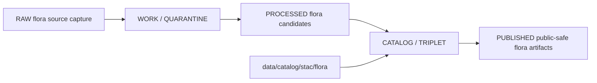

<!-- [KFM_META_BLOCK_V2]
doc_id: kfm://doc/data-catalog-stac-flora-readme
title: data/catalog/stac/flora/README.md — Flora STAC Catalog Sublane README
version: v0.1
type: readme; data-lifecycle-sublane; stac-catalog-guide; flora-catalog-projection
status: draft; PROPOSED; data-root; catalog-stage; stac; flora; release-gated; sensitivity-aware
owners: OWNER_TBD — Flora steward · Data steward · Catalog steward · STAC steward · Evidence steward · Source steward · Policy steward · Release steward · Schema steward · Docs steward
created: NEEDS VERIFICATION — placeholder existed before v0.1 expansion
updated: 2026-06-25
policy_label: public-doc; data; catalog; stac; flora; lifecycle; release-gated; sensitivity-aware
compatibility: STAC 1.0.0; KFM STAC profile PROPOSED
tags: [kfm, data, catalog, stac, flora, STAC, CATALOG, DCAT, PROV, EvidenceBundle, SourceDescriptor, RunReceipt, ReleaseManifest, CatalogBuildReceipt]
related:
  - ../README.md
  - ../../README.md
  - ../../../README.md
  - ../../dcat/flora/README.md
  - ../../prov/flora/README.md
  - ../../domain/flora/README.md
  - ../../../triplets/graph_deltas/flora/
  - ../../../triplets/exports/flora/
  - ../../../proofs/
  - ../../../receipts/
  - ../../../published/
  - ../../../registry/
  - ../../../../docs/standards/STAC.md
  - ../../../../docs/adr/ADR-0022-catalog-matrix--stac-+-dcat-+-prov-must-agree.md
  - ../../../../schemas/contracts/v1/domains/flora/
  - ../../../../policy/domains/flora/
  - ../../../../release/
notes:
  - "This file replaces a placeholder at `data/catalog/stac/flora/README.md`."
  - "Flora STAC records are spatiotemporal catalog carriers and do not replace Flora domain records, DCAT records, PROV records, EvidenceBundle, SourceDescriptor, receipts, policy decisions, release manifests, or release decisions."
  - "Sensitive Flora representations must use approved public-safe forms before any release-linked STAC record is public."
  - "ADR-0022 requires STAC, DCAT, and PROV-O catalog records to agree by identifier, digest, and release reference for promoted releases."
  - "Rollback target for this expansion is previous placeholder blob SHA `e25f1814e51579d5f55c0f1fe0135ddb28a47f4a`."
[/KFM_META_BLOCK_V2] -->

# data/catalog/stac/flora

> Flora-specific STAC catalog sublane for governed STAC Catalog, Collection, Item, Asset, and Link records inside the `CATALOG / TRIPLET` lifecycle stage.

  
  
  
  
  
  

**Status:** draft / PROPOSED  
**Path:** `data/catalog/stac/flora/README.md`  
**Owning root:** `data/catalog/stac/`  
**Domain segment:** `flora`  
**Lifecycle stage:** `CATALOG / TRIPLET`  
**External vocabulary:** STAC 1.0.0 with KFM profile extensions  
**Exposure posture:** RELEASED ONLY  
**Truth posture:** CONFIRMED target was a placeholder · CONFIRMED parent STAC lane is CATALOG-stage and RELEASED ONLY for public exposure · CONFIRMED Flora domain catalog lane lists `data/catalog/stac/flora/` as the Flora spatiotemporal catalog projection · CONFIRMED Flora DCAT and PROV lanes expect Flora STAC/DCAT/PROV closure for promoted releases · NEEDS VERIFICATION for concrete STAC record inventory, schemas, extension contexts, validators, policy gates, receipts, release manifests, CatalogMatrix artifacts, and routed access behavior.

**Quick jumps:** [Purpose](#purpose) · [Lifecycle boundary](#lifecycle-boundary) · [Repo fit](#repo-fit) · [Accepted contents](#accepted-contents) · [Exclusions](#exclusions) · [Record requirements](#record-requirements) · [Flora STAC guardrails](#flora-stac-guardrails) · [Evidence ledger](#evidence-ledger) · [Validation checklist](#validation-checklist) · [Rollback](#rollback)

---

## Purpose

`data/catalog/stac/flora/` stores or stages Flora-specific STAC catalog records for plant-related spatiotemporal assets.

Likely records include collections, items, assets, and links for Flora datasets, public-safe derivative artifacts, validation outputs, and release-linked Flora catalog artifacts.

A Flora STAC record supports spatiotemporal discovery and map/client interoperability. It does **not** make a Flora claim true, public, policy-admitted, evidence-supported, sensitivity-approved, or released by itself.

## Lifecycle boundary

`data/catalog/stac/flora/` is a CATALOG-stage sublane. Public exposure applies only to records tied to approved release state, governed access path, EvidenceBundle support, source-role support, policy posture, and release/rollback linkage.

## Repo fit

| Responsibility | Correct home | Rule |
|---|---|---|
| Flora STAC catalog records | `data/catalog/stac/flora/` | This lane. |
| Parent STAC catalog lane | `data/catalog/stac/` | STAC 1.0.0 catalog projection. |
| Flora DCAT catalog records | `data/catalog/dcat/flora/` | Dataset/distribution catalog records. |
| Flora PROV catalog records | `data/catalog/prov/flora/` | Provenance catalog projection. |
| Flora domain catalog records | `data/catalog/domain/flora/` | Domain-scoped Flora catalog records. |
| Flora graph/triplet projections | `data/triplets/graph_deltas/flora/`, `data/triplets/exports/flora/` | Paired graph stage. |
| Flora proof/evidence | `data/proofs/` or accepted proof roots | EvidenceBundle and proof records. |
| Flora receipts | `data/receipts/` or accepted receipt roots | RunReceipt, CatalogBuildReceipt, validation, policy, review, transform, correction, and release receipts. |
| Flora release decisions | `release/` | Publication authority. |
| Flora schemas and policy | `schemas/contracts/v1/domains/flora/`, `policy/domains/flora/` | Separate roots; paths remain PROPOSED until verified. |

## Accepted contents

| Content | Purpose |
|---|---|
| Flora STAC Catalog records | Navigational roots and Flora deployment/domain groupings. |
| Flora STAC Collection records | Stable Flora dataset-family handles with shared license, extent, profile, policy, and release context. |
| Flora STAC Item records | Atomic feature records with policy-safe spatial/temporal fields, collection back-reference, assets, links, and KFM extension fields. |
| Flora STAC Asset descriptors | Asset metadata for GeoParquet, COG, PMTiles, thumbnails, sidecars, metadata, and validation outputs. |
| Flora STAC Links | Typed links such as collection, derived_from, source, evidence, release, DCAT, PROV, and related catalog projections. |
| KFM extension fields | Flora source, evidence, release, policy, digest, rights, sensitivity, namespace, and rollback pointers. |
| CatalogMatrix references | Links to Flora STAC/DCAT/PROV closure artifacts where they exist. |
| Validation summaries | Pointers to validation reports and receipts. |

## Exclusions

| Do not put here | Correct home |
|---|---|
| Flora RAW source files | `data/raw/flora/` |
| Flora WORK/intermediate data | `data/work/flora/` |
| Flora quarantined data | `data/quarantine/flora/` |
| Flora processed datasets | `data/processed/flora/` |
| Flora DCAT records | `data/catalog/dcat/flora/` |
| Flora PROV records | `data/catalog/prov/flora/` |
| Flora domain catalog records | `data/catalog/domain/flora/` |
| Flora graph/triplet edges | `data/triplets/.../flora/` |
| Flora EvidenceBundle/proof records | `data/proofs/` or accepted proof roots |
| Flora source registry records | `data/registry/` or accepted source registry root |
| Flora receipts and attestations | `data/receipts/` or accepted receipt/proof roots |
| Release decisions | `release/` |
| Published Flora products | `data/published/.../flora/` |
| Flora schemas | `schemas/contracts/v1/domains/flora/` |
| Flora policy rules | `policy/domains/flora/` |
| Validators/tests/code | `tools/validators/`, `tests/`, implementation roots |

## Record requirements

PROPOSED until schema and validator are verified:

| Requirement | Meaning |
|---|---|
| Stable Flora identifier | Identifier matches the Flora artifact identity used by catalog closure. |
| STAC core shape | Catalog, Collection, Item, Asset, and Link records preserve STAC 1.0.0 shape and extension declarations. |
| Spatial fields | Items preserve policy-safe spatial representation. |
| Temporal fields | Items preserve datetime or start/end time according to the Flora STAC profile. |
| Asset metadata | Assets preserve href, media type, roles, checksum/digest, and release posture. |
| Evidence reference | EvidenceBundle/proof context is referenced when Flora claims depend on evidence. |
| Run/receipt reference | RunReceipt or equivalent receipt is referenced where material. |
| Source reference | SourceDescriptor/source catalog is referenced when source authority matters. |
| Policy reference | Sensitive, rights-restricted, or embargoed material references policy/review posture. |
| Release reference | Public or release-linked records point to immutable ReleaseManifest and rollback target. |
| Closure compatibility | Flora STAC ↔ DCAT ↔ PROV agreement holds for promoted releases. |

## Flora STAC guardrails

- Flora STAC records are catalog/spatiotemporal carriers, not Flora source truth.
- Sensitive Flora spatial representation must follow policy and release state before public exposure.
- STAC should point to public-safe outputs when source material is restricted.
- Flora STAC records, Flora DCAT records, and Flora PROV records for the same released artifact must agree on identifier, digest, and release reference.
- STAC catalog records do not replace EvidenceBundle, SourceDescriptor, RunReceipt, PolicyDecision, ReleaseManifest, or CatalogMatrix closure artifacts.
- Watchers and source-head checks may propose candidates; they do not publish STAC records.
- Unreleased Flora STAC records are not public merely because they exist under this directory.

## Evidence ledger

| Source | Status | Supports | Limits |
|---|---|---|---|
| `data/catalog/stac/flora/README.md` prior file | CONFIRMED | Target existed as a placeholder. | Did not define Flora STAC sublane boundaries. |
| `data/catalog/stac/README.md` | CONFIRMED | Parent STAC CATALOG-stage lane and RELEASED ONLY posture. | Does not prove Flora STAC record inventory. |
| `data/catalog/domain/flora/README.md` | CONFIRMED | Flora domain lane and related STAC path expectation. | Does not prove concrete STAC records exist. |
| `data/catalog/dcat/flora/README.md` | CONFIRMED sibling pattern | Flora DCAT sublane and Flora STAC/DCAT/PROV closure posture. | DCAT pattern does not prove STAC inventory. |
| `data/catalog/prov/flora/README.md` | CONFIRMED sibling pattern | Flora PROV sublane and Flora STAC/DCAT/PROV closure posture. | PROV pattern does not prove STAC inventory. |
| `docs/standards/STAC.md` | CONFIRMED doctrine / PROPOSED implementation | STAC 1.0.0 adoption, lifecycle placement, KFM extension posture, and core fields. | Concrete schemas, extension contexts, and validators remain NEEDS VERIFICATION. |
| `ADR-0022` | CONFIRMED doctrine / PROPOSED implementation | STAC/DCAT/PROV agreement invariant and CatalogMatrix requirement. | Does not prove emitted Flora CatalogMatrix or CI enforcement. |

## Validation checklist

- [ ] Confirm actual child directories and Flora STAC record files.
- [ ] Confirm Flora STAC schema/profile and extension context location.
- [ ] Confirm Flora STAC validator and CI checks.
- [ ] Confirm Flora STAC/DCAT/PROV CatalogMatrix closure.
- [ ] Confirm ReleaseManifest linkage for public Flora STAC records.
- [ ] Confirm EvidenceBundle, SourceDescriptor, RunReceipt, PolicyDecision, and CatalogBuildReceipt references.
- [ ] Confirm rights, sensitivity, source-role, namespace, geometry, and publication handling.
- [ ] Confirm withdrawal/supersession behavior for stale or failed Flora STAC records.

## Rollback

Rollback is required if this lane becomes a Flora source-data root, proof store, source-registry root, receipt/attestation store, release-decision root, published-output root, domain catalog root, DCAT root, PROV root, schema root, policy root, validator root, implementation root, or public exposure shortcut.

Rollback target for this expansion: previous placeholder blob SHA `e25f1814e51579d5f55c0f1fe0135ddb28a47f4a`.

<a href="#top">Back to top</a>

