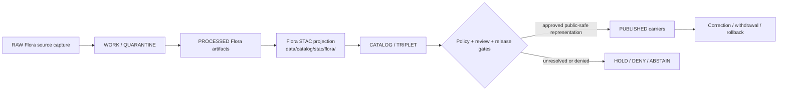

<!-- [KFM_META_BLOCK_V2]
doc_id: kfm://doc/data-catalog-stac-flora-readme
title: data/catalog/stac/flora/ — Governed Flora STAC Catalog Lane
version: v0.2.0
type: readme; data-lifecycle-sublane; stac-catalog-guide; flora-catalog-projection; release-gated; sensitivity-aware
status: repository-grounded draft; canonical placement; proposed realization; catalog-stage; release-gated
owners: NEEDS VERIFICATION — Flora, data, catalog, STAC, evidence, source, rights, sensitivity, policy, validation, release, correction, rollback, schema, standards, and docs stewards
created: NEEDS VERIFICATION — placeholder lineage predates v0.1
updated: 2026-07-25
policy_label: restricted-review; data-catalog; stac; flora; release-gated; deny-sensitive-location-by-default
current_path: data/catalog/stac/flora/README.md
historical_placeholder_blob: e25f1814e51579d5f55c0f1fe0135ddb28a47f4a
prepared_under_prompt: KFM Markdown Modernization & GitHub Documentation Implementation Agent v4.0.0
review_packet_id: kfm-flora-stac-catalog-readme-20260725
truth_posture: >
  CONFIRMED exact path, current blob, Directory Rules placement, parent STAC lane,
  Flora DCAT and PROV sibling guides, Flora schema index, draft STAC adoption
  reference, proposed ADR-0022 closure rule, and release-gated Flora catalog posture /
  PROPOSED concrete Flora STAC application profile, namespace, extension contexts,
  machine schemas, record realization, deterministic validators, catalog closure,
  correction propagation, and public delivery / UNKNOWN recursive STAC payload
  inventory, active producers and consumers, runtime reads, hosts, caches, public
  effects, correction execution, and rollback execution / NEEDS VERIFICATION
  accountable stewardship, accepted ADR decisions, profile and namespace maturity,
  rights and sensitivity authority convergence, release closure, and public-client
  exclusion
evidence_snapshot:
  repository: bartytime4life/Kansas-Frontier-Matrix
  base_ref: main
  base_commit: ccf7bdb725faf40b223232bab237b69c220e7662
  prior_blob: 5227e1fb80d9cf7f124e5f85feec26ce7e5ea8e9
  historical_placeholder_blob: e25f1814e51579d5f55c0f1fe0135ddb28a47f4a
  method: complete target read plus bounded Directory Rules, parent STAC, Flora DCAT/PROV, STAC standard, Flora schema, overlap, branch, and pull-request inspection; no recursive clone, STAC payload sampling, source-payload access, runtime, deployment, host-render, release, or public-client inspection
related:
  - ../README.md
  - ../../README.md
  - ../../domain/flora/README.md
  - ../../dcat/flora/README.md
  - ../../prov/flora/README.md
  - ../../../registry/sources/flora/README.md
  - ../../../receipts/flora/README.md
  - ../../../proofs/flora/README.md
  - ../../../rollback/flora/README.md
  - ../../../published/flora/README.md
  - ../../../../docs/standards/STAC.md
  - ../../../../docs/standards/STAC_KFM_PROFILE.md
  - ../../../../contracts/domains/flora/README.md
  - ../../../../schemas/contracts/v1/domains/flora/README.md
  - ../../../../policy/domains/flora/README.md
  - ../../../../policy/sensitivity/flora/README.md
  - ../../../../tools/validators/catalog_closure/README.md
  - ../../../../release/candidates/flora/README.md
  - ../../../../docs/adr/ADR-0010-deny-by-default-for-dna-rare-species-archaeology-infrastructure.md
  - ../../../../docs/adr/ADR-0011-receipts-vs-proofs-vs-manifests-vs-catalog-separation.md
  - ../../../../docs/adr/ADR-0022-catalog-matrix--stac-+-dcat-+-prov-must-agree.md
  - ../../../../docs/doctrine/directory-rules.md
  - ../../../../.github/workflows/domain-flora.yml
  - ../../../../.github/workflows/link-check.yml
  - ../../../../.github/CODEOWNERS
tags: [kfm, data, catalog, stac, flora, STAC, catalog-stage, EvidenceBundle, SourceDescriptor, RunReceipt, ReleaseManifest, CatalogMatrix, geoprivacy, cite-or-abstain]
notes:
  - "Directory Rules sections 4, 9, and 12 support this nested catalog, lifecycle, and domain placement."
  - "Directory Rules section 15 directly governs canonical and compatibility roots, not this nested lane; its ordered README sections are adopted here as a consistency contract."
  - "All v0.1 heading fragments remain available through headings or explicit legacy anchors."
  - "ADR-0022 remains proposed; this README does not accept it or claim STAC/DCAT/PROV closure."
  - "This Markdown-only revision creates no STAC record, application profile, namespace decision, extension context, schema acceptance, EvidenceBundle, receipt, policy decision, release, publication, public route, correction, or rollback execution."
  - "Static badges project verified documentation posture only; they do not assert validator, CI, security, release, or publication maturity."
[/KFM_META_BLOCK_V2] -->

<a id="top"></a>
<a id="datacatalogstacflora"></a>

# `data/catalog/stac/flora/` — Governed Flora STAC Catalog Lane

> **One-line purpose.** Define the governed home for Flora-specific spatiotemporal catalog projections at the `CATALOG / TRIPLET` stage while keeping botanical truth, source role, evidence, rights, sensitivity, policy, release, correction, rollback, and public delivery independently governed.

[](#status)
[](#flora-stac-profile)
[](#current-implementation-evidence)
[](#status)

> [!IMPORTANT]
> A Flora STAC record can make a released asset discoverable and its spatial, temporal, and artifact context inspectable. Placement here does **not** make a botanical claim true, admit a source, resolve evidence, clear rights or sensitivity, approve policy, satisfy review, authorize release, or publish an artifact.

<!-- governance-alert-separator -->

> [!CAUTION]
> Exact rare-plant, protected-species, culturally sensitive, rights-restricted, private-land, and join-sensitive information fails closed. Geometry, bounding boxes, datetimes, collection membership, identifiers, asset links, thumbnails, source relations, and cross-catalog links can disclose or reconstruct sensitive locality even when no explicit coordinate field is shown to a user.

**Quick navigation:** [Purpose](#purpose) · [Authority](#authority-level) · [Status](#status) · [Belongs](#what-belongs-here) · [Exclusions](#what-does-not-belong-here) · [Inputs](#inputs) · [Outputs](#outputs) · [Validation](#validation) · [Review](#review-burden) · [Related](#related-folders) · [ADRs](#adrs) · [Last reviewed](#last-reviewed) · [Lifecycle](#lifecycle-and-authority-boundary) · [Profile](#flora-stac-profile) · [Identity](#identity-spatial-time-and-assets) · [Closure](#evidence-receipt-and-catalog-closure) · [Guardrails](#flora-stac-guardrails) · [Evidence](#evidence-basis) · [Correction](#promotion-correction-and-rollback) · [Open items](#open-verification-register) · [Done](#definition-of-done) · [No-loss](#no-loss-ledger)

## Purpose

`data/catalog/stac/flora/` is the canonical responsibility placement for Flora-specific STAC catalog projections at the `CATALOG / TRIPLET` lifecycle stage.

Candidate records may describe plant taxa and taxonomic concepts, specimens, occurrences, vegetation communities, invasive plants, phenology observations, range or distribution products, restoration context, public-safe derivatives, and the immutable assets associated with those products. Listing a family does not prove that its STAC records, profile, extension context, schema, validator, evidence, policy, or release state exist.

This lane is a **catalog carrier**. It can support spatiotemporal discovery and governed map/client interoperability; it cannot manufacture botanical evidence, elevate an inferred range to observed occurrence, approve a geoprivacy transform, make a stewardship decision, validate its own assertions, authorize release, or publish an artifact.

## Authority level

**Canonical responsibility placement for Flora STAC catalog projections / repository-grounded draft / concrete profile and realization PROPOSED / not botanical truth, evidence, policy, release, or publication authority.**

This lane may carry STAC Catalog, Collection, Item, Asset, and Link records with governed references. It cannot replace:

- Flora semantics under `contracts/`;
- machine shape under `schemas/`;
- admissibility under `policy/`;
- source identity, role, rights, and sensitivity under `data/registry/`;
- process memory under `data/receipts/`;
- EvidenceBundles and proof support under `data/proofs/`;
- release decisions, corrections, withdrawals, and rollback authority under `release/`; or
- released public-safe carriers under `data/published/`.

## Status

| Field | Bounded result |
|---|---|
| Path | `data/catalog/stac/flora/README.md` |
| Version | `v0.2.0` |
| Base evidence | `main@ccf7bdb725faf40b223232bab237b69c220e7662` |
| Prior blob | `5227e1fb80d9cf7f124e5f85feec26ce7e5ea8e9` (`v0.1`) |
| Historical placeholder predecessor | `e25f1814e51579d5f55c0f1fe0135ddb28a47f4a` |
| Placement | `CONFIRMED` existing Flora child under the governed `data/catalog/stac/` catalog sublane |
| STAC target | `CONFIRMED` draft repository standard targets STAC 1.0.0 |
| Concrete Flora STAC profile and record realization | `PROPOSED / NEEDS VERIFICATION` |
| Recursive STAC-record inventory | `UNKNOWN` |
| KFM namespace and hosted extension context | `NEEDS VERIFICATION`; the draft adoption reference leaves `kfm:` versus `ks-kfm:` open and labels example extension URLs illustrative |
| Flora STAC machine schema | `NOT ESTABLISHED` by the inspected Flora schema index; it lists only a permissive redaction-receipt scaffold as present |
| Dedicated Flora STAC fixtures, validators, and tests | `NEEDS VERIFICATION` |
| STAC/DCAT/PROV agreement | `PROPOSED`; ADR-0022 remains proposed |
| Active producer, consumer, runtime read, host, cache, or public effect | `UNKNOWN` |
| Active Flora release candidate or approved manifest | `NEEDS VERIFICATION` |
| Rights and sensitivity authority | `NEEDS VERIFICATION`; public exposure remains deny-by-default for sensitive locality |
| Public exposure | `RELEASE-GATED / FAIL CLOSED` |
| Human review | `PENDING` |

Path presence proves placement, not payload maturity. The safe current conclusion is that this is a documentation-bearing catalog sublane with a proposed profile and unverified realization.

<a id="accepted-contents"></a>

## What belongs here

Subject to an accepted profile, schemas, validators, evidence, policy, and release controls, this lane may contain:

| Accepted family | Required posture |
|---|---|
| Flora STAC Catalog records | Navigational roots with stable identity and release-safe links |
| Flora STAC Collection records | Dataset-family identity, title, description, license/rights posture, spatial/temporal extent, providers, summaries, and stable links |
| Flora STAC Item records | STAC core shape, stable collection reference, policy-safe geometry/bbox, time fields, assets, links, and accepted namespaced KFM fields |
| Flora STAC Asset descriptors | Immutable asset identity, media type, roles, digest/checksum, representation class, access posture, and release linkage |
| Typed STAC Links | `self`, `root`, `parent`, `collection`, `item`, `child`, `derived_from`, `source`, evidence, release, correction, STAC/DCAT/PROV, and other accepted relations |
| Public-safe Flora distributions | Generalized, redacted, aggregated, delayed, or otherwise policy-approved assets with transformation lineage |
| Validation and closure references | Immutable pointers to separate validation reports, receipts, CatalogMatrix descriptors, and release records where they exist |
| Correction, withdrawal, and supersession lineage | Additive record history preserving prior identities, digests, release relationships, and public correction state |

Records should be deterministic where practical, bounded in scope, correctable, explicit about audience and lifecycle state, and distinguishable as internal candidates, reviewable records, release-linked projections, withdrawn records, or historical records.

<a id="exclusions"></a>

## What does NOT belong here

| Prohibited family | Governed home or action |
|---|---|
| Flora RAW source files | `data/raw/flora/` |
| Flora WORK or intermediate data | `data/work/flora/` |
| Quarantined Flora material | `data/quarantine/flora/` |
| Processed Flora datasets or candidate payloads | `data/processed/flora/` |
| Flora DCAT, PROV, or domain catalog records | Their sibling lanes under `data/catalog/` |
| Triplets, graph edges, or graph-database snapshots | Governed Flora lanes under `data/triplets/`; derived graph storage is not source truth |
| SourceDescriptor, source activation, or source-role authority | `data/registry/`, contracts, policy, and review surfaces |
| EvidenceBundle, ProofPack, or proof payloads | `data/proofs/` or another accepted proof root |
| Run, transform, validation, policy, review, catalog-build, redaction, correction, or release receipts | `data/receipts/` or another accepted receipt root |
| Machine schemas, profile contexts, validators, policy, or implementation code | `schemas/`, `tools/`, `policy/`, packages, pipelines, and tests as governed |
| ReleaseManifest, PromotionDecision, withdrawal, correction, or rollback authority | `release/` |
| Public API responses, map layers, tiles, PMTiles, COGs, GeoParquet, or published products | Governed delivery and `data/published/` roots after release |
| Exact or reconstructable sensitive Flora locality | Quarantine, generalize, redact, aggregate, delay, restrict, or deny according to policy and steward review |

## Inputs

This lane may consume governed references to:

- admitted `SourceDescriptor` and source-role records;
- validated processed Flora artifacts and immutable digests;
- approved public-safe geometry and temporal representations;
- Flora domain identity and taxonomic concept references;
- EvidenceBundle and proof references where claims depend on evidence;
- run, transform, validation, redaction, policy, review, correction, and release receipts;
- accepted STAC core/profile schemas and extension contexts;
- ReleaseManifest, correction, withdrawal, supersession, and rollback references; and
- sibling STAC/DCAT/PROV closure inputs when an accepted catalog-closure rule applies.

Inputs remain references. This README does not authorize direct source fetch, ingest, transformation, source activation, policy decision, or release.

## Outputs

When implemented and admitted, this lane may emit or store:

- Flora STAC Catalog, Collection, and Item records;
- Flora STAC Asset and Link metadata;
- release-linked public-safe discovery projections;
- superseded or withdrawn record versions retaining correction lineage;
- references to separate validation and catalog-build receipts;
- references to CatalogMatrix or equivalent cross-catalog closure results; and
- deterministic catalog indexes or manifests that remain distinct from release authority.

Outputs remain catalog projections. They do not replace canonical Flora records, source registries, EvidenceBundles, receipts, policy decisions, review records, release manifests, correction notices, rollback records, or published artifacts.

## Validation

Validation must be deterministic, digest-bound, no-network by default, and fail closed where rights, sensitivity, evidence, identity, or release state is unclear.

| Validation layer | Minimum check | Failure posture |
|---|---|---|
| STAC core | Required object type, version, identity, geometry/bbox, time fields, collection reference, assets, links, and extension declarations | Reject or quarantine malformed records |
| Flora profile | Accepted Flora-specific fields, object roles, taxonomic/identity references, representation class, and finite status vocabulary | Reject ad hoc or conflicting profile fields |
| Namespace and context | Namespaced KFM fields resolve to the accepted hosted profile/context | Do not promote illustrative or unresolved extension URLs |
| Spatial safety | Geometry, bbox, spatial resolution, asset footprint, thumbnails, joins, and links satisfy policy | Generalize, redact, aggregate, withhold, or DENY |
| Temporal integrity | `datetime` or interval semantics match the represented artifact and do not disclose unsafe precision | Hold ambiguous or unsafe records |
| Asset integrity | Media type, roles, digest/checksum, size where required, and immutable release identity agree | Block mismatched or mutable assets |
| Evidence and source | Material claims resolve to governed evidence and admitted source roles | ABSTAIN from unsupported claims; block promotion where required |
| Rights and policy | Rights, consent, obligations, access class, sensitivity, and PolicyDecision are resolvable | DENY or hold when unresolved |
| Catalog closure | STAC/DCAT/PROV identifiers, digests, and release references agree when an accepted rule requires it | Do not claim closure |
| Release and correction | Public records point to immutable release, correction, withdrawal, supersession, and rollback state | Catalogued is not published |

A passing STAC/schema check proves only the checked shape and constraints. It does not prove botanical truth, source authority, evidence sufficiency, rights clearance, sensitivity safety, policy approval, human review, release, publication, or rollback readiness.

## Review burden

Minimum review burden for material changes:

| Change | Required review posture |
|---|---|
| README-only clarification | Docs plus Flora/catalog steward review; no implementation or release claim |
| STAC profile or namespace change | STAC/schema/contract, Flora, evidence, policy, and compatibility review; ADR when authority or interoperability changes materially |
| Spatial or temporal representation change | Flora plus sensitivity/geoprivacy and evidence review |
| Rights, access, or public-distribution change | Source, rights, policy, sensitivity, and release review |
| Validator or catalog-closure change | Validation, schema, catalog, release, and affected domain review with fixtures |
| Release-linked record change | Separation of preparer, policy reviewer, and release approver when maturity justifies it |
| Correction, withdrawal, or supersession | Evidence, catalog, release, correction, rollback, and public-cache review |

No README, schema, validator, workflow, badge, commit, pull request, or merge can self-approve the underlying catalog or release decision.

## Related folders

| Surface | Relationship |
|---|---|
| [`../README.md`](../README.md) | Parent STAC catalog lane |
| [`../../README.md`](../../README.md) | Parent catalog-stage boundary |
| [`../../domain/flora/README.md`](../../domain/flora/README.md) | Flora domain catalog projection |
| [`../../dcat/flora/README.md`](../../dcat/flora/README.md) | Flora dataset/distribution projection |
| [`../../prov/flora/README.md`](../../prov/flora/README.md) | Flora semantic-provenance projection |
| [`../../../registry/sources/flora/README.md`](../../../registry/sources/flora/README.md) | Flora source admission and role context |
| [`../../../receipts/flora/README.md`](../../../receipts/flora/README.md) | Flora process-memory lane |
| [`../../../proofs/flora/README.md`](../../../proofs/flora/README.md) | Flora evidence/proof lane |
| [`../../../rollback/flora/README.md`](../../../rollback/flora/README.md) | Flora data rollback lane |
| [`../../../published/flora/README.md`](../../../published/flora/README.md) | Released public-safe Flora carriers |
| [`../../../../schemas/contracts/v1/domains/flora/README.md`](../../../../schemas/contracts/v1/domains/flora/README.md) | Flora machine-shape index |
| [`../../../../policy/domains/flora/README.md`](../../../../policy/domains/flora/README.md) | Flora policy lane |
| [`../../../../policy/sensitivity/flora/README.md`](../../../../policy/sensitivity/flora/README.md) | Flora sensitivity controls |
| [`../../../../docs/standards/STAC.md`](../../../../docs/standards/STAC.md) | Draft STAC adoption reference |
| [`../../../../release/candidates/flora/README.md`](../../../../release/candidates/flora/README.md) | Flora release-candidate boundary |

## ADRs

| ADR | Status in inspected evidence | Consequence for this lane |
|---|---|---|
| ADR-0010 — deny by default for sensitive domains | NEEDS VERIFICATION for acceptance and enforcement | Preserve fail-closed handling of exact or reconstructable sensitive Flora locality |
| ADR-0011 — receipts, proofs, manifests, and catalogs remain separate | NEEDS VERIFICATION for acceptance and enforcement | Do not store process receipts, proofs, or release authority as STAC records |
| ADR-0022 — STAC, DCAT, and PROV must agree | `PROPOSED` | Do not claim CatalogMatrix closure or promotion enforcement until accepted and implemented |

This README does not accept, supersede, or implement an ADR.

## Last reviewed

**Documentation review:** 2026-07-25  
**Evidence snapshot:** `main@ccf7bdb725faf40b223232bab237b69c220e7662`  
**Review state:** pending human review  
**Next review trigger:** accepted STAC profile/namespace decision, Flora schema or validator graduation, sensitive-geometry policy change, catalog-closure implementation, release integration, correction event, or material repository drift.

## Lifecycle and authority boundary


```mermaid
flowchart LR
  RAW["RAW Flora source capture"] --> WORK["WORK / QUARANTINE"]
  WORK --> PROCESSED["PROCESSED Flora artifacts"]
  PROCESSED --> STAC["Flora STAC projection\ndata/catalog/stac/flora/"]
  STAC --> CATALOG["CATALOG / TRIPLET"]
  CATALOG --> RELEASE{"Policy + review + release gates"}
  RELEASE -->|approved public-safe representation| PUBLISHED["PUBLISHED carriers"]
  RELEASE -->|unresolved or denied| HOLD["HOLD / DENY / ABSTAIN"]
  PUBLISHED --> CORRECT["Correction / withdrawal / rollback"]
```

The STAC projection is downstream of processed artifacts and upstream of release-linked discovery. It is not a shortcut between source material and public clients.

<a id="record-requirements"></a>

## Flora STAC profile

The concrete profile remains **PROPOSED / NEEDS VERIFICATION**. An accepted profile should define, at minimum:

| Concern | Required profile decision |
|---|---|
| STAC version | Supported STAC core version and compatibility policy |
| Object families | Catalog, Collection, Item, Asset, and Link use by Flora product family |
| Namespace | Accepted KFM prefix, hosted extension URL, JSON Schema/context, and version policy |
| Stable identity | Deterministic Collection, Item, and Asset identity rules |
| Flora semantics | Taxonomic concept, occurrence/specimen/product role, representation class, and source/evidence references without redefining Flora contracts |
| Spatial fields | Geometry/bbox rules, public-safe representation, null-geometry policy, generalization/redaction references, and precision constraints |
| Temporal fields | Observation, source, processing, valid, release, and correction time semantics where material |
| Assets | Allowed media types, roles, checksums/digests, access classes, thumbnails/previews, sidecars, and immutable release links |
| Rights and sensitivity | Minimum-necessary rights, obligations, access, embargo, sensitivity, and PolicyDecision references |
| Evidence and receipts | EvidenceBundle, SourceDescriptor, RunReceipt, validation, redaction, and catalog-build references where required |
| Release and correction | ReleaseManifest, supersession, withdrawal, correction, and rollback linkage |
| Closure | STAC/DCAT/PROV identity and digest agreement when an accepted rule requires it |

Do not copy illustrative fields or example extension URLs from a draft standard into production records and call the profile accepted.

## Identity, spatial, time, and assets

### Stable identity

Collections are identity-bearing handles, not display labels. Item and asset identity should be deterministic where practical, version-aware, and separated from mutable titles or filenames.

Identity changes that alter meaning require explicit supersession or migration. Silent renaming can break links, evidence references, release manifests, catalogs, caches, and correction lineage.

### Spatial representation

A Flora Item's geometry and bbox must describe the released representation, not an internal restricted geometry that the public client is expected to hide with styling.

Approved public-safe representations may include generalized geometry, aggregation, coarser spatial indexing, withheld geometry, range-level products, delayed availability, or non-spatial metadata-only Items. The transform and its reason should be separately auditable.

### Temporal representation

Use `datetime` only when one instant accurately represents the Item. Otherwise use a supported interval. Preserve distinctions among observation time, source time, processing time, valid time, release time, and correction time when they materially affect interpretation or sensitivity.

### Assets and links

Assets must carry meaningful roles, accurate media types, immutable or version-pinned references, digest/checksum information where required, and access posture consistent with the release.

A public STAC record must not point to RAW, WORK, QUARANTINE, restricted processed material, private object-store paths, signed URLs, local filesystem paths, internal service endpoints, or assets whose access reveals denied information.

## Evidence, receipt, and catalog closure

```text
SourceDescriptor
  -> processed Flora artifact + immutable digest
  -> EvidenceRef / EvidenceBundle
  -> public-safe transform + RedactionReceipt where needed
  -> STAC Item / Collection candidate
  -> schema/profile validation
  -> rights + sensitivity + PolicyDecision
  -> STAC/DCAT/PROV closure when accepted
  -> ReleaseManifest + review + rollback target
  -> governed public catalog surface
```

Required separations:

- `SourceDescriptor` establishes source identity and role; STAC references it but does not replace it.
- `EvidenceBundle` supports consequential claims; STAC references evidence but does not become evidence.
- `RunReceipt`, validation receipt, RedactionReceipt, and CatalogBuildReceipt record processes; STAC references them but does not store them as authority.
- `PolicyDecision` decides admissibility; STAC cannot infer permission from a public-looking asset.
- `ReleaseManifest` authorizes the release state; catalog presence is not publication.
- CatalogMatrix or equivalent closure compares STAC, DCAT, and PROV representations; it does not collapse them into one object family.

ADR-0022 remains proposed. Until an accepted closure rule and implementation are verified, use **PROPOSED** or **NEEDS VERIFICATION**, not `closed`, `passed`, or `released`.

## Flora STAC guardrails

- STAC is a catalog vocabulary and carrier, not Flora source truth.
- Observed specimens, occurrences, interpreted ranges, modeled suitability, restoration plans, and generalized public layers must remain distinguishable.
- Exact or reconstructable sensitive locality fails closed, including leakage through bbox, dates, asset names, identifiers, thumbnails, links, and joins.
- Public records point only to policy-approved, release-bound representations.
- KFM-specific fields must be namespaced and declared through an accepted profile; do not add ad hoc top-level fields.
- A low-resolution geometry is not automatically public-safe. Re-identification and join risk still require review.
- Watchers and source-head checks may create candidates or drift signals. They do not admit sources, approve policy, or publish records.
- STAC, DCAT, and PROV remain distinct projections; none silently replaces the others.
- Unreleased records are not public merely because they exist under `data/catalog/stac/flora/`.
- When evidence, rights, sensitivity, identity, or release state cannot be resolved, narrow the claim, withhold the asset, `ABSTAIN`, or `DENY` according to the governing contract.

## Current implementation evidence

| Evidence | Label | Supports | Limits |
|---|---|---|---|
| `data/catalog/stac/flora/README.md` prior file | CONFIRMED | Target, prior content, metadata, headings, and current blob existed at the pinned base. | README presence does not prove STAC payloads or runtime behavior. |
| `docs/doctrine/directory-rules.md` | CONFIRMED draft doctrine | `data/` lifecycle placement, catalog-stage separation, domain lanes, and responsibility-root boundaries. | Draft doctrine does not prove enforcement. |
| `data/catalog/stac/README.md` | CONFIRMED file | Parent STAC lane, STAC 1.0.0 target, catalog-stage placement, and release-gated posture. | Parent guide does not prove Flora profile or payload inventory. |
| `data/catalog/dcat/flora/README.md` | CONFIRMED file | Flora sibling catalog lane and repository-grounded sensitivity/release posture. | DCAT documentation does not prove STAC closure. |
| `data/catalog/prov/flora/README.md` | CONFIRMED file | Flora semantic-provenance sibling lane, sensitivity posture, and proposed closure boundary. | PROV documentation does not prove STAC records. |
| `docs/standards/STAC.md` | CONFIRMED draft standard | Draft STAC 1.0.0 adoption, core fields, provenance/evidence direction, and open namespace/profile decisions. | Examples and extension URLs are illustrative; implementation remains unverified. |
| `schemas/contracts/v1/domains/flora/README.md` | CONFIRMED file | Flora schema index and known `redaction_receipt.schema.json` scaffold. | No Flora STAC profile schema was established by the inspected index. |
| ADR-0022 | CONFIRMED proposed ADR | Proposed STAC/DCAT/PROV agreement invariant. | Proposed is not accepted or enforced. |

## Evidence basis

The evidence boundary for this revision is intentionally bounded. It includes the complete target and the repository files named above at the pinned base commit. It excludes recursive payload inventory, source records, restricted Flora data, runtime, deployment, host-render testing, external storage, public-client behavior, release execution, and cache inspection.

Material conclusions:

- **CONFIRMED:** the target exists at the correct catalog-stage domain path.
- **CONFIRMED:** the repository documents a STAC 1.0.0 adoption target and release-gated catalog posture.
- **CONFIRMED:** Flora sibling DCAT and PROV guides preserve sensitivity and release boundaries.
- **PROPOSED:** a concrete Flora STAC profile, namespace, contexts, schemas, validators, and catalog closure.
- **UNKNOWN:** concrete record inventory, active producers/consumers, runtime reads, hosts, caches, and public effects.
- **NEEDS VERIFICATION:** accountable ownership, accepted ADRs, profile maturity, validator coverage, release linkage, correction execution, and rollback execution.

## Promotion, correction, and rollback

Before a Flora STAC projection participates in a release:

1. Bind the record to stable identity, immutable inputs/outputs, and digests.
2. Resolve source admission, evidence, rights, sensitivity, and policy references.
3. Validate the exact record against the accepted STAC/KFM profile and extension contexts.
4. Verify public-safe geometry, temporal precision, assets, links, thumbnails, and join behavior.
5. Verify STAC/DCAT/PROV identity and digest agreement where an accepted closure rule requires it.
6. Obtain required human review and immutable ReleaseManifest linkage.
7. Expose only the approved public-safe assets through governed public surfaces.

Corrections must be additive and auditable. Supersede or withdraw the affected catalog record and release linkage, record the reason and reviewer, preserve prior identities and digests, invalidate affected caches or indexes, and roll public consumers back to the last approved artifact when necessary.

Rollback of this documentation change is the transparent revert of its commit or restoration of prior blob `5227e1fb80d9cf7f124e5f85feec26ce7e5ea8e9`. Operational rollback of a released Flora STAC record requires the governing release and correction workflow; editing this README is not an operational rollback.

## Open verification register

| ID | Item | Status | Closure evidence |
|---|---|---|---|
| STAC-FLORA-01 | Confirm recursive Flora STAC Catalog/Collection/Item/Asset/Link inventory | UNKNOWN | Pinned inventory with digests and record roles |
| STAC-FLORA-02 | Decide and accept KFM namespace, hosted extension URLs, contexts, and version policy | NEEDS VERIFICATION | Accepted ADR/profile plus resolvable schemas/contexts |
| STAC-FLORA-03 | Define Flora STAC semantic profile and machine schemas | PROPOSED | Accepted profile, paired contracts/schemas, migration policy |
| STAC-FLORA-04 | Add deterministic no-network valid, invalid, and sensitive fixtures | PROPOSED | Fixture review and stable expected findings |
| STAC-FLORA-05 | Implement digest-bound STAC/profile and sensitivity validators | PROPOSED | Validator source, tests, and CI evidence |
| STAC-FLORA-06 | Resolve rights and sensitivity authority overlap for Flora publication | NEEDS VERIFICATION | Accepted ADR or authority register update |
| STAC-FLORA-07 | Implement CatalogMatrix closure after governing decision | PROPOSED | Accepted ADR, strict schema, validator, fixtures, and release integration |
| STAC-FLORA-08 | Verify release, correction, withdrawal, rollback, and cache invalidation flow | UNKNOWN | Governed dry run and recorded receipts |
| STAC-FLORA-09 | Verify public clients cannot read candidate or restricted STAC records/assets directly | UNKNOWN | Route/auth tests and runtime evidence |
| STAC-FLORA-10 | Assign accountable owners and reviewers | NEEDS VERIFICATION | CODEOWNERS or accepted governance record |

## Definition of done

This lane is not implementation-complete until repository evidence establishes:

- accepted Flora STAC profile, namespace, contexts, and version policy;
- semantic contract and machine schemas with compatibility rules;
- deterministic, no-network valid/invalid/sensitive fixtures;
- strict STAC, profile, spatial-safety, asset-integrity, and catalog-closure validators;
- admitted source roles, EvidenceBundle resolution, receipts, and policy references;
- public-safe geometry, temporal precision, asset, link, thumbnail, and join controls;
- human review and immutable release linkage;
- correction, withdrawal, supersession, cache invalidation, and rollback behavior;
- public-client exclusion from candidate, restricted, and internal records/assets; and
- evidence-backed documentation matching actual behavior.

A green parser, badge, schema-only check, commit, pull request, merge, or catalog record is not KFM publication.

## No-loss ledger

| Baseline element | Disposition | Result |
|---|---|---|
| KFM Meta Block and stable `doc_id` | KEEP / CLARIFY | Preserved and expanded with current evidence snapshot and bounded truth posture |
| Same canonical path | KEEP | Unchanged |
| Purpose and CATALOG/TRIPLET placement | KEEP / ENRICH | Preserved with clearer authority boundary |
| STAC 1.0.0 target | KEEP / CLARIFY | Preserved as a draft repository target, not implementation proof |
| Release-gated exposure | KEEP / ENRICH | Preserved with correction and rollback controls |
| Lifecycle diagram | REPAIR / ENRICH | Preserved conceptually and expanded to show policy/review gate and negative outcomes |
| Repo-fit table | CONSOLIDATE / ENRICH | Reworked into belongs, exclusions, related folders, and authority boundaries |
| Accepted contents | KEEP / ENRICH | Preserved with profile and sensitivity requirements |
| Record requirements | CLARIFY / ENRICH | Expanded into profile, identity, spatial, temporal, asset, validation, and closure sections |
| Flora STAC guardrails | KEEP / ENRICH | Preserved and strengthened for reconstructable locality and source-role anti-collapse |
| Evidence ledger | REPAIR / ENRICH | Replaced stale placeholder framing with pinned repository evidence and explicit limits |
| Validation checklist | REPAIR / ENRICH | Converted into deterministic validation matrix and open verification register |
| Rollback target | KEEP / CLARIFY | Prior blob retained; operational rollback separated from documentation rollback |
| Stable legacy fragments | KEEP | `#purpose`, `#lifecycle-boundary`, `#repo-fit`, `#accepted-contents`, `#exclusions`, `#record-requirements`, `#flora-stac-guardrails`, `#evidence-ledger`, `#validation-checklist`, and `#rollback` remain present through headings or explicit anchors |

<p align="right"><a href="#top">Back to top</a></p>
