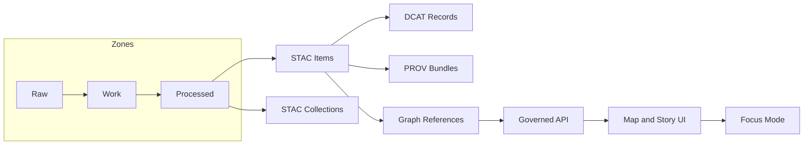

<!-- [KFM_META_BLOCK_V2]
doc_id: kfm://doc/e51c759c-6997-4dd8-9eae-9eb42f8f48b5
title: STAC Items
type: standard
version: v1
status: draft
owners: KFM Maintainers
created: 2026-02-24
updated: 2026-02-24
policy_label: public
related:
  - docs/MASTER_GUIDE_v13.md
  - docs/standards/KFM_STAC_PROFILE.md
  - data/catalog/stac/collections/README.md
  - data/catalog/dcat/README.md
  - data/prov/README.md
tags: [kfm, stac, catalog, items, metadata]
notes:
  - Directory contract for STAC Item JSON records (publish-time boundary artifacts).
  - If your repo canonicalizes STAC under data/stac/items, update paths and keep mirrors in sync.
[/KFM_META_BLOCK_V2] -->

# 🧭 STAC Items
Machine-readable **STAC Item** JSON records for KFM datasets (publish-time catalog boundary artifacts).

**Status:** draft • **Owners:** KFM Maintainers • **Last updated:** 2026-02-24

 <!-- TODO: wire to real workflow badge -->
 <!-- TODO -->
 <!-- TODO -->
 <!-- TODO -->

**Quick nav**
- [Purpose](#purpose)
- [Where this fits](#where-this-fits)
- [What belongs here](#what-belongs-here)
- [Recommended layout](#recommended-layout)
- [Item requirements](#item-requirements)
- [Validation and CI gates](#validation-and-ci-gates)
- [Publishing safety and redaction](#publishing-safety-and-redaction)
- [Definition of Done](#definition-of-done)
- [Troubleshooting](#troubleshooting)
- [Related directories](#related-directories)

---

## Purpose

This directory contains **STAC Item JSON files** that describe *published* geospatial (and “evidence”) assets:
- spatial + temporal metadata
- asset links (files or governed endpoints)
- cross-links to **DCAT** (discovery) and **PROV** (lineage)
- project policy signals (e.g., `kfm:policy_label`) and versioning (e.g., `kfm:dataset_version_id`)

These STAC Items are **catalog boundary artifacts**: downstream graph, APIs, UI, and Focus Mode depend on them.

> NOTE  
> The KFM Master Guide v13 describes canonical STAC output paths as `data/stac/items/` (and collections under `data/stac/collections/`).  
> This directory (`data/catalog/stac/items/`) may be an organizational mirror/alias in your repo. If both exist, keep them consistent and update references during migrations.

---

## Where this fits



**Key invariant:** the UI should not directly fetch from object stores/databases; it should access evidence/assets through the governed API boundary (policy-safe links, default-deny behavior).  

---

## What belongs here

### ✅ Acceptable inputs
- **STAC Item JSON** files (`*.json`) that validate against:
  - STAC core Item schema + any extensions used
  - the **KFM STAC profile** (project rules, if present in this repo)
- Item records that point to **stable** processed assets (e.g., under `data/processed/**`) or to governed API endpoints.
- Item-to-Item / Item-to-Collection linkages that make traversal and discovery possible.

### ❌ Exclusions
Do **not** commit any of the following here:
- raw source data
- intermediate work data
- large processed datasets (parquet/cog/pmtiles/etc.)
- secrets, tokens, signed URLs, or any credentials
- “one-off” local STAC exports that aren’t tied to a dataset version and provenance bundle
- UI-only assets (images, thumbnails) that are not referenced by a validated STAC Item

---

## Recommended layout

> NOTE  
> The exact layout is repo-specific. This is a **recommended** convention that keeps Items browsable and versioned.

```
data/catalog/stac/items/                             # STAC Items (asset-level discovery records; served by API)
├─ README.md                                         # Naming rules, required fields, and link conventions
│
└─ <dataset_slug>/                                   # Dataset family
   └─ <dataset_version_id>/                          # Published version (stable/content-addressed preferred)
      ├─ <item_id>.json                              # STAC Item record (unique item_id; geometry/time/assets)
      └─ …                                           # Additional items (one file per item_id)
```

**Naming recommendations**
- `dataset_slug`: stable, lowercase, underscore-separated (e.g., `noaa_ncei_storm_events`)
- `dataset_version_id`: stable and content-addressed / deterministic where possible (e.g., `2026-02.abcd1234`)
- `item_id`: stable within a dataset version (prefer deterministic IDs over random UUIDs)

---

## Item requirements

### Baseline STAC expectations
Each file in this directory should be a valid **STAC Item** (a GeoJSON Feature with STAC fields).  
Use an automated validator rather than relying on manual review.

Typical fields you’ll see:
- `stac_version`
- `type`, `id`
- `collection`
- `geometry`, `bbox`
- `properties` (including a time field like `datetime`)
- `links`
- `assets`

### KFM profile expectations (project-specific)
KFM’s profile extends STAC with additional, governance-oriented fields and linkages. Examples from the KFM guide include:
- top-level `kfm:policy_label`
- top-level `kfm:dataset_version_id`
- `properties.kfm:evidence_ref`
- asset-level digests like `kfm:digest` (and optionally `checksum:multihash`)

If this repo contains `docs/standards/KFM_STAC_PROFILE.md`, treat that as the source of truth.

---

## Minimal example (redacted)

```json
{
  "stac_version": "1.0.0",
  "type": "Feature",
  "id": "example_item_0001",
  "collection": "example_dataset_2026-02.abcd1234",

  "geometry": { "type": "Point", "coordinates": [0.0, 0.0] },
  "bbox": [0.0, 0.0, 0.0, 0.0],

  "properties": {
    "datetime": "2026-02-20T00:00:00Z",
    "kfm:evidence_ref": "doc://sha256:...#page=1&span=10:200"
  },

  "links": [
    { "rel": "self", "href": "stac://.../items/example_item_0001.json" },
    { "rel": "describedby", "href": "dcat://example_dataset@2026-02.abcd1234", "type": "application/ld+json" },
    { "rel": "via", "href": "prov://kfm://run/2026-02-20T12:34Z.example.abcd", "type": "application/ld+json" }
  ],

  "assets": {
    "data": {
      "href": "data/processed/example_dataset/2026-02.abcd1234/output.parquet",
      "type": "application/x-parquet",
      "roles": ["data"],
      "kfm:digest": "sha256:..."
    }
  },

  "kfm:policy_label": "public",
  "kfm:dataset_version_id": "2026-02.abcd1234"
}
```

---

## Validation and CI gates

### Local validation (examples)
Tooling varies by repo; these are common patterns:

```bash
# Validate a single STAC Item JSON
stac-validator data/catalog/stac/items/<dataset_slug>/<dataset_version_id>/<item_id>.json

# Recursively validate + check links/assets (if using stac-check)
stac-check -r -l -a data/catalog/stac/items/<dataset_slug>/<dataset_version_id>/
```

### Expected CI checks (typical)
- JSON schema validation (STAC core + extensions + KFM profile)
- link integrity checks (self/parent/collection/related)
- policy gates (default-deny): block restricted content leaks
- provenance completeness gates (PROV and dataset version linkage)
- digest/immutability checks (content-addressed artifacts where required)

> TIP  
> Prefer **machine-generated** Items from pipelines. If you must hand-edit, do it only to fix metadata mapping bugs and immediately upstream the fix so the next build re-emits clean Items.

---

## Publishing safety and redaction

KFM is evidence-first and policy-bound. If a dataset is **restricted** or involves sensitive locations:
- generalize geometry / bbox as required by policy
- avoid direct “hot” links to restricted raw/processed assets
- ensure the governed API is the access path (policy labels + obligations applied server-side)
- keep “why redacted” metadata in the appropriate governance channel (policy decision / audit ref)

> WARNING  
> Don’t publish exact coordinates or precise asset links for vulnerable, private, or culturally restricted sites unless governance policy explicitly allows it.

---

## Definition of Done

Before a STAC Item is considered “publish-ready”:

- [ ] Item validates against STAC core + used extensions
- [ ] Item conforms to KFM STAC profile (if present)
- [ ] `collection` exists and resolves to a Collection record
- [ ] Assets resolve to **stable** processed storage (or governed endpoints)
- [ ] Assets carry digests/checksums where required
- [ ] Cross-links exist:
  - [ ] `describedby` → DCAT dataset entry
  - [ ] `via` (or equivalent) → PROV run / lineage bundle
- [ ] Policy label is set (`kfm:policy_label`) and matches governance decision
- [ ] No secrets / signed URLs / credentials are present

---

## Troubleshooting

<details>
<summary><strong>Common failures and fixes</strong></summary>

- **Schema validation fails**
  - Cause: missing required STAC fields, wrong types, invalid extension fields.
  - Fix: update pipeline mapping; re-run `stac-validator`.

- **Broken links**
  - Cause: `self`/`collection`/`describedby` references a missing file or wrong path.
  - Fix: ensure catalogs are emitted together (STAC + DCAT + PROV), update deterministic path rules.

- **Policy gate failure**
  - Cause: restricted asset hrefs or sensitive fields leaked into a public-labeled Item.
  - Fix: apply redaction/generalization upstream; verify policy labels + obligations.

- **Digest mismatch**
  - Cause: asset content changed without bumping dataset version.
  - Fix: treat content changes as a new dataset version and re-emit catalogs.
</details>

---

## Related directories

- `data/catalog/stac/collections/` — STAC Collections (collection-level metadata)
- `data/catalog/dcat/` — DCAT dataset entries (discovery layer)
- `data/prov/` — PROV lineage bundles (how the dataset was produced)
- `data/processed/**` — published assets referenced by Items
- `schemas/stac/` — JSON Schemas used for validation (if present)

---

<a id="top"></a>
**Back to top:** [↑](#-stac-items)
