# 🛰️ STAC Items — KFM Catalog (`data/catalog/stac/items/`)


> [!IMPORTANT]
> In KFM, **catalog + provenance metadata is a hard requirement**: after producing processed outputs, the pipeline must create/update the corresponding catalog and provenance records. STAC Item/Collection JSON lives alongside catalog metadata, and **single datasets are typically STAC Items** (multi-part/multi-date datasets often use **Collections + Items**).:contentReference[oaicite:0]{index=0}:contentReference[oaicite:1]{index=1}

---

## 🎯 What lives here?

This folder contains **STAC Item JSON** documents—one per *asset* (or per *granule* / *slice*)—that describe geospatial outputs (rasters, vectors, derived layers, etc.) with **spatial + temporal metadata**, plus **source attribution** and **license** information.

In KFM, STAC Items are **boundary artifacts**: they are required before downstream stages (graph → API → UI → story nodes) can safely consume a dataset.:contentReference[oaicite:2]{index=2}

---

## 🧭 Where STAC sits in the KFM pipeline

KFM enforces a non-negotiable pipeline ordering—no leapfrogging. The governed metadata catalogs (STAC/DCAT/PROV) sit between ETL and the graph/UI layers.:contentReference[oaicite:3]{index=3}

```mermaid
flowchart LR
  A["🧱 ETL (raw → work → processed)"] --> B["🛰️ STAC Items + Collections"]
  B --> C["🧾 DCAT Dataset Views"]
  B --> D["🧬 PROV Lineage Bundles"]
  B --> E["🕸️ Neo4j Graph (references catalogs)"]
  E --> F["🔌 API Layer (contracts + governance)"]
  F --> G["🗺️ Map UI (React · MapLibre · optional Cesium)"]
  G --> H["📖 Story Nodes"]
  H --> I["🎯 Focus Mode (provenance-linked context bundle)"]
```



This is consistent with the broader “Raw → Processed → Catalog/Prov → Database → API → UI” sequencing described in the technical blueprint.:contentReference[oaicite:4]{index=4}

---

## 🧱 Contract: STAC + DCAT + PROV are **not optional**

Every new dataset or evidence artifact must ship with:

- **🛰️ STAC Collection + Item(s)** (index geospatial assets, even when “non-spatial” data is included for consistency)
- **🧾 DCAT Dataset entry** (catalog discoverability + distribution links)
- **🧬 PROV activity bundle** (full lineage: sources → steps → agents → timestamps → configs)

…and KFM’s CI validates these artifacts against project profiles (STAC/DCAT/PROV), which extend base standards with KFM-specific fields such as provenance references and uncertainty indicators.:contentReference[oaicite:5]{index=5}

---

## 📁 Directory expectations (and a quick path note)

> [!NOTE]
> Some repo layouts place STAC output under `data/stac/items/` + `data/stac/collections/` and keep DCAT under `data/catalog/dcat/` with PROV under `data/prov/`:contentReference[oaicite:6]{index=6}:contentReference[oaicite:7]{index=7}.  
> This folder (`data/catalog/stac/items/`) is the **STAC Items** home for branches that colocate catalog outputs under `data/catalog/…` (per earlier repo structure patterns).:contentReference[oaicite:8]{index=8}

### ✅ Recommended organization inside `items/`

Keep item files predictable and scannable:

- Group by **domain** (or major theme) if item counts grow large:
  - `historical/`
  - `hydrology/`
  - `land-tenure/`
  - `air-quality/`
- Prefer **stable IDs** and filenames that won’t change when assets are reprocessed (versioning belongs in metadata links—see below).

> KFM’s geospatial catalog pattern is explicitly meant to enumerate each layer/source with bounding box, time range, source info, and processing notes—supporting reproducibility and “where did this come from?” traceability.:contentReference[oaicite:9]{index=9}:contentReference[oaicite:10]{index=10}

---

## 🧩 Item vs Collection: when to use which?

Use **STAC Item** when the dataset is effectively a single coherent asset or release.

Use **STAC Collection + Items** when the dataset is **multi-date**, **multi-part**, or naturally broken into many assets that share a common collection-level description.:contentReference[oaicite:11]{index=11}

---

## 🔗 Cross-layer linkage rules (KFM’s “don’t break this” contract)

KFM requires explicit cross-references so catalogs, provenance, graph, and narratives stay in sync:

1. **STAC Items → Data**
   - Items must point to the actual assets in `data/processed/**` (or stable equivalent) and carry source attribution + license info.:contentReference[oaicite:12]{index=12}

2. **DCAT → STAC / Distributions**
   - DCAT records include distribution links to STAC entries and/or direct downloads to support discovery/harvesting workflows.:contentReference[oaicite:13]{index=13}

3. **PROV end-to-end**
   - PROV bundles link raw inputs → intermediate work → processed outputs and identify pipeline run/config (e.g., run ID, commit hash).:contentReference[oaicite:14]{index=14}

4. **Graph references catalogs (no payload duplication)**
   - The Neo4j graph stores references like STAC Item IDs or persistent IDs, not full asset payloads, so the UI can retrieve details from catalogs.:contentReference[oaicite:15]{index=15}

---

## 🧾 Minimum STAC Item “shape” (practical checklist)

> [!TIP]
> Exact required/optional fields are governed by the project profile: `docs/standards/KFM_STAC_PROFILE.md` (and sibling DCAT/PROV profiles). These profiles extend base standards with KFM-specific fields and CI validates against them.:contentReference[oaicite:16]{index=16}

A STAC Item should, at minimum, include:

- `type`: `"Feature"`
- `stac_version`
- `id`
- `geometry` + `bbox`
- `properties` including temporal fields (e.g., `datetime` or a start/end range)
- `links` including `self`, `collection`, and KFM-required cross-links (DCAT + PROV)
- `assets` with at least one “data” asset (and optionally tiles, thumbnails, metadata)

---

## 🧪 Example: KFM STAC Item skeleton (copy/paste starter)

```json
{
  "type": "Feature",
  "stac_version": "1.0.0",
  "id": "kfm__example__dataset__v1",
  "geometry": {
    "type": "Polygon",
    "coordinates": [[[ -102.05, 36.99 ], [ -94.60, 36.99 ], [ -94.60, 40.00 ], [ -102.05, 40.00 ], [ -102.05, 36.99 ]]]
  },
  "bbox": [ -102.05, 36.99, -94.60, 40.00 ],
  "properties": {
    "datetime": "1900-01-01T00:00:00Z",
    "title": "Example Dataset (Kansas, 1900)",
    "description": "Short, evidence-first description of what this asset is.",
    "license": "CC-BY-4.0",
    "kfm:source_attribution": "Example source org; processed by KFM pipeline X",
    "kfm:uncertainty": "low|medium|high (per KFM profile)"
  },
  "links": [
    { "rel": "self", "href": "./kfm__example__dataset__v1.json", "type": "application/geo+json" },
    { "rel": "collection", "href": "../collections/kfm__example__collection.json", "type": "application/json" },

    { "rel": "describedby", "href": "../../dcat/kfm__example__dataset.jsonld", "type": "application/ld+json", "title": "DCAT dataset entry" },
    { "rel": "via", "href": "../../../prov/kfm__example__dataset__v1.prov.json", "type": "application/json", "title": "PROV lineage bundle" }
  ],
  "assets": {
    "data": {
      "href": "../../../processed/example/example_1900.cog.tif",
      "type": "image/tiff; application=geotiff",
      "roles": ["data"],
      "title": "Cloud-Optimized GeoTIFF output"
    },
    "metadata": {
      "href": "../../../processed/example/example_1900.sidecar.json",
      "type": "application/json",
      "roles": ["metadata"],
      "title": "Processing summary / sidecar metadata"
    }
  }
}
```

> [!WARNING]
> Don’t invent ad-hoc custom fields. If you need extra metadata beyond the base profile, coordinate to extend the KFM STAC/DCAT profiles rather than introducing one-off properties.:contentReference[oaicite:17]{index=17}

---

## 🧬 Versioning expectations (dataset-level)

When a dataset is updated or reprocessed:

- Create a **new version** and link it to the previous version in **DCAT + PROV** (e.g., using `prov:wasRevisionOf`).
- Prefer persistent identifiers (e.g., DOI/ARK) for published dataset versions when appropriate.

These rules are explicitly called out as the project’s versioning expectations.:contentReference[oaicite:18]{index=18}

---

## ✅ CI & governance: “fail closed” expectations

PRs are expected to include the processed output *and* the matching metadata/provenance artifacts. CI checks enforce that processed files have corresponding catalog + provenance entries, and reviews verify that license + metadata are thorough.:contentReference[oaicite:19]{index=19}

KFM also follows a **fail-closed** governance stance—missing license information is the kind of thing that should block merge, not slip through.:contentReference[oaicite:20]{index=20}

### 🧾 Pull Request checklist (STAC Items)

- [ ] ✅ Processed asset exists and is stable (or points to stable storage)
- [ ] 🛰️ STAC Item added/updated **here**
- [ ] 🗃️ STAC Collection exists/updated (if applicable)
- [ ] 🧾 DCAT entry created/updated with distribution links to STAC/download:contentReference[oaicite:21]{index=21}:contentReference[oaicite:22]{index=22}
- [ ] 🧬 PROV bundle created/updated capturing full lineage (raw → work → processed):contentReference[oaicite:23]{index=23}
- [ ] 🔗 STAC links point to DCAT + PROV + assets in `data/processed/**`:contentReference[oaicite:24]{index=24}
- [ ] 🧪 CI schema validation passes (profiles + JSON schema):contentReference[oaicite:25]{index=25}

---

## 📚 References (project “source of truth” docs)

- 📘 Master Guide v13 (STAC/DCAT/PROV policy, cross-linking, versioning) — `docs/MASTER_GUIDE_v13.md` :contentReference[oaicite:26]{index=26}  
  - STAC/DCAT/PROV alignment + CI validation:contentReference[oaicite:27]{index=27}
  - Cross-layer linkage expectations:contentReference[oaicite:28]{index=28}
  - Versioning expectations:contentReference[oaicite:29]{index=29}

- 🧱 KFM Technical Blueprint (hard requirements + contribution workflow) — :contentReference[oaicite:30]{index=30}  
  - Catalog/provenance as hard requirement:contentReference[oaicite:31]{index=31}
  - PR/CI expectations for metadata + license discipline:contentReference[oaicite:32]{index=32}

- 🗺️ Mapping Hub Design (STAC-like catalog intent & reproducibility framing) — :contentReference[oaicite:33]{index=33}:contentReference[oaicite:34]{index=34}

---

## 🤝 Contributing a new Item (quick runbook)

1. **🧱 Ingest raw** under the domain staging structure and produce stable processed outputs.:contentReference[oaicite:35]{index=35}
2. **🛰️ Create/update STAC**:  
   - Add a Collection if needed; add Item(s) here.
3. **🧾 Create/update DCAT** with distribution links to STAC and/or download endpoints.:contentReference[oaicite:36]{index=36}:contentReference[oaicite:37]{index=37}
4. **🧬 Generate PROV** capturing lineage and pipeline run/config identifiers.:contentReference[oaicite:38]{index=38}
5. **🧪 Run/verify validation** (CI will also validate against KFM profiles).:contentReference[oaicite:39]{index=39}
6. **🔗 Ensure references** (STAC ↔ DCAT ↔ PROV ↔ Graph IDs) are consistent so the UI and narratives can trace evidence cleanly.:contentReference[oaicite:40]{index=40}

---

### ✅ Definition of Done for this folder

If a user (or the graph/UI) can start from an Item file in this directory and reliably find:

- the **actual asset**,
- its **license + source attribution**,
- the **DCAT discovery record**, and
- the **PROV lineage chain**,

…then this directory is doing its job. 🧠📍🔍

