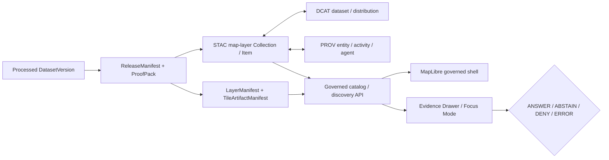

<!-- [KFM_META_BLOCK_V2]
doc_id: kfm://doc/NEEDS_VERIFICATION_UUID
title: KFM Map Layers STAC Surface
type: standard
version: v1
status: draft
owners: @bartytime4life (broad /data/ fallback; narrower owner NEEDS VERIFICATION)
created: NEEDS_VERIFICATION
updated: 2026-05-01
policy_label: NEEDS_VERIFICATION
related: [../README.md, ../../README.md, ../../dcat/README.md, ../../prov/README.md, ../../../README.md, ../../../processed/README.md, ../../../published/README.md, ../../../receipts/README.md, ../../../proofs/README.md, ../../../../docs/standards/KFM_STAC_PROFILE.md, ../../../../contracts/README.md, ../../../../schemas/README.md, ../../../../policy/README.md, ../../../../tools/catalog/README.md, ../../../../tools/validators/README.md, ../../../../tests/README.md, ../../../../.github/workflows/README.md]
tags: [kfm, stac, map-layers, catalog, layer-manifest, maplibre, evidence]
notes: [Target path supplied by documentation task. Current-session local workspace did not expose a mounted Git repository. Child payload inventory, doc UUID, created date, policy label, validator wiring, workflow enforcement, and narrower ownership require active-branch verification.]
[/KFM_META_BLOCK_V2] -->

<a id="top"></a>

# KFM Map Layers STAC Surface

Release-linked STAC metadata lane for KFM map layers, `LayerManifest` handoff, and map-facing catalog discovery.

> [!NOTE]
> **Status:** experimental · **Document state:** draft · **Owners:** `@bartytime4life` *(broad `/data/` fallback; narrower owner NEEDS VERIFICATION)*  
> **Path:** `data/catalog/stac/kfm-map-layers/README.md`  
> **Repo fit:** upstream [`../README.md`](../README.md), [`../../README.md`](../../README.md), [`../../../README.md`](../../../README.md) · sibling catalog lanes [`../../dcat/README.md`](../../dcat/README.md), [`../../prov/README.md`](../../prov/README.md) · downstream release and verification surfaces [`../../../published/README.md`](../../../published/README.md), [`../../../receipts/README.md`](../../../receipts/README.md), [`../../../proofs/README.md`](../../../proofs/README.md), [`../../../../tools/catalog/README.md`](../../../../tools/catalog/README.md), [`../../../../tests/README.md`](../../../../tests/README.md)  
> **Quick jumps:** [Scope](#scope) · [Repo fit](#repo-fit) · [Accepted inputs](#accepted-inputs) · [Exclusions](#exclusions) · [Evidence boundary](#evidence-boundary) · [Directory tree](#directory-tree) · [Quickstart](#quickstart) · [Usage](#usage) · [Diagram](#diagram) · [Reference tables](#reference-tables) · [Task list](#task-list--release-gates) · [FAQ](#faq) · [Appendix](#appendix)


---

## Scope

`data/catalog/stac/kfm-map-layers/` is the STAC child lane for **map-layer-facing spatial and temporal discovery**.

This directory should describe released or release-candidate map-layer assets well enough that a maintainer, catalog helper, governed API, reviewer, or map shell can answer:

1. what layer-facing asset is being described;
2. where and when the layer applies;
3. which release, proof, and source descriptors back it;
4. which `LayerManifest`, tile artifact, style, and evidence routes are relevant; and
5. how to move from STAC discovery to DCAT description, PROV lineage, Evidence Drawer support, and rollback/correction context.

This directory is **metadata and discovery**, not sovereign truth. A STAC Item can point toward a published PMTiles archive, vector tile service, COG-backed raster, GeoJSON excerpt, or other map delivery artifact, but the Item itself does not become the canonical dataset, the policy decision, the renderer contract, or the evidence bundle.

> [!IMPORTANT]
> `data/catalog/stac/kfm-map-layers/` exists to make map layers discoverable and cross-linkable. It must not become a shortcut around `RAW -> WORK / QUARANTINE -> PROCESSED -> CATALOG / TRIPLET -> PUBLISHED`.

<p align="right"><a href="#top">Back to top ↑</a></p>

---

## Repo fit

### Path and adjacency

| Relationship | Path | Role |
|---|---|---|
| Data root | [`../../../README.md`](../../../README.md) | Lifecycle framing for governed data surfaces |
| Catalog root | [`../../README.md`](../../README.md) | Catalog-closure seam for STAC, DCAT, and PROV |
| STAC parent | [`../README.md`](../README.md) | STAC lane boundary, profile posture, and parent rules |
| DCAT sibling | [`../../dcat/README.md`](../../dcat/README.md) | Dataset and distribution description |
| PROV sibling | [`../../prov/README.md`](../../prov/README.md) | Entity, activity, agent, transform, and lineage records |
| Processed source material | [`../../../processed/README.md`](../../../processed/README.md) | Upstream release candidate or processed authority |
| Published materialization | [`../../../published/README.md`](../../../published/README.md) | Release-backed outward materialization surface |
| Receipts | [`../../../receipts/README.md`](../../../receipts/README.md) | Process memory and run evidence |
| Proofs | [`../../../proofs/README.md`](../../../proofs/README.md) | Promotion evidence, attestations, rollback references |
| STAC profile | [`../../../../docs/standards/KFM_STAC_PROFILE.md`](../../../../docs/standards/KFM_STAC_PROFILE.md) | Field-level STAC law and extension/profile decisions |
| Catalog helpers | [`../../../../tools/catalog/README.md`](../../../../tools/catalog/README.md) | Cross-link, QA, and reviewer helper surface |
| Validators | [`../../../../tools/validators/README.md`](../../../../tools/validators/README.md) | Fail-closed validation family |
| Tests | [`../../../../tests/README.md`](../../../../tests/README.md) | Fixtures, closure tests, and negative-path checks |

### Boundary rule

Use this directory when the unit is a **map-facing STAC catalog record**.

Do not use it as the home for:

- the map style itself,
- raw source captures,
- policy bundles,
- application runtime code,
- EvidenceBundle bodies,
- unreviewed layer drafts,
- or the canonical processed artifact.

<p align="right"><a href="#top">Back to top ↑</a></p>

---

## Accepted inputs

The following belong here when they are **release-linked**, **policy-safe**, **profile-compatible**, and **cross-linkable**.

| Accepted input | Belongs here when… | Review cue |
|---|---|---|
| STAC Collection JSON | it groups a coherent family of KFM map-layer records | Collection identity should be stable enough for catalog and API use |
| STAC Item JSON | it describes one released or release-candidate map-layer asset, version, tile bundle, raster product, feature extract, or temporal slice | Item granularity should follow the release unit, not UI convenience alone |
| Asset metadata | it points to released map delivery artifacts with media type, roles, checksums, and link targets | Heavy asset bodies stay outside this directory |
| `LayerManifest` references | they connect STAC discovery to map-layer delivery contracts | The manifest remains the delivery/trust handoff object |
| `TileArtifactManifest` or map artifact references | they connect STAC to PMTiles, MVT, COG-backed, raster, or GeoJSON delivery | Asset roles and checksums should be explicit |
| Release and proof references | they bind discovery to promotion state and rollback target | No release/proof reference means the record remains draft |
| Evidence references | they let the map shell route to Evidence Drawer support | A visible layer needs a resolvable support path or visible abstention |
| DCAT and PROV links | they close outward dataset/distribution description and lineage | STAC should not be a dead end |
| Spatial and temporal coverage | they make discovery meaningful without inventing false precision | Use support/valid-time/as-of-time rules from the profile |
| Public-safety notes | they state sensitivity, generalization, redaction, or withheld-feature posture where relevant | Policy meaning belongs upstream, but disclosure belongs here |

### Minimum practical rule

A record is not ready for this lane unless it can answer:

> **What layer-facing asset is this, where and when does it apply, what released artifact does it point to, which manifest governs its map delivery, and how does a reviewer reach evidence and lineage?**

<p align="right"><a href="#top">Back to top ↑</a></p>

---

## Exclusions

| Exclusion | Why it stays out | Preferred home |
|---|---|---|
| RAW source files | STAC map-layer records are not intake | `data/raw/` |
| WORK or QUARANTINE artifacts | Unreleased candidates must not look publishable | `data/work/` or `data/quarantine/` |
| Authoritative processed payloads | This lane stores metadata, not canonical processed bodies | `data/processed/` |
| Heavy delivery artifacts | PMTiles, COGs, GeoParquet, MBTiles, and large tilesets are assets, not README-adjacent catalog text | `data/published/` or release artifact storage |
| Policy bundles or reason registries | Catalog records obey policy; they do not define policy | `policy/` |
| Shared schemas or profile law | This README is not the hidden schema authority | `schemas/`, `contracts/`, and `docs/standards/` |
| MapLibre style JSON as truth | Paint/layout expressions must not carry business meaning alone | style registry / `StyleManifest` lane NEEDS VERIFICATION |
| Runtime UI state | Viewport, selected feature, hover state, and local toggles are not catalog truth | governed app shell / API payloads |
| EvidenceBundle bodies | Evidence resolution is a trust surface, not a STAC payload dump | evidence schema / governed API / published support path |
| Secrets, credentials, tokens | Catalog records are not a secret store | deployment/runtime secret management |
| Direct client source API shortcuts | Public clients must not bypass governed APIs and release state | governed API / release-backed delivery |

> [!WARNING]
> Do not publish a STAC Item here merely because a layer renders. Rendering proves that bytes can draw. KFM publication requires release, evidence, policy, review, catalog, proof, and rollback closure.

<p align="right"><a href="#top">Back to top ↑</a></p>

---

## Evidence boundary

| Claim or convention | Current label | What maintainers should verify before upgrading |
|---|---:|---|
| Parent STAC lane exists and has a directory README pattern | **CONFIRMED from attached project source** | Active branch path, current content, and any intervening revisions |
| This child path is the requested target | **CONFIRMED request / NEEDS VERIFICATION repo** | Actual branch presence of `data/catalog/stac/kfm-map-layers/` |
| Broad `/data/` owner fallback is `@bartytime4life` | **CONFIRMED from attached project source / NEEDS VERIFICATION branch** | `.github/CODEOWNERS` on the target branch |
| STAC/DCAT/PROV are the catalog triplet | **CONFIRMED doctrine** | Concrete emitted catalog records and cross-link tests |
| `LayerManifest` closure matters for publication | **CONFIRMED doctrine / PROPOSED implementation** | Schema, fixture, validator, and release object evidence |
| Deeper payload shape under this child lane | **PROPOSED** | Checked-in collections/items, tests, and generated artifacts |
| Validator command names | **NEEDS VERIFICATION** | `tools/catalog/`, `tools/validators/`, tests, workflow YAML, and CI logs |
| Policy label for this README | **NEEDS VERIFICATION** | Repo policy registry or documentation owner decision |

<p align="right"><a href="#top">Back to top ↑</a></p>

---

## Directory tree

Starter shape for the child lane:

```text
data/catalog/stac/kfm-map-layers/
├── README.md
├── collections/
│   └── kfm-map-layers.collection.json          # PROPOSED
├── items/
│   ├── hydrology/                              # PROPOSED first proof family
│   │   └── <layer-id>.item.json
│   ├── soils/                                  # PROPOSED successor family
│   │   └── <layer-id>.item.json
│   └── habitat-fauna/                          # PROPOSED sensitivity-heavy family
│       └── <layer-id>.item.json
├── examples/
│   ├── valid.public-safe-map-layer.item.json   # PROPOSED
│   └── denied.sensitive-layer.item.json        # PROPOSED
└── _index.json                                 # OPTIONAL / NEEDS VERIFICATION
```

> [!NOTE]
> The subtree above is a proposed starter shape. Do not create parallel schema or profile authority inside this directory. Field-level STAC decisions should route through [`../../../../docs/standards/KFM_STAC_PROFILE.md`](../../../../docs/standards/KFM_STAC_PROFILE.md) and the repo’s actual schema authority.

<p align="right"><a href="#top">Back to top ↑</a></p>

---

## Quickstart

### 1. Inspect the active branch

Run from the repository root:

```bash
find data/catalog/stac/kfm-map-layers -maxdepth 4 -type f | sort
find data/catalog/stac data/catalog/dcat data/catalog/prov -maxdepth 3 -type f | sort
```

Expected review posture:

- the child directory exists or is created intentionally in the PR;
- every STAC map-layer record has a matching release or release-candidate context;
- each Item links outward to lineage and dataset/distribution context;
- no heavy asset bodies are committed here by accident.

### 2. Check catalog cross-links

Adapt to repo-native tooling after verification:

```bash
python tools/catalog/catalog_crosslink.py \
  --stac data/catalog/stac/kfm-map-layers \
  --dcat data/catalog/dcat \
  --prov data/catalog/prov
```

### 3. Check profile and release closure

Adapt to the actual validator names on the target branch:

```bash
python tools/validators/validate_stac_profile.py \
  data/catalog/stac/kfm-map-layers

python tools/validators/promotion_gate/check_release_closure.py \
  --stac data/catalog/stac/kfm-map-layers
```

> [!IMPORTANT]
> Commands in this section are **PROPOSED / NEEDS VERIFICATION** until the active branch proves the helper names, arguments, schemas, and workflow wiring.

<p align="right"><a href="#top">Back to top ↑</a></p>

---

## Usage

### Create or update a map-layer STAC Item

1. Start from a release-backed or release-candidate map layer.
2. Confirm the upstream processed artifact and source descriptor references.
3. Confirm the `LayerManifest`, style/tile artifact references, and release manifest reference.
4. Create or update a STAC Item under the correct domain subfolder.
5. Add links to sibling DCAT and PROV records.
6. Add asset roles, media types, checksums, and public-safety notes.
7. Run catalog/profile validators.
8. Keep denied, generalized, stale, or restricted cases visible as reviewable negative fixtures rather than silently omitting them.

### Keep STAC and layer delivery separate

| Concern | STAC map-layer record | `LayerManifest` / runtime handoff |
|---|---|---|
| Discovery | Owns searchable spatial/temporal asset description | Consumed after discovery |
| Delivery contract | Points to the delivery contract | Owns source/layer IDs, tile endpoints, release linkage, and trust chips |
| Evidence route | Carries evidence and lineage refs | Routes clicked/selected features to governed evidence resolution |
| Style | May link or identify applicable style manifests | Owns style/runtime compatibility details |
| Policy | Discloses policy posture and release state | Enforces policy through governed API and manifests |
| Runtime state | Does not own runtime state | Supports map shell interaction and Drawer/Focus handoff |

### Illustrative Item shape

<details>
<summary><strong>Open illustrative STAC Item sketch</strong></summary>

This is an example shape for discussion and review. The exact profile fields, extension list, and validation requirements belong to the KFM STAC profile and schema authority.

```json
{
  "type": "Feature",
  "stac_version": "NEEDS_VERIFICATION",
  "id": "kfm-map-layer.example-huc12-public-safe.v0",
  "collection": "kfm-map-layers",
  "bbox": [-102.1, 36.9, -94.5, 40.1],
  "geometry": {
    "type": "Polygon",
    "coordinates": [
      [
        [-102.1, 36.9],
        [-94.5, 36.9],
        [-94.5, 40.1],
        [-102.1, 40.1],
        [-102.1, 36.9]
      ]
    ]
  },
  "properties": {
    "title": "Example public-safe HUC12 map layer",
    "datetime": null,
    "start_datetime": "TODO",
    "end_datetime": "TODO",
    "kfm:truth_label": "PROPOSED",
    "kfm:knowledge_character": "derived map layer",
    "kfm:release_id": "TODO",
    "kfm:release_manifest_ref": "TODO",
    "kfm:layer_manifest_ref": "TODO",
    "kfm:evidence_bundle_ref": "TODO",
    "kfm:source_descriptor_refs": ["TODO"],
    "kfm:policy_label": "TODO",
    "kfm:review_state": "TODO",
    "kfm:freshness_state": "TODO",
    "kfm:correction_state": "TODO",
    "kfm:public_geometry_posture": "public_safe"
  },
  "links": [
    {
      "rel": "collection",
      "href": "../collections/kfm-map-layers.collection.json",
      "type": "application/json"
    },
    {
      "rel": "describedby",
      "href": "../../../../docs/standards/KFM_STAC_PROFILE.md",
      "type": "text/markdown",
      "title": "KFM STAC profile"
    },
    {
      "rel": "derived_from",
      "href": "../../../processed/TODO/README.md",
      "type": "text/markdown"
    },
    {
      "rel": "via",
      "href": "../../prov/TODO.prov.json",
      "type": "application/ld+json",
      "title": "PROV lineage"
    },
    {
      "rel": "alternate",
      "href": "../../dcat/TODO.dataset.json",
      "type": "application/ld+json",
      "title": "DCAT dataset/distribution description"
    }
  ],
  "assets": {
    "tiles": {
      "href": "../../../published/TODO/layer.pmtiles",
      "type": "application/vnd.pmtiles",
      "roles": ["tiles", "map", "visualization"],
      "title": "Released public-safe tile artifact",
      "kfm:sha256": "TODO",
      "kfm:tile_artifact_manifest_ref": "TODO"
    }
  }
}
```

</details>

<p align="right"><a href="#top">Back to top ↑</a></p>

---

## Diagram



The diagram is intentionally downstream-first: the map shell and Focus Mode consume release-linked, evidence-resolving metadata. They do not manufacture catalog closure in the browser.

<p align="right"><a href="#top">Back to top ↑</a></p>

---

## Reference tables

### Record readiness matrix

| Readiness check | Required evidence | Failure posture |
|---|---|---|
| Identity | stable `id`, collection, release or candidate reference | `NEEDS VERIFICATION` |
| Spatial support | `bbox`, geometry, CRS/profile details where required | `ABSTAIN` or block release |
| Temporal support | valid time, observation time, source publication/as-of time where applicable | stale or ambiguous badge |
| Asset handoff | asset roles, media type, checksum, delivery reference | block promotion |
| Layer handoff | `LayerManifest` or equivalent delivery contract reference | block map-layer publication |
| Evidence route | `EvidenceBundle` / `EvidenceRef` route or visible abstention reason | no consequential popup/Focus claim |
| Catalog closure | STAC ↔ DCAT ↔ PROV links resolve | block catalog closure |
| Policy state | rights, sensitivity, generalization, role posture | `DENY` or generalized public geometry |
| Review state | reviewer/status/release notes where required | draft-only |
| Rollback state | prior release, correction target, withdrawal path | block publication |

### Trust-visible states

| State | Meaning for this lane | Must surface where |
|---|---|---|
| `MISSING_EVIDENCE` | layer lacks resolvable support | STAC notes, Drawer, Focus outcome |
| `SOURCE_STALE` | source or release freshness is expired or unresolved | STAC properties, layer chips |
| `DENIED_BY_POLICY` | rights/sensitivity/publication state blocks release or display | review report, Drawer/Focus |
| `GENERALIZED_GEOMETRY` | public geometry was degraded or transformed | STAC properties, layer legend, Drawer |
| `RESTRICTED_ACCESS` | steward-only or role-gated context exists | governed API and review lane |
| `CONFLICTED_SUPPORT` | evidence conflicts or identity join is unresolved | catalog notes and abstention path |
| `CITATION_FAILED` | evidence route cannot validate citation/support | Focus and release gate |
| `RELEASE_WITHDRAWN` | item points to withdrawn or superseded release | catalog, map shell, correction notice |
| `RUNTIME_ERROR` | runtime cannot safely resolve | visible error, no raw fallback |

<p align="right"><a href="#top">Back to top ↑</a></p>

---

## Task list / release gates

Use this checklist before treating this directory as release-ready.

- [ ] Verify `data/catalog/stac/kfm-map-layers/` exists on the active branch.
- [ ] Confirm narrower owner or intentionally retain broad `/data/` fallback.
- [ ] Mint `doc_id` and verify `created`, `updated`, and `policy_label`.
- [ ] Confirm KFM STAC profile path and schema authority.
- [ ] Add one valid public-safe STAC Item fixture.
- [ ] Add one denied or generalized sensitive-layer fixture.
- [ ] Add or reference one `LayerManifest` fixture.
- [ ] Add or reference one `TileArtifactManifest` or released map artifact fixture.
- [ ] Cross-link one Item to DCAT and PROV.
- [ ] Link Item to `ReleaseManifest`, proof/receipt refs, and rollback target.
- [ ] Validate asset roles, media types, hashes, and public-safety posture.
- [ ] Prove no raw, work, quarantine, or canonical stores are exposed as public map-layer assets.
- [ ] Prove the MapLibre shell receives governed manifests or API payloads, not ad hoc browser truth.
- [ ] Prove Focus Mode returns finite outcomes and abstains/denies on missing evidence, stale source, or policy restrictions.
- [ ] Record release, rollback, and correction expectations in the PR.

<p align="right"><a href="#top">Back to top ↑</a></p>

---

## FAQ

### Is this the main STAC directory?

No. This is a child lane under the parent STAC surface. Use [`../README.md`](../README.md) for parent STAC rules and this README for map-layer-facing records.

### Can MapLibre read these STAC records directly?

MapLibre may benefit from STAC discovery, but KFM’s normal path should remain governed: STAC discovery and `LayerManifest` handoff flow through release-aware services and typed payloads. The browser should not assemble trust-bearing claims by stitching catalog records, source roles, policy, and evidence on its own.

### Are PMTiles, MVT, COGs, or GeoParquet files stored here?

No. This directory can describe those assets and link to them, but heavy delivery artifacts belong in release-backed artifact storage or `data/published/` patterns.

### What upgrades this README from draft?

Direct active-branch evidence: checked-in child records, schema/profile validation, catalog cross-link tests, proof/release references, workflow evidence, and one negative-path fixture that fails closed.

### What happens when a layer is withdrawn or superseded?

Do not delete history silently. Update or add correction/supersession metadata, ensure release and catalog records point to the correct state, and preserve rollback/correction lineage in the appropriate proof and catalog surfaces.

<p align="right"><a href="#top">Back to top ↑</a></p>

---

## Appendix

<details>
<summary><strong>Glossary</strong></summary>

| Term | Meaning in this directory |
|---|---|
| STAC map-layer record | A STAC-shaped catalog record describing a map-facing release asset or release candidate |
| `LayerManifest` | Delivery/trust handoff object for map-layer identity, source/layer IDs, release linkage, policy posture, and Evidence Drawer routing |
| Catalog closure | STAC, DCAT, PROV, release, proof, and rollback references agree or explain divergence |
| Evidence route | A path from a visible layer or feature to `EvidenceRef -> EvidenceBundle` support |
| Public-safe geometry | Geometry that has passed policy and sensitivity handling for public or semi-public surfaces |
| Negative fixture | A deliberate denied, stale, missing-evidence, restricted, or generalized case used to prove fail-closed behavior |
| Derived delivery artifact | Tiles, COG-backed outputs, GeoParquet, scenes, caches, or summaries that remain rebuildable and downstream of stronger truth |

</details>

<details>
<summary><strong>Reviewer prompts</strong></summary>

Ask these before approving a map-layer STAC change:

1. Does the Item describe a release-linked asset rather than a raw or draft artifact?
2. Does every asset have a media type, role, and integrity reference?
3. Does the record connect to DCAT and PROV without dead ends?
4. Does the record identify the `LayerManifest` or explain why it is not yet available?
5. Does the layer have visible policy, freshness, review, and correction posture?
6. Does a clicked feature route to Evidence Drawer support or a visible negative state?
7. Is public geometry safe for the declared audience?
8. Can this layer be rolled back, withdrawn, or superseded without erasing history?

</details>

<details>
<summary><strong>Do not merge when…</strong></summary>

- The Item points to RAW, WORK, or QUARANTINE artifacts.
- The layer renders but lacks release/proof/evidence linkage.
- Policy meaning lives only in a style expression.
- Sensitive geometry is made public by convenience.
- STAC, DCAT, and PROV links disagree without an explanation.
- The validator path is unknown and no manual review record is attached.
- A Focus answer could make a consequential claim without citations or EvidenceBundle support.

</details>

<p align="right"><a href="#top">Back to top ↑</a></p>
