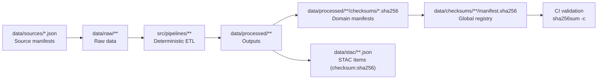

<div align="center">

# 🔐 Kansas Frontier Matrix — Global Data Checksums  
`data/checksums/`

**Mission:** Ensure **project-wide data integrity, reproducibility, and provenance**  
for all datasets within the Kansas Frontier Matrix (KFM) through comprehensive **SHA-256** checksum tracking,  
validation, and CI/CD enforcement.

[](../../.github/workflows/site.yml)
[](../../.github/workflows/stac-validate.yml)
[](../../.github/workflows/codeql.yml)
[](../../.github/workflows/trivy.yml)
[](../../docs/)
[](../../LICENSE)

</div>

---

## 📚 Overview

The `data/checksums/` directory is the **central verification registry** for **all SHA-256 checksum manifests** used across KFM.  
These manifests back every dataset (raw, processed, tabular, spatial, text) with a cryptographic fingerprint.

**Guarantees provided:**
- **Integrity** — detect bit-level corruption, partial uploads, and unintended edits.  
- **Reproducibility** — confirm ETL outputs are deterministic across machines and time.  
- **Provenance** — bind published assets to immutable hash references.  
- **Auditability** — surface divergences via CI/CD before data reaches users.

All domain manifests in `data/processed/**/checksums/` are **consolidated** here for global validation and release gates.

---

## 🗂️ Directory Layout

```bash
data/checksums/
├── README.md
├── terrain/manifest.sha256
├── hydrology/manifest.sha256
├── landcover/manifest.sha256
├── climate/manifest.sha256
├── hazards/manifest.sha256
├── tabular/manifest.sha256
└── text/manifest.sha256
````

> **Note:** Each `manifest.sha256` aggregates verified hashes from its respective domain.
> Manifests are **regenerated by pipelines** and **verified in CI/CD** on every change.

---

## 🧾 Manifest Semantics

| Manifest File               | Scope (examples)                                                      |
| :-------------------------- | :-------------------------------------------------------------------- |
| `terrain/manifest.sha256`   | DEMs, hillshades, slope/aspect rasters.                               |
| `hydrology/manifest.sha256` | Rivers, watersheds, groundwater, flood zones, hydro derivatives.      |
| `landcover/manifest.sha256` | NLCD, vegetation, crop layers, change maps.                           |
| `climate/manifest.sha256`   | Temperature, precipitation, drought rasters / time-slices.            |
| `hazards/manifest.sha256`   | Tornado, flood, wildfire, drought event layers.                       |
| `tabular/manifest.sha256`   | CSV/Parquet for census, agriculture, economics, compiled indicators.  |
| `text/manifest.sha256`      | OCR/NLP outputs for newspapers, oral histories, treaties (JSONL/TXT). |

### Example entry

```bash
# File: terrain/manifest.sha256
f3c0b929a38ef47c7b41138dd726abf84a65a03b8b24e8e12db2fa89a5740c42  data/processed/terrain/ks_1m_dem_2018_2020.tif
b84b732cc9a2c62f1430b43e813cf7768e2f3452a5de003bfcbf7a72962290a4  data/processed/terrain/ks_hillshade_2018_2020.tif
fe91df2adf373b9cfcd23a9a6cc3a219ae56c92e728c4fcb8333abfa08c48a02  data/processed/terrain/slope_aspect_2018_2020.tif
```

**Path policy:** Manifest paths are **relative to repo root**, POSIX-style (`/`), and **lower-case** file extensions.

---

## ⚙️ Generation & Verification

### Make targets

```bash
# Compute/refresh all manifests under data/checksums/
make checksums

# Validate all manifests (fails CI on mismatch)
make checksums-verify
```

### Direct Python invocation

```bash
python src/utils/generate_global_checksums.py data/ --algo sha256
```

### CI verification

```bash
sha256sum -c data/checksums/**/*.sha256
```

**Behavior**

* CI **fails hard** on any mismatch or missing file.
* Logs are uploaded to `data/work/logs/` for audit and triage.
* Deployments are **blocked** until integrity is restored.

---

## 🔗 Relation to STAC & Metadata

KFM embeds checksums in metadata so integrity travels with the asset:

| Component                            | Integration detail                                                              |
| :----------------------------------- | :------------------------------------------------------------------------------ |
| STAC Items (`data/stac/**.json`)     | Each asset includes `"checksum:sha256"` (STAC Checksum extension).              |
| Processed metadata (`metadata/`)     | Sidecar JSON mirrors the same checksum for non-STAC assets (e.g., tables/text). |
| Global manifests (`data/checksums/`) | Serve as the **authoritative** source of truth validated by CI/CD.              |

> **Tip:** Keep the checksum value identical across STAC `assets[*]."checksum:sha256"` and the domain `manifest.sha256`.

---

## 🧩 End-to-End Flow



---

## 🧰 Developer Guide

### When to regenerate hashes

* After **any** change to files in `data/processed/**`.
* When **upgrading** ETL dependencies that affect binary outputs (GDAL, rasterio, etc.).
* After **reprojection**, **tiling**, or **compression** parameter changes (COG, ZSTD, overviews).

### Naming conventions

* **Manifests:** `data/checksums/<domain>/manifest.sha256`
* **Per-file sidecars (optional):** `<asset>.sha256` colocated with the asset (useful for external distribution).
* **Case:** lower-snake-case for files and folders; extensions lower-case.

### Cross-platform notes

* Use POSIX line endings (`\n`) and UTF-8 encoding.
* Avoid Windows `\r\n` in `.sha256` files — CI will treat them as mismatches.
* Use `git config core.autocrlf input` on Windows workstations.

---

## 🧪 Troubleshooting & Triage

| Symptom                  | Likely cause                                          | Fix                                                                                             |
| :----------------------- | :---------------------------------------------------- | :---------------------------------------------------------------------------------------------- |
| `sha256sum -c` mismatch  | File modified, truncated, or re-encoded               | Rebuild asset via ETL, regenerate manifests, commit together.                                   |
| File missing in manifest | New output not captured                               | Re-run `make checksums` to refresh manifests.                                                   |
| STAC checksum ≠ manifest | Drift between metadata and registry                   | Update STAC `checksum:sha256` from manifest canonical value.                                    |
| CI fails on random asset | Non-deterministic ETL (timestamps, compression seeds) | Pin versions, set `SOURCE_DATE_EPOCH`, remove embedded timestamps, normalize compression flags. |

---

## 🔒 Optional: Signed Manifests (Advanced)

For release snapshots, you may GPG-sign manifests to provide **authenticity** in addition to integrity:

```bash
gpg --detach-sign --armor data/checksums/terrain/manifest.sha256
gpg --verify data/checksums/terrain/manifest.sha256.asc data/checksums/terrain/manifest.sha256
```

Publish `.asc` files alongside the manifests for external consumers.

---

## ♻️ Retention & Lifecycle

* **Raw external data** is typically fetched on-demand (see `data/sources/`) and **not** committed.
* **Processed datasets** are governed by manifests and must ship with valid hashes.
* **Deprecations**: Move old manifests to `data/checksums/_archive/<YYYY-MM>/` with a short `NOTE.md` explaining the change, and keep STAC pointing to the last valid hash until layers are retired.

---

## 🧠 MCP Compliance Summary

| MCP Principle           | Implementation                                                            |
| :---------------------- | :------------------------------------------------------------------------ |
| **Documentation-first** | This README specifies policy, layout, commands, and metadata integration. |
| **Reproducibility**     | Deterministic hashing; CI verification on every commit/PR.                |
| **Open Standards**      | SHA-256 (FIPS 180-4), STAC Checksum extension, POSIX paths, UTF-8.        |
| **Provenance**          | Manifests + STAC `"checksum:sha256"` bind assets to immutable references. |
| **Auditability**        | CI logs + failure gates; optional GPG signatures for release artifacts.   |

---

## 🔗 Related Docs

| Path                                     | Purpose                                 |
| :--------------------------------------- | :-------------------------------------- |
| `data/README.md`                         | Data directory overview and workflows.  |
| `data/stac/README.md`                    | STAC catalog guidance and examples.     |
| `data/sources/README.md`                 | Source manifest authoring and policy.   |
| `src/utils/generate_global_checksums.py` | Manifest generator CLI.                 |
| `data/ARCHITECTURE.md`                   | End-to-end data architecture blueprint. |

---

## 📅 Version History

| Version | Date       | Summary                                                                                         |
| :------ | :--------- | :---------------------------------------------------------------------------------------------- |
| v1.0.0  | 2025-10-04 | Initial creation of global checksum manifests for all dataset domains.                          |
| v1.1.0  | 2025-10-10 | Upgraded CI enforcement, STAC checksum policy, signing & triage guidance, cross-platform notes. |

---

<div align="center">

**Kansas Frontier Matrix** — *“Integrity Across Time and Terrain.”*
📍 [`data/checksums/`](.) · Global registry for dataset integrity and provenance validation.

</div>
```
