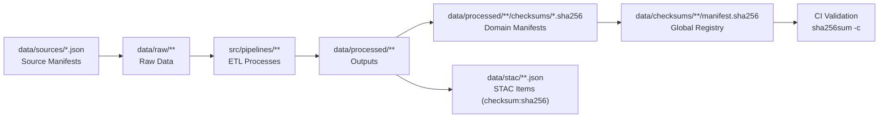

<div align="center">

# 🔐 Kansas Frontier Matrix — Global Data Checksums  
`data/checksums/`

**Mission:** Guarantee **project-wide data integrity, reproducibility, and provenance**  
for every dataset within the Kansas Frontier Matrix (KFM) via comprehensive **SHA-256 checksum** tracking,  
validation, and CI/CD enforcement.

[](../../.github/workflows/site.yml)  
[](../../.github/workflows/stac-validate.yml)  
[](../../.github/workflows/codeql.yml)  
[](../../.github/workflows/trivy.yml)  
[](../../docs/)  
[](../../LICENSE)

</div>

---

## 📚 Overview

The `data/checksums/` directory functions as the **central verification registry** for all  
**SHA-256 checksum manifests** used across the KFM repository.  
Each manifest provides a **cryptographic fingerprint** for its domain (terrain, hydrology, landcover, etc.),  
enabling consistent, reproducible validation across machines and environments.

**Core guarantees:**

- 🔒 **Integrity** — detect corruption, truncation, or silent edits.  
- 🔁 **Reproducibility** — ensure deterministic ETL outputs.  
- 🧩 **Provenance** — link published assets to immutable hash references.  
- 🧮 **Auditability** — CI/CD halts merges if mismatches are detected.  

All sub-domain manifests under `data/processed/**/checksums/` are consolidated here  
for **global integrity validation** and release gating.

---

## 🗂️ Directory Layout

```bash
data/checksums/
├── README.md
├── terrain/manifest.sha256
├── hydrology/manifest.sha256
├── landcover/manifest.sha256
├── climate/manifest.sha256
├── hazards/manifest.sha256
├── tabular/manifest.sha256
└── text/manifest.sha256
````

> Each `manifest.sha256` aggregates verified hashes from its domain.
> Pipelines **regenerate** and CI **verifies** these automatically on every change.

---

## 🧾 Manifest Semantics

| Manifest                    | Scope / Examples                                       |
| :-------------------------- | :----------------------------------------------------- |
| `terrain/manifest.sha256`   | DEMs, hillshades, slope/aspect rasters                 |
| `hydrology/manifest.sha256` | Rivers, watersheds, flood zones, hydro layers          |
| `landcover/manifest.sha256` | NLCD, vegetation, crop, and change maps                |
| `climate/manifest.sha256`   | Temperature, precipitation, drought indices            |
| `hazards/manifest.sha256`   | Tornado, flood, wildfire, disaster datasets            |
| `tabular/manifest.sha256`   | CSV/Parquet — census, agriculture, indicators          |
| `text/manifest.sha256`      | OCR/NLP outputs — newspapers, treaties, oral histories |

### Example

```bash
# File: terrain/manifest.sha256
f3c0b929a38ef47c7b41138dd726abf84a65a03b8b24e8e12db2fa89a5740c42  data/processed/terrain/ks_1m_dem_2018_2020.tif
b84b732cc9a2c62f1430b43e813cf7768e2f3452a5de003bfcbf7a72962290a4  data/processed/terrain/ks_hillshade_2018_2020.tif
fe91df2adf373b9cfcd23a9a6cc3a219ae56c92e728c4fcb8333abfa08c48a02  data/processed/terrain/slope_aspect_2018_2020.tif
```

**Path policy:**

* Paths are **repo-relative**, POSIX (`/`) formatted.
* All filenames are lower-case with consistent extensions.

---

## ⚙️ Generation & Verification

### 🔧 Make Targets

```bash
# Compute / refresh all manifests
make checksums

# Validate all manifests (CI enforcement)
make checksums-verify
```

### 🐍 Python CLI

```bash
python src/utils/generate_global_checksums.py data/ --algo sha256
```

### 🧪 CI Validation

```bash
sha256sum -c data/checksums/**/*.sha256
```

**Behavior:**

* CI **fails hard** on mismatch or missing file.
* Validation logs stored in `data/work/logs/` for audit trail.
* Deployments **blocked** until full data integrity is restored.

---

## 🔗 Integration with STAC & Metadata

| Component                                | Integration                                                   |
| :--------------------------------------- | :------------------------------------------------------------ |
| **STAC Items** (`data/stac/**.json`)     | Includes `"checksum:sha256"` (STAC extension) for each asset. |
| **Derivative Metadata** (`metadata/`)    | Mirrors checksum values for non-STAC assets.                  |
| **Global Manifests** (`data/checksums/`) | Serve as the authoritative validation source for all domains. |

> 🔍 Ensure checksum values match across the STAC Item and corresponding domain manifest.

---

## 🧩 End-to-End Provenance Flow



<!-- END OF MERMAID -->

---

## 🧰 Developer Guidelines

### When to Regenerate Hashes

* After **any** modification in `data/processed/**`.
* When upgrading ETL tools (GDAL, rasterio, pandas, etc.).
* After reprojection, tiling, or compression parameter changes.

### Naming Conventions

* Manifests → `data/checksums/<domain>/manifest.sha256`
* Optional sidecars → `<asset>.sha256` (for distribution)
* Case → lower-snake-case, lower-case extensions.

### Cross-Platform Hygiene

* Always use LF (`\n`) and UTF-8.
* Avoid CRLF (`\r\n`) on Windows; use
  `git config core.autocrlf input`.

---

## 🧪 Troubleshooting & Triage

| Symptom                    | Likely Cause               | Fix                                                               |
| :------------------------- | :------------------------- | :---------------------------------------------------------------- |
| ❌ `sha256sum -c` mismatch  | File modified or truncated | Rebuild asset → regenerate manifests → commit.                    |
| ⚠ File missing in manifest | New output not captured    | Run `make checksums`.                                             |
| 🔄 STAC checksum drift     | STAC not synced            | Update STAC with manifest checksum.                               |
| 🧯 Random CI failure       | Non-deterministic ETL      | Pin dependencies, set `SOURCE_DATE_EPOCH`, normalize compression. |

---

## 🔒 Optional: Signed Manifests

Enhance authenticity by signing manifests with GPG:

```bash
gpg --detach-sign --armor data/checksums/terrain/manifest.sha256
gpg --verify data/checksums/terrain/manifest.sha256.asc data/checksums/terrain/manifest.sha256
```

Include `.asc` alongside manifests for external releases.

---

## ♻️ Retention & Lifecycle

* Raw external data → fetched on demand, not committed.
* Processed datasets → always accompany valid hashes.
* Deprecations → archive manifests to `data/checksums/_archive/<YYYY-MM>/` with a short `NOTE.md`.
* STAC continues to reference last valid checksum until dataset retirement.

---

## 🧠 MCP Compliance Matrix

| MCP Principle           | Implementation                                                     |
| :---------------------- | :----------------------------------------------------------------- |
| **Documentation-first** | README defines policy, structure, commands, and CI rules.          |
| **Reproducibility**     | Deterministic hashing + enforced validation.                       |
| **Open Standards**      | SHA-256 (FIPS 180-4), STAC checksum extension, POSIX paths, UTF-8. |
| **Provenance**          | Manifests + STAC checksums bind assets immutably.                  |
| **Auditability**        | CI failure gates + signed manifests.                               |

---

## 🔗 Related Documentation

| Path                                     | Purpose                                 |
| :--------------------------------------- | :-------------------------------------- |
| `data/README.md`                         | Data directory overview.                |
| `data/stac/README.md`                    | STAC catalog schema & validation.       |
| `data/sources/README.md`                 | Source manifest authoring guidelines.   |
| `src/utils/generate_global_checksums.py` | Global manifest generator CLI.          |
| `data/ARCHITECTURE.md`                   | End-to-end data architecture reference. |

---

## 🗓️ Version History

| Version  | Date       | Summary                                                                                                                |
| :------- | :--------- | :--------------------------------------------------------------------------------------------------------------------- |
| **v1.2** | 2025-10-11 | Refactored to KFM Markdown Protocol v1.1; added front-matter, updated diagram, clarified MCP matrix, signing guidance. |
| **v1.1** | 2025-10-10 | Added STAC integration, CI policy, troubleshooting section.                                                            |
| **v1.0** | 2025-10-04 | Initial creation of global checksum manifests for all dataset domains.                                                 |

---

<div align="center">

**Kansas Frontier Matrix** — *Integrity Across Time & Terrain*
📍 [`data/checksums/`](.) · Global registry for dataset integrity and provenance validation.

</div>
