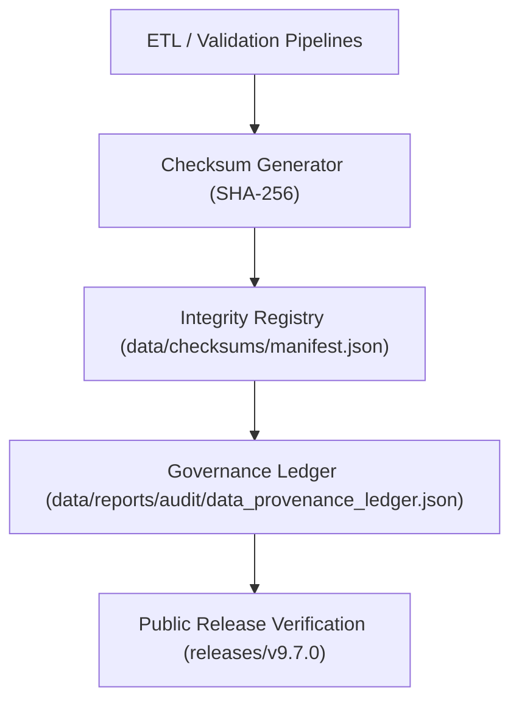

<div align="center">

# 🔐 Kansas Frontier Matrix — **Data Checksums & Integrity Registry**
`data/checksums/README.md`

**Purpose:**  
Documents the **checksum verification system**, integrity tracking, and provenance linkage for all datasets across the **Kansas Frontier Matrix (KFM)**.  
Ensures that every data artifact, from ingestion to publication, is cryptographically validated and immutably registered in the **Governance Ledger**.

[](../../docs/README.md)
[](../../LICENSE)
[](../../docs/standards/faircare-validation.md)
[]()

</div>

---

## 📘 Overview

The **Checksum Integrity Registry** maintains SHA-256 verification files for all datasets, catalogs, and release artifacts within KFM.  
Each checksum file acts as a **verifiable fingerprint** that connects the dataset’s digital identity to governance, provenance, and FAIR+CARE compliance records.

Checksums are used to:
- Authenticate dataset and release integrity.  
- Detect data drift or unauthorized modification.  
- Feed into **Governance Ledger** and **STAC/DCAT** catalogs.  
- Enable public users to verify artifacts via command-line or API.  

---

## 🧭 System Architecture



### Description
1. **Generation:** Checksums are computed automatically after each pipeline run.  
2. **Registration:** Results written to `manifest.json` and cross-linked to release manifests.  
3. **Verification:** The Governance Ledger audits entries against SBOM hashes.  
4. **Publication:** Each release includes a verified checksum record for reproducibility.  

---

## 🗂️ Directory Layout

```plaintext
data/checksums/
├── README.md                    # This file — checksum registry documentation
├── manifest.json                # Master SHA-256 manifest (all datasets)
├── processed_datasets.json      # Checksums for FAIR+CARE-certified data
├── staging_datasets.json        # Checksums for schema-aligned staging data
├── work_datasets.json           # Checksums for ETL / temporary workspace
└── release_hashes.json          # Checksums tied to published SBOM and manifest.zip
```

---

## ⚙️ Manifest Structure

Each manifest lists **dataset identifiers**, **checksums**, and **metadata references**.

```json
{
  "version": "v9.7.0",
  "generated_on": "2025-11-06T19:25:00Z",
  "hash_algorithm": "SHA-256",
  "datasets": [
    {
      "id": "hazards_processed_v9.7.0",
      "path": "data/processed/hazards/hazards_composite.geojson",
      "checksum": "sha256-2f1e3b8c97df84b5d2c3e39bbd95b9e8d12b64ad38a62400f745d68ec6d1b75e",
      "fairstatus": "certified",
      "governance_ref": "data/reports/audit/data_provenance_ledger.json"
    },
    {
      "id": "climate_staging_v9.7.0",
      "path": "data/work/staging/climate/climate_aggregate.parquet",
      "checksum": "sha256-a8373fa4d12d49be5f5f2178a91d79981b1d28b947f05eaa52e9e7e8d2cfadcd",
      "fairstatus": "pending"
    }
  ]
}
```

---

## 🧩 FAIR+CARE Integrity Governance

| Principle | Implementation | Verified By |
|---|---|---|
| **Findable** | Checksums indexed in catalogs and SBOM manifests. | `@kfm-data` |
| **Accessible** | JSON files published under CC-BY 4.0 for public verification. | `@kfm-accessibility` |
| **Interoperable** | JSON-LD-ready structure compatible with STAC/DCAT and SPDX. | `@kfm-architecture` |
| **Reusable** | Immutable, versioned checksum logs. | `@kfm-governance` |
| **Collective Benefit** | Guarantees public trust in data integrity. | `@faircare-council` |
| **Authority to Control** | FAIR+CARE Council certifies checksum workflows. | `@kfm-governance` |
| **Responsibility** | Checksums monitored by telemetry and validation workflows. | `@kfm-security` |
| **Ethics** | Integrity validation prevents tampering and ensures equity of access. | `@kfm-ethics` |

---

## 🧮 Validation Workflows

| Workflow | Description | Output |
|---|---|---|
| `checksum-verify.yml` | Generates and verifies SHA-256 hashes for datasets. | `manifest.json` |
| `faircare-validate.yml` | Ensures checksum alignment with FAIR+CARE ethics. | `data/reports/fair/faircare_summary.json` |
| `governance-ledger.yml` | Syncs checksum hashes with provenance ledger. | `data/reports/audit/data_provenance_ledger.json` |
| `sbom-validate.yml` | Confirms checksums match SPDX SBOM entries. | `releases/v9.7.0/sbom.spdx.json` |

All workflows are automated through `.github/workflows/`.

---

## 📊 Example CLI Verification

```bash
# Verify checksum locally
sha256sum -c data/checksums/manifest.json --ignore-missing

# Compare release checksum against Governance Ledger
jq '.datasets[] | select(.id=="hazards_processed_v9.7.0")' data/checksums/manifest.json
```

---

## 🌱 Sustainability & Provenance Metrics

| Metric | Target | Verified By |
|---|---|---|
| Checksum Coverage | 100% of all released datasets | `@kfm-validation` |
| Governance Ledger Sync | 100% hash alignment | `@kfm-governance` |
| SBOM Alignment | ≥ 99.9% parity | `@kfm-architecture` |
| Energy Efficiency | ≤ 10 Wh per checksum batch | `@kfm-sustainability` |
| FAIR+CARE Compliance | Certified | `@faircare-council` |

Telemetry metrics stored in:  
`../../releases/v9.7.0/focus-telemetry.json`

---

## 🧾 Internal Use Citation

```text
Kansas Frontier Matrix (2025). Data Checksums & Integrity Registry (v9.7.0).
Defines checksum governance, cryptographic verification, and FAIR+CARE-integrated data integrity processes within KFM.
Ensures dataset immutability, reproducibility, and public verifiability across releases.
```

---

## 🕰️ Version History

| Version | Date | Author | Summary |
|---|---|---|---|
| v9.7.0 | 2025-11-06 | `@kfm-data` | Created checksum registry README; added governance mapping, manifest example, and telemetry metrics. |

---

<div align="center">

**Kansas Frontier Matrix**  
*Data Integrity × FAIR+CARE Trust × Sustainable Provenance*  
© 2025 Kansas Frontier Matrix — CC-BY 4.0  

[Back to Data Architecture](../README.md) · [Governance Charter](../../docs/standards/governance/DATA-GOVERNANCE.md) · [FAIR+CARE Summary](../../data/reports/fair/faircare_summary.json)

</div>

