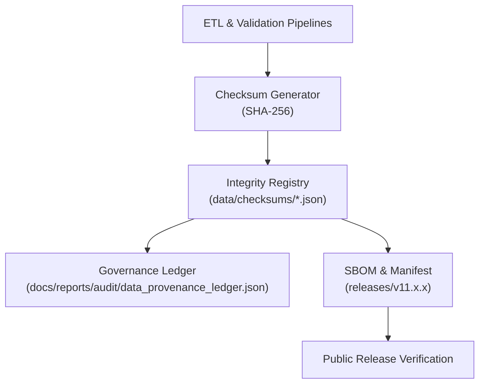

# 🔐 **Kansas Frontier Matrix — Data Checksums & Integrity Registry**  
`data/checksums/README.md`

**Purpose**  
Describe the **checksum verification system**, integrity tracking, and provenance linkage for all datasets and releases in the **Kansas Frontier Matrix (KFM)**.  

Every artifact—from raw dataset to release bundle—is:

- Cryptographically hashed (SHA-256)  
- Registered into governance ledgers  
- Cross-checked with SBOM and release manifests  
- Integrated with FAIR+CARE governance and sustainability telemetry  

 ·
 ·
 ·

---

## 📘 1. Overview

The **Checksum Integrity Registry** manages **SHA-256 manifests** for:

- Datasets under `data/**`  
- STAC/DCAT metadata files  
- Release artifacts (`manifest.zip`, STAC catalogs, DCAT catalogs)  
- Critical governance files (data contracts, ontology schemas, etc.)  

Checksums serve as **verifiable fingerprints** binding:

- Data files → SBOM entries → release manifests → governance records  

Primary objectives:

- Detect unauthorized modifications or corruption  
- Provide public verifiability of releases  
- Support reproducibility of historical analyses  
- Feed integrity signals into governance, telemetry, and reliability dashboards  

---

## 🧭 2. System Architecture

### 2.1 Flow Description

1. **Generation**  
   - Pipelines compute SHA-256 for all governed artifacts after ETL.  

2. **Registration**  
   - Checksums are written to manifests under `data/checksums/`.  
   - SBOM checks confirm coverage and consistency.  

3. **Governance Linking**  
   - Governance ledgers reference checksum IDs and manifest entries.  

4. **Publication & Verification**  
   - Releases embed checksum sets enabling external integrity checks.  

---

## 🗂️ 3. Directory Layout (Emoji Style A)

~~~text
data/checksums/
├── 📄 README.md                     # This file
├── 📘 manifest.json                 # Master SHA-256 manifest for core datasets
├── 🧪 processed_datasets.json       # Checksums for FAIR+CARE-certified processed outputs
├── 🧱 staging_datasets.json         # Checksums for normalized/staging artifacts
├── 🧰 work_datasets.json            # Checksums for ETL workspaces (optional)
└── 🧾 release_hashes.json           # Checksums mapped to SBOM + manifest.zip entries
~~~

Rules:

- `manifest.json` is the canonical index of checksums for key datasets.  
- Other manifests partition coverage by lifecycle stage (processed, staging, work, release).  
- All files must conform to the `data-checksums-readme-v11` or compatible schemas.  

---

## ⚙️ 4. Manifest Structure

All checksum manifests share a core structure:

~~~json
{
  "version": "v11.0.0",
  "generated_on": "2025-11-19T19:25:00Z",
  "hash_algorithm": "SHA-256",
  "datasets": [
    {
      "id": "hazards_processed_v11.0.0",
      "path": "data/processed/hazards/hazards_composite_v11.0.0.geojson",
      "checksum": "sha256-2f1e3b8c97df84b5d2c3e39bbd95b9e8d12b64ad38a62400f745d68ec6d1b75e",
      "fairstatus": "certified",
      "governance_ref": "docs/reports/audit/data_provenance_ledger.json",
      "stac_ref": "data/stac/items/hazards_v11_2025Q4.json",
      "dcat_ref": "data/dcat/hazards_v11_2025Q4.jsonld"
    },
    {
      "id": "climate_staging_v11.0.0",
      "path": "data/staging/climate/climate_aggregate_v11.0.0.parquet",
      "checksum": "sha256-a8373fa4d12d49be5f5f2178a91d79981b1d28b947f05eaa52e9e7e8d2cfadcd",
      "fairstatus": "pending"
    }
  ]
}
~~~

**Checksum format:** `sha256-<hex>`.

Required per dataset:

- `id`  
- `path`  
- `checksum`  
- `fairstatus`  

Recommended:

- `governance_ref`  
- `stac_ref`, `dcat_ref`  

---

## 🧠 5. FAIR+CARE Integrity Governance

Checksums are deeply integrated with FAIR+CARE:

| Principle              | Implementation                                                   | Verified By          |
|------------------------|------------------------------------------------------------------|----------------------|
| **Findable**           | Checksum references in STAC/DCAT and manifests                  | @kfm-data            |
| **Accessible**         | JSON manifests under CC-BY 4.0                                  | @kfm-accessibility   |
| **Interoperable**      | Compatible with SPDX, STAC, and DCAT structures                 | @kfm-architecture    |
| **Reusable**           | Immutable, versioned logs with provenance links                  | @kfm-governance      |
| **Collective Benefit** | Public can independently verify dataset integrity                | @faircare-council    |
| **Authority to Control** | Governance Council sets checksum coverage/policy              | @kfm-governance      |
| **Responsibility**     | Telemetry-backed coverage; periodic audits                       | @kfm-security        |
| **Ethics**             | Integrity guardrails for ethically sensitive data                | @kfm-ethics          |

Governance ledgers ensure checksum policy changes and exceptions are fully auditable.

---

## 🧮 6. Validation Workflows

Several workflows in `.github/workflows/` enforce checksum correctness:

| Workflow               | Description                                      | Outputs                                                              |
|------------------------|--------------------------------------------------|----------------------------------------------------------------------|
| `checksum-verify.yml`  | Generates & verifies SHA-256 hashes              | `data/checksums/manifest.json`, per-stage checksum manifests        |
| `faircare_validate.yml`| Ensures checksumming respects FAIR+CARE          | `docs/reports/fair/faircare_summary.json`                           |
| `governance-ledger.yml`| Aligns checksum records with governance ledger   | `docs/reports/audit/data_provenance_ledger.json`                    |
| `sbom_verify.yml`      | Confirms SBOM→checksum→manifest consistency      | `releases/v11.x.x/sbom.spdx.json`, `releases/v11.x.x/manifest.zip`  |

Any PR touching `data/checksums/` or release artifacts must pass these workflows.

---

## 📊 7. Example CLI Verification

Local verification using standard tools:

~~~bash
# 1) Compute checksum locally
sha256sum data/processed/hazards/hazards_composite_v11.0.0.geojson

# 2) Look up expected checksum in manifest
jq '.datasets[] | select(.id=="hazards_processed_v11.0.0")' data/checksums/manifest.json

# 3) Compare results manually or via script
~~~

Helper scripts in `tools/validation/` can automate these checks as part of a reproducible pipeline.

---

## 🌱 8. Sustainability & Integrity Metrics

Sustainability and integrity metrics captured in telemetry:

| Metric              | Target                      | Verified By         |
|---------------------|----------------------------|---------------------|
| Checksum Coverage   | 100% for released datasets | @kfm-validation     |
| Governance Sync     | 100% for archived datasets | @kfm-governance     |
| SBOM Parity         | ≥ 99.9% SBOM–manifest match| @kfm-architecture   |
| Energy per Batch    | ≤ 10 Wh per checksum batch | @kfm-sustainability |
| FAIR+CARE Compliance| Certified-only processes   | @faircare-council   |

Telemetry is written to:

~~~text
../../releases/v11.2.2/focus-telemetry.json
docs/reports/telemetry/data-checksums-*.json
~~~

---

## 🗂️ 9. Naming & Conventions

- **Data files:** `<domain>_<layer>_v<semver>.<ext>`  
  - e.g., `hazards_composite_v11.0.0.geojson`  
- **Checksum IDs:** `<dataset_id>`, aligned with STAC/DCAT IDs when possible.  
- **Checksum field:** all manifests must include a `checksum` field in `sha256-<hex>` format.  

**Immutability rule:**  
Once a release is tagged, its checksum entries become append-only; corrections add **new records**, never overwrite existing ones.

---

## 🧾 10. Internal Citation

~~~text
Kansas Frontier Matrix (2025). Data Checksums & Integrity Registry (v11.0.0).
Checksum governance, cryptographic verification, and FAIR+CARE-integrated integrity
processes for KFM datasets and releases. Ensures dataset immutability, reproducibility,
and public verifiability across versions.
~~~

---

## 🕰 11. Version History

| Version | Date       | Author      | Summary                                                                                       |
|--------:|-----------:|------------|-----------------------------------------------------------------------------------------------|
| v11.2.2 | 2025-11-27 | @kfm-data  | Upgraded to KFM-MDP v11.2.2, applied emoji layout, aligned references, clarified governance. |
| v11.0.0 | 2025-11-19 | @kfm-data  | Upgraded to v11; added sustainability telemetry, ROOT-GOVERNANCE link, and ontology hooks.   |
| v10.2.2 | 2025-11-12 | @kfm-data  | Aligned with v10.2; SBOM/manifest linkage, JSON-LD guidance, CLI examples, telemetry.         |
| v10.0.0 | 2025-11-10 | @kfm-data  | Baseline registry; governance mapping, manifest examples, and metrics.                        |

---

© 2025 Kansas Frontier Matrix — CC-BY 4.0  
[⬅️ Back](../README.md) · [🗃️ Archive & Provenance Registry](../archive/README.md) · [🛡️ Governance Charter](../../docs/standards/governance/ROOT-GOVERNANCE.md)

