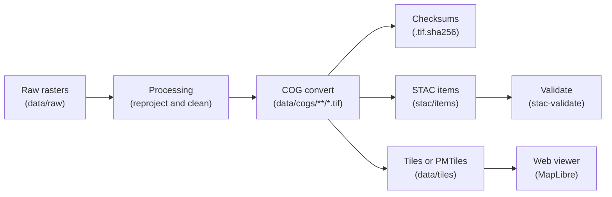

# 🗺️ Kansas-Frontier-Matrix — Cloud-Optimized GeoTIFFs (COGs)

**Mission:** Store final, publishable rasters in a **reproducible, HTTP-friendly** format.
All COGs are validated, checksummed, and linked to **STAC Items** for discovery.

[](../../.github/workflows/site.yml)
[](../../.github/workflows/stac-badges.yml)



<!-- END OF MERMAID -->

---

## 📂 Directory Layout

```
data/
└─ cogs/
   ├─ dem/
   │  ├─ ks_1m_dem_2018_2020.tif
   │  └─ ks_1m_dem_2018_2020.tif.sha256
   ├─ hillshade/
   │  ├─ ks_hillshade_2018_2020.tif
   │  └─ ks_hillshade_2018_2020.tif.sha256
   └─ overlays/
      ├─ usgs_topo_larned_1894.tif
      └─ usgs_topo_larned_1894.tif.sha256
```

**Every raster must have:**

* COG layout (internal tiling + overviews)
* CRS = **EPSG:4326** (unless documented otherwise)
* `.tif.sha256` sidecar (GNU format)
* STAC Item in `stac/items/**`

---

## 🏷️ Naming Convention

```
<region_or_theme>*<detail>*<temporal>.tif
```

Examples:

* `ks_1m_dem_2018_2020.tif`
* `ks_hillshade_2018_2020_multidir.tif`
* `usgs_topo_larned_1894.tif`

---

## ⚙️ Converting to COG

### Via project script

**Lossless (DEM, line art):**

```bash
python scripts/convert.py raster-to-cog \
  data/raw/maps/usgs_topo_larned_1894_raw.tif \
  data/cogs/overlays/usgs_topo_larned_1894.tif
```

**Photographic scans (WebP profile):**

```bash
python scripts/convert.py raster-to-cog \
  --web-optimized \
  data/raw/scans/relief_tint_1938.tif \
  data/cogs/overlays/relief_tint_ks_1938.tif
```

> The script reprojects to **EPSG:4326**, builds overviews, and writes `.sha256`.

---

### Direct GDAL (reference)

**DEM (float32):**

```bash
gdal_translate -of COG \
  -co COMPRESS=DEFLATE -co PREDICTOR=2 -co BLOCKSIZE=512 \
  -co NUM_THREADS=ALL_CPUS -co BIGTIFF=IF_SAFER \
  -co OVERVIEW_RESAMPLING=AVERAGE \
  <input_dem_wgs84.tif> data/cogs/dem/ks_1m_dem_2018_2020.tif
```

**Hillshade (uint8):**

```bash
gdaldem hillshade -alt 45 -az 315 -compute_edges \
  data/cogs/dem/ks_1m_dem_2018_2020.tif /tmp/ks_hillshade.tif

gdal_translate -of COG \
  -co COMPRESS=DEFLATE -co PREDICTOR=2 -co BLOCKSIZE=512 \
  -co NUM_THREADS=ALL_CPUS -co BIGTIFF=IF_SAFER \
  /tmp/ks_hillshade.tif data/cogs/hillshade/ks_hillshade_2018_2020.tif
```

**Historic map (RGB, JPEG-in-COG):**

```bash
gdalwarp -t_srs EPSG:4326 -r cubic -dstalpha \
  <src_georef.tif> /tmp/larned_wgs84.tif

gdal_translate -of COG \
  -co COMPRESS=JPEG -co QUALITY=85 -co PHOTOMETRIC=YCBCR -co BLOCKSIZE=512 \
  /tmp/larned_wgs84.tif data/cogs/overlays/usgs_topo_larned_1894.tif
```

---

## 🌐 CRS Guidance

* **Default:** EPSG:4326 (WGS84) for viewer/web layers.
* **Kansas DEMs/LiDAR:** typically UTM Zone 14N — EPSG:26914 (NAD83) or 6344 (NAD83 2011).
* If reprojected, document it in STAC properties.

---

## 📑 STAC Registration

**Python API:**

```python
from kansas_geo_timeline.ingest import ingest_raster
out, item = ingest_raster(
    "data/raw/scans/usgs_topo_larned_1894.tif",
    out_dir="data/cogs/overlays",
    profile="deflate",
    stac_items_dir="stac/items",
    stac_collection="kfm-overlays")
print(out, item["id"])
```

**Make:**

```bash
make stac stac-validate-items
```

---

## 🌍 Web Integration

Example raster layer config:

```json
{
  "id": "usgs_topo_larned_1894",
  "title": "USGS Topo (Larned, 1894)",
  "type": "raster",
  "data": "data/cogs/overlays/usgs_topo_larned_1894.tif",
  "category": "cartography",
  "time": { "start": "1894-01-01", "end": "1894-12-31" },
  "opacity": 0.8,
  "visible": false,
  "attribution": "USGS (Public Domain)"
}
```

For PMTiles, use:

```
"data": "pmtiles://data/tiles/usgs_topo_larned_1894.pmtiles"
```

---

## ✅ Validation & QA

```bash
# Check checksums
find data/cogs -name "*.tif.sha256" -print0 | xargs -0 sha256sum -c

# Inspect metadata
gdalinfo data/cogs/dem/ks_1m_dem_2018_2020.tif | head -n 40

# Optional COG structure check
rio cogeo validate data/cogs/overlays/usgs_topo_larned_1894.tif
```

---

## 🛠 Troubleshooting

* **Jagged overviews** → reconvert with overviews.
* **Large files** → use `--web-optimized` or JPEG compression.
* **Misalignment** → verify source georeferencing before conversion.
* **Color washout** → DEFLATE for maps; JPEG/WebP for photos only.

---

## 📋 Checklist for new rasters

1. Convert to **COG** under `data/cogs/<subdir>/<name>.tif`.
2. Write **checksum** `<name>.tif.sha256`.
3. Generate a **STAC Item** (`make stac`).
4. Add web config if needed (`web/data/*.json`).
5. Validate (`sha256sum -c`, `gdalinfo`, optional `rio cogeo`).
6. Commit — CI will enforce STAC + checksum rules.

---

## 📝 Maintainer Notes

* Large rasters tracked with **Git LFS / DVC** (commit checksums + STAC, not the whole TIFF).
* Standard tile size: **512**.
* Continuous rasters → **DEFLATE + PREDICTOR=2**.
* Scanned maps/photos → **JPEG (~85)** or WebP (via script).
