<div align="center">

# ⚠️ Kansas Frontier Matrix — Hazard **Derivative Checksums**

`data/derivatives/hazards/checksums/`

**Purpose:** Maintain verifiable, machine-readable **SHA-256 integrity manifests**
for all hazard derivative datasets — tornado tracks, drought indices, flood rasters, and severe weather composites —
generated and validated through the Kansas Frontier Matrix (KFM) ETL pipeline.

[](../../../../../.github/workflows/site.yml)
[](../../../../../.github/workflows/stac-validate.yml)
[](../../../../../.github/workflows/codeql.yml)
[](../../../../../.github/workflows/trivy.yml)
[](../../../../../docs/)
[](../../../../../LICENSE)
[](#-version-history)

</div>

---

## 📚 Overview

This directory houses **`.sha256` checksum manifests** for all hazard-related derivative products in
`data/derivatives/hazards/`.

These checksums safeguard **data integrity**, enforce **reproducibility**, and act as validation gates for:

* Tornado, hail, and severe storm tracks (NOAA SPC)
* Flood extent and drought index rasters (FEMA, USGS, NOAA)
* Multi-hazard composites and disaster summaries

Each checksum represents a **cryptographic fingerprint** ensuring the derivative file is unchanged across ETL runs,
STAC registration, and archival.

---

## 🧭 Checksum Generation Flow (GitHub-safe Mermaid)

```mermaid
flowchart TD
  A["Hazard Sources\nNOAA SPC · FEMA · USGS · NCEI Storm Data"] --> B["ETL\nExtract · Normalize · Derive"]
  B --> C["Hazard Derivatives\nCOG · GeoJSON · Parquet · CSV"]
  C --> D["Compute SHA-256\nGenerate *.sha256 manifests"]
  D --> E["STAC Items\nEmbed checksum:sha256 fields"]
  E --> F["Knowledge Graph\nAttach provenance nodes"]
  F --> G["API & Web UI\nServe verified hazard layers"]
%% END OF MERMAID
```



---

## 🗂️ Directory Layout

```bash
checksums/
├── tornado_tracks_1950_2024.geojson.sha256
├── flood_zones_1990_2025_cog.tif.sha256
├── drought_index_annual_ks.parquet.sha256
├── severe_storm_reports_1955_2024.csv.sha256
└── README.md
```

> Each `.sha256` file contains a **single-line** hexadecimal digest followed by its file name,
> corresponding directly to the artifact stored in `../hazards/`.

---

## 🧾 File Format Specification

| Property         | Description                                                      |
| :--------------- | :--------------------------------------------------------------- |
| **Algorithm**    | SHA-256 (hexadecimal digest)                                     |
| **Format**       | `<HEX_DIGEST>  <filename>`                                       |
| **Line Endings** | LF (`\n`)                                                        |
| **Scope**        | Calculated for all derivative files (COG, GeoJSON, Parquet, CSV) |
| **Purpose**      | Used by CI and STAC validation to verify data immutability       |

**Example:**

```text
b4a9e91a9a7c42a9b4a3e2b78a3c17f7f99e2e9b8f1d2f8e4b7e8f2a9c1a0d7b  flood_zones_1990_2025_cog.tif
```

---

## 🛠️ Generate & Verify Checksums

### ✅ Generate

```bash
cd data/derivatives/hazards
for f in *.tif *.geojson *.parquet *.csv; do
  [ -f "$f" ] || continue
  sha256sum "$f" > "checksums/${f}.sha256"
done
```

### 🔍 Verify

```bash
cd data/derivatives/hazards
for c in checksums/*.sha256; do
  sha256sum -c "$c"
done
```

> Works cross-platform — `sha256sum` (Linux) or `shasum -a 256` (macOS) produce equivalent digests.

---

## 🔗 STAC Integration (Provenance)

Checksums are embedded in STAC Item JSONs for reproducible metadata linking.

| STAC Field                     | Example                           |
| :----------------------------- | :-------------------------------- |
| `assets.<key>.href`            | `"flood_zones_1990_2025_cog.tif"` |
| `assets.<key>.checksum:sha256` | `"b4a9e91a9a7c42a9..."`           |
| `properties['kfm:provenance']` | `"data/sources/noaa_spc.json"`    |

**STAC Validation:**
During CI/CD (`stac-validate.yml`), these digests are cross-checked to confirm data integrity and metadata alignment.

---

## 🧩 Knowledge Graph & API Integration

* **Neo4j:** `checksum_sha256` properties attach to derivative asset nodes, allowing provenance queries and lineage visualization.
* **API:** `/api/hazards/{id}/checksum` returns checksum info for client-side verification.
* **Frontend:** Hazard data cards display checksum status badges:

  * ✅ **Verified:** STAC match confirmed
  * ⚠️ **Pending:** Awaiting validation
  * ❌ **Mismatch:** CI integrity failure

---

## 🧱 Naming Conventions

| Pattern                               | Example                                     | Description                           |
| :------------------------------------ | :------------------------------------------ | :------------------------------------ |
| `<dataset>_<years>.geojson.sha256`    | `tornado_tracks_1950_2024.geojson.sha256`   | Tornado, hail, or storm vector layers |
| `<dataset>_<period>_cog.tif.sha256`   | `flood_zones_1990_2025_cog.tif.sha256`      | Raster hazard composites              |
| `<dataset>_<interval>.parquet.sha256` | `drought_index_annual_ks.parquet.sha256`    | Tabular or gridded datasets           |
| `<dataset>_<range>.csv.sha256`        | `severe_storm_reports_1955_2024.csv.sha256` | Summary tables and event reports      |

---

## ✅ Repository Policy

1️⃣ Every hazard derivative **must include** a `.sha256` file before commit.
2️⃣ Checksums **must be regenerated** after any modification to datasets.
3️⃣ **CI (STAC Validation)** will fail if digests mismatch their registered STAC entries.
4️⃣ Pull requests altering derivative data **must include updated checksum files**.
5️⃣ All checksum updates are logged in the corresponding **metadata changelog**.

---

## 🔒 Reproducibility & MCP Compliance

Checksums are integral to **Master Coder Protocol (MCP)** guarantees of scientific reproducibility:

* **Traceability:** Each artifact’s fingerprint connects ETL → STAC → Graph.
* **Accountability:** Immutable digests prevent tampering and enable audit trails.
* **Transparency:** CI validation ensures datasets remain authentic, versioned, and reproducible.
* **Evidence Chain:** Hash integrity supports long-term archival verification.


---

## 🧱 Related Documentation

* [`data/derivatives/hazards/metadata/README.md`](../../metadata/README.md) — Metadata linkage and schema
* [`data/stac/README.md`](../../../../stac/README.md) — STAC catalog design
* [`docs/architecture/`](../../../../../docs/architecture/) — Integrity validation and provenance flow
* [`data/sources/README.md`](../../../../sources/README.md) — Hazard source manifests

---

## 🗓️ Version History

|   Version  |    Date    | Notes                                                                 |
| :--------: | :--------: | :-------------------------------------------------------------------- |
| **v1.1.0** | 2025-10-11 | Added version badge, Mermaid diagram fix, and CI integration updates. |
| **v1.0.0** | 2025-10-10 | Initial hazard checksum manifest documentation and examples.          |

---

<div align="center">

**Maintainers:** KFM Hazards & Climate Team
**Compliance:** MCP v2.1 · STAC 1.0.0 · JSON-Schema 2020-12

*“Every verified byte protects a century of Kansas storms.”*

</div>
