<div align="center">

# ⚡ Kansas Frontier Matrix — Hazard **Derivative Metadata**

`data/derivatives/hazards/metadata/`

**Purpose:** Store structured, machine-readable metadata for all processed **hazard derivatives**
(tornado tracks, drought rasters, flood composites, storm summaries), linking each dataset to **checksums**, **STAC items**, and **source provenance**.

[](../../../../../.github/workflows/site.yml)
[](../../../../../.github/workflows/stac-validate.yml)
[](../../../../../.github/workflows/codeql.yml)
[](../../../../../.github/workflows/trivy.yml)
[](../../../../../docs/)
[](../../../../../LICENSE)
[](#-version-history)

</div>

---

## 📚 Overview

This folder contains **metadata JSON** documents for every dataset in `data/derivatives/hazards/`.
Each record captures **source lineage**, **variables**, **temporal & spatial coverage**, **CRS**, and strong links to **STAC** and **checksums**.

These files form the contract between:

* ETL-derived hazard artifacts (COGs, GeoJSON, Parquet, CSV)
* Integrity manifests in `../checklists/…` *(checksums)*
* STAC catalog entries in `data/stac/`
* Knowledge-graph ingestion (Neo4j: `HAS_DERIVATIVE`, `HAS_SOURCE`, `HAS_CHECKSUM`)

All content follows **Master Coder Protocol (MCP)** for documentation-first reproducibility.

---

## 🧭 Metadata Generation Flow (GitHub-safe Mermaid)

```mermaid
flowchart TD
  A["Sources\nNOAA SPC · FEMA · USGS · NCEI"] --> B["ETL\nExtract · Transform · Derive"]
  B --> C["Hazard Derivatives\nCOG · GeoJSON · Parquet · CSV"]
  C --> D["Metadata JSONs\nvariables · CRS · temporal · provenance"]
  D --> E["Checksums\nSHA-256 validation"]
  D --> F["STAC Items\nassets + links"]
  F --> G["Knowledge Graph\nentities + relations"]
  G --> H["API & Web UI\nhazard map · timeline"]
%% END OF MERMAID
```



---

## 🗂️ Directory Layout

```bash
metadata/
├── tornado_tracks_1950_2024.json
├── flood_zones_1990_2025.json
├── drought_index_annual_ks.json
├── severe_storm_reports_1955_2024.json
└── README.md
```

> Each `.json` maps **1:1** to a processed hazard dataset and conforms to the KFM metadata schema aligned with **STAC** and **DCAT**.

---

## 🧾 Metadata Record — **Example**

```json
{
  "id": "tornado_tracks_1950_2024",
  "title": "Tornado Tracks Across Kansas (1950–2024, NOAA SPC)",
  "description": "Line vector dataset of recorded tornado tracks in Kansas (1950–2024), derived from NOAA SPC historical records.",
  "datatype": "vector",
  "format": "GeoJSON",
  "file": "../tornado_tracks_1950_2024.geojson",
  "checksum": "../checksums/tornado_tracks_1950_2024.geojson.sha256",
  "source": "../../../sources/noaa_spc_tornadoes.json",
  "stac_item": "../../../stac/items/tornado_tracks_1950_2024.json",
  "spatial": {
    "crs": "EPSG:4326",
    "bbox": [-102.05, 36.99, -94.59, 40.00]
  },
  "temporal": {
    "start": "1950-01-01",
    "end": "2024-12-31"
  },
  "variables": [
    {
      "name": "tornado_path",
      "units": "miles",
      "description": "Track geometry with EF rating and path length attributes."
    }
  ],
  "processing": {
    "software": ["python>=3.11", "gdal>=3.8", "geopandas>=0.14"],
    "pipeline_ref": "../../../tools/hazards/tornado_tracks.py",
    "parameters": {
      "crs_target": "EPSG:4326",
      "clip_bbox": [-102.05, 36.99, -94.59, 40.00]
    },
    "provenance_sha256": "sha256:b52f8e..."
  },
  "license": "CC-BY-4.0",
  "created": "2025-10-10",
  "last_updated": "2025-10-11",
  "mcp_stage": "derivatives"
}
```

> **Tip:** Keep paths **relative** and stable; ensure `file`, `checksum`, and `stac_item` all resolve within the repo.

---

## 🧩 Relationship to Other Layers

| Layer                      | Path                                  | Purpose                                           |
| -------------------------- | ------------------------------------- | ------------------------------------------------- |
| 🧭 **Source Metadata**     | `data/sources/`                       | Raw hazard inputs (NOAA, FEMA, USGS, NCEI).       |
| ⚙️ **Derivative Metadata** | `data/derivatives/hazards/metadata/`  | Describes ETL outputs (this folder).              |
| 🧾 **Checksums**           | `data/derivatives/hazards/checksums/` | File integrity (`.sha256`).                       |
| 🗺️ **STAC Catalog**       | `data/stac/`                          | Registrations of assets with time/space metadata. |
| 🧠 **Knowledge Graph**     | `neo4j/` (ingest)                     | Semantic entities + relations for hazards domain. |

---

## 🛠️ Pipeline Integration

* **ETL:** Scripts emit/refresh metadata post-derivation.
* **Validation:** JSON-Schema + STAC checks (CI) ensure structure and link integrity.
* **CI/CD:** `stac-validate.yml` enforces that each derivative has valid metadata & checksum.
* **Graph:** Importer maps `variables.*`, `temporal.*`, `spatial.*` into nodes/edges for timeline queries.

**Make targets**

```bash
make hazards-metadata         # build/refresh metadata jsons
make validate-hazards-meta    # schema + STAC + checksum link checks
```

---

## 🧱 Metadata Best Practices

| Category       | Guideline                                                            |
| -------------- | -------------------------------------------------------------------- |
| ✅ Completeness | Every hazard derivative has a metadata JSON.                         |
| 🔗 Linkage     | Always reference checksum, STAC item, and source manifest.           |
| 🕓 Timestamps  | Use ISO-8601 for `created` and `last_updated`.                       |
| 🧮 Variables   | Define attributes with names, units, and brief descriptions.         |
| 🧾 Licensing   | Record license explicitly (default **CC-BY-4.0** unless restricted). |
| 🧪 Validation  | Run `make validate-hazards-meta` or rely on CI before PR.            |
| 🌐 CRS         | Prefer `EPSG:4326` for web; note native CRS if different.            |

---

## 🔧 JSON-Schema (mini spec)

> Full spec in `docs/schemas/metadata/hazards/`. This subset captures required core:

```json
{
  "$schema": "https://json-schema.org/draft/2020-12/schema",
  "title": "KFM Hazard Derivative Metadata",
  "type": "object",
  "required": ["id", "title", "datatype", "file", "checksum", "source", "stac_item", "spatial", "temporal", "license", "created"],
  "properties": {
    "id": {"type": "string"},
    "title": {"type": "string"},
    "datatype": {"enum": ["raster", "vector", "table"]},
    "format": {"type": "string"},
    "file": {"type": "string"},
    "checksum": {"type": "string"},
    "source": {"type": "string"},
    "stac_item": {"type": "string"},
    "spatial": {
      "type": "object",
      "required": ["crs", "bbox"],
      "properties": {
        "crs": {"type": "string"},
        "bbox": {"type": "array", "items": {"type": "number"}, "minItems": 4, "maxItems": 4}
      }
    },
    "temporal": {
      "type": "object",
      "required": ["start"],
      "properties": {
        "start": {"type": "string", "format": "date"},
        "end": {"type": "string", "format": "date"}
      }
    },
    "variables": {"type": "array"},
    "processing": {"type": "object"},
    "license": {"type": "string"},
    "created": {"type": "string", "format": "date"},
    "last_updated": {"type": "string", "format": "date"}
  }
}
```

---

## 🧱 Related Documentation

* `data/derivatives/hazards/checksums/README.md` — checksum workflow
* `data/stac/README.md` — STAC item structure & validation
* `docs/architecture/` — ETL + provenance system overview
* `data/sources/README.md` — hazard source manifest standards

---

## 🗓️ Version History

|    Version |    Date    | Notes                                                                                     |
| ---------: | :--------: | ----------------------------------------------------------------------------------------- |
| **v1.1.0** | 2025-10-11 | Added version badge, Mermaid fix, JSON-Schema mini spec, Make targets, and linkage table. |
|     v1.0.0 | 2025-10-10 | Initial creation of hazard derivative metadata schema and examples.                       |

<div align="center">

**Maintainers:** KFM Hazards & Climate Team · *PRs welcome*
**Compliance:** MCP v2.1 · STAC 1.0.0 · JSON-Schema 2020-12

</div>
