<div align="center">

# 💧 Kansas Frontier Matrix — Hydrology **Derivative Checksums**

`data/derivatives/hydrology/checksums/`

**Purpose:** Maintain verifiable **SHA-256 integrity manifests** for all hydrology derivative datasets —
streamflow rasters, floodplain maps, aquifer grids, and watershed boundaries — generated via the KFM ETL pipeline.

[](../../../../../.github/workflows/site.yml)
[](../../../../../.github/workflows/stac-validate.yml)
[](../../../../../.github/workflows/codeql.yml)
[](../../../../../.github/workflows/trivy.yml)
[](../../../../../docs/)
[](../../../../../LICENSE)
[](#-version-history)

</div>

---

## 📚 Overview

This directory contains **`.sha256` checksum files** for all processed hydrology derivative outputs
under `data/derivatives/hydrology/`.

Checksums serve as **immutable digital fingerprints** verifying data integrity, reproducibility,
and alignment with the Kansas Frontier Matrix’s **Master Coder Protocol (MCP)** principles.

They provide:

* **Integrity assurance** across CI/CD, ETL, and archival workflows
* **Traceable linkage** with STAC assets and the Neo4j knowledge graph
* **Transparency** for every hydrologic artifact published by KFM

Artifacts covered include:

* Streamflow composites and discharge grids
* Floodplain and inundation rasters (COG)
* Watershed and sub-basin boundary polygons
* Aquifer and groundwater depth rasters

---

## 🧭 Checksum Generation Flow

```mermaid
flowchart TD
  A["Hydrology Sources\nUSGS · FEMA · NOAA · KDHE"] --> B["ETL\nExtract · Normalize · Derive"]
  B --> C["Hydrology Derivatives\nCOG · GeoJSON · Parquet · CSV"]
  C --> D["Compute SHA-256\nGenerate *.sha256 manifests"]
  D --> E["STAC Items\nEmbed checksum:sha256 fields"]
  E --> F["Knowledge Graph\nIngest checksum properties"]
  F --> G["API & Web UI\nServe verified layers + status"]
%% END OF MERMAID
```



---

## 🗂️ Directory Layout

```bash
checksums/
├── streamflow_monthly_1990_2025_cog.tif.sha256
├── floodplain_extent_2020_cog.tif.sha256
├── aquifer_depth_ks_cog.tif.sha256
├── watershed_boundaries_huc8.geojson.sha256
└── README.md
```

> Each `.sha256` file contains a single line with the checksum and filename,
> corresponding directly to datasets under `../hydrology/`.

---

## 🧾 File Format Specification

| Property         | Description                                                         |
| :--------------- | :------------------------------------------------------------------ |
| **Algorithm**    | SHA-256 (hex digest)                                                |
| **Format**       | `<HEX_DIGEST>  <filename>`                                          |
| **Line Endings** | LF (`\n`)                                                           |
| **Scope**        | Generated for all hydrology derivatives: COG, GeoJSON, Parquet, CSV |
| **Purpose**      | CI & STAC validation; ensures dataset immutability and auditability |

**Example:**

```text
c7b3a3ef3d9eac9b8a6e42b2d98b7a3d14bde2c45b8c2d1ea7b8d41f1e96a7d9  floodplain_extent_2020_cog.tif
```

---

## 🛠️ Generate & Verify Checksums

### ✅ Generate

```bash
cd data/derivatives/hydrology
for f in *.tif *.geojson *.parquet *.csv; do
  [ -f "$f" ] || continue
  sha256sum "$f" > "checksums/${f}.sha256"
done
```

### 🔍 Verify

```bash
cd data/derivatives/hydrology
for c in checksums/*.sha256; do
  sha256sum -c "$c"
done
```

> **Cross-platform note:**
> macOS users may substitute `shasum -a 256` for `sha256sum`.

---

## 🔗 STAC Integration (Provenance)

Checksums are referenced directly in each STAC Item to ensure file integrity and discoverability.

| STAC Field                     | Example                                |
| :----------------------------- | :------------------------------------- |
| `assets.<key>.href`            | `"floodplain_extent_2020_cog.tif"`     |
| `assets.<key>.checksum:sha256` | `"c7b3a3ef3d9eac9b8a6e42b2d98…" `      |
| `properties['kfm:provenance']` | `"data/sources/fema_flood_zones.json"` |

This linkage ensures that metadata, data, and provenance all reconcile through automated STAC validation during CI.

---

## 🧩 Knowledge Graph & API Use

* **Neo4j Integration:** `checksum_sha256` properties are stored on asset nodes, linking to derivative lineage.
* **API Exposure:** `/api/hydrology/{id}/checksum` returns checksum data for verification.
* **Frontend Display:** Each hydrology layer shows integrity status:

  * ✅ Verified — Matches STAC manifest
  * ⚠️ Pending — Awaiting validation
  * ❌ Mismatch — Triggers CI alert

---

## 🧱 Naming Conventions

| Pattern                             | Example                                       | Description             |
| :---------------------------------- | :-------------------------------------------- | :---------------------- |
| `<dataset>_<years>_cog.tif.sha256`  | `streamflow_monthly_1990_2025_cog.tif.sha256` | Multi-year COG rasters  |
| `<dataset>_<year>_cog.tif.sha256`   | `floodplain_extent_2020_cog.tif.sha256`       | Single-year rasters     |
| `<dataset>_<region>.geojson.sha256` | `watershed_boundaries_huc8.geojson.sha256`    | Vector boundaries       |
| `<dataset>_<region>.parquet.sha256` | `aquifer_depth_ks.parquet.sha256`             | Tabular or gridded data |

---

## ✅ Repository Policy

1️⃣ Every hydrology derivative **must** include a `.sha256` manifest.
2️⃣ Checksums **must be regenerated** when files change.
3️⃣ CI (`stac-validate.yml`) **fails** if STAC `checksum:sha256` mismatches.
4️⃣ All PRs modifying hydrology data **must include updated checksums**.
5️⃣ Checksums are **immutable once released** — they define dataset version identity.

---

## 🔒 Reproducibility & MCP Compliance

Hydrology checksum manifests reinforce the **Master Coder Protocol (MCP)** values:

* **Reproducibility:** Identical files always yield identical digests.
* **Provenance:** Digests are embedded in STAC + graph metadata for audit chains.
* **Integrity:** CI validation ensures authenticity and prevents data drift.
* **Transparency:** Human- and machine-verifiable checks for open science.


---

## 🧱 Related Documentation

* [`data/derivatives/hydrology/metadata/README.md`](../../metadata/README.md) — Metadata linkage & schema
* [`data/stac/README.md`](../../../../stac/README.md) — STAC catalog structure
* [`docs/architecture/`](../../../../../docs/architecture/) — Integrity & ETL workflow overview
* [`data/sources/README.md`](../../../../sources/README.md) — Source manifest and input standards

---

## 🗓️ Version History

|   Version  |    Date    | Notes                                                                 |
| :--------: | :--------: | :-------------------------------------------------------------------- |
| **v1.1.0** | 2025-10-11 | Added version badge, MCP compliance flow, and STAC integration table. |
| **v1.0.0** | 2025-10-10 | Initial hydrology checksum manifest documentation and examples.       |

---

<div align="center">

**Maintainers:** KFM Hydrology & Terrain Team
**Compliance:** MCP v2.1 · STAC 1.0.0 · JSON-Schema 2020-12

*“Integrity is the riverbed of reproducibility — every drop of data flows through verified ground.”*

</div>
