<div align="center">

# 💧 Kansas Frontier Matrix — Hydrology **Derivative Metadata**

`data/derivatives/hydrology/metadata/`

**Purpose:** Define structured, machine-readable metadata for all **hydrology derivatives**
(e.g., streamflow rasters, watershed boundaries, aquifer grids, floodplains) generated via the KFM ETL pipeline.

[](../../../../../.github/workflows/site.yml)
[](../../../../../.github/workflows/stac-validate.yml)
[](../../../../../.github/workflows/codeql.yml)
[](../../../../../.github/workflows/trivy.yml)
[](../../../../../docs/)
[](../../../../../LICENSE)
[](#-version-history)

</div>

---

## 📚 Overview

This folder stores **metadata JSON** documents for datasets under
`data/derivatives/hydrology/`. Each file records **origin, hydrologic variables, spatial/temporal extent, CRS**,
and links to **checksum manifests**, **STAC items**, and **source manifests**.

Goals:

* **Self-describing** & STAC/DCAT-aligned
* **Traceable** to ETL lineage & parameters
* **Verifiable** via SHA-256 checksums
* **Graph-ready** for entity/relationship loading into Neo4j

---

## 🧭 Metadata Generation Flow

```mermaid
flowchart TD
  A["Hydrology Sources\nUSGS · KDHE · NOAA · FEMA"] --> B["ETL\nExtract · Normalize · Derive"]
  B --> C["Hydrology Derivatives\nCOG · GeoJSON · Parquet · CSV"]
  C --> D["Metadata JSONs\nvariables · CRS · temporal range · provenance"]
  D --> E["Checksums\nSHA-256 validation"]
  D --> F["STAC Items\nlink assets + metadata"]
  F --> G["Knowledge Graph\nentity creation + relations"]
  G --> H["API & Web UI\nriver basins · aquifers · floodplains"]
%% END OF MERMAID

```



---

## 🗂️ Directory Layout

```bash
metadata/
├── streamflow_monthly_1990_2025.json
├── floodplain_extent_2020.json
├── aquifer_depth_ks.json
├── watershed_boundaries_huc8.json
└── README.md
```

> Each `.json` maps **1:1** to a processed hydrology derivative and aligns with the KFM STAC/DCAT schema.

---

## 🧾 Metadata Record — **Example (JSON)**

```json
{
  "id": "streamflow_monthly_1990_2025",
  "title": "Monthly Streamflow Composite for Kansas (1990–2025, USGS NWIS)",
  "description": "Derived monthly mean streamflow (cfs) aggregated across Kansas HUC8 watersheds from USGS NWIS data.",
  "datatype": "raster",
  "format": "COG",
  "file": "../streamflow_monthly_1990_2025_cog.tif",
  "checksum": "../checksums/streamflow_monthly_1990_2025_cog.tif.sha256",
  "source": "../../../sources/usgs_nwis_streamflow.json",
  "stac_item": "../../../stac/items/streamflow_monthly_1990_2025.json",
  "spatial": {
    "crs": "EPSG:4326",
    "bbox": [-102.05, 36.99, -94.59, 40.00]
  },
  "temporal": {
    "start": "1990-01-01",
    "end": "2025-01-01"
  },
  "variables": [
    {
      "name": "streamflow",
      "units": "cubic feet per second (cfs)",
      "description": "Monthly mean discharge derived from USGS stream gauges."
    }
  ],
  "processing": {
    "software": ["python>=3.11", "gdal>=3.8", "pandas>=2.2"],
    "pipeline_ref": "../../../tools/hydro/streamflow_monthly.py",
    "parameters": {
      "agg": "monthly_mean",
      "group_by": "HUC8",
      "nan_policy": "propagate"
    },
    "provenance_sha256": "sha256:b8c9e2..."
  },
  "license": "CC-BY-4.0",
  "created": "2025-10-10",
  "last_updated": "2025-10-11",
  "mcp_stage": "derivatives"
}
```

> **Tip:** Keep paths **relative** and stable. Cross-reference `data/sources/<source>.json` and `data/stac/items/<id>.json` for STAC integrity.

---

## 🧩 Relationship to Other Layers

| Layer                      | Path                                    | Purpose                                                   |
| -------------------------- | --------------------------------------- | --------------------------------------------------------- |
| 💧 **Source Metadata**     | `data/sources/`                         | Raw hydrologic inputs (USGS NWIS, FEMA NFHL, KDHE, NOAA). |
| ⚙️ **Derivative Metadata** | `data/derivatives/hydrology/metadata/`  | Describes ETL-derived hydrology products (this folder).   |
| 🧾 **Checksums**           | `data/derivatives/hydrology/checksums/` | Artifact integrity with `.sha256`.                        |
| 🗺️ **STAC Catalog**       | `data/stac/`                            | Registers spatial/temporal assets & links to derivatives. |
| 🧠 **Knowledge Graph**     | `neo4j/` (ingest pipeline)              | Semantic entities/relations for hydrology domain.         |

---

## 🧠 Usage in the Pipeline

* **ETL:** Python modules auto-emit/refresh metadata post-derivation.
* **Validation:** JSON Schema + STAC validation (CI) verify structure & linkages.
* **CI/CD:** `stac-validate.yml` & link-checkers enforce presence and correctness.
* **Graph Load:** Importer maps `variables.*`, `temporal.*`, and `spatial.*` to graph nodes/edges for timeline queries.

**Make targets**

```bash
make hydrology-metadata        # build/refresh metadata jsons
make validate-hydro-metadata   # schema + STAC + checksum link checks
```

---

## 🧱 Metadata Best Practices

| Category       | Guideline                                                                  |
| -------------- | -------------------------------------------------------------------------- |
| ✅ Completeness | Every derivative requires a **.json** metadata file.                       |
| 🔗 Linkage     | Always reference checksum, STAC item, and source manifest.                 |
| 🕓 Timestamps  | Use **ISO-8601** for `created` and `last_updated`.                         |
| 💧 Variables   | Define hydrologic attributes with names, units, and concise descriptions.  |
| 🧾 Licensing   | Record license explicitly (default **CC-BY-4.0** unless restricted).       |
| 🧪 Validation  | Run `make validate-hydro-metadata` or rely on CI before PR.                |
| 🌐 CRS         | Prefer `EPSG:4326` for web; record native CRS when different.              |
| 📦 Reuse       | Reference common processing params via `pipeline_ref` for reproducibility. |

---

## 🔒 Reproducibility & MCP Alignment

* **Traceability:** Metadata ties ETL outputs to sources, scripts, parameters, and checksums.
* **Interoperability:** JSON + STAC/DCAT alignment supports open dissemination.
* **Accountability:** SHA-256 manifests and provenance hashes ensure integrity and auditability.

---

## 🔧 JSON Schema (inline mini-spec)

> Full schemas live under `docs/schemas/metadata/hydrology/`. This inline snippet captures the **required core**:

```json
{
  "$schema": "https://json-schema.org/draft/2020-12/schema",
  "title": "KFM Hydrology Derivative Metadata",
  "type": "object",
  "required": ["id", "title", "datatype", "file", "checksum", "source", "stac_item", "spatial", "temporal", "license", "created"],
  "properties": {
    "id": {"type": "string"},
    "title": {"type": "string"},
    "datatype": {"enum": ["raster", "vector", "table"]},
    "format": {"type": "string"},
    "file": {"type": "string"},
    "checksum": {"type": "string"},
    "source": {"type": "string"},
    "stac_item": {"type": "string"},
    "spatial": {
      "type": "object",
      "required": ["crs", "bbox"],
      "properties": {
        "crs": {"type": "string"},
        "bbox": {"type": "array", "items": {"type": "number"}, "minItems": 4, "maxItems": 4}
      }
    },
    "temporal": {
      "type": "object",
      "required": ["start"],
      "properties": { "start": {"type": "string", "format": "date"}, "end": {"type": "string", "format": "date"} }
    },
    "variables": {"type": "array"},
    "processing": {"type": "object"},
    "license": {"type": "string"},
    "created": {"type": "string", "format": "date"},
    "last_updated": {"type": "string", "format": "date"}
  }
}
```

---

## 🧱 Related Documentation

* `data/derivatives/hydrology/checksums/README.md` — checksum integrity workflow
* `data/stac/README.md` — STAC catalog schema & validation
* `data/sources/README.md` — hydrology source manifests
* `docs/architecture/` — ETL architecture overview & CI gates

---

## 🗓️ Version History

|    Version |    Date    | Notes                                                                               |
| ---------: | :--------: | ----------------------------------------------------------------------------------- |
| **v1.1.0** | 2025-10-11 | Added versioning panel, JSON Schema mini-spec, Make targets, fixed Mermaid end tag. |
|     v1.0.0 | 2025-10-10 | Initial hydrology metadata schema and examples.                                     |

<div align="center">

**Maintainers:** KFM Hydrology & Terrain Team · *PRs welcome*
**Compliance:** MCP v2.1 · STAC 1.0.0 · JSON-Schema 2020-12

</div>
