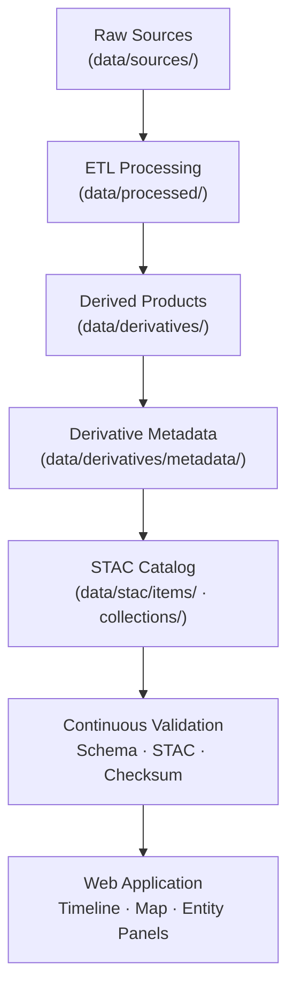

<div align="center">

# 🧾 Kansas Frontier Matrix — Derivative Metadata  
`data/derivatives/metadata/`

**Mission:** Provide authoritative, reproducible **metadata records** for every derivative dataset —  
documenting provenance, lineage, licensing, and schema validation for the full KFM processing chain.

[](../../../.github/workflows/site.yml)
[](../../../.github/workflows/stac-validate.yml)
[](../../../.github/workflows/codeql.yml)
[](../../../.github/workflows/trivy.yml)
[](../../../.github/workflows/pre-commit.yml)
[](../../../docs/)
[](../../../LICENSE)
[](../../../LICENSE)

</div>

---

## 📚 Table of Contents
- [Overview](#overview)
- [Purpose & Role](#purpose--role)
- [Directory Layout](#directory-layout)
- [Metadata Standards](#metadata-standards)
- [STAC Integration](#stac-integration)
- [Validation & Provenance](#validation--provenance)
- [Adding or Editing Metadata](#adding-or-editing-metadata)
- [Makefile & CI Hooks](#makefile--ci-hooks)
- [Examples](#examples)
- [References](#references)
- [Changelog](#changelog)

---

## 🧠 Overview

The **`data/derivatives/metadata/`** directory contains canonical JSON metadata for all processed derivative products  
(e.g., **terrain**, **hydrology**, **landcover**, **climate**, **hazards**).  
Each record is the **source of truth** for dataset lineage, semantic versioning, licensing, and reproducibility  
under the **Master Coder Protocol (MCP)**.

Conformance targets:
- **STAC 1.0.0** (SpatioTemporal Asset Catalog)
- **ISO 19115** (Geospatial Metadata)
- **schema.org/Dataset**
- **KFM MCP Provenance Extensions** (processing, parameters, checksum, environment)

---

## 🎯 Purpose & Role

- Guarantee each dataset in `data/derivatives/` ships with a **validated, reproducible** metadata record.  
- Preserve **provenance** (sources → ETL → derivatives → catalog).  
- Encode **validation**, **licensing**, **spatial/temporal** context, and **uncertainty**.  
- Provide ready-to-ingest items for the **STAC catalog** and **MapLibre UI**.

---

## 🧱 Directory Layout
```bash
data/
└── derivatives/
    └── metadata/
        ├── schema/
        │   ├── README.md                        # Schema governance & rules (MCP)
        │   ├── derivative_item.schema.json      # Core KFM metadata schema (STAC + MCP)
        │   ├── stac_item.schema.json            # Pinned STAC 1.0 Item schema
        │   └── validation_rules.json            # MCP conditional & required-field logic
        ├── terrain/
        │   ├── README.md                        # Terrain derivative metadata registry
        │   ├── slope_1m_ks.json                 # 1m slope raster metadata
        │   ├── hillshade_1m_ks.json             # Hillshade derived from DEM
        │   └── validation/
        │       ├── README.md                    # Terrain metadata validation logs
        │       ├── checksums.sha256             # File integrity hashes
        │       └── stac-validation.log          # STAC + schema validation output
        ├── hydrology/
        │   ├── README.md                        # Hydrology derivative metadata registry
        │   ├── flow_direction_1m_ks.json        # Flow direction (TauDEM D8)
        │   ├── flow_accumulation_1m_ks.json     # Flow accumulation raster
        │   └── validation/
        │       ├── README.md                    # Hydrology validation logs
        │       ├── checksums.sha256
        │       └── stac-validation.log
        ├── landcover/
        │   ├── README.md                        # Landcover derivative metadata registry
        │   ├── ndvi_2021_ks.json                # NDVI (Normalized Difference Vegetation Index)
        │   ├── nlcd_1992_2021_change.json       # NLCD landcover change detection
        │   └── validation/
        │       ├── README.md                    # Landcover validation logs
        │       ├── checksums.sha256
        │       └── stac-validation.log
        ├── climate/
        │   ├── README.md                        # Climate derivative metadata registry
        │   ├── mean_temperature_summary.json     # NOAA + PRISM composites
        │   ├── precipitation_anomaly_summary.json# Rainfall deviation metrics
        │   ├── drought_index_composite.json      # SPI · PDSI · SPEI metrics
        │   ├── evapotranspiration_trends.json    # Modeled ET & water balance
        │   ├── validation/
        │   │   ├── README.md                    # Climate validation logs
        │   │   ├── checksums.sha256
        │   │   └── stac-validation.log
        │   └── schema/
        │       ├── README.md                    # Climate-schema documentation
        │       └── climate_derivative_metadata.schema.json
        ├── hazards/
        │   ├── README.md                        # Hazards derivative metadata registry
        │   ├── tornado_density_1950_2024.json    # Tornado density (NOAA SPC)
        │   ├── flood_extent_1993_ks.json         # Flood extent polygons
        │   └── validation/
        │       ├── README.md                    # Hazards validation logs
        │       ├── checksums.sha256
        │       └── stac-validation.log
        ├── template.json                         # Template for new derivative metadata
        └── README.md                             # This document
````

---

## 🧩 Metadata Standards

Each metadata JSON merges **MCP Provenance** with **STAC 1.0 Core**, extended for machine reproducibility.

| Standard               | Key Fields                                                                                                         | Description                     |
| :--------------------- | :----------------------------------------------------------------------------------------------------------------- | :------------------------------ |
| **STAC Core**          | `id`, `type`, `stac_version`, `bbox`, `geometry`, `datetime`, `properties`, `assets`                               | Core item structure             |
| **MCP Provenance**     | `mcp_provenance`, `derived_from`, `processing:software`, `processing:parameters`, `author`, `created_at`, `commit` | Lineage & environment           |
| **Schema.org Dataset** | `keywords`, `citation`, `creator`, `isBasedOn`, `license`                                                          | Semantic enrichment & discovery |

> 🧮 Validation: `schema/derivative_item.schema.json` → **local check**
> CI: `.github/workflows/stac-validate.yml` → **automated STAC + schema validation**.

---

## 🌐 STAC Integration

Every derivative metadata file feeds the global **STAC catalog**:

* `data/stac/items/` → item-level JSON entries
* `data/stac/collections/` → thematic rollups (terrain, hydrology, climate, etc.)

Checksums from derivative folders populate `checksum:sha256` in STAC asset definitions;
workflows enforce integrity and referential consistency.

---

## 🧮 Validation & Provenance



---

## 🧠 Adding or Editing Metadata

1. **Copy template:**
   `cp template.json <domain>/<new_id>.json`
2. **Fill required fields:**
   `id`, `stac_version`, `title`, `description`, `license`,
   `processing:software`, `derived_from[]`.
3. **Add lineage:**
   Reference valid upstream sources in `derived_from`.
4. **Record environment:**
   Add `processing:parameters`, optional `container:image`.
5. **Validate locally:**
   `make validate-metadata`
6. **Commit & PR:**
   Include dataset + checksum; CI auto-runs validation gates.

---

## 🔧 Makefile & CI Hooks

```make
validate-metadata:
	jsonschema -i data/derivatives/metadata/**/*.json \
	           data/derivatives/metadata/schema/derivative_item.schema.json

stac-validate:
	stac-validator data/stac/items/**/*.json

check-checksums:
	python scripts/validate_checksums.py --root data/derivatives
```

**Recommended pre-commit hooks**

* `jsonlint` or `prettier --parser json`
* Schema validation for `data/derivatives/metadata/**/*.json`
* Require `checksum:sha256` on all assets

---

## 🧪 Example — Minimal Derivative Item

```json
{
  "type": "Feature",
  "stac_version": "1.0.0",
  "id": "ndvi_2021_ks",
  "properties": {
    "title": "NDVI — Kansas 2021",
    "description": "Normalized Difference Vegetation Index derived from Landsat 8.",
    "datetime": "2021-07-01T00:00:00Z",
    "processing:software": "GDAL 3.8.0 + NumPy",
    "processing:parameters": {"expression": "(B5 - B4)/(B5 + B4)"},
    "mcp_provenance": "sha256:a23be8...",
    "derived_from": ["data/sources/landsat8_ks_2021.tif"],
    "license": "CC-BY 4.0",
    "keywords": ["NDVI","Kansas","remote sensing"]
  },
  "assets": {
    "data": {
      "href": "../../landcover/ndvi_2021_ks.tif",
      "type": "image/tiff; application=geotiff; profile=cloud-optimized",
      "checksum:sha256": "e3b0c44298fc1c149afbf4c8996fb924..."
    }
  }
}
```

---

## 📖 References

* STAC 1.0 Specification — [https://stacspec.org](https://stacspec.org)
* ISO 19115 — [https://www.iso.org/standard/53798.html](https://www.iso.org/standard/53798.html)
* Schema.org Dataset — [https://schema.org/Dataset](https://schema.org/Dataset)
* OGC GeoTIFF 1.1 — [https://docs.ogc.org/is/19-008r4/19-008r4.html](https://docs.ogc.org/is/19-008r4/19-008r4.html)
* MCP Docs — `../../../docs/standards/`
* KFM STAC Catalog — `../../stac/`

---

## 🗓️ Changelog

| Version    | Date       | Author                | Notes                                                                                    |
| :--------- | :--------- | :-------------------- | :--------------------------------------------------------------------------------------- |
| **v1.4.0** | 2025-10-11 | Data Integration Team | Upgraded layout with domain validation subtrees + schema README links; added frontmatter |
| **v1.3.0** | 2025-10-11 | Data Integration Team | Expanded Climate directory structure; improved Mermaid; standardized CI hooks            |
| **v1.2.1** | 2025-10-11 | KFM Team              | Fixed fence balance and GitHub-safe rendering                                            |
| **v1.2.0** | 2025-10-10 | KFM Team              | Added Makefile hooks; clarified MCP fields                                               |
| **v1.1.0** | 2025-10-08 | KFM Team              | Introduced hybrid MCP + STAC schema validation                                           |
| **v1.0.0** | 2025-10-01 | KFM Core              | Initial metadata registry foundation                                                     |

```
```
