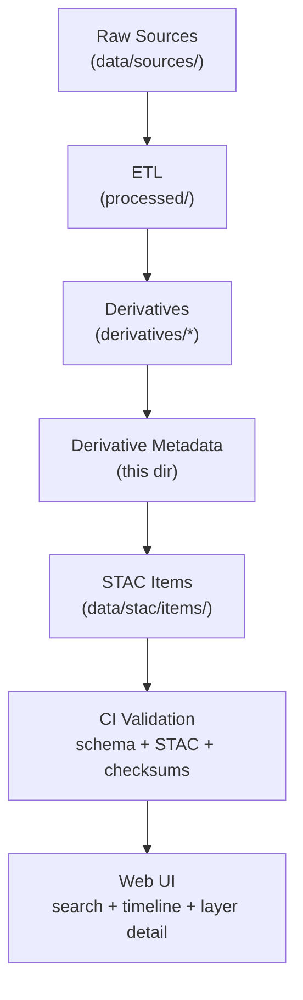

<div align="center">

# 🧾 Kansas-Frontier-Matrix — Derivative Metadata  
`data/derivatives/metadata/`

**Mission:** Store and validate all **metadata records** describing derivative datasets —  
ensuring provenance, lineage, licensing, and schema consistency for every processed layer in `data/derivatives/`.

[](../../../.github/workflows/site.yml)
[](../../../.github/workflows/stac-validate.yml)
[](../../../.github/workflows/codeql.yml)
[](../../../.github/workflows/trivy.yml)
[](../../../.github/workflows/pre-commit.yml)
[](../../../docs/)
[](../../../LICENSE)
[](../../../LICENSE)

</div>

---

## 📚 Table of Contents
- [Overview](#overview)
- [Purpose & Role](#purpose--role)
- [Directory Layout](#directory-layout)
- [Metadata Standards](#metadata-standards)
- [STAC Integration](#stac-integration)
- [Validation & Provenance](#validation--provenance)
- [Adding or Editing Metadata](#adding-or-editing-metadata)
- [Makefile & CI Hooks](#makefile--ci-hooks)
- [Examples](#examples)
- [References](#references)
- [Changelog](#changelog)

---

## 🧠 Overview

This directory maintains **JSON metadata and schema definitions** for every processed derivative dataset  
(e.g., terrain, hydrology, landcover, climate, hazards). It is the **source of truth** for dataset provenance,  
version, lineage, and licensing across the Kansas Frontier Matrix data ecosystem.

Each record documents **where the dataset came from**, **how it was derived**, **who produced it**, and **how to verify it**.  
All metadata conforms to open standards (STAC 1.0, ISO 19115, schema.org) and integrates with the project’s  
[SpatioTemporal Asset Catalog](../../stac/) for discovery and validation.

---

## 🎯 Purpose & Role

- Provide consistent **dataset-level metadata** for all products in `data/derivatives/`.  
- Track **source lineage** via `derived_from`, linking outputs to input datasets.  
- Capture **processing details** (software, parameters, scripts, environment).  
- Record **temporal** and **spatial** extents for catalog & UI filtering.  
- Supply authoritative inputs for **automated STAC generation and validation**.  

Metadata here feeds both:
- the **catalog** → `data/stac/`  
- the **web app** → timeline/map filters, legends, layer details.

---

## 🧱 Directory Layout

```bash
data/
└── derivatives/
    └── metadata/
        ├── schema/
        │   ├── derivative_item.schema.json     # KFM derivative metadata JSON Schema
        │   ├── stac_item.schema.json           # Reference to STAC 1.0 schema (mirrored/pinned)
        │   └── validation_rules.json           # MCP custom validation rules (required/conditional fields)
        ├── terrain/
        │   ├── slope_1m_ks.json
        │   ├── hillshade_1m_ks.json
        ├── hydrology/
        │   ├── flow_direction_1m_ks.json
        │   └── flow_accumulation_1m_ks.json
        ├── landcover/
        │   ├── ndvi_2021_ks.json
        │   └── nlcd_1992_2021_change.json
        ├── climate/
        │   ├── temp_anomaly_1895_2024.json
        │   └── drought_index_spi12.json
        ├── hazards/
        │   ├── tornado_density_1950_2024.json
        │   └── flood_extent_1993_ks.json
        ├── template.json                       # Copy for new derivative metadata
        └── README.md
````

---

## 🧩 Metadata Standards

Each metadata JSON follows the **MCP-compliant hybrid schema**, combining:

* **STAC Core**: `id`, `type`, `stac_version`, `assets`, `bbox`/`geometry`, `datetime`/`start_datetime`/`end_datetime`, `properties`
* **MCP Provenance**: `mcp_provenance`, `derived_from`, `processing:software`, `processing:parameters`, `author`, `created_at`, `last_updated`, `commit`
* **Schema.org (Dataset)**: `keywords`, `citation`, `creator`, `isBasedOn`, `license`

> Use `schema/derivative_item.schema.json` to validate local edits; CI enforces both **KFM schema** and **STAC 1.0**.

---

## 🌐 STAC Integration

Every derivative metadata file is mapped into the broader **STAC Catalog**:

* `data/stac/items/` → per-layer entries (assets + properties)
* `data/stac/collections/` → thematic collections (terrain, hydrology, etc.)

CI (`.github/workflows/stac-validate.yml`) validates items against official STAC schemas and KFM rules.
Checksums from the derivative folders are injected as `checksum:sha256` on relevant assets.

---

## 🧮 Validation & Provenance

All metadata undergoes **multi-layer validation**:

1. **JSON Schema** — required fields & types (`schema/derivative_item.schema.json`).
2. **STAC compliance** — `stac_version`, asset roles, required properties.
3. **Provenance** — `derived_from` paths resolve; checksums exist & match; `commit` (git SHA) optional but recommended.
4. **Temporal** — dataset time ranges align with sources; `start_datetime` ≤ `end_datetime`.

Outputs are recorded to `validation_report.json`.



<!-- END OF MERMAID -->

---

## 🧠 Adding or Editing Metadata

1. **Copy the template**: `cp template.json <domain>/<new_id>.json`.
2. **Fill required fields** (minimum):

   * `id`, `stac_version`, `properties.title`, `properties.description`,
     `properties.license`, `properties["processing:software"]`, `properties.derived_from[]`
   * `assets.data.href`, `assets.data.type` (+ `checksum:sha256` if available)
3. **Add lineage**: `derived_from` → path(s) in `data/sources/` or upstream processed items.
4. **Record environment**: add `processing:parameters` and optional `container:image` if containerized.
5. **Validate** locally: `make validate-metadata`.
6. **Commit with dataset & checksum**; open PR — CI runs all validations.

> Failing validations show field paths and line numbers. Fix locally and re-run.

---

## 🔧 Makefile & CI Hooks

Add (or ensure) these targets exist in the repo’s Makefile:

```make
validate-metadata:
\tjsonschema -i data/derivatives/metadata/**/*.json data/derivatives/metadata/schema/derivative_item.schema.json

stac-validate:
\tstac-validator data/stac/items/**/*.json

check-checksums:
\tpython scripts/validate_checksums.py --root data/derivatives
```

Recommended **pre-commit** hooks:

* `jsonlint` / `prettier --parser json`
* schema check for `data/derivatives/metadata/**/*.json`
* forbid missing `checksum:sha256` on raster/vector assets

---

## 🧪 Examples

### 1) Minimal derivative item (NDVI)

```json
{
  "type": "Feature",
  "stac_version": "1.0.0",
  "id": "ndvi_2021_ks",
  "properties": {
    "title": "NDVI — Kansas 2021",
    "description": "Vegetation index derived from Landsat 8: (B5 - B4) / (B5 + B4).",
    "datetime": "2021-07-01T00:00:00Z",
    "processing:software": "GDAL 3.8.0 + NumPy",
    "processing:parameters": {"expression": "(B5 - B4)/(B5 + B4)"},
    "mcp_provenance": "sha256:a23be8…",
    "derived_from": ["data/sources/landsat8_ks_2021.tif"],
    "license": "CC-BY 4.0",
    "keywords": ["NDVI","Kansas","remote sensing"]
  },
  "assets": {
    "data": {
      "href": "../../landcover/ndvi_2021_ks.tif",
      "type": "image/tiff; application=geotiff; profile=cloud-optimized",
      "checksum:sha256": "e3b0c44298fc1c149afbf4c8996fb924..."
    }
  }
}
```

### 2) Template snippet (`template.json`)

```json
{
  "type": "Feature",
  "stac_version": "1.0.0",
  "id": "<dataset_id>",
  "properties": {
    "title": "<Human readable title>",
    "description": "<What/why/how in 1–3 sentences>",
    "datetime": "<ISO-8601 or use start/end>",
    "start_datetime": "<optional>",
    "end_datetime": "<optional>",
    "processing:software": "<toolchain>",
    "processing:parameters": {},
    "mcp_provenance": "<sha256 or provenance token>",
    "derived_from": [],
    "license": "CC-BY 4.0",
    "keywords": []
  },
  "assets": {
    "data": {
      "href": "<relative path to asset>",
      "type": "<MIME type>",
      "roles": ["data"],
      "checksum:sha256": "<hex>"
    }
  }
}
```

---

## 📖 References

* **STAC 1.0** — [https://stacspec.org](https://stacspec.org)
* **ISO 19115** — [https://www.iso.org/standard/53798.html](https://www.iso.org/standard/53798.html)
* **Schema.org Dataset** — [https://schema.org/Dataset](https://schema.org/Dataset)
* **OGC GeoTIFF** — [https://docs.ogc.org/is/19-008r4/19-008r4.html](https://docs.ogc.org/is/19-008r4/19-008r4.html)
* **Master Coder Protocol Docs** — `../../../docs/standards/`
* **KFM STAC Catalog** — `../../stac/`

---

## 🗓 Changelog

| Version    | Date       | Notes                                                                                                          |
| :--------- | :--------- | :------------------------------------------------------------------------------------------------------------- |
| **v1.2.0** | 2025-10-11 | Added frontmatter versioning, Mermaid lineage diagram, Makefile/CI hooks, and clarified MCP/Schema.org fields. |
| **v1.1.0** | 2025-10-08 | Introduced hybrid MCP+STAC schema and validation rules.                                                        |
| **v1.0.0** | 2025-10-01 | Initial structure: domain folders, template, and baseline schemas.                                             |

```
```
